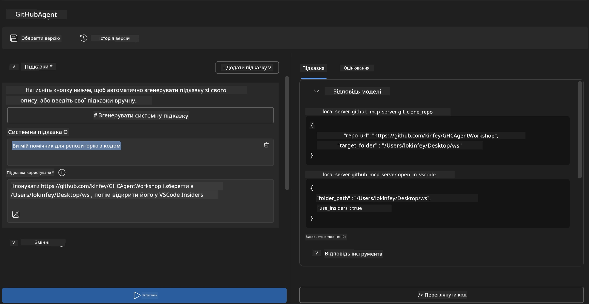
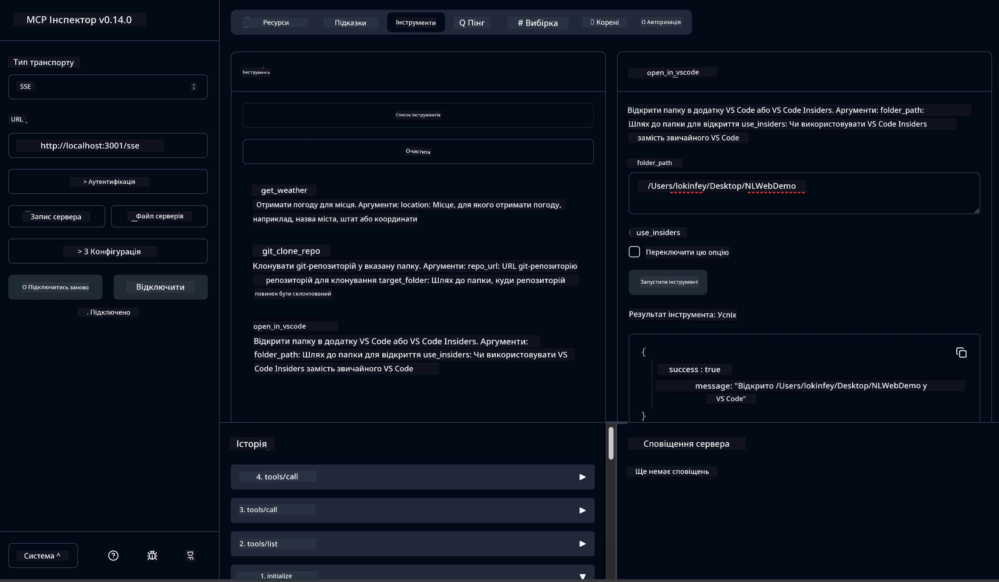

# 🐙 Модуль 4: Практична розробка MCP - користувацький сервер клонування GitHub


> **⚡ Швидкий старт:** Побудуйте MCP сервер готовий до продакшену, який автоматизує клонування репозиторіїв GitHub та інтеграцію з VS Code лише за 30 хвилин!

## 🎯 Навчальні цілі

До кінця цього лабораторного завдання ви зможете:

- ✅ Створити користувацький MCP сервер для реальних робочих процесів розробки
- ✅ Реалізувати функціонал клонування репозиторіїв GitHub через MCP
- ✅ Інтегрувати користувацькі MCP сервери з VS Code та Agent Builder
- ✅ Використовувати режим агента GitHub Copilot з користувацькими MCP інструментами
- ✅ Тестувати та розгортати користувацькі MCP сервери в продакшен-середовищах

## 📋 Передумови

- Завершення лабораторних робіт 1-3 (основи MCP та розширена розробка)
- Підписка на GitHub Copilot ([доступна безкоштовна реєстрація](https://github.com/github-copilot/signup))
- VS Code з розширеннями AI Toolkit та GitHub Copilot
- Встановлений та налаштований Git CLI

## 🏗️ Огляд проєкту

### **Виклик реального розвитку**
Як розробники, ми часто користуємося GitHub для клонування репозиторіїв і відкриття їх у VS Code або VS Code Insiders. Цей ручний процес включає:
1. Відкриття терміналу/командного рядка
2. Перехід у потрібний каталог
3. Використання команди `git clone`
4. Відкриття VS Code у клонтованій директорії

**Наше MCP рішення спрощує це до однієї розумної команди!**

### **Що ви побудуєте**
**GitHub Clone MCP Server** (`git_mcp_server`), який надає:

| Функція | Опис | Перевага |
|---------|-------|----------|
| 🔄 **Інтелектуальне клонування репозиторіїв** | Клонування GitHub репозиторіїв з валідацією | Автоматична перевірка помилок |
| 📁 **Інтелектуальне керування каталогами** | Перевірка та безпечне створення директорій | Запобігає перезапису |
| 🚀 **Кросплатформна інтеграція з VS Code** | Відкриття проєктів у VS Code/Insiders | Безперебійний перехід у робочий процес |
| 🛡️ **Надійне оброблення помилок** | Обробка мережевих, прав доступу та проблем із шляхами | Надійність для продакшену |

---

## 📖 Покрокова реалізація

### Крок 1: Створіть GitHub агента в Agent Builder

1. **Запустіть Agent Builder** через розширення AI Toolkit
2. **Створіть нового агента** з такою конфігурацією:
   ```
   Agent Name: GitHubAgent
   ```

3. **Ініціалізуйте користувацький MCP сервер:**
   - Перейдіть у **Інструменти** → **Додати інструмент** → **MCP Server**
   - Оберіть **"Створити новий MCP сервер"**
   - Виберіть **шаблон Python** для максимальної гнучкості
   - **Назва сервера:** `git_mcp_server`

### Крок 2: Налаштуйте режим агента GitHub Copilot

1. **Відкрийте GitHub Copilot** у VS Code (Ctrl/Cmd + Shift + P → "GitHub Copilot: Open")
2. **Оберіть модель агента** у інтерфейсі Copilot
3. **Виберіть модель Claude 3.7** для покращеного розуміння
4. **Увімкніть інтеграцію MCP** для доступу до інструментів

> **💡 Профі-порада:** Claude 3.7 забезпечує кращий розуміння робочих процесів розробки та патернів обробки помилок.

### Крок 3: Реалізуйте основний функціонал MCP сервера

**Використайте наступний детальний запит з режимом агента GitHub Copilot:**

```
Create two MCP tools with the following comprehensive requirements:

🔧 TOOL A: clone_repository
Requirements:
- Clone any GitHub repository to a specified local folder
- Return the absolute path of the successfully cloned project
- Implement comprehensive validation:
  ✓ Check if target directory already exists (return error if exists)
  ✓ Validate GitHub URL format (https://github.com/user/repo)
  ✓ Verify git command availability (prompt installation if missing)
  ✓ Handle network connectivity issues
  ✓ Provide clear error messages for all failure scenarios

🚀 TOOL B: open_in_vscode
Requirements:
- Open specified folder in VS Code or VS Code Insiders
- Cross-platform compatibility (Windows/Linux/macOS)
- Use direct application launch (not terminal commands)
- Auto-detect available VS Code installations
- Handle cases where VS Code is not installed
- Provide user-friendly error messages

Additional Requirements:
- Follow MCP 1.9.3 best practices
- Include proper type hints and documentation
- Implement logging for debugging purposes
- Add input validation for all parameters
- Include comprehensive error handling
```

### Крок 4: Протестуйте ваш MCP сервер

#### 4a. Тестування в Agent Builder

1. **Запустіть конфігурацію відладки** для Agent Builder
2. **Налаштуйте вашого агента цим системним запитом:**

```
SYSTEM_PROMPT:
You are my intelligent coding repository assistant. You help developers efficiently clone GitHub repositories and set up their development environment. Always provide clear feedback about operations and handle errors gracefully.
```

3. **Перевірте за реалістичними сценаріями користувачів:**

```
USER_PROMPT EXAMPLES:

Scenario : Basic Clone and Open
"Clone {Your GitHub Repo link such as https://github.com/kinfey/GHCAgentWorkshop
 } and save to {The global path you specify}, then open it with VS Code Insiders"
```



**Очікувані результати:**
- ✅ Успішне клонування з підтвердженням шляху
- ✅ Автоматичне відкриття VS Code
- ✅ Чіткі повідомлення про помилки у неправильних сценаріях
- ✅ Коректна обробка крайніх випадків

#### 4b. Тестування в MCP Inspector




---


**🎉 Вітаємо!** Ви успішно створили практичний MCP сервер, готовий до продакшену, який вирішує реальні виклики робочих процесів розробки. Ваш власний сервер клонування GitHub демонструє потужність MCP для автоматизації та підвищення продуктивності розробників.

### 🏆 Досягнення:
- ✅ **MCP розробник** - створив користувацький MCP сервер
- ✅ **Автоматизатор робочих процесів** - оптимізував процеси розробки  
- ✅ **Експерт інтеграції** - з'єднав кілька інструментів розробника
- ✅ **Готово до продакшену** - побудував рішення для розгортання

---

## 🎓 Завершення воркшопу: Ваша подорож з Model Context Protocol

**Шановний учаснику воркшопу,**

Вітаємо з успішним завершенням усіх чотирьох модулів воркшопу Model Context Protocol! Ви пройшли шлях від розуміння базових концепцій AI Toolkit до побудови MCP серверів готових до продакшену, які вирішують реальні виклики розробки.

### 🚀 Резюме вашого навчального шляху:

**[Модуль 1](../lab1/README.md)**: Ви почали з ознайомлення з основами AI Toolkit, тестування моделей та створення першого AI агента.

**[Модуль 2](../lab2/README.md)**: Ви вивчили архітектуру MCP, інтегрували Playwright MCP, і побудували першого агента для автоматизації браузера.

**[Модуль 3](../lab3/README.md)**: Ви підвищили рівень до розробки користувацьких MCP серверів з Weather MCP сервером і навчилися користуватися інструментами налагодження.

**[Модуль 4](../lab4/README.md)**: Тепер ви застосували все на практиці для створення інструменту автоматизації робочого процесу з репозиторіями GitHub.

### 🌟 Чому ви навчилися:

- ✅ **Екосистема AI Toolkit**: Моделі, агенти та патерни інтеграції
- ✅ **Архітектура MCP**: Клиєнт-серверний дизайн, транспортні протоколи та безпека
- ✅ **Інструменти розробника**: Від Playground до Inspector та продакшен-розгортання
- ✅ **Користувацька розробка**: Побудова, тестування та розгортання власних MCP серверів
- ✅ **Практичне застосування**: Вирішення реальних робочих задач за допомогою AI

### 🔮 Ваші подальші кроки:

1. **Створіть власний MCP сервер**: Застосуйте навички для автоматизації власних унікальних робочих процесів
2. **Приєднайтеся до спільноти MCP**: Діліться своїми розробками та навчайтеся у інших
3. **Досліджуйте розширену інтеграцію**: Підключайте MCP сервери до корпоративних систем
4. **Внесіть вклад у Open Source**: Допомагайте покращувати інструменти та документацію MCP

Пам’ятайте, що цей воркшоп — лише початок. Екосистема Model Context Protocol стрімко розвивається, і ви тепер готові бути на передовій інструментів розробки на базі штучного інтелекту.

**Дякуємо за участь та прагнення вчитися!**

Сподіваємося, що цей воркшоп породив ідеї, які змінять ваш підхід до створення та взаємодії з AI інструментами у вашій розробці.

**Успішного кодування!**

---

## Що далі

Вітаємо з успішним завершенням усіх лабораторних робіт у Модулі 10!

- Повернутися до: [Огляд Модуля 10](../README.md)
- Продовжити до: [Модуль 11: MCP Server Hands-On Labs](../../11-MCPServerHandsOnLabs/README.md)

---

<!-- CO-OP TRANSLATOR DISCLAIMER START -->
**Відмова від відповідальності**:  
Цей документ був перекладений за допомогою сервісу автоматичного перекладу [Co-op Translator](https://github.com/Azure/co-op-translator). Хоч ми й прагнемо до точності, просимо враховувати, що автоматичні переклади можуть містити помилки або неточності. Оригінальний документ його рідною мовою слід вважати авторитетним джерелом. Для критичної інформації рекомендується звертатись до професійного перекладача. Ми не несемо відповідальності за будь-які непорозуміння чи неправильне тлумачення, що виникли у результаті використання цього перекладу.
<!-- CO-OP TRANSLATOR DISCLAIMER END -->