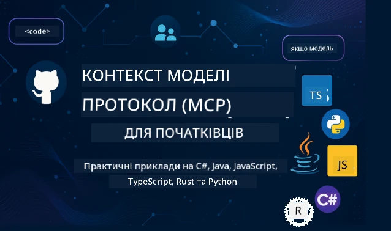

 

[](https://GitHub.com/microsoft/mcp-for-beginners/graphs/contributors)
[](https://GitHub.com/microsoft/mcp-for-beginners/issues)
[](https://GitHub.com/microsoft/mcp-for-beginners/pulls)
[](http://makeapullrequest.com)

[](https://GitHub.com/microsoft/mcp-for-beginners/watchers)
[](https://GitHub.com/microsoft/mcp-for-beginners/fork)
[](https://GitHub.com/microsoft/mcp-for-beginners/stargazers)


[](https://discord.gg/nTYy5BXMWG)

Дотримуйтесь цих кроків, щоб почати користуватися цими ресурсами:
1. **Відгалужте репозиторій**: Натисніть [](https://GitHub.com/microsoft/mcp-for-beginners/fork)
2. **Склонуйте репозиторій**:   `git clone https://github.com/microsoft/mcp-for-beginners.git`
3. **Приєднуйтесь до** [](https://discord.gg/nTYy5BXMWG)


### 🌐 Підтримка кількох мов

#### Підтримується через GitHub Action (автоматизовано та завжди актуально)

<!-- CO-OP TRANSLATOR LANGUAGES TABLE START -->
[Arabic](../ar/README.md) | [Bengali](../bn/README.md) | [Bulgarian](../bg/README.md) | [Burmese (Myanmar)](../my/README.md) | [Chinese (Simplified)](../zh-CN/README.md) | [Chinese (Traditional, Hong Kong)](../zh-HK/README.md) | [Chinese (Traditional, Macau)](../zh-MO/README.md) | [Chinese (Traditional, Taiwan)](../zh-TW/README.md) | [Croatian](../hr/README.md) | [Czech](../cs/README.md) | [Danish](../da/README.md) | [Dutch](../nl/README.md) | [Estonian](../et/README.md) | [Finnish](../fi/README.md) | [French](../fr/README.md) | [German](../de/README.md) | [Greek](../el/README.md) | [Hebrew](../he/README.md) | [Hindi](../hi/README.md) | [Hungarian](../hu/README.md) | [Indonesian](../id/README.md) | [Italian](../it/README.md) | [Japanese](../ja/README.md) | [Kannada](../kn/README.md) | [Korean](../ko/README.md) | [Lithuanian](../lt/README.md) | [Malay](../ms/README.md) | [Malayalam](../ml/README.md) | [Marathi](../mr/README.md) | [Nepali](../ne/README.md) | [Nigerian Pidgin](../pcm/README.md) | [Norwegian](../no/README.md) | [Persian (Farsi)](../fa/README.md) | [Polish](../pl/README.md) | [Portuguese (Brazil)](../pt-BR/README.md) | [Portuguese (Portugal)](../pt-PT/README.md) | [Punjabi (Gurmukhi)](../pa/README.md) | [Romanian](../ro/README.md) | [Russian](../ru/README.md) | [Serbian (Cyrillic)](../sr/README.md) | [Slovak](../sk/README.md) | [Slovenian](../sl/README.md) | [Spanish](../es/README.md) | [Swahili](../sw/README.md) | [Swedish](../sv/README.md) | [Tagalog (Filipino)](../tl/README.md) | [Tamil](../ta/README.md) | [Telugu](../te/README.md) | [Thai](../th/README.md) | [Turkish](../tr/README.md) | [Ukrainian](./README.md) | [Urdu](../ur/README.md) | [Vietnamese](../vi/README.md)

> **Віддаєте перевагу клонуванню локально?**
>
> Цей репозиторій містить понад 50 мовних перекладів, що значно збільшує розмір завантаження. Щоб клонувати без перекладів, використовуйте sparse checkout:
>
> **Bash / macOS / Linux:**
> ```bash
> git clone --filter=blob:none --sparse https://github.com/microsoft/mcp-for-beginners.git
> cd mcp-for-beginners
> git sparse-checkout set --no-cone '/*' '!translations' '!translated_images'
> ```
>
> **CMD (Windows):**
> ```cmd
> git clone --filter=blob:none --sparse https://github.com/microsoft/mcp-for-beginners.git
> cd mcp-for-beginners
> git sparse-checkout set --no-cone "/*" "!translations" "!translated_images"
> ```
>
> Це дасть вам усе необхідне для проходження курсу з набагато швидшим завантаженням.
<!-- CO-OP TRANSLATOR LANGUAGES TABLE END -->

# 🚀 Навчальна програма Model Context Protocol (MCP) для початківців

## **Вивчайте MCP на практичних прикладах коду мовами C#, Java, JavaScript, Rust, Python та TypeScript**

## 🧠 Огляд навчальної програми Model Context Protocol
Ласкаво просимо в подорож у світ Model Context Protocol! Якщо ви коли-небудь задумувалися, як AI-застосунки взаємодіють з різними інструментами та сервісами, ви ось-ось відкриєте для себе елегантне рішення, яке змінює спосіб створення інтелектуальних систем розробниками.

Уявіть MCP як універсальний перекладач для AI-застосунків — так само, як USB-порти дозволяють підключати будь-який пристрій до вашого комп’ютера, MCP дозволяє AI-моделям підключатися до будь-яких інструментів або сервісів стандартизованим способом. Чи ви створюєте свій перший чатбот, чи працюєте над складними AI-робочими процесами — розуміння MCP дасть вам змогу створювати потужніші і гнучкіші застосунки.

Ця навчальна програма розроблена з розумінням і турботою про ваш навчальний шлях. Ми почнемо з простих понять, які ви вже знаєте, і поступово розвинемо ваші навички через практичні вправи на улюбленій мові програмування. Кожен крок містить чіткі пояснення, практичні приклади і багато підтримки.

До кінця цієї подорожі ви матимете впевненість створювати власні MCP-сервери, інтегрувати їх із популярними AI-платформами та розуміти, як ця технологія формує майбутнє розробки AI. Розпочнемо цю захопливу пригоду разом!

### Офіційна документація та специфікації

Ця навчальна програма відповідає **специфікації MCP від 2025-11-25** (останній стабільний реліз). Специфікація MCP використовує версіювання за датою (формат РРРР-ММ-ДД) для чіткого відстеження версій протоколу.

Ці ресурси стають дедалі ціннішими з вашим ростом розуміння, та не відчувайте тиск прочитати все одразу. Починайте з тем, які вас найбільше цікавлять!
- 📘 [Документація MCP](https://modelcontextprotocol.io/) – Це ваш основний ресурс із покроковими підручниками та керівництвами користувача. Документація написана для початківців, з чіткими прикладами, за якими можна легко слідувати у власному темпі.
- 📜 [Специфікація MCP](https://modelcontextprotocol.io/specification/2025-11-25) – Цей ресурс є вашим повним довідником. Під час проходження курсу ви неодноразово повертатиметесь сюди, аби знаходити специфічні деталі та вивчати розширені функції.
- 📜 [Версіювання специфікації MCP](https://modelcontextprotocol.io/specification/versioning) – Тут міститься інформація про історію версій протоколу та використання дат в MCP.
- 🧑‍💻 [Репозиторій MCP на GitHub](https://github.com/modelcontextprotocol) – Тут ви знайдете SDK, інструменти і приклади коду різними мовами програмування. Це наче скарбниця практичних прикладів і готових компонентів.
- 🌐 [Спільнота MCP](https://github.com/orgs/modelcontextprotocol/discussions) – Приєднуйтесь до інших учнів та досвідчених розробників для обговорень MCP. Це підтримуюча спільнота, де вітаються питання та активно діляться знаннями.
  
## Цілі навчання

Наприкінці цієї навчальної програми ви почуватиметесь впевнено і захоплено новими знаннями. Ось чого ви досягнете:

• **Зрозумієте основи MCP**: Ви осягнете, що таке Model Context Protocol і чому він революціонізує спосіб роботи AI-застосунків разом, з аналогіями і прикладами, які легко зрозуміти.

• **Створите свій перший MCP-сервер**: Ви створите робочий MCP-сервер обраною мовою програмування, починаючи з простих прикладів і поступово підвищуючи рівень складності.

• **Підключите AI-моделі до реальних інструментів**: Ви навчитесь долати розрив між AI-моделями та справжніми сервісами, надаючи вашим застосункам потужні нові можливості.

• **Застосуєте найкращі практики безпеки**: Ви дізнаєтесь, як захистити свої реалізації MCP, щоб убезпечити і застосунки, і користувачів.

• **Розгорнете з упевненістю**: Ви знатимете, як перевести проекти MCP з розробки у продуктивне середовище, використовуючи практичні стратегії розгортання.

• **Приєднаєтесь до спільноти MCP**: Ви станете частиною зростаючої спільноти розробників, які формують майбутнє створення AI-застосунків. 

## Важливий фон

Перед тим, як зануритися в деталі MCP, переконаємося, що ви добре орієнтуєтесь у базових поняттях. Не хвилюйтеся, якщо у цих сферах ви не експерт — ми пояснимо все, що потрібно знати, по мірі вивчення!

### Розуміння протоколів (основа)

Уявіть протокол як набор правил для розмови. Коли ви телефонуєте другу, ви обоє знаєте, що треба сказати «привіт» на початку, говорити по черзі і завершити розмову словами «до побачення». Комп’ютерні програми також потребують таких правил для ефективної комунікації.

MCP — це протокол, набір узгоджених правил, які допомагають AI-моделям і застосункам вести продуктивний «діалог» з інструментами та сервісами. Як наявність правил робить людське спілкування гладким, так і MCP робить комунікацію AI-застосунків надійнішою та потужнішою.

### Відносини клієнт-сервер (як працюють програми разом)

Ви щодня взаємодієте з відносинами клієнт-сервер! Коли ви користуєтесь браузером (клієнтом) для відвідування вебсайту, ви підключаєтесь до веб-сервера, який надсилає вам вміст сторінки. Браузер знає, як запитувати інформацію, а сервер — як на неї відповідати.

В MCP є подібна модель: AI-моделі діють як клієнти, які роблять запити, тоді як MCP-сервери надають необхідні можливості. Це як мати помічника (сервер), до якого AI може звернутися для виконання конкретних завдань.

### Чому стандарти важливі (щоб усе працювало разом)

Уявіть, якби кожен виробник авто використовував різні форми бензинових насосів — для кожної машини потрібен був би окремий адаптер! Стандарти означають узгодження загальних підходів, щоб усе працювало безшовно.

MCP забезпечує таку стандартизацію для AI-застосунків. Замість того, щоб кожна AI-модель писала унікальний код для роботи з кожним інструментом, MCP створює універсальний спосіб їхньої взаємодії. Це дозволяє розробникам будувати інструменти один раз і використовувати їх з багатьма різними AI-системами.

## 🧭 Огляд вашого навчального шляху

Ваша подорож MCP побудована послідовно для поступового зростання впевненості та навичок. Кожна фаза вводить нові поняття і одночасно зміцнює вже вивчені.

### 🌱 Фаза основ: Розуміння бази (модулі 0-2)

Ось тут починається ваша пригода! Ми познайомимо вас з поняттями MCP через знайомі аналогії і прості приклади. Ви зрозумієте, що таке MCP, чому він існує і як вписується у ширший світ розробки AI.

• **Модуль 0 — Вступ до MCP**: Ми почнемо з розгляду, що таке MCP і чому він важливий для сучасних AI-застосунків. Ви побачите реальні приклади MCP у дії і зрозумієте, як він вирішує типові проблеми розробників.

• **Модуль 1 — Пояснення основних концепцій**: Тут ви вивчите ключові будівельні блоки MCP. Ми використаємо багато аналогій і візуальних прикладів, щоб ці концепції стали вам природними і зрозумілими.

• **Модуль 2 — Безпека в MCP**: Безпека може звучати складно, але ми покажемо, як MCP має вбудовані функції безпеки, і навчимо вас найкращим практикам для захисту застосунків з самого початку.

### 🔨 Фаза будівництва: Створення перших реалізацій (модуль 3)

Тепер починається справжнє задоволення! Ви отримаєте практичний досвід створення реальних MCP-серверів і клієнтів. Не хвилюйтесь — ми почнемо з простого і проведемо вас через кожен крок.
Цей модуль включає кілька практичних посібників, які дозволяють вам практикуватися у вашій улюбленій мові програмування. Ви створите свій перший сервер, побудуєте клієнта для підключення до нього, а також інтегруєтеся з популярними інструментами розробки, такими як VS Code.

Кожен посібник містить повні приклади коду, поради з усунення несправностей та пояснення, чому ми робимо певні дизайнерські вибори. До кінця цього етапу у вас будуть працюючі реалізації MCP, якими ви зможете пишатися!

### 🚀 Етап розвитку: просунуті концепції та застосування у реальному світі (модулі 4-5)

Опісля опанування основ ви готові дослідити більш складні функції MCP. Ми розглянемо практичні стратегії реалізації, методи відлагодження та розглянемо просунуті теми, такі як мульти-модальна інтеграція штучного інтелекту.

Ви також навчитеся масштабувати свої реалізації MCP для продуктивного використання та інтегрувати їх із хмарними платформами, такими як Azure. Ці модулі підготують вас до побудови MCP-рішень, які можуть впоратися з реальними вимогами.

### 🌟 Етап майстерності: спільнота та спеціалізація (модулі 6-11)

Останній етап зосереджений на приєднанні до спільноти MCP і спеціалізації в тих областях, які вас найбільше цікавлять. Ви дізнаєтеся, як вносити свій внесок у проекти MCP з відкритим кодом, впроваджувати просунуті схеми аутентифікації та будувати комплексні рішення з інтеграцією баз даних.

Особливу увагу заслуговує модуль 11 — це повний практичний курс з 13 лабораторних робіт, який навчає створювати готові до продукції MCP сервери з інтеграцією PostgreSQL. Це щось на кшталт підсумкового проєкту, що об’єднує все, чого ви навчилися!

### 📚 Повна структура навчального курсу

| Модуль | Тема | Опис | Посилання |
|--------|-------|-------------|------|
| **Модулі 0-3: Основи** | | | |
| 00 | Вступ до MCP | Огляд протоколу Model Context та його значення в AI-конвеєрах | [Читати далі](./00-Introduction/README.md) |
| 01 | Основні концепції | Детальний огляд основних понять MCP | [Читати далі](./01-CoreConcepts/README.md) |
| 02 | Безпека в MCP | Загрози безпеці та найкращі практики | [Читати далі](./02-Security/README.md) |
| 03 | Початок роботи з MCP | Налаштування середовища, базові сервери/клієнти, інтеграція | [Читати далі](./03-GettingStarted/README.md) |
| **Модуль 3: Створення першого сервера та клієнта** | | | |
| 3.1 | Перший сервер | Створіть свій перший MCP сервер | [Посібник](./03-GettingStarted/01-first-server/README.md) |
| 3.2 | Перший клієнт | Розробіть базовий MCP клієнт | [Посібник](./03-GettingStarted/02-client/README.md) |
| 3.3 | Клієнт з LLM | Інтеграція великих мовних моделей | [Посібник](./03-GettingStarted/03-llm-client/README.md) |
| 3.4 | Інтеграція VS Code | Використання MCP серверів у VS Code | [Посібник](./03-GettingStarted/04-vscode/README.md) |
| 3.5 | stdio сервер | Створення серверів із використанням транспорту stdio | [Посібник](./03-GettingStarted/05-stdio-server/README.md) |
| 3.6 | HTTP потік | Реалізація HTTP потокової передачі в MCP | [Посібник](./03-GettingStarted/06-http-streaming/README.md) |
| 3.7 | AI набір інструментів | Використання AI Toolkit з MCP | [Посібник](./03-GettingStarted/07-aitk/README.md) |
| 3.8 | Тестування | Тестування реалізації MCP сервера | [Посібник](./03-GettingStarted/08-testing/README.md) |
| 3.9 | Розгортання | Розгортання MCP серверів у продуктивне середовище | [Посібник](./03-GettingStarted/09-deployment/README.md) |
| 3.10 | Розширене використання сервера | Використання просунутих серверів для розширеного функціоналу та покращеної архітектури | [Посібник](./03-GettingStarted/10-advanced/README.md) |
| 3.11 | Проста автентифікація | Розділ, що показує автентифікацію з початку та RBAC | [Посібник](./03-GettingStarted/11-simple-auth/README.md) |
| 3.12 | MCP хости | Налаштування Claude Desktop, Cursor, Cline та інших MCP хостів | [Посібник](./03-GettingStarted/12-mcp-hosts/README.md) |
| 3.13 | MCP Інспектор | Відлагодження та тестування MCP серверів за допомогою інструмента Inspector | [Посібник](./03-GettingStarted/13-mcp-inspector/README.md) |
| **Модулі 4-5: Практичне та просунуте** | | | |
| 04 | Практична реалізація | SDK, налагодження, тестування, повторно використовувані шаблони запитів | [Читати далі](./04-PracticalImplementation/README.md) |
| 4.1 | Пагінація | Обробка великих наборів результатів за допомогою пагінації на основі курсорів | [Посібник](./04-PracticalImplementation/pagination/README.md) |
| 05 | Просунуті теми MCP | Мульти-модальний ШІ, масштабування, корпоративне використання | [Читати далі](./05-AdvancedTopics/README.md) |
| 5.1 | Інтеграція Azure | Інтеграція MCP з Azure | [Посібник](./05-AdvancedTopics/mcp-integration/README.md) |
| 5.2 | Мульти-модальність | Робота з кількома модальностями | [Посібник](./05-AdvancedTopics/mcp-multi-modality/README.md) |
| 5.3 | Демонстрація OAuth2 | Реалізація аутентифікації OAuth2 | [Посібник](./05-AdvancedTopics/mcp-oauth2-demo/README.md) |
| 5.4 | Кореневі контексти | Розуміння та реалізація кореневих контекстів | [Посібник](./05-AdvancedTopics/mcp-root-contexts/README.md) |
| 5.5 | Маршрутизація | Стратегії маршрутизації MCP | [Посібник](./05-AdvancedTopics/mcp-routing/README.md) |
| 5.6 | Вибірка | Техніки вибірки в MCP | [Посібник](./05-AdvancedTopics/mcp-sampling/README.md) |
| 5.7 | Масштабування | Масштабування реалізацій MCP | [Посібник](./05-AdvancedTopics/mcp-scaling/README.md) |
| 5.8 | Безпека | Просунуті аспекти безпеки | [Посібник](./05-AdvancedTopics/mcp-security/README.md) |
| 5.9 | Веб-пошук | Реалізація можливостей веб-пошуку | [Посібник](./05-AdvancedTopics/web-search-mcp/README.md) |
| 5.10 | Потокова передача в реальному часі | Побудова функціоналу потокової передачі в реальному часі | [Посібник](./05-AdvancedTopics/mcp-realtimestreaming/README.md) |
| 5.11 | Пошук у реальному часі | Реалізація пошуку в реальному часі | [Посібник](./05-AdvancedTopics/mcp-realtimesearch/README.md) |
| 5.12 | Аутентифікація Entra ID | Аутентифікація з Microsoft Entra ID | [Посібник](./05-AdvancedTopics/mcp-security-entra/README.md) |
| 5.13 | Інтеграція Foundry | Інтеграція з Azure AI Foundry | [Посібник](./05-AdvancedTopics/mcp-foundry-agent-integration/README.md) |
| 5.14 | Інженерія контексту | Методи ефективної інженерії контексту | [Посібник](./05-AdvancedTopics/mcp-contextengineering/README.md) |
| 5.15 | Кастомні транспорти MCP | Реалізація кастомних транспортів | [Посібник](./05-AdvancedTopics/mcp-transport/README.md) |
| 5.16 | Особливості протоколу | Сповіщення про прогрес, скасування, шаблони ресурсів | [Посібник](./05-AdvancedTopics/mcp-protocol-features/README.md) |
| **Модулі 6-10: Спільнота та кращі практики** | | | |
| 06 | Внесок у спільноту | Як зробити внесок в екосистему MCP | [Посібник](./06-CommunityContributions/README.md) |
| 07 | Висновки раннього впровадження | Історії реалізації у реальному світі | [Посібник](./07-LessonsfromEarlyAdoption/README.md) |
| 08 | Кращі практики MCP | Продуктивність, відмовостійкість, стійкість | [Посібник](./08-BestPractices/README.md) |
| 09 | Вивчення кейсів MCP | Приклади практичної реалізації | [Посібник](./09-CaseStudy/README.md) |
| 10 | Практичний семінар | Створення MCP сервера з AI Toolkit | [Лабораторна](./10-StreamliningAIWorkflowsBuildingAnMCPServerWithAIToolkit/README.md) |
| **Модуль 11: MCP сервер – практичні лабораторні роботи** | | | |
| 11 | Інтеграція MCP сервера з базою даних | Комплексний практичний курс з 13 лабораторних робіт для інтеграції з PostgreSQL | [Лабораторні роботи](./11-MCPServerHandsOnLabs/README.md) |
| 11.1 | Вступ | Огляд MCP з інтеграцією бази даних та кейс роздрібної аналітики | [Лабораторна 00](./11-MCPServerHandsOnLabs/00-Introduction/README.md) |
| 11.2 | Основна архітектура | Розуміння архітектури MCP сервера, шарів бази даних та патернів безпеки | [Лабораторна 01](./11-MCPServerHandsOnLabs/01-Architecture/README.md) |
| 11.3 | Безпека та мультиоренність | Row-Level Security, аутентифікація та доступ до даних кількох орендарів | [Лабораторна 02](./11-MCPServerHandsOnLabs/02-Security/README.md) |
| 11.4 | Налаштування середовища | Налаштування середовища розробки, Docker, ресурси Azure | [Лабораторна 03](./11-MCPServerHandsOnLabs/03-Setup/README.md) |
| 11.5 | Проєктування бази даних | Налаштування PostgreSQL, дизайн схеми роздрібної торгівлі, прикладові дані | [Лабораторна 04](./11-MCPServerHandsOnLabs/04-Database/README.md) |
| 11.6 | Реалізація MCP сервера | Створення FastMCP сервера з інтеграцією бази даних | [Лабораторна 05](./11-MCPServerHandsOnLabs/05-MCP-Server/README.md) |
| 11.7 | Розробка інструментів | Створення інструментів для запитів до бази даних та інспекції схеми | [Лабораторна 06](./11-MCPServerHandsOnLabs/06-Tools/README.md) |
| 11.8 | Семантичний пошук | Реалізація векторних ембеддингів з Azure OpenAI та pgvector | [Лабораторна 07](./11-MCPServerHandsOnLabs/07-Semantic-Search/README.md) |
| 11.9 | Тестування та налагодження | Стратегії тестування, інструменти налагодження та перевірки | [Лабораторна 08](./11-MCPServerHandsOnLabs/08-Testing/README.md) |
| 11.10 | Інтеграція VS Code | Налаштування інтеграції MCP у VS Code та використання AI Chat | [Лабораторна 09](./11-MCPServerHandsOnLabs/09-VS-Code/README.md) |
| 11.11 | Стратегії розгортання | Розгортання з Docker, Azure Container Apps та розгляд масштабування | [Лабораторна 10](./11-MCPServerHandsOnLabs/10-Deployment/README.md) |
| 11.12 | Моніторинг | Application Insights, логування, моніторинг продуктивності | [Лабораторна 11](./11-MCPServerHandsOnLabs/11-Monitoring/README.md) |
| 11.13 | Кращі практики | Оптимізація продуктивності, посилення безпеки та поради для продуктивного середовища | [Лабораторна 12](./11-MCPServerHandsOnLabs/12-Best-Practices/README.md) |

### 💻 Приклади коду проектів

Одна з найцікавіших частин навчання MCP — це поступовий розвиток ваших навичок кодування. Ми розробили приклади коду так, щоб вони були простими на початковому етапі і ставали більш складними зі зростанням вашого розуміння. Ось як ми вводимо концепції — код легкий для розуміння, але демонструє справжні принципи MCP, ви зрозумієте не лише те, що цей код робить, а й чому він структурований саме так і як він вписується у більші MCP-додатки.

#### Базові приклади калькулятора MCP

| Мова | Опис | Посилання |
|----------|-------------|------|
| C# | Приклад MCP сервера | [Переглянути код](./03-GettingStarted/samples/csharp/README.md) |
| Java | MCP калькулятор | [Переглянути код](./03-GettingStarted/samples/java/calculator/README.md) |
| JavaScript | Демонстрація MCP | [Переглянути код](./03-GettingStarted/samples/javascript/README.md) |
| Python | MCP сервер | [Переглянути код](../../03-GettingStarted/samples/python/mcp_calculator_server.py) |
| TypeScript | Приклад MCP | [Переглянути код](./03-GettingStarted/samples/typescript/README.md) |
| Rust | Приклад MCP | [Переглянути код](./03-GettingStarted/samples/rust/README.md) |

#### Просунуті реалізації MCP

| Мова | Опис | Посилання |
|----------|-------------|------|
| C# | Просунутий приклад | [Переглянути код](./04-PracticalImplementation/samples/csharp/README.md) |
| Java зі Spring | Приклад Container App | [Переглянути код](./04-PracticalImplementation/samples/java/containerapp/README.md) |
| JavaScript | Просунутий приклад | [Переглянути код](./04-PracticalImplementation/samples/javascript/README.md) |
| Python | Складна реалізація | [Переглянути код](./04-PracticalImplementation/samples/python/README.md) |
| TypeScript | Приклад Container | [Переглянути код](./04-PracticalImplementation/samples/typescript/README.md) |


## 🎯 Необхідні умови для вивчення MCP

Щоби максимально ефективно використовувати цей курс, вам слід мати:

- Базові знання програмування принаймні однієї з наступних мов: C#, Java, JavaScript, Python або TypeScript
- Розуміння клієнт-серверної моделі та API
- Знайомство з концепціями REST і HTTP
- (За бажанням) Фон у концепціях ШІ/МН

- Участь у наших спільнотах для підтримки

## 📚 Посібник з навчання та ресурси

Цей репозиторій включає кілька ресурсів, які допоможуть вам орієнтуватися та ефективно навчатися:

### Посібник з навчання
Детальний [Посібник для вивчення](./study_guide.md) доступний, щоб допомогти вам ефективно орієнтуватися в цьому репозиторії. Ця візуальна карта навчальної програми показує, як усі теми пов’язані між собою, і надає рекомендації щодо ефективного використання зразкових проектів. Це особливо корисно, якщо ви візуальний тип навчання, який любить бачити загальну картину.

Посібник включає:
- Візуальна карта навчальної програми, що показує всі охоплені теми
- Детальний аналіз кожного розділу репозиторію
- Рекомендації щодо використання зразкових проектів
- Рекомендовані навчальні шляхи для різних рівнів навичок
- Додаткові ресурси для доповнення вашого навчального шляху

### Журнал змін

Ми підтримуємо детальний [Журнал змін](./changelog.md), який відслідковує всі значущі оновлення матеріалів навчальної програми, щоб ви могли бути в курсі останніх покращень і доповнень.
- Додавання нового контенту  
- Структурні зміни  
- Покращення функціональності  
- Оновлення документації  

## 🛠️ Як ефективно використовувати цю навчальну програму

Кожен урок у цьому посібнику включає:

1. Чіткі пояснення концепцій MCP  
2. Живі приклади коду на кількох мовах  
3. Вправи для створення реальних MCP додатків  
4. Додаткові ресурси для досвідчених учнів  

### Вивчаємо MCP з C# - Серія підручників  
Давайте вивчимо Model Context Protocol (MCP) — передовий фреймворк, створений для стандартизації взаємодії між AI моделями та клієнтськими додатками. У цьому початковому уроці ми познайомимо вас з MCP і проведемо через створення вашого першого MCP сервера.  
#### C#: [https://aka.ms/letslearnmcp-csharp](https://aka.ms/letslearnmcp-csharp)  
#### Java: [https://aka.ms/letslearnmcp-java](https://aka.ms/letslearnmcp-java)  
#### JavaScript: [https://aka.ms/letslearnmcp-javascript](https://aka.ms/letslearnmcp-javascript)  
#### Python: [https://aka.ms/letslearnmcp-python](https://aka.ms/letslearnmcp-python)

## 🎓 Ваш шлях у MCP починається

Вітаємо! Ви щойно зробили перший крок у захоплюючій подорожі, яка розширить ваші програмні можливості й з’єднає вас із найсучаснішими розробками у сфері AI.

### Що ви вже досягли

Прочитавши цей вступ, ви вже почали будувати фундамент знань MCP. Ви розумієте, що таке MCP, чому це важливо, і як ця навчальна програма підтримуватиме ваш процес навчання. Це значне досягнення і початок вашої експертизи в цій важливій технології.

### Пригоди попереду

Рухаючись по модулях, пам’ятайте, що кожен експерт колись був початківцем. Концепції, які зараз можуть здаватися складними, стануть для вас зрозумілими з практикою та застосуванням. Кожен невеликий крок будує потужні можливості, які слугуватимуть вам протягом усього професійного шляху.

### Ваша підтримка

Ви приєднуєтеся до спільноти учнів і експертів, які захоплені MCP і готові допомагати іншим досягати успіху. Якщо ви застрягли на завданні або хочете поділитися проривом, спільнота підтримує вас на цьому шляху.

Якщо у вас виникнуть труднощі або питання щодо створення AI додатків, приєднуйтесь до обговорень з іншими учнями та досвідченими розробниками про MCP. Це дружня спільнота, де вітаються запитання і вільно діляться знаннями.

[](https://discord.gg/nTYy5BXMWG)

Якщо у вас є відгуки про продукт або помилки під час розробки, відвідайте:

[](https://aka.ms/foundry/forum)

### Готові почати?

Ваша пригода з MCP починається прямо зараз! Почніть з Модуля 0, щоб зануритися у перші практичні вправи MCP, або досліджуйте зразкові проєкти, щоб побачити, що ви будете створювати. Пам’ятайте — кожен експерт починав саме там, де ви зараз, і з терпінням та практикою ви будете вражені своїми досягненнями.

Ласкаво просимо у світ розробки Model Context Protocol. Давайте разом створимо щось дивовижне!

## 🤝 Внесок у спільноту навчання

Ця навчальна програма стає кращою завдяки внескам таких учнів, як ви! Чи виправляєте ви опечатку, пропонуєте зрозуміліше пояснення чи додаєте новий приклад, ваші внески допомагають іншим початківцям досягати успіху.

Дякуємо Microsoft Valued Professional [Shivam Goyal](https://www.linkedin.com/in/shivam2003/) за внесок коду.

Процес внесення змін спроектовано так, щоб він був дружнім і підтримуючим. Більшість внесків вимагають Contributor License Agreement (CLA), але автоматизовані інструменти допоможуть вам пройти цей процес без проблем.

## 📜 Відкрите навчання з відкритим кодом

Уся ця навчальна програма доступна під ліцензією MIT [LICENSE](../../LICENSE), що означає, що ви можете вільно використовувати, змінювати і поширювати її. Це підтримує нашу місію зробити знання MCP доступним для розробників у всьому світі.

## 🤝 Керівництво по внеску

Цей проєкт вітає внески та пропозиції. Більшість внесків вимагає, щоб ви погодилися з Contributor License Agreement (CLA), який підтверджує ваше право та фактичну згоду надати нам права на використання вашого внеску. Для деталей відвідайте <https://cla.opensource.microsoft.com>.

Коли ви надсилаєте pull request, бот CLA автоматично визначить, чи потрібно подавати CLA, і відповідно позначить PR (наприклад, перевірка статусу, коментар). Просто дотримуйтесь інструкцій бота. Вам потрібно буде це зробити лише один раз для всіх репозиторіїв, що використовують наш CLA.

Цей проект прийняв [Кодекс поведінки Microsoft Open Source](https://opensource.microsoft.com/codeofconduct/). Для отримання додаткової інформації дивіться [FAQ Кодексу поведінки](https://opensource.microsoft.com/codeofconduct/faq/) або зв'яжіться з [opencode@microsoft.com](mailto:opencode@microsoft.com) для додаткових питань чи коментарів.

---

*Готові розпочати свою подорож MCP? Почніть з [Модуля 00 - Вступ до MCP](./00-Introduction/README.md) і зробіть перші кроки у світі розробки Model Context Protocol!*


## 🎒 Інші курси  
Наша команда розробляє інші курси! Ознайомтесь:

<!-- CO-OP TRANSLATOR OTHER COURSES START -->
### LangChain  
[](https://aka.ms/langchain4j-for-beginners)  
[](https://aka.ms/langchainjs-for-beginners?WT.mc_id=m365-94501-dwahlin)  
[](https://github.com/microsoft/langchain-for-beginners?WT.mc_id=m365-94501-dwahlin)  
---

### Azure / Edge / MCP / Agents  
[](https://github.com/microsoft/AZD-for-beginners?WT.mc_id=academic-105485-koreyst)  
[](https://github.com/microsoft/edgeai-for-beginners?WT.mc_id=academic-105485-koreyst)  
[](https://github.com/microsoft/mcp-for-beginners?WT.mc_id=academic-105485-koreyst)  
[](https://github.com/microsoft/ai-agents-for-beginners?WT.mc_id=academic-105485-koreyst)

---

### Серія Generative AI  
[](https://github.com/microsoft/generative-ai-for-beginners?WT.mc_id=academic-105485-koreyst)  
[-9333EA?style=for-the-badge&labelColor=E5E7EB&color=9333EA)](https://github.com/microsoft/Generative-AI-for-beginners-dotnet?WT.mc_id=academic-105485-koreyst)  
[-C084FC?style=for-the-badge&labelColor=E5E7EB&color=C084FC)](https://github.com/microsoft/generative-ai-for-beginners-java?WT.mc_id=academic-105485-koreyst)  
[-E879F9?style=for-the-badge&labelColor=E5E7EB&color=E879F9)](https://github.com/microsoft/generative-ai-with-javascript?WT.mc_id=academic-105485-koreyst)

---

### Основне навчання  
[](https://aka.ms/ml-beginners?WT.mc_id=academic-105485-koreyst)  
[](https://aka.ms/datascience-beginners?WT.mc_id=academic-105485-koreyst)  
[](https://aka.ms/ai-beginners?WT.mc_id=academic-105485-koreyst)  
[](https://github.com/microsoft/Security-101?WT.mc_id=academic-96948-sayoung)  
[](https://aka.ms/webdev-beginners?WT.mc_id=academic-105485-koreyst)  
[](https://aka.ms/iot-beginners?WT.mc_id=academic-105485-koreyst)  
[](https://github.com/microsoft/xr-development-for-beginners?WT.mc_id=academic-105485-koreyst)

---

### Серія Copilot  
[](https://aka.ms/GitHubCopilotAI?WT.mc_id=academic-105485-koreyst)
[](https://github.com/microsoft/mastering-github-copilot-for-dotnet-csharp-developers?WT.mc_id=academic-105485-koreyst)
[](https://github.com/microsoft/CopilotAdventures?WT.mc_id=academic-105485-koreyst)
<!-- CO-OP TRANSLATOR OTHER COURSES END -->

---

<!-- CO-OP TRANSLATOR DISCLAIMER START -->
**Відмова від відповідальності**:
Цей документ було перекладено за допомогою сервісу автоматичного перекладу [Co-op Translator](https://github.com/Azure/co-op-translator). Ми прагнемо до точності, однак зверніть увагу, що автоматичні переклади можуть містити помилки або неточності. Оригінальний документ мовою оригіналу слід вважати авторитетним джерелом. Для критично важливої інформації рекомендується звертатися до професійного людського перекладу. Ми не несемо відповідальності за будь-які непорозуміння або неправильні тлумачення, що виникли внаслідок використання цього перекладу.
<!-- CO-OP TRANSLATOR DISCLAIMER END -->