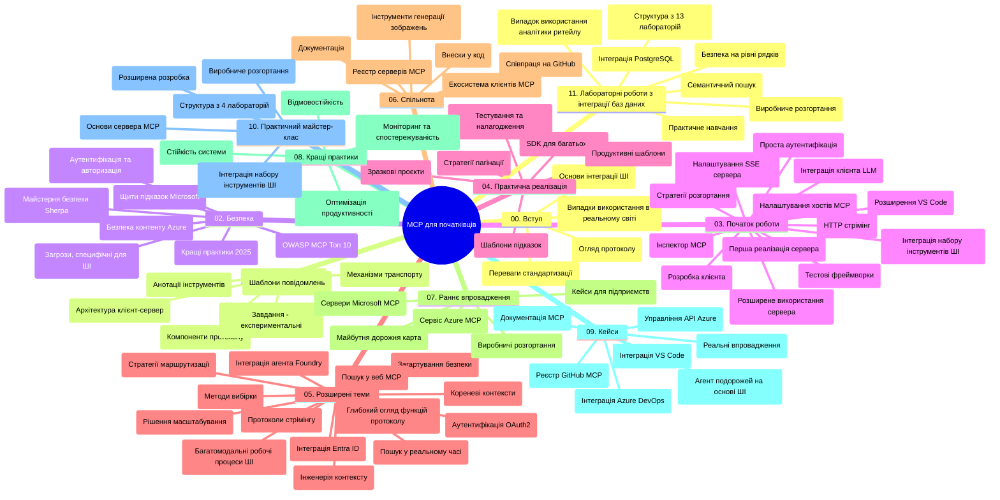

# Протокол Контексту Моделі (MCP) для Початківців - Навчальний Посібник

Цей навчальний посібник надає огляд структури та вмісту репозиторію для навчальної програми "Протокол Контексту Моделі (MCP) для Початківців". Використовуйте цей посібник для ефективної навігації репозиторієм і максимальної користі від доступних ресурсів.

## Огляд Репозиторію

Протокол Контексту Моделі (MCP) — це стандартизована структура для взаємодії між AI-моделями та клієнтськими додатками. Спочатку створений Anthropic, MCP тепер підтримується ширшою спільнотою MCP через офіційну організацію на GitHub. Цей репозиторій пропонує комплексну навчальну програму з практичними прикладами коду на C#, Java, JavaScript, Python та TypeScript, орієнтовану на AI-розробників, системних архітекторів і програмних інженерів.

## Візуальна Карта Навчальної Програми

## Структура Репозиторію

Репозиторій організований у одинадцять основних розділів, кожен із яких зосереджений на різних аспектах MCP:

1. **Вступ (00-Introduction/)**
   - Огляд Протоколу Контексту Моделі
   - Чому стандартизація важлива в AI-пайплайнах
   - Практичні випадки використання та переваги

2. **Основні Концепції (01-CoreConcepts/)**
   - Архітектура клієнт-сервер
   - Ключові компоненти протоколу
   - Патерни обміну повідомленнями в MCP

3. **Безпека (02-Security/)**
   - Загрози безпеці в системах на основі MCP
   - Кращі практики захисту реалізацій
   - Стратегії аутентифікації та авторизації
   - **Всеохопна документація з безпеки**:
     - Найкращі практики безпеки MCP 2025
     - Посібник з реалізації Azure Content Safety
     - Контроль безпеки та техніки MCP
     - Швидка довідка з найкращих практик MCP
   - **Ключові Теми Безпеки**:
     - Атаки інжекції підказок і отруєння інструментів
     - Захоплення сесії та проблеми confused deputy
     - Вразливість при передачі токенів
     - Надмірні дозволи та контроль доступу
     - Безпека ланцюжка постачань AI-компонентів
     - Інтеграція Microsoft Prompt Shields

4. **Початок Роботи (03-GettingStarted/)**
   - Налаштування та конфігурація оточення
   - Створення базових серверів і клієнтів MCP
   - Інтеграція з існуючими додатками
   - Включає розділи для:
     - Першої реалізації сервера
     - Розробки клієнта
     - Інтеграції LLM-клієнта
     - Інтеграції з VS Code
     - Серверу з подіями Server-Sent Events (SSE)
     - Розширеного використання сервера
     - HTTP-стримінгу
     - Інтеграції AI Toolkit
     - Стратегій тестування
     - Рекомендацій по розгортанню

5. **Практична Реалізація (04-PracticalImplementation/)**
   - Використання SDK для різних мов програмування
   - Налагодження, тестування та валідація
   - Створення повторно вживаних шаблонів підказок і робочих процесів
   - Зразкові проєкти з прикладами реалізації

6. **Просунуті Теми (05-AdvancedTopics/)**
   - Техніки інженерії контексту
   - Інтеграція агента Foundry
   - Мультимодальні AI-робочі процеси
   - Демонстрації аутентифікації через OAuth2
   - Можливості пошуку в реальному часі
   - Стрімінг у реальному часі
   - Реалізація кореневих контекстів
   - Стратегії маршрутизації
   - Техніки вибірки (sampling)
   - Підходи до масштабування
   - Питання безпеки
   - Інтеграція безпеки Entra ID
   - Інтеграція веб-пошуку

7. **Внесок Спільноти (06-CommunityContributions/)**
   - Як робити внесок у код і документацію
   - Співпраця через GitHub
   - Розширення та відгуки від спільноти
   - Використання різних клієнтів MCP (Claude Desktop, Cline, VSCode)
   - Робота з популярними MCP-серверами, включаючи генерацію зображень

8. **Уроки Раннього Впровадження (07-LessonsfromEarlyAdoption/)**
   - Реальні кейси та історії успіху
   - Створення та розгортання рішень на базі MCP
   - Тенденції та майбутній дорожній план
   - **Посібник із серверів MCP Microsoft**: Всеохопний гід по 10 виробничих серверів Microsoft MCP, включаючи:
     - Microsoft Learn Docs MCP Server
     - Azure MCP Server (понад 15 спеціалізованих конекторів)
     - GitHub MCP Server
     - Azure DevOps MCP Server
     - MarkItDown MCP Server
     - SQL Server MCP Server
     - Playwright MCP Server
     - Dev Box MCP Server
     - Azure AI Foundry MCP Server
     - Microsoft 365 Agents Toolkit MCP Server

9. **Кращі Практики (08-BestPractices/)**
   - Оптимізація продуктивності
   - Проектування відмовостійких MCP-систем
   - Стратегії тестування та забезпечення надійності

10. **Кейси (09-CaseStudy/)**
    - **Сім комплексних кейсів**, що демонструють універсальність MCP у різноманітних сценаріях:
    - **Azure AI Travel Agents**: Оркестрування мультиагентів з Azure OpenAI та AI Search
    - **Інтеграція Azure DevOps**: Автоматизація робочих процесів оновлення даних на YouTube
    - **Документування в реальному часі**: Python консольний клієнт із HTTP-стримінгом
    - **Інтерактивний генератор плану навчання**: Веб-додаток Chainlit з конверсійним AI
    - **Документування всередині редактора**: Інтеграція VS Code з робочими процесами GitHub Copilot
    - **Azure API Management**: Підприємницька інтеграція API з створенням MCP-сервера
    - **GitHub MCP Registry**: Розробка екосистеми та платформи агентської інтеграції
    - Приклади реалізації охоплюють інтеграцію підприємств, продуктивність розробників і розвиток екосистеми

11. **Практичний Семінар (10-StreamliningAIWorkflowsBuildingAnMCPServerWithAIToolkit/)**
    - Комплексний практичний семінар, що поєднує MCP з AI Toolkit
    - Створення інтелектуальних застосунків, які поєднують AI-моделі з реальними інструментами
    - Практичні модулі включають фундаментальні знання, розробку кастомних серверів і стратегії розгортання в продакшн
    - **Структура Лабораторій**:
      - Лабораторія 1: Основи MCP Server
      - Лабораторія 2: Просунута розробка MCP Server
      - Лабораторія 3: Інтеграція AI Toolkit
      - Лабораторія 4: Розгортання в продакшн і масштабування
    - Підхід навчання через лабораторії з покроковими інструкціями

12. **Лабораторії Інтеграції MCP Server з Базами Даних (11-MCPServerHandsOnLabs/)**
    - **Всеохоплюючий курс з 13 лабораторій** для створення виробничих MCP серверів із інтеграцією PostgreSQL
    - **Реальний кейс аналітики ритейлу** на прикладі Zava Retail
    - **Підприємницькі патерни** включно з Row Level Security (RLS), семантичним пошуком та багатокористувацьким доступом до даних
    - **Повна структура лабораторій**:
      - **Лабораторії 00-03: Основи** - Вступ, Архітектура, Безпека, Налаштування оточення
      - **Лабораторії 04-06: Створення MCP сервера** - Проєктування бази даних, реалізація MCP сервера, розробка інструментів
      - **Лабораторії 07-09: Просунуті функції** - Семантичний пошук, тестування та налагодження, інтеграція VS Code
      - **Лабораторії 10-12: Продакшн та кращі практики** - Розгортання, моніторинг, оптимізація
    - **Технології**: FastMCP framework, PostgreSQL, Azure OpenAI, Azure Container Apps, Application Insights
    - **Результати навчання**: Виробничі MCP сервери, патерни інтеграції з базою даних, AI-аналітика, безпека для підприємств

## Додаткові Ресурси

Репозиторій містить допоміжні ресурси:

- **Папка Images**: Містить діаграми та ілюстрації, що використовуються в навчальній програмі
- **Переклади**: Підтримка багатомовності з автоматизованими перекладами документації
- **Офіційні ресурси MCP**:
  - [Документація MCP](https://modelcontextprotocol.io/)
  - [Специфікація MCP](https://spec.modelcontextprotocol.io/)
  - [Репозиторій MCP на GitHub](https://github.com/modelcontextprotocol)

## Як Використовувати Цей Репозиторій

1. **Послідовне навчання**: Дотримуйтесь розділів у порядку від 00 до 11 для структурованого навчання.
2. **Фокус на конкретній мові**: Якщо вас цікавить певна мова програмування, досліджуйте директориї з прикладами для відповідної мови.
3. **Практична реалізація**: Почніть з розділу "Початок роботи", щоб налаштувати оточення та створити перший MCP сервер і клієнт.
4. **Просунуте вивчення**: Після опанування основ заглиблюйтеся у просунуті теми.
5. **Залучення спільноти**: Приєднуйтесь до спільноти MCP через обговорення на GitHub і канали Discord для спілкування з експертами та розробниками.

## MCP Клієнти та Інструменти

Навчальна програма охоплює різні MCP клієнти та інструменти:

1. **Офіційні клієнти**:
   - Visual Studio Code
   - MCP у Visual Studio Code
   - Claude Desktop
   - Claude у VSCode
   - Claude API

2. **Клієнти спільноти**:
   - Cline (термінальний)
   - Cursor (редактор коду)
   - ChatMCP
   - Windsurf

3. **Інструменти управління MCP**:
   - MCP CLI
   - MCP Manager
   - MCP Linker
   - MCP Router

## Популярні MCP Сервери

Репозиторій знайомить з різними MCP серверами, включно з:

1. **Офіційні Microsoft MCP Сервери**:
   - Microsoft Learn Docs MCP Server
   - Azure MCP Server (понад 15 спеціалізованих конекторів)
   - GitHub MCP Server
   - Azure DevOps MCP Server
   - MarkItDown MCP Server
   - SQL Server MCP Server
   - Playwright MCP Server
   - Dev Box MCP Server
   - Azure AI Foundry MCP Server
   - Microsoft 365 Agents Toolkit MCP Server

2. **Офіційні референтні сервери**:
   - Filesystem
   - Fetch
   - Memory
   - Sequential Thinking

3. **Генерація зображень**:
   - Azure OpenAI DALL-E 3
   - Stable Diffusion WebUI
   - Replicate

4. **Інструменти розробки**:
   - Git MCP
   - Terminal Control
   - Code Assistant

5. **Спеціалізовані сервери**:
   - Salesforce
   - Microsoft Teams
   - Jira & Confluence

## Внесок

Цей репозиторій приймає внески від спільноти. Дивіться розділ "Внесок Спільноти" для вказівок, як ефективно долучатися до розвитку екосистеми MCP.

----

*Цей навчальний посібник був оновлений востаннє 5 лютого 2026 року, відображаючи останню Специфікацію MCP від 2025-11-25, і надає огляд репозиторію станом на цю дату. Зміст репозиторію може оновлюватися після цієї дати.*

---

<!-- CO-OP TRANSLATOR DISCLAIMER START -->
**Відмова від відповідальності**:  
Цей документ було перекладено за допомогою сервісу автоматичного перекладу [Co-op Translator](https://github.com/Azure/co-op-translator). Хоча ми прагнемо до точності, зверніть увагу, що автоматичні переклади можуть містити помилки або неточності. Оригінальний документ його рідною мовою слід вважати авторитетним джерелом. Для отримання критично важливої інформації рекомендується звертатися до професійного людського перекладу. Ми не несемо відповідальності за будь-які непорозуміння або хибні тлумачення, що виникли внаслідок використання цього перекладу.
<!-- CO-OP TRANSLATOR DISCLAIMER END -->