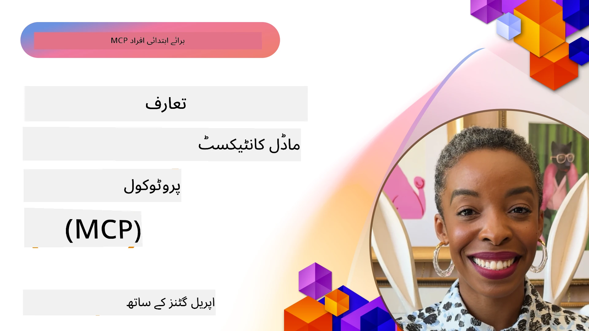
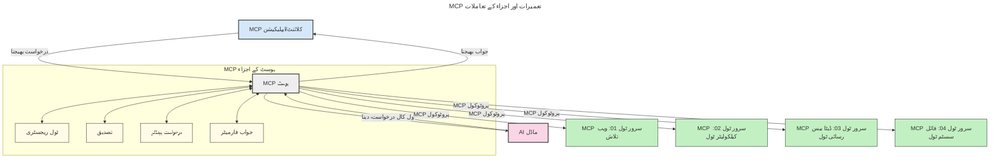

# ماڈل کانٹیکسٹ پروٹوکول (MCP) کا تعارف: اسکیل ایبل AI ایپلیکیشنز کے لیے کیوں اہم ہے

[](https://youtu.be/agBbdiOPLQA)

_(اس سبق کی ویڈیو دیکھنے کے لیے اوپر تصویری کلک کریں)_

جنریٹو AI ایپلیکیشنز ایک زبردست قدم آگے ہیں کیونکہ یہ اکثر صارف کو قدرتی زبان کے پرامپٹس کے ذریعے ایپ کے ساتھ بات چیت کرنے کی اجازت دیتی ہیں۔ تاہم، جب ایسی ایپلیکیشنز میں زیادہ وقت اور وسائل لگائے جاتے ہیں، تو آپ یہ یقینی بنانا چاہیں گے کہ آپ فنکشنالٹیز اور وسائل کو اس طرح آسانی سے مربوط کر سکیں کہ اسے بڑھانا آسان ہو، اور آپ کی ایپ ایک سے زیادہ ماڈلز کے استعمال کو سہارا دے سکے اور مختلف ماڈل کی پیچیدگیوں کو سنبھال سکے۔ مختصر یہ کہ جن AI ایپلیکیشنز بنانا شروع میں آسان ہے، لیکن جیسے جیسے یہ بڑھتی ہیں اور زیادہ پیچیدہ ہو جاتی ہیں، آپ کو ایک فن تعمیر کی وضاحت شروع کرنی ہوگی اور غالباً ایک معیاری طریقہ کار پر انحصار کرنا ہوگا تاکہ آپ کی ایپلیکیشنز ایک مستقل انداز میں بنی ہوں۔ یہی وہ جگہ ہے جہاں MCP آتا ہے تاکہ چیزوں کو منظم کرے اور ایک معیار فراہم کرے۔

---

## **🔍 ماڈل کانٹیکسٹ پروٹوکول (MCP) کیا ہے؟**

**ماڈل کانٹیکسٹ پروٹوکول (MCP)** ایک **اوپن، معیاری انٹرفیس** ہے جو بڑے زبان ماڈلز (LLMs) کو بیرونی ٹولز، APIs، اور ڈیٹا ذرائع کے ساتھ بغیر رکاوٹ کے تعامل کرنے کی اجازت دیتا ہے۔ یہ ایک مستقل فن تعمیر فراہم کرتا ہے تاکہ AI ماڈل کی صلاحیتوں کو ان کی تربیتی ڈیٹا سے آگے بڑھایا جا سکے، جس سے زیادہ ہوشیار، اسکیل ایبل اور ردعمل دینے والے AI نظام قابل بنائے جاتے ہیں۔

---

## **🎯 AI میں معیار سازی کیوں اہم ہے**

جیسے جیسے جنریٹو AI ایپلیکیشنز زیادہ پیچیدہ ہوتی جا رہی ہیں، ایسے معیارات اپنانا ضروری ہے جو **اسکیل ایبلٹی، توسیع پذیری، دیکھ بھال کی سہولت** اور **وینڈر لاک-ان سے بچاؤ** کو یقینی بنائیں۔ MCP ان ضروریات کو اس طرح پورا کرتا ہے:

- ماڈل-ٹول انضمامات کو متحد کرنا
- نازک، مخصوص اور ایک بار استعمال کے حل کو کم کرنا
- مختلف وینڈرز کے کئی ماڈلز کو ایک ہی ماحولیاتی نظام میں ایک ساتھ رہنے دینا

**نوٹ:** اگرچہ MCP خود کو ایک اوپن معیار کے طور پر پیش کرتا ہے، MCP کو کسی بھی موجودہ معیاری ادارے جیسے IEEE، IETF، W3C، ISO یا کسی اور معیاری ادارے کے ذریعے معیاری بنانے کا کوئی منصوبہ نہیں ہے۔

---

## **📚 سیکھنے کے مقاصد**

اس آرٹیکل کے آخر تک، آپ قابل ہوں گے کہ:

- **ماڈل کانٹیکسٹ پروٹوکول (MCP)** کی تعریف اور اس کے استعمالات بتائیں
- سمجھیں کہ MCP کس طرح ماڈل-ٹو-ٹول کمیونیکیشن کو معیاری بناتا ہے
- MCP فن تعمیر کے بنیادی اجزاء کی شناخت کریں
- MCP کے حقیقی دنیا میں کاروباری اور ترقیاتی سیاق و سباق میں اطلاق کو دریافت کریں

---

## **💡 ماڈل کانٹیکسٹ پروٹوکول (MCP) کیوں ایک گیم چینجر ہے**

### **🔗 MCP AI تعاملات میں بکھراؤ کا مسئلہ حل کرتا ہے**

MCP سے پہلے، ماڈلز کو ٹولز کے ساتھ مربوط کرنے کے لیے درج ذیل کی ضرورت ہوتی تھی:

- ہر ٹول-ماڈل جوڑی کے لیے کسٹم کوڈنگ
- ہر وینڈر کے لیے غیر معیاری APIs
- اپ ڈیٹس کی وجہ سے اکثر ٹوٹنا
- زیادہ ٹولز کے ساتھ ناقص اسکیل ایبلٹی

### **✅ MCP معیار سازی کے فوائد**

| **فائدہ**                | **تفصیل**                                                                    |
|--------------------------|-------------------------------------------------------------------------------|
| انٹرآپریبلٹی              | LLMs مختلف وینڈرز کے ٹولز کے ساتھ بغیر رکاوٹ کام کرتے ہیں                   |
| مستقل مزاجی              | پلیٹ فارمز اور ٹولز میں یکساں رویہ                                           |
| دوبارہ استعمال           | ایک بار بنائے گئے ٹولز کو مختلف پروجیکٹس اور سسٹمز میں استعمال کیا جا سکتا ہے  |
| تیز تر ترقی              | معیاری، پلگ اینڈ پلی انٹرفیسز کے استعمال سے ڈیولپمنٹ کا وقت کم کرنا           |

---

## **🧱 اعلیٰ سطحی MCP فن تعمیر کا جائزہ**

MCP ایک **کلائنٹ-سرور ماڈل** پر کام کرتا ہے، جہاں:

- **MCP ہوسٹس** AI ماڈلز کو چلاتے ہیں
- **MCP کلائنٹس** درخواستیں شروع کرتے ہیں
- **MCP سرورز** کانٹیکسٹ، ٹولز، اور صلاحیتیں مہیا کرتے ہیں

### **اہم اجزاء:**

- **وسائل (Resources)** – ماڈلز کے لیے جامد یا متحرک ڈیٹا  
- **پرامپٹس (Prompts)** – ہدایت کاری کے لیے پہلے سے طے شدہ ورک فلو  
- **ٹولز (Tools)** – قابل عمل فنکشنز جیسے تلاش، حساب کتاب  
- **سامپلنگ (Sampling)** – Recursive تعامل کے ذریعے ایجنٹک رویہ  
- **ایلیسیٹیشن (Elicitation)** – صارف کی معلومات کے لیے سرور کی جانب سے درخواستیں  
- **روٹس (Roots)** – سرور کی رسائی کنٹرول کے لیے فائل سسٹم کی حد بندی

### **پروٹوکول فن تعمیر:**

MCP دو پرتوں پر مشتمل ہے:
- **ڈیٹا پرت**: JSON-RPC 2.0 پر مبنی مواصلات، زندگی کے دورانیے کا انتظام اور بنیادیات  
- **ٹرانسپورٹ پرت**: STDIO (مقامی) اور Streamable HTTP کے ساتھ SSE (ریموٹ) کمیونیکیشن چینلز

---

## MCP سرورز کیسے کام کرتے ہیں

MCP سرورز درج ذیل طریقے سے کام کرتے ہیں:

- **درخواست کا بہاؤ**:
    1. ایک درخواست اینڈ یوزر یا ان کی طرف سے کام کرنے والے سافٹ ویئر کی جانب سے شروع کی جاتی ہے۔
    2. **MCP کلائنٹ** یہ درخواست ایک **MCP ہوسٹ** کو بھیجتا ہے، جو AI ماڈل رن ٹائم کو سنبھالتا ہے۔
    3. **AI ماڈل** صارف کے پرامپٹ کو وصول کرتا ہے اور ایک یا زیادہ ٹول کالز کے ذریعے بیرونی ٹولز یا ڈیٹا تک رسائی کی درخواست کر سکتا ہے۔
    4. **MCP ہوسٹ**، خود ماڈل کی بجائے، معیاری پروٹوکول استعمال کرتے ہوئے متعلقہ **MCP سرور(ز)** کے ساتھ رابطہ کرتا ہے۔
- **MCP ہوسٹ کی فعالیت**:
    - **ٹول رجسٹری**: دستیاب ٹولز اور ان کی صلاحیتوں کا کیٹلاگ رکھتا ہے۔
    - **تصدیق کاری**: ٹول تک رسائی کی اجازتوں کی جانچ کرتا ہے۔
    - **درخواست ہینڈلر**: ماڈل سے آنے والی ٹول درخواستوں کو پروسیس کرتا ہے۔
    - **جواب فارمیٹر**: ٹول آؤٹ پٹس کو ماڈل کے سمجھنے کے قابل فارمیٹ میں ترتیب دیتا ہے۔
- **MCP سرور کا عملدرآمد**:
    - **MCP ہوسٹ** ٹول کالز کو ایک یا زیادہ **MCP سرورز** کو بھیجتا ہے، جو مخصوص فنکشنز فراہم کرتے ہیں (مثلاً تلاش، حساب کتاب، ڈیٹا بیس کوئریز)۔
    - **MCP سرورز** اپنے متعلقہ کام انجام دیتے ہیں اور نتائج کو ایک مستقل فارمیٹ میں **MCP ہوسٹ** کو واپس کرتے ہیں۔
    - **MCP ہوسٹ** ان نتائج کو فارمیٹ کر کے **AI ماڈل** کو پہنچاتا ہے۔
- **جواب مکمل ہونا**:
    - **AI ماڈل** ٹول آؤٹ پٹس کو آخری جواب میں شامل کرتا ہے۔
    - **MCP ہوسٹ** یہ جواب **MCP کلائنٹ** کو بھیجتا ہے، جو اسے اینڈ یوزر یا کالنگ سافٹ ویئر کو فراہم کرتا ہے۔
    


## 👨‍💻 MCP سرور کیسے بنائیں (مثالوں کے ساتھ)

MCP سرورز LLM کی صلاحیتوں کو بڑھانے کے لیے ڈیٹا اور فنکشنلٹی فراہم کرتے ہیں۔

کیا آپ اسے آزمانے کے لیے تیار ہیں؟ یہاں زبان یا اسٹیک کے لحاظ سے مخصوص SDKs ہیں جن میں مختلف زبانوں/سٹیکس میں سادہ MCP سرور بنانے کی مثالیں موجود ہیں:

- **Python SDK**: https://github.com/modelcontextprotocol/python-sdk

- **TypeScript SDK**: https://github.com/modelcontextprotocol/typescript-sdk

- **Java SDK**: https://github.com/modelcontextprotocol/java-sdk

- **C#/.NET SDK**: https://github.com/modelcontextprotocol/csharp-sdk


## 🌍 MCP کے حقیقی دنیا میں استعمال کے کیسز

MCP AI کی صلاحیتوں کو بڑھا کر وسیع تر ایپلیکیشنز کو قابل بناتا ہے:

| **ایپلیکیشن**              | **تفصیل**                                                                    |
|------------------------------|-------------------------------------------------------------------------------|
| انٹرپرائز ڈیٹا انٹیگریشن    | LLMs کو ڈیٹا بیسز، CRMs، یا اندرونی ٹولز سے جوڑنا                           |
| ایجنٹک AI سسٹمز            | ٹول رسائی اور فیصلہ سازی کے ورک فلو کے ساتھ خودمختار ایجنٹس کو قابل بنانا    |
| ملٹی-موڈل ایپلیکیشنز        | ایک متحد AI ایپ میں ٹیکسٹ، تصویر، اور آڈیو ٹولز کو یکجا کرنا                 |
| حقیقی وقت کا ڈیٹا انٹیگریشن | AI تعاملات میں جیتی جاگتی معلومات لانا تاکہ زیادہ درست اور تازہ نتائج ملیں  |


### 🧠 MCP = AI تعاملات کے لیے یونیورسل اسٹینڈرڈ

ماڈل کانٹیکسٹ پروٹوکول (MCP) AI تعاملات کے لیے یونیورسل معیار کے طور پر کام کرتا ہے، بالکل جیسے USB-C نے ڈیوائسز کے لیے فزیکل کنیکشن کو ایک معیار بنایا۔ AI کی دنیا میں، MCP ایک مستقل انٹرفیس فراہم کرتا ہے، جو ماڈلز (کلائنٹس) کو بغیر رکاوٹ خارجی ٹولز اور ڈیٹا فراہم کرنے والوں (سرورز) کے ساتھ انٹیگریٹ کرنے دیتا ہے۔ اس سے ہر API یا ڈیٹا سورس کے لیے مختلف، کسٹم پروٹوکول کی ضرورت ختم ہو جاتی ہے۔

MCP کے تحت، ایک MCP-مطابق ٹول (جسے MCP سرور کہا جاتا ہے) ایک متحد معیار کی پیروی کرتا ہے۔ یہ سرورز وہ ٹولز یا ایکشنز لسٹ کر سکتے ہیں جو وہ فراہم کرتے ہیں اور AI ایجنٹ کی درخواست پر ان ایکشنز کو انجام دیتے ہیں۔ وہ AI ایجنٹ پلیٹ فارمز جو MCP کو سپورٹ کرتے ہیں، سرورز سے دستیاب ٹولز دریافت کر سکتے ہیں اور انہیں اس معیار کے پروٹوکول کے ذریعے کال کر سکتے ہیں۔

### 💡 علم تک رسائی کو آسان بنانا

ٹولز فراہم کرنے کے علاوہ، MCP علم تک رسائی کو بھی آسان بناتا ہے۔ یہ ایسی ایپلیکیشنز کو بڑے زبان ماڈلز کو کانٹیکسٹ مہیا کرنے کے قابل بناتا ہے، جو انہیں مختلف ڈیٹا ذرائع سے منسلک کرتا ہے۔ مثلاً، ایک MCP سرور کسی کمپنی کا دستاویزی ذخیرہ نمایاں کر سکتا ہے، جو ایجنٹس کو متعلقہ معلومات طلب کرنے کی اجازت دیتا ہے۔ ایک اور سرور مخصوص کام انجام دے سکتا ہے، جیسے ای میل بھیجنا یا ریکارڈز اپ ڈیٹ کرنا۔ ایجنٹ کی نظر سے، یہ بس ایسے ٹولز ہیں جو وہ استعمال کر سکتا ہے—کچھ ٹولز ڈیٹا (علمی کانٹیکسٹ) واپس کرتے ہیں، جب کہ دوسرے عمل انجام دیتے ہیں۔ MCP دونوں کو مؤثر طریقے سے سنبھالتا ہے۔

ایک ایجنٹ جو MCP سرور سے جڑتا ہے خود بخود اس سرور کی دستیاب صلاحیتوں اور قابل رسائی ڈیٹا کو ایک معیاری فارمیٹ کے ذریعے سیکھ لیتا ہے۔ یہ معیار سازی متحرک ٹول کی دستیابی کو ممکن بناتی ہے۔ مثال کے طور پر، ایک نئے MCP سرور کو ایجنٹ کے سسٹم میں شامل کرنے سے اس کے فنکشنز فوری طور پر استعمال کے قابل ہو جاتے ہیں بغیر ایجنٹ کی ہدایات میں مزید تخصیص کے۔

یہ ہموار انضمام اس فلو سے ہم آہنگ ہے جو درج ذیل خاکہ میں دکھایا گیا ہے، جہاں سرورز ٹولز اور علم دونوں فراہم کرتے ہیں، اس بات کو یقینی بناتے ہوئے کہ سسٹمز کے درمیان بغیر رکاوٹ تعاون ہو۔

### 👉 مثال: اسکیل ایبل ایجنٹ حل

```mermaid
---
title: MCP کے ساتھ قابل پیمائش ایجنٹ حل
description: ایک خاکہ جو دکھاتا ہے کہ ایک صارف کس طرح ایل ایل ایم کے ساتھ تعامل کرتا ہے جو متعدد MCP سرورز سے جڑتا ہے، ہر سرور علم اور اوزار فراہم کرتا ہے، ایک قابل پیمائش AI نظام کی تعمیر کرتا ہے
---
graph TD
    User -->|پرامپٹ| LLM
    LLM -->|جواب| User
    LLM -->|MCP| ServerA
    LLM -->|MCP| ServerB
    ServerA -->|جامع کنیکٹر| ServerB
    ServerA --> KnowledgeA
    ServerA --> ToolsA
    ServerB --> KnowledgeB
    ServerB --> ToolsB

    subgraph Server A
        KnowledgeA[علم]
        ToolsA[اوزار]
    end

    subgraph Server B
        KnowledgeB[علم]
        ToolsB[اوزار]
    end
```یونیورسل کنیکٹر MCP سرورز کو آپس میں بات چیت اور صلاحیتوں کا اشتراک کرنے کے قابل بناتا ہے، جس سے ServerA کو ServerB کو کام تفویض کرنے یا اس کے ٹولز اور علم تک رسائی حاصل کرنے کی اجازت ملتی ہے۔ اس سے سرورز کے درمیان ٹولز اور ڈیٹا کا فیڈریشن ہوتا ہے، جو اسکیل ایبل اور ماڈیولر ایجنٹ فن تعمیرات کو سپورٹ کرتا ہے۔ چونکہ MCP ٹول ایکسپوژر کو معیاری بناتا ہے، ایجنٹ بغیر ہارڈکوڈ شدہ انٹیگریشنز کے سرورز کے درمیان متحرک طور پر دریافت اور راستہ سازی کر سکتے ہیں۔

ٹول اور علمی فیڈریشن: ٹولز اور ڈیٹا سرورز کے درمیان فراہم کیے جا سکتے ہیں، جس سے مزید اسکیل ایبل اور ماڈیولر ایجنٹک فن تعمیرات ممکن ہوتی ہیں۔

### 🔄 کلائنٹ سائڈ LLM انٹیگریشن کے ساتھ جدید MCP منظرنامے

بنیادی MCP فن تعمیر سے آگے، ایسے جدید سیناریوز بھی ہیں جہاں دونوں کلائنٹ اور سرور میں LLMs موجود ہوتے ہیں، جو پیچیدہ تعاملات کو ممکن بناتے ہیں۔ درج ذیل خاکہ میں، **کلائنٹ ایپ** ایک IDE ہو سکتا ہے جس میں بہت سے MCP ٹولز LLM کے صارف کے لیے دستیاب ہوتے ہیں:

```mermaid
---
title: کلائنٹ-سرور LLM انضمام کے ساتھ ایڈوانسڈ MCP منظرنامے
description: ایک سیکوینس ڈایاگرام جو صارف، کلائنٹ ایپلیکیشن، کلائنٹ LLM، متعدد MCP سرورز، اور سرور LLM کے درمیان تفصیلی تعامل کے بہاؤ کو ظاہر کرتا ہے، جو ٹول کی دریافت، صارف کے تعامل، براہ راست ٹول کالنگ، اور فیچر مذاکرات کے مراحل کی وضاحت کرتا ہے
---
sequenceDiagram
    autonumber
    actor User as 👤 صارف
    participant ClientApp as 🖥️ کلائنٹ ایپ
    participant ClientLLM as 🧠 کلائنٹ LLM
    participant Server1 as 🔧 MCP سرور 1
    participant Server2 as 📚 MCP سرور 2
    participant ServerLLM as 🤖 سرور LLM
    
    %% Discovery Phase
    rect rgb(220, 240, 255)
        Note over ClientApp, Server2: ٹول دریافت کا مرحلہ
        ClientApp->>+Server1: دستیاب ٹولز / وسائل کی درخواست کریں
        Server1-->>-ClientApp: ٹول کی فہرست واپس کریں (JSON)
        ClientApp->>+Server2: دستیاب ٹولز / وسائل کی درخواست کریں
        Server2-->>-ClientApp: ٹول کی فہرست واپس کریں (JSON)
        Note right of ClientApp: ذخیرہ شدہ مشترکہ ٹول<br/>کیٹلاگ مقامی طور پر
    end
    
    %% User Interaction
    rect rgb(255, 240, 220)
        Note over User, ClientLLM: صارف کے تعامل کا مرحلہ
        User->>+ClientApp: قدرتی زبان کا پرامپٹ درج کریں
        ClientApp->>+ClientLLM: پرامپٹ + ٹول کیٹلاگ آگے بھیجیں
        ClientLLM->>-ClientLLM: پرامپٹ کا تجزیہ کریں اور ٹولز منتخب کریں
    end
    
    %% Scenario A: Direct Tool Calling
    alt براہ راست ٹول کالنگ
        rect rgb(220, 255, 220)
            Note over ClientApp, Server1: منظرنامہ A: براہ راست ٹول کالنگ
            ClientLLM->>+ClientApp: ٹول کی ایگزیکیوٹر کی درخواست کریں
            ClientApp->>+Server1: مخصوص ٹول چلائیں
            Server1-->>-ClientApp: نتائج واپس کریں
            ClientApp->>+ClientLLM: نتائج کو پروسیس کریں
            ClientLLM-->>-ClientApp: جواب تیار کریں
            ClientApp-->>-User: آخری جواب دکھائیں
        end
    
    %% Scenario B: Feature Negotiation (VS Code style)
    else فیچر مذاکرات (VS Code اسٹائل)
        rect rgb(255, 220, 220)
            Note over ClientApp, ServerLLM: منظرنامہ B: فیچر مذاکرات
            ClientLLM->>+ClientApp: درکار صلاحیتوں کی شناخت کریں
            ClientApp->>+Server2: فیچرز / صلاحیتوں پر مذاکرات کریں
            Server2->>+ServerLLM: اضافی سیاق و سباق کی درخواست کریں
            ServerLLM-->>-Server2: سیاق و سباق فراہم کریں
            Server2-->>-ClientApp: دستیاب فیچرز واپس کریں
            ClientApp->>+Server2: مذاکرات شدہ ٹولز کال کریں
            Server2-->>-ClientApp: نتائج واپس کریں
            ClientApp->>+ClientLLM: نتائج کو پروسیس کریں
            ClientLLM-->>-ClientApp: جواب تیار کریں
            ClientApp-->>-User: آخری جواب دکھائیں
        end
    end
```
## 🔐 MCP کے عملی فوائد

MCP استعمال کرنے کے عملی فوائد یہ ہیں:

- **تازگی**: ماڈلز اپنے تربیتی ڈیٹا سے آگے جا کر تازہ ترین معلومات تک رسائی کر سکتے ہیں  
- **صلاحیت میں اضافہ**: ماڈلز ان مخصوص ٹولز کا فائدہ اٹھا سکتے ہیں جن کے لیے انہیں تربیت نہیں دی گئی  
- **خیالی غلطیوں میں کمی**: بیرونی ڈیٹا ذرائع حقیقت پر مبنی بنیاد فراہم کرتے ہیں  
- **پرائیویسی**: حساس ڈیٹا کو پرامپٹس میں شامل کرنے کے بجائے محفوظ ماحول میں رکھا جا سکتا ہے  

## 📌 اہم نکات

MCP استعمال کرنے کے لیے اہم نکات یہ ہیں:

- **MCP** AI ماڈلز کے ٹولز اور ڈیٹا کے ساتھ تعامل کو معیاری بناتا ہے  
- توسیعی، مستقل مزاجی اور انٹرآپریبلٹی کو فروغ دیتا ہے  
- MCP ترقی کے وقت کو کم کرنے، اعتبار میں بہتری اور ماڈل کی صلاحیتوں کو بڑھانے میں مدد کرتا ہے  
- کلائنٹ-سرور فن تعمیر لچکدار، توسیع پذیر AI ایپلیکیشنز کو ممکن بناتا ہے  

## 🧠 مشق

ایسی AI ایپلیکیشن کے بارے میں سوچیں جسے آپ بنانے میں دلچسپی رکھتے ہیں۔

- کون سے **بیرونی ٹولز یا ڈیٹا** اس کی صلاحیتوں کو بڑھا سکتے ہیں؟  
- MCP انضمام کو کیسے **آسان اور زیادہ قابل اعتماد** بنا سکتا ہے؟  

## اضافی وسائل

- [MCP GitHub Repository](https://github.com/modelcontextprotocol)


## اگلا کیا ہے

اگلا: [باب 1: بنیادی تصورات](../01-CoreConcepts/README.md)

---

<!-- CO-OP TRANSLATOR DISCLAIMER START -->
**دریافت نامہ**:  
یہ دستاویز AI ترجمہ سروس [Co-op Translator](https://github.com/Azure/co-op-translator) کے ذریعے ترجمہ کی گئی ہے۔ اگرچہ ہم درستگی کے لیے کوشش کرتے ہیں، براہِ کرم اس بات سے آگاہ رہیں کہ خودکار ترجموں میں غلطیاں یا نقص ہو سکتے ہیں۔ اصل دستاویز اپنی مادری زبان میں معتبر ماخذ سمجھی جانی چاہیے۔ اہم معلومات کے لیے پیشہ ور انسانی ترجمہ کی سفارش کی جاتی ہے۔ اس ترجمے کے استعمال سے ہونے والی کسی بھی غلط فہمی یا غلط تشریحات کی ذمہ داری ہم پر عائد نہیں ہوتی۔
<!-- CO-OP TRANSLATOR DISCLAIMER END -->