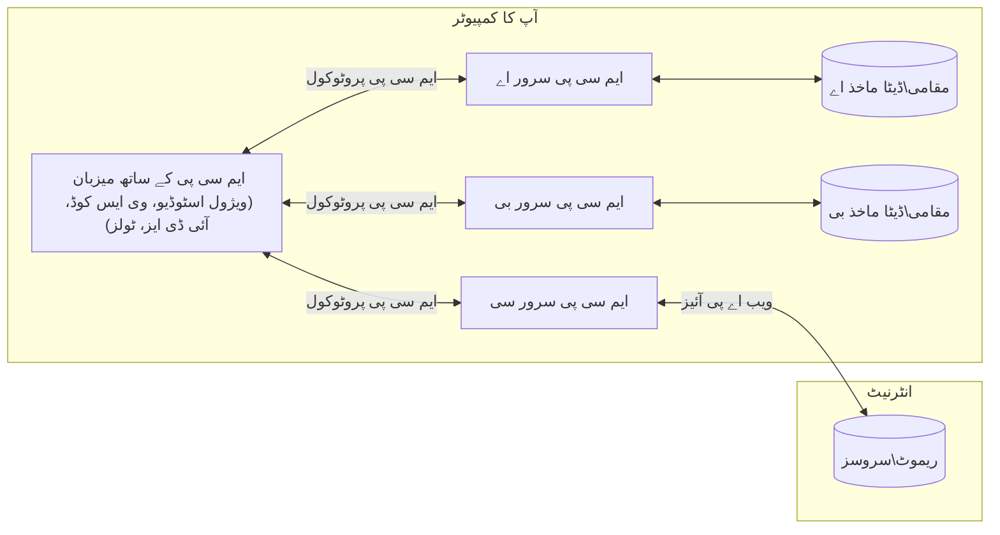

# ایم سی پی کور تصورات: اے آئی انضمام کے لیے ماڈل کانٹیکسٹ پروٹوکول میں مہارت حاصل کرنا

[](https://youtu.be/earDzWGtE84)

_(اس سبق کی ویڈیو دیکھنے کے لیے اوپر تصویر پر کلک کریں)_

[ماڈل کانٹیکسٹ پروٹوکول (MCP)](https://github.com/modelcontextprotocol) ایک طاقتور، معیاری فریم ورک ہے جو بڑے زبان کے ماڈلز (LLMs) اور بیرونی ٹولز، ایپلیکیشنز، اور ڈیٹا ذرائع کے درمیان رابطے کو بہتر بناتا ہے۔  
یہ گائیڈ آپ کو MCP کے بنیادی تصورات سے روشناس کرائے گا۔ آپ اس کے کلائنٹ-سرور آرکیٹیکچر، اہم اجزاء، مواصلاتی طریقہ کار، اور بہترین عمل درآمد کے طریقے سیکھیں گے۔

- **واضح صارف کی اجازت**: تمام ڈیٹا تک رسائی اور آپریشنز سے پہلے واضح صارف کی منظوری ضروری ہے۔ صارفین کو واضح طور پر سمجھنا چاہیے کہ کون سا ڈیٹا حاصل کیا جائے گا اور کون سے اعمال انجام دیے جائیں گے، جس میں اجازتوں اور مجازیتوں پر تفصیلی کنٹرول شامل ہو۔

- **ڈیٹا پرائیویسی کا تحفظ**: صارف کا ڈیٹا صرف واضح اجازت کے ساتھ ظاہر ہوتا ہے اور پورے تعامل کے دوران مضبوط رسائی کنٹرولز کے ذریعے محفوظ رہنا چاہیے۔ عمل درآمد میں غیر مجاز ڈیٹا کی منتقلی کو روکنا اور سخت پرائیویسی کی حد بندی قائم رکھنی چاہیے۔

- **ٹول کے نفاذ کی حفاظت**: ہر ٹول کال کے لیے واضح صارف کی اجازت درکار ہے، جس میں ٹول کی فعالیت، پیرا میٹرز، اور ممکنہ اثرات کی واضح سمجھ شامل ہے۔ مضبوط حفاظتی حد بندی غیر ارادی، غیر محفوظ، یا نقصان دہ ٹول کے نفاذ کو روکنے کے لیے ضروری ہے۔

- **ٹرانسپورٹ لیئر سیکورٹی**: تمام رابطے چینلز کو مناسب انکرپشن اور توثیقی طریقہ کار استعمال کرنے چاہئیں۔ ریموٹ کنکشنز کو محفوظ ٹرانسپورٹ پروٹوکولز اور مناسب اسناد کے انتظام کے ساتھ نافذ کیا جانا چاہیے۔

#### عمل درآمد کے رہنما خطوط:

- **اجازت کا انتظام**: باریک بینی سے اجازت کے نظام نافذ کریں جو صارفین کو کنٹرول کرنے دیں کہ کون سے سرورز، ٹولز، اور وسائل قابل رسائی ہیں  
- **توثیق اور اجازت**: محفوظ توثیقی طریقے استعمال کریں (OAuth، API کیز) اور ٹوکن مینجمنٹ و میعاد ختم ہونے کا صحیح انتظام کریں  
- **ان پٹ کی توثیق**: تمام پیرا میٹرز اور ڈیٹا ان پٹس کو معین اسکیما کے مطابق ویلیڈیٹ کریں تاکہ انجیکشن حملوں سے بچا جا سکے  
- **آڈٹ لاگنگ**: تمام آپریشنز کے جامع لاگز رکھیں تاکہ سیکیورٹی مانیٹرنگ اور تعمیل ممکن ہو  

## جائزہ

یہ سبق ماڈل کانٹیکسٹ پروٹوکول (MCP) کے بنیادی آرکیٹیکچر اور اجزاء کا جائزہ لیتا ہے۔ آپ MCP کے کلائنٹ-سرور آرکیٹیکچر، اہم اجزاء، اور مواصلاتی میکنزم کو سمجھیں گے جو MCP کے تعاملات کو طاقت دیتے ہیں۔

## کلیدی سیکھنے کے اہداف

اس سبق کے آخر تک، آپ:

- MCP کلائنٹ-سرور آرکیٹیکچر کو سمجھیں گے۔  
- ہوسٹس، کلائنٹس، اور سرورز کے کردار اور ذمہ داریوں کی شناخت کریں گے۔  
- MCP کو ایک لچکدار انضمامی پرت بنانے والی بنیادی خصوصیات کا تجزیہ کریں گے۔  
- MCP ماحولیاتی نظام میں معلومات کے بہاؤ کو سیکھیں گے۔  
- .NET، جاوا، پائتھون، اور جاوا اسکرپٹ کے کوڈ مثالوں کے ذریعے عملی بصیرت حاصل کریں گے۔

## ایم سی پی آرکیٹیکچر: ایک گہری نظر

MCP ماحولیاتی نظام کلائنٹ-سرور ماڈل پر مبنی ہے۔ یہ ماڈیولر ڈھانچہ AI ایپلیکیشنز کو ٹولز، ڈیٹا بیس، APIs، اور سیاق و سباق کے وسائل کے ساتھ مؤثر طریقے سے بات چیت کرنے کی اجازت دیتا ہے۔ آئیے اس آرکیٹیکچر کو اس کے بنیادی اجزاء میں تقسیم کرتے ہیں۔

اپنے بنیادی حصے میں، MCP ایک کلائنٹ-سرور آرکیٹیکچر کی پیروی کرتا ہے جہاں ایک ہوسٹ ایپلیکیشن متعدد سرورز سے جڑ سکتی ہے:


- **MCP ہوسٹس**: پروگرام جیسے VSCode، Claude Desktop، IDEs، یا AI ٹولز جو ڈیٹا تک MCP کے ذریعے رسائی چاہتے ہیں  
- **MCP کلائنٹس**: پروٹوکول کلائنٹس جو سرورز سے 1:1 کنکشن برقرار رکھتے ہیں  
- **MCP سرورز**: ہلکے پھلکے پروگرام جو معیاری ماڈل کانٹیکسٹ پروٹوکول کے ذریعے مخصوص صلاحیتوں کو ظاہر کرتے ہیں  
- **مقامی ڈیٹا ذرائع**: آپ کے کمپیوٹر کی فائلیں، ڈیٹا بیس، اور خدمات جن تک MCP سرورز محفوظ طریقے سے رسائی حاصل کر سکتے ہیں  
- **ریموٹ سروسز**: بیرونی نظام جو انٹرنیٹ کے ذریعے دستیاب ہیں اور جن سے MCP سرورز API کے ذریعے جڑ سکتے ہیں۔

MCP پروٹوکول ایک ارتقا پذیر معیار ہے جو تاریخ کی بنیاد پر ورژننگ (YYYY-MM-DD فارمیٹ) استعمال کرتا ہے۔ موجودہ پروٹوکول ورژن **2025-11-25** ہے۔ آپ [پروٹوکول کی تفصیل](https://modelcontextprotocol.io/specification/2025-11-25/) میں تازہ ترین اپ ڈیٹس دیکھ سکتے ہیں۔

### 1. ہوسٹس

ماڈل کانٹیکسٹ پروٹوکول (MCP) میں، **ہوسٹس** AI ایپلیکیشنز ہیں جو وہ بنیادی انٹرفیس فراہم کرتی ہیں جن کے ذریعے صارفین پروٹوکول کے ساتھ بات چیت کرتے ہیں۔ ہوسٹس متعدد MCP سرورز سے کنکشنز کو منظم اور ہم آہنگ کرتے ہیں، ہر سرور کنکشن کے لیے مخصوص MCP کلائنٹس تخلیق کر کے۔ ہوسٹس کی مثالیں شامل ہیں:

- **AI ایپلیکیشنز**: Claude Desktop، Visual Studio Code، Claude Code  
- **ڈیولپمنٹ ماحولیات**: IDEs اور کوڈ ایڈیٹرز جن میں MCP انضمام ہو  
- **حسب ضرورت ایپلیکیشنز**: مقصد کے تحت بنائے گئے AI ایجنٹس اور ٹولز  

**ہوسٹس** وہ ایپلیکیشنز ہیں جو AI ماڈلز کے تعاملات کو مربوط کرتی ہیں۔ یہ:

- **AI ماڈلز کی ترتیب**: LLMs کے ساتھ تبادلہ خیال انجام دیتی ہیں یا ان سے متعامل ہو کر جوابات تیار کرتی ہیں اور AI ورک فلو کو ہم آہنگ کرتی ہیں  
- **کلائنٹ کنکشنز کا انتظام**: ہر MCP سرور کنکشن کے لیے ایک MCP کلائنٹ بناتی اور برقرار رکھتی ہیں  
- **صارف انٹرفیس کنٹرول**: گفتگو کے بہاؤ، صارف کے تعاملات، اور جوابات کی پیش کش کو سنبھالتی ہیں  
- **سیکیورٹی نافذ کرتی ہیں**: اجازت، سیکیورٹی پابندیاں، اور توثیق کو کنٹرول کرتی ہیں  
- **صارف کی اجازت سنبھالتی ہیں**: ڈیٹا شیئرنگ اور ٹول کی عملدرآمد کے لیے صارف کی منظوری کا انتظام کرتی ہیں  

### 2. کلائنٹس

**کلائنٹس** وہ اہم اجزاء ہیں جو ہوسٹس اور MCP سرورز کے درمیان ایک سے ایک مخصوص کنکشنز قائم رکھتے ہیں۔ ہر MCP کلائنٹ ہوسٹ کی جانب سے کسی مخصوص MCP سرور سے جڑنے کے لیے تخلیق کیا جاتا ہے، جس سے منظم اور محفوظ رابطہ چینلز یقینی بنتے ہیں۔ متعدد کلائنٹس ہوسٹس کو ایک سے زیادہ سرورز سے بیک وقت جڑنے کی صلاحیت دیتے ہیں۔

**کلائنٹس** ہوسٹ ایپلیکیشن کے اندر کنیکٹر اجزاء ہیں۔ یہ:

- **پروٹوکول مواصلات**: سرورز کو JSON-RPC 2.0 درخواستیں بھیجتے ہیں جن میں پرامپٹس اور ہدایات شامل ہوتی ہیں  
- **صلاحیت کی گفت و شنید**: سرورز کے ساتھ حمایت یافتہ خصوصیات اور پروٹوکول ورژنز پر گفت و شنید کرتے ہیں  
- **ٹول کے نفاذ کا انتظام**: ماڈلز کی جانب سے ٹولز کے نفاذ کی درخواستوں کو منظم کرتے ہیں اور جوابات پر کارروائی کرتے ہیں  
- **ریئل ٹائم اپ ڈیٹس**: سرورز سے نوٹیفیکیشنز اور ریئل ٹائم اپ ڈیٹس کو سنبھالتے ہیں  
- **جواب کی پروسیسنگ**: صارفین کو دکھانے کے لیے سرور کے جوابات کو پروسیس اور فارمیٹ کرتے ہیں  

### 3. سرورز

**سرورز** پروگرام ہوتے ہیں جو MCP کلائنٹس کو سیاق و سباق، ٹولز، اور صلاحیتیں فراہم کرتے ہیں۔ یہ مقامی طور پر (ہوسٹ کے ساتھ اسی مشین پر) یا ریموٹلی (بیرونی پلیٹ فارمز پر) چل سکتے ہیں، اور کلائنٹ درخواستوں کو سنبھال کر منظم جوابات فراہم کرنے کے ذمہ دار ہوتے ہیں۔ سرورز معیاری ماڈل کانٹیکسٹ پروٹوکول کے ذریعے مخصوص فعالیت ظاہر کرتے ہیں۔

**سرورز** خدمات ہیں جو سیاق و سباق اور صلاحیتیں فراہم کرتی ہیں۔ یہ:

- **خصوصیات کی رجسٹریشن**: کلائنٹس کو دستیاب بنیادی پرمیٹیوز (وسائل، پرامپٹس، ٹولز) رجسٹر اور ظاہر کرتے ہیں  
- **درخواست کی پروسیسنگ**: کلائنٹ کی طرف سے ٹول کالز، ریسورس ریکویسٹ، اور پرامپٹ ریکویسٹ وصول اور انجام دیتے ہیں  
- **سیاق و سباق کی فراہمی**: ماڈل جوابات کو بہتر بنانے کے لیے سیاق و سباق اور ڈیٹا فراہم کرتے ہیں  
- **حالت کا انتظام**: سیشن کی حالت کو برقرار رکھتے ہیں اور جب ضروری ہو تو حالت بھر تعاملات سنبھالتے ہیں  
- **ریئل ٹائم نوٹیفیکیشنز**: صلاحیت کی تبدیلیوں اور اپ ڈیٹس کے بارے میں کلائنٹس کو نوٹیفکیشنز بھیجتے ہیں  

سرورز کو کوئی بھی شخص ماڈل کی صلاحیتوں کو مخصوص فعالیت کے ساتھ بڑھانے کے لیے تیار کر سکتا ہے، اور یہ مقامی اور ریموٹ دونوں طرح کے تعیناتی کے منظرنامے سپورٹ کرتے ہیں۔

### 4. سرور پرمیٹیوز

ماڈل کانٹیکسٹ پروٹوکول میں سرورز تین بنیادی **پرمیٹیوز** فراہم کرتے ہیں جو کلائنٹس، ہوسٹس، اور زبان کے ماڈلز کے درمیان بھرپور تعامل کے بنیادی بلاکس کو واضح کرتے ہیں۔ یہ پرمیٹیوز پروٹوکول کے ذریعے دستیاب سیاق و سباق کی معلومات اور اعمال کی اقسام کو متعین کرتے ہیں۔

MCP سرورز مندرجہ ذیل تین بنیادی پرمیٹیوز کا کوئی بھی امتزاج ظاہر کر سکتے ہیں:

#### وسائل

**وسائل** وہ ڈیٹا ذرائع ہیں جو AI ایپلیکیشنز کو سیاق و سباق کی معلومات فراہم کرتے ہیں۔ یہ جامد یا متحرک مواد کی نمائندگی کرتے ہیں جو ماڈل کی سمجھ اور فیصلہ سازی کو بہتر بنا سکتے ہیں:

- **سیاق و سباق کا ڈیٹا**: منظم معلومات اور AI ماڈل کے استعمال کے لیے سیاق و سباق  
- **علمی ذخائر**: دستاویزی ذخائر، مضامین، مینوئلز، اور تحقیقی کاغذات  
- **مقامی ڈیٹا ذرائع**: فائلیں، ڈیٹا بیس، اور مقامی نظام کی معلومات  
- **بیرونی ڈیٹا**: API جوابات، ویب سروسز، اور ریموٹ سسٹم کا ڈیٹا  
- **متحرک مواد**: حقیق وقت کا ڈیٹا جو بیرونی حالات کے مطابق اپ ڈیٹ ہوتا ہے  

وسائل کو یو آر آئی سے شناخت کیا جاتا ہے اور `resources/list` کے ذریعے دریافت اور `resources/read` کے ذریعے حاصل کیا جا سکتا ہے:

```text
file://documents/project-spec.md
database://production/users/schema
api://weather/current
```

#### پرامپٹس

**پرامپٹس** دوبارہ قابل استعمال ٹیمپلیٹس ہوتے ہیں جو زبان کے ماڈلز کے ساتھ تعاملات کو منظم کرنے میں مدد دیتے ہیں۔ یہ معیاری تعاملات کے نمونے اور ٹیمپلیٹڈ ورک فلو فراہم کرتے ہیں:

- **ٹیمپلیٹ پر مبنی تعاملات**: پیش ساختہ پیغامات اور گفتگو کا آغاز کرنے والے پیغامات  
- **ورک فلو ٹیمپلیٹس**: عام کاموں اور تعاملات کے لیے معیاری سلسلے  
- **چند مثالیں**: ماڈل کی ہدایت کے لیے مثالوں پر مبنی ٹیمپلیٹس  
- **سسٹم پرامپٹس**: بنیادی پرامپٹس جو ماڈل کے رویے اور سیاق کو متعین کرتے ہیں  
- **متحرک ٹیمپلیٹس**: پیرامیٹرائزڈ پرامپٹس جو مخصوص سیاق و سباق کے مطابق ڈھال لیتے ہیں  

پرامپٹس میں متغیر تبدیلی کی حمایت ہوتی ہے اور یہ `prompts/list` کے ذریعے دریافت اور `prompts/get` سے حاصل کیے جا سکتے ہیں:

```markdown
Generate a {{task_type}} for {{product}} targeting {{audience}} with the following requirements: {{requirements}}
```

#### ٹولز

**ٹولز** قابل عمل فنکشنز ہیں جنہیں AI ماڈلز مخصوص اعمال انجام دینے کے لیے کال کر سکتے ہیں۔ یہ MCP ماحولیاتی نظام کے "افعال" کی نمائندگی کرتے ہیں، جس سے ماڈلز کو بیرونی نظاموں سے تعامل کرنے کی سہولت ملتی ہے:

- **قابل عمل فنکشنز**: مخصوص آپریشن جو ماڈلز مخصوص پیرامیٹرز کے ساتھ کال کر سکتے ہیں  
- **بیرونی نظام کا انضمام**: API کالز، ڈیٹا بیس کوئریز، فائل آپریشنز، حساب کتاب  
- **منفرد شناخت**: ہر ٹول کا ایک الگ نام، تفصیل، اور پیرامیٹر اسکیمہ ہوتا ہے  
- **منظم I/O**: ٹولز تصدیق شدہ پیرامیٹرز قبول کرتے ہیں اور منظم، ٹائپڈ جوابات لوٹاتے ہیں  
- **عملی صلاحیتیں**: ماڈلز کو حقیقی دنیا کے اعمال انجام دینے اور زندہ ڈیٹا حاصل کرنے کی اجازت دیتے ہیں  

ٹولز کو پیرامیٹر ویلیڈیشن کے لیے JSON اسکیمہ کے ساتھ پرکھا جاتا ہے، اور `tools/list` کے ذریعے دریافت اور `tools/call` کے ذریعے چلائے جاتے ہیں۔ ٹولز بہتر UI پیشکش کے لیے اضافی میٹا ڈیٹا کے طور پر **آئیکنز** بھی شامل کر سکتے ہیں۔

**ٹول تبصرے**: ٹولز رویے کے تبصروں (مثلاً `readOnlyHint`, `destructiveHint`) کی حمایت کرتے ہیں جو بتاتے ہیں کہ کوئی ٹول صرف پڑھنے والا ہے یا نقصان دہ، تاکہ کلائنٹس ٹول کے نفاذ کے بارے میں بہتر فیصلے کر سکیں۔

ٹول کی مثال کی تعریف:

```typescript
server.tool(
  "search_products", 
  {
    query: z.string().describe("Search query for products"),
    category: z.string().optional().describe("Product category filter"),
    max_results: z.number().default(10).describe("Maximum results to return")
  }, 
  async (params) => {
    // تلاش انجام دیں اور منظم نتائج واپس کریں
    return await productService.search(params);
  }
);
```

## کلائنٹ پرمیٹیوز

ماڈل کانٹیکسٹ پروٹوکول (MCP) میں، **کلائنٹس** وہ پرمیٹیوز ظاہر کر سکتے ہیں جو سرورز کو ہوسٹ ایپلیکیشن سے اضافی صلاحیتوں کی درخواست کرنے کی اجازت دیتے ہیں۔ یہ کلائنٹ سائیڈ پرمیٹیوز زیادہ بھرپور، زیادہ متعامل سرور عمل درآمد کو ممکن بناتے ہیں جو AI ماڈل کی صلاحیتوں اور صارف کے تعاملات تک رسائی حاصل کر سکتے ہیں۔

### سیمپلنگ

**سیمپلنگ** سرورز کو کلائنٹ کی AI ایپلیکیشن سے زبان ماڈل کی تکمیل کی درخواست کرنے کی اجازت دیتی ہے۔ یہ پرمیٹیو سرورز کو اپنے ماڈل انحصارات کو شامل کیے بغیر LLM صلاحیتوں تک رسائی دے سکتا ہے:

- **ماڈل سے آزاد رسائی**: سرورز بغیر LLM SDKs یا ماڈل رسائی کے انتظام کے تکمیل کی درخواست کر سکتے ہیں  
- **سرور کی جانب سے AI کا آغاز**: سرورز کو ہوسٹ کے AI ماڈل کے ذریعے خود مختار مواد تخلیق کرنے کی اجازت دیتا ہے  
- **تکراری LLM تعاملات**: پیچیدہ منظرناموں کی حمایت کرتا ہے جہاں سرورز کو پروسیسنگ کے لیے AI مدد کی ضرورت ہوتی ہے  
- **متحرک مواد کی پیداوار**: ہوسٹ کے ماڈل کا استعمال کر کے سیاق و سباق میں جوابات تیار کرنے کا موقع دیتا ہے  
- **ٹول کالنگ سپورٹ**: سرورز `tools` اور `toolChoice` پیرا میٹرز شامل کر سکتے ہیں تاکہ کلائنٹ کا ماڈل سیمپلنگ کے دوران ٹولز کو کال کر سکے  

سیمپلنگ `sampling/complete` طریقہ کار کے ذریعے شروع کی جاتی ہے، جہاں سرورز کلائنٹس کو تکمیل کی درخواستیں بھیجتے ہیں۔

### روٹس

**روٹس** ایک معیاری طریقہ فراہم کرتے ہیں جس کے ذریعے کلائنٹس سرورز کو فائل سسٹم کی حد بندی ظاہر کرتے ہیں، تاکہ سرورز سمجھ سکیں کہ انہیں کون سی ڈائریکٹریز اور فائلوں تک رسائی حاصل ہے:

- **فائل سسٹم کی حدود**: فائل سسٹم میں سرورز کی کارکردگی کے دائرہ کار کو متعین کرتے ہیں  
- **رسائی کنٹرول**: سرورز کو سمجھنے میں مدد دیتے ہیں کہ انہیں کون سی ڈائریکٹریز اور فائلوں کی اجازت حاصل ہے  
- **متحرک اپ ڈیٹس**: کلائنٹس لینے والے سرورز کو بتا سکتے ہیں جب روٹس کی فہرست میں تبدیلی آئے  
- **یو آر آئی پر مبنی شناخت**: روٹس `file://` یو آر آئی استعمال کرتے ہوئے قابل رسائی ڈائریکٹریز اور فائلوں کی شناخت کرتے ہیں  

روٹس `roots/list` طریقہ کار کے ذریعے دریافت کیے جاتے ہیں، اور جب روٹس میں تبدیلی ہو تو کلائنٹس `notifications/roots/list_changed` بھیجتے ہیں۔

### معلومات اکٹھا کرنا

**معلومات اکٹھا کرنا** سرورز کو صارفین سے اضافی معلومات یا تصدیق کی درخواست کلائنٹ انٹرفیس کے ذریعے کرنے کی اجازت دیتا ہے:

- **صارف ان پٹ کی درخواستیں**: سرورز ٹول نفاذ کے لیے ضرورت پڑنے پر اضافی معلومات طلب کر سکتے ہیں  
- **تصدیقی ڈائیلاگز**: حساس یا اثر رکھنیوالی کارروائیوں کے لیے صارف کی منظوری طلب کریں  
- **تفاعلی ورک فلو**: صارفین کے ساتھ قدم بہ قدم تعاملات تخلیق کرنے کی اجازت دیتی ہے  
- **متحرک پیرامیٹر کلیکشن**: ٹول نفاذ کے دوران غائب یا اختیاری پیرامیٹرز جمع کریں  

معلومات اکٹھا کرنے کی درخواستیں `elicitation/request` طریقہ کار کے ذریعے کلائنٹ انٹرفیس پر کی جاتی ہیں۔

**یو آر ایل موڈ معلومات اکٹھا کرنا**: سرورز URL پر مبنی صارف تعاملات کی درخواست بھی کر سکتے ہیں، جس سے سرورز صارفین کو بیرونی ویب صفحات پر توثیق، تصدیق، یا ڈیٹا انٹری کے لیے بھیج سکتے ہیں۔

### لاگنگ

**لاگنگ** سرورز کو کلائنٹس کو منظم لاگ پیغامات بھیجنے کی اجازت دیتی ہے تاکہ ڈیبگنگ، مانیٹرنگ، اور آپریشنل شفافیت ممکن ہو:

- **ڈیبگنگ سپورٹ**: سرورز کو مسئلہ حل کرنے کے لیے تفصیلی ایکزیکیوشن لاگز مہیا کرنے کی اجازت دیتی ہے  
- **آپریشنل مانیٹرنگ**: کلائنٹس کو حیثیت کی تازہ کاری اور کارکردگی کے اعداد و شمار بھیجیں  
- **خرابی کی رپورٹنگ**: تفصیلی خرابی کا سیاق و سباق اور تشخیصی معلومات فراہم کریں  
- **آڈٹ ٹریلز**: سرور آپریشنز اور فیصلوں کے جامع لاگز بنائیں  

لاگنگ کے پیغامات شفافیت فراہم کرنے اور ڈیبگنگ کو آسان بنانے کے لیے کلائنٹس کو بھیجے جاتے ہیں۔

## MCP میں معلومات کا بہاؤ

ماڈل کانٹیکسٹ پروٹوکول (MCP) میزبان، کلائنٹس، سرورز، اور ماڈلز کے درمیان معلومات کے منظم بہاؤ کی وضاحت کرتا ہے۔ اس بہاؤ کو سمجھنا اس بات کو واضح کرتا ہے کہ صارف کی درخواستوں کو کیسے پروسیس کیا جاتا ہے اور بیرونی ٹولز اور ڈیٹا کو ماڈل کے جوابات میں کیسے شامل کیا جاتا ہے۔

- **ہوسٹ کنکشن کا آغاز کرتا ہے**  
  ہوسٹ ایپلیکیشن (جیسے IDE یا چیٹ انٹرفیس) عام طور پر STDIO، WebSocket، یا کسی دوسرے سپورٹ شدہ ٹرانسپورٹ کے ذریعے MCP سرور سے کنکشن قائم کرتی ہے۔  

- **صلاحیت کی گفت و شنید**  
  کلائنٹ (جو ہوسٹ میں موجود ہوتا ہے) اور سرور آپس میں اپنی حمایت یافتہ خصوصیات، ٹولز، وسائل، اور پروٹوکول ورژنز کی معلومات کا تبادلہ کرتے ہیں۔ یہ یقینی بناتا ہے کہ دونوں طرف کو سیشن کے لیے دستیاب صلاحیتوں کا علم ہو۔  

- **صارف کی درخواست**  
  صارف ہوسٹ کے ساتھ تعامل کرتا ہے (مثلاً پرامپٹ یا کمانڈ داخل کرتا ہے)۔ ہوسٹ اس ان پٹ کو جمع کرکے کلائنٹ کو پروسیسنگ کے لیے بھیجتا ہے۔  

- **وسائل یا ٹول کا استعمال**  
  - کلائنٹ ماڈل کی سمجھ کو بڑھانے کے لیے سرور سے اضافی سیاق و سباق یا وسائل (جیسے فائلیں، ڈیٹا بیس انٹریز، یا علمی ذخیرہ مضامین) طلب کر سکتا ہے۔  
  - اگر ماڈل فیصلہ کرتا ہے کہ ٹول کی ضرورت ہے (مثلاً ڈیٹا حاصل کرنے، حساب کتاب کرنے، یا API کال کرنے کے لیے)، تو کلائنٹ سرور کو ٹول کال کی درخواست بھیجتا ہے، جس میں ٹول کا نام اور پیرامیٹرز شامل ہوتے ہیں۔  

- **سرور کا نفاذ**  

سرور وسائل یا ٹول کی درخواست وصول کرتا ہے، ضروری عمل درآمد کرتا ہے (جیسے کہ فنکشن چلانا، ڈیٹا بیس سے استفسار کرنا، یا فائل بازیافت کرنا)، اور نتائج کو منظم فارمیٹ میں کلائنٹ کو واپس بھیجتا ہے۔

- **ردعمل کی تخلیق**  
  کلائنٹ سرور کے ردعمل (وسائل کا ڈیٹا، ٹول کے نتائج، وغیرہ) کو جاری ماڈل تعامل میں ضم کرتا ہے۔ ماڈل اس معلومات کا استعمال کرتے ہوئے جامع اور سیاق و سباق کے مطابق جواب تیار کرتا ہے۔

- **نتائج کی پیش کش**  
  ہوسٹ کلائنٹ سے آخری نتیجہ وصول کرتا ہے اور صارف کو پیش کرتا ہے، اکثر ماڈل کے تیار کردہ متن اور کسی بھی ٹول کے نفاذ یا وسائل کی بازیافت کے نتائج دونوں کو شامل کرتے ہوئے۔

یہ فلو MCP کو پیشرفتہ، تعاملی، اور سیاق و سباق سے آگاہ AI ایپلیکیشنز کی حمایت کرنے کے قابل بناتا ہے جو ماڈلز کو بیرونی ٹولز اور ڈیٹا ذرائع سے بے جوڑ طریقے سے منسلک کرتا ہے۔

## پروٹوکول آرکیٹیکچر اور تہہ

MCP دو ممتاز آرکیٹیکچرل تہہ جات پر مشتمل ہے جو مل کر مکمل مواصلاتی فریم ورک فراہم کرتے ہیں:

### ڈیٹا تہہ

**ڈیٹا تہہ** مرکزی MCP پروٹوکول کو **JSON-RPC 2.0** کی بنیاد پر نافذ کرتی ہے۔ یہ تہہ پیغام کے ڈھانچے، معانی، اور تعامل کے نمونے متعین کرتی ہے:

#### بنیادی اجزاء:

- **JSON-RPC 2.0 پروٹوکول**: تمام مواصلات میتھڈ کالز، ردعمل، اور نوٹیفیکیشنز کے لیے معیاری JSON-RPC 2.0 پیغام فارمٹ استعمال کرتی ہے  
- **لائف سائیکل مینجمنٹ**: کلائنٹس اور سرورز کے درمیان کنکشن آغاز، صلاحیتوں کی گفت و شنید، اور سیشن ختم کرنے کو سنبھالتی ہے  
- **سرور بنیادی خدمات**: سرورز کو ٹولز، وسائل، اور پرومپٹس کے ذریعے بنیادی فنکشنلٹی فراہم کرنے کے قابل بناتی ہے  
- **کلائنٹ بنیادی خدمات**: سرورز کو LLMs سے سیمپلنگ کی درخواست کرنے، صارف کی ان پٹ حاصل کرنے، اور لاگ میسجز بھیجنے کے قابل بناتی ہے  
- **ریئل ٹائم نوٹیفیکیشنز**: پولنگ کے بغیر متحرک اپڈیٹس کے لیے غیر ہم وقت نوٹیفیکیشنز کی حمایت کرتی ہے

#### کلیدی خصوصیات:

- **پروٹوکول ورژن گفت و شنید**: مطابقت کو یقینی بنانے کے لیے تاریخ پر مبنی ورژننگ (YYYY-MM-DD) استعمال کرتا ہے  
- **صلاحیت کی دریافت**: آغاز کے دوران کلائنٹس اور سرورز تعاون کی معلومات کا تبادلہ کرتے ہیں  
- **حالت دار سیشنز**: متعدد تعاملات میں سیاق و سباق کی تسلسل کے لیے کنکشن کی حالت کو برقرر رکھتا ہے

### نقل و حمل کی تہہ

**نقل و حمل کی تہہ** MCP کے شرکاء کے درمیان مواصلاتی چینلز، پیغام کے فریم ورک، اور توثیق کو منظم کرتی ہے:

#### معاون نقل و حمل کے طریقے:

1. **STDIO نقل و حمل**:
   - براہِ راست عمل مواصلات کے لیے معیاری ان پٹ/آؤٹ پٹ اسٹریمز استعمال کرتا ہے  
   - ایک ہی مشین پر مقامی عمل کے لیے مثالی، بغیر نیٹ ورک اوور ہیڈ کے  
   - عام طور پر مقامی MCP سرور کی تنصیبات کے لیے استعمال ہوتا ہے

2. **قابل اسٹریم HTTP نقل و حمل**:
   - کلائنٹ سے سرور کو پیغامات کے لیے HTTP POST استعمال کرتا ہے  
   - سرور سے کلائنٹ تک اسٹریم کے لیے اختیاری سرور-سیٹ ایونٹس (SSE)  
   - نیٹ ورکس کے پار دور دراز سرور مواصلات کو قابل بناتا ہے  
   - معیاری HTTP توثیق (بیئرر ٹوکنز، API کیز، کسٹم ہیڈرز) کی حمایت کرتا ہے  
   - MCP محفوظ ٹوکن-بیسڈ توثیق کے لیے OAuth کی سفارش کرتا ہے

#### نقل و حمل کا انتزاع:

نقل و حمل کی تہہ مواصلات کی تفصیلات کو ڈیٹا تہہ سے الگ کرتی ہے، تاکہ ایک ہی JSON-RPC 2.0 پیغام فارمٹ تمام نقل و حمل کے طریقوں میں استعمال کیا جا سکے۔ یہ انتزاع اطلاقات کو مقامی اور دور دراز سرورز کے درمیان بغیر رکاوٹ سوئچ کرنے کی اجازت دیتا ہے۔

### سیکیورٹی کے غور و خوض

MCP عمل درآمدات کو کئی اہم سیکیورٹی اصولوں کی پابندی کرنی ہوتی ہے تاکہ تمام پروٹوکول آپریشنز میں محفوظ، قابل اعتماد، اور محفوظ تعاملات کو یقینی بنایا جا سکے:

- **صارف کی رضامندی اور کنٹرول**: صارفین کو کسی بھی ڈیٹا تک رسائی یا آپریشنز کے اجرا سے پہلے واضح رضامندی دینی ہوگی۔ انہیں یہ واضح کنٹرول حاصل ہونا چاہیے کہ کون سا ڈیٹا شیئر کیا جاتا ہے اور کون سے اقدامات مجاز ہیں، جس کی حمایت سرگرمیوں کا جائزہ لینے اور منظور کرنے کے لیے صارف دوست انٹرفیس سے کی جاتی ہے۔

- **ڈیٹا رازداری**: صارف کا ڈیٹا صرف واضح رضامندی کے ساتھ ظاہر کیا جانا چاہیے اور مناسب رسائی کنٹرولز کے ذریعے محفوظ ہونا چاہیے۔ MCP عمل درآمدات کو غیر مجاز ڈیٹا کی ترسیل سے بچانا اور تمام تعاملات کے دوران رازداری کو برقرار رکھنا چاہیے۔

- **ٹول کی حفاظت**: کسی بھی ٹول کو کال کرنے سے قبل واضح صارف کی رضامندی درکار ہوتی ہے۔ صارفین کو ہر ٹول کی فعالیت کی واضح سمجھ ہونی چاہیے، اور غیر ارادی یا غیر محفوظ ٹول اجرا کو روکنے کے لیے مضبوط سیکیورٹی حدود نافذ کی جانی چاہئیں۔

ان سیکیورٹی اصولوں کی پیروی کرتے ہوئے، MCP یقینی بناتا ہے کہ صارف کا اعتماد، رازداری، اور حفاظت تمام پروٹوکول تعاملات میں برقرار رہے جبکہ طاقتور AI انٹیگریشنز کو ممکن بناتا ہے۔

## کوڈ کی مثالیں: کلیدی اجزاء

ذیل میں متعدد مشہور پروگرامنگ زبانوں میں کوڈ کی مثالیں دی گئی ہیں جو دکھاتی ہیں کہ MCP سرور کے اہم اجزاء اور ٹولز کو کیسے نافذ کیا جا سکتا ہے۔

### .NET مثال: ٹولز کے ساتھ ایک سادہ MCP سرور بنانا

یہاں ایک عملی .NET کوڈ کی مثال ہے جو دکھاتی ہے کہ کس طرح کسٹم ٹولز کے ساتھ ایک سادہ MCP سرور نافذ کیا جا سکتا ہے۔ یہ مثال ٹولز کی تعریف اور رجسٹریشن، درخواستوں کو ہینڈل کرنے، اور Model Context Protocol کے ذریعے سرور کو کنیکٹ کرنے کا مظاہرہ کرتی ہے۔

```csharp
using System;
using System.Threading.Tasks;
using ModelContextProtocol.Server;
using ModelContextProtocol.Server.Transport;
using ModelContextProtocol.Server.Tools;

public class WeatherServer
{
    public static async Task Main(string[] args)
    {
        // Create an MCP server
        var server = new McpServer(
            name: "Weather MCP Server",
            version: "1.0.0"
        );
        
        // Register our custom weather tool
        server.AddTool<string, WeatherData>("weatherTool", 
            description: "Gets current weather for a location",
            execute: async (location) => {
                // Call weather API (simplified)
                var weatherData = await GetWeatherDataAsync(location);
                return weatherData;
            });
        
        // Connect the server using stdio transport
        var transport = new StdioServerTransport();
        await server.ConnectAsync(transport);
        
        Console.WriteLine("Weather MCP Server started");
        
        // Keep the server running until process is terminated
        await Task.Delay(-1);
    }
    
    private static async Task<WeatherData> GetWeatherDataAsync(string location)
    {
        // This would normally call a weather API
        // Simplified for demonstration
        await Task.Delay(100); // Simulate API call
        return new WeatherData { 
            Temperature = 72.5,
            Conditions = "Sunny",
            Location = location
        };
    }
}

public class WeatherData
{
    public double Temperature { get; set; }
    public string Conditions { get; set; }
    public string Location { get; set; }
}
```
  
### جاوا مثال: MCP سرور کے اجزاء

یہ مثال اوپر دی گئی .NET مثال جیسا MCP سرور اور ٹول رجسٹریشن دکھاتی ہے، مگر جاوا میں نافذ کی گئی ہے۔

```java
import io.modelcontextprotocol.server.McpServer;
import io.modelcontextprotocol.server.McpToolDefinition;
import io.modelcontextprotocol.server.transport.StdioServerTransport;
import io.modelcontextprotocol.server.tool.ToolExecutionContext;
import io.modelcontextprotocol.server.tool.ToolResponse;

public class WeatherMcpServer {
    public static void main(String[] args) throws Exception {
        // ایک MCP سرور بنائیں
        McpServer server = McpServer.builder()
            .name("Weather MCP Server")
            .version("1.0.0")
            .build();
            
        // موسم کا آلہ رجسٹر کریں
        server.registerTool(McpToolDefinition.builder("weatherTool")
            .description("Gets current weather for a location")
            .parameter("location", String.class)
            .execute((ToolExecutionContext ctx) -> {
                String location = ctx.getParameter("location", String.class);
                
                // موسمی ڈیٹا حاصل کریں (سادہ بنایا گیا)
                WeatherData data = getWeatherData(location);
                
                // فارمیٹ شدہ جواب واپس کریں
                return ToolResponse.content(
                    String.format("Temperature: %.1f°F, Conditions: %s, Location: %s", 
                    data.getTemperature(), 
                    data.getConditions(), 
                    data.getLocation())
                );
            })
            .build());
        
        // stdio ٹرانسپورٹ استعمال کرتے ہوئے سرور سے جڑیں
        try (StdioServerTransport transport = new StdioServerTransport()) {
            server.connect(transport);
            System.out.println("Weather MCP Server started");
            // جب تک عمل ختم نہ ہو سرور چلتا رہے
            Thread.currentThread().join();
        }
    }
    
    private static WeatherData getWeatherData(String location) {
        // عملدرآمد موسم کی API کو کال کرے گا
        // مثال کے مقاصد کے لیے سادہ بنایا گیا ہے
        return new WeatherData(72.5, "Sunny", location);
    }
}

class WeatherData {
    private double temperature;
    private String conditions;
    private String location;
    
    public WeatherData(double temperature, String conditions, String location) {
        this.temperature = temperature;
        this.conditions = conditions;
        this.location = location;
    }
    
    public double getTemperature() {
        return temperature;
    }
    
    public String getConditions() {
        return conditions;
    }
    
    public String getLocation() {
        return location;
    }
}
```
  
### پائتھون مثال: MCP سرور کی تعمیر

یہ مثال fastmcp استعمال کرتی ہے، براہ کرم یقینی بنائیں کہ آپ نے اسے پہلے انسٹال کیا ہو:

```python
pip install fastmcp
```
کوڈ سمپل:

```python
#!/usr/bin/env python3
import asyncio
from fastmcp import FastMCP
from fastmcp.transports.stdio import serve_stdio

# ایک فاسٹ ایم سی پی سرور بنائیں
mcp = FastMCP(
    name="Weather MCP Server",
    version="1.0.0"
)

@mcp.tool()
def get_weather(location: str) -> dict:
    """Gets current weather for a location."""
    return {
        "temperature": 72.5,
        "conditions": "Sunny",
        "location": location
    }

# ایک کلاس استعمال کرتے ہوئے متبادل طریقہ
class WeatherTools:
    @mcp.tool()
    def forecast(self, location: str, days: int = 1) -> dict:
        """Gets weather forecast for a location for the specified number of days."""
        return {
            "location": location,
            "forecast": [
                {"day": i+1, "temperature": 70 + i, "conditions": "Partly Cloudy"}
                for i in range(days)
            ]
        }

# کلاس ٹولز کو رجسٹر کریں
weather_tools = WeatherTools()

# سرور شروع کریں
if __name__ == "__main__":
    asyncio.run(serve_stdio(mcp))
```
  
### جاوا اسکرپٹ مثال: MCP سرور تیار کرنا

یہ مثال جاوا اسکرپٹ میں MCP سرور بنانے اور دو موسم سے متعلق ٹولز کو رجسٹر کرنے کا طریقہ دکھاتی ہے۔

```javascript
// سرکاری ماڈل کانٹیکسٹ پروٹوکول SDK کا استعمال
import { McpServer } from "@modelcontextprotocol/sdk/server/mcp.js";
import { StdioServerTransport } from "@modelcontextprotocol/sdk/server/stdio.js";
import { z } from "zod"; // پیرامیٹر کی توثیق کے لیے

// ایک MCP سرور بنائیں
const server = new McpServer({
  name: "Weather MCP Server",
  version: "1.0.0"
});

// ایک موسمیاتی ٹول کی تعریف کریں
server.tool(
  "weatherTool",
  {
    location: z.string().describe("The location to get weather for")
  },
  async ({ location }) => {
    // یہ عام طور پر موسمی API کو کال کرے گا
    // مظاہرے کے لیے آسان بنایا گیا
    const weatherData = await getWeatherData(location);
    
    return {
      content: [
        { 
          type: "text", 
          text: `Temperature: ${weatherData.temperature}°F, Conditions: ${weatherData.conditions}, Location: ${weatherData.location}` 
        }
      ]
    };
  }
);

// ایک پیش گوئی کے ٹول کی تعریف کریں
server.tool(
  "forecastTool",
  {
    location: z.string(),
    days: z.number().default(3).describe("Number of days for forecast")
  },
  async ({ location, days }) => {
    // یہ عام طور پر موسمی API کو کال کرے گا
    // مظاہرے کے لیے آسان بنایا گیا
    const forecast = await getForecastData(location, days);
    
    return {
      content: [
        { 
          type: "text", 
          text: `${days}-day forecast for ${location}: ${JSON.stringify(forecast)}` 
        }
      ]
    };
  }
);

// معاون افعال
async function getWeatherData(location) {
  // API کال کی نقل کریں
  return {
    temperature: 72.5,
    conditions: "Sunny",
    location: location
  };
}

async function getForecastData(location, days) {
  // API کال کی نقل کریں
  return Array.from({ length: days }, (_, i) => ({
    day: i + 1,
    temperature: 70 + Math.floor(Math.random() * 10),
    conditions: i % 2 === 0 ? "Sunny" : "Partly Cloudy"
  }));
}

// stdio ٹرانسپورٹ کے ذریعے سرور کو جوڑیں
const transport = new StdioServerTransport();
server.connect(transport).catch(console.error);

console.log("Weather MCP Server started");
```
  
یہ جاوا اسکرپٹ کی مثال دکھاتی ہے کہ کیسے ایک MCP کلائنٹ بنایا جائے جو سرور سے جڑتا ہے، پرومپٹ بھیجتا ہے، اور ردعمل پراسیس کرتا ہے بشمول کسی بھی کیے گئے ٹول کالز کے۔

## سیکیورٹی اور اجازت نامہ

MCP پروٹوکول کے دوران سیکیورٹی اور اجازت کو سنبھالنے کے لیے کئی بلٹ ان تصورات اور طریقہ کار فراہم کرتا ہے:

1. **ٹول اجازت کنٹرول**:  
  کلائنٹس سیشن کے دوران ماڈل کو استعمال کرنے کی اجازت شدہ ٹولز کی وضاحت کر سکتے ہیں۔ اس سے یہ یقینی بنتا ہے کہ صرف واضح طور پر مجاز ٹولز دستیاب ہوں، تاکہ غیر ارادی یا غیر محفوظ آپریشنز کے خطرے کو کم کیا جا سکے۔ اجازتیں صارف کی ترجیحات، تنظیمی پالیسیوں، یا تعامل کے سیاق و سباق کے مطابق متحرک طور پر ترتیب دی جا سکتی ہیں۔

2. **توثیق**:  
  سرورز ٹولز، وسائل، یا حساس آپریشنز تک رسائی سے پہلے توثیق کا تقاضہ کر سکتے ہیں۔ اس میں API کیز، OAuth ٹوکنز، یا دیگر توثیقی اسکیما شامل ہو سکتے ہیں۔ مناسب توثیق یقینی بناتی ہے کہ صرف معتبر کلائنٹس اور صارفین سرور کی صلاحیتوں کو کال کر سکیں۔

3. **توثیق**:  
  تمام ٹول کالز کے لیے پیرامیٹرز کی توثیق لازم ہے۔ ہر ٹول اپنے پیرامیٹرز کی متوقع اقسام، فارمیٹس، اور پابندیاں متعین کرتا ہے، اور سرور آنے والی درخواستوں کی تعمیل کی تصدیق کرتا ہے۔ یہ نامناسب یا نقصان دہ ان پٹ کو ٹول کی تنفیذ تک پہنچنے سے روکتا ہے اور آپریشنز کی سالمیت کو برقرار رکھنے میں مدد دیتا ہے۔

4. **ریٹ لمیٹنگ**:  
  بدسلوکی کو روکنے اور سرور وسائل کے منصفانہ استعمال کو یقینی بنانے کے لیے، MCP سرورز ٹول کالز اور وسائل کی رسائی کے لیے ریٹ لمیٹنگ نافذ کر سکتے ہیں۔ ریٹ لمٹس صارف، سیشن، یا عالمی سطح پر لاگو کی جا سکتی ہیں، اور ڈینائل آف سروس حملوں یا حد سے زیادہ وسائل استعمال سے تحفظ فراہم کرتی ہیں۔

ان میکانزم کے امتزاج سے MCP زبان کے ماڈلز کو بیرونی ٹولز اور ڈیٹا ذرائع کے ساتھ اور صارفین و ڈویلپرز کو رسائی اور استعمال پر باریک بینی سے کنٹرول فراہم کرتے ہوئے محفوظ بنیاد مہیا کرتا ہے۔

## پروٹوکول پیغامات اور مواصلاتی فلو

MCP مواصلات واضح اور قابلِ اعتماد تعاملات کے لیے منظم **JSON-RPC 2.0** پیغامات استعمال کرتا ہے جو ہوسٹ، کلائنٹس، اور سرورز کے درمیان ہوتے ہیں۔ پروٹوکول مختلف اقسام کے آپریشنز کے لیے مخصوص پیغام کے نمونے متعین کرتا ہے:

### بنیادی پیغام کی اقسام:

#### **ابتدائیہ پیغامات**  
- **`initialize` درخواست**: کنکشن قائم کرتا ہے اور پروٹوکول ورژن اور صلاحیتوں کا گفت و شنید کرتا ہے  
- **`initialize` جواب**: معاون خصوصیات اور سرور کی معلومات کی تصدیق کرتا ہے  
- **`notifications/initialized`**: اشارہ دیتا ہے کہ ابتدائیہ مکمل ہو چکی ہے اور سیشن تیار ہے

#### **دریافت کے پیغامات**  
- **`tools/list` درخواست**: سرور سے دستیاب ٹولز دریافت کرتا ہے  
- **`resources/list` درخواست**: دستیاب وسائل (ڈیٹا ذرائع) کی فہرست لاتا ہے  
- **`prompts/list` درخواست**: دستیاب پرومپٹ ٹیمپلیٹس بازیافت کرتا ہے

#### **نفاذ کے پیغامات**  
- **`tools/call` درخواست**: مخصوص ٹول کو فراہم کردہ پیرامیٹرز کے ساتھ چلانے کا حکم دیتا ہے  
- **`resources/read` درخواست**: مخصوص وسلے سے مواد بازیافت کرتا ہے  
- **`prompts/get` درخواست**: اختیاری پیرامیٹرز کے ساتھ پرومپٹ ٹیمپلیٹ لاتا ہے

#### **کلائنٹ سائڈ پیغامات**  
- **`sampling/complete` درخواست**: سرور کلائنٹ سے LLM کی تکمیل کا مطالبہ کرتا ہے  
- **`elicitation/request`**: سرور کلائنٹ انٹرفیس کے ذریعے صارف کی ان پٹ طلب کرتا ہے  
- **لاگنگ پیغامات**: سرور کلائنٹ کو منظم لاگ پیغامات بھیجتا ہے

#### **نوٹیفیکیشن پیغامات**  
- **`notifications/tools/list_changed`**: ٹول میں تبدیلیوں کی اطلاع سرور سے کلائنٹ کو جاتی ہے  
- **`notifications/resources/list_changed`**: وسائل میں تبدیلیوں کی اطلاع سرور سے کلائنٹ کو جاتی ہے  
- **`notifications/prompts/list_changed`**: پرومپٹ میں تبدیلیوں کی اطلاع سرور سے کلائنٹ کو جاتی ہے

### پیغام کا ڈھانچہ:

تمام MCP پیغامات JSON-RPC 2.0 فارمیٹ کی پیروی کرتے ہیں جن میں:  
- **درخواست کے پیغامات**: `id`, `method`, اور اختیاری `params` شامل ہوتے ہیں  
- **جواب کے پیغامات**: `id` اور یا تو `result` یا `error` شامل ہوتے ہیں  
- **نوٹیفیکیشن پیغامات**: `method` اور اختیاری `params` شامل ہوتے ہیں (کوئی `id` یا جواب متوقع نہیں)

یہ منظم مواصلات قابلِ اعتبار، قابلِ تعاقب، اور توسیع پذیر تعاملات کو یقینی بناتی ہے جو پیشرفتہ حالات جیسے حقیقی وقت کے اپ ڈیٹس، ٹول چیننگ، اور مستحکم ایرر ہینڈلنگ کو سپورٹ کرتی ہے۔

### کام (تجرباتی)

**کام** ایک تجرباتی خصوصیت ہے جو پائیدار نفاذ کے رپیپرز فراہم کرتی ہے جو MCP درخواستوں کے لیے نتیجہ کی تاخیر شدہ بازیافت اور حیثیت کی نگرانی کی اجازت دیتی ہے:

- **طویل مدتی عمل**: مہنگی کمپیوٹیشنز، ورک فلو آٹومیشن، اور بیچ پراسیسنگ کو ٹریک کرتی ہے  
- **مؤخر شدہ نتائج**: کام کی حیثیت کے لیے پولنگ کرتی ہے اور جب عمل مکمل ہو تو نتائج حاصل کرتی ہے  
- **حیثیت کی نگرانی**: متعین شدہ لائف سائیکل اسٹیٹس کے ذریعے کام کی پیش رفت کو مانیٹر کرتی ہے  
- **کثیر مرحلہ آپریشنز**: پیچیدہ ورک فلو کی حمایت کرتی ہے جو متعدد تعاملات پر محیط ہوتے ہیں

کام عام MCP درخواستوں کو لپیٹ کر ایسے غیر متوازی نفاذ کے نمونے فعال کرتے ہیں جنہیں فوری مکمل نہیں کیا جا سکتا۔

## اہم نکات

- **آرکیٹیکچر**: MCP کلائنٹ-سرور آرکیٹیکچر استعمال کرتا ہے جہاں ہوسٹ کئی کلائنٹ کنکشنز کو سرورز سے منظم کرتے ہیں  
- **شرکاء**: ماحولیاتی نظام میں ہوسٹس (AI ایپلیکیشنز)، کلائنٹس (پروٹوکول کنیکٹرز)، اور سرورز (صلاحیت فراہم کرنے والے) شامل ہیں  
- **نقل و حمل کے طریقے**: مواصلات STDIO (مقامی) اور اسٹریم ایبل HTTP کے ساتھ اختیاری SSE (دور دراز) کی حمایت کرتی ہے  
- **بنیادی خدمات**: سرورز ٹولز (قابل عمل فنکشنز)، وسائل (ڈیٹا ذرائع)، اور پرومپٹس (ٹیمپلیٹس) فراہم کرتے ہیں  
- **کلائنٹ بنیادی خدمات**: سرورز سیمپلنگ (ٹول کالنگ کی حمایت کے ساتھ LLM کی تکمیل)، ایلیسیٹیشن (صارف ان پٹ بشمول URL موڈ)، روٹس (فائل سسٹم حدود)، اور کلائنٹ سے لاگنگ کی درخواست کر سکتے ہیں  
- **تجرباتی خصوصیات**: کام طویل مدتی آپریشنز کے لیے پائیدار نفاذ رپیپرز فراہم کرتے ہیں  
- **پروٹوکول کی بنیاد**: JSON-RPC 2.0 پر مبنی ہے جس میں تاریخ پر مبنی ورژننگ ہے (موجودہ: 2025-11-25)  
- **ریئل ٹائم صلاحیتیں**: متحرک اپ ڈیٹس اور حقیقی وقت کے ہم آہنگی کے لیے نوٹیفیکیشنز کی حمایت کرتی ہے  
- **سیکیورٹی پہلے**: واضح صارف رضامندی، ڈیٹا پرائیویسی کی حفاظت، اور محفوظ نقل و حمل بنیادی تقاضے ہیں

## مشق

اپنے ڈومین میں مفید ایک سادہ MCP ٹول ڈیزائن کریں۔ متعین کریں:  
1. ٹول کا نام کیا ہوگا  
2. یہ کون سے پیرامیٹر قبول کرے گا  
3. یہ کیا آؤٹ پٹ دے گا  
4. ایک ماڈل کس طرح اس ٹول کو صارف کے مسائل حل کرنے کے لیے استعمال کر سکتا ہے

---

## اگلا کیا ہے

اگلا: [باب 2: سیکیورٹی](../02-Security/README.md)

---

<!-- CO-OP TRANSLATOR DISCLAIMER START -->
**تعاون**:  
یہ دستاویز [Co-op Translator](https://github.com/Azure/co-op-translator) اے آئی ترجمہ سروس کا استعمال کرتے ہوئے ترجمہ کی گئی ہے۔ اگرچہ ہم درستگی کی کوشش کرتے ہیں، براہ کرم خبردار رہیں کہ خودکار ترجمے میں غلطیاں یا بے ضابطگیاں ہو سکتی ہیں۔ اصل دستاویز اپنی مادری زبان میں با اختیار ماخذ سمجھی جائے۔ اہم معلومات کے لیے پیشہ ور انسانی ترجمہ کی سفارش کی جاتی ہے۔ ہم اس ترجمے کے استعمال سے پیدا ہونے والی کسی بھی غلط فہمی یا غلط تعبیر کے لیے ذمہ دار نہیں ہیں۔
<!-- CO-OP TRANSLATOR DISCLAIMER END -->