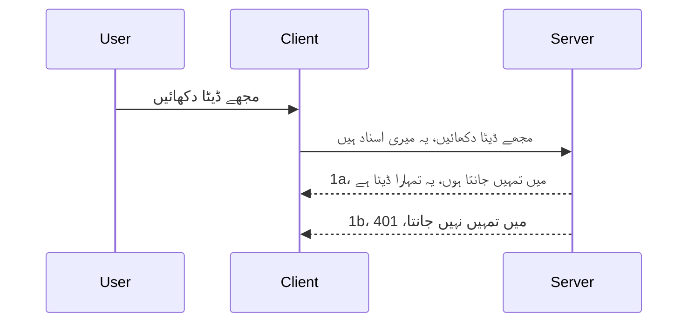

# سادہ تصدیق

MCP SDKs OAuth 2.1 کے استعمال کی حمایت کرتے ہیں جو کہ ایک کافی پیچیدہ عمل ہے جس میں تصدیقی سرور، وسائل سرور، اسناد پوسٹ کرنا، کوڈ حاصل کرنا، کوڈ کو بیئرر ٹوکن میں تبدیل کرنا شامل ہے جب تک کہ آپ آخرکار اپنا وسائل ڈیٹا حاصل نہ کر لیں۔ اگر آپ OAuth کے عادی نہیں ہیں جو کہ نافذ کرنے کے لیے ایک زبردست چیز ہے، تو یہ بہتر ہے کہ آپ کچھ بنیادی سطح کی تصدیق سے شروع کریں اور بہتر اور بہتر سیکیورٹی تک پہنچیں۔ اسی لیے یہ باب موجود ہے، تاکہ آپ کو زیادہ جدید تصدیق کی جانب ترقی دی جا سکے۔

## تصدیق، ہمارا کیا مطلب ہے؟

تصدیق کا مطلب ہے authentication اور authorization۔ خیال یہ ہے کہ ہمیں دو کام کرنے ہوتے ہیں:

- **تصدیق**، یعنی یہ جاننا کہ ہم کسی شخص کو اپنے گھر میں داخل ہونے دیں یا نہیں، کہ اس کے پاس یہ "یہاں" ہونے کا حق ہے یعنی کہ وہ ہمارے وسائل سرور تک رسائی حاصل کر سکتا ہے جہاں ہمارے MCP Server کی خصوصیات موجود ہیں۔
- **اجازت**، یہ جاننا کہ آیا صارف کو ان مخصوص وسائل تک رسائی ہونی چاہیے جن کے لیے وہ درخواست کر رہا ہے، مثلاً یہ آرڈرز یا یہ مصنوعات، یا وہ مواد پڑھ سکتا ہے لیکن حذف نہیں کر سکتا جیسا کہ ایک اور مثال ہے۔

## اسناد: ہم سسٹم کو کیسے بتاتے ہیں کہ ہم کون ہیں

زیادہ تر ویب ڈویلپرز عام طور پر سرور کو ایک سند فراہم کرنے کے بارے میں سوچتے ہیں، عام طور پر ایک خفیہ کلید جو بتاتی ہے کہ کیا انہیں یہاں "تصدیق" کی اجازت ہے۔ یہ سند عموماً صارف نام اور پاس ورڈ کا base64 انکوڈ ورژن ہوتی ہے یا ایک API کلید جو ایک مخصوص صارف کی شناخت کرتی ہے۔

اسے "Authorization" ہیڈر کے ذریعے بھیجا جاتا ہے، اس طرح:

```json
{ "Authorization": "secret123" }
```

اسے عموماً basic authentication کہا جاتا ہے۔ پھر عمومی فلو کچھ اس طرح کام کرتا ہے:


اب چونکہ ہم سمجھ گئے کہ یہ فلو کے لحاظ سے کیسے کام کرتا ہے، تو ہم اسے کیسے نافذ کریں؟ زیادہ تر ویب سرورز میں middleware کا تصور ہوتا ہے، ایک کوڈ کا حصہ جو درخواست کے حصے کے طور پر چلتا ہے جو اسناد کی تصدیق کر سکتا ہے، اور اگر اسناد درست ہوں تو درخواست کو آگے جانے دیتا ہے۔ اگر درخواست میں درست اسناد نہیں ہیں تو آپ کو تصدیقی خرابی ملتی ہے۔ آئیے دیکھتے ہیں کہ اسے کیسے نافذ کیا جا سکتا ہے:

**Python**

```python
class AuthMiddleware(BaseHTTPMiddleware):
    async def dispatch(self, request, call_next):

        has_header = request.headers.get("Authorization")
        if not has_header:
            print("-> Missing Authorization header!")
            return Response(status_code=401, content="Unauthorized")

        if not valid_token(has_header):
            print("-> Invalid token!")
            return Response(status_code=403, content="Forbidden")

        print("Valid token, proceeding...")
       
        response = await call_next(request)
        # کسی بھی کسٹمر ہیڈرز شامل کریں یا جواب میں کسی طرح تبدیلی کریں
        return response


starlette_app.add_middleware(CustomHeaderMiddleware)
```

یہاں ہمارے پاس:

- `AuthMiddleware` نامی middleware بنایا ہے جہاں اس کا `dispatch` طریقہ ویب سرور کی طرف سے چلایا جاتا ہے۔
- middleware کو ویب سرور میں شامل کیا ہے:

    ```python
    starlette_app.add_middleware(AuthMiddleware)
    ```

- منطقی چیک لکھا ہے جو دیکھتا ہے کہ کیا Authorization ہیڈر موجود ہے اور کیا بھیجا گیا راز درست ہے:

    ```python
    has_header = request.headers.get("Authorization")
    if not has_header:
        print("-> Missing Authorization header!")
        return Response(status_code=401, content="Unauthorized")

    if not valid_token(has_header):
        print("-> Invalid token!")
        return Response(status_code=403, content="Forbidden")
    ```

    اگر راز موجود اور درست ہو تو ہم درخواست کو `call_next` کال کر کے آگے جانے دیتے ہیں اور جواب واپس کرتے ہیں۔

    ```python
    response = await call_next(request)
    # صارف کے کسی بھی ہیڈر کو شامل کریں یا کسی طرح سے جواب میں تبدیلی کریں
    return response
    ```

یہ کام اس طرح کرتا ہے کہ اگر ویب درخواست سرور کی جانب بھیجی جاتی ہے تو middleware چلایا جاتا ہے اور اس کی تنصیب کی بنیاد پر درخواست یا تو آگے جاتی ہے یا ایک خرابی واپس کرتی ہے جو ظاہر کرتی ہے کہ کلائنٹ کو آگے بڑھنے کی اجازت نہیں۔

**TypeScript**

یہاں ہم مشہور فریم ورک Express کے ساتھ middleware بناتے ہیں اور درخواست کو MCP Server تک پہنچنے سے پہلے روک لیتے ہیں۔ یہ کوڈ ہے:

```typescript
function isValid(secret) {
    return secret === "secret123";
}

app.use((req, res, next) => {
    // 1. کیا اجازت نامہ ہیڈر موجود ہے؟
    if(!req.headers["Authorization"]) {
        res.status(401).send('Unauthorized');
    }
    
    let token = req.headers["Authorization"];

    // 2. درستگی چیک کریں۔
    if(!isValid(token)) {
        res.status(403).send('Forbidden');
    }

   
    console.log('Middleware executed');
    // 3. درخواست کو درخواست پائپ لائن کے اگلے مرحلے تک بھیجیں۔
    next();
});
```

اس کوڈ میں ہم:

1. چیک کرتے ہیں کہ Authorization ہیڈر موجود ہے یا نہیں، اگر نہیں تو 401 خرابی بھیجتے ہیں۔
2. یقینی بناتے ہیں کہ سند/ٹوکن درست ہے، اگر نہیں تو 403 خرابی بھیجتے ہیں۔
3. آخر میں درخواست کو درخواست پائپ لائن میں آگے بھیجتے ہیں اور مطلوبہ وسائل واپس کرتے ہیں۔

## مشق: تصدیق نافذ کریں

آئیے اپنی معلومات لے کر اسے نافذ کرنے کی کوشش کرتے ہیں۔ پلان یہ ہے:

سرور

- ایک ویب سرور اور MCP انسٹانس بنائیں۔
- سرور کے لیے middleware نافذ کریں۔

کلائنٹ

- ویب درخواست بھیجیں، سند کے ساتھ، ہیڈر کے ذریعے۔

### -1- ویب سرور اور MCP انسٹانس بنائیں

ہمارے پہلے قدم میں، ہمیں ویب سرور انسٹانس اور MCP Server بنانے کی ضرورت ہے۔

**Python**

یہاں ہم MCP سرور انسٹانس بناتے ہیں، starlette ویب ایپ بناتے ہیں اور اسے uvicorn کے ساتھ ہوسٹ کرتے ہیں۔

```python
# ایم سی پی سرور بنا رہا ہے

app = FastMCP(
    name="MCP Resource Server",
    instructions="Resource Server that validates tokens via Authorization Server introspection",
    host=settings["host"],
    port=settings["port"],
    debug=True
)

# اسٹارلیٹ ویب ایپ بنا رہا ہے
starlette_app = app.streamable_http_app()

# یوویکورن کے ذریعے ایپ سرور پر لا رہا ہے
async def run(starlette_app):
    import uvicorn
    config = uvicorn.Config(
            starlette_app,
            host=app.settings.host,
            port=app.settings.port,
            log_level=app.settings.log_level.lower(),
        )
    server = uvicorn.Server(config)
    await server.serve()

run(starlette_app)
```

اس کوڈ میں ہم:

- MCP Server بناتے ہیں۔
- MCP Server سے starlette ویب ایپ بناتے ہیں، `app.streamable_http_app()`۔
- uvicorn `server.serve()` کا استعمال کرتے ہوئے ویب ایپ کو ہوسٹ اور سرور کرتے ہیں۔

**TypeScript**

یہاں ہم MCP Server انسٹانس بناتے ہیں۔

```typescript
const server = new McpServer({
      name: "example-server",
      version: "1.0.0"
    });

    // ... سرور کے وسائل، اوزار، اور پرامپٹس مرتب کریں ...
```

یہ MCP Server بنانا ہمارے POST /mcp راوٹ تعریف کے اندر ہونا چاہیے، تو آئیے اوپر دیا گیا کوڈ لے کر اس طرح منتقل کریں:

```typescript
import express from "express";
import { randomUUID } from "node:crypto";
import { McpServer } from "@modelcontextprotocol/sdk/server/mcp.js";
import { StreamableHTTPServerTransport } from "@modelcontextprotocol/sdk/server/streamableHttp.js";
import { isInitializeRequest } from "@modelcontextprotocol/sdk/types.js"

const app = express();
app.use(express.json());

// سیشن آئی ڈی کے ذریعہ ٹرانسپورٹس کو ذخیرہ کرنے کے لئے نقشہ
const transports: { [sessionId: string]: StreamableHTTPServerTransport } = {};

// کلائنٹ سے سرور مواصلات کے لیے POST درخواستوں کو ہینڈل کریں
app.post('/mcp', async (req, res) => {
  // موجودہ سیشن آئی ڈی کی جانچ کریں
  const sessionId = req.headers['mcp-session-id'] as string | undefined;
  let transport: StreamableHTTPServerTransport;

  if (sessionId && transports[sessionId]) {
    // موجودہ ٹرانسپورٹ کو دوبارہ استعمال کریں
    transport = transports[sessionId];
  } else if (!sessionId && isInitializeRequest(req.body)) {
    // نیا ابتدائیہ درخواست
    transport = new StreamableHTTPServerTransport({
      sessionIdGenerator: () => randomUUID(),
      onsessioninitialized: (sessionId) => {
        // سیشن آئی ڈی کے ذریعہ ٹرانسپورٹ کو ذخیرہ کریں
        transports[sessionId] = transport;
      },
      // ڈی این ایس ریبائنڈنگ تحفظ ڈیفالٹ کے طور پر ناکارہ ہے پیچھے پشت سازگاری کے لیے۔ اگر آپ یہ سرور
      // مقامی طور پر چلا رہے ہیں، تو یقینی بنائیں کہ درج کریں:
      // enableDnsRebindingProtection: true,
      // allowedHosts: ['127.0.0.1'],
    });

    // بند ہونے پر ٹرانسپورٹ کو صاف کریں
    transport.onclose = () => {
      if (transport.sessionId) {
        delete transports[transport.sessionId];
      }
    };
    const server = new McpServer({
      name: "example-server",
      version: "1.0.0"
    });

    // ... سرور کے وسائل، ٹولز، اور پرامپٹس سیٹ کریں ...

    // MCP سرور سے جڑیں
    await server.connect(transport);
  } else {
    // غلط درخواست
    res.status(400).json({
      jsonrpc: '2.0',
      error: {
        code: -32000,
        message: 'Bad Request: No valid session ID provided',
      },
      id: null,
    });
    return;
  }

  // درخواست کو ہینڈل کریں
  await transport.handleRequest(req, res, req.body);
});

// GET اور DELETE درخواستوں کے لیے قابلِ دوبارہ استعمال ہینڈلر
const handleSessionRequest = async (req: express.Request, res: express.Response) => {
  const sessionId = req.headers['mcp-session-id'] as string | undefined;
  if (!sessionId || !transports[sessionId]) {
    res.status(400).send('Invalid or missing session ID');
    return;
  }
  
  const transport = transports[sessionId];
  await transport.handleRequest(req, res);
};

// SSE کے ذریعے سرور سے کلائنٹ تک اطلاعات کے لیے GET درخواستوں کو ہینڈل کریں
app.get('/mcp', handleSessionRequest);

// سیشن ختم کرنے کے لیے DELETE درخواستوں کو ہینڈل کریں
app.delete('/mcp', handleSessionRequest);

app.listen(3000);
```

اب آپ دیکھ رہے ہیں کہ MCP Server بنانا `app.post("/mcp")` کے اندر منتقل کیا گیا ہے۔

آئیے middleware بنانے کے اگلے قدم کی طرف بڑھیں تاکہ ہم آنے والی اسناد کی تصدیق کر سکیں۔

### -2- سرور کے لیے middleware نافذ کریں

اب middleware والے حصے کی باری ہے۔ یہاں ہم ایک middleware بنائیں گے جو `Authorization` ہیڈر میں سند تلاش کرے گا اور اسے تصدیق کرے گا۔ اگر قابل قبول ہو تو درخواست آگے بڑھے گی تاکہ جو بھی کرنا ہو (جیسے ٹولز کی فہرست مرتب کرنا، وسائل کو پڑھنا یا MCP کی کلائنٹ کی مانگی ہوئی کوئی خصوصیت) کیا جا سکے۔

**Python**

middleware بنانے کے لیے، ہمیں `BaseHTTPMiddleware` سے وراثت لینے والی کلاس بنانی ہے۔ دو دلچسپ حصے ہیں:

- درخواست `request`، جس سے ہم ہیڈر کی معلومات پڑھتے ہیں۔
- `call_next` کال بیک جسے ہمیں چلانا ہے اگر کلائنٹ نے قابل قبول سند لائی ہو۔

سب سے پہلے، اگر `Authorization` ہیڈر غائب ہو تو اسے ہینڈل کرنا ہے:

```python
has_header = request.headers.get("Authorization")

# کوئی ہیڈر موجود نہیں، 401 کے ساتھ ناکام ہو، ورنہ آگے بڑھو۔
if not has_header:
    print("-> Missing Authorization header!")
    return Response(status_code=401, content="Unauthorized")
```

یہاں ہم 401 unauthorized میسج بھیجتے ہیں کیونکہ کلائنٹ کی تصدیق ناکام ہے۔

اگلا، اگر سند جمع کرائی گئی ہو تو اس کی درستگی چیک کرتے ہیں:

```python
 if not valid_token(has_header):
    print("-> Invalid token!")
    return Response(status_code=403, content="Forbidden")
```

نوٹ کریں کہ ہم اوپر 403 forbidden میسج بھیج رہے ہیں۔ مکمل middleware دیکھیں جو اوپر بتائی گئی تمام باتیں نافذ کرتا ہے:

```python
class AuthMiddleware(BaseHTTPMiddleware):
    async def dispatch(self, request, call_next):

        has_header = request.headers.get("Authorization")
        if not has_header:
            print("-> Missing Authorization header!")
            return Response(status_code=401, content="Unauthorized")

        if not valid_token(has_header):
            print("-> Invalid token!")
            return Response(status_code=403, content="Forbidden")

        print("Valid token, proceeding...")
        print(f"-> Received {request.method} {request.url}")
        response = await call_next(request)
        response.headers['Custom'] = 'Example'
        return response

```

عمدہ، لیکن `valid_token` فنکشن کیا ہے؟ یہ نیچے ہے:

```python
# اسے پیداواری استعمال کے لیے مت استعمال کریں - اسے بہتر بنائیں !!
def valid_token(token: str) -> bool:
    # "Bearer " کا پیش لفظ حذف کریں
    if token.startswith("Bearer "):
        token = token[7:]
        return token == "secret-token"
    return False
```

یہ واضح طور پر بہتر ہو سکتا ہے۔

اہم: آپ کو کبھی بھی کوڈ میں ایسے راز رکھنے نہیں چاہئیں۔ بہتر ہے کہ ایسے ویلیو کو ڈیٹا ماخذ یا ایک IDP (identity service provider) سے حاصل کریں یا بہتر یہ کہ IDP تصدیق کرے۔

**TypeScript**

Express کے ساتھ اسے نافذ کرنے کے لیے، ہمیں `use` طریقہ کال کرنا پڑتا ہے جو middleware فنکشنز لیتا ہے۔

ہمیں چاہیے:

- درخواست کے متغیر کے ساتھ تعامل کرنا تاکہ `Authorization` پراپرٹی میں بھیجی گئی سند چیک کریں۔
- سِند کی تصدیق کریں، اور اگر قابل قبول ہو تو درخواست کو آگے بڑھنے دیں تاکہ کلائنٹ کی MCP درخواست اپنی مرضی کے مطابق کر سکے (مثلاً ٹولز کی فہرست، وسائل پڑھنا یا MCP سے متعلق کوئی بھی کام)۔

یہاں ہم چیک کر رہے ہیں کہ `Authorization` ہیڈر موجود ہے یا نہیں، اگر نہیں تو ہم درخواست کو روک دیتے ہیں:

```typescript
if(!req.headers["authorization"]) {
    res.status(401).send('Unauthorized');
    return;
}
```

اگر ہیڈر شروع میں نہیں بھیجا گیا تو آپ کو 401 ملے گا۔

اگلا، ہم چیک کرتے ہیں کہ سند درست ہے، اگر نہیں تو دوبارہ درخواست روک دی جاتی ہے لیکن تھوڑے مختلف پیغام کے ساتھ:

```typescript
if(!isValid(token)) {
    res.status(403).send('Forbidden');
    return;
} 
```

اب آپ کو 403 ملے گا۔

مکمل کوڈ یہاں ہے:

```typescript
app.use((req, res, next) => {
    console.log('Request received:', req.method, req.url, req.headers);
    console.log('Headers:', req.headers["authorization"]);
    if(!req.headers["authorization"]) {
        res.status(401).send('Unauthorized');
        return;
    }
    
    let token = req.headers["authorization"];

    if(!isValid(token)) {
        res.status(403).send('Forbidden');
        return;
    }  

    console.log('Middleware executed');
    next();
});
```

ہم نے ویب سرور کو middleware چیک کرنے کے لیے سیٹ کیا ہے تاکہ کلائنٹ کی بھیجی گئی سند چیک کی جا سکے۔ کلائنٹ خود کیا کرے گا؟

### -3- ہیڈر کے ذریعے سند کے ساتھ ویب درخواست بھیجیں

ہمیں یہ یقینی بنانا ہے کہ کلائنٹ ہیڈر کے ذریعے سند بھیج رہا ہے۔ چونکہ ہم MCP کلائنٹ استعمال کرنے جارہے ہیں، ہمیں معلوم کرنا ہے کہ یہ کیسے کیا جائے گا۔

**Python**

کلائنٹ کے لیے، ہمیں اسناد کے ساتھ ایک ہیڈر بھیجنا ہوگا:

```python
# قیمت کو سخت کوڈ نہ کریں، اسے کم از کم ایک ماحولیاتی متغیر یا زیادہ محفوظ ذخیرہ میں رکھیں
token = "secret-token"

async with streamablehttp_client(
        url = f"http://localhost:{port}/mcp",
        headers = {"Authorization": f"Bearer {token}"}
    ) as (
        read_stream,
        write_stream,
        session_callback,
    ):
        async with ClientSession(
            read_stream,
            write_stream
        ) as session:
            await session.initialize()
      
            # TODO، کلائنٹ میں جو آپ کرنا چاہتے ہیں، مثلاً ٹولز کی فہرست بنانا، ٹولز کو کال کرنا وغیرہ۔
```

نوٹ کریں کہ ہم `headers` پراپرٹی یوں بھر رہے ہیں `headers = {"Authorization": f"Bearer {token}"}`۔

**TypeScript**

ہم اسے دو اقدامات میں حل کر سکتے ہیں:

1. ایک configuration آبجیکٹ اپنی سند کے ساتھ تیار کریں۔
2. configuration آبجیکٹ کو ٹرانسپورٹ میں دیں۔

```typescript

// یہاں دکھائے گئے کی طرح ویلیو کو ہارڈ کوڈنگ نہ کریں۔ کم از کم اسے ایک ماحول کی متغیر (env variable) کے طور پر رکھیں اور ڈاٹ این وی جیسے کسی ٹول کا استعمال کریں (ڈیولپمنٹ موڈ میں)۔
let token = "secret123"

// کلائنٹ ٹرانسپورٹ کے اختیارات کا آبجیکٹ تعریف کریں
let options: StreamableHTTPClientTransportOptions = {
  sessionId: sessionId,
  requestInit: {
    headers: {
      "Authorization": "secret123"
    }
  }
};

// اختیارات کے آبجیکٹ کو ٹرانسپورٹ کو منتقل کریں
async function main() {
   const transport = new StreamableHTTPClientTransport(
      new URL(serverUrl),
      options
   );
```

یہاں آپ دیکھ سکتے ہیں کہ ہمیں `options` آبجیکٹ بنانا پڑا اور ہیڈرز کو `requestInit` پراپرٹی کے تحت رکھنا پڑا۔

اہم: اس سے کیسے بہتری کی جائے؟ موجودہ نافذ کردہ طریقہ کار میں کچھ مسائل ہیں۔ سب سے پہلے، ایسی سند بھیجنا کافی خطرناک ہے جب تک کہ آپ کے پاس کم از کم HTTPS نہ ہو۔ اس کے علاوہ، سند چوری ہو سکتی ہے، لہٰذا آپ کو ایسا نظام چاہیے جہاں ٹوکن کو آسانی سے منسوخ کیا جا سکے اور اضافی چیکز شامل کیے جا سکیں جیسا کہ وہ دنیا کے کس حصے سے آ رہا ہے، درخواست بہت زیادہ تو نہیں ہو رہی (بوٹ نما عمل)، خلاصہ یہ کہ بہت سے خدشات ہیں۔ 

تاہم، کہا جا سکتا ہے کہ بہت آسان APIs کے لیے جہاں آپ نہیں چاہتے کہ کوئی بغیر مستند ہوئے آپ کی API کال کرے، یہ ایک اچھا آغاز ہے۔

اب، آئیے سیکیورٹی کو کچھ سخت کریں، ایک معیاری فارمیٹ جیسے JSON Web Token، جسے JWT یا "JOT" ٹوکن بھی کہتے ہیں، کے استعمال سے۔

## JSON Web Tokens، JWT

تو، ہم سادہ اسناد بھیجنے سے بہتر بنانے کی کوشش کر رہے ہیں۔ JWT اپنانے سے ہمیں کیا فوری بہتری ملتی ہے؟

- **سیکیورٹی بہتری**۔ basic auth میں آپ بار بار base64 انکوڈ ٹوکن کے طور پر یوزر نیم اور پاس ورڈ بھیجتے ہیں (یا API کی) جو خطرات بڑھاتا ہے۔ JWT میں آپ اپنا یوزر نیم اور پاس ورڈ بھیجتے ہیں اور ایک ٹوکن حاصل کرتے ہیں جو وقت بندھ ہوتا ہے یعنی معیاد ختم ہو جاتی ہے۔ JWT آپ کو رولز، اسکوپس، اور اجازتوں کی مدد سے باریک بینی سے رسائی کنٹرول کی اجازت دیتا ہے۔
- **اسٹیٹ لیس اور توسیع پذیری**۔ JWT خود مکمل ہوتا ہے، اس میں تمام یوزر معلومات ہوتی ہیں اور سرور پر سیشن اسٹوریج کی ضرورت ختم ہو جاتی ہے۔ ٹوکن مقامی طور پر بھی تصدیق کیا جا سکتا ہے۔
- **بین الاہلیت اور فیڈریشن**۔ JWT Open ID Connect کا مرکز ہے اور سینئر شناخت کنندگان جیسے Entra ID، Google Identity، اور Auth0 کے ساتھ استعمال ہوتا ہے۔ یہ سنگل سائن آن اور مزید بہت کچھ ممکن بناتے ہیں جو اسے ادارہ جاتی معیار بناتا ہے۔
- **ماڈیولر اور لچکدار**۔ JWT API گیٹ ویز جیسے Azure API Management، NGINX اور مزید کے ساتھ بھی استعمال کیا جا سکتا ہے۔ یہ مستعمل تصدیق کی صورتحال اور سرور سے سرور مواصلات بشمول امپرسونیشن اور نمائندگی کے منظرنامے بھی سپورٹ کرتا ہے۔
- **کارکردگی اور کیشینگ**۔ JWT کو ڈی کوڈ کرنے کے بعد کیش کیا جا سکتا ہے جو دوبارہ پارسنگ کی ضرورت کو کم کر دیتا ہے۔ یہ خاص طور پر زیادہ ٹریفک والی ایپس کے لیے مددگار ہے کیونکہ یہ تھروپٹ کو بہتر بناتا ہے اور آپ کے منتخب شدہ انفراسٹرکچر پر لوڈ کم کرتا ہے۔
- **جدید خصوصیات**۔ یہ introspection (سرور پر درستگی کی جانچ) اور revocation (ٹوکن کو ناقابل استعمال بنانا) بھی سپورٹ کرتا ہے۔

ان تمام فوائد کے ساتھ، آیئے دیکھتے ہیں کہ ہم اپنی نفاذ کو اگلے درجے پر کیسے لے جا سکتے ہیں۔

## basic auth کو JWT میں بدلنا

تو، اعلیٰ سطح پر ہمیں جو تبدیلیاں کرنی چاہئیں وہ یہ ہیں:

- **JWT ٹوکن بنانا سیکھیں** اور اسے کلائنٹ سے سرور بھیجنے کے لیے تیار کریں۔
- **JWT ٹوکن کی تصدیق کریں**، اور اگر درست ہو تو کلائنٹ کو ہمارے وسائل تک رسائی دیں۔
- **محفوظ ٹوکن سٹوریج**۔ ہم اسے کیسے محفوظ کریں۔
- **راوٹس کی حفاظت کریں**۔ ہمیں راوٹس کی حفاظت کرنی چاہیے، ہمارے معاملے میں مخصوص MCP خصوصیات اور راوٹس کی۔
- **ریفریش ٹوکن شامل کریں**۔ یقینی بنائیں کہ ہم ٹوکن بنائیں جو مختصر مدت کے ہوں، لیکن ساتھ ہی ریفریش ٹوکن جو طویل مدت کے ہوں تاکہ اگر ٹوکن کی میعاد ختم ہو جائے تو نئے ٹوکن حاصل کیے جا سکیں۔ اس کے ساتھ ریفریش اینڈ پوائنٹ اور روٹیشن حکمت عملی بھی ہونی چاہیے۔

### -1- JWT ٹوکن بنائیں

سب سے پہلے، JWT ٹوکن درج ذیل حصوں پر مشتمل ہوتا ہے:

- **ہیڈر**، استعمال شدہ الگورتھم اور ٹوکن کی قسم۔
- **پے لوڈ**، دعوے (claims)، جیسے sub (صارف یا ہستی جس کی نمائندگی ٹوکن کرتا ہے۔ ایک تصدیقی منظرنامے میں یہ عام طور پر یوزر آئی ڈی ہوتا ہے)، exp (میعاد ختم ہونے کی تاریخ)، role (کردار)
- **دستخط**، ایک راز یا پرائیوٹ کی سے دستخط شدہ۔

اس کے لیے، ہمیں ہیڈر، پے لوڈ اور انکوڈ شدہ ٹوکن بنانا ہوگا۔

**Python**

```python

import jwt
import jwt
from jwt.exceptions import ExpiredSignatureError, InvalidTokenError
import datetime

# JWT پر دستخط کرنے کے لیے خفیہ کلید
secret_key = 'your-secret-key'

header = {
    "alg": "HS256",
    "typ": "JWT"
}

# صارف کی معلومات اور اس کے دعوے اور ختم ہونے کا وقت
payload = {
    "sub": "1234567890",               # موضوع (صارف کی شناخت)
    "name": "User Userson",                # حسب ضرورت دعویٰ
    "admin": True,                     # حسب ضرورت دعویٰ
    "iat": datetime.datetime.utcnow(),# جاری کیا گیا
    "exp": datetime.datetime.utcnow() + datetime.timedelta(hours=1)  # ختم ہونے کا وقت
}

# اسے انکوڈ کریں
encoded_jwt = jwt.encode(payload, secret_key, algorithm="HS256", headers=header)
```

اوپر کے کوڈ میں ہم نے:

- ہیڈر بنایا جس میں HS256 الگورتھم اور JWT کی قسم شامل ہے۔
- پے لوڈ بنایا جس میں سبجیکٹ یا یوزر آئی ڈی، یوزر نام، کردار، جاری کیے جانے کا وقت اور ختم ہونے کا وقت شامل ہے، جو کہ وقت بندش کا تصور نافذ کرتا ہے۔

**TypeScript**

یہاں ہمیں کچھ dependencies کی ضرورت ہوگی جو JWT ٹوکن بنانے میں مدد دیں گی۔

Dependencies

```sh

npm install jsonwebtoken
npm install --save-dev @types/jsonwebtoken
```

اب جب ہمارے پاس یہ موجود ہے، آئیے ہیڈر، پے لوڈ بنائیں اور ان کے ذریعے انکوڈ شدہ ٹوکن بنائیں۔

```typescript
import jwt from 'jsonwebtoken';

const secretKey = 'your-secret-key'; // پیداواری ماحول میں env vars استعمال کریں

// پے لوڈ کی تعریف کریں
const payload = {
  sub: '1234567890',
  name: 'User usersson',
  admin: true,
  iat: Math.floor(Date.now() / 1000), // جاری کیا گیا
  exp: Math.floor(Date.now() / 1000) + 60 * 60 // 1 گھنٹے میں ختم ہو جائے گا
};

// ہیڈر کی تعریف کریں (اختیاری، jsonwebtoken ڈیفالٹ سیٹ کرتا ہے)
const header = {
  alg: 'HS256',
  typ: 'JWT'
};

// ٹوکن بنائیں
const token = jwt.sign(payload, secretKey, {
  algorithm: 'HS256',
  header: header
});

console.log('JWT:', token);
```

یہ ٹوکن:

HS256 کے ذریعے دستخط شدہ  
1 گھنٹے کے لیے درست  
دعویٰ جات جیسے sub, name, admin, iat, اور exp شامل ہیں۔

### -2- ٹوکن کی تصدیق کریں

ہمیں ٹوکن کی تصدیق بھی کرنی ہوگی، یہ کچھ ایسا ہے جو ہمیں سرور پر کرنا چاہیے تاکہ یقینی بنائیں کہ جو کلائنٹ بھیج رہا ہے وہ واقعی درست ہے۔ ہم کئی چیک اس پر کریں گے، اس کی ساخت کی توثیق سے لے کر اس کی درستگی تک۔ آپ کو حوصلہ افزائی کی جاتی ہے کہ مزید چیک شامل کریں تاکہ ٹوکن ہمارے سسٹم کا صارف ظاہر کرے اور صارف کے حقوق کی تصدیق کرے۔

ٹوک کو جانچنے کے لیے، ہمیں اسے ڈی کوڈ کرنا ہوگا تاکہ ہم اسے پڑھ سکیں اور پھر اس کی درستگی چیک کریں:

**Python**

```python

# JWT کو ڈیکوڈ اور تصدیق کریں
try:
    decoded = jwt.decode(token, secret_key, algorithms=["HS256"])
    print("✅ Token is valid.")
    print("Decoded claims:")
    for key, value in decoded.items():
        print(f"  {key}: {value}")
except ExpiredSignatureError:
    print("❌ Token has expired.")
except InvalidTokenError as e:
    print(f"❌ Invalid token: {e}")

```

اس کوڈ میں، ہم `jwt.decode` کو کال کرتے ہیں، ٹوکن، خفیہ کلید اور منتخب شدہ الگورتھم کو بطور ان پٹ استعمال کرتے ہوئے۔ نوٹ کریں کہ ہم try-catch کنسٹرکٹ استعمال کر رہے ہیں کیونکہ ناکام تصدیق پر ایرر آتا ہے۔

**TypeScript**

یہاں ہمیں `jwt.verify` کال کرنی ہوتی ہے تاکہ ٹوکن کا ڈی کوڈ ورژن حاصل ہو جو ہم مزید تجزیہ کر سکیں۔ اگر کال ناکام ہو جائے تو اس کا مطلب ہے کہ ٹوکن کی ساخت غلط ہے یا وہ مزید درست نہیں رہا۔

```typescript

try {
  const decoded = jwt.verify(token, secretKey);
  console.log('Decoded Payload:', decoded);
} catch (err) {
  console.error('Token verification failed:', err);
}
```
  
نوٹ: جیسا کہ پہلے ذکر کیا گیا، ہمیں اضافی چیک کرنے چاہیے کہ یہ ٹوکن ہمارے سسٹم میں ایک صارف کی نشاندہی کرتا ہے اور یقینی بنائیں کہ صارف کے پاس وہ حقوق ہیں جن کا دعویٰ ٹوکن کرتا ہے۔
اب، آئیں کردار کی بنیاد پر رسائی کنٹرول، جسے RBAC بھی کہا جاتا ہے، پر غور کرتے ہیں۔

## کردار کی بنیاد پر رسائی کنٹرول شامل کرنا

خیال یہ ہے کہ ہم ظاہر کرنا چاہتے ہیں کہ مختلف کرداروں کے مختلف اجازت نامے ہیں۔ مثال کے طور پر، ہم فرض کرتے ہیں کہ ایک ایڈمن سب کچھ کر سکتا ہے اور ایک عام صارف پڑھ/لکھ سکتا ہے اور ایک مہمان صرف پڑھ سکتا ہے۔ اس لیے، یہاں کچھ ممکنہ اجازت کی سطحیں ہیں:

- Admin.Write 
- User.Read
- Guest.Read

آئیں دیکھتے ہیں کہ ہم مڈل ویئر کے ساتھ ایسے کنٹرول کو کیسے نافذ کر سکتے ہیں۔ مڈل ویئر کو راوٹ کے لحاظ سے یا تمام راوٹز کے لیے شامل کیا جا سکتا ہے۔

**Python**

```python
from starlette.middleware.base import BaseHTTPMiddleware
from starlette.responses import JSONResponse
import jwt

# کوڈ میں خفیہ معلومات نہ رکھیں، یہ صرف مظاہرے کے مقاصد کے لیے ہے۔ اسے محفوظ جگہ سے پڑھیں۔
SECRET_KEY = "your-secret-key" # اسے env متغیر میں رکھیں۔
REQUIRED_PERMISSION = "User.Read"

class JWTPermissionMiddleware(BaseHTTPMiddleware):
    async def dispatch(self, request, call_next):
        auth_header = request.headers.get("Authorization")
        if not auth_header or not auth_header.startswith("Bearer "):
            return JSONResponse({"error": "Missing or invalid Authorization header"}, status_code=401)

        token = auth_header.split(" ")[1]
        try:
            decoded = jwt.decode(token, SECRET_KEY, algorithms=["HS256"])
        except jwt.ExpiredSignatureError:
            return JSONResponse({"error": "Token expired"}, status_code=401)
        except jwt.InvalidTokenError:
            return JSONResponse({"error": "Invalid token"}, status_code=401)

        permissions = decoded.get("permissions", [])
        if REQUIRED_PERMISSION not in permissions:
            return JSONResponse({"error": "Permission denied"}, status_code=403)

        request.state.user = decoded
        return await call_next(request)


```

مڈل ویئر شامل کرنے کے چند مختلف طریقے درج ذیل ہیں:

```python

# Alt 1: اسٹارلیٹ ایپ کو بناتے ہوئے مڈل ویئر شامل کریں
middleware = [
    Middleware(JWTPermissionMiddleware)
]

app = Starlette(routes=routes, middleware=middleware)

# Alt 2: اسٹارلیٹ ایپ کے بن جانے کے بعد مڈل ویئر شامل کریں
starlette_app.add_middleware(JWTPermissionMiddleware)

# Alt 3: ہر روٹ کے لیے مڈل ویئر شامل کریں
routes = [
    Route(
        "/mcp",
        endpoint=..., # ہینڈلر
        middleware=[Middleware(JWTPermissionMiddleware)]
    )
]
```

**TypeScript**

ہم `app.use` اور ایک مڈل ویئر استعمال کر سکتے ہیں جو تمام درخواستوں کے لیے چلے گا۔

```typescript
app.use((req, res, next) => {
    console.log('Request received:', req.method, req.url, req.headers);
    console.log('Headers:', req.headers["authorization"]);

    // 1. چیک کریں کہ آیا اجازت کا ہیڈر بھیجا گیا ہے

    if(!req.headers["authorization"]) {
        res.status(401).send('Unauthorized');
        return;
    }
    
    let token = req.headers["authorization"];

    // 2. چیک کریں کہ آیا ٹوکن درست ہے
    if(!isValid(token)) {
        res.status(403).send('Forbidden');
        return;
    }  

    // 3. چیک کریں کہ ٹوکن کا صارف ہمارے نظام میں موجود ہے
    if(!isExistingUser(token)) {
        res.status(403).send('Forbidden');
        console.log("User does not exist");
        return;
    }
    console.log("User exists");

    // 4. تصدیق کریں کہ ٹوکن کے پاس صحیح اجازتیں ہیں
    if(!hasScopes(token, ["User.Read"])){
        res.status(403).send('Forbidden - insufficient scopes');
    }

    console.log("User has required scopes");

    console.log('Middleware executed');
    next();
});

```

ہم اپنی مڈل ویئر کو چند اہم چیزیں کرنے دے سکتے ہیں اور جو مڈل ویئر کو لازمی کرنی چاہیے، وہ درج ذیل ہیں:

1. چیک کریں کہ آیا اجازت نامہ ہیڈر موجود ہے
2. چیک کریں کہ ٹوکن درست ہے، ہم `isValid` کہتے ہیں جو ایک طریقہ ہے جو ہم نے لکھا ہے جو JWT ٹوکن کی سالمیت اور درستگی کو چیک کرتا ہے۔
3. تصدیق کریں کہ صارف ہمارے نظام میں موجود ہے، ہمیں یہ چیک کرنا چاہیے۔

   ```typescript
    // ڈیٹا بیس میں صارفین
   const users = [
     "user1",
     "User usersson",
   ]

   function isExistingUser(token) {
     let decodedToken = verifyToken(token);

     // کرنے کے لئے، چیک کریں کہ صارف ڈیٹا بیس میں موجود ہے یا نہیں
     return users.includes(decodedToken?.name || "");
   }
   ```

   اوپر، ہم نے ایک بہت سادہ `users` فہرست بنائی ہے، جو ظاہر ہے کہ ڈیٹا بیس میں ہونی چاہیے۔

4. اضافی طور پر، ہمیں یہ بھی چیک کرنا چاہیے کہ ٹوکن کے پاس درست اجازت نامے ہیں۔

   ```typescript
   if(!hasScopes(token, ["User.Read"])){
        res.status(403).send('Forbidden - insufficient scopes');
   }
   ```

   اوپر کے مڈل ویئر کوڈ میں، ہم چیک کرتے ہیں کہ ٹوکن میں User.Read کی اجازت ہے، اگر نہیں تو ہم 403 کی غلطی بھیج دیتے ہیں۔ نیچے `hasScopes` معاون طریقہ موجود ہے۔

   ```typescript
   function hasScopes(scope: string, requiredScopes: string[]) {
     let decodedToken = verifyToken(scope);
    return requiredScopes.every(scope => decodedToken?.scopes.includes(scope));
  }
   ```

Have a think which additional checks you should be doing, but these are the absolute minimum of checks you should be doing.

Using Express as a web framework is a common choice. There are helpers library when you use JWT so you can write less code.

- `express-jwt`, helper library that provides a middleware that helps decode your token.
- `express-jwt-permissions`, this provides a middleware `guard` that helps check if a certain permission is on the token.

Here's what these libraries can look like when used:

```typescript
const express = require('express');
const jwt = require('express-jwt');
const guard = require('express-jwt-permissions')();

const app = express();
const secretKey = 'your-secret-key'; // put this in env variable

// Decode JWT and attach to req.user
app.use(jwt({ secret: secretKey, algorithms: ['HS256'] }));

// Check for User.Read permission
app.use(guard.check('User.Read'));

// multiple permissions
// app.use(guard.check(['User.Read', 'Admin.Access']));

app.get('/protected', (req, res) => {
  res.json({ message: `Welcome ${req.user.name}` });
});

// Error handler
app.use((err, req, res, next) => {
  if (err.code === 'permission_denied') {
    return res.status(403).send('Forbidden');
  }
  next(err);
});

```

اب آپ نے دیکھا کہ مڈل ویئر کو توثیق اور اجازت دونوں کے لیے کیسے استعمال کیا جا سکتا ہے، لیکن MCP کے بارے میں کیا خیال ہے؟ کیا یہ تصدیق کرنے کے طریقے کو بدلتا ہے؟ آئیں اگلے حصے میں معلوم کرتے ہیں۔

### -3- MCP میں RBAC شامل کریں

اب تک آپ نے دیکھا کہ آپ مڈل ویئر کے ذریعے RBAC کیسے شامل کر سکتے ہیں، تاہم، MCP کے لیے ہر MCP خصوصیت کے لیے RBAC شامل کرنے کا آسان طریقہ موجود نہیں ہے، تو ہم کیا کرتے ہیں؟ ٹھیک ہے، ہمیں صرف اس طرح کوڈ شامل کرنا ہوگا جو اس صورت میں چیک کرے کہ کلائنٹ کو کسی مخصوص ٹول کو کال کرنے کے حقوق حاصل ہیں یا نہیں:

ہر خصوصیت کے لیے RBAC پورا کرنے کے لیے آپ کے پاس چند مختلف اختیارات ہیں، یہاں کچھ ہیں:

- ہر ٹول، وسیلہ، یا پرامپٹ کے لیے چیک شامل کریں جہاں آپ کو اجازت کی سطح چیک کرنا ہو۔

   **python**

   ```python
   @tool()
   def delete_product(id: int):
      try:
          check_permissions(role="Admin.Write", request)
      catch:
        pass # کلائنٹ کی اجازت ناکام ہوگئی، اجازت کی غلطی اٹھائیں
   ```

   **typescript**

   ```typescript
   server.registerTool(
    "delete-product",
    {
      title: Delete a product",
      description: "Deletes a product",
      inputSchema: { id: z.number() }
    },
    async ({ id }) => {
      
      try {
        checkPermissions("Admin.Write", request);
        // کرنے کے لیے، id کو productService اور remote entry کو بھیجیں
      } catch(Exception e) {
        console.log("Authorization error, you're not allowed");  
      }

      return {
        content: [{ type: "text", text: `Deletected product with id ${id}` }]
      };
    }
   );
   ```


- جدید سرور طریقہ استعمال کریں اور درخواست ہینڈلرز تاکہ آپ کو چیک کرنے کی جگہیں کم سے کم ہوں۔

   **Python**

   ```python
   
   tool_permission = {
      "create_product": ["User.Write", "Admin.Write"],
      "delete_product": ["Admin.Write"]
   }

   def has_permission(user_permissions, required_permissions) -> bool:
      # صارف کی اجازتیں: صارف کے پاس اجازتوں کی فہرست
      # ضروری اجازتیں: ٹول کے لیے مطلوبہ اجازتوں کی فہرست
      return any(perm in user_permissions for perm in required_permissions)

   @server.call_tool()
   async def handle_call_tool(
     name: str, arguments: dict[str, str] | None
   ) -> list[types.TextContent]:
    # فرض کریں request.user.permissions صارف کے لیے اجازتوں کی فہرست ہے
     user_permissions = request.user.permissions
     required_permissions = tool_permission.get(name, [])
     if not has_permission(user_permissions, required_permissions):
        # خرابی دیں "آپ کو ٹول {name} کو کال کرنے کی اجازت نہیں ہے"
        raise Exception(f"You don't have permission to call tool {name}")
     # جاری رکھیں اور ٹول کال کریں
     # ...
   ```   
   

   **TypeScript**

   ```typescript
   function hasPermission(userPermissions: string[], requiredPermissions: string[]): boolean {
       if (!Array.isArray(userPermissions) || !Array.isArray(requiredPermissions)) return false;
       // اگر صارف کے پاس کم از کم ایک مطلوبہ اجازت ہو تو درست واپس کریں
       
       return requiredPermissions.some(perm => userPermissions.includes(perm));
   }
  
   server.setRequestHandler(CallToolRequestSchema, async (request) => {
      const { params: { name } } = request;
  
      let permissions = request.user.permissions;
  
      if (!hasPermission(permissions, toolPermissions[name])) {
         return new Error(`You don't have permission to call ${name}`);
      }
  
      // جاری رکھیں..
   });
   ```

   نوٹ کریں، آپ کو یقینی بنانا ہوگا کہ آپ کی مڈل ویئر درخواست کے صارف پراپرٹی کو ڈی کوڈ شدہ ٹوکن تفویض کرے تاکہ اوپر کا کوڈ آسان ہو جائے۔

### خلاصہ

اب جب کہ ہم نے RBAC کو عام طور پر اور خاص طور پر MCP کے لیے شامل کرنے پر بات کی، تو یہ وقت ہے کہ آپ خود سییکیورٹی نافذ کرنے کی کوشش کریں تاکہ آپ کو آپ کو پیش کردہ تصورات کی سمجھ ہو۔

## اسائنمنٹ 1: بنیادی توثیق کا استعمال کرتے ہوئے mcp سرور اور mcp کلائنٹ بنائیں

یہاں آپ نے ہیدرز کے ذریعے اسناد بھیجنے کے حوالے سے جو کچھ سیکھا ہے اسے استعمال کریں گے۔

## حل 1

[حل 1](./code/basic/README.md)

## اسائنمنٹ 2: اسائنمنٹ 1 کے حل کو JWT استعمال کرنے کے لیے اپ گریڈ کریں

پہلے حل کو لیں لیکن اس بار، بہتر بنانے کی کوشش کریں۔

بنیادی تصدیق کے بجائے، آئیے JWT استعمال کریں۔

## حل 2

[حل 2](./solution/jwt-solution/README.md)

## چیلنج

وہ RBAC فی ٹول شامل کریں جسے ہم نے سیکشن "MCP میں RBAC شامل کریں" میں بیان کیا ہے۔

## خلاصہ

امید ہے آپ نے اس باب میں بہت کچھ سیکھا ہوگا، مکمل عدم تحفظ سے لے کر بنیادی تحفظ، JWT اور یہ کہ اسے MCP میں کیسے شامل کیا جا سکتا ہے۔

ہم نے حسب ضرورت JWT کے ساتھ مضبوط بنیاد رکھی ہے، لیکن جیسے جیسے ہم بڑھ رہے ہیں، ہم ایک اسٹینڈرڈ پر مبنی شناخت کے ماڈل کی طرف بڑھ رہے ہیں۔ Entra یا Keycloak جیسے IdP کو اپنانا ہمیں ٹوکن کے اجرا، تصدیق اور زندگی کے انتظام کو ایک قابل اعتماد پلیٹ فارم پر چھوڑنے دیتا ہے — تاکہ ہم ایپ کے منطق اور صارف کے تجربے پر توجہ دے سکیں۔

اس کے لیے، ہمارے پاس Entra پر ایک مزید [جدید باب](../../05-AdvancedTopics/mcp-security-entra/README.md) موجود ہے۔

## آئندہ کیا ہے

- اگلا: [MCP ہوسٹس کی سیٹنگ](../12-mcp-hosts/README.md)

---

<!-- CO-OP TRANSLATOR DISCLAIMER START -->
**اہم اعلان**:  
اس دستاویز کا ترجمہ AI ترجمہ سروس [Co-op Translator](https://github.com/Azure/co-op-translator) کے ذریعے کیا گیا ہے۔ اگرچہ ہم درستگی کی کوشش کرتے ہیں، براہ کرم اس بات سے آگاہ رہیں کہ خودکار ترجموں میں غلطیاں یا کمی بیشی ہو سکتی ہے۔ اصل دستاویز اپنی مادری زبان میں معتبر ماخذ سمجھا جانا چاہیے۔ اہم معلومات کے لیے پیشہ ور انسانی ترجمہ تجویز کیا جاتا ہے۔ اس ترجمے کے استعمال سے پیدا ہونے والی کسی بھی غلط فہمی یا غلط تشریحات کی ذمہ داری ہم پر نہیں ہوگی۔
<!-- CO-OP TRANSLATOR DISCLAIMER END -->