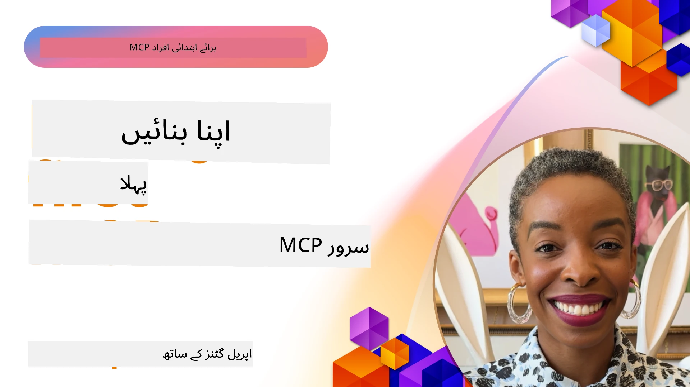

## شروع کریں

_(اس سبق کی ویڈیو دیکھنے کے لیے اوپر تصویر پر کلک کریں)_

یہ سیکشن کئی اسباق پر مشتمل ہے:

- **1 آپ کا پہلا سرور**، اس پہلے سبق میں، آپ سیکھیں گے کہ اپنا پہلا سرور کیسے بنائیں اور اسے انسپکٹر ٹول سے معائنہ کریں، جو آپ کے سرور کی جانچ اور ڈیبگ کرنے کا ایک قیمتی طریقہ ہے، [سبق پر جائیں](01-first-server/README.md)

- **2 کلائنٹ**، اس سبق میں، آپ سیکھیں گے کہ ایسا کلائنٹ کیسے لکھا جائے جو آپ کے سرور سے جڑ سکے، [سبق پر جائیں](02-client/README.md)

- **3 LLM کے ساتھ کلائنٹ**، کلائنٹ لکھنے کا ایک بہتر طریقہ یہ ہے کہ اس میں ایک LLM شامل کیا جائے تاکہ یہ "مذاکرہ" کر سکے کہ سرور کے ساتھ کیا کرنا ہے، [سبق پر جائیں](03-llm-client/README.md)

- **4 Visual Studio Code میں سرور GitHub Copilot ایجنٹ موڈ کا استعمال**۔ یہاں، ہم Visual Studio Code سے اپنے MCP سرور کو چلانے پر غور کر رہے ہیں، [سبق پر جائیں](04-vscode/README.md)

- **5 stdio ٹرانسپورٹ سرور** stdio ٹرانسپورٹ مقامی MCP سرور سے کلائنٹ تک مواصلات کے لیے تجویز کردہ معیار ہے، جو اندرونی عمل کی تنہائی کے ساتھ محفوظ ذیلی عمل پر مبنی مواصلات فراہم کرتا ہے [سبق پر جائیں](05-stdio-server/README.md)

- **6 MCP کے ساتھ HTTP اسٹریمنگ (Streamable HTTP)**۔ جدید HTTP اسٹریمنگ ٹرانسپورٹ کے بارے میں جانیں (جو [MCP Specification 2025-11-25](https://spec.modelcontextprotocol.io/specification/2025-11-25/basic/transports/#streamable-http) کے مطابق ریموٹ MCP سرورز کے لیے تجویز کردہ طریقہ کار ہے)، پیش رفت کی اطلاعات، اور یہ کہ اسٹریمیبل HTTP کا استعمال کرتے ہوئے کس طرح قابل توسیع، حقیقی وقت کے MCP سرور اور کلائنٹ بنائیں۔ [سبق پر جائیں](06-http-streaming/README.md)

- **7 VSCode کے لیے AI Toolkit کا استعمال** تاکہ آپ اپنے MCP کلائنٹس اور سرورز کو کنزیوم اور ٹیسٹ کر سکیں [سبق پر جائیں](07-aitk/README.md)

- **8 ٹیسٹنگ**۔ یہاں ہم خاص طور پر دیکھیں گے کہ کس طرح اپنے سرور اور کلائنٹ کو مختلف طریقوں سے ٹیسٹ کیا جا سکتا ہے، [سبق پر جائیں](08-testing/README.md)

- **9 تعیناتی**۔ یہ باب آپ کے MCP حلوں کی تعیناتی کے مختلف طریقے دیکھے گا، [سبق پر جائیں](09-deployment/README.md)

- **10 جدید سرور استعمال**۔ یہ باب جدید سرور استعمال کا احاطہ کرتا ہے، [سبق پر جائیں](./10-advanced/README.md)

- **11 تصدیق**۔ یہ باب سادہ تصدیق کے طریقے بتاتا ہے، بنیادی تصدیق سے لے کر JWT اور RBAC کے استعمال تک۔ آپ کو یہاں سے شروع کرنے کی ترغیب دی جاتی ہے اور پھر باب 5 میں جدید موضوعات دیکھیں اور باب 2 میں سفارشات کے ذریعے اضافی سیکورٹی سختی کریں، [سبق پر جائیں](./11-simple-auth/README.md)

- **12 MCP میزبان**۔ Claude Desktop، Cursor، Cline، اور Windsurf سمیت مشہور MCP میزبان کلائنٹس کو ترتیب دیں اور استعمال کریں۔ ٹرانسپورٹ اقسام اور مسائل حل کرنا سیکھیں، [سبق پر جائیں](./12-mcp-hosts/README.md)

- **13 MCP انسپکٹر**۔ MCP انسپکٹر ٹول کا استعمال کرتے ہوئے اپنے MCP سرورز کو انٹریکٹیو طریقے سے ڈیبگ اور ٹیسٹ کریں۔ ٹولز، وسائل، اور پروٹوکول پیغامات کے مسائل کا پتہ لگانا سیکھیں، [سبق پر جائیں](./13-mcp-inspector/README.md)

ماڈل کانٹیکسٹ پروٹوکول (MCP) ایک کھلا پروٹوکول ہے جو یہ معیاری کرتا ہے کہ ایپلیکیشنز LLMs کو کانٹیکسٹ کیسے فراہم کرتی ہیں۔ MCP کو AI ایپلیکیشنز کے لیے USB-C پورٹ کے طور پر سوچیں - یہ AI ماڈلز کو مختلف ڈیٹا ذرائع اور ٹولز سے منسلک کرنے کا ایک معیاری طریقہ فراہم کرتا ہے۔

## سیکھنے کے مقاصد

اس سبق کے آخر تک، آپ یہ کر سکیں گے:

- C#, Java, Python, TypeScript، اور JavaScript میں MCP کے لیے ترقیاتی ماحول سیٹ اپ کرنا
- بنیادی MCP سرورز کو حسب ضرورت خصوصیات (وسائل، پرامپٹس، اور ٹولز) کے ساتھ بنانا اور تعینات کرنا
- میزبان ایپلیکیشنز بنانا جو MCP سرورز سے جڑتی ہیں
- MCP اطلاق کی جانچ اور ڈیبگ کرنا
- عام سیٹ اپ چیلنجز اور ان کے حل کو سمجھنا
- اپنے MCP اطلاق کو مشہور LLM خدمات سے منسلک کرنا

## اپنا MCP ماحول سیٹ کرنا

MCP کے ساتھ کام شروع کرنے سے پہلے، اپنے ڈیولپمنٹ ماحول کو تیار کرنا اور بنیادی ورک فلو کو سمجھنا ضروری ہے۔ یہ سیکشن آپ کو ابتدائی سیٹ اپ مراحل سے گزرتا ہے تاکہ MCP کے ساتھ آسان آغاز ہو سکے۔

### لازمی ضروریات

MCP کی ترقی میں جانے سے پہلے، یقینی بنائیں کہ آپ کے پاس:

- **ترقیاتی ماحول**: اپنی منتخب زبان (C#, Java, Python, TypeScript، یا JavaScript) کے لیے
- **IDE/ایڈیٹر**: Visual Studio، Visual Studio Code، IntelliJ، Eclipse، PyCharm، یا کوئی جدید کوڈ ایڈیٹر
- **پیکیج منیجرز**: NuGet، Maven/Gradle، pip، یا npm/yarn
- **API کیز**: کسی بھی AI خدمات کے لیے جنہیں آپ اپنی میزبان ایپلیکیشنز میں استعمال کرنے کا ارادہ رکھتے ہیں

### سرکاری SDKs

آئندہ ابواب میں آپ حل دیکھیں گے جو Python، TypeScript، Java اور .NET استعمال کرتے ہیں۔ یہاں تمام سرکاری طور پر حمایت یافتہ SDKs دیے گئے ہیں۔

MCP متعدد زبانوں کے لیے سرکاری SDKs فراہم کرتا ہے ([MCP Specification 2025-11-25](https://spec.modelcontextprotocol.io/specification/2025-11-25/) کے مطابق):
- [C# SDK](https://github.com/modelcontextprotocol/csharp-sdk) - مائیکروسافٹ کے ساتھ تعاون میں برقرار رکھا گیا
- [Java SDK](https://github.com/modelcontextprotocol/java-sdk) - Spring AI کے ساتھ تعاون میں برقرار رکھا گیا
- [TypeScript SDK](https://github.com/modelcontextprotocol/typescript-sdk) - سرکاری TypeScript امپلیمینٹیشن
- [Python SDK](https://github.com/modelcontextprotocol/python-sdk) - سرکاری Python امپلیمینٹیشن (FastMCP)
- [Kotlin SDK](https://github.com/modelcontextprotocol/kotlin-sdk) - سرکاری Kotlin امپلیمینٹیشن
- [Swift SDK](https://github.com/modelcontextprotocol/swift-sdk) - Loopwork AI کے ساتھ تعاون میں برقرار رکھا گیا
- [Rust SDK](https://github.com/modelcontextprotocol/rust-sdk) - سرکاری Rust امپلیمینٹیشن
- [Go SDK](https://github.com/modelcontextprotocol/go-sdk) - سرکاری Go امپلیمینٹیشن

## اہم نکات

- MCP ترقیاتی ماحول زبان مخصوص SDKs کے ساتھ سیٹ کرنا آسان ہے
- MCP سرورز بنانا ٹولز کو واضح schemas کے ساتھ تخلیق اور رجسٹر کرنے پر مشتمل ہے
- MCP کلائنٹس سرورز اور ماڈلز سے جڑ کر توسیعی صلاحیتیں حاصل کرتے ہیں
- جانچ اور ڈیبگ MCP اطلاق کے قابل اعتماد ہونے کے لیے ضروری ہیں
- تعیناتی کے اختیارات مقامی ترقی سے کلاؤڈ پر مبنی حل تک مختلف ہیں

## مشق کرنا

ہمارے پاس چند نمونے موجود ہیں جو اس سیکشن کے تمام ابواب میں دی گئی مشقوں کی تکمیل کرتے ہیں۔ اضافی طور پر ہر باب میں اپنی مشقیں اور اسائنمنٹس بھی شامل ہیں

- [Java کیلکولیٹر](./samples/java/calculator/README.md)
- [.Net کیلکولیٹر](../../../03-GettingStarted/samples/csharp)
- [JavaScript کیلکولیٹر](./samples/javascript/README.md)
- [TypeScript کیلکولیٹر](./samples/typescript/README.md)
- [Python کیلکولیٹر](../../../03-GettingStarted/samples/python)

## اضافی وسائل

- [Azure پر ماڈل کانٹیکسٹ پروٹوکول استعمال کرتے ہوئے ایجنٹس بنائیں](https://learn.microsoft.com/azure/developer/ai/intro-agents-mcp)
- [Azure Container Apps کے ساتھ ریموٹ MCP (Node.js/TypeScript/JavaScript)](https://learn.microsoft.com/samples/azure-samples/mcp-container-ts/mcp-container-ts/)
- [.NET OpenAI MCP ایجنٹ](https://learn.microsoft.com/samples/azure-samples/openai-mcp-agent-dotnet/openai-mcp-agent-dotnet/)

## اگلا کیا ہے

پہلے سبق سے شروع کریں: [اپنا پہلا MCP سرور بنانا](01-first-server/README.md)

جب آپ نے یہ ماڈیول مکمل کر لیا تو: [ماڈیول 4: عملی نفاذ](../04-PracticalImplementation/README.md) پر جاری رکھیں۔

---

<!-- CO-OP TRANSLATOR DISCLAIMER START -->
**اعلانِ مسوولیت**:  
یہ دستاویز AI ترجمہ سروس [Co-op Translator](https://github.com/Azure/co-op-translator) کے ذریعے ترجمہ کی گئی ہے۔ اگرچہ ہم درستگی کے لیے کوشاں ہیں، براہِ کرم نوٹ کریں کہ خودکار ترجموں میں غلطیاں یا عدم درستی ہو سکتی ہے۔ اصل دستاویز اپنی مادری زبان میں معتبر ماخذ سمجھی جانی چاہیے۔ اہم معلومات کے لیے پیشہ ورانہ انسانی ترجمہ تجویز کیا جاتا ہے۔ ہم اس ترجمے کے استعمال سے پیدا ہونے والی کسی بھی غلط فہمی یا غلط تشریح کے ذمہ دار نہیں ہیں۔
<!-- CO-OP TRANSLATOR DISCLAIMER END -->