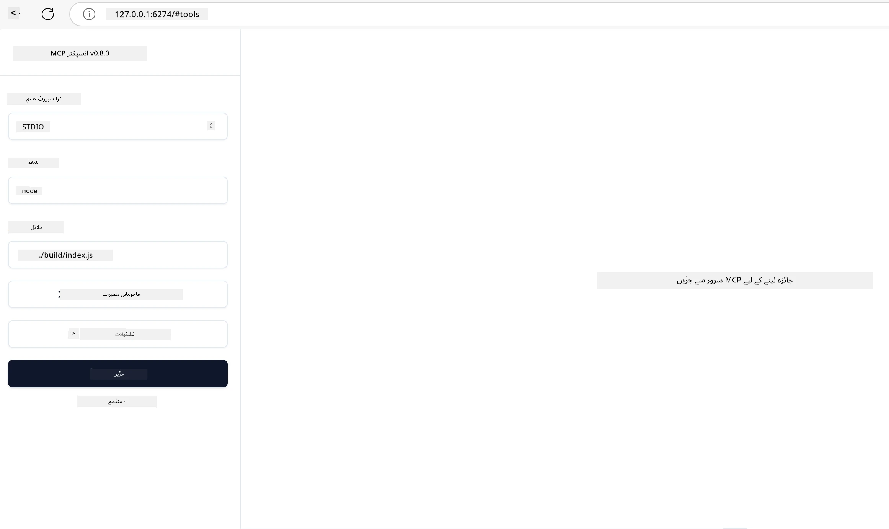

# عملی نفاذ

[](https://youtu.be/vCN9-mKBDfQ)

_(اس سبق کی ویڈیو دیکھنے کے لیے اوپر تصویر پر کلک کریں)_

عملی نفاذ وہ مقام ہے جہاں ماڈل کانٹیکسٹ پروٹوکول (MCP) کی طاقت محسوس ہوتی ہے۔ اگرچہ MCP کے پیچھے نظریہ اور معماریت کو سمجھنا ضروری ہے، حقیقی قدر تب نکلتی ہے جب آپ ان تصورات کو استعمال کرتے ہوئے حقیقی دنیا کے مسائل کا حل تیار، ٹیسٹ اور تعینات کرتے ہیں۔ یہ باب نظریاتی علم اور عملی ترقی کے درمیان پل کا کام کرتا ہے، اور آپ کو MCP کی بنیاد پر ایپلیکیشنز کو زندہ کرنے کے عمل سے رہنمائی فراہم کرتا ہے۔

چاہے آپ ذہین معاونین تیار کر رہے ہوں، کاروباری ورک فلو میں AI کو شامل کر رہے ہوں، یا ڈیٹا پروسیسنگ کے لیے کسٹم آلات بنا رہے ہوں، MCP ایک لچکدار بنیاد فراہم کرتا ہے۔ اس کا زبان سے آزاد ڈیزائن اور مقبول پروگرامنگ زبانوں کے لیے سرکاری SDKs اسے ایک وسیع پیمانے پر ڈیولپرز کے لیے قابل رسائی بناتا ہے۔ ان SDKs کا فائدہ اٹھاتے ہوئے، آپ مختلف پلیٹ فارمز اور ماحول میں تیزی سے پروٹوٹائپ بنا سکتے ہیں، دہرائی کر سکتے ہیں، اور اپنے حل کو اسکیل کر سکتے ہیں۔

اگلے حصوں میں، آپ کو عملی مثالیں، نمونہ کوڈ، اور تعیناتی کی حکمت عملی ملے گی جو دکھاتی ہیں کہ MCP کو C#، جاوا اسپرنگ کے ساتھ، ٹائپ اسکرپٹ، جاوا اسکرپٹ، اور پائتھن میں کیسے نافذ کیا جائے۔ آپ یہ بھی سیکھیں گے کہ MCP سرورز کی خرابی تلاش اور جانچ کیسے کی جائے، APIs کو منظم کیا جائے، اور Azure استعمال کرتے ہوئے کلاؤڈ میں حل کو تعینات کیا جائے۔ یہ عملی وسائل آپ کی سیکھنے کی رفتار کو تیز کرنے اور مضبوط، تیار پیداواری MCP ایپلیکیشنز بنانے میں معاون ہیں۔

## جائزہ

یہ سبق MCP نفاذ کے عملی پہلوؤں پر مختلف پروگرامنگ زبانوں میں مرکوز ہے۔ ہم دیکھیں گے کہ C#, Java with Spring, TypeScript, JavaScript, اور Python میں MCP SDKs کا استعمال کیسے کیا جائے، MCP سرورز کی خرابی تلاش اور جانچ کیسے کی جائے، اور قابل استعمال وسائل، پرامپٹس، اور آلات کیسے تیار کیے جائیں۔

## سیکھنے کے مقاصد

اس سبق کے آخر میں، آپ قابل ہوں گے:

- مختلف پروگرامنگ زبانوں میں سرکاری SDKs کا استعمال کرتے ہوئے MCP حل نافذ کرنا
- MCP سرورز کی نظاماتی خرابی تلاش اور جانچ کرنا
- سرور کی خصوصیات (وسائل، پرامپٹس، اور آلات) بنانا اور استعمال کرنا
- پیچیدہ کاموں کے لیے مؤثر MCP ورک فلو ڈیزائن کرنا
- کارکردگی اور اعتمادیت کے لیے MCP نفاذ کو بہتر بنانا

## سرکاری SDK وسائل

ماڈل کانٹیکسٹ پروٹوکول متعدد زبانوں کے لیے سرکاری SDKs فراہم کرتا ہے (جو [MCP اسپیسفیکیشن 2025-11-25](https://spec.modelcontextprotocol.io/specification/2025-11-25/) کے مطابق ہیں):

- [C# SDK](https://github.com/modelcontextprotocol/csharp-sdk)
- [Java with Spring SDK](https://github.com/modelcontextprotocol/java-sdk) **نوٹ:** [Project Reactor](https://projectreactor.io) پر انحصار ضروری ہے۔ (دیکھیں [بحث کا شمارہ 246](https://github.com/orgs/modelcontextprotocol/discussions/246).)
- [TypeScript SDK](https://github.com/modelcontextprotocol/typescript-sdk)
- [Python SDK](https://github.com/modelcontextprotocol/python-sdk)
- [Kotlin SDK](https://github.com/modelcontextprotocol/kotlin-sdk)
- [Go SDK](https://github.com/modelcontextprotocol/go-sdk)

## MCP SDKs کے ساتھ کام کرنا

یہ سیکشن متعدد پروگرامنگ زبانوں میں MCP نفاذ کی عملی مثالیں فراہم کرتا ہے۔ آپ `samples` ڈائریکٹری میں زبان کے حساب سے منظم نمونہ کوڈ پا سکتے ہیں۔

### دستیاب نمونے

ریپوزیٹری میں درج ذیل زبانوں میں [نمونہ نفاذ](../../../04-PracticalImplementation/samples) شامل ہیں:

- [C#](./samples/csharp/README.md)
- [Java with Spring](./samples/java/containerapp/README.md)
- [TypeScript](./samples/typescript/README.md)
- [JavaScript](./samples/javascript/README.md)
- [Python](./samples/python/README.md)

ہر نمونہ متعلقہ زبان اور ماحولیاتی نظام کے لیے اہم MCP تصورات اور نفاذی پیٹرنز ظاہر کرتا ہے۔

### عملی رہنما

عملی MCP نفاذ کے لیے اضافی رہنما خطوط:

- [صفحہ بندی اور بڑے نتائج کے مجموعے](./pagination/README.md) - آلات، وسائل، اور بڑے ڈیٹا سیٹس کے لیے کرسر پر مبنی صفحہ بندی کو سنبھالیں

## بنیادی سرور خصوصیات

MCP سرورز ان خصوصیات کے کسی بھی امتزاج کو نافذ کر سکتے ہیں:

### وسائل

وسائل صارف یا AI ماڈل کے لیے مواد اور ڈیٹا فراہم کرتے ہیں:

- دستاویزی ذخائر
- علم کے بنیادی ذخائر
- منظم شدہ ڈیٹا ذرائع
- فائل سسٹمز

### پرامپٹس

پرامپٹس صارفین کے لیے ٹیمپلیٹ بنائے گئے پیغامات اور ورک فلو ہیں:

- پہلے سے متعین کی گئی بات چیت ٹیمپلیٹس
- رہنمائی شدہ بات چیت کے نمونے
- خصوصی مکالماتی ڈھانچے

### آلات

آلات AI ماڈل کے لیے قابل عمل افعال ہیں:

- ڈیٹا پروسیسنگ یوٹیلیٹیز
- خارجی API انضمام
- حسابی صلاحیتیں
- تلاش کی فعالیت

## نمونہ نفاذ: C# نفاذ

سرکاری C# SDK ریپوزیٹری میں MCP کے مختلف پہلوؤں کو ظاہر کرنے والے متعدد نمونہ نفاذ موجود ہیں:

- **بنیادی MCP کلائنٹ**: MCP کلائنٹ بنانے اور آلات کال کرنے کی آسان مثال
- **بنیادی MCP سرور**: بنیادی سرور نفاذ جس میں صرف آلات کی رجسٹریشن شامل ہے
- **جدید MCP سرور**: مکمل خصوصیات کے حامل سرور، جس میں آلات کی رجسٹریشن، توثیق، اور غلطی کا انتظام شامل ہے
- **ASP.NET انضمام**: ASP.NET کور کے ساتھ انضمام دکھانے والی مثالیں
- **آلات نفاذ کے پیٹرنز**: مختلف پیچیدگیوں کے ساتھ آلات نافذ کرنے کے مختلف پیٹرنز

MCP C# SDK ابھی پریویو میں ہے اور APIs میں تبدیلی ہو سکتی ہے۔ ہم اس بلاگ کو SDK کی ترقی کے ساتھ مسلسل اپڈیٹ کرتے رہیں گے۔

### اہم خصوصیات

- [C# MCP نوگیٹ ModelContextProtocol](https://www.nuget.org/packages/ModelContextProtocol)
- اپنا [پہلا MCP سرور بنانا](https://devblogs.microsoft.com/dotnet/build-a-model-context-protocol-mcp-server-in-csharp/).

مکمل C# نفاذ کے نمونوں کے لیے، سرکاری C# SDK نمونہ ریپوزیٹری ملاحظہ کریں: [https://github.com/modelcontextprotocol/csharp-sdk](https://github.com/modelcontextprotocol/csharp-sdk)

## نمونہ نفاذ: جاوا اسپرنگ کے ساتھ نفاذ

جاوا اسپرنگ SDK مضبوط MCP نفاذ کے اختیارات پیش کرتا ہے جو انٹرپرائز درجے کی خصوصیات کے حامل ہیں۔

### اہم خصوصیات

- اسپرنگ فریم ورک کا انضمام
- مضبوط ٹائپ سیفٹی
- ریئیکٹو پروگرامنگ سپورٹ
- جامع غلطی کا انتظام

مکمل جاوا اسپرنگ نفاذ کے نمونے کے لیے، [جاوا اسپرنگ نمونہ](samples/java/containerapp/README.md) دیکھیں۔

## نمونہ نفاذ: جاوا اسکرپٹ نفاذ

جاوا اسکرپٹ SDK MCP نفاذ کے لیے ہلکا پھلکا اور لچکدار طریقہ فراہم کرتا ہے۔

### اہم خصوصیات

- نوڈ.جس اور براؤزر کی حمایت
- پرومس کی بنیاد پر API
- ایکسپریس اور دیگر فریم ورکس کے ساتھ آسان انضمام
- اسٹریم کرنے کے لیے ویب ساکٹ سپورٹ

مکمل جاوا اسکرپٹ نفاذ کے نمونے کے لیے، [جاوا اسکرپٹ نمونہ](samples/javascript/README.md) دیکھیں۔

## نمونہ نفاذ: پائتھن نفاذ

پائتھن SDK MCP نفاذ کے لیے پائتھونک طریقہ فراہم کرتا ہے جس میں اعلیٰ ML فریم ورک انضمام شامل ہیں۔

### اہم خصوصیات

- asyncio کے ساتھ async/await سپورٹ
- FastAPI انضمام
- آسان ٹول رجسٹریشن
- مقبول ML لائبریریوں کے ساتھ مقامی انضمام

مکمل پائتھن نفاذ کے نمونے کے لیے، [پائتھن نمونہ](samples/python/README.md) دیکھیں۔

## API مینجمنٹ

Azure API مینجمنٹ اچھا حل ہے کہ ہم MCP سرورز کو کس طرح محفوظ رکھ سکتے ہیں۔ خیال یہ ہے کہ اپنے MCP سرور کے سامنے ایک Azure API مینجمنٹ انسٹنس رکھیں اور یہ خصوصیات سنبھالنے دیں جو آپ کو چاہیے ہو سکتی ہیں جیسے:

- ریٹ لمیٹنگ
- ٹوکن مینجمنٹ
- مانیٹرنگ
- لوڈ بیلنسنگ
- سیکیورٹی

### Azure نمونہ

یہاں ایک Azure نمونہ ہے جو بالکل یہی کرتا ہے، یعنی [ایک MCP سرور بنانا اور اسے Azure API مینجمنٹ کے ذریعہ محفوظ کرنا](https://github.com/Azure-Samples/remote-mcp-apim-functions-python)۔

نیچے دی گئی تصویر میں دیکھیں کہ اجازت دہی کا عمل کیسے ہوتا ہے:


مذکورہ تصویر میں درج ذیل ہوتا ہے:

- Microsoft Entra کا استعمال کرتے ہوئے تصدیق/اجازت کا عمل ہوتا ہے۔
- Azure API مینجمنٹ گیٹ وے کے طور پر کام کرتا ہے اور پالیسیوں کے ذریعے ٹریفک کو ہدایت اور منظم کرتا ہے۔
- Azure مانیٹر تمام درخواستوں کو مزید تجزیے کے لیے لاگ کرتا ہے۔

#### اجازت دہی کا عمل

چلیں اجازت دہی کے عمل کو تفصیل سے دیکھتے ہیں:


#### MCP اجازت دہی کی وضاحت

[MCP اجازت دہی کی وضاحت](https://spec.modelcontextprotocol.io/specification/2025-11-25/basic/authorization/) کے بارے میں مزید جانیں

## ریموٹ MCP سرور کو Azure پر تعینات کریں

آئیے دیکھتے ہیں کہ ہم پہلے ذکر کردہ نمونہ کو تعینات کر سکتے ہیں یا نہیں:

1. ریپو کلون کریں

    ```bash
    git clone https://github.com/Azure-Samples/remote-mcp-apim-functions-python.git
    cd remote-mcp-apim-functions-python
    ```

1. `Microsoft.App` ریسورس پرووائیڈر کو رجسٹر کریں۔

   - اگر آپ Azure CLI استعمال کر رہے ہیں، تو چلائیں `az provider register --namespace Microsoft.App --wait`۔
   - اگر آپ Azure PowerShell استعمال کر رہے ہیں، تو چلائیں `Register-AzResourceProvider -ProviderNamespace Microsoft.App`۔ پھر کچھ وقت کے بعد `(Get-AzResourceProvider -ProviderNamespace Microsoft.App).RegistrationState` چلا کر جائزہ لیں کہ رجسٹریشن مکمل ہوئی یا نہیں۔

1. یہ [azd](https://aka.ms/azd) کمانڈ چلائیں تاکہ api مینجمنٹ سروس، فنکشن ایپ (کوڈ کے ساتھ) اور دیگر تمام ضروری Azure وسائل فراہم کیے جائیں۔

    ```shell
    azd up
    ```

    یہ کمانڈز Azure پر تمام کلاؤڈ وسائل تعینات کر دیں گی۔

### MCP انسپکٹر کے ساتھ اپنے سرور کا ٹیسٹ

1. **نئی ٹرمینل ونڈو** میں، MCP انسپکٹر انسٹال اور چلائیں

    ```shell
    npx @modelcontextprotocol/inspector
    ```

    آپ کو ایک ایسی انٹرفیس نظر آئے گی:

    

1. CTRL کلک کریں تاکہ MCP انسپکٹر ویب ایپ کو اس URL سے لوڈ کریں جو ایپ نے دکھایا ہے (مثلاً [http://127.0.0.1:6274/#resources](http://127.0.0.1:6274/#resources))
1. ٹرانسپورٹ ٹائپ کو `SSE` پر سیٹ کریں
1. URL کو اپنے چل رہے API مینجمنٹ SSE اینڈ پوائنٹ پر سیٹ کریں جو `azd up` کے بعد دکھائی دیتا ہے اور **Connect** پر کلک کریں:

    ```shell
    https://<apim-servicename-from-azd-output>.azure-api.net/mcp/sse
    ```

1. **ٹولز کی فہرست**۔ کسی ٹول پر کلک کریں اور **Run Tool** کریں۔

اگر سب کچھ صحیح ہو گیا ہو تو اب آپ MCP سرور سے جڑ چکے ہیں اور کسی ٹول کو کال کرنے میں کامیاب ہو گئے ہیں۔

## Azure کے لیے MCP سرورز

[Remote-mcp-functions](https://github.com/Azure-Samples/remote-mcp-functions-dotnet): یہ ریپوزیٹریز کا سیٹ ہے جو Azure Functions کے ذریعہ Python, C# .NET یا Node/TypeScript استعمال کرتے ہوئے کسٹم ریموٹ MCP سرورز بنانے اور تعینات کرنے کے لیے فوری آغاز کے ٹیمپلیٹس ہیں۔

یہ نمونے مکمل حل فراہم کرتے ہیں جو ڈویلپرز کو اجازت دیتے ہیں:

- مقامی طور پر تعمیر اور چلائیں: مقامی مشین پر MCP سرور تیار اور خرابی تلاش کریں
- Azure پر تعینات کریں: آسانی سے کلاؤڈ پر ایک سادہ azd up کمانڈ سے تعینات کریں
- کلائنٹس سے رابطہ کریں: مختلف کلائنٹس بشمول VS Code کا Copilot ایجنٹ موڈ اور MCP انسپکٹر ٹول سے MCP سرور سے جُڑیں

### اہم خصوصیات

- ڈیزائن کے اعتبار سے سیکیورٹی: MCP سرور کیز اور HTTPS کے ذریعے محفوظ ہے
- توثیق کے اختیارات: بلٹ ان آتھ اور/یا API مینجمنٹ کے ذریعے OAuth کی حمایت کرتا ہے
- نیٹ ورک کی علیحدگی: Azure ویچوئل نیٹ ورکس (VNET) کے ذریعے نیٹ ورک علیحدگی کی سہولت دیتا ہے
- بغیر سرور کا فن تعمیر: اسکیل ایبل، ایونٹ ڈرائیون عملدرآمد کے لیے Azure Functions کا استعمال
- مقامی ترقی: مقامی ترقی اور خرابی تلاش کی مکمل حمایت
- آسان تعیناتی: Azure پر آسان تعیناتی کا عمل

ریپوزیٹری میں تمام ضروری کنفیگریشن فائلز، سورس کوڈ، اور بنیادی ڈھانچے کی تعریفیں شامل ہیں تاکہ آپ تیزی سے پیداواری MCP سرور نفاذ کے ساتھ آغاز کر سکیں۔

- [Azure Remote MCP Functions Python](https://github.com/Azure-Samples/remote-mcp-functions-python) - Python کے ساتھ Azure Functions استعمال کرتے ہوئے MCP کا نمونہ نفاذ

- [Azure Remote MCP Functions .NET](https://github.com/Azure-Samples/remote-mcp-functions-dotnet) - C# .NET کے ساتھ Azure Functions استعمال کرتے ہوئے MCP کا نمونہ نفاذ

- [Azure Remote MCP Functions Node/Typescript](https://github.com/Azure-Samples/remote-mcp-functions-typescript) - Node/TypeScript کے ساتھ Azure Functions استعمال کرتے ہوئے MCP کا نمونہ نفاذ

## اہم باتیں

- MCP SDKs زبان مخصوص آلات فراہم کرتے ہیں جو مضبوط MCP حل نافذ کرنے کے لیے ہیں
- خرابی تلاش اور جانچ کا عمل قابل اعتماد MCP ایپلیکیشنز کے لیے انتہائی اہم ہے
- بار بار استعمال ہونے والے پرامپٹ ٹیمپلیٹس AI بات چیت کو مستقل بناتے ہیں
- اچھے ڈیزائن شدہ ورک فلو پیچیدہ کاموں کو متعدد آلات کے استعمال سے منظم کر سکتے ہیں
- MCP حل نافذ کرتے وقت سیکیورٹی، کارکردگی، اور غلطی کے انتظام کو مدنظر رکھنا چاہیے

## مشق

اپنے شعبے میں ایک حقیقی مسئلہ حل کرنے والا عملی MCP ورک فلو ڈیزائن کریں:

1. 3-4 ایسے آلات کی نشاندہی کریں جو اس مسئلے کے حل کے لیے مفید ہوں
2. ایک ورک فلو ڈایاگرام بنائیں جو دکھائے کہ یہ آلات کیسے بات چیت کرتے ہیں
3. اپنے پسندیدہ زبان میں ایک آلے کا بنیادی ورژن نافذ کریں
4. ایک پرامپٹ ٹیمپلیٹ تیار کریں جو ماڈل کو آپ کے آلے کو مؤثر طریقے سے استعمال کرنے میں مدد دے

## اضافی وسائل

---

## آگے کیا ہے

آگے: [جدید موضوعات](../05-AdvancedTopics/README.md)

---

<!-- CO-OP TRANSLATOR DISCLAIMER START -->
**ردِ الزام**:
یہ دستاویز AI ترجمہ سروس [Co-op Translator](https://github.com/Azure/co-op-translator) کے ذریعے ترجمہ کی گئی ہے۔ اگرچہ ہم درستگی کے لیے کوشاں ہیں، براہِ کرم آگاہ رہیں کہ خودکار ترجمے میں غلطیاں یا عدم درستیاں ہو سکتی ہیں۔ اصل دستاویز اپنی مادری زبان میں معتبر ماخذ سمجھی جانی چاہیے۔ اہم معلومات کے لیے پیشہ ور انسانی ترجمہ کی سفارش کی جاتی ہے۔ اس ترجمے کے استعمال سے پیدا ہونے والی کسی بھی غلط فہمی یا غلط تفہیم کی ذمہ داری ہم پر عائد نہیں ہوگی۔
<!-- CO-OP TRANSLATOR DISCLAIMER END -->