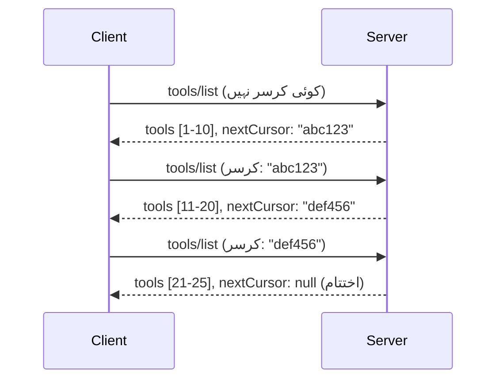

# MCP میں صفحات بندی اور بڑے نتیجہ سیٹ

جب آپ کا MCP سرور بڑے ڈیٹا سیٹ کو ہینڈل کرتا ہے - چاہے ہزاروں فائلیں، ڈیٹا بیس ریکارڈز، یا سرچ رزلٹس کی فہرست ہو - تو آپ کو میموری کو مؤثر طریقے سے منظم کرنے اور صارف کو تیز تجربات فراہم کرنے کے لیے صفحات بندی کی ضرورت ہوتی ہے۔ یہ رہنما MCP میں صفحات بندی کو نافذ کرنے اور استعمال کرنے کا طریقہ بیان کرتا ہے۔

## صفحات بندی کیوں اہم ہے

بغیر صفحات بندی کے، بڑے جوابات سبب بن سکتے ہیں:

- **میموری کی خالی ہو جانا** - لاکھوں ریکارڈز ایک ساتھ لوڈ کرنا  
- **ردعمل کا سست ہونا** - صارفین کو انتظار کرنا پڑتا ہے جب تک کہ سارا ڈیٹا لوڈ ہو  
- **ٹائم آؤٹ کی غلطیاں** - درخواستوں کا ٹائم آؤٹ کی حد سے تجاوز کرنا  
- **کمزوری AI کی کارکردگی** - LLMs کو وسیع سیاق و سباق کے ساتھ مشکل پیش آتی ہے  

MCP قابل اعتماد، مستقل صف بندی کے لیے **کرسر کی بنیاد پر صفحات بندی** استعمال کرتا ہے۔

---

## MCP صفحات بندی کیسے کام کرتی ہے

### کرسر کا تصور

ایک **کرسر** ایک مبہم سٹرنگ ہے جو آپ کی پوزیشن کو نتیجہ سیٹ میں نشان زد کرتا ہے۔ اسے ایک لمبی کتاب میں بک مارک سمجھیں۔


### MCP طریقوں میں صفحات بندی

یہ MCP طریقے صفحات بندی کی حمایت کرتے ہیں:

| طریقہ | واپس آتا ہے | کرسر کی حمایت |
|--------|---------|----------------|
| `tools/list` | ٹول کی تعریفیں | ✅ |
| `resources/list` | وسائل کی تعریفیں | ✅ |
| `prompts/list` | پرامپٹ کی تعریفیں | ✅ |
| `resources/templates/list` | وسائل کے ٹیمپلیٹس | ✅ |

---

## سرور کا نفاذ

### پائتھن (FastMCP)

```python
from mcp.server import Server
from mcp.types import Tool, ListToolsResult
import math

app = Server("paginated-server")

# بڑے مشابہت شدہ ڈیٹا سیٹ
ALL_TOOLS = [
    Tool(name=f"tool_{i}", description=f"Tool number {i}", inputSchema={})
    for i in range(100)
]

PAGE_SIZE = 10

@app.list_tools()
async def list_tools(cursor: str | None = None) -> ListToolsResult:
    """List tools with pagination support."""
    
    # شروع کرنے کا اشاریہ حاصل کرنے کے لیے کرسر کو ڈی کوڈ کریں
    start_index = 0
    if cursor:
        try:
            start_index = int(cursor)
        except ValueError:
            start_index = 0
    
    # نتائج کا صفحہ حاصل کریں
    end_index = min(start_index + PAGE_SIZE, len(ALL_TOOLS))
    page_tools = ALL_TOOLS[start_index:end_index]
    
    # اگلے کرسر کا حساب لگائیں
    next_cursor = None
    if end_index < len(ALL_TOOLS):
        next_cursor = str(end_index)
    
    return ListToolsResult(
        tools=page_tools,
        nextCursor=next_cursor
    )
```

### ٹائپ اسکرپٹ

```typescript
import { Server } from "@modelcontextprotocol/sdk/server/index.js";
import { ListToolsResultSchema } from "@modelcontextprotocol/sdk/types.js";

const server = new Server({
  name: "paginated-server",
  version: "1.0.0"
});

// مشابہ بڑا ڈیٹا سیٹ
const ALL_TOOLS = Array.from({ length: 100 }, (_, i) => ({
  name: `tool_${i}`,
  description: `Tool number ${i}`,
  inputSchema: { type: "object", properties: {} }
}));

const PAGE_SIZE = 10;

server.setRequestHandler(ListToolsResultSchema, async (request) => {
  // کرسر کو انکوڈ کریں
  let startIndex = 0;
  if (request.params?.cursor) {
    startIndex = parseInt(request.params.cursor, 10) || 0;
  }
  
  // نتائج کا صفحہ حاصل کریں
  const endIndex = Math.min(startIndex + PAGE_SIZE, ALL_TOOLS.length);
  const pageTools = ALL_TOOLS.slice(startIndex, endIndex);
  
  // اگلے کرسر کا حساب لگائیں
  const nextCursor = endIndex < ALL_TOOLS.length ? String(endIndex) : undefined;
  
  return {
    tools: pageTools,
    nextCursor
  };
});
```

### جاوا (Spring MCP)

```java
@Service
public class PaginatedToolService {
    
    private static final int PAGE_SIZE = 10;
    private final List<Tool> allTools;
    
    public PaginatedToolService() {
        // بڑا ڈیٹاسیٹ ابتدائی بنائیں
        this.allTools = IntStream.range(0, 100)
            .mapToObj(i -> new Tool("tool_" + i, "Tool number " + i, Map.of()))
            .collect(Collectors.toList());
    }
    
    @McpMethod("tools/list")
    public ListToolsResult listTools(@Param("cursor") String cursor) {
        // کرسر ڈی کوڈ کریں
        int startIndex = 0;
        if (cursor != null && !cursor.isEmpty()) {
            try {
                startIndex = Integer.parseInt(cursor);
            } catch (NumberFormatException e) {
                startIndex = 0;
            }
        }
        
        // نتائج کا صفحہ حاصل کریں
        int endIndex = Math.min(startIndex + PAGE_SIZE, allTools.size());
        List<Tool> pageTools = allTools.subList(startIndex, endIndex);
        
        // اگلے کرسر کا حساب لگائیں
        String nextCursor = endIndex < allTools.size() ? String.valueOf(endIndex) : null;
        
        return new ListToolsResult(pageTools, nextCursor);
    }
}
```

---
## کلائنٹ کا نفاذ

### پائتھن کلائنٹ

```python
from mcp import ClientSession

async def get_all_tools(session: ClientSession) -> list:
    """Fetch all tools using pagination."""
    all_tools = []
    cursor = None
    
    while True:
        result = await session.list_tools(cursor=cursor)
        all_tools.extend(result.tools)
        
        if result.nextCursor is None:
            break
        cursor = result.nextCursor
    
    return all_tools

# استعمال
async with client_session as session:
    tools = await get_all_tools(session)
    print(f"Found {len(tools)} tools")
```

### ٹائپ اسکرپٹ کلائنٹ

```typescript
import { Client } from "@modelcontextprotocol/sdk/client/index.js";

async function getAllTools(client: Client): Promise<Tool[]> {
  const allTools: Tool[] = [];
  let cursor: string | undefined = undefined;
  
  do {
    const result = await client.listTools({ cursor });
    allTools.push(...result.tools);
    cursor = result.nextCursor;
  } while (cursor);
  
  return allTools;
}

// استعمال
const tools = await getAllTools(client);
console.log(`Found ${tools.length} tools`);
```

### سستی لوڈنگ کا نمونہ

بہت بڑے ڈیٹا سیٹ کے لیے، صفحات کو ضرورت کے مطابق لوڈ کریں:

```python
class PaginatedToolIterator:
    """Lazily iterate through paginated tools."""
    
    def __init__(self, session: ClientSession):
        self.session = session
        self.cursor = None
        self.buffer = []
        self.exhausted = False
    
    async def __anext__(self):
        # اگر دستیاب ہو تو بفر سے واپسی
        if self.buffer:
            return self.buffer.pop(0)
        
        # چیک کریں کہ کیا ہم نے تمام صفحات ختم کر دیے ہیں
        if self.exhausted:
            raise StopAsyncIteration
        
        # اگلا صفحہ حاصل کریں
        result = await self.session.list_tools(cursor=self.cursor)
        self.buffer = list(result.tools)
        self.cursor = result.nextCursor
        
        if self.cursor is None:
            self.exhausted = True
        
        if not self.buffer:
            raise StopAsyncIteration
        
        return self.buffer.pop(0)
    
    def __aiter__(self):
        return self

# استعمال - بڑے ڈیٹا سیٹس کے لیے میموری موثر
async for tool in PaginatedToolIterator(session):
    process_tool(tool)
```

---

## وسائل کے لیے صفحات بندی

وسائل کو اکثر ڈائریکٹریز یا بڑے ڈیٹا سیٹس کے لیے صفحات بندی کی ضرورت ہوتی ہے:

```python
from mcp.server import Server
from mcp.types import Resource, ListResourcesResult
import os

app = Server("file-server")

@app.list_resources()
async def list_resources(cursor: str | None = None) -> ListResourcesResult:
    """List files in directory with pagination."""
    
    directory = "/data/files"
    all_files = sorted(os.listdir(directory))
    
    # کرسر کو ڈی کوڈ کریں (فائل انڈیکس)
    start_index = int(cursor) if cursor else 0
    page_size = 20
    end_index = min(start_index + page_size, len(all_files))
    
    # اس صفحے کے لیے وسائل کی فہرست بنائیں
    resources = []
    for filename in all_files[start_index:end_index]:
        filepath = os.path.join(directory, filename)
        resources.append(Resource(
            uri=f"file://{filepath}",
            name=filename,
            mimeType="application/octet-stream"
        ))
    
    # اگلے کرسر کا حساب لگائیں
    next_cursor = str(end_index) if end_index < len(all_files) else None
    
    return ListResourcesResult(
        resources=resources,
        nextCursor=next_cursor
    )
```

---

## کرسر کے ڈیزائن کی حکمت عملی

### حکمت عملی 1: انڈیکس کی بنیاد پر (سادہ)

```python
# کرسر محض اشاریہ ہے
cursor = "50"  # آئٹم 50 سے شروع کریں
```

**فائدے:** سادہ، بے ریاست  
**نقصانات:** اگر آئٹمز شامل یا ہٹائے جائیں تو نتائج منتقل ہو سکتے ہیں  

### حکمت عملی 2: ID کی بنیاد پر (مستحکم)

```python
# کرسر آخری دیکھی گئی شناخت ہے
cursor = "item_abc123"  # اس آئٹم کے بعد شروع کریں
```

**فائدے:** آئٹمز میں تبدیلی ہونے پر بھی مستحکم رہتا ہے  
**نقصانات:** ترتیب دی گئی IDs کی ضرورت ہوتی ہے  

### حکمت عملی 3: انکوڈ شدہ حالت (پیچیدہ)

```python
import base64
import json

def encode_cursor(state: dict) -> str:
    return base64.b64encode(json.dumps(state).encode()).decode()

def decode_cursor(cursor: str) -> dict:
    return json.loads(base64.b64decode(cursor).decode())

# کرسر میں متعدد ریاستی فیلڈز شامل ہیں
cursor = encode_cursor({
    "offset": 50,
    "filter": "active",
    "sort": "name"
})
```

**فائدے:** پیچیدہ حالت کو انکوڈ کر سکتا ہے  
**نقصانات:** زیادہ پیچیدہ، کرسر کی لمبی سٹرنگ ہوتی ہے  

---

## بہترین طریقے

### 1. مناسب صفحہ سائز منتخب کریں

```python
# ڈیٹا کے سائز پر غور کریں
PAGE_SIZE_SMALL_ITEMS = 100   # آسان میٹا ڈیٹا
PAGE_SIZE_MEDIUM_ITEMS = 20   # زیادہ جامع اشیاء
PAGE_SIZE_LARGE_ITEMS = 5     # پیچیدہ مواد
```

### 2. غیر درست کرسرز کو مہربانی سے ہینڈل کریں

```python
@app.list_tools()
async def list_tools(cursor: str | None = None) -> ListToolsResult:
    try:
        start_index = int(cursor) if cursor else 0
        if start_index < 0 or start_index >= len(ALL_TOOLS):
            start_index = 0  # شروع میں دوبارہ ترتیب دیں
    except (ValueError, TypeError):
        start_index = 0  # ناقابل قبول کرسر، نئی شروعات کریں
    # ...
```

### 3. کل تعداد شامل کریں (اختیاری)

```python
return ListToolsResult(
    tools=page_tools,
    nextCursor=next_cursor,
    # کچھ نفاذ میں UI پیش رفت کے لیے کل شامل ہوتا ہے
    _meta={"total": len(ALL_TOOLS)}
)
```

### 4. ایج کیسز کا ٹیسٹ کریں

```python
async def test_pagination():
    # خالی نتیجہ سیٹ
    result = await session.list_tools()
    assert result.tools == []
    assert result.nextCursor is None
    
    # ایک صفحہ
    result = await session.list_tools()
    assert len(result.tools) <= PAGE_SIZE
    
    # غلط کرسر
    result = await session.list_tools(cursor="invalid")
    assert result.tools  # پہلا صفحہ واپس کرنا چاہیے
```

---

## عام مشکلات

### ❌ تمام نتائج واپس کرنا اور پھر کلائنٹ سائڈ پر صفحات بندی کرنا

```python
# خراب: سب کچھ میموری میں لوڈ کرتا ہے
@app.list_tools()
async def list_tools() -> ListToolsResult:
    all_tools = load_all_tools()  # 1 ملین ٹولز!
    return ListToolsResult(tools=all_tools)
```

### ✅ ڈیٹا ماخذ پر صفحات بندی کرنا

```python
# اچھا: صرف وہی لوڈ کرتا ہے جو ضروری ہو
@app.list_tools()
async def list_tools(cursor: str | None = None) -> ListToolsResult:
    offset = int(cursor) if cursor else 0
    tools = await db.query_tools(offset=offset, limit=PAGE_SIZE)
    return ListToolsResult(tools=tools, nextCursor=...)
```

---

## آگے کیا ہے

- [ماڈیول 5.14 - سیاق و سباق کی انجینئرنگ](../../05-AdvancedTopics/mcp-contextengineering/README.md)
- [ماڈیول 8 - بہترین طریقے](../../08-BestPractices/README.md)
- [3.8 - آپ کے MCP سرور کا ٹیسٹ کرنا](../../03-GettingStarted/08-testing/README.md)

---

## اضافی وسائل

- [MCP وضاحت - صفحات بندی](https://spec.modelcontextprotocol.io/specification/2025-11-25/)
- [کرسر کی بنیاد پر صفحات بندی کی وضاحت](https://slack.engineering/evolving-api-pagination-at-slack/)
- [پائتھن SDK صفحات بندی کے ٹیسٹ](https://github.com/modelcontextprotocol/python-sdk/blob/main/tests/client/test_list_methods_cursor.py)

---

<!-- CO-OP TRANSLATOR DISCLAIMER START -->
**انتباہ**:
اس دستاویز کا ترجمہ اے آئی ترجمہ سروس [Co-op Translator](https://github.com/Azure/co-op-translator) کے ذریعے کیا گیا ہے۔ جب کہ ہم درستگی کے لیے کوشاں ہیں، براہ کرم اس بات سے آگاہ رہیں کہ خودکار ترجموں میں غلطیاں یا نقصانات ہو سکتے ہیں۔ اصل دستاویز اپنی مادری زبان میں ہی مستند ماخذ تصور کی جانی چاہیے۔ اہم معلومات کے لیے پیشہ ور انسانی ترجمہ تجویز کیا جاتا ہے۔ اس ترجمے کے استعمال سے ہونے والی کسی بھی غلط فہمی یا غلط تشریح کی ذمہ داری ہم پر عائد نہیں ہوتی۔
<!-- CO-OP TRANSLATOR DISCLAIMER END -->