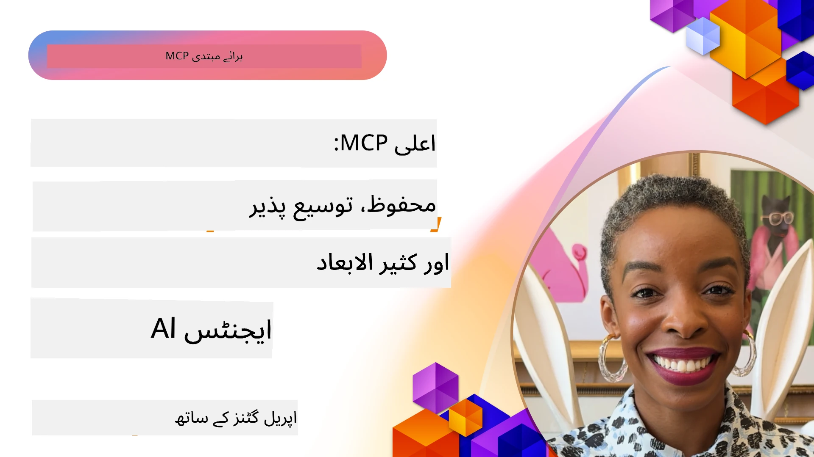

# MCP میں جدید موضوعات

_(اس سبق کی ویڈیو دیکھنے کے لیے اوپر دی گئی تصویر پر کلک کریں)_

یہ باب ماڈل کانٹیکسٹ پروٹوکول (MCP) کی عملدرآمد میں متعدد جدید موضوعات کا احاطہ کرتا ہے، جن میں کثیر الوضعی انضمام، توسیع پذیری، سلامتی کے بہترین طریقے، اور انٹرپرائز انضمام شامل ہیں۔ یہ موضوعات مضبوط اور پیداوار کے قابل MCP ایپلیکیشنز بنانے کے لیے انتہائی اہم ہیں جو جدید AI سسٹمز کی ضروریات کو پورا کر سکیں۔

## جائزہ

یہ سبق ماڈل کانٹیکسٹ پروٹوکول کی عملدرآمد میں جدید تصورات کا جائزہ لیتا ہے، جس میں کثیر الوضعی انضمام، توسیع پذیری، سلامتی کے بہترین طریقے، اور انٹرپرائز انضمام پر توجہ دی گئی ہے۔ یہ موضوعات پیداواری معیار کی MCP ایپلیکیشنز بنانے کے لیے ضروری ہیں جو انٹرپرائز ماحول میں پیچیدہ مطالبات کو سنبھال سکیں۔

## سیکھنے کے مقاصد

اس سبق کے اختتام تک، آپ قابل ہو جائیں گے کہ:

- MCP فریم ورکس کے اندر کثیر الوضعی صلاحیتیں نافذ کریں
- اعلیٰ مطالبہ کے مناظر کے لیے توسیع پذیر MCP ساختیں ڈیزائن کریں
- MCP کی سلامتی اصولوں کے مطابق سلامتی کے بہترین طریقے اپنائیں
- MCP کو انٹرپرائز AI سسٹمز اور فریم ورکس کے ساتھ مربوط کریں
- پیداوار کے ماحول میں کارکردگی اور اعتبار کو بہتر بنائیں

## اسباق اور نمونہ منصوبے

| لنک | عنوان | وضاحت |
|------|-------|-------------|
| [5.1 Azure کے ساتھ انضمام](./mcp-integration/README.md) | Azure کے ساتھ انضمام | سیکھیں کہ MCP سرور کو Azure پر کیسے مربوط کیا جائے |
| [5.2 کثیر الوضعی نمونہ](./mcp-multi-modality/README.md) | MCP کثیر الوضعی نمونے | آڈیو، تصویر اور کثیر الوضعی جواب کے نمونے |
| [5.3 MCP OAuth2 نمونہ](../../../05-AdvancedTopics/mcp-oauth2-demo) | MCP OAuth2 مظاہرہ | کم از کم سپرنگ بوٹ ایپ جو MCP کے ساتھ OAuth2 دکھاتی ہے، بطور Authorization اور Resource سرور دونوں۔ محفوظ ٹوکن جاری کرنے، محفوظ اختتامی مقامات، Azure کنٹینر ایپ کی تعیناتی، اور API مینجمنٹ انضمام کو ظاہر کرتی ہے۔ |
| [5.4 روٹ کانٹیکسٹ](./mcp-root-contexts/README.md) | روٹ کانٹیکسٹ | روٹ کانٹیکسٹ کے بارے میں مزید جانیں اور انہیں کیسے نافذ کیا جائے |
| [5.5 روٹنگ](./mcp-routing/README.md) | روٹنگ | روٹنگ کی مختلف اقسام سیکھیں |
| [5.6 سیمپلنگ](./mcp-sampling/README.md) | سیمپلنگ | سیمپلنگ کے ساتھ کام کرنا سیکھیں |
| [5.7 توسیع پذیری](./mcp-scaling/README.md) | توسیع پذیری | توسیع پذیری کے بارے میں جانیں |
| [5.8 سلامتی](./mcp-security/README.md) | سلامتی | اپنے MCP سرور کو محفوظ بنائیں |
| [5.9 ویب سرچ نمونہ](./web-search-mcp/README.md) | ویب سرچ MCP | Python MCP سرور اور کلائنٹ جو SerpAPI کے ساتھ حقیقی وقت کی ویب، خبریں، مصنوعات کی تلاش، اور سوالات و جوابات کے انضمام کی نمائندگی کرتی ہے۔ کثیر اوزار ہم آہنگی، بیرونی API انضمام، اور مضبوط غلطی ہینڈلنگ کو ظاہر کرتی ہے۔ |
| [5.10 حقیقی وقت کی اسٹریمنگ](./mcp-realtimestreaming/README.md) | اسٹریمنگ | حقیقی وقت میں ڈیٹا اسٹریمنگ آج کے ڈیٹا پر مبنی دنیا میں ضروری ہو گئی ہے، جہاں کاروبار اور ایپلیکیشنز کو فوری معلومات تک رسائی کی ضرورت ہوتی ہے تاکہ بروقت فیصلے کیے جا سکیں۔|
| [5.11 حقیقی وقت کی ویب سرچ](./mcp-realtimesearch/README.md) | ویب سرچ | حقیقی وقت کی ویب سرچ، MCP کیسے حقیقی وقت کی ویب سرچ کو AI ماڈلز، سرچ انجنز، اور ایپلیکیشنز کے مابین کانٹیکسٹ مینجمنٹ کے لیے معیاری طریقہ فراہم کر کے تبدیل کرتا ہے۔| 
| [5.12 ماڈل کانٹیکسٹ پروٹوکول سرورز کے لیے Entra ID توثیق](./mcp-security-entra/README.md) | Entra ID توثیق | Microsoft Entra ID ایک مضبوط کلاؤڈ بیسڈ شناخت اور رسائی مینجمنٹ حل فراہم کرتا ہے، جو یہ یقینی بناتا ہے کہ صرف مجاز صارفین اور ایپلیکیشنز ہی آپ کے MCP سرور کے ساتھ تعامل کر سکیں۔|
| [5.13 Azure AI Foundry ایجنٹ انضمام](./mcp-foundry-agent-integration/README.md) | Azure AI Foundry انضمام | سیکھیں کہ ماڈل کانٹیکسٹ پروٹوکول سرورز کو Azure AI Foundry ایجنٹس کے ساتھ کیسے مربوط کیا جائے، جس سے مضبوط اوزار ہم آہنگی اور انٹرپرائز AI صلاحیتوں کی معیاری بیرونی ڈیٹا سورس کنکشنز کے ساتھ فراہمی ممکن ہوگی۔|
| [5.14 کانٹیکسٹ انجینئرنگ](./mcp-contextengineering/README.md) | کانٹیکسٹ انجینئرنگ | MCP سرورز کے لیے کانٹیکسٹ انجینئرنگ تکنیکوں کا مستقبل، جس میں کانٹیکسٹ کی اصلاح، متحرک کانٹیکسٹ مینجمنٹ، اور MCP فریم ورکس میں موثر پرامپٹ انجینئرنگ کی حکمت عملی شامل ہیں۔|
| [5.15 MCP کسٹم ٹرانسپورٹ](./mcp-transport/README.md) | کسٹم ٹرانسپورٹ | خصوصی MCP مواصلاتی مناظر کے لیے کسٹم ٹرانسپورٹ میکانزم نافذ کرنے کا طریقہ سیکھیں۔|
| [5.16 پروٹوکول خصوصیات تفصیلی جائزہ](./mcp-protocol-features/README.md) | پروٹوکول خصوصیات | اعلیٰ درجے کی پروٹوکول خصوصیات میں مہارت حاصل کریں جن میں ترقی کی اطلاعات، درخواست کی منسوخی، وسائل کے سانچے، اور غلطی کے نمونوں کا انتظام شامل ہے۔|

> **MCP وضاحت 2025-11-25 میں نیا**: وضاحت میں اب تجرباتی حمایت شامل ہے **Tasks** (لمبے عرصے پر چلنے والے آپریشنز جن میں پیش رفت کی ٹریکنگ ہوتی ہے)، **Tool Annotations** (ٹول کے رویے کے بارے میں میٹاڈیٹا برائے حفاظت)، **URL Mode Elicitation** (کلائنٹس سے مخصوص URL مواد طلب کرنا)، اور بہتر شدہ **Roots** (ورک اسپیس کانٹیکسٹ مینجمنٹ کے لیے)۔ مکمل تفصیلات کے لیے [MCP وضاحت تبدیلیوں کا لاگ](https://spec.modelcontextprotocol.io/) دیکھیں۔

## اضافی حوالہ جات

جدید MCP موضوعات کے بارے میں سب سے تازہ ترین معلومات کے لیے رجوع کریں:
- [MCP دستاویزات](https://modelcontextprotocol.io/)
- [MCP وضاحت (2025-11-25)](https://spec.modelcontextprotocol.io/specification/2025-11-25/)
- [GitHub مخزن](https://github.com/modelcontextprotocol)
- [OWASP MCP Top 10](https://microsoft.github.io/mcp-azure-security-guide/mcp/) - سلامتی کے خطرات اور ان کے تدارکات
- [MCP سیکیورٹی سمٹ ورکشاپ (شرپا)](https://azure-samples.github.io/sherpa/) - عملی سلامتی کی تربیت

## کلیدی نکات

- کثیر الوضعی MCP عمل درآمد AI کی صلاحیتوں کو صرف متن پر پروسیسنگ سے آگے بڑھاتے ہیں
- توسیع پذیری انٹرپرائز تعیناتیوں کے لیے ناگزیر ہے اور اسے افقی اور عمودی توسیع کے ذریعے حل کیا جا سکتا ہے
- جامع سلامتی اقدامات ڈیٹا کی حفاظت کرتے ہیں اور مناسب رسائی کنٹرول کو یقینی بناتے ہیں
- Azure OpenAI اور Microsoft AI Foundry جیسے پلیٹ فارمز کے ساتھ انٹرپرائز انضمام MCP کی صلاحیتوں کو بڑھاتا ہے
- جدید MCP عمل درآمد بہتر کی گئی ساختوں اور محتاط وسائل کے انتظام سے فائدہ اٹھاتے ہیں

## مشق

کسی مخصوص استعمال کے لیے ایک انٹرپرائز معیار کا MCP عمل درآمد ڈیزائن کریں:

1. اپنے استعمال کے لیے کثیر الوضعی ضروریات کی شناخت کریں
2. حساس ڈیٹا کی حفاظت کے لیے سلامتی کنٹرولز کا خاکہ تیار کریں
3. ایک توسیع پذیر ساخت تیار کریں جو مختلف لوڈ کو سنبھال سکے
4. انٹرپرائز AI سسٹمز کے ساتھ انضمام کے نکات کی منصوبہ بندی کریں
5. ممکنہ کارکردگی کی رکاوٹوں اور ان کے تدارک کی حکمت عملی دستاویز کریں

## اضافی وسائل

- [Azure OpenAI دستاویزات](https://learn.microsoft.com/en-us/azure/ai-services/openai/)
- [Microsoft AI Foundry دستاویزات](https://learn.microsoft.com/en-us/ai-services/)

---

## اگلا کیا ہے

اس ماڈیول کے اسباق کو دریافت کریں، شروع کریں: [5.1 MCP انضمام](./mcp-integration/README.md)

جب آپ اس ماڈیول کو مکمل کر لیں، تو جاری رکھیں: [ماڈیول 6: کمیونٹی تعاون](../06-CommunityContributions/README.md)

---

<!-- CO-OP TRANSLATOR DISCLAIMER START -->
**اعلان ذمہ داری**:  
یہ دستاویز [Co-op Translator](https://github.com/Azure/co-op-translator) نامی AI ترجمہ سروس استعمال کرکے ترجمہ کی گئی ہے۔ اگرچہ ہم درستگی کے لیے کوشاں ہیں، لیکن براہ کرم یاد رکھیں کہ خودکار تراجم میں غلطیاں یا انحراف ہو سکتے ہیں۔ اصلی دستاویز اپنی مادری زبان میں معتبر ماخذ سمجھی جانی چاہیے۔ اہم معلومات کے لیے پیشہ ور انسانی ترجمہ کی سفارش کی جاتی ہے۔ اس ترجمے کے استعمال سے پیدا ہونے والے کسی بھی غلط فہمی یا غلط تشریح کی ذمہ داری ہم پر عائد نہیں ہوتی۔
<!-- CO-OP TRANSLATOR DISCLAIMER END -->