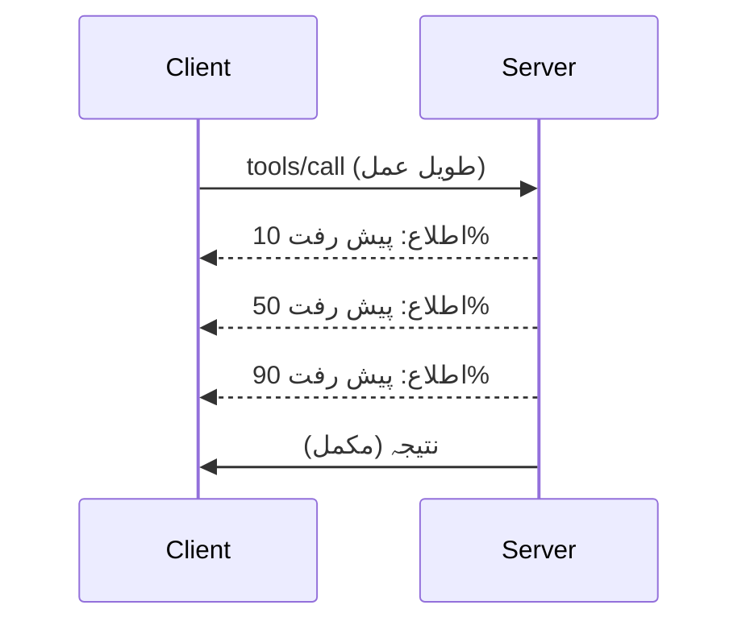

# MCP پروٹوکول کی خصوصیات کی تفصیلی جانچ

یہ گائیڈ ترقی یافتہ MCP پروٹوکول خصوصیات کا جائزہ لیتی ہے جو بنیادی ٹول اور وسائل کی ہینڈلنگ سے آگے ہیں۔ ان خصوصیات کو سمجھنے سے آپ زیادہ مضبوط، صارف دوست، اور پیداواری قابل MCP سرورز بنا سکتے ہیں۔

## شامل خصوصیات

1. **پیش رفت کی اطلاعات** - طویل دورانیے کے آپریشنز کی پیش رفت کی اطلاع دینا  
2. **درخواست منسوخی** - کلائنٹس کو زیر التواء درخواستیں منسوخ کرنے کی اجازت دینا  
3. **وسائل کے ٹیمپلیٹس** - متحرک وسائل کے URI جو پیرامیٹرز کے ساتھ ہوں  
4. **سرور کے دورِ زندگی کے واقعات** - مناسب ابتدائی اور بندش کا انتظام  
5. **لاگنگ کنٹرول** - سرور کی طرف سے لاگنگ کی ترتیبات  
6. **غلطی ہینڈلنگ کے نمونے** - مستقل غلطی کے جوابات  

---

## 1. پیش رفت کی اطلاعات

ایسے آپریشنز کے لیے جو وقت لیتے ہیں (ڈیٹا پراسیسنگ، فائل ڈاؤن لوڈز، API کالز)، پیش رفت کی اطلاعات صارفین کو آگاہ رکھتی ہیں۔

### یہ کیسے کام کرتا ہے


### پائتھن میں نفاذ

```python
from mcp.server import Server, NotificationOptions
from mcp.types import ProgressNotification
import asyncio

app = Server("progress-server")

@app.tool()
async def process_large_file(file_path: str, ctx) -> str:
    """Process a large file with progress updates."""
    
    # پراگرس کے حساب کے لیے فائل کا سائز حاصل کریں
    file_size = os.path.getsize(file_path)
    processed = 0
    
    with open(file_path, 'rb') as f:
        while chunk := f.read(8192):
            # چنک پر عمل کریں
            await process_chunk(chunk)
            processed += len(chunk)
            
            # پراگرس کی اطلاع بھیجیں
            progress = (processed / file_size) * 100
            await ctx.send_notification(
                ProgressNotification(
                    progressToken=ctx.request_id,
                    progress=progress,
                    total=100,
                    message=f"Processing: {progress:.1f}%"
                )
            )
    
    return f"Processed {file_size} bytes"

@app.tool()
async def batch_operation(items: list[str], ctx) -> str:
    """Process multiple items with progress."""
    
    results = []
    total = len(items)
    
    for i, item in enumerate(items):
        result = await process_item(item)
        results.append(result)
        
        # ہر آئٹم کے بعد پراگرس کی رپورٹ کریں
        await ctx.send_notification(
            ProgressNotification(
                progressToken=ctx.request_id,
                progress=i + 1,
                total=total,
                message=f"Processed {i + 1}/{total}: {item}"
            )
        )
    
    return f"Completed {total} items"
```

### ٹائپ اسکرپٹ میں نفاذ

```typescript
import { Server } from "@modelcontextprotocol/sdk/server/index.js";

server.setRequestHandler(CallToolSchema, async (request, extra) => {
  const { name, arguments: args } = request.params;
  
  if (name === "process_data") {
    const items = args.items as string[];
    const results = [];
    
    for (let i = 0; i < items.length; i++) {
      const result = await processItem(items[i]);
      results.push(result);
      
      // پیش رفت کی اطلاع بھیجیں
      await extra.sendNotification({
        method: "notifications/progress",
        params: {
          progressToken: request.id,
          progress: i + 1,
          total: items.length,
          message: `Processing item ${i + 1}/${items.length}`
        }
      });
    }
    
    return { content: [{ type: "text", text: JSON.stringify(results) }] };
  }
});
```

### کلائنٹ ہینڈلنگ (پائتھن)

```python
async def handle_progress(notification):
    """Handle progress notifications from server."""
    params = notification.params
    print(f"Progress: {params.progress}/{params.total} - {params.message}")

# ہینڈلر رجسٹر کریں
session.on_notification("notifications/progress", handle_progress)

# ٹول کال کریں (پیش رفت کی تازہ کاری ہینڈلر کے ذریعے موصول ہوگی)
result = await session.call_tool("process_large_file", {"file_path": "/data/large.csv"})
```

---

## 2. درخواست منسوخی

کلائنٹس کو ایسی درخواستیں منسوخ کرنے کی اجازت دیں جو اب ضروری نہیں رہیں یا بہت طویل عرصہ لے رہی ہوں۔

### پائتھن میں نفاذ

```python
from mcp.server import Server
from mcp.types import CancelledError
import asyncio

app = Server("cancellable-server")

@app.tool()
async def long_running_search(query: str, ctx) -> str:
    """Search that can be cancelled."""
    
    results = []
    
    try:
        for page in range(100):  # کئی صفحات میں تلاش کریں
            # چیک کریں کہ منسوخی کی درخواست کی گئی ہے یا نہیں
            if ctx.is_cancelled:
                raise CancelledError("Search cancelled by user")
            
            # صفحہ تلاش کرنے کی نقل بنائیں
            page_results = await search_page(query, page)
            results.extend(page_results)
            
            # چھوٹا وقفہ منسوخی کی جانچ کی اجازت دیتا ہے
            await asyncio.sleep(0.1)
            
    except CancelledError:
        # جزوی نتائج واپس کریں
        return f"Cancelled. Found {len(results)} results before cancellation."
    
    return f"Found {len(results)} total results"

@app.tool()
async def download_file(url: str, ctx) -> str:
    """Download with cancellation support."""
    
    async with aiohttp.ClientSession() as session:
        async with session.get(url) as response:
            total_size = int(response.headers.get('content-length', 0))
            downloaded = 0
            chunks = []
            
            async for chunk in response.content.iter_chunked(8192):
                if ctx.is_cancelled:
                    return f"Download cancelled at {downloaded}/{total_size} bytes"
                
                chunks.append(chunk)
                downloaded += len(chunk)
            
            return f"Downloaded {downloaded} bytes"
```

### منسوخی کا سیاق و سباق نافذ کرنا

```python
class CancellableContext:
    """Context object that tracks cancellation state."""
    
    def __init__(self, request_id: str):
        self.request_id = request_id
        self._cancelled = asyncio.Event()
        self._cancel_reason = None
    
    @property
    def is_cancelled(self) -> bool:
        return self._cancelled.is_set()
    
    def cancel(self, reason: str = "Cancelled"):
        self._cancel_reason = reason
        self._cancelled.set()
    
    async def check_cancelled(self):
        """Raise if cancelled, otherwise continue."""
        if self.is_cancelled:
            raise CancelledError(self._cancel_reason)
    
    async def sleep_or_cancel(self, seconds: float):
        """Sleep that can be interrupted by cancellation."""
        try:
            await asyncio.wait_for(
                self._cancelled.wait(),
                timeout=seconds
            )
            raise CancelledError(self._cancel_reason)
        except asyncio.TimeoutError:
            pass  # معمول کا وقت ختم، جاری رکھیں
```

### کلائنٹ سائیڈ منسوخی

```python
import asyncio

async def search_with_timeout(session, query, timeout=30):
    """Search with automatic cancellation on timeout."""
    
    task = asyncio.create_task(
        session.call_tool("long_running_search", {"query": query})
    )
    
    try:
        result = await asyncio.wait_for(task, timeout=timeout)
        return result
    except asyncio.TimeoutError:
        # درخواست منسوخی
        await session.send_notification({
            "method": "notifications/cancelled",
            "params": {"requestId": task.request_id, "reason": "Timeout"}
        })
        return "Search timed out"
```

---

## 3. وسائل کے ٹیمپلیٹس

وسائل کے ٹیمپلیٹس متحرک URI کی تعمیر کی اجازت دیتے ہیں جو پیرامیٹرز کے ساتھ ہوتے ہیں، یہ APIs اور ڈیٹا بیسز کے لیے مفید ہے۔

### ٹیمپلیٹس کی تعریف

```python
from mcp.server import Server
from mcp.types import ResourceTemplate

app = Server("template-server")

@app.list_resource_templates()
async def list_templates() -> list[ResourceTemplate]:
    """Return available resource templates."""
    return [
        ResourceTemplate(
            uriTemplate="db://users/{user_id}",
            name="User Profile",
            description="Fetch user profile by ID",
            mimeType="application/json"
        ),
        ResourceTemplate(
            uriTemplate="api://weather/{city}/{date}",
            name="Weather Data",
            description="Historical weather for city and date",
            mimeType="application/json"
        ),
        ResourceTemplate(
            uriTemplate="file://{path}",
            name="File Content",
            description="Read file at given path",
            mimeType="text/plain"
        )
    ]

@app.read_resource()
async def read_resource(uri: str) -> str:
    """Read resource, expanding template parameters."""
    
    # URI کو پارس کریں تاکہ پیرامیٹرز نکالے جا سکیں
    if uri.startswith("db://users/"):
        user_id = uri.split("/")[-1]
        return await fetch_user(user_id)
    
    elif uri.startswith("api://weather/"):
        parts = uri.replace("api://weather/", "").split("/")
        city, date = parts[0], parts[1]
        return await fetch_weather(city, date)
    
    elif uri.startswith("file://"):
        path = uri.replace("file://", "")
        return await read_file(path)
    
    raise ValueError(f"Unknown resource URI: {uri}")
```

### ٹائپ اسکرپٹ میں نفاذ

```typescript
server.setRequestHandler(ListResourceTemplatesSchema, async () => {
  return {
    resourceTemplates: [
      {
        uriTemplate: "github://repos/{owner}/{repo}/issues/{issue_number}",
        name: "GitHub Issue",
        description: "Fetch a specific GitHub issue",
        mimeType: "application/json"
      },
      {
        uriTemplate: "db://tables/{table}/rows/{id}",
        name: "Database Row",
        description: "Fetch a row from a database table",
        mimeType: "application/json"
      }
    ]
  };
});

server.setRequestHandler(ReadResourceSchema, async (request) => {
  const uri = request.params.uri;
  
  // گٹ ہب مسئلہ URI کو پارس کریں
  const githubMatch = uri.match(/^github:\/\/repos\/([^/]+)\/([^/]+)\/issues\/(\d+)$/);
  if (githubMatch) {
    const [_, owner, repo, issueNumber] = githubMatch;
    const issue = await fetchGitHubIssue(owner, repo, parseInt(issueNumber));
    return {
      contents: [{
        uri,
        mimeType: "application/json",
        text: JSON.stringify(issue, null, 2)
      }]
    };
  }
  
  throw new Error(`Unknown resource URI: ${uri}`);
});
```

---

## 4. سرور کے دورِ زندگی کے واقعات

مناسب ابتدائی اور بندش کا انتظام صاف ستھرا وسائل کا انتظام یقینی بناتا ہے۔

### پائتھن میں زندگی کے دور کا انتظام

```python
from mcp.server import Server
from contextlib import asynccontextmanager

app = Server("lifecycle-server")

# مشترکہ حالت
db_connection = None
cache = None

@asynccontextmanager
async def lifespan(server: Server):
    """Manage server lifecycle."""
    global db_connection, cache
    
    # اسٹارٹ اپ
    print("🚀 Server starting...")
    db_connection = await create_database_connection()
    cache = await create_cache_client()
    print("✅ Resources initialized")
    
    yield  # سرور یہاں چلتا ہے
    
    # بند کرنا
    print("🛑 Server shutting down...")
    await db_connection.close()
    await cache.close()
    print("✅ Resources cleaned up")

app = Server("lifecycle-server", lifespan=lifespan)

@app.tool()
async def query_database(sql: str) -> str:
    """Use the shared database connection."""
    result = await db_connection.execute(sql)
    return str(result)
```

### ٹائپ اسکرپٹ میں زندگی کا دور

```typescript
import { Server } from "@modelcontextprotocol/sdk/server/index.js";

class ManagedServer {
  private server: Server;
  private dbConnection: DatabaseConnection | null = null;
  
  constructor() {
    this.server = new Server({
      name: "lifecycle-server",
      version: "1.0.0"
    });
    
    this.setupHandlers();
  }
  
  async start() {
    // وسائل کو ابتدائی حالت میں لائیں
    console.log("🚀 Server starting...");
    this.dbConnection = await createDatabaseConnection();
    console.log("✅ Database connected");
    
    // سرور شروع کریں
    await this.server.connect(transport);
  }
  
  async stop() {
    // وسائل کی صفائی کریں
    console.log("🛑 Server shutting down...");
    if (this.dbConnection) {
      await this.dbConnection.close();
    }
    await this.server.close();
    console.log("✅ Cleanup complete");
  }
  
  private setupHandlers() {
    this.server.setRequestHandler(CallToolSchema, async (request) => {
      // اس.dbConnection کو محفوظ طریقے سے استعمال کریں
      // ...
    });
  }
}

// نرم بندش کے ساتھ استعمال
const server = new ManagedServer();

process.on('SIGINT', async () => {
  await server.stop();
  process.exit(0);
});

await server.start();
```

---

## 5. لاگنگ کنٹرول

MCP سرور کی طرف سے لاگنگ کی سطحوں کی حمایت کرتا ہے جنہیں کلائنٹس کنٹرول کر سکتے ہیں۔

### لاگنگ کی سطحوں کا نفاذ

```python
from mcp.server import Server
from mcp.types import LoggingLevel
import logging

app = Server("logging-server")

# MCP کی سطحوں کو Python لاگنگ کی سطحوں سے میپ کریں
LEVEL_MAP = {
    LoggingLevel.DEBUG: logging.DEBUG,
    LoggingLevel.INFO: logging.INFO,
    LoggingLevel.WARNING: logging.WARNING,
    LoggingLevel.ERROR: logging.ERROR,
}

logger = logging.getLogger("mcp-server")

@app.set_logging_level()
async def set_logging_level(level: LoggingLevel) -> None:
    """Handle client request to change logging level."""
    python_level = LEVEL_MAP.get(level, logging.INFO)
    logger.setLevel(python_level)
    logger.info(f"Logging level set to {level}")

@app.tool()
async def debug_operation(data: str) -> str:
    """Tool with various logging levels."""
    logger.debug(f"Processing data: {data}")
    
    try:
        result = process(data)
        logger.info(f"Successfully processed: {result}")
        return result
    except Exception as e:
        logger.error(f"Processing failed: {e}")
        raise
```

### لاگ پیغامات کلائنٹ کو بھیجنا

```python
@app.tool()
async def complex_operation(input: str, ctx) -> str:
    """Operation that logs to client."""
    
    # کلائنٹ کو لاگ اطلاع بھیجیں
    await ctx.send_log(
        level="info",
        message=f"Starting complex operation with input: {input}"
    )
    
    # کام کریں...
    result = await do_work(input)
    
    await ctx.send_log(
        level="debug",
        message=f"Operation complete, result size: {len(result)}"
    )
    
    return result
```

---

## 6. غلطی ہینڈلنگ کے نمونے

مستقل غلطی کا ہینڈلنگ ڈیبگنگ اور صارف کے تجربے کو بہتر بناتا ہے۔

### MCP کی غلطی کے کوڈز

```python
from mcp.types import McpError, ErrorCode

class ToolError(McpError):
    """Base class for tool errors."""
    pass

class ValidationError(ToolError):
    """Invalid input parameters."""
    def __init__(self, message: str):
        super().__init__(ErrorCode.INVALID_PARAMS, message)

class NotFoundError(ToolError):
    """Requested resource not found."""
    def __init__(self, resource: str):
        super().__init__(ErrorCode.INVALID_REQUEST, f"Not found: {resource}")

class PermissionError(ToolError):
    """Access denied."""
    def __init__(self, action: str):
        super().__init__(ErrorCode.INVALID_REQUEST, f"Permission denied: {action}")

class InternalError(ToolError):
    """Internal server error."""
    def __init__(self, message: str):
        super().__init__(ErrorCode.INTERNAL_ERROR, message)
```

### منظم شدہ غلطی کے جوابات

```python
@app.tool()
async def safe_operation(input: str) -> str:
    """Tool with comprehensive error handling."""
    
    # ان پٹ کی تصدیق کریں
    if not input:
        raise ValidationError("Input cannot be empty")
    
    if len(input) > 10000:
        raise ValidationError(f"Input too large: {len(input)} chars (max 10000)")
    
    try:
        # اجازتیں چیک کریں
        if not await check_permission(input):
            raise PermissionError(f"read {input}")
        
        # آپریشن انجام دیں
        result = await perform_operation(input)
        
        if result is None:
            raise NotFoundError(input)
        
        return result
        
    except ConnectionError as e:
        raise InternalError(f"Database connection failed: {e}")
    except TimeoutError as e:
        raise InternalError(f"Operation timed out: {e}")
    except Exception as e:
        # غیر متوقع غلطیوں کو لاگ کریں
        logger.exception(f"Unexpected error in safe_operation")
        raise InternalError(f"Unexpected error: {type(e).__name__}")
```

### ٹائپ اسکرپٹ میں غلطی کا ہینڈلنگ

```typescript
import { McpError, ErrorCode } from "@modelcontextprotocol/sdk/types.js";

function validateInput(data: unknown): asserts data is ValidInput {
  if (typeof data !== "object" || data === null) {
    throw new McpError(
      ErrorCode.InvalidParams,
      "Input must be an object"
    );
  }
  // مزید تصدیق...
}

server.setRequestHandler(CallToolSchema, async (request) => {
  try {
    validateInput(request.params.arguments);
    
    const result = await performOperation(request.params.arguments);
    
    return {
      content: [{ type: "text", text: JSON.stringify(result) }]
    };
    
  } catch (error) {
    if (error instanceof McpError) {
      throw error;  // پہلے ہی ایک MCP کی خرابی ہے
    }
    
    // دیگر غلطیوں کو تبدیل کریں
    if (error instanceof NotFoundError) {
      throw new McpError(ErrorCode.InvalidRequest, error.message);
    }
    
    // نامعلوم خرابی
    console.error("Unexpected error:", error);
    throw new McpError(
      ErrorCode.InternalError,
      "An unexpected error occurred"
    );
  }
});
```

---

## تجرباتی خصوصیات (MCP 2025-11-25)

یہ خصوصیات وضاحت میں تجرباتی کے طور پر نشان زد ہیں:

### کام (طویل آپریشنز)

```python
# کام اسٹیٹ کے ساتھ طویل المدتی آپریشنز کا سراغ لگانے کی اجازت دیتے ہیں
@app.task()
async def training_task(model_id: str, data_path: str, ctx) -> str:
    """Long-running ML training task."""
    
    # رپورٹ کام شروع ہوا
    await ctx.report_status("running", "Initializing training...")
    
    # تربیتی لوپ
    for epoch in range(100):
        await train_epoch(model_id, data_path, epoch)
        await ctx.report_status(
            "running",
            f"Training epoch {epoch + 1}/100",
            progress=epoch + 1,
            total=100
        )
    
    await ctx.report_status("completed", "Training finished")
    return f"Model {model_id} trained successfully"
```

### ٹول تشریحات

```python
# ٹول کے رویے کے بارے میں میٹا ڈیٹا فراہم کرتے ہیں
@app.tool(
    annotations={
        "destructive": False,      # ڈیٹا کو تبدیل نہیں کرتا
        "idempotent": True,        # دوبارہ کوشش کرنا محفوظ ہے
        "timeout_seconds": 30,     # متوقع زیادہ سے زیادہ دورانیہ
        "requires_approval": False # صارف کی منظوری کی ضرورت نہیں ہے
    }
)
async def safe_query(query: str) -> str:
    """A read-only database query tool."""
    return await execute_read_query(query)
```

---

## آگے کیا ہے

- [ماڈیول 8 - بہترین عمل](../../08-BestPractices/README.md)  
- [5.14 - سیاق و سباق کی انجینئرنگ](../mcp-contextengineering/README.md)  
- [MCP وضاحت کی تبدیلیوں کا ریکارڈ](https://spec.modelcontextprotocol.io/)  

---

## اضافی وسائل

- [MCP وضاحت 2025-11-25](https://spec.modelcontextprotocol.io/specification/2025-11-25/)  
- [JSON-RPC 2.0 کی غلطی کے کوڈز](https://www.jsonrpc.org/specification#error_object)  
- [پائتھن SDK کی مثالیں](https://github.com/modelcontextprotocol/python-sdk/tree/main/examples)  
- [ٹائپ اسکرپٹ SDK کی مثالیں](https://github.com/modelcontextprotocol/typescript-sdk/tree/main/examples)

---

<!-- CO-OP TRANSLATOR DISCLAIMER START -->
**اخطار**:  
اس دستاویز کا ترجمہ AI ترجمہ سروس [Co-op Translator](https://github.com/Azure/co-op-translator) کا استعمال کرتے ہوئے کیا گیا ہے۔ اگرچہ ہم درستگی کی کوشش کرتے ہیں، براہ کرم نوٹ کریں کہ خودکار تراجم میں غلطیاں یا عدم درستیاں ہو سکتی ہیں۔ اصل دستاویز جو اپنی اصلی زبان میں ہے، اسے معتبر ذریعہ سمجھا جانا چاہئے۔ اہم معلومات کے لئے پیشہ ور انسانی ترجمہ تجویز کیا جاتا ہے۔ اس ترجمے کے استعمال سے ہونے والی کسی بھی غلط فہمی یا غلط تشریح کے لئے ہم ذمہ دار نہیں ہیں۔
<!-- CO-OP TRANSLATOR DISCLAIMER END -->