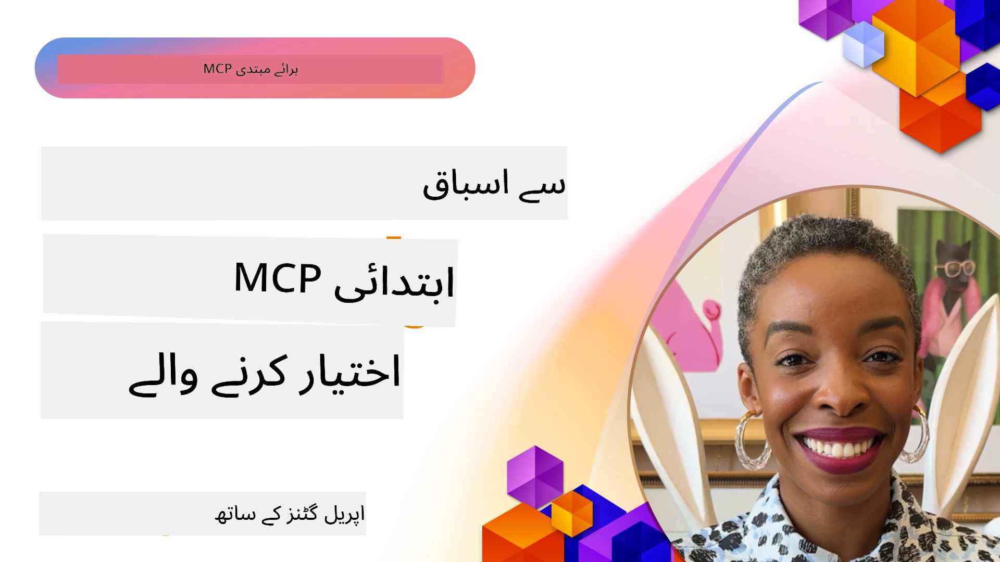

# 🌟 ابتدائی صارفین سے سبق

[](https://youtu.be/jds7dSmNptE)

_(اس سبق کی ویڈیو دیکھنے کے لیے اوپر تصویر پر کلک کریں)_

## 🎯 یہ ماڈیول کیا کور کرتا ہے

یہ ماڈیول دیکھتا ہے کہ حقیقی تنظیمیں اور ڈویلپرز کس طرح ماڈل کانٹیکسٹ پروٹوکول (MCP) کا استعمال کر کے اصل چیلنجز حل کر رہے ہیں اور جدت کو فروغ دے رہے ہیں۔ تفصیلی کیس اسٹڈیز، عملی منصوبوں، اور عملی مثالوں کے ذریعے آپ دریافت کریں گے کہ MCP کس طرح محفوظ، اسکیل ایبل AI انٹیگریشن کی اجازت دیتا ہے جو زبان کے ماڈلز، ٹولز، اور ادارہ جاتی ڈیٹا کو جوڑتا ہے۔

### 📚 MCP کو عملی طور پر دیکھیں

کیا آپ چاہتے ہیں کہ یہ اصول تیار شدہ ٹولز پر کیسے لاگو ہوتے ہیں؟ ہمارے [**10 مائیکروسافٹ MCP سرورز جو ڈویلپرز کی پیداوری بدل رہے ہیں**](microsoft-mcp-servers.md) دیکھیں، جو حقیقی مائیکروسافٹ MCP سرورز کو دکھاتے ہیں جنہیں آپ آج استعمال کر سکتے ہیں۔

## جائزہ

یہ سبق بتاتا ہے کہ ابتدائی صارفین نے ماڈل کانٹیکسٹ پروٹوکول (MCP) کو کس طرح استعمال کر کے مختلف صنعتوں میں حقیقی دنیا کے مسائل حل کیے اور جدت کو فروغ دیا۔ تفصیلی کیس اسٹڈیز اور عملی منصوبوں کے ذریعے آپ دیکھیں گے کہ MCP کس طرح معیاری، محفوظ، اور اسکیل ایبل AI انٹیگریشن کی سہولت فراہم کرتا ہے — بڑے زبان کے ماڈلز، ٹولز، اور ادارہ جاتی ڈیٹا کو ایک متحدہ فریم ورک میں جوڑتا ہے۔ آپ MCP پر مبنی حل ڈیزائن اور بنانے کا عملی تجربہ حاصل کریں گے، ثابت شدہ عمل درآمد کے نمونے سیکھیں گے، اور پیداوار کے ماحول میں MCP کو تعینات کرنے کے بہترین طریقے دریافت کریں گے۔ یہ سبق ابھرتے ہوئے رجحانات، مستقبل کے راستے، اور اوپن سورس وسائل کو بھی اجاگر کرتا ہے تاکہ آپ MCP ٹیکنالوجی اور اس کے تبدیل ہوتے ہوئے ماحولیاتی نظام میں رہنمائی حاصل کر سکیں۔

## تعلیمی مقاصد

- مختلف صنعتوں میں حقیقی دنیا کے MCP نفاذ کا تجزیہ کرنا
- مکمل MCP پر مبنی ایپلیکیشنز ڈیزائن اور بنانا
- MCP ٹیکنالوجی میں ابھرتے ہوئے رجحانات اور مستقبل کے راستے دریافت کرنا
- عملی ترقیاتی منظرناموں میں بہترین طریقے لاگو کرنا

## حقیقی دنیا کے MCP نفاذ

### کیس اسٹڈی 1: ادارہ جاتی کسٹمر سپورٹ آٹومیشن

ایک کثیر القومی کارپوریشن نے اپنا MCP پر مبنی حل نافذ کیا تاکہ اپنے کسٹمر سپورٹ سسٹمز میں AI تعاملات کو معیاری بنایا جا سکے۔ اس سے وہ قابل ہوئے:

- متعدد LLM فراہم کنندگان کے لیے ایک متحدہ انٹرفیس بنائیں
- محکموں میں مستقل پرامپٹ مینجمنٹ برقرار رکھیں
- مضبوط سیکیورٹی اور تعمیل کنٹرول نافذ کریں
- مخصوص ضروریات کی بنیاد پر مختلف AI ماڈلز کے درمیان آسان سوئچنگ کریں

**تکنیکی نفاذ:**

```python
# صارف کی مدد کے لیے پائتھون MCP سرور کی عمل درآمد
import logging
import asyncio
from modelcontextprotocol import create_server, ServerConfig
from modelcontextprotocol.server import MCPServer
from modelcontextprotocol.transports import create_http_transport
from modelcontextprotocol.resources import ResourceDefinition
from modelcontextprotocol.prompts import PromptDefinition
from modelcontextprotocol.tool import ToolDefinition

# لاگنگ کو ترتیب دیں
logging.basicConfig(level=logging.INFO)

async def main():
    # سرور کنفیگریشن بنائیں
    config = ServerConfig(
        name="Enterprise Customer Support Server",
        version="1.0.0",
        description="MCP server for handling customer support inquiries"
    )
    
    # MCP سرور کو initialize کریں
    server = create_server(config)
    
    # نالج بیس وسائل رجسٹر کریں
    server.resources.register(
        ResourceDefinition(
            name="customer_kb",
            description="Customer knowledge base documentation"
        ),
        lambda params: get_customer_documentation(params)
    )
    
    # پرامپٹ ٹیمپلیٹس رجسٹر کریں
    server.prompts.register(
        PromptDefinition(
            name="support_template",
            description="Templates for customer support responses"
        ),
        lambda params: get_support_templates(params)
    )
    
    # مدد کے آلات رجسٹر کریں
    server.tools.register(
        ToolDefinition(
            name="ticketing",
            description="Create and update support tickets"
        ),
        handle_ticketing_operations
    )
    
    # HTTP ٹرانسپورٹ کے ساتھ سرور شروع کریں
    transport = create_http_transport(port=8080)
    await server.run(transport)

if __name__ == "__main__":
    asyncio.run(main())
```
  
**نتائج:** ماڈل کی لاگت میں 30% کمی، جواب کی مستقل مزاجی میں 45% بہتری، اور عالمی آپریشنز میں بہتر تعمیل۔

### کیس اسٹڈی 2: صحت کی دیکھ بھال کا تشخیصی معاون

ایک صحت کی سہولت فراہم کرنے والے نے ایک MCP انفراسٹرکچر تیار کیا تاکہ متعدد تخصصی طبی AI ماڈلز کو مربوط کیا جا سکے جبکہ حساس مریض کے ڈیٹا کو محفوظ رکھا جائے:

- عمومی اور تخصصی طبی ماڈلز کے درمیان بغیر رکاوٹ سوئچنگ
- سخت پرائیویسی کنٹرولز اور آڈٹ ٹریلز
- موجودہ الیکٹرانک ہیلتھ ریکارڈ (EHR) سسٹمز کے ساتھ انٹیگریشن
- طبی اصطلاحات کے لیے مستقل پرامپٹ انجینئرنگ

**تکنیکی نفاذ:**

```csharp
// C# MCP host application implementation in healthcare application
using Microsoft.Extensions.DependencyInjection;
using ModelContextProtocol.SDK.Client;
using ModelContextProtocol.SDK.Security;
using ModelContextProtocol.SDK.Resources;

public class DiagnosticAssistant
{
    private readonly MCPHostClient _mcpClient;
    private readonly PatientContext _patientContext;
    
    public DiagnosticAssistant(PatientContext patientContext)
    {
        _patientContext = patientContext;
        
        // Configure MCP client with healthcare-specific settings
        var clientOptions = new ClientOptions
        {
            Name = "Healthcare Diagnostic Assistant",
            Version = "1.0.0",
            Security = new SecurityOptions
            {
                Encryption = EncryptionLevel.Medical,
                AuditEnabled = true
            }
        };
        
        _mcpClient = new MCPHostClientBuilder()
            .WithOptions(clientOptions)
            .WithTransport(new HttpTransport("https://healthcare-mcp.example.org"))
            .WithAuthentication(new HIPAACompliantAuthProvider())
            .Build();
    }
    
    public async Task<DiagnosticSuggestion> GetDiagnosticAssistance(
        string symptoms, string patientHistory)
    {
        // Create request with appropriate resources and tool access
        var resourceRequest = new ResourceRequest
        {
            Name = "patient_records",
            Parameters = new Dictionary<string, object>
            {
                ["patientId"] = _patientContext.PatientId,
                ["requestingProvider"] = _patientContext.ProviderId
            }
        };
        
        // Request diagnostic assistance using appropriate prompt
        var response = await _mcpClient.SendPromptRequestAsync(
            promptName: "diagnostic_assistance",
            parameters: new Dictionary<string, object>
            {
                ["symptoms"] = symptoms,
                patientHistory = patientHistory,
                relevantGuidelines = _patientContext.GetRelevantGuidelines()
            });
            
        return DiagnosticSuggestion.FromMCPResponse(response);
    }
}
```
  
**نتائج:** ڈاکٹروں کے لیے تشخیصی تجاویز میں بہتری اور مکمل HIPAA تعمیل کے ساتھ ساتھ سسٹمز کے درمیان کانٹیکسٹ سوئچنگ میں نمایاں کمی۔

### کیس اسٹڈی 3: مالی خدمات کے رسک تجزیہ

ایک مالیاتی ادارے نے مختلف محکموں میں اپنے رسک تجزیہ کے عمل کو معیاری بنانے کے لیے MCP نافذ کیا:

- کریڈٹ رسک، فراڈ کی شناخت، اور سرمایہ کاری کے رسک ماڈلز کے لیے ایک متحدہ انٹرفیس تیار کیا
- سخت رسائی کنٹرولز اور ماڈل ورژننگ نافذ کی گئی
- تمام AI سفارشات کی آڈیٹ ایبلٹی یقینی بنائی
- متنوع سسٹمز میں مستقل ڈیٹا فارمیٹنگ کو برقرار رکھا

**تکنیکی نفاذ:**

```java
// مالی خطرے کے اندازے کے لیے جاوا MCP سرور
import org.mcp.server.*;
import org.mcp.security.*;

public class FinancialRiskMCPServer {
    public static void main(String[] args) {
        // مالی تعمیل کی خصوصیات کے ساتھ MCP سرور بنائیں
        MCPServer server = new MCPServerBuilder()
            .withModelProviders(
                new ModelProvider("risk-assessment-primary", new AzureOpenAIProvider()),
                new ModelProvider("risk-assessment-audit", new LocalLlamaProvider())
            )
            .withPromptTemplateDirectory("./compliance/templates")
            .withAccessControls(new SOCCompliantAccessControl())
            .withDataEncryption(EncryptionStandard.FINANCIAL_GRADE)
            .withVersionControl(true)
            .withAuditLogging(new DatabaseAuditLogger())
            .build();
            
        server.addRequestValidator(new FinancialDataValidator());
        server.addResponseFilter(new PII_RedactionFilter());
        
        server.start(9000);
        
        System.out.println("Financial Risk MCP Server running on port 9000");
    }
}
```
  
**نتائج:** بہتر ریگولیٹری تعمیل، 40% تیز ماڈل تعیناتی کے سائیکل، اور محکموں میں رسک اسیسمنٹ کی مستقل مزاجی میں اضافہ۔

### کیس اسٹڈی 4: Microsoft Playwright MCP سرور براؤزر آٹومیشن کے لیے

مائیکروسافٹ نے [Playwright MCP سرور](https://github.com/microsoft/playwright-mcp) تیار کیا تاکہ ماڈل کانٹیکسٹ پروٹوکول کے ذریعے محفوظ، معیاری براؤزر آٹومیشن کی اجازت دی جا سکے۔ یہ تیار شدہ سرور AI ایجنٹس اور LLMs کو کنٹرولڈ، آڈٹ ایبل، اور توسیعی انداز میں ویب براؤزرز کے ساتھ بات چیت کرنے کی سہولت دیتا ہے—جس سے خودکار ویب ٹیسٹنگ، ڈیٹا نکالنے، اور اختتامی عمل کی تو سیع ممکن ہوتی ہے۔

> **🎯 تیار شدہ پیداوار کا ٹول**  
> یہ کیس اسٹڈی وہ حقیقی MCP سرور دکھاتی ہے جسے آپ آج استعمال کر سکتے ہیں! Playwright MCP سرور اور دیگر 9 تیار شدہ مائیکروسافٹ MCP سرورز کے بارے میں مزید جاننے کے لیے ہمارے [**Microsoft MCP Servers Guide**](microsoft-mcp-servers.md#8--playwright-mcp-server) دیکھیں۔ 

**اہم خصوصیات:**  
- براؤزر آٹومیشن کی صلاحیتوں کو MCP ٹولز کے طور پر فراہم کرتا ہے (نیوی گیشن، فارم بھرنا، اسکرین شاٹ کیپچر وغیرہ)  
- غیر مجاز کارروائیوں سے بچنے کے لیے سخت رسائی کنٹرول اور سینڈباکسنگ نافذ کرتا ہے  
- تمام براؤزر تعاملات کے لیے تفصیلی آڈٹ لاگز فراہم کرتا ہے  
- ایجنٹ پر مبنی آٹومیشن کے لیے Azure OpenAI اور دیگر LLM فراہم کنندگان کے ساتھ انٹیگریشن کی حمایت کرتا ہے  
- GitHub Copilot کے کوڈنگ ایجنٹ کو ویب براؤزنگ کی صلاحیتیں فراہم کرتا ہے  

**تکنیکی نفاذ:**

```typescript
// ٹائپ اسکرپٹ: MCP سرور میں پلے رائٹ براؤزر آٹومیشن ٹولز کو رجسٹر کرنا
import { createServer, ToolDefinition } from 'modelcontextprotocol';
import { launch } from 'playwright';

const server = createServer({
  name: 'Playwright MCP Server',
  version: '1.0.0',
  description: 'MCP server for browser automation using Playwright'
});

// URL پر نیویگیٹ کرنے اور اسکرین شاٹ لینے کے لئے ایک ٹول رجسٹر کریں
server.tools.register(
  new ToolDefinition({
    name: 'navigate_and_screenshot',
    description: 'Navigate to a URL and capture a screenshot',
    parameters: {
      url: { type: 'string', description: 'The URL to visit' }
    }
  }),
  async ({ url }) => {
    const browser = await launch();
    const page = await browser.newPage();
    await page.goto(url);
    const screenshot = await page.screenshot();
    await browser.close();
    return { screenshot };
  }
);

// MCP سرور شروع کریں
server.listen(8080);
```
  
**نتائج:**  
- AI ایجنٹس اور LLMs کے لیے محفوظ، پروگراماتی براؤزر آٹومیشن فعال کی  
- ویب ایپلیکیشنز کے لیے دستی جانچ کے کام کو کم کیا اور جانچ کا احاطہ بہتر بنایا  
- ادارہ جاتی ماحول میں براؤزر پر مبنی ٹولز کے انضمام کے لیے قابل دوبارہ استعمال اور توسیعی فریم ورک فراہم کیا  
- GitHub Copilot کی ویب براؤزنگ صلاحیتوں کو طاقت دی  

**حوالہ جات:**  
- [Playwright MCP Server GitHub Repository](https://github.com/microsoft/playwright-mcp)  
- [Microsoft AI and Automation Solutions](https://azure.microsoft.com/en-us/products/ai-services/)  

### کیس اسٹڈی 5: Azure MCP – ادارہ جاتی ماڈل کانٹیکسٹ پروٹوکول بطور سروس

Azure MCP سرور ([https://aka.ms/azmcp](https://aka.ms/azmcp)) مائیکروسافٹ کی مینیجڈ، ادارہ جاتی معیار پر مبنی ماڈل کانٹیکسٹ پروٹوکول نفاذ ہے، جسے ایک کلاؤڈ سروس کے طور پر اسکیل ایبل، محفوظ، اور تعمیل کے قابل MCP سرور صلاحیتیں فراہم کرنے کے لیے ڈیزائن کیا گیا ہے۔ Azure MCP تنظیموں کو MCP سرورز کو تیزی سے تعینات، اداره کرنے، اور Azure AI، ڈیٹا، اور سیکیورٹی خدمات کے ساتھ مربوط کرنے کی سہولت دیتا ہے، آپریشنل بوجھ کو کم کرتا ہے اور AI اپنانے کی رفتار بڑھاتا ہے۔

> **🎯 تیار شدہ پیداوار کا ٹول**  
> یہ حقیقی MCP سرور ہے جسے آپ آج استعمال کر سکتے ہیں! Azure AI Foundry MCP Server کے بارے میں مزید جاننے کے لیے ہمارے [**Microsoft MCP Servers Guide**](microsoft-mcp-servers.md) دیکھیں۔  

- مکمل مینیجڈ MCP سرور ہوسٹنگ، اندرونی اسکیلنگ، مانیٹرنگ، اور سیکیورٹی کے ساتھ  
- Azure OpenAI، Azure AI Search، اور دیگر Azure خدمات کے ساتھ مقامی انٹیگریشن  
- Microsoft Entra ID کے ذریعے ادارہ جاتی تصدیق اور اجازت  
- حسب ضرورت ٹولز، پرامپٹ ٹیمپلیٹس، اور وسائل کنیکٹرز کی حمایت  
- ادارہ جاتی سیکیورٹی اور ضابطہ جاتی تقاضوں کی تعمیل  

**تکنیکی نفاذ:**

```yaml
# Example: Azure MCP server deployment configuration (YAML)
apiVersion: mcp.microsoft.com/v1
kind: McpServer
metadata:
  name: enterprise-mcp-server
spec:
  modelProviders:
    - name: azure-openai
      type: AzureOpenAI
      endpoint: https://<your-openai-resource>.openai.azure.com/
      apiKeySecret: <your-azure-keyvault-secret>
  tools:
    - name: document_search
      type: AzureAISearch
      endpoint: https://<your-search-resource>.search.windows.net/
      apiKeySecret: <your-azure-keyvault-secret>
  authentication:
    type: EntraID
    tenantId: <your-tenant-id>
  monitoring:
    enabled: true
    logAnalyticsWorkspace: <your-log-analytics-id>
```
  
**نتائج:**  
- ایک تیار استعمال، تعمیل کے قابل MCP سرور پلیٹ فارم فراہم کر کے ادارہ جاتی AI منصوبوں کے لیے وقت سے پہلے قدر حاصل کی  
- LLMs، ٹولز، اور ادارہ جاتی ڈیٹا ذرائع کی آسان انٹیگریشن کی  
- MCP ورک لوڈز کے لیے سیکیورٹی، مشاہدہ پذیری، اور آپریشنل کارکردگی میں بہتری کی  
- Azure SDK کی بہترین تراکیب اور موجودہ تصدیقی نمونوں کے ساتھ کوڈ معیار میں اضافہ کیا  

**حوالہ جات:**  
- [Azure MCP Documentation](https://aka.ms/azmcp)  
- [Azure MCP Server GitHub Repository](https://github.com/Azure/azure-mcp)  
- [Azure AI Services](https://azure.microsoft.com/en-us/products/ai-services/)  
- [Microsoft MCP Center](https://mcp.azure.com)  

## کیس اسٹڈی 6: NLWeb  
MCP (Model Context Protocol) چیٹ بوٹس اور AI معاونین کے لیے ٹولز کے ساتھ تعامل کرنے کے لیے ایک ابھرتا ہوا پروٹوکول ہے۔ ہر NLWeb انسٹنس بھی ایک MCP سرور ہے، جو ایک بنیادی طریقہ کار ask کو سپورٹ کرتا ہے، جس کے ذریعے قدرتی زبان میں کسی ویب سائٹ سے سوال پوچھا جاتا ہے۔ واپس کیا گیا جواب schema.org کا استعمال کرتا ہے، جو ویب ڈیٹا کی وضاحت کے لیے وسیع پیمانے پر استعمال ہونے والا ذخیرہ الفاظ ہے۔ آسان الفاظ میں، MCP ویسے ہی ہے جیسے NLWeb Http کے لیے HTML ہے۔ NLWeb پروٹوکولز، schema.org فارمیٹس، اور نمونہ کوڈ کو جوڑتا ہے تاکہ سائٹس جلد از جلد یہ اینڈپوائنٹس تخلیق کر سکیں، جس سے انسانی گفتگو کے ذریعے انٹرفیس اور مشینوں کے درمیان قدرتی ایجنٹ-ٹو-ایجنٹ تعامل سے فائدہ حاصل ہوتا ہے۔

NLWeb کے دو مختلف اجزاء ہیں۔  
- ایک پروٹوکول، شروع میں بہت آسان، جو سائٹ کے ساتھ قدرتی زبان میں انٹرفیس فراہم کرتا ہے، اور ایک فارمیٹ، جو واپس کیے گئے جواب کے لیے json اور schema.org کا استعمال کرتا ہے۔ REST API پر دستاویزات میں مزید تفصیلات دیکھیں۔  
- (1) کا ایک آسان نفاذ جو موجودہ مارک اپ سے فائدہ اٹھاتا ہے، ان سائٹس کے لیے جو اشیاء کی فہرستوں (مصنوعات، نسخے، مقامات، جائزے وغیرہ) کے طور پر خلاصہ کی جا سکتی ہیں۔ صارف کے انٹرفیس ویجٹس کے ایک سیٹ کے ساتھ، سائٹس آسانی سے اپنے مواد کے لیے گفتگو کے انٹرفیس فراہم کر سکتی ہیں۔ یہ کیسے کام کرتا ہے اس پر زندگیِ چیٹ سوال کی دستاویزات میں مزید دیکھیں۔  

**حوالہ جات:**  
- [Azure MCP Documentation](https://aka.ms/azmcp)  
- [NLWeb](https://github.com/microsoft/NlWeb)  

### کیس اسٹڈی 7: Azure AI Foundry MCP سرور – ادارہ جاتی AI ایجنٹ انٹیگریشن

Azure AI Foundry MCP سرورز دکھاتے ہیں کہ MCP کو کیسے AI ایجنٹس اور ورک فلو کو ادارہ جاتی ماحول میں منظم اور مربوط کرنے کے لیے استعمال کیا جا سکتا ہے۔ MCP کو Azure AI Foundry کے ساتھ جوڑ کر، تنظیمیں ایجنٹ تعاملات کو معیاری بنا سکتی ہیں، Foundry کے ورک فلو مینجمنٹ کا فائدہ اٹھا سکتی ہیں، اور محفوظ و اسکیل ایبل تعیناتیاں یقینی بنا سکتی ہیں۔

> **🎯 تیار شدہ پیداوار کا ٹول**  
> یہ حقیقی MCP سرور ہے جسے آپ آج استعمال کر سکتے ہیں! Azure AI Foundry MCP Server کے بارے میں مزید جاننے کے لیے ہمارے [**Microsoft MCP Servers Guide**](microsoft-mcp-servers.md#9--azure-ai-foundry-mcp-server) دیکھیں۔  

**اہم خصوصیات:**  
- Azure کی AI ماحولیاتی نظام تک مکمل رسائی، بشمول ماڈل کیٹلاگز اور تعیناتی مینجمنٹ  
- RAG ایپلیکیشنز کے لیے Azure AI Search کے ساتھ نالج انڈیکسنگ  
- AI ماڈل کی کارکردگی اور معیار کی یقین دہانی کے لیے جائزہ آلات  
- Azure AI Foundry کیٹلاگ اور لیبز کے ساتھ جدید تحقیقاتی ماڈلز کی انٹیگریشن  
- پیداوار کے منظرناموں کے لیے ایجنٹ مینجمنٹ اور جائزہ صلاحیتیں  

**نتائج:**  
- AI ایجنٹ ورک فلو کی تیز پروٹوٹائپنگ اور مضبوط نگرانی  
- جدید منظرناموں کے لیے Azure AI خدمات کے ساتھ بغیر رکاوٹ انٹیگریشن  
- ایجنٹ پائپ لائنز کی تعمیر، تعیناتی، اور نگرانی کے لیے متحدہ انٹرفیس  
- اداروں کے لیے بہتر سیکیورٹی، تعمیل، اور آپریشنل کارکردگی  
- پیچیدہ ایجنٹ پر مبنی عمل پر کنٹرول برقرار رکھتے ہوئے AI اپنانے میں تیزی  

**حوالہ جات:**  
- [Azure AI Foundry MCP Server GitHub Repository](https://github.com/azure-ai-foundry/mcp-foundry)  
- [Integrating Azure AI Agents with MCP (Microsoft Foundry Blog)](https://devblogs.microsoft.com/foundry/integrating-azure-ai-agents-mcp/)  

### کیس اسٹڈی 8: Foundry MCP Playground – تجربہ اور پروٹوٹائپنگ

Foundry MCP Playground ایک تیار استعمال ماحول فراہم کرتا ہے تاکہ MCP سرورز اور Azure AI Foundry انٹیگریشنز کے ساتھ تجربہ کیا جا سکے۔ ڈویلپرز تیزی سے AI ماڈلز اور ایجنٹ ورک فلوز کا پروٹوٹائپ، جانچ، اور جائزہ لے سکتے ہیں، Azure AI Foundry کیٹلاگ اور لیبز کے وسائل استعمال کرتے ہوئے۔ یہ پلیگ راؤنڈ سیٹ اپ کو آسان بناتا ہے، نمونہ منصوبے فراہم کرتا ہے، اور مشترکہ ترقی کی حمایت کرتا ہے، جس سے بہترین طریقے اور نئے منظرنامے کم پیچیدگی کے ساتھ دریافت کرنا آسان ہوتا ہے۔ خاص طور پر ٹیموں کے لیے مفید ہے جو آئیڈیاز کی توثیق کرنا، تجربات شئیر کرنا، اور پیچیدہ انفراسٹرکچر کی ضرورت کے بغیر سیکھنے کی رفتار بڑھانا چاہتے ہیں۔ رکاوٹوں کو کم کر کے، یہ پلیگ راؤنڈ MCP اور Azure AI Foundry کے ماحولیاتی نظام میں جدت اور کمیونٹی تعاون کو فروغ دیتا ہے۔

**حوالہ جات:**  

- [Foundry MCP Playground GitHub Repository](https://github.com/azure-ai-foundry/foundry-mcp-playground)  

### کیس اسٹڈی 9: Microsoft Learn Docs MCP سرور – AI سے چلنے والی دستاویزات تک رسائی

Microsoft Learn Docs MCP Server ایک کلاؤڈ میزبان سروس ہے جو AI معاونین کو ماڈل کانٹیکسٹ پروٹوکول کے ذریعے Microsoft کی سرکاری دستاویزات تک حقیقی وقت میں رسائی فراہم کرتی ہے۔ یہ تیار شدہ سرور مکمل Microsoft Learn ماحولیاتی نظام سے جڑتا ہے اور تمام سرکاری Microsoft ذرائع کے درمیان معنوی تلاش کی سہولت دیتا ہے۔

> **🎯 تیار شدہ پیداوار کا ٹول**  
> یہ حقیقی MCP سرور ہے جسے آپ آج استعمال کر سکتے ہیں! Microsoft Learn Docs MCP Server کے بارے میں مزید جاننے کے لیے ہمارے [**Microsoft MCP Servers Guide**](microsoft-mcp-servers.md#1--microsoft-learn-docs-mcp-server) دیکھیں۔  

**اہم خصوصیات:**  
- سرکاری Microsoft دستاویزات، Azure دستاویزات، اور Microsoft 365 کی دستاویزات تک حقیقی وقت کی رسائی  
- پیچیدہ معنوی تلاش کی صلاحیتیں جو سیاق و سباق اور ارادے کو سمجھتی ہیں  
- Microsoft Learn کے مواد کے شائع ہوتے ہی ہمیشہ تازہ ترین معلومات  
- Microsoft Learn، Azure دستاویزات، اور Microsoft 365 ذرائع میں جامع احاطہ  
- مضمون کے عنوانات اور URLs کے ساتھ 10 اعلی معیار کے مواد کے حصے واپس کرتی ہے  

**کیوں یہ اہم ہے:**  
- Microsoft ٹیکنالوجیز کے لیے "پرانے AI علم" کے مسئلے کو حل کرتا ہے  
- AI معاونین کو تازہ ترین .NET، C#، Azure، اور Microsoft 365 خصوصیات تک رسائی دیتا ہے  
- درست کوڈ جنریشن کے لیے مستند، پہلی پارٹی معلومات فراہم کرتا ہے  
- تیزی سے بدلتی Microsoft ٹیکنالوجیز پر کام کرنے والے ڈویلپرز کے لیے لازمی  

**نتائج:**  
- Microsoft ٹیکنالوجیز کے لیے AI سے تیار کردہ کوڈ کی درستگی میں نمایاں اضافہ  
- تازہ ترین دستاویزات اور بہترین طریقوں کی تلاش میں کم وقت صرف ہوا  
- سیاق و سباق سے آگاہ دستاویزات بازیافت کے ساتھ ڈویلپر کی پیداواری صلاحیت بہتر ہوئی  
- IDE چھوڑے بغیر ترقیاتی ورک فلو کے ساتھ ہموار انٹیگریشن  

**حوالہ جات:**  
- [Microsoft Learn Docs MCP Server GitHub Repository](https://github.com/MicrosoftDocs/mcp)  
- [Microsoft Learn Documentation](https://learn.microsoft.com/)  

## عملی منصوبے

### منصوبہ 1: ملٹی-پرووائیڈر MCP سرور بنائیں

**مقصد:** ایک MCP سرور تیار کریں جو مخصوص معیارات کی بنیاد پر متعدد AI ماڈل فراہم کنندگان کو درخواستیں بھیج سکے۔

**ضروریات:**

- کم از کم تین مختلف ماڈل فراہم کنندگان کی حمایت (جیسے OpenAI، Anthropic، مقامی ماڈلز)  
- درخواست کے میٹا ڈیٹا کی بنیاد پر روٹنگ کا نظام نافذ کریں  
- فراہم کنندہ کے اسناد کی مینجمنٹ کے لیے کنفیگریشن سسٹم بنائیں  
- کارکردگی اور لاگت کی بہتر ی کے لیے کیشنگ شامل کریں  
- استعمال کی نگرانی کے لیے ایک آسان ڈیش بورڈ بنائیں  

**نفاذ کے مراحل:**

1. بنیادی MCP سرور انفراسٹرکچر قائم کریں  
2. ہر AI ماڈل سروس کے لیے فراہم کنندہ کے ایڈاپٹرز نافذ کریں  
3. درخواست کی خصوصیات کی بنیاد پر روٹنگ لاجک بنائیں  
4. اکثر درخواستوں کے لیے کیشنگ میکانیزم شامل کریں  
5. مانیٹرنگ ڈیش بورڈ تیار کریں  
6. مختلف درخواستوں کے پیٹرنز کے ساتھ ٹیسٹ کریں  

**تکنالوجیز:** اپنی پسند کے مطابق Python (.NET/Java/Python)، کیشنگ کے لیے Redis، اور ڈیش بورڈ کے لیے ایک آسان ویب فریم ورک منتخب کریں۔  

### منصوبہ 2: ادارہ جاتی پرامپٹ مینجمنٹ سسٹم
**مقصد:** ایک MCP پر مبنی نظام تیار کریں جو تنظیم بھر میں پرامپٹ ٹیمپلیٹس کے انتظام، ورژننگ، اور تعیناتی کے لیے ہو۔

**مطالبات:**

- پرامپٹ ٹیمپلیٹس کے لیے ایک مرکزی ذخیرہ بنائیں  
- ورژننگ اور منظوری کے ورک فلو نافذ کریں  
- نمونہ ان پٹ کے ساتھ ٹیمپلیٹ ٹیسٹنگ کی صلاحیتیں بنائیں  
- کردار پر مبنی رسائی کنٹرولز تیار کریں  
- ٹیمپلیٹ بازیافت اور تعیناتی کے لیے API تیار کریں  

**نفاذ کے اقدامات:**

1. ٹیمپلیٹ اسٹوریج کے لیے ڈیٹا بیس اسکیمہ ڈیزائن کریں  
2. ٹیمپلیٹ CRUD آپریشنز کے لیے مرکزی API بنائیں  
3. ورژننگ سسٹم نافذ کریں  
4. منظوری کے ورک فلو کی تعمیر کریں  
5. ٹیسٹنگ فریم ورک تیار کریں  
6. انتظام کے لیے سادہ ویب انٹرفیس تخلیق کریں  
7. MCP سرور کے ساتھ انٹیگریٹ کریں  

**ٹیکنالوجیز:** آپ کی پسند کے بیک اینڈ فریم ورک، SQL یا NoSQL ڈیٹا بیس، اور مینجمنٹ انٹرفیس کے لیے فرنٹ اینڈ فریم ورک۔

### پروجیکٹ 3: MCP پر مبنی مواد جنریشن پلیٹ فارم

**مقصد:** ایک مواد جنریشن پلیٹ فارم بنائیں جو MCP کو استعمال کرتے ہوئے مختلف مواد کی اقسام میں مستقل نتائج فراہم کرے۔

**مطالبات:**

- متعدد مواد کے فارمیٹس کی حمایت کریں (بلاگ پوسٹس، سوشل میڈیا، مارکیٹنگ کاپی)  
- ٹیمپلیٹ پر مبنی جنریشن کو حسب ضرورت اختیارات کے ساتھ نافذ کریں  
- مواد کے جائزے اور رائے کا نظام بنائیں  
- مواد کی کارکردگی کے میٹرکس کو ٹریک کریں  
- مواد کی ورژننگ اور تکرار کی حمایت کریں  

**نفاذ کے اقدامات:**

1. MCP کلائنٹ انفراسٹرکچر سیٹ اپ کریں  
2. مختلف مواد کی اقسام کے لیے ٹیمپلیٹس بنائیں  
3. مواد جنریشن پائپ لائن تعمیر کریں  
4. جائزہ نظام نافذ کریں  
5. میٹرکس ٹریکنگ سسٹم تیار کریں  
6. ٹیمپلیٹ مینجمنٹ اور مواد جنریشن کے لیے صارف انٹرفیس بنائیں  

**ٹیکنالوجیز:** آپ کی پسندیدہ پروگرامنگ زبان، ویب فریم ورک، اور ڈیٹا بیس سسٹم۔

## MCP ٹیکنالوجی کے لیے مستقبل کے راستے

### ابھرتے رجحانات

1. **ملٹی موڈل MCP**  
   - تصویر، آڈیو، اور ویڈیو ماڈلز کے ساتھ تعاملات کو معیاری بنانے کے لیے MCP کی توسیع  
   - کراس موڈل استدلال کی صلاحیتوں کی ترقی  
   - مختلف موڈیلٹیز کے لیے معیاری پرامپٹ فارمیٹس  

2. **وفاقی MCP انفراسٹرکچر**  
   - تنظیموں کے درمیان وسائل بانٹنے کے قابل تقسیم MCP نیٹ ورکس  
   - محفوظ ماڈل شیئرنگ کے لیے معیاری پروٹوکولز  
   - پرائیویسی محفوظ بنانے والی کمپیوٹیشن تکنیکس  

3. **MCP مارکیٹ پلیسز**  
   - MCP ٹیمپلیٹس اور پلگ انز کے اشتراک اور منیٹائزیشن کے لیے ایکو سسٹمز  
   - معیار کی یقین دہانی اور سرٹیفیکیشن کے عمل  
   - ماڈل مارکیٹ پلیسز کے ساتھ انضمام  

4. **ایج کمپیوٹنگ کے لیے MCP**  
   - محدود وسائل والے ایج ڈیوائسز کے لیے MCP اسٹینڈرڈز کی مطابقت  
   - کم بینڈوڈتھ ماحول کے لیے بہتر بنائے گئے پروٹوکولز  
   - IoT ایکو سسٹمز کے لیے مخصوص MCP نفاذات  

5. **ریگولیٹری فریم ورکس**  
   - ریگولیٹری تعمیل کے لیے MCP توسیعات کی ترقی  
   - معیاری آڈٹ ٹریلز اور وضاحت انٹرفیس  
   - ابھرتے ہوئے AI گورننس فریم ورکس کے ساتھ انضمام  

### مائیکروسافٹ سے MCP حل

مائیکروسافٹ اور ایزور نے مختلف منظرناموں میں MCP کو نافذ کرنے میں مدد کے لیے کئی اوپن سورس ذخیرہ جات تیار کیے ہیں:

#### Microsoft Organization

1. [playwright-mcp](https://github.com/microsoft/playwright-mcp) - براؤزر خود کاری اور ٹیسٹنگ کے لیے Playwright MCP سرور  
2. [files-mcp-server](https://github.com/microsoft/files-mcp-server) - لوکل ٹیسٹنگ اور کمیونٹی تعاون کے لیے OneDrive MCP سرور  
3. [NLWeb](https://github.com/microsoft/NlWeb) - اوپن پروٹوکولز اور متعلقہ اوپن سورس ٹولز کا مجموعہ، AI ویب کے لیے بنیادی تہہ قائم کرنا  

#### Azure-Samples Organization

1. [mcp](https://github.com/Azure-Samples/mcp) - متعدد زبانوں کے استعمال کے ذریعے ایزور پر MCP سرور بنانے اور انضمام کے لیے نمونے، ٹولز، اور ذرائع  
2. [mcp-auth-servers](https://github.com/Azure-Samples/mcp-auth-servers) - موجودہ ماڈل کانٹیکسٹ پروٹوکول وضاحت کے ساتھ توثیق دکھانے والے MCP سرور  
3. [remote-mcp-functions](https://github.com/Azure-Samples/remote-mcp-functions) - ایزور فنگشنز میں ریموٹ MCP سرور کے نفاذ کے لیے لینڈنگ پیج اور زبان مخصوص ریپوز کے روابط  
4. [remote-mcp-functions-python](https://github.com/Azure-Samples/remote-mcp-functions-python) - Python کے ساتھ ایزور فنگشنز استعمال کرتے ہوئے ریموٹ MCP سرور بنانے اور تعینات کرنے کے لیے فوری آغاز ٹیمپلیٹ  
5. [remote-mcp-functions-dotnet](https://github.com/Azure-Samples/remote-mcp-functions-dotnet) - .NET/C# کے ساتھ ایزور فنگشنز کے ذریعے ریموٹ MCP سرور کے لیے فوری آغاز ٹیمپلیٹ  
6. [remote-mcp-functions-typescript](https://github.com/Azure-Samples/remote-mcp-functions-typescript) - TypeScript کے ساتھ ایزور فنگشنز کے ذریعے ریموٹ MCP سرور کے لیے فوری آغاز ٹیمپلیٹ  
7. [remote-mcp-apim-functions-python](https://github.com/Azure-Samples/remote-mcp-apim-functions-python) - Python استعمال کرتے ہوئے ریموٹ MCP سرورز کے لیے Azure API Management بطور AI Gateway  
8. [AI-Gateway](https://github.com/Azure-Samples/AI-Gateway) - APIM ❤️ AI تجربات، MCP صلاحیتوں سمیت، ایزور اوپن AI اور AI Foundry کے ساتھ انضمام  

یہ ذخیرہ جات مختلف پروگرامنگ زبانوں اور ایزور سروسز میں ماڈل کانٹیکسٹ پروٹوکول کے ساتھ کام کرنے کے لیے مختلف نفاذات، ٹیمپلیٹس، اور وسائل فراہم کرتے ہیں۔ یہ بنیادی سرور نفاذات سے لے کر توثیق، کلاؤڈ تعیناتی، اور انٹرپرائز انٹیگریشن سیناریوز تک کئی استعمالات کا احاطہ کرتے ہیں۔

#### MCP وسائل ڈائریکٹری

[مائیکروسافٹ کے سرکاری MCP ریپوزٹری](https://github.com/microsoft/mcp/tree/main/Resources) میں MCP وسائل کی ڈائریکٹری ایک منتخب شدہ مجموعہ فراہم کرتی ہے جو ماڈل کانٹیکسٹ پروٹوکول سرورز کے لیے نمونہ وسائل، پرامپٹ ٹیمپلیٹس، اور ٹول کی تعریفیں شامل ہیں۔ یہ ڈائریکٹری ڈویلپرز کو MCP کے ساتھ شروع کرنے میں مدد دیتی ہے، قابل استعمال اجزاء اور بہترین عملی مثالوں کے ساتھ:

- **پرامپٹ ٹیمپلیٹس:** عام AI کاموں اور منظرناموں کے لیے تیار استعمال پرامپٹ ٹیمپلیٹس، جنہیں آپ اپنے MCP سرور نفاذات کے لیے موافق بنایا جا سکتا ہے۔  
- **ٹول تعارفی خاکے:** مختلف MCP سرورز میں ٹول انضمام اور کالنگ کو معیاری بنانے کے لیے مثالیں اور میٹا ڈیٹا۔  
- **وسائل کی نمونے:** MCP فریم ورک میں ڈیٹا ذرائع، API، اور خارجی خدمات سے رابطہ کرنے کی مثالیں۔  
- **حوالہ نفاذات:** عملی نمونے جو دکھاتے ہیں کہ حقیقی دنیا کے MCP منصوبوں میں وسائل، پرامپٹس، اور ٹولز کو کس طرح منظم کیا جائے۔  

یہ وسائل ترقیاتی عمل کو تیز کرتے ہیں، معیار کو فروغ دیتے ہیں، اور MCP پر مبنی حل بنانے اور تعینات کرنے میں بہترین طریقوں کو یقینی بناتے ہیں۔

#### MCP وسائل ڈائریکٹری

- [MCP Resources (نمونہ پرامپٹس، ٹولز، اور وسائل کی تعریفیں)](https://github.com/microsoft/mcp/tree/main/Resources)

### تحقیقی مواقع

- MCP فریم ورکس میں مؤثر پرامپٹ بہتر بنانے کی تکنیکس  
- کثیر کرایہ دار MCP تعیناتیوں کے لیے حفاظتی ماڈلز  
- مختلف MCP نفاذات میں کارکردگی کی جانچ  
- MCP سرورز کے لیے رسمی توثیق کے طریقے  

## نتیجہ

ماڈل کانٹیکسٹ پروٹوکول (MCP) صنعتوں میں معیاری، محفوظ، اور باہمی کام کرنے والے AI انضمام کے مستقبل کو تیزی سے شکل دے رہا ہے۔ اس سبق میں کیس اسٹڈیز اور عملی منصوبوں کے ذریعے، آپ نے دیکھا کہ ابتدائی اپنانے والے — بشمول مائیکروسافٹ اور ایزور — MCP کو استعمال کرتے ہوئے حقیقی دنیا کے چیلنجز کو کیسے حل کر رہے ہیں، AI کی اپنانے کو تیز کر رہے ہیں، اور تعمیل، سلامتی، اور اسکیل ایبلیٹی کو یقینی بنا رہے ہیں۔ MCP کی ماڈیولر اپروچ تنظیموں کو بڑے زبان کے ماڈلز، ٹولز، اور انٹرپرائز ڈیٹا کو متحد، قابلِ جانچ فریم ورک میں مربوط کرنے کے قابل بناتی ہے۔ جیسے جیسے MCP ارتقاء پذیر ہے، کمیونٹی کے ساتھ مشغول رہنا، اوپن سورس وسائل کو دریافت کرنا، اور بہترین طریقے اپنانا مضبوط، مستقبل تیار AI حل بنانے کی کلید ہوگا۔

## اضافی وسائل

- [MCP Foundry GitHub Repository](https://github.com/azure-ai-foundry/mcp-foundry)  
- [Foundry MCP Playground](https://github.com/azure-ai-foundry/foundry-mcp-playground)  
- [Integrating Azure AI Agents with MCP (Microsoft Foundry Blog)](https://devblogs.microsoft.com/foundry/integrating-azure-ai-agents-mcp/)  
- [MCP GitHub Repository (Microsoft)](https://github.com/microsoft/mcp)  
- [MCP Resources Directory (Sample Prompts, Tools, and Resource Definitions)](https://github.com/microsoft/mcp/tree/main/Resources)  
- [MCP Community & Documentation](https://modelcontextprotocol.io/introduction)  
- [MCP Specification (2025-11-25)](https://spec.modelcontextprotocol.io/specification/2025-11-25/)  
- [Azure MCP Documentation](https://aka.ms/azmcp)  
- [OWASP MCP Top 10](https://microsoft.github.io/mcp-azure-security-guide/mcp/) - سیکیورٹی کی بہترین مشقیں  
- [Playwright MCP Server GitHub Repository](https://github.com/microsoft/playwright-mcp)  
- [Files MCP Server (OneDrive)](https://github.com/microsoft/files-mcp-server)  
- [Azure-Samples MCP](https://github.com/Azure-Samples/mcp)  
- [MCP Auth Servers (Azure-Samples)](https://github.com/Azure-Samples/mcp-auth-servers)  
- [Remote MCP Functions (Azure-Samples)](https://github.com/Azure-Samples/remote-mcp-functions)  
- [Remote MCP Functions Python (Azure-Samples)](https://github.com/Azure-Samples/remote-mcp-functions-python)  
- [Remote MCP Functions .NET (Azure-Samples)](https://github.com/Azure-Samples/remote-mcp-functions-dotnet)  
- [Remote MCP Functions TypeScript (Azure-Samples)](https://github.com/Azure-Samples/remote-mcp-functions-typescript)  
- [Remote MCP APIM Functions Python (Azure-Samples)](https://github.com/Azure-Samples/remote-mcp-apim-functions-python)  
- [AI-Gateway (Azure-Samples)](https://github.com/Azure-Samples/AI-Gateway)  
- [Microsoft AI and Automation Solutions](https://azure.microsoft.com/en-us/products/ai-services/)

## مشقیں

1. کیس اسٹڈیوں میں سے ایک کا تجزیہ کریں اور متبادل نفاذ نقطہ نظر تجویز کریں۔  
2. پروجیکٹ آئیڈیاز میں سے ایک کا انتخاب کریں اور تفصیلی تکنیکی وضاحت تیار کریں۔  
3. ایک ایسی صنعت کی تحقیق کریں جو کیس اسٹڈیوں میں شامل نہیں تھی اور وضاحت کریں کہ MCP اس کی مخصوص مشکلات کو کیسے حل کر سکتا ہے۔  
4. مستقبل کے راستوں میں سے ایک تلاش کریں اور اس کو سپورٹ کرنے کے لیے MCP کی ایک نئی توسیع کا تصور تیار کریں۔

## اگلا کیا ہے

مزید دریافت کریں: [Microsoft MCP Servers](./microsoft-mcp-servers.md)

جاری رکھیں: [Module 8: Best Practices](../08-BestPractices/README.md)

---

<!-- CO-OP TRANSLATOR DISCLAIMER START -->
**ڈس کلیمزر**:
یہ دستاویز AI ترجمہ سروس [Co-op Translator](https://github.com/Azure/co-op-translator) کے ذریعے ترجمہ کی گئی ہے۔ اگرچہ ہم درستگی کے لیے کوشاں ہیں، براہ کرم معلوم رہے کہ خودکار ترجمے میں غلطیاں یا کمی بیشی ہو سکتی ہے۔ اصل دستاویز اپنی مادری زبان میں معتبر ماخذ سمجھی جانی چاہیے۔ اہم معلومات کے لیے پیشہ ور انسانی ترجمہ تجویز کیا جاتا ہے۔ اس ترجمے کے استعمال سے پیدا ہونے والی کسی بھی غلط فہمی یا غلط تشریح کے لیے ہم ذمہ دار نہیں ہیں۔
<!-- CO-OP TRANSLATOR DISCLAIMER END -->