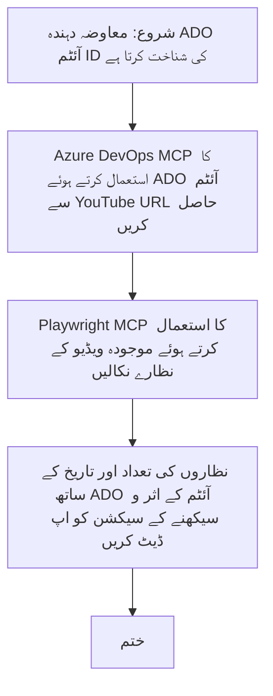

# کیس اسٹڈی: MCP کے ساتھ YouTube ڈیٹا سے Azure DevOps آئٹمز کو اپ ڈیٹ کرنا

> **انکار:** آن لائن موجود آلات اور رپورٹس دستیاب ہیں جو YouTube جیسے پلیٹ فارمز سے ڈیٹا کے ذریعے Azure DevOps آئٹمز کی اپ ڈیٹ کے عمل کو خودکار بنا سکتی ہیں۔ درج ذیل منظر نامہ صرف ایک نمونہ استعمال کیس کے طور پر فراہم کیا گیا ہے تاکہ دکھایا جا سکے کہ MCP آلات کو خودکاری اور انضمام کے کاموں کے لیے کس طرح استعمال کیا جا سکتا ہے۔

## جائزہ

یہ کیس اسٹڈی ایک مثال پیش کرتی ہے کہ ماڈل کانٹیکسٹ پروٹوکول (MCP) اور اس کے آلات کو آن لائن پلیٹ فارمز، جیسے YouTube، سے حاصل کردہ معلومات کے ساتھ Azure DevOps (ADO) ورک آئٹمز کی اپ ڈیٹ کے عمل کو خودکار بنانے کے لیے کیسے استعمال کیا جا سکتا ہے۔ بیان کردہ منظر نامہ ان آلات کی وسیع صلاحیتوں کی صرف ایک مثال ہے، جنہیں اسی طرح کی بہت سی دیگر خودکار ضروریات کے مطابق ڈھالا جا سکتا ہے۔

اس مثال میں، ایک ایڈووکیٹ ADO آئٹمز کے ذریعے آن لائن سیشنز کو ٹریک کرتا ہے، جہاں ہر آئٹم میں YouTube ویڈیو کا URL شامل ہوتا ہے۔ MCP آلات سے فائدہ اٹھاتے ہوئے، ایڈووکیٹ ADO آئٹمز کو تازہ ترین ویڈیو میٹرکس، جیسے ویو کاؤنٹس، کے ساتھ بار بار اور خودکار انداز میں اپ ڈیٹ رکھ سکتا ہے۔ اس طریقہ کار کو دیگر استعمال کے معاملات میں بھی لاگو کیا جا سکتا ہے جہاں آن لائن ذرائع کی معلومات کو ADO یا دیگر نظاموں میں شامل کرنا ہو۔

## منظر نامہ

ایک ایڈووکیٹ آن لائن سیشنز اور کمیونٹی مصروفیات کے اثرات کی نگرانی کا ذمہ دار ہے۔ ہر سیشن کو 'DevRel' پروجیکٹ میں ADO ورک آئٹم کے طور پر لاگ کیا جاتا ہے، اور ورک آئٹم میں YouTube ویڈیو URL کے لیے ایک فیلڈ شامل ہوتا ہے۔ سیشن کی پہنچ کی درست رپورٹنگ کے لیے، ایڈووکیٹ کو ویڈیو کے موجودہ نظاروں کی تعداد اور اس معلومات کے حاصل ہونے کی تاریخ کے ساتھ ADO آئٹم کو اپ ڈیٹ کرنا پڑتا ہے۔

## استعمال کیے گئے آلات

- [Azure DevOps MCP](https://github.com/microsoft/azure-devops-mcp): MCP کے ذریعے ADO ورک آئٹمز تک پروگراماتی رسائی اور اپ ڈیٹس کے قابل بناتا ہے۔
- [Playwright MCP](https://github.com/microsoft/playwright-mcp): ویب صفحات سے جیسے YouTube ویڈیو کے اعدادوشمار، زندہ ڈیٹا نکالنے کے لیے براؤزر کے اعمال کو خودکار بناتا ہے۔

## مرحلہ وار ورک فلو

1. **ADO آئٹم کی شناخت کریں**: 'DevRel' پروجیکٹ میں ADO ورک آئٹم ID (مثلاً 1234) کے ساتھ شروع کریں۔
2. **YouTube URL حاصل کریں**: Azure DevOps MCP ٹول کا استعمال کرتے ہوئے ورک آئٹم سے YouTube URL حاصل کریں۔
3. **ویڈیو کے نظارے نکالیں**: Playwright MCP ٹول کا استعمال کرتے ہوئے YouTube URL پر جائیں اور موجودہ ویو کاؤنٹ نکالیں۔
4. **ADO آئٹم کو اپ ڈیٹ کریں**: Azure DevOps MCP ٹول کے ذریعے 'Impact and Learnings' سیکشن میں تازہ ترین ویو کاؤنٹ اور حاصل ہونے کی تاریخ لکھیں۔

## مثال استعمال کا پرامپٹ

```bash
- Work with the ADO Item ID: 1234
- The project is '2025-Awesome'
- Get the YouTube URL for the ADO item
- Use Playwright to get the current views from the YouTube video
- Update the ADO item with the current video views and the updated date of the information
```

## میرمیڈ فلوچارٹ


## تکنیکی نفاذ

- **MCP آرکیسٹریشن**: ورک فلو کو ایک MCP سرور آرکیسٹریٹ کرتا ہے، جو Azure DevOps MCP اور Playwright MCP دونوں آلات کے استعمال کو مربوط کرتا ہے۔
- **خودکاری**: عمل کو دستی طور پر یا باقاعدہ وقفوں پر چلانے کے لیے شیڈول کیا جا سکتا ہے تاکہ ADO آئٹمز کو اپ ٹو ڈیٹ رکھا جا سکے۔
- **توسیع پذیری**: اسی پیٹرن کو دیگر آن لائن میٹرکس (مثلاً لائکس، تبصرے) یا دیگر پلیٹ فارمز سے ADO آئٹمز کی اپ ڈیٹ کے لیے بھی توسیع دی جا سکتی ہے۔

## نتائج اور اثرات

- **کارکردگی**: ایڈووکیٹس کے لیے ویڈیو میٹرکس کی بازیافت اور اپ ڈیٹ کے عمل کو خودکار بنا کر دستی محنت کو کم کرتا ہے۔
- **درستی**: اس بات کو یقینی بناتا ہے کہ ADO آئٹمز آن لائن ذرائع سے دستیاب جدید ترین ڈیٹا کو ظاہر کریں۔
- **دہرائی جانے والی صلاحیت**: دیگر ڈیٹا ذرائع یا میٹرکس کے لیے اسی طرح کے مناظر کے لیے دوبارہ استعمال کے قابل ورک فلو فراہم کرتا ہے۔

## حوالہ جات

- [Azure DevOps MCP](https://github.com/microsoft/azure-devops-mcp)
- [Playwright MCP](https://github.com/microsoft/playwright-mcp)
- [Model Context Protocol (MCP)](https://modelcontextprotocol.io/)

## اگلا کیا ہے

- واپس جائیں: [کیس اسٹڈیز کا جائزہ](./README.md)
- اگلا: [MCP کے ساتھ حقیقی وقت دستاویزات کی بازیابی](./docs-mcp/README.md)

---

<!-- CO-OP TRANSLATOR DISCLAIMER START -->
**ذمہ داری کی معافی**:  
یہ دستاویز AI ترجمہ سروس [Co-op Translator](https://github.com/Azure/co-op-translator) کے ذریعے ترجمہ کی گئی ہے۔ اگرچہ ہم درستگی کے لیے کوشاں ہیں، براہ کرم ذہن میں رکھیں کہ خودکار ترجمہ میں غلطیاں یا کمیاں ہو سکتی ہیں۔ اصل دستاویز اپنی مادری زبان میں ہی معتبر ذرائع تصور کی جانی چاہیے۔ اہم معلومات کے لیے پیشہ ور انسانی ترجمہ تجویز کیا جاتا ہے۔ ہم اس ترجمہ کے استعمال سے پیدا ہونے والی کسی بھی غلط فہمی یا غلط تشریح کے لیے ذمہ دار نہیں ہیں۔
<!-- CO-OP TRANSLATOR DISCLAIMER END -->