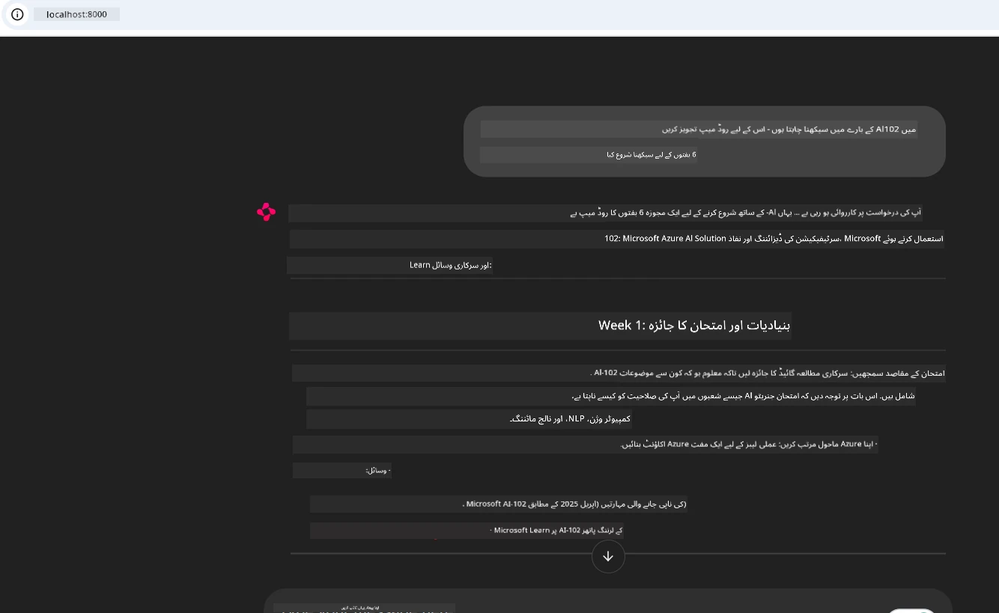

# کیس اسٹڈی: کلائنٹ سے Microsoft Learn Docs MCP سرور سے کنیکٹ ہونا

کبھی آپ نے خود کو دستاویزی سائٹس، اسٹیک اوور فلو، اور لامتناہی سرچ انجن ٹیبز کے درمیان جھولتا پایا ہے، جب کہ آپ اپنی کوڈ میں کسی مسئلے کو حل کرنے کی کوشش کر رہے ہوں؟ شاید آپ کے پاس دستاویزات کے لیے ایک دوسرا مانیٹر ہوتا ہے، یا آپ براؤزر اور اپنے آئی ڈی ای کے درمیان بار بار آلٹ-ٹیب کرتے رہتے ہیں۔ کیا یہ بہتر نہیں ہوگا اگر آپ دستاویزات کو سیدھا اپنے ورک فلو میں لا سکیں — اپنے ایپس، اپنے IDE، یا یہاں تک کہ اپنے ذاتی کسٹم ٹولز میں انٹیگریٹ کر کے؟ اس کیس اسٹڈی میں، ہم ٹھیک یہی کریں گے: اپنے کلائنٹ ایپلیکیشن سے براہ راست Microsoft Learn Docs MCP سرور سے کنیکٹ کرنے کا طریقہ۔

## جائزہ

جدید ترقی صرف کوڈ لکھنا نہیں بلکہ درست وقت پر درست معلومات تلاش کرنا ہے۔ دستاویزات ہر جگہ ہیں، لیکن شاذ و نادر ہی وہیں جہاں آپ کو سب سے زیادہ ضرورت ہوتی ہے: آپ کے ٹولز اور ورک فلو کے اندر۔ دستاویزات کو براہ راست اپنی ایپلیکیشنز میں مربوط کر کے، آپ وقت بچا سکتے ہیں، سیاق و سباق کی تبدیلی کو کم کر سکتے ہیں، اور پیداواریت کو بڑھا سکتے ہیں۔ اس سیکشن میں، ہم آپ کو دکھائیں گے کہ کس طرح کلائنٹ کو Microsoft Learn Docs MCP سرور سے جوڑ کر، آپ ایپ کو چھوڑے بغیر ریئل ٹائم، سیاق و سباق سے آگاہ دستاویزات تک رسائی حاصل کر سکتے ہیں۔

ہم کنیکشن قائم کرنے، درخواست بھیجنے، اور اسٹریمنگ جوابات کو مؤثر طریقے سے سنبھالنے کے عمل سے گزریں گے۔ یہ طریقہ آپ کے ورک فلو کو آسان بناتا ہے اور اسمارٹ، زیادہ مددگار ڈویلپر ٹولز بنانے کے دروازے کھولتا ہے۔

## سیکھنے کے مقاصد

ہم یہ کیوں کر رہے ہیں؟ کیونکہ بہترین ڈویلپر تجربات وہ ہوتے ہیں جو رکاوٹیں دور کرتے ہیں۔ تصور کریں ایک ایسی دنیا جہاں آپ کا کوڈ ایڈیٹر، چیٹ بوٹ، یا ویب ایپ دستاویزات کے سوالات فوری طور پر Microsoft Learn کے تازہ ترین مواد کے ذریعے جواب دے سکے۔ اس باب کے آخر تک، آپ جان جائیں گے کہ کیسے:

- MCP سرور-کلائنٹ مواصلات کی بنیادی باتیں دستاویزات کے لیے سمجھیں
- Microsoft Learn Docs MCP سرور سے کنیکٹ کرنے کے لیے کنسول یا ویب ایپلیکیشن کو نافذ کریں
- ریئل ٹائم دستاویزات کے لیے سٹریمنگ HTTP کلائنٹس استعمال کریں
- اپنی ایپ میں دستاویزی جوابات کو لاگ اور سمجھیں

آپ دیکھیں گے کہ یہ مہارتیں آپ کو ایسے ٹولز بنانے میں مدد دیتی ہیں جو صرف ردعمل والے نہیں بلکہ واقعی انٹرایکٹو اور سیاق و سباق سے آگاہ ہوں۔

## منظرنامہ 1 - MCP کے ساتھ ریئل ٹائم دستاویزات کی وصولی

اس منظرنامے میں، ہم آپ کو دکھائیں گے کہ کیسے ایک کلائنٹ کو Microsoft Learn Docs MCP سرور سے جوڑیں تاکہ آپ ایپ کو چھوڑے بغیر ریئل ٹائم، سیاق و سباق سے آگاہ دستاویزات تک رسائی حاصل کر سکیں۔

آئیے اسے عملی طور پر کریں۔ آپ کا کام ایک ایسی ایپ لکھنا ہے جو Microsoft Learn Docs MCP سرور سے کنیکٹ ہو، `microsoft_docs_search` ٹول کو کال کرے، اور اسٹریمنگ جوابات کو کنسول میں لاگ کرے۔

### یہ طریقہ کیوں؟
کیونکہ یہ مزید جدید انٹیگریشنز بنانے کی بنیاد ہے — چاہے آپ چیٹ بوٹ، IDE ایکسٹینشن، یا ویب ڈیش بورڈ چلانا چاہتے ہوں۔

آپ کو اس منظر نامے کا کوڈ اور ہدایات اس کیس اسٹڈی کے [`solution`](./solution/README.md) فولڈر میں ملیں گی۔ یہ مراحل آپ کو کنیکشن قائم کرنے کے لیے راہنمائی کریں گے:
- سرکاری MCP SDK اور سٹریمنگ HTTP کلائنٹ استعمال کریں
- `microsoft_docs_search` ٹول کو کوئری پیرامیٹر کے ساتھ کال کریں تاکہ دستاویزات حاصل ہو سکیں
- مناسب لاگنگ اور ایرر ہینڈلنگ نافذ کریں
- صارفین کو متعدد تلاش کیوئز داخل کرنے کی اجازت دینے کے لیے انٹرایکٹو کنسول انٹرفیس بنائیں

یہ منظر نامہ دکھاتا ہے کہ کیسے:
- Docs MCP سرور سے کنیکٹ کریں
- کوئری بھیجیں
- نتائج کو پارس اور پرنٹ کریں

یہاں حل چلانے کیسا دکھ سکتا ہے:

```
Prompt> What is Azure Key Vault?
Answer> Azure Key Vault is a cloud service for securely storing and accessing secrets. ...
```

نیچے ایک مختصر نمونہ حل پیش کیا گیا ہے۔ مکمل کوڈ اور تفصیلات solution فولڈر میں دستیاب ہیں۔

<details>
<summary>Python</summary>

```python
import asyncio
from mcp.client.streamable_http import streamablehttp_client
from mcp import ClientSession

async def main():
    async with streamablehttp_client("https://learn.microsoft.com/api/mcp") as (read_stream, write_stream, _):
        async with ClientSession(read_stream, write_stream) as session:
            await session.initialize()
            result = await session.call_tool("microsoft_docs_search", {"query": "Azure Functions best practices"})
            print(result.content)

if __name__ == "__main__":
    asyncio.run(main())
```

- مکمل ایمپلیمنٹیشن اور لاگنگ کے لیے دیکھیں [`scenario1.py`](../../../../09-CaseStudy/docs-mcp/solution/python/scenario1.py)۔
- انسٹالیشن اور استعمال کی ہدایات کے لیے دیکھیں [`README.md`](./solution/python/README.md) فائل فولڈر میں۔
</details>


## منظرنامہ 2 - MCP کے ساتھ انٹرایکٹو سٹڈی پلان جنریٹر ویب ایپ

اس منظر نامے میں، آپ سیکھیں گے کہ Docs MCP کو ویب ڈویلپمنٹ پراجیکٹ میں کیسے انٹیگریٹ کیا جائے۔ مقصد یہ ہے کہ صارفین Microsoft Learn دستاویزات کو براہ راست ویب انٹرفیس سے تلاش کر سکیں، جس سے دستاویزات فوری طور پر آپ کی ایپ یا سائٹ میں دستیاب ہوں۔

آپ سیکھیں گے کہ کیسے:
- ایک ویب ایپ سیٹ اپ کریں
- Docs MCP سرور سے کنیکٹ کریں
- یوزر ان پٹ سنبھالیں اور نتائج دکھائیں

یہاں حل چلانے کا انداز کچھ یوں ہو سکتا ہے:

```
User> I want to learn about AI102 - so suggest the roadmap to get it started from learn for 6 weeks

Assistant> Here’s a detailed 6-week roadmap to start your preparation for the AI-102: Designing and Implementing a Microsoft Azure AI Solution certification, using official Microsoft resources and focusing on exam skills areas:

---
## Week 1: Introduction & Fundamentals
- **Understand the Exam**: Review the [AI-102 exam skills outline](https://learn.microsoft.com/en-us/credentials/certifications/exams/ai-102/).
- **Set up Azure**: Sign up for a free Azure account if you don't have one.
- **Learning Path**: [Introduction to Azure AI services](https://learn.microsoft.com/en-us/training/modules/intro-to-azure-ai/)
- **Focus**: Get familiar with Azure portal, AI capabilities, and necessary tools.

....more weeks of the roadmap...

Let me know if you want module-specific recommendations or need more customized weekly tasks!
```

نیچے ایک مختصر نمونہ حل پیش کیا گیا ہے۔ مکمل کوڈ اور تفصیلات solution فولڈر میں دستیاب ہیں۔



<details>
<summary>Python (Chainlit)</summary>

Chainlit گفتگویی AI ویب ایپس بنانے کے لیے فریم ورک ہے۔ یہ انٹرایکٹو چیٹ بوٹس اور اسسٹنٹس بنانا آسان بناتا ہے جو MCP ٹولز کو کال کر کے ریئل ٹائم نتائج دکھاتے ہیں۔ یہ تیز پروٹوٹائپنگ اور صارف دوست انٹرفیس کے لیے مثالی ہے۔

```python
import chainlit as cl
import requests

MCP_URL = "https://learn.microsoft.com/api/mcp"

@cl.on_message
def handle_message(message):
    query = {"question": message}
    response = requests.post(MCP_URL, json=query)
    if response.ok:
        result = response.json()
        cl.Message(content=result.get("answer", "No answer found.")).send()
    else:
        cl.Message(content="Error: " + response.text).send()
```

- مکمل ایمپلیمنٹیشن کے لیے دیکھیں [`scenario2.py`](../../../../09-CaseStudy/docs-mcp/solution/python/scenario2.py)۔
- سیٹ اپ اور چلانے کی ہدایات کے لیے دیکھیں [`README.md`](./solution/python/README.md)۔
</details>


## منظرنامہ 3: VS Code میں MCP سرور کے ساتھ ان-ایڈیٹر دستاویزات

اگر آپ چاہیں کہ Microsoft Learn Docs براہ راست VS Code میں ہوں (براؤزر ٹیبز تبدیل کیے بغیر)، تو آپ اپنے ایڈیٹر میں MCP سرور استعمال کر سکتے ہیں۔ اس سے آپ یہ کر سکتے ہیں:
- VS Code میں دستاویزات تلاش اور پڑھنا بغیر کوڈنگ ماحول چھوڑے۔
- دستاویزات کا حوالہ دینا اور لنکس کو براہ راست README یا کورس فائلز میں شامل کرنا۔
- GitHub Copilot اور MCP کو ملاتے ہوئے ایک آسان، AI سے چلنے والے دستاویز ورک فلو سے فائدہ اٹھانا۔

**آپ سیکھیں گے کہ:**
- اپنی ورک اسپیس روٹ میں ایک درست `.vscode/mcp.json` فائل کیسے شامل کریں (نیچے مثال دیکھیں)۔
- MCP پینل کھولیں یا VS Code میں کمانڈ پیلیٹ استعمال کر کے دستاویزات تلاش کریں اور شامل کریں۔
- کام کے دوران اپنے مارک ڈاؤن فائلز میں دستاویزات کا سیدھا حوالہ دیں۔
- GitHub Copilot کے ساتھ اس ورک فلو کو ملا کر پیداواریت کو مزید بڑھائیں۔

یہاں MCP سرور کو VS Code میں سیٹ اپ کرنے کی ایک مثال ہے:

```json
{
  "servers": {
    "LearnDocsMCP": {
      "url": "https://learn.microsoft.com/api/mcp"
    }
  }
}
```

</details>

> اسکرین شاٹس اور مرحلہ وار گائیڈ کے ساتھ تفصیلی واک تھرو کے لیے دیکھیں [`README.md`](./solution/scenario3/README.md)۔


یہ طریقہ ان لوگوں کے لیے مثالی ہے جو تکنیکی کورسز بنا رہے ہیں، دستاویزات لکھ رہے ہیں، یا کثرت سے حوالہ جات کے ساتھ کوڈ ڈیولپ کر رہے ہیں۔

## اہم نکات

دستاویزات کو براہ راست اپنے ٹولز میں شامل کرنا صرف سہولت نہیں بلکہ پیداواریت میں ایک گیم چینجر ہے۔ Microsoft Learn Docs MCP سرور سے اپنے کلائنٹ کو کنیکٹ کر کے، آپ:

- اپنے کوڈ اور دستاویزات کے درمیان سیاق و سباق کی تبدیلی ختم کر سکتے ہیں
- تازہ ترین، سیاق و سباق سے آگاہ دستاویزات ریئل ٹائم میں حاصل کر سکتے ہیں
- زیادہ اسمارٹ، زیادہ انٹرایکٹو ڈویلپر ٹولز بنا سکتے ہیں

یہ مہارتیں آپ کو ایسے حل بنانے میں مدد دیں گی جو نہ صرف مؤثر بلکہ استعمال میں خوشگوار بھی ہوں۔

## اضافی وسائل

اپنی سمجھ کو گہرا کرنے کے لیے، ان سرکاری وسائل کو دیکھیں:

- [Microsoft Learn Docs MCP Server (GitHub)](https://github.com/MicrosoftDocs/mcp)
- [Azure MCP Server کے ساتھ شروع کریں (mcp-python)](https://learn.microsoft.com/en-us/azure/developer/azure-mcp-server/get-started#create-the-python-app)
- [Azure MCP Server کیا ہے؟](https://learn.microsoft.com/en-us/azure/developer/azure-mcp-server/)
- [Model Context Protocol (MCP) تعارف](https://modelcontextprotocol.io/introduction)
- [MCP سرور سے پلگ ان شامل کریں (Python)](https://learn.microsoft.com/en-us/semantic-kernel/concepts/plugins/adding-mcp-plugins)

## اس کے بعد کیا ہے

- واپس جائیں: [کیس اسٹڈیز کا جائزہ](../README.md)
- جاری رکھیں: [ماڈیول 10: AI ورک فلو کو AI ٹول کِٹ کے ساتھ آسان بنانا](../../10-StreamliningAIWorkflowsBuildingAnMCPServerWithAIToolkit/README.md)

---

<!-- CO-OP TRANSLATOR DISCLAIMER START -->
**ڈس کلیمر**:  
اس دستاویز کا ترجمہ AI ترجمہ سروس [Co-op Translator](https://github.com/Azure/co-op-translator) کے ذریعے کیا گیا ہے۔ ہم درستگی کے لیے کوشش کرتے ہیں، لیکن براہ کرم آگاہ رہیں کہ خودکار ترجمے میں غلطیاں یا عدم صحت ہو سکتی ہے۔ اصل دستاویز اپنی مادری زبان میں ہی معتبر ماخذ سمجھی جانی چاہیے۔ اہم معلومات کے لیے پیشہ ور انسانی ترجمہ تجویز کیا جاتا ہے۔ اس ترجمے کے استعمال سے پیدا ہونے والی کسی بھی غلط فہمی یا غلط تشریح کی ذمہ داری ہم قبول نہیں کرتے۔
<!-- CO-OP TRANSLATOR DISCLAIMER END -->