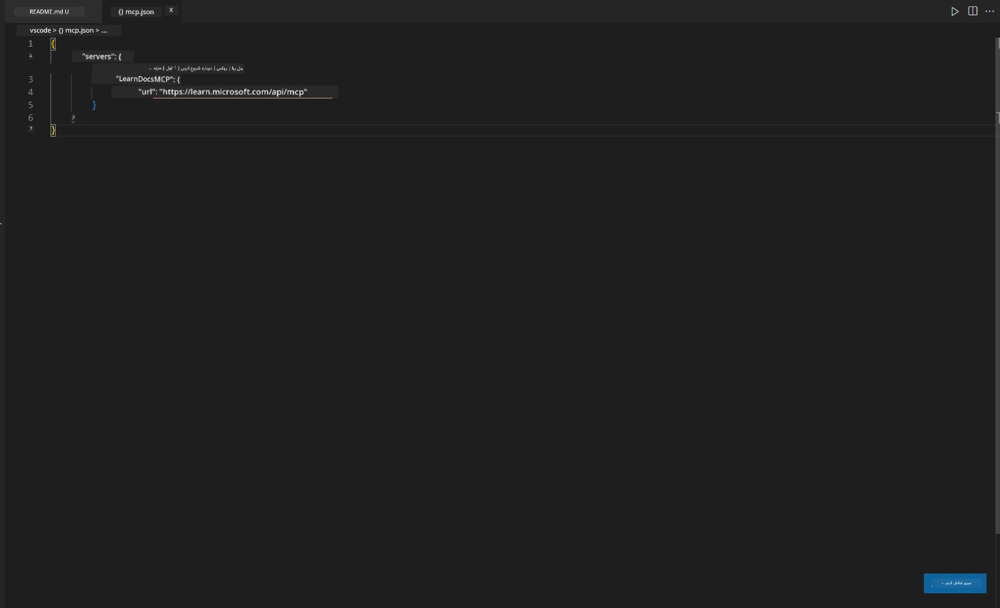
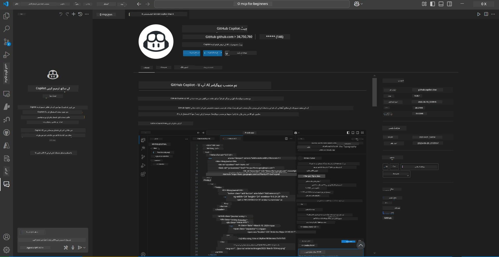
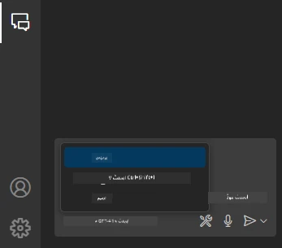
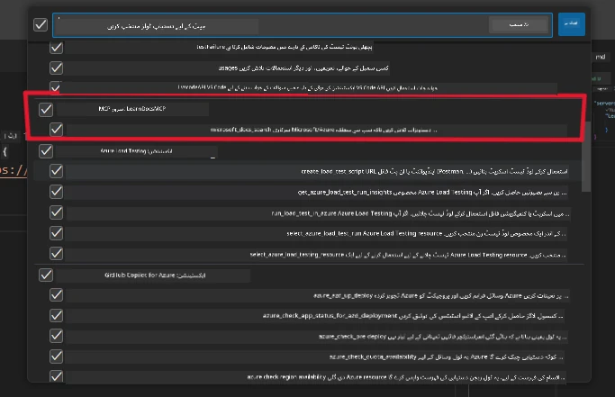
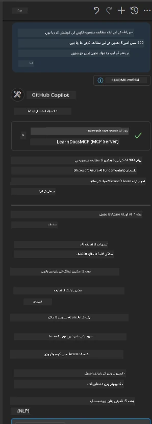
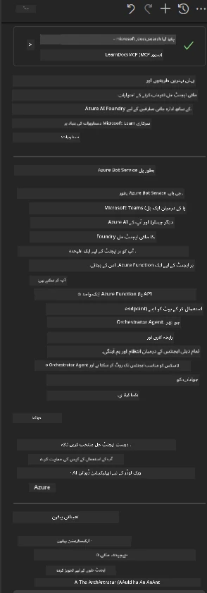

# منظر نامہ 3: VS Code میں MCP سرور کے ساتھ ان-ایڈیٹر دستاویزات

## جائزہ

اس منظر نامے میں، آپ سیکھیں گے کہ Microsoft Learn Docs کو MCP سرور کے ذریعے براہ راست اپنے Visual Studio Code ماحول میں کیسے لایا جائے۔ بار بار براؤزر کے ٹیبز تبدیل کرنے کی بجائے، آپ اپنے ایڈیٹر کے اندر ہی سرکاری دستاویزات تک رسائی، تلاش اور حوالہ دے سکتے ہیں۔ یہ طریقہ کار آپ کے ورک فلو کو آسان بناتا ہے، آپ کی توجہ برقرار رکھتا ہے، اور GitHub Copilot جیسے ٹولز کے ساتھ بے جوڑ انضمام ممکن بناتا ہے۔

- VS Code کے اندر ہی دستاویزات تلاش کریں اور پڑھیں بغیر کوڈنگ ماحول چھوڑے۔
- دستاویزات کا حوالہ دیں اور لنکس براہ راست اپنے README یا کورس فائلوں میں شامل کریں۔
- GitHub Copilot اور MCP کو ایک ساتھ استعمال کریں تاکہ ایک ہموار، AI سے چلنے والا دستاویزاتی ورک فلو حاصل ہو۔

## سیکھنے کے مقاصد

اس باب کے اختتام تک، آپ سمجھ جائیں گے کہ VS Code میں MCP سرور کو کیسے سیٹ اپ اور استعمال کیا جائے تاکہ آپ کی دستاویزات اور ترقیاتی ورک فلو کو بہتر بنایا جا سکے۔ آپ قابل ہوں گے کہ:

- اپنے ورک اسپیس کو MCP سرور کے ذریعے دستاویزات کی تلاش کے لیے ترتیب دیں۔
- VS Code کے اندر سے براہ راست دستاویزات تلاش کریں اور شامل کریں۔
- GitHub Copilot اور MCP کی طاقت کو ملا کر ایک زیادہ موثر، AI سے مدد یافتہ ورک فلو بنائیں۔

یہ مہارتیں آپ کو توجہ مرکوز رکھنے، دستاویزات کے معیار کو بہتر بنانے، اور بطور ڈویلپر یا تکنیکی مصنف اپنی پیداواریت بڑھانے میں مدد دیں گی۔

## حل

ان-ایڈیٹر دستاویزات تک رسائی حاصل کرنے کے لیے، آپ ایک سلسلہ وار اقدامات پر عمل کریں گے جو MCP سرور کو VS Code اور GitHub Copilot کے ساتھ مربوط کرتے ہیں۔ یہ حل کورس مصنفین، دستاویزات لکھنے والوں، اور ڈویلپرز کے لیے مثالی ہے جو ایڈیٹر میں اپنی توجہ برقرار رکھتے ہوئے docs اور Copilot کے ساتھ کام کرنا چاہتے ہیں۔

- کورس یا پروجیکٹ کی دستاویزات لکھتے ہوئے README میں جلدی سے حوالہ جاتی لنکس شامل کریں۔
- کوڈ بنانے کے لیے Copilot استعمال کریں اور MCP کے ذریعے فوری طور پر متعلقہ دستاویزات تلاش کریں اور حوالہ دیں۔
- اپنے ایڈیٹر میں توجہ مرکوز رکھیں اور پیداواریت بڑھائیں۔

### مرحلہ وار رہنمائی

شروع کرنے کے لیے، ان مراحل پر عمل کریں۔ ہر مرحلے کے لیے، آپ assets فولڈر سے اسکرین شاٹ شامل کر سکتے ہیں تاکہ عمل کو بصری طور پر واضح کیا جا سکے۔

1. **MCP کنفیگریشن شامل کریں:**
   اپنے پروجیکٹ کے روٹ میں `.vscode/mcp.json` فائل بنائیں اور درج ذیل کنفیگریشن شامل کریں:
   ```json
   {
     "servers": {
       "LearnDocsMCP": {
         "url": "https://learn.microsoft.com/api/mcp"
       }
     }
   }
   ```
   یہ کنفیگریشن VS Code کو بتاتی ہے کہ [`Microsoft Learn Docs MCP server`](https://github.com/MicrosoftDocs/mcp) سے کیسے کنیکٹ ہونا ہے۔
   
   
    
2. **GitHub Copilot Chat پینل کھولیں:**
   اگر آپ کے پاس GitHub Copilot ایکسٹینشن انسٹال نہیں ہے، تو VS Code میں Extensions ویو پر جائیں اور اسے انسٹال کریں۔ آپ اسے براہ راست [Visual Studio Code Marketplace](https://marketplace.visualstudio.com/items?itemName=GitHub.copilot-chat) سے ڈاؤن لوڈ کر سکتے ہیں۔ پھر، سائیڈبار سے Copilot Chat پینل کھولیں۔

   

3. **ایجنٹ موڈ فعال کریں اور ٹولز کی تصدیق کریں:**
   Copilot Chat پینل میں ایجنٹ موڈ کو فعال کریں۔

   

   ایجنٹ موڈ فعال کرنے کے بعد، تصدیق کریں کہ MCP سرور دستیاب ٹولز میں شامل ہے۔ اس سے یہ یقینی بنتا ہے کہ Copilot ایجنٹ دستاویزات کے سرور تک رسائی حاصل کر کے متعلقہ معلومات لا سکتا ہے۔
   
   

4. **نیا چیٹ شروع کریں اور ایجنٹ کو ہدایت دیں:**
   Copilot Chat پینل میں نیا چیٹ کھولیں۔ اب آپ ایجنٹ کو اپنی دستاویزی سوالات دے سکتے ہیں۔ ایجنٹ MCP سرور کا استعمال کرتے ہوئے متعلقہ Microsoft Learn دستاویزات براہ راست آپ کے ایڈیٹر میں لائے گا۔

   - *"میں موضوع X کے لیے ایک مطالعہ منصوبہ لکھنے کی کوشش کر رہا ہوں۔ میں اسے 8 ہفتوں تک پڑھوں گا، ہر ہفتے کے لیے مواد تجویز کریں جو مجھے لینا چاہیے۔"*

   

5. **لائیو سوالات:**

   > آئیے Azure AI Foundry Discord کے [#get-help](https://discord.gg/D6cRhjHWSC) سیکشن سے ایک لائیو سوال لیتے ہیں ([اصل پیغام دیکھیں](https://discord.com/channels/1113626258182504448/1385498306720829572)):
   
   *"میں Azure AI Foundry پر تیار کردہ AI ایجنٹس کے ساتھ ایک ملٹی ایجنٹ حل کی تعیناتی کے بارے میں جوابات تلاش کر رہا ہوں۔ میں دیکھ رہا ہوں کہ کوئی براہ راست تعیناتی کا طریقہ نہیں ہے، جیسے Copilot Studio چینلز۔ تو، انٹرپرائز صارفین کے لیے یہ تعیناتی مختلف طریقے کیا ہیں تاکہ وہ بات چیت کر سکیں اور کام مکمل کر سکیں؟
کئی مضامین/بلاگز موجود ہیں جو کہتے ہیں کہ ہم Azure Bot سروس استعمال کر سکتے ہیں جو MS Teams اور Azure AI Foundry Agents کے درمیان پل کا کام کرے گا، کیا یہ کام کرے گا اگر میں Azure bot سیٹ اپ کروں جو Azure AI Foundry کے Orchestrator Agent سے Azure function کے ذریعے جڑتا ہو، یا مجھے ہر AI ایجنٹ کے لیے Azure function بنانا ہوگا جو ملٹی ایجنٹ حل کا حصہ ہو تاکہ Bot framework پر آرکیسٹریشن کی جا سکے؟ کوئی اور تجاویز بھی خوش آمدید ہیں۔"*

   

   ایجنٹ متعلقہ دستاویزی لنکس اور خلاصے کے ساتھ جواب دے گا، جنہیں آپ براہ راست اپنے مارک ڈاؤن فائلوں میں شامل کر سکتے ہیں یا اپنے کوڈ میں حوالہ کے طور پر استعمال کر سکتے ہیں۔
   
### نمونہ سوالات

یہاں کچھ مثالیں دی گئی ہیں جنہیں آپ آزما سکتے ہیں۔ یہ سوالات دکھائیں گے کہ MCP سرور اور Copilot کس طرح مل کر فوری، سیاق و سباق سے آگاہ دستاویزات اور حوالہ جات فراہم کر سکتے ہیں بغیر VS Code چھوڑے:

- "مجھے دکھائیں کہ Azure Functions triggers کیسے استعمال کیے جاتے ہیں۔"
- "Azure Key Vault کی سرکاری دستاویزات کا لنک شامل کریں۔"
- "Azure وسائل کو محفوظ بنانے کے بہترین طریقے کیا ہیں؟"
- "Azure AI خدمات کے لیے کوئی quickstart تلاش کریں۔"

یہ سوالات دکھائیں گے کہ MCP سرور اور Copilot کس طرح مل کر فوری، سیاق و سباق سے آگاہ دستاویزات اور حوالہ جات فراہم کر سکتے ہیں بغیر VS Code چھوڑے۔

---

**دستخطی نوٹ**:  
یہ دستاویز AI ترجمہ سروس [Co-op Translator](https://github.com/Azure/co-op-translator) کے ذریعے ترجمہ کی گئی ہے۔ اگرچہ ہم درستگی کے لیے کوشاں ہیں، براہ کرم آگاہ رہیں کہ خودکار ترجمے میں غلطیاں یا عدم درستیاں ہو سکتی ہیں۔ اصل دستاویز اپنی مادری زبان میں ہی معتبر ماخذ سمجھی جانی چاہیے۔ اہم معلومات کے لیے پیشہ ور انسانی ترجمہ کی سفارش کی جاتی ہے۔ اس ترجمے کے استعمال سے پیدا ہونے والی کسی بھی غلط فہمی یا غلط تشریح کی ذمہ داری ہم پر عائد نہیں ہوتی۔