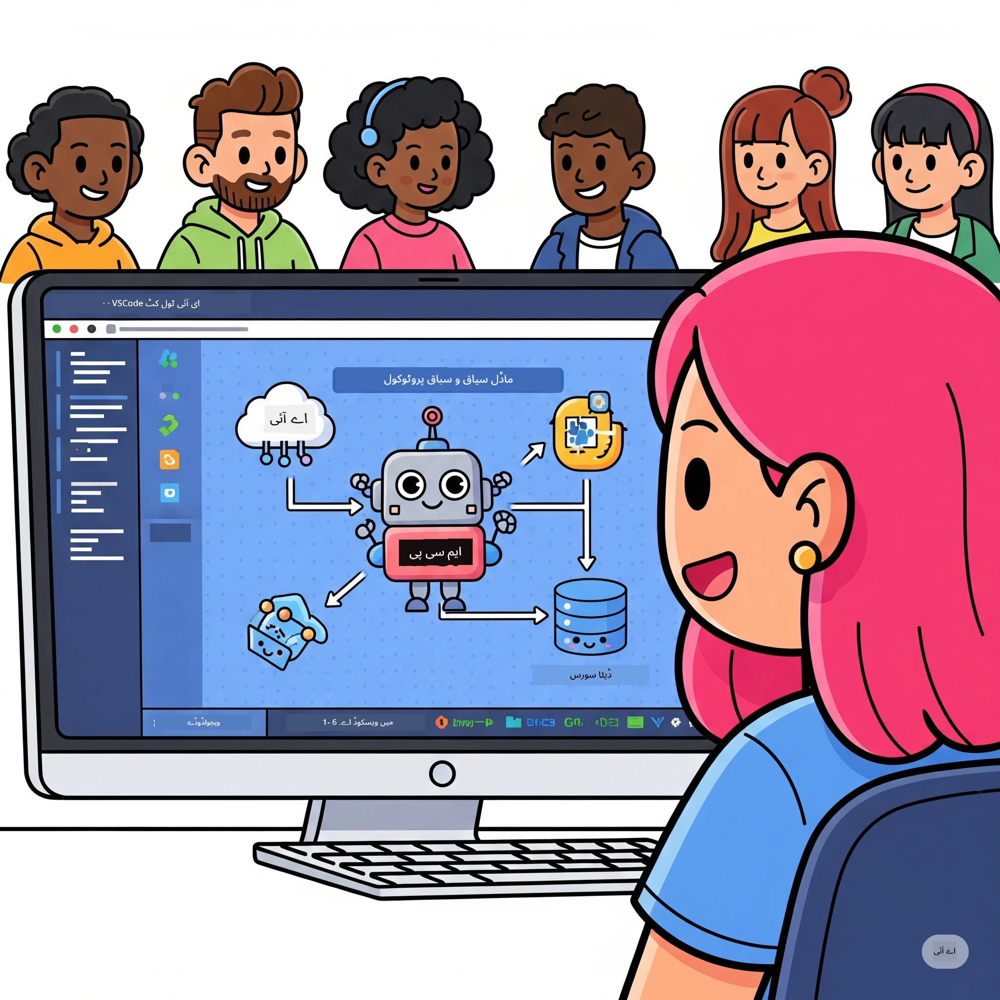
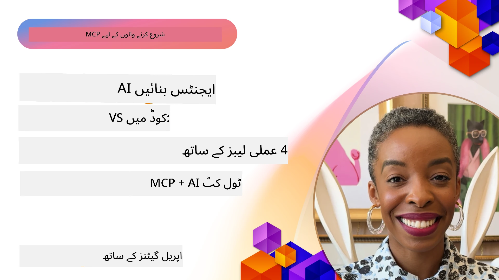

# اے آئی ورک فلو کو ہموار کرنا: اے آئی ٹول کٹ کے ساتھ MCP سرور بنانا

## 🎯 جائزہ

_(اس سبق کی ویڈیو دیکھنے کے لیے اوپر تصویر پر کلک کریں)_

خوش آمدید **ماڈل کانٹیکسٹ پروٹوکول (MCP) ورکشاپ** میں! یہ مکمل عملی ورکشاپ دو جدید ترین ٹیکنالوجیز کو ملا کر AI ایپلیکیشن کی تیاری میں انقلاب لاتی ہے:

- **🔗 ماڈل کانٹیکسٹ پروٹوکول (MCP)**: AI ٹولز کی مربوطی کے لیے ایک کھلا معیار  
- **🛠️ اے آئی ٹول کٹ برائے ویژول اسٹوڈیو کوڈ (AITK)**: مائیکروسافٹ کا طاقتور AI ڈیولپمنٹ ایکسٹینشن

### 🎓 آپ کیا سیکھیں گے

اس ورکشاپ کے آخر تک، آپ ذہین ایپلیکیشنز بنانے کا فن سیکھ جائیں گے جو AI ماڈلز کو حقیقی دنیا کے ٹولز اور خدمات کے ساتھ مربوط کرتے ہیں۔ خودکار جانچ سے لے کر کسٹم API انٹیگریشن تک، آپ پیچیدہ کاروباری مسائل حل کرنے کی عملی مہارتیں حاصل کریں گے۔

## 🏗️ ٹیکنالوجی اسٹیک

### 🔌 ماڈل کانٹیکسٹ پروٹوکول (MCP)

MCP ہے **"AI کے لیے USB-C"** — ایک یونیورسل معیار جو AI ماڈلز کو بیرونی ٹولز اور ڈیٹا ذرائع سے جوڑتا ہے۔

**✨ اہم خصوصیات:**

- 🔄 **معیاری انٹیگریشن**: AI ٹول کنکشنز کے لیے یونیورسل انٹرفیس  
- 🏛️ **لچکدار معماری**: لوکل اور ریموٹ سرورز stdio/SSE ٹرانسپورٹ کے ذریعے  
- 🧰 **اسی نظام کا خزانہ**: ایک پروٹوکول میں ٹولز، پرامپٹس، اور وسائل  
- 🔒 **انٹرپرائز کے لیے تیار**: بلٹ ان سیکیورٹی اور بھروسہ مندی

**🎯 MCP کیوں اہم ہے:**
جیسا کہ USB-C نے کیبل کی الجھن ختم کی، MCP AI انٹیگریشن کی پیچیدگی ختم کرتا ہے۔ ایک پروٹوکول، لامحدود امکانات۔

### 🤖 ویژول اسٹوڈیو کوڈ کے لیے اے آئی ٹول کٹ (AITK)

مائیکروسافٹ کا فلیگ شپ AI ڈیولپمنٹ ایکسٹینشن، جو VS کوڈ کو AI پاور ہاؤس میں تبدیل کرتا ہے۔

**🚀 بنیادی صلاحیتیں:**

- 📦 **ماڈل کیٹلاگ**: Azure AI، GitHub، Hugging Face، Ollama سے ماڈلز تک رسائی  
- ⚡ **لوکل انفرنس**: ONNX-آپٹیمائزڈ CPU/GPU/NPU اجرا  
- 🏗️ **ایجنٹ بلڈر**: MCP انٹیگریشن کے ساتھ بصری AI ایجنٹ کی ترقی  
- 🎭 **کثیر الوضعیہ**: متن، وژن، اور ساخت شدہ آؤٹ پٹ سپورٹ

**💡 ترقی کے فائدے:**

- زیرو کنفیگر ماڈل ڈپلائمنٹ  
- بصری پرامپٹ انجینئرنگ  
- حقیقی وقت کی جانچ کے لیے پلے گراونڈ  
- بغیر کسی رکاوٹ کے MCP سرور انٹیگریشن

## 📚 سیکھنے کا سفر

### [🚀 ماڈیول 1: اے آئی ٹول کٹ کی بنیادی باتیں](./lab1/README.md)

**دورانیہ**: 15 منٹ

- 🛠️ AI ٹول کٹ کو VS کوڈ کے لیے انسٹال اور ترتیب دیں  
- 🗂️ ماڈل کیٹلاگ دریافت کریں (GitHub، ONNX، OpenAI، Anthropic، Google کے 100+ ماڈلز)  
- 🎮 ماڈل کی حقیقی وقت جانچ کے لیے انٹریکٹو پلے گراونڈ میں مہارت حاصل کریں  
- 🤖 Agent Builder سے اپنا پہلا AI ایجنٹ تیار کریں  
- 📊 بلٹ ان میٹرکس کے ذریعے ماڈل کی کارکردگی کا جائزہ لیں (F1، مناسبت، مشابہت، ہم آہنگی)  
- ⚡ بیچ پروسیسنگ اور کثیر الوضعیہ سپورٹ کی صلاحیتیں سیکھیں

**🎯 سیکھنے کا نتیجہ**: AITK کی صلاحیتوں کے مکمل فہم کے ساتھ ایک فعال AI ایجنٹ بنائیں

### [🌐 ماڈیول 2: MCP کے ساتھ اے آئی ٹول کٹ کی بنیادی باتیں](./lab2/README.md)

**دورانیہ**: 20 منٹ

- 🧠 ماڈل کانٹیکسٹ پروٹوکول (MCP) کی معماری اور تصورات میں مہارت حاصل کریں  
- 🌐 مائیکروسافٹ کے MCP سرور کے ماحولیاتی نظام کو دریافت کریں  
- 🤖 Playwright MCP سرور کا استعمال کرتے ہوئے براؤزر آٹومیشن ایجنٹ بنائیں  
- 🔧 MCP سرورز کو AI ٹول کٹ Agent Builder کے ساتھ مربوط کریں  
- 📊 اپنے ایجنٹس میں MCP ٹولز کو ترتیب دیں اور جانچیں  
- 🚀 MCP سے لیس ایجنٹس کو پروڈکشن کے لیے ایکسپورٹ اور تعینات کریں

**🎯 سیکھنے کا نتیجہ**: MCP کے ذریعے بیرونی ٹولز سے لیس AI ایجنٹ تعینات کریں

### [🔧 ماڈیول 3: اے آئی ٹول کٹ کے ساتھ جدید MCP ترقی](./lab3/README.md)

**دورانیہ**: 20 منٹ

- 💻 AI ٹول کٹ کا استعمال کرتے ہوئے کسٹم MCP سرورز بنائیں  
- 🐍 جدید MCP Python SDK (v1.9.3) کو ترتیب دیں اور استعمال کریں  
- 🔍 ڈیبگنگ کے لیے MCP Inspector سیٹ اپ کریں اور استعمال کریں  
- 🛠️ پیشہ ورانہ ڈیبگنگ ورک فلو کے ساتھ ایک Weather MCP Server بنائیں  
- 🧪 Agent Builder اور Inspector دونوں ماحول میں MCP سرورز کو ڈیبگ کریں

**🎯 سیکھنے کا نتیجہ**: جدید ٹولز کے ذریعے کسٹم MCP سرورز تیار اور ڈیبگ کریں

### [🐙 ماڈیول 4: عملی MCP ترقی - کسٹم GitHub کلون سرور](./lab4/README.md)

**دورانیہ**: 30 منٹ

- 🏗️ حقیقی دنیا کے لیے GitHub Clone MCP Server ڈیولپ کریں جو ورک فلو کو آسان بنائے  
- 🔄 اسمارٹ ریپوزٹری کلوننگ کو تصدیق اور ایرر ہینڈلنگ کے ساتھ نافذ کریں  
- 📁 ذہین ڈائریکٹری مینجمنٹ اور VS کوڈ انٹیگریشن تیار کریں  
- 🤖 GitHub Copilot Agent Mode کو کسٹم MCP ٹولز کے ساتھ استعمال کریں  
- 🛡️ پروڈکشن کے لیے تیار قابل اعتماد اور کراس پلیٹ فارم کمپٹیبلٹی اپنائیں

**🎯 سیکھنے کا نتیجہ**: ایک پروڈکشن کے لیے تیار MCP سرور تعینات کریں جو حقیقی ترقیاتی ورک فلو کو آسان بنائے

## 💡 حقیقی دنیا کی ایپلیکیشنز اور اثرات

### 🏢 انٹرپرائز کے استعمال کے کیسز

#### 🔄 ڈیولپمنٹ آپریشنز آٹومیشن

اپنے ڈیولپمنٹ ورک فلو کو ذہین آٹومیشن کے ساتھ بہتر بنائیں:

- **سمارٹ ریپوزٹری مینجمنٹ**: AI سے چلنے والا کوڈ جائزہ اور مرج فیصلے  
- **ذہین CI/CD**: کوڈ تبدیلیوں کی بنیاد پر خودکار پائپ لائن بہتر سازی  
- **مسئلہ ٹریاژ**: خودکار بگ کی درجہ بندی اور اسائنمنٹ

#### 🧪 کوالٹی ایشورنس میں انقلاب

AI سے چلنے والی آٹومیشن کے ساتھ جانچ کو بلند کریں:

- **ذہین ٹیسٹ جنریشن**: خودکار تفصیلی ٹیسٹ سویٹس تیار کریں  
- **بصری رجریشن ٹیسٹنگ**: AI سے چلنے والی UI تبدیلیوں کا پتہ لگانا  
- **کارکردگی کی نگرانی**: مسائل کی پیشگی نشاندہی اور حل

#### 📊 ڈیٹا پائپ لائن انٹیلی جنس

ذہین ڈیٹا پراسیسنگ ورک فلو بنائیں:

- **ایڈاپٹو ETL پروسیسز**: خود کو بہتر بنانے والے ڈیٹا ٹرانسفارمیشنز  
- **اینوملی ڈیٹیکشن**: حقیقی وقت میں ڈیٹا معیار کی نگرانی  
- **ذہین راستہ سازی**: سمارٹ ڈیٹا فلو مینجمنٹ

#### 🎧 کسٹمر تجربہ بہتر بنانا

بہترین کسٹمر انٹریکشنز تخلیق کریں:

- **سیاق و سباق سے آگاہ سپورٹ**: کسٹمر کی تاریخ تک رسائی رکھنے والے AI ایجنٹس  
- **مسئلہ حل کرنے والی پیشگی سہولت**: پیشگوئی پر مبنی کسٹمر سروس  
- **کثیر چینل انٹیگریشن**: مختلف پلیٹ فارمز پر متحد AI تجربہ

## 🛠️ پیشگی درکاریاں اور سیٹ اپ

### 💻 سسٹم کی ضروریات

| جزو | ضرورت | نوٹس |
|-----------|-------------|-------|
| **آپریٹنگ سسٹم** | Windows 10+, macOS 10.15+, Linux | کوئی بھی جدید OS |
| **ویژول اسٹوڈیو کوڈ** | تازہ ترین مستحکم ورژن | AITK کے لیے ضروری |
| **Node.js** | v18.0+ اور npm | MCP سرور ڈیولپمنٹ کے لیے |
| **Python** | 3.10+ | Python MCP سرورز کے لیے اختیاری |
| **میموری** | کم از کم 8GB RAM | لوکل ماڈلز کے لیے 16GB تجویز کردہ |

### 🔧 ترقیاتی ماحول

#### سفارش کردہ VS Code ایکسٹینشنز

- **AI Toolkit** (ms-windows-ai-studio.windows-ai-studio)  
- **Python** (ms-python.python)  
- **Python Debugger** (ms-python.debugpy)  
- **GitHub Copilot** (GitHub.copilot) - اختیاری مگر مددگار

#### اختیاری ٹولز

- **uv**: جدید Python پیکج مینیجر  
- **MCP Inspector**: MCP سرورز کے لیے بصری ڈیبگنگ ٹول  
- **Playwright**: ویب آٹومیشن مثالوں کے لیے

## 🎖️ سیکھنے کے نتائج اور سرٹیفیکیشن کا راستہ

### 🏆 مہارت کی مکمل جانچ

اس ورکشاپ کو مکمل کر کے، آپ مندرجہ ذیل مہارتیں حاصل کریں گے:

#### 🎯 بنیادی مہارتیں

- [ ] **MCP پروٹوکول کی مہارت**: معماری اور نفاذ کے نمونوں کی گہری سمجھ  
- [ ] **AITK کی مہارت**: AI ٹول کٹ کا ماہر سطح کا استعمال برائے تیز تر ترقی  
- [ ] **کسٹم سرور کی ترقی**: پروڈکشن MCP سرورز کی تعمیر، تعیناتی، اور دیکھ بھال  
- [ ] **ٹول انٹیگریشن کی برتری**: AI کو موجودہ ڈیولپمنٹ ورک فلو کے ساتھ بغیر رکاوٹ منسلک کرنا  
- [ ] **مسئلہ حل کرنے کی درخواست**: سیکھی گئی مہارتیں حقیقی کاروباری چیلنجز پر لاگو کرنا

#### 🔧 تکنیکی مہارتیں

- [ ] VS کوڈ میں AI ٹول کٹ کا سیٹ اپ اور ترتیب  
- [ ] کسٹم MCP سرورز کا ڈیزائن اور نفاذ  
- [ ] GitHub ماڈلز کو MCP معماری کے ساتھ انٹیگریٹ کریں  
- [ ] Playwright کے ساتھ خودکار جانچ ورک فلو بنائیں  
- [ ] AI ایجنٹس کو پروڈکشن کے لیے تعینات کریں  
- [ ] MCP سرور کے کارکردگی کی جانچ اور اصلاح کریں

#### 🚀 اعلیٰ صلاحیتیں

- [ ] انٹرپرائز سکیل AI انٹیگریشنز کی معماری  
- [ ] AI ایپلیکیشنز کے لیے سیکیورٹی کی بہترین عملی طریقے نافذ کریں  
- [ ] MCP سرور کی سکال ایبل آرکیٹیکچرز کی ڈیزائننگ  
- [ ] مخصوص شعبوں کے لیے کسٹم ٹول چینز بنائیں  
- [ ] دوسروں کو AI-نیٹو ترقی میں رہنمائی فراہم کریں

## 📖 اضافی وسائل

- [MCP Specification (2025-11-25)](https://spec.modelcontextprotocol.io/specification/2025-11-25/)
- [AI Toolkit GitHub Repository](https://github.com/microsoft/vscode-ai-toolkit)
- [Sample MCP Servers Collection](https://github.com/modelcontextprotocol/servers)
- [Best Practices Guide](https://modelcontextprotocol.io/docs/best-practices)
- [OWASP MCP Top 10](https://microsoft.github.io/mcp-azure-security-guide/mcp/) - سیکیورٹی کی بہترین عملی تدابیر

---

**🚀 کیا آپ اپنے AI ترقیاتی ورک فلو میں انقلاب لانا چاہتے ہیں؟**

آئیے MCP اور AI Toolkit کے ساتھ مل کر ذہین ایپلیکیشنز کے مستقبل کی تعمیر کریں!

## اگلا کیا ہے

جاری رکھیں: [ماڈیول 11: MCP سرور ہینڈز آن لیبز](../11-MCPServerHandsOnLabs/README.md)

---

<!-- CO-OP TRANSLATOR DISCLAIMER START -->
**دستبرداری**:
یہ دستاویز AI ترجمہ سروس [Co-op Translator](https://github.com/Azure/co-op-translator) کے ذریعے ترجمہ کی گئی ہے۔ اگرچہ ہم درستگی کی کوشش کرتے ہیں، براہ کرم اس بات سے آگاہ رہیں کہ خودکار تراجم میں غلطیاں یا عدم صحت ہو سکتی ہے۔ اصل دستاویز اپنی مادری زبان میں معتبر ماخذ سمجھی جانی چاہیے۔ اہم معلومات کے لیے پیشہ ور انسانی ترجمہ کی سفارش کی جاتی ہے۔ ہم اس ترجمہ کے استعمال سے پیدا ہونے والی کسی بھی غلط فہمی یا غلط تشریح کے لیے ذمہ دار نہیں ہیں۔
<!-- CO-OP TRANSLATOR DISCLAIMER END -->