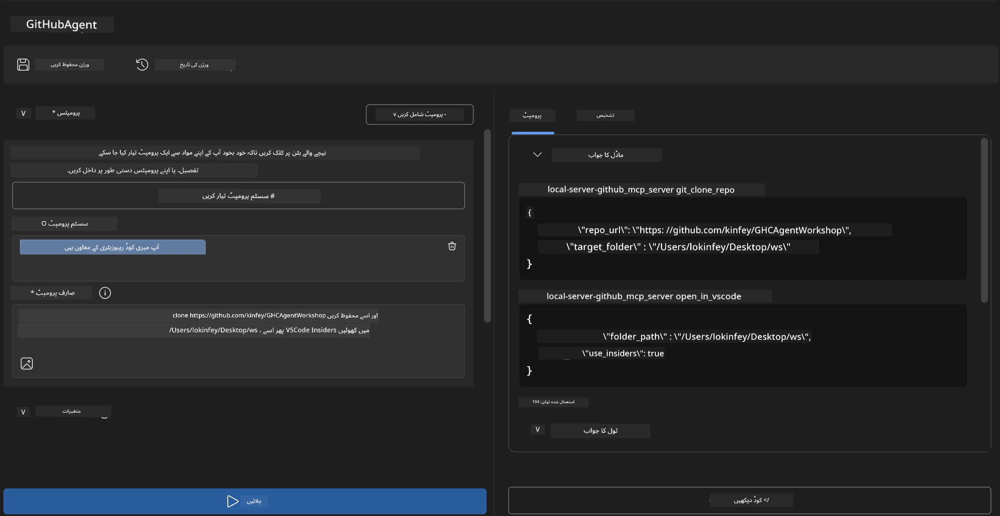
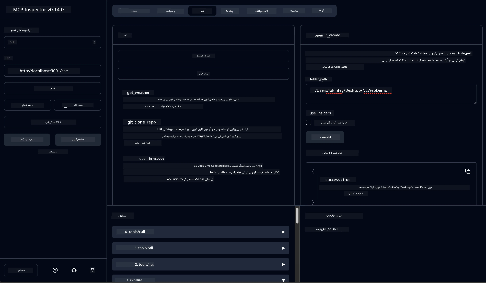

# 🐙 ماڈیول 4: عملی MCP ترقی - کسٹم GitHub کلون سرور


> **⚡ فوری آغاز کریں:** صرف 30 منٹ میں ایک پیداواری MCP سرور بنائیں جو خودکار طریقے سے GitHub ریپوزٹری کلوننگ اور VS Code انٹیگریشن کرتا ہے!

## 🎯 سیکھنے کے مقاصد

اس لیب کے اختتام تک، آپ قابل ہوں گے:

- ✅ حقیقی دنیا کی ترقیاتی ورک فلو کے لیے کسٹم MCP سرور بنائیں
- ✅ MCP کے ذریعے GitHub ریپوزٹری کلوننگ کی فعالیت نافذ کریں
- ✅ کسٹم MCP سرورز کو VS Code اور Agent Builder کے ساتھ انٹیگریٹ کریں
- ✅ کسٹم MCP اوزار کے ساتھ GitHub Copilot ایجنٹ موڈ استعمال کریں
- ✅ پیداواری ماحول میں کسٹم MCP سرورز کی جانچ اور تعیناتی کریں

## 📋 بنیادی ضروریات

- لیبز 1-3 کا مکمل ہونا (MCP کے بنیادی اور پیش رفت ترقیاتی موضوعات)
- GitHub Copilot سبسکرپشن ([مفت سائن اپ دستیاب](https://github.com/github-copilot/signup))
- AI Toolkit اور GitHub Copilot کی توسیعات کے ساتھ VS Code
- Git CLI انسٹال اور ترتیب دیا ہوا

## 🏗️ پروجیکٹ کا جائزہ

### **حقیقی دنیا کا ترقیاتی چیلنج**  
ڈیولپرز کے طور پر، ہم اکثر GitHub پر ریپوزٹریز کلون کرتے ہیں اور انہیں VS Code یا VS Code Insiders میں کھولتے ہیں۔ یہ دستی عمل شامل ہے:  
1. ٹرمینل/کمانڈ پرامپٹ کھولنا  
2. مطلوبہ ڈائریکٹری تک جانا  
3. `git clone` کمانڈ چلانا  
4. کلون شدہ ڈائریکٹری میں VS Code کھولنا  

**ہمارا MCP حل اسے ایک ذہین کمانڈ میں آسان بناتا ہے!**

### **آپ کیا بنائیں گے**  
ایک **GitHub کلون MCP سرور** (`git_mcp_server`) جو فراہم کرے گا:

| خصوصیت | وضاحت | فائدہ |
|---------|-------------|---------|
| 🔄 **سمارٹ ریپوزٹری کلوننگ** | تصدیق کے ساتھ GitHub ریپوزٹریز کلون کریں | خودکار ایرر چیکنگ |
| 📁 **ذہین ڈائریکٹری مینجمنٹ** | ڈائریکٹریز کو محفوظ طریقے سے چیک کریں اور بنائیں | اوور رائٹنگ سے بچاؤ |
| 🚀 **کراس-پلیٹ فارم VS Code انٹیگریشن** | پروجیکٹس کو VS Code/Insiders میں کھولیں | بہ آسانی ورک فلو کا تبادلہ |
| 🛡️ **مضبوط ایرر ہینڈلنگ** | نیٹ ورک، اجازت اور راستہ کے مسائل سنبھالیں | پیداواری معیار کی بھروسہ مندی |

---

## 📖 قدم بہ قدم نفاذ

### مرحلہ 1: Agent Builder میں GitHub ایجنٹ بنائیں

1. AI Toolkit ایکسٹینشن کے ذریعے **Agent Builder لانچ کریں**  
2. مندرجہ ذیل کنفیگریشن کے ساتھ **نیا ایجنٹ بنائیں:**  
   ```
   Agent Name: GitHubAgent
   ```
  
3. **کسٹم MCP سرور شروع کریں:**  
   - **Tools** → **Add Tool** → **MCP Server** پر جائیں  
   - **"Create A new MCP Server"** منتخب کریں  
   - زیادہ لچک کے لیے **Python ٹیمپلیٹ** منتخب کریں  
   - **سرور کا نام:** `git_mcp_server`

### مرحلہ 2: GitHub Copilot ایجنٹ موڈ کو ترتیب دیں

1. VS Code میں **GitHub Copilot کھولیں** (Ctrl/Cmd + Shift + P → "GitHub Copilot: Open")  
2. Copilot انٹرفیس میں **ایجنٹ ماڈل منتخب کریں**  
3. بہتر استدلال کے لیے **Claude 3.7 ماڈل منتخب کریں**  
4. ٹول تک رسائی کے لیے **MCP انٹیگریشن فعال کریں**  

> **💡 پرو ٹپ:** Claude 3.7 ترقیاتی ورک فلو اور ایرر ہینڈلنگ کے پیٹرنز کو بہتر سمجھ فراہم کرتا ہے۔

### مرحلہ 3: مرکزی MCP سرور کی فعالیت نافذ کریں

**GitHub Copilot ایجنٹ موڈ کے ساتھ درج ذیل مفصل پرامپٹ استعمال کریں:**  

```
Create two MCP tools with the following comprehensive requirements:

🔧 TOOL A: clone_repository
Requirements:
- Clone any GitHub repository to a specified local folder
- Return the absolute path of the successfully cloned project
- Implement comprehensive validation:
  ✓ Check if target directory already exists (return error if exists)
  ✓ Validate GitHub URL format (https://github.com/user/repo)
  ✓ Verify git command availability (prompt installation if missing)
  ✓ Handle network connectivity issues
  ✓ Provide clear error messages for all failure scenarios

🚀 TOOL B: open_in_vscode
Requirements:
- Open specified folder in VS Code or VS Code Insiders
- Cross-platform compatibility (Windows/Linux/macOS)
- Use direct application launch (not terminal commands)
- Auto-detect available VS Code installations
- Handle cases where VS Code is not installed
- Provide user-friendly error messages

Additional Requirements:
- Follow MCP 1.9.3 best practices
- Include proper type hints and documentation
- Implement logging for debugging purposes
- Add input validation for all parameters
- Include comprehensive error handling
```
  
### مرحلہ 4: اپنے MCP سرور کی جانچ کریں

#### 4a. Agent Builder میں جانچ کریں

1. Agent Builder کے لیے **ڈیبگ کنفیگریشن شروع کریں**  
2. اس سسٹم پرامپٹ سے اپنے ایجنٹ کو ترتیب دیں:  

```
SYSTEM_PROMPT:
You are my intelligent coding repository assistant. You help developers efficiently clone GitHub repositories and set up their development environment. Always provide clear feedback about operations and handle errors gracefully.
```
  
3. حقیقی صارف کے حالات کے ساتھ جانچ کریں:  

```
USER_PROMPT EXAMPLES:

Scenario : Basic Clone and Open
"Clone {Your GitHub Repo link such as https://github.com/kinfey/GHCAgentWorkshop
 } and save to {The global path you specify}, then open it with VS Code Insiders"
```
  


**متوقع نتائج:**  
- ✅ کامیاب کلوننگ اور راستے کی تصدیق  
- ✅ خودکار VS Code لانچ  
- ✅ غلط حالات کے لیے واضح ایرر میسجز  
- ✅ ایج کیسز کی صحیح ہینڈلنگ  

#### 4b. MCP Inspector میں جانچ کریں



---

**🎉 مبارک ہو!** آپ نے کامیابی کے ساتھ ایک عملی، پیداواری MCP سرور بنایا ہے جو حقیقی ترقیاتی ورک فلو کے چیلنجز حل کرتا ہے۔ آپ کا کسٹم GitHub کلون سرور MCP کی طاقت کو ظاہر کرتا ہے جس سے ڈیولپر کی پیداواری میں خودکاری اور اضافہ ممکن ہوا۔

### 🏆 حاصلیاں:  
- ✅ **MCP ڈویلپر** - کسٹم MCP سرور بنایا  
- ✅ **ورک فلو آٹومیٹر** - ترقیاتی عمل کو آسان بنایا  
- ✅ **انٹیگریشن ایکسپرٹ** - متعدد ترقیاتی آلات کو جوڑا  
- ✅ **پیداواری تیاری** - دئیے جانے والے حل تیار کیے  

---

## 🎓 ورکشاپ مکمل: آپ کا سفر ماڈل کانٹیکسٹ پروٹوکول کے ساتھ

**محترم ورکشاپ شریک،**

ماڈل کانٹیکسٹ پروٹوکول ورکشاپ کے تمام چار ماڈیول مکمل کرنے پر مبارکباد! آپ نے بنیادی AI Toolkit کے تصورات سے لے کر پیداواری MCP سرور بنانے تک کا ایک طویل سفر طے کیا ہے جو حقیقی دنیا کے ترقیاتی چیلنجز حل کرتا ہے۔

### 🚀 آپ کے سیکھنے کا خلاصہ:

**[ماڈیول 1](../lab1/README.md):** آپ نے AI Toolkit کی بنیات، ماڈل ٹیسٹنگ، اور اپنا پہلا AI ایجنٹ بنانے سے آغاز کیا۔

**[ماڈیول 2](../lab2/README.md):** آپ نے MCP فن تعمیر سیکھی، Playwright MCP کو ضم کیا، اور اپنی پہلی براؤزر آٹومیشن ایجنٹ بنائی۔

**[ماڈیول 3](../lab3/README.md):** آپ نے کسٹم MCP سرورز ترقی دی، Weather MCP سرور بنایا، اور ڈیبگنگ ٹولز میں مہارت حاصل کی۔

**[ماڈیول 4](../lab4/README.md):** اب آپ نے عملی GitHub ریپوزٹری ورک فلو آٹومیشن ٹول بنایا ہے۔

### 🌟 آپ نے کیا مہارت حاصل کی:

- ✅ **AI Toolkit ماحولیاتی نظام:** ماڈلز، ایجنٹس، اور انٹیگریشن کے پیٹرنز  
- ✅ **MCP فن تعمیر:** کلائنٹ-سرور ڈیزائن، ٹرانسپورٹ پروٹوکولز، اور سیکیورٹی  
- ✅ **ڈویلپر ٹولز:** Playground سے Inspector تک اور پیداواری تعیناتی  
- ✅ **کسٹم ترقی:** اپنے MCP سرورز بنانا، جانچنا، اور تعینات کرنا  
- ✅ **عملی اطلاقات:** AI کے ذریعے حقیقی ورک فلو کے چیلنجز حل کرنا  

### 🔮 اگلے قدم:

1. **اپنا MCP سرور بنائیں:** اپنی مخصوص ورک فلو خودکار بنانے کیلئے یہ مہارتیں استعمال کریں  
2. **MCP کمیونٹی میں شامل ہوں:** اپنی تخلیقات شیئر کریں اور دوسروں سے سیکھیں  
3. **اعلیٰ درجے کی انٹیگریشن دریافت کریں:** MCP سرورز کو انٹرپرائز سسٹمز کے ساتھ جوڑیں  
4. **اوپن سورس میں تعاون کریں:** MCP ٹولنگ اور دستاویزات بہتر بنانے میں مدد کریں  

یاد رکھیں، یہ ورکشاپ صرف آغاز ہے۔ ماڈل کانٹیکسٹ پروٹوکول ماحولیاتی نظام تیزی سے ترقی کر رہا ہے اور آپ اب AI پر مبنی ترقیاتی آلات کی قیادت کرنے کے لیے تیار ہیں۔

**آپ کی شرکت اور سیکھنے کے جذبے کا شکریہ!**

ہم امید کرتے ہیں کہ اس ورکشاپ نے ایسے خیالات جنم دیے ہیں جو آپ کی ترقیاتی سفر میں AI اوزار کے ساتھ کام کرنے کے انداز کو بدل دیں گے۔

**خوش کوڈنگ!**

---

## اگلا کیا ہے

ماڈیول 10 کی تمام لیبز مکمل کرنے پر مبارک ہو!

- واپس جائیں: [ماڈیول 10 کا جائزہ](../README.md)  
- جاری رکھیں: [ماڈیول 11: MCP سرور ہینڈز آن لیبز](../../11-MCPServerHandsOnLabs/README.md)

---

<!-- CO-OP TRANSLATOR DISCLAIMER START -->
**ڈس کلیمر**:  
یہ دستاویز AI ترجمے کی سروس [Co-op Translator](https://github.com/Azure/co-op-translator) کے ذریعے ترجمہ کی گئی ہے۔ اگرچہ ہم درستگی کے لئے کوشش کرتے ہیں، براہ کرم یہ بات ذہن میں رکھیں کہ خودکار ترجمے میں غلطیاں یا خامیاں ہو سکتی ہیں۔ اصل دستاویز اپنی مادری زبان میں ہی مستند ماخذ سمجھی جائے۔ اہم معلومات کے لیے پیشہ ور انسانی ترجمہ تجویز کیا جاتا ہے۔ اس ترجمے کے استعمال سے پیدا ہونے والی کسی بھی غلط فہمی یا غلط تشریحات کی ذمہ داری ہم پر عائد نہیں ہوتی۔
<!-- CO-OP TRANSLATOR DISCLAIMER END -->