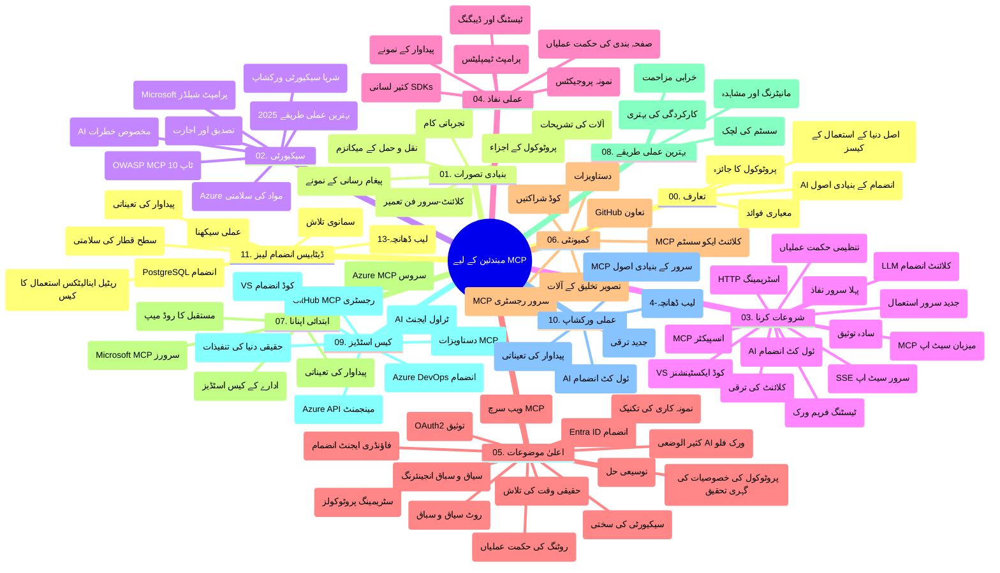

# ماڈل کانٹیکسٹ پروٹوکول (MCP) برائے ابتدائی افراد - مطالعہ گائیڈ

یہ مطالعہ گائیڈ "ماڈل کانٹیکسٹ پروٹوکول (MCP) برائے ابتدائی افراد" نصاب کے لیے ریپوزیٹری کے ڈھانچے اور مواد کا جائزہ فراہم کرتی ہے۔ اس گائیڈ کا استعمال کرتے ہوئے ریپوزیٹری میں مؤثر طریقے سے نیویگیٹ کریں اور دستیاب وسائل کا زیادہ سے زیادہ فائدہ اٹھائیں۔

## ریپوزیٹری کا جائزہ

ماڈل کانٹیکسٹ پروٹوکول (MCP) اے آئی ماڈلز اور کلائنٹ ایپلیکیشنز کے درمیان تعاملات کے لیے ایک معیاری فریم ورک ہے۔ ابتدا میں اینتھروپک کی جانب سے تخلیق کیا گیا، MCP اب وسیع MCP کمیونٹی کی جانب سے سرکاری GitHub آرگنائزیشن کے تحت برقرار رکھا جاتا ہے۔ یہ ریپوزیٹری سی شارپ، جاوا، جاوا اسکرپٹ، پائتھون، اور ٹائپ اسکرپٹ میں عملی کوڈ مثالوں کے ساتھ ایک جامع نصاب فراہم کرتی ہے، جو AI ڈویلپرز، سسٹم آرکیٹیکٹس، اور سافٹ ویئر انجینئرز کے لیے ڈیزائن کیا گیا ہے۔

## بصری نصابی نقشہ

## ریپوزیٹری کا ڈھانچہ

ریپوزیٹری کو گیارہ بنیادی سیکشنز میں منظم کیا گیا ہے، جو MCP کے مختلف پہلوؤں پر مرکوز ہیں:

1. **تعارف (00-Introduction/)**
   - ماڈل کانٹیکسٹ پروٹوکول کا جائزہ
   - AI پائپ لائنز میں معیاری بنانے کی اہمیت
   - عملی استعمال کے کیسز اور فوائد

2. **بنیادی تصورات (01-CoreConcepts/)**
   - کلائنٹ-سرور آرکیٹیکچر
   - پروٹوکول کے کلیدی اجزاء
   - MCP میں پیغام رسانی کے پیٹرنز

3. **سیکیورٹی (02-Security/)**
   - MCP پر مبنی نظاموں میں حفاظتی خطرات
   - تنفیذات کو محفوظ بنانے کے بہترین طریقے
   - توثیق اور اجازت کے حکمت عملی
   - **جامع سیکیورٹی دستاویزات**:
     - MCP سیکیورٹی بہترین طریقے 2025
     - Azure مواد کی حفاظت کا نفاذی گائیڈ
     - MCP سیکیورٹی کنٹرولز اور تکنیکس
     - MCP بہترین طریقے فوری حوالہ
   - **اہم سیکیورٹی موضوعات**:
     - پرامپٹ انجیکشن اور ٹول زہر آلودگی کے حملے
     - سیشن ہائی جیکنگ اور کنفیوزڈ ڈیپٹی کے مسائل
     - ٹوکن پاس تھرو کی کمزوریاں
     - ضرورت سے زیادہ اجازتیں اور رسائی کنٹرول
     - AI اجزاء کی سپلائی چین سیکیورٹی
     - مائیکروسافٹ پرامپٹ شیلڈز انٹیگریشن

4. **شروع کرنا (03-GettingStarted/)**
   - ماحول کی ترتیب اور کنفیگریشن
   - بنیادی MCP سرورز اور کلائنٹس کی تخلیق
   - موجودہ اطلاقات کے ساتھ انضمام
   - شامل سیکشنز:
     - پہلا سرور تنفیذ
     - کلائنٹ ڈویلپمنٹ
     - LLM کلائنٹ انٹیگریشن
     - VS کوڈ انٹیگریشن
     - سرور-سینٹ ایونٹس (SSE) سرور
     - ایڈوانس سرور استعمال
     - HTTP اسٹریمنگ
     - AI ٹول کٹ انٹیگریشن
     - ٹیسٹنگ حکمت عملیاں
     - تعیناتی کے رہنما خطوط

5. **عملی تنفیذ (04-PracticalImplementation/)**
   - مختلف پروگرامنگ زبانوں میں SDKs کا استعمال
   - ڈیبگنگ، ٹیسٹنگ، اور توثیق کی تکنیکس
   - دوبارہ قابل استعمال پرامپٹ ٹیمپلیٹس اور ورک فلو تیار کرنا
   - تنفیذ کی مثالوں کے ساتھ نمونہ پروجیکٹس

6. **جدید موضوعات (05-AdvancedTopics/)**
   - کانٹیکسٹ انجینئرنگ تکنیکس
   - فاؤنڈری ایجنٹ انٹیگریشن
   - کثیر الوضع AI ورک فلو
   - OAuth2 توثیق ڈیموز
   - حقیقی وقت تلاش کی صلاحیتیں
   - حقیقی وقت اسٹریمنگ
   - روٹ کانٹیکسٹس کی تنفیذ
   - راؤٹنگ کی حکمت عملیاں
   - سیمپلنگ تکنیکس
   - اسکیلنگ طریقے
   - سیکیورٹی خیالات
   - Entra ID سیکیورٹی انٹیگریشن
   - ویب سرچ انٹیگریشن

7. **کمیونٹی تعاون (06-CommunityContributions/)**
   - کوڈ اور دستاویزات میں تعاون کیسے کریں
   - GitHub کے ذریعے تعاون
   - کمیونٹی کی طرف سے چلائے گئے بہتری اور آراء
   - مختلف MCP کلائنٹس کا استعمال (Claude Desktop, Cline, VSCode)
   - مقبول MCP سرورز کے ساتھ کام کرنا بشمول امیج جنریشن

8. **ابتدائی اختیار کے اسباق (07-LessonsfromEarlyAdoption/)**
   - حقیقی دنیا کی تنفیذات اور کامیابی کی کہانیاں
   - MCP پر مبنی حل بنانا اور تعینات کرنا
   - رجحانات اور مستقبل کا روڈ میپ
   - **مائیکروسافٹ MCP سرورز گائیڈ**: دس پروڈکشن-ریڈی مائیکروسافٹ MCP سرورز کا جامع گائیڈ بشمول:
     - Microsoft Learn Docs MCP Server
     - Azure MCP Server (15+ خصوصی کنیکٹرز)
     - GitHub MCP Server
     - Azure DevOps MCP Server
     - MarkItDown MCP Server
     - SQL Server MCP Server
     - Playwright MCP Server
     - Dev Box MCP Server
     - Azure AI Foundry MCP Server
     - Microsoft 365 Agents Toolkit MCP Server

9. **بہترین طریقے (08-BestPractices/)**
   - کارکردگی کی بہتری اور آپٹیمائزیشن
   - خرابی برداشت کرنے والے MCP سسٹمز کی ڈیزائننگ
   - ٹیسٹنگ اور لچک کی حکمت عملیاں

10. **کیس اسٹڈیز (09-CaseStudy/)**
    - **سات جامع کیس اسٹڈیز** جو MCP کی کثیر الجہتی کو مختلف منظرناموں میں ظاہر کرتی ہیں:
    - **Azure AI ٹریول ایجنٹس**: Azure OpenAI اور AI سرچ کے ساتھ کثیر ایجنٹ آرکسٹریشن
    - **Azure DevOps انٹیگریشن**: YouTube ڈیٹا اپڈیٹس کے ساتھ ورک فلو کے عمل کو خودکار بنانا
    - **حقیقی وقت دستاویزات کی بازیابی**: پائتھون کنسول کلائنٹ بمع اسٹریمنگ HTTP
    - **انٹرایکٹو اسٹڈی پلان جنریٹر**: Chainlit ویب ایپ بمع محاوری AI
    - **ایڈیٹر میں دستاویزات**: VS کوڈ انٹیگریشن بمع GitHub Copilot ورک فلو
    - **Azure API مینجمنٹ**: MCP سرور بنانے کے ساتھ انٹرپرائز API انٹیگریشن
    - **GitHub MCP رجسٹری**: ماحولیاتی نظام کی ترقی اور ایجنٹیک انٹیگریشن پلیٹ فارم
    - انٹرپرائز انٹیگریشن، ڈویلپر پیداواریت، اور ماحولیاتی نظام کی ترقی کے تنفیذی مثالیں

11. **عملی ورکشاپ (10-StreamliningAIWorkflowsBuildingAnMCPServerWithAIToolkit/)**
    - MCP اور AI ٹول کٹ کا جامع عملی ورکشاپ
    - ذہین ایپلیکیشنز کی تعمیر جو AI ماڈلز کو حقیقی دنیا کے اوزار سے مربوط کرتی ہیں
    - بنیادی باتوں، کسٹم سرور ڈویلپمنٹ، اور پروڈکشن تعیناتی حکمت عملیوں پر عملی ماڈیولز
    - **لیب ڈھانچہ**:
      - لیب 1: MCP سرور کی بنیادی باتیں
      - لیب 2: ایڈوانس MCP سرور ڈویلپمنٹ
      - لیب 3: AI ٹول کٹ انٹیگریشن
      - لیب 4: پروڈکشن تعیناتی اور اسکیلنگ
    - مرحلہ وار ہدایات کے ساتھ لیب پر مبنی سیکھنے کا طریقہ

12. **MCP سرور ڈیٹا بیس انٹیگریشن لیبز (11-MCPServerHandsOnLabs/)**
    - **13 لیبز پر مشتمل جامع سیکھنے کا راستہ** جو PostgreSQL انٹیگریشن کے ساتھ پروڈکشن-ریڈی MCP سرورز بنانے کے لیے ہے
    - **حقیقی دنیا کی ریٹیل اینالیٹکس تنفیذ** Zava Retail کے استعمال کے ساتھ
    - **انٹرپرائز سطح کے پیٹرنز** بشمول رو لیول سیکیورٹی (RLS)، سیمانٹک سرچ، اور کثیر کرایہ دار ڈیٹا تک رسائی
    - **مکمل لیب کا ڈھانچہ**:
      - **لیب 00-03: بنیادیں** - تعارف، آرکیٹیکچر، سیکیورٹی، ماحول کی ترتیب
      - **لیب 04-06: MCP سرور کی تعمیر** - ڈیٹا بیس ڈیزائن، MCP سرور تنفیذ، ٹول کی ترقی
      - **لیب 07-09: جدید خصوصیات** - سیمانٹک سرچ، ٹیسٹنگ اور ڈیبگنگ، VS کوڈ انٹیگریشن
      - **لیب 10-12: پروڈکشن اور بہترین طریقے** - تعیناتی، مانیٹرنگ، آپٹیمائزیشن
    - **شامل تکنالوجیز**: FastMCP فریم ورک، PostgreSQL، Azure OpenAI، Azure Container Apps، Application Insights
    - **سیکھنے کے نتائج**: پروڈکشن-ریڈی MCP سرورز، ڈیٹا بیس انٹیگریشن پیٹرنز، AI سے چلنے والی اینالیٹکس، انٹرپرائز سیکیورٹی

## اضافی وسائل

ریپوزیٹری میں معاون وسائل شامل ہیں:

- **تصاویر فولڈر**: نصاب میں استعمال ہونے والے خاکے اور تصاویر پر مشتمل
- **ترجمے**: دستاویزات کے خودکار ترجمے کے ساتھ کثیر لسانی معاونت
- **سرکاری MCP وسائل**:
  - [MCP Documentation](https://modelcontextprotocol.io/)
  - [MCP Specification](https://spec.modelcontextprotocol.io/)
  - [MCP GitHub Repository](https://github.com/modelcontextprotocol)

## اس ریپوزیٹری کا استعمال کیسے کریں

1. **متسلسل سیکھنا**: مضامین کو ترتیب سے (00 سے 11 تک) پڑھیں تاکہ مربوط مطالعہ ہو۔
2. **زبان مخصوص توجہ**: اگر آپ کسی خاص پروگرامنگ زبان میں دلچسپی رکھتے ہیں تو اپنے پسندیدہ زبان کے لیے نمونہ ڈائریکٹریز کو دریافت کریں۔
3. **عملی تنفیذ**: "شروع کرنا" سیکشن سے آغاز کریں تاکہ ماحول سیٹ اپ کریں اور اپنا پہلا MCP سرور اور کلائنٹ بنائیں۔
4. **جدید دریافت**: بنیادی باتوں سے واقف ہونے کے بعد، جدید موضوعات میں داخل ہو کر اپنی معلومات بڑھائیں۔
5. **کمیونٹی میں شمولیت**: MCP کمیونٹی سے GitHub مباحثوں اور Discord چینلز کے ذریعے جڑیں تاکہ ماہرین اور ساتھی ڈویلپرز سے رابطہ قائم ہو۔

## MCP کلائنٹس اور ٹولز

نصاب مختلف MCP کلائنٹس اور ٹولز کا احاطہ کرتا ہے:

1. **سرکاری کلائنٹس**:
   - Visual Studio Code
   - MCP ان Visual Studio Code
   - Claude Desktop
   - VSCode میں Claude
   - Claude API

2. **کمیونٹی کلائنٹس**:
   - Cline (ٹرمینل پر مبنی)
   - Cursor (کوڈ ایڈیٹر)
   - ChatMCP
   - Windsurf

3. **MCP مینجمنٹ ٹولز**:
   - MCP CLI
   - MCP مینیجر
   - MCP لنکر
   - MCP راؤٹر

## مقبول MCP سرورز

ریپوزیٹری مختلف MCP سرورز متعارف کراتی ہے، بشمول:

1. **سرکاری مائیکروسافٹ MCP سرورز**:
   - Microsoft Learn Docs MCP Server
   - Azure MCP Server (15+ خصوصی کنیکٹرز)
   - GitHub MCP Server
   - Azure DevOps MCP Server
   - MarkItDown MCP Server
   - SQL Server MCP Server
   - Playwright MCP Server
   - Dev Box MCP Server
   - Azure AI Foundry MCP Server
   - Microsoft 365 Agents Toolkit MCP Server

2. **سرکاری حوالہ جات سرورز**:
   - فائل سسٹم
   - Fetch
   - میموری
   - ترتیب وار سوچ

3. **امیج جنریشن**:
   - Azure OpenAI DALL-E 3
   - Stable Diffusion WebUI
   - Replicate

4. **ڈویلپمنٹ ٹولز**:
   - Git MCP
   - ٹرمینل کنٹرول
   - کوڈ اسسٹنٹ

5. **خصوصی سرورز**:
   - Salesforce
   - Microsoft Teams
   - Jira اور Confluence

## تعاون

یہ ریپوزیٹری کمیونٹی سے تعاون کو خوش آمدید کہتی ہے۔ MCP ماحولیاتی نظام میں مؤثر تعاون کے لیے رہنمائی کے لیے کمیونٹی تعاون کے سیکشن کو دیکھیں۔

----

*یہ مطالعہ گائیڈ آخری بار 5 فروری، 2026 کو اپ ڈیٹ کی گئی تھی، جو تازہ ترین MCP Specification 2025-11-25 کو ظاہر کرتی ہے اور اس تاریخ تک ریپوزیٹری کا جائزہ فراہم کرتی ہے۔ اس تاریخ کے بعد ریپوزیٹری کا مواد اپ ڈیٹ کیا جا سکتا ہے۔*

---

<!-- CO-OP TRANSLATOR DISCLAIMER START -->
**دستاویزی اعلامیہ**:
اس دستاویز کا ترجمہ AI ترجمہ خدمات [Co-op Translator](https://github.com/Azure/co-op-translator) کے ذریعے کیا گیا ہے۔ اگرچہ ہم درستگی کے لیے کوشاں ہیں، براہ کرم یاد رکھیں کہ خودکار ترجمے میں غلطیاں یا عدم صحت ہو سکتی ہے۔ اصل دستاویز اپنی مادری زبان میں معتبر ذریعہ سمجھا جانا چاہیے۔ اہم معلومات کے لیے پیشہ ورانہ انسانی ترجمہ تجویز کیا جاتا ہے۔ اس ترجمے کے استعمال سے ہونے والی کسی بھی غلط فہمی یا غلط تشریح کی ذمہ داری ہم پر عائد نہیں ہوگی۔
<!-- CO-OP TRANSLATOR DISCLAIMER END -->