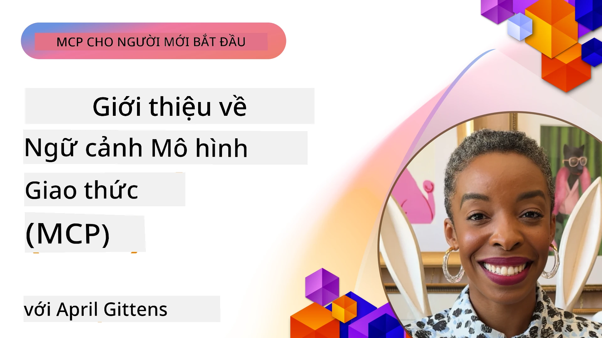
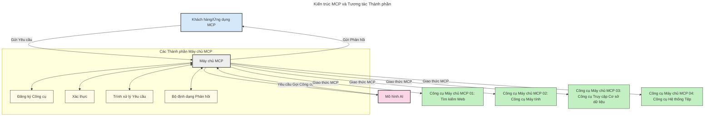

# Giới thiệu về Model Context Protocol (MCP): Tại sao nó quan trọng đối với các ứng dụng AI có khả năng mở rộng

[](https://youtu.be/agBbdiOPLQA)

_(Nhấn vào hình ảnh ở trên để xem video bài học này)_

Các ứng dụng AI tạo sinh là một bước tiến lớn khi cho phép người dùng tương tác với ứng dụng bằng các lệnh ngôn ngữ tự nhiên. Tuy nhiên, khi đầu tư nhiều thời gian và nguồn lực vào những ứng dụng như vậy, bạn sẽ muốn đảm bảo việc tích hợp các chức năng và tài nguyên một cách dễ dàng sao cho có thể mở rộng, ứng dụng của bạn có thể hỗ trợ nhiều hơn một mô hình và xử lý các đặc thù của từng mô hình. Nói ngắn gọn, xây dựng các ứng dụng AI tạo sinh ban đầu rất dễ, nhưng khi chúng phát triển và trở nên phức tạp hơn, bạn cần bắt đầu định nghĩa một kiến trúc và có thể phải dựa trên một tiêu chuẩn để đảm bảo các ứng dụng được xây dựng một cách nhất quán. Đó là nơi MCP xuất hiện để tổ chức và cung cấp một tiêu chuẩn.

---

## **🔍 Model Context Protocol (MCP) là gì?**

**Model Context Protocol (MCP)** là một **giao diện chuẩn mở** cho phép các Mô hình Ngôn ngữ Lớn (LLM) tương tác liền mạch với các công cụ bên ngoài, API và nguồn dữ liệu. Nó cung cấp một kiến trúc nhất quán nhằm nâng cao chức năng của mô hình AI vượt ra ngoài dữ liệu huấn luyện, cho phép các hệ thống AI thông minh, có khả năng mở rộng và phản hồi tốt hơn.

---

## **🎯 Tại sao tiêu chuẩn hóa trong AI lại quan trọng**

Khi các ứng dụng AI tạo sinh trở nên phức tạp hơn, việc áp dụng các tiêu chuẩn đảm bảo **khả năng mở rộng, khả năng mở rộng thêm, khả năng bảo trì** và **tránh bị khóa nhà cung cấp** là rất cần thiết. MCP đáp ứng các nhu cầu này bằng cách:

- Thống nhất các tích hợp mô hình-công cụ
- Giảm thiểu các giải pháp tùy chỉnh rời rạc, dễ vỡ
- Cho phép nhiều mô hình từ các nhà cung cấp khác nhau cùng tồn tại trong một hệ sinh thái

**Lưu ý:** Mặc dù MCP tự quảng cáo là tiêu chuẩn mở, không có kế hoạch chuẩn hóa MCP thông qua bất kỳ tổ chức tiêu chuẩn hiện có nào như IEEE, IETF, W3C, ISO hoặc các tổ chức tiêu chuẩn khác.

---

## **📚 Mục tiêu học tập**

Kết thúc bài viết này, bạn sẽ có thể:

- Định nghĩa **Model Context Protocol (MCP)** và các trường hợp sử dụng của nó
- Hiểu cách MCP chuẩn hóa giao tiếp giữa mô hình và công cụ
- Nhận diện các thành phần cốt lõi của kiến trúc MCP
- Khám phá các ứng dụng thực tế của MCP trong doanh nghiệp và môi trường phát triển

---

## **💡 Tại sao Model Context Protocol (MCP) là một bước đột phá**

### **🔗 MCP giải quyết phân mảnh trong tương tác AI**

Trước MCP, việc tích hợp mô hình với các công cụ đòi hỏi:

- Mã tùy chỉnh cho từng cặp công cụ-mô hình
- API không chuẩn hóa cho từng nhà cung cấp
- Thường xuyên bị gián đoạn do cập nhật
- Khả năng mở rộng kém khi thêm nhiều công cụ hơn

### **✅ Lợi ích của việc tiêu chuẩn hóa MCP**

| **Lợi ích**              | **Mô tả**                                                                |
|--------------------------|-------------------------------------------------------------------------|
| Tương tác liên hoạt      | LLM hoạt động liền mạch với các công cụ từ các nhà cung cấp khác nhau   |
| Tính nhất quán           | Hành vi đồng nhất trên các nền tảng và công cụ                           |
| Tính tái sử dụng         | Công cụ xây dựng một lần có thể dùng lại trong nhiều dự án và hệ thống  |
| Tăng tốc phát triển      | Giảm thời gian phát triển bằng cách sử dụng các giao diện chuẩn và có thể cắm-chơi |

---

## **🧱 Tổng quan kiến trúc MCP cấp cao**

MCP tuân theo **mô hình khách-chủ (client-server)**, trong đó:

- **MCP Hosts** chạy các mô hình AI
- **MCP Clients** khởi tạo các yêu cầu
- **MCP Servers** cung cấp bối cảnh, công cụ và khả năng

### **Các thành phần chính:**

- **Resources** – Dữ liệu tĩnh hoặc động cho các mô hình  
- **Prompts** – Các luồng công việc được định nghĩa sẵn để tạo nội dung có hướng dẫn  
- **Tools** – Các chức năng thực thi như tìm kiếm, tính toán  
- **Sampling** – Hành vi phân tác qua tương tác đệ quy
- **Elicitation** – Yêu cầu nhập dữ liệu do máy chủ khởi tạo
- **Roots** – Ranh giới hệ thống tập tin để kiểm soát truy cập máy chủ

### **Kiến trúc giao thức:**

MCP sử dụng kiến trúc hai lớp:
- **Lớp Dữ liệu**: Giao tiếp dựa trên JSON-RPC 2.0 với quản lý vòng đời và các nguyên thủy
- **Lớp Vận chuyển**: Các kênh giao tiếp STDIO (cục bộ) và HTTP có thể truyền trực tiếp với SSE (từ xa)

---

## Cách MCP Server hoạt động

MCP server hoạt động theo cách sau:

- **Luồng yêu cầu**:
    1. Yêu cầu được khởi tạo bởi người dùng cuối hoặc phần mềm hoạt động thay mặt họ.
    2. **MCP Client** gửi yêu cầu đến một **MCP Host**, là nơi quản lý runtime của mô hình AI.
    3. **Mô hình AI** nhận prompt từ người dùng và có thể yêu cầu truy cập công cụ hoặc dữ liệu bên ngoài qua một hoặc nhiều cuộc gọi công cụ.
    4. **MCP Host**, thay vì mô hình trực tiếp, sẽ liên lạc với **MCP Server(s)** phù hợp theo giao thức chuẩn hóa.
- **Chức năng MCP Host**:
    - **Đăng ký công cụ**: Duy trì danh mục các công cụ có sẵn và khả năng của chúng.
    - **Xác thực**: Xác minh quyền truy cập công cụ.
    - **Xử lý yêu cầu**: Xử lý các yêu cầu công cụ nhận được từ mô hình.
    - **Định dạng phản hồi**: Cấu trúc đầu ra công cụ theo định dạng mô hình có thể hiểu.
- **Thực thi MCP Server**:
    - **MCP Host** chuyển các cuộc gọi công cụ đến một hoặc nhiều **MCP Server**, mỗi server cung cấp các chức năng chuyên biệt (ví dụ: tìm kiếm, tính toán, truy vấn cơ sở dữ liệu).
    - **MCP Server** thực hiện các thao tác tương ứng và trả kết quả về cho **MCP Host** theo định dạng nhất quán.
    - **MCP Host** định dạng và chuyển tiếp kết quả này cho **Mô hình AI**.
- **Hoàn thành phản hồi**:
    - **Mô hình AI** tích hợp kết quả từ công cụ vào phản hồi cuối cùng.
    - **MCP Host** gửi phản hồi này trở lại **MCP Client**, để chuyển tới người dùng cuối hoặc phần mềm gọi.


## 👨‍💻 Cách xây dựng một MCP Server (kèm ví dụ)

MCP server cho phép bạn mở rộng khả năng của LLM bằng cách cung cấp dữ liệu và chức năng.

Sẵn sàng thử? Dưới đây là các SDK theo ngôn ngữ và/hoặc stack kèm ví dụ tạo các MCP server đơn giản với các ngôn ngữ/stack khác nhau:

- **Python SDK**: https://github.com/modelcontextprotocol/python-sdk

- **TypeScript SDK**: https://github.com/modelcontextprotocol/typescript-sdk

- **Java SDK**: https://github.com/modelcontextprotocol/java-sdk

- **C#/.NET SDK**: https://github.com/modelcontextprotocol/csharp-sdk


## 🌍 Các trường hợp sử dụng thực tế của MCP

MCP tạo điều kiện cho nhiều ứng dụng bằng cách mở rộng khả năng AI:

| **Ứng dụng**               | **Mô tả**                                                                                                       |
|----------------------------|----------------------------------------------------------------------------------------------------------------|
| Tích hợp dữ liệu doanh nghiệp| Kết nối LLM với cơ sở dữ liệu, CRM hoặc công cụ nội bộ                                                          |
| Hệ thống AI tự động         | Cho phép các đại lý tự động truy cập công cụ và các quy trình ra quyết định                                    |
| Ứng dụng đa phương thức     | Kết hợp công cụ văn bản, hình ảnh và âm thanh trong một ứng dụng AI duy nhất                                    |
| Tích hợp dữ liệu thời gian thực | Đưa dữ liệu trực tiếp vào giao tiếp AI để có kết quả chính xác và cập nhật hơn                                    |


### 🧠 MCP = Tiêu chuẩn phổ quát cho các tương tác AI

Model Context Protocol (MCP) hoạt động như một tiêu chuẩn phổ quát cho các tương tác AI, tương tự như cách USB-C chuẩn hóa kết nối vật lý cho các thiết bị. Trong thế giới AI, MCP cung cấp một giao diện nhất quán, cho phép các mô hình (khách hàng) tích hợp liền mạch với các công cụ và nhà cung cấp dữ liệu bên ngoài (máy chủ). Điều này loại bỏ nhu cầu về các giao thức đa dạng, tùy chỉnh cho từng API hoặc nguồn dữ liệu.

Dưới MCP, một công cụ tương thích MCP (gọi là MCP server) tuân theo một tiêu chuẩn thống nhất. Các server này có thể liệt kê các công cụ hoặc hành động mà họ cung cấp và thực thi các hành động này khi được một tác nhân AI yêu cầu. Các nền tảng tác nhân AI hỗ trợ MCP có thể khám phá các công cụ có sẵn từ các server và gọi chúng qua giao thức chuẩn này.

### 💡 Tạo điều kiện truy cập kiến thức

Ngoài việc cung cấp công cụ, MCP còn tạo điều kiện truy cập kiến thức. Nó cho phép các ứng dụng cung cấp bối cảnh cho các mô hình ngôn ngữ lớn (LLM) bằng cách liên kết chúng với nhiều nguồn dữ liệu khác nhau. Ví dụ, một MCP server có thể đại diện cho kho tài liệu của một công ty, cho phép các tác nhân lấy thông tin liên quan theo yêu cầu. Một server khác có thể xử lý các thao tác cụ thể như gửi email hoặc cập nhật hồ sơ. Từ góc nhìn của tác nhân, đây chỉ là những công cụ mà nó có thể sử dụng — một số công cụ trả về dữ liệu (bối cảnh kiến thức), trong khi các công cụ khác thực hiện hành động. MCP quản lý hiệu quả cả hai trường hợp này.

Một tác nhân kết nối với MCP server tự động học về các khả năng và dữ liệu có thể truy cập của server thông qua một định dạng chuẩn. Sự chuẩn hóa này cho phép khả năng cung cấp công cụ động. Ví dụ, thêm một MCP server mới vào hệ thống của tác nhân sẽ khiến chức năng của nó có thể dùng ngay lập tức mà không cần tùy biến thêm hướng dẫn cho tác nhân.

Việc tích hợp trơn tru này phù hợp với luồng được minh họa trong sơ đồ dưới đây, nơi các server cung cấp cả công cụ và kiến thức, đảm bảo sự hợp tác liền mạch giữa các hệ thống.

### 👉 Ví dụ: Giải pháp tác nhân có khả năng mở rộng

```mermaid
---
title: Giải pháp tác nhân có thể mở rộng với MCP
description: Một sơ đồ minh họa cách người dùng tương tác với LLM kết nối với nhiều máy chủ MCP, với mỗi máy chủ cung cấp cả kiến thức và công cụ, tạo nên kiến trúc hệ thống AI có thể mở rộng
---
graph TD
    User -->|Lời nhắc| LLM
    LLM -->|Phản hồi| User
    LLM -->|MCP| ServerA
    LLM -->|MCP| ServerB
    ServerA -->|Kết nối chung| ServerB
    ServerA --> KnowledgeA
    ServerA --> ToolsA
    ServerB --> KnowledgeB
    ServerB --> ToolsB

    subgraph Server A
        KnowledgeA[Kiến thức]
        ToolsA[Công cụ]
    end

    subgraph Server B
        KnowledgeB[Kiến thức]
        ToolsB[Công cụ]
    end
```Connector Universal cho phép các MCP server giao tiếp và chia sẻ khả năng với nhau, giúp ServerA có thể ủy quyền tác vụ cho ServerB hoặc truy cập công cụ và kiến thức của ServerB. Điều này phân phối công cụ và dữ liệu trên các server, hỗ trợ kiến trúc tác nhân có tính mở rộng và mô-đun. Bởi vì MCP chuẩn hóa cách trưng bày công cụ, các tác nhân có thể khám phá động và điều hướng yêu cầu giữa các server mà không cần tích hợp cứng mã.

Liên kết công cụ và kiến thức: Công cụ và dữ liệu có thể được truy cập qua các server giúp xây dựng kiến trúc tác nhân có khả năng mở rộng và mô-đun hơn.

### 🔄 Các kịch bản MCP nâng cao với tích hợp LLM phía khách hàng

Ngoài kiến trúc MCP cơ bản, còn có các kịch bản nâng cao nơi cả khách hàng và máy chủ đều chứa LLM, cho phép các tương tác tinh vi hơn. Trong sơ đồ dưới đây, **Ứng dụng khách** có thể là một IDE với số lượng công cụ MCP có thể dùng cho LLM:

```mermaid
---
title: Các Kịch Bản MCP Nâng Cao với Tích Hợp LLM Máy Chủ-Khách
description: Biểu đồ trình tự thể hiện luồng tương tác chi tiết giữa người dùng, ứng dụng khách, LLM khách, nhiều máy chủ MCP và LLM máy chủ, minh họa quá trình khám phá công cụ, tương tác người dùng, gọi công cụ trực tiếp và giai đoạn đàm phán tính năng
---
sequenceDiagram
    autonumber
    actor User as 👤 Người dùng
    participant ClientApp as 🖥️ Ứng dụng khách
    participant ClientLLM as 🧠 LLM khách
    participant Server1 as 🔧 Máy chủ MCP 1
    participant Server2 as 📚 Máy chủ MCP 2
    participant ServerLLM as 🤖 LLM máy chủ
    
    %% Giai đoạn khám phá
    rect rgb(220, 240, 255)
        Note over ClientApp, Server2: GIAI ĐOẠN KHÁM PHÁ CÔNG CỤ
        ClientApp->>+Server1: Yêu cầu các công cụ/tài nguyên có sẵn
        Server1-->>-ClientApp: Trả danh sách công cụ (JSON)
        ClientApp->>+Server2: Yêu cầu các công cụ/tài nguyên có sẵn
        Server2-->>-ClientApp: Trả danh sách công cụ (JSON)
        Note right of ClientApp: Lưu trữ danh mục công cụ<br/>kết hợp tại chỗ
    end
    
    %% Tương tác người dùng
    rect rgb(255, 240, 220)
        Note over User, ClientLLM: GIAI ĐOẠN TƯƠNG TÁC NGƯỜI DÙNG
        User->>+ClientApp: Nhập câu hỏi ngôn ngữ tự nhiên
        ClientApp->>+ClientLLM: Chuyển tiếp câu hỏi + danh mục công cụ
        ClientLLM->>-ClientLLM: Phân tích câu hỏi & chọn công cụ
    end
    
    %% Kịch bản A: Gọi công cụ trực tiếp
    alt Gọi công cụ trực tiếp
        rect rgb(220, 255, 220)
            Note over ClientApp, Server1: KỊCH BẢN A: GỌI CÔNG CỤ TRỰC TIẾP
            ClientLLM->>+ClientApp: Yêu cầu thực thi công cụ
            ClientApp->>+Server1: Thực thi công cụ cụ thể
            Server1-->>-ClientApp: Trả kết quả
            ClientApp->>+ClientLLM: Xử lý kết quả
            ClientLLM-->>-ClientApp: Tạo phản hồi
            ClientApp-->>-User: Hiển thị câu trả lời cuối cùng
        end
    
    %% Kịch bản B: Đàm phán tính năng (kiểu VS Code)
    else Đàm phán tính năng (kiểu VS Code)
        rect rgb(255, 220, 220)
            Note over ClientApp, ServerLLM: KỊCH BẢN B: ĐÀM PHÁN TÍNH NĂNG
            ClientLLM->>+ClientApp: Xác định các khả năng cần thiết
            ClientApp->>+Server2: Đàm phán tính năng/khả năng
            Server2->>+ServerLLM: Yêu cầu bối cảnh bổ sung
            ServerLLM-->>-Server2: Cung cấp bối cảnh
            Server2-->>-ClientApp: Trả về các tính năng có sẵn
            ClientApp->>+Server2: Gọi các công cụ đã đàm phán
            Server2-->>-ClientApp: Trả kết quả
            ClientApp->>+ClientLLM: Xử lý kết quả
            ClientLLM-->>-ClientApp: Tạo phản hồi
            ClientApp-->>-User: Hiển thị câu trả lời cuối cùng
        end
    end
```
## 🔐 Lợi ích thực tiễn của MCP

Dưới đây là các lợi ích thực tiễn của việc sử dụng MCP:

- **Tính cập nhật**: Mô hình có thể truy cập thông tin mới nhất ngoài dữ liệu huấn luyện
- **Mở rộng khả năng**: Mô hình có thể tận dụng các công cụ chuyên biệt cho các nhiệm vụ không được huấn luyện
- **Giảm ảo giác**: Các nguồn dữ liệu bên ngoài cung cấp cơ sở thực tế rõ ràng
- **Bảo mật**: Dữ liệu nhạy cảm có thể giữ trong môi trường an toàn thay vì nhúng trong prompt

## 📌 Những điểm chính cần nhớ

Dưới đây là những điểm chính khi sử dụng MCP:

- **MCP** chuẩn hóa cách mô hình AI tương tác với công cụ và dữ liệu
- Thúc đẩy **khả năng mở rộng, tính nhất quán và khả năng tương tác**
- MCP giúp **giảm thời gian phát triển, cải thiện độ tin cậy và mở rộng khả năng mô hình**
- Kiến trúc khách-chủ **cho phép các ứng dụng AI linh hoạt, mở rộng**

## 🧠 Bài tập

Hãy nghĩ về một ứng dụng AI mà bạn quan tâm muốn xây dựng.

- Những **công cụ hoặc dữ liệu bên ngoài** nào có thể nâng cao khả năng của nó?
- MCP có thể giúp việc tích hợp trở nên **đơn giản và tin cậy hơn** như thế nào?

## Tài nguyên bổ sung

- [Kho GitHub MCP](https://github.com/modelcontextprotocol)


## Tiếp theo

Tiếp: [Chương 1: Các khái niệm cốt lõi](../01-CoreConcepts/README.md)

---

<!-- CO-OP TRANSLATOR DISCLAIMER START -->
**Tuyên bố miễn trừ trách nhiệm**:  
Tài liệu này đã được dịch bằng dịch vụ dịch thuật AI [Co-op Translator](https://github.com/Azure/co-op-translator). Mặc dù chúng tôi cố gắng đảm bảo độ chính xác, xin lưu ý rằng các bản dịch tự động có thể chứa lỗi hoặc không chính xác. Tài liệu gốc bằng ngôn ngữ nguyên bản của nó nên được coi là nguồn tham khảo chính thức. Đối với các thông tin quan trọng, nên sử dụng dịch vụ dịch thuật chuyên nghiệp do con người thực hiện. Chúng tôi không chịu trách nhiệm về bất kỳ sự hiểu lầm hay giải thích sai nào phát sinh từ việc sử dụng bản dịch này.
<!-- CO-OP TRANSLATOR DISCLAIMER END -->