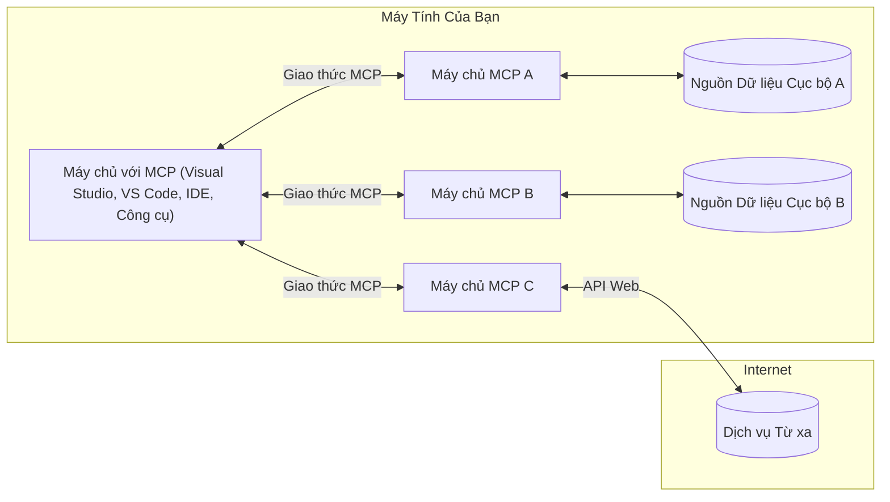

# MCP Core Concepts: Làm Chủ Giao Thức Ngữ Cảnh Mô Hình cho Tích Hợp AI

[](https://youtu.be/earDzWGtE84)

_(Nhấp vào hình ảnh trên để xem video bài học này)_

[Model Context Protocol (MCP)](https://github.com/modelcontextprotocol) là một khuôn khổ tiêu chuẩn mạnh mẽ tối ưu hóa giao tiếp giữa Các Mô Hình Ngôn Ngữ Lớn (LLMs) và các công cụ, ứng dụng, nguồn dữ liệu bên ngoài.  
Hướng dẫn này sẽ đưa bạn qua các khái niệm cốt lõi của MCP. Bạn sẽ học về kiến trúc client-server của nó, các thành phần cần thiết, cơ chế giao tiếp, và các thực hành tốt nhất khi triển khai.

- **Sự Đồng Ý Rõ Ràng của Người Dùng**: Tất cả truy cập và thao tác dữ liệu đều yêu cầu sự duyệt xét rõ ràng của người dùng trước khi thực thi. Người dùng phải hiểu rõ dữ liệu nào sẽ được truy cập và hành động nào sẽ được thực hiện, với quyền kiểm soát chi tiết về quyền hạn và sự cho phép.

- **Bảo Vệ Quyền Riêng Tư Dữ Liệu**: Dữ liệu người dùng chỉ được tiết lộ với sự đồng ý rõ ràng và phải được bảo vệ bằng các biện pháp kiểm soát truy cập chặt chẽ trong suốt vòng đời tương tác. Việc triển khai phải ngăn chặn truyền dữ liệu trái phép và duy trì giới hạn bảo mật nghiêm ngặt.

- **An Toàn Khi Thực Thi Công Cụ**: Mỗi lời gọi công cụ đều yêu cầu sự đồng ý rõ ràng của người dùng với sự hiểu biết rõ ràng về chức năng, tham số và tác động có thể có của công cụ. Ranh giới bảo mật nghiêm ngặt phải ngăn chặn các lần thực thi công cụ không mong muốn, không an toàn hoặc độc hại.

- **Bảo Mật Lớp Vận Chuyển**: Tất cả kênh giao tiếp nên sử dụng các cơ chế mã hóa và xác thực phù hợp. Kết nối từ xa nên triển khai các giao thức vận chuyển an toàn và quản lý chứng thực đúng cách.

#### Hướng dẫn Triển khai:

- **Quản lý Quyền**: Triển khai hệ thống quyền tinh vi cho phép người dùng kiểm soát máy chủ, công cụ và tài nguyên được phép truy cập  
- **Xác thực & Ủy quyền**: Sử dụng phương pháp xác thực an toàn (OAuth, khóa API) với quản lý token và thời hạn chính xác  
- **Kiểm tra Đầu Vào**: Xác thực tất cả tham số và dữ liệu đầu vào theo các sơ đồ định nghĩa để ngăn chặn tấn công chèn  
- **Ghi nhật ký Kiểm tra**: Duy trì các bản ghi chi tiết về tất cả thao tác để giám sát an ninh và tuân thủ

## Tổng Quan

Bài học này khám phá kiến trúc cơ bản và các thành phần tạo nên hệ sinh thái Model Context Protocol (MCP). Bạn sẽ tìm hiểu về kiến trúc client-server, các thành phần chính, và cơ chế giao tiếp vận hành tương tác MCP.

## Mục Tiêu Học Tập Chính

Kết thúc bài học này, bạn sẽ:

- Hiểu kiến trúc client-server của MCP.  
- Xác định vai trò và trách nhiệm của Hosts, Clients và Servers.  
- Phân tích các đặc điểm cốt lõi làm MCP trở thành lớp tích hợp linh hoạt.  
- Học cách luồng thông tin vận hành trong hệ sinh thái MCP.  
- Có cái nhìn thực tiễn qua các ví dụ mã trong .NET, Java, Python, và JavaScript.

## Kiến Trúc MCP: Nhìn Sâu Hơn

Hệ sinh thái MCP xây dựng trên mô hình client-server. Cấu trúc mô-đun này cho phép các ứng dụng AI tương tác hiệu quả với công cụ, cơ sở dữ liệu, API và tài nguyên ngữ cảnh. Hãy phân tích kiến trúc này thành các thành phần cốt lõi.

Ở cốt lõi, MCP theo kiến trúc client-server, trong đó ứng dụng host có thể kết nối tới nhiều server:


- **MCP Hosts**: Các chương trình như VSCode, Claude Desktop, IDE hoặc công cụ AI muốn truy cập dữ liệu thông qua MCP  
- **MCP Clients**: Các client giao thức duy trì kết nối 1:1 với các server  
- **MCP Servers**: Các chương trình nhẹ cung cấp những khả năng cụ thể qua giao thức Model Context chuẩn hóa  
- **Nguồn Dữ Liệu Cục Bộ**: Các file, cơ sở dữ liệu, dịch vụ trên máy tính của bạn mà các MCP server có thể truy cập an toàn  
- **Dịch Vụ Từ Xa**: Hệ thống bên ngoài truy cập qua internet mà MCP server có thể kết nối qua API.

Giao thức MCP là một tiêu chuẩn đang phát triển sử dụng cách đánh số phiên bản theo ngày (định dạng YYYY-MM-DD). Phiên bản giao thức hiện tại là **2025-11-25**. Bạn có thể xem các cập nhật mới nhất tại [đặc tả giao thức](https://modelcontextprotocol.io/specification/2025-11-25/)

### 1. Hosts

Trong Model Context Protocol (MCP), **Hosts** là các ứng dụng AI đóng vai trò giao diện chính để người dùng tương tác với giao thức. Hosts điều phối và quản lý kết nối tới nhiều MCP server bằng cách tạo client MCP riêng biệt cho mỗi kết nối server. Ví dụ về Hosts bao gồm:

- **Ứng dụng AI**: Claude Desktop, Visual Studio Code, Claude Code  
- **Môi trường Phát triển**: IDE và trình soạn thảo code có tích hợp MCP  
- **Ứng dụng Tùy chỉnh**: Các tác nhân AI và công cụ được xây dựng theo mục đích riêng

**Hosts** là ứng dụng điều phối các tương tác mô hình AI. Họ:

- **Điều phối Mô hình AI**: Thực thi hoặc tương tác với LLM để tạo phản hồi và điều phối luồng công việc AI  
- **Quản lý Kết nối Client**: Tạo và duy trì một client MCP cho mỗi kết nối MCP server  
- **Kiểm soát Giao diện Người dùng**: Quản lý luồng hội thoại, tương tác người dùng và trình bày phản hồi  
- **Thực thi An ninh**: Kiểm soát quyền hạn, giới hạn bảo mật và xác thực  
- **Xử lý Sự đồng ý của Người Dùng**: Quản lý sự phê duyệt của người dùng với việc chia sẻ dữ liệu và thực thi công cụ

### 2. Clients

**Clients** là thành phần quan trọng duy trì kết nối một-một riêng biệt giữa Hosts và MCP servers. Mỗi client MCP được host khởi tạo để kết nối với một MCP server cụ thể, đảm bảo kênh giao tiếp có tổ chức và an toàn. Nhiều client cho phép Hosts kết nối đồng thời với nhiều server.

**Clients** là thành phần kết nối bên trong ứng dụng host. Họ:

- **Giao tiếp Giao thức**: Gửi các yêu cầu JSON-RPC 2.0 tới server kèm theo prompt và hướng dẫn  
- **Đàm phán Khả năng**: Thương lượng các tính năng và phiên bản giao thức được hỗ trợ với server trong quá trình khởi tạo  
- **Thực thi Công cụ**: Quản lý các yêu cầu thực thi công cụ từ mô hình và xử lý phản hồi  
- **Cập nhật Thời gian Thực**: Xử lý thông báo và cập nhật thời gian thực từ server  
- **Xử lý Phản hồi**: Xử lý và định dạng phản hồi từ server để hiển thị cho người dùng

### 3. Servers

**Servers** là các chương trình cung cấp ngữ cảnh, công cụ, và khả năng cho client MCP. Chúng có thể chạy cục bộ (trên cùng máy với Host) hoặc từ xa (trên nền tảng bên ngoài), chịu trách nhiệm xử lý các yêu cầu client và cung cấp phản hồi có cấu trúc. Servers cung cấp chức năng cụ thể qua giao thức chuẩn Model Context.

**Servers** là dịch vụ cung cấp ngữ cảnh và khả năng. Họ:

- **Đăng ký Tính năng**: Đăng ký và công khai các primitive (tài nguyên, prompt, công cụ) có sẵn cho client  
- **Xử lý Yêu cầu**: Nhận và thực thi các lời gọi công cụ, yêu cầu tài nguyên và yêu cầu prompt từ client  
- **Cung cấp Ngữ cảnh**: Cung cấp thông tin và dữ liệu ngữ cảnh để nâng cao phản hồi của mô hình  
- **Quản lý Trạng thái**: Duy trì trạng thái phiên làm việc và xử lý các tương tác có trạng thái khi cần  
- **Thông báo Thời gian Thực**: Gửi thông báo về thay đổi và cập nhật khả năng cho client đã kết nối

Servers có thể được phát triển bởi bất kỳ ai để mở rộng khả năng mô hình với chức năng chuyên biệt, hỗ trợ cả triển khai cục bộ và từ xa.

### 4. Server Primitives

Servers trong Model Context Protocol (MCP) cung cấp ba **primitive** cốt lõi định nghĩa các khối xây dựng cơ bản cho các tương tác phong phú giữa client, host và mô hình ngôn ngữ. Các primitive này xác định loại thông tin ngữ cảnh và hành động có thể sử dụng qua giao thức.

Server MCP có thể công khai bất kỳ kết hợp nào của ba primitive cốt lõi sau:

#### Resources

**Resources** là các nguồn dữ liệu cung cấp thông tin ngữ cảnh cho ứng dụng AI. Chúng đại diện cho nội dung tĩnh hoặc động có thể nâng cao hiểu biết và quyết định của mô hình:

- **Dữ liệu Ngữ cảnh**: Thông tin cấu trúc và ngữ cảnh cho việc sử dụng của mô hình AI  
- **Cơ sở Kiến thức**: Kho tài liệu, bài viết, hướng dẫn và bài nghiên cứu  
- **Nguồn Dữ liệu Cục bộ**: File, cơ sở dữ liệu, thông tin hệ thống cục bộ  
- **Dữ liệu Bên ngoài**: Phản hồi API, dịch vụ web, dữ liệu hệ thống từ xa  
- **Nội dung Động**: Dữ liệu thời gian thực cập nhật theo điều kiện bên ngoài

Resources được xác định bằng URI và hỗ trợ khám phá thông qua phương thức `resources/list` và lấy dữ liệu qua `resources/read`:

```text
file://documents/project-spec.md
database://production/users/schema
api://weather/current
```

#### Prompts

**Prompts** là các mẫu có thể tái sử dụng giúp cấu trúc tương tác với mô hình ngôn ngữ. Chúng cung cấp các mẫu tương tác chuẩn hóa và quy trình làm việc mẫu:

- **Tương tác dựa trên Mẫu**: Các thông điệp cấu trúc sẵn và câu hỏi khởi đầu hội thoại  
- **Mẫu Quy trình Làm việc**: Chuỗi chuẩn hóa cho các tác vụ và tương tác phổ biến  
- **Ví dụ Few-shot**: Mẫu dựa trên ví dụ dùng để hướng dẫn mô hình  
- **System Prompts**: Prompt nền tảng định nghĩa hành vi và ngữ cảnh mô hình  
- **Mẫu Động**: Prompt tham số hóa thích ứng với ngữ cảnh cụ thể

Prompts hỗ trợ thay thế biến và có thể được khám phá qua `prompts/list` và lấy qua `prompts/get`:

```markdown
Generate a {{task_type}} for {{product}} targeting {{audience}} with the following requirements: {{requirements}}
```

#### Tools

**Tools** là các hàm thực thi mà mô hình AI có thể gọi để thực hiện các hành động cụ thể. Chúng đại diện cho các "động từ" trong hệ sinh thái MCP, giúp mô hình tương tác với hệ thống bên ngoài:

- **Hàm Thực thi**: Các thao tác riêng biệt mà mô hình có thể gọi với tham số cụ thể  
- **Tích hợp Hệ thống Bên ngoài**: Gọi API, truy vấn cơ sở dữ liệu, thao tác file, tính toán  
- **Định danh Độc nhất**: Mỗi công cụ có tên, mô tả và sơ đồ tham số riêng biệt  
- **I/O Có cấu trúc**: Công cụ nhận tham số đã xác thực và trả về phản hồi có kiểu dữ liệu có cấu trúc  
- **Khả năng Thực thi Hành động**: Cho phép mô hình thao tác thế giới thực và truy xuất dữ liệu trực tiếp

Các công cụ được định nghĩa bằng JSON Schema để xác thực tham số, được khám phá qua `tools/list` và gọi qua `tools/call`. Công cụ cũng có thể bao gồm **icon** như metadata bổ sung nhằm cải thiện giao diện người dùng.

**Chú thích Công cụ**: Công cụ hỗ trợ các chú thích hành vi (ví dụ, `readOnlyHint`, `destructiveHint`) mô tả công cụ có chỉ đọc hay phá hoại, giúp client đưa ra quyết định thực thi chính xác.

Ví dụ định nghĩa công cụ:

```typescript
server.tool(
  "search_products", 
  {
    query: z.string().describe("Search query for products"),
    category: z.string().optional().describe("Product category filter"),
    max_results: z.number().default(10).describe("Maximum results to return")
  }, 
  async (params) => {
    // Thực hiện tìm kiếm và trả về kết quả có cấu trúc
    return await productService.search(params);
  }
);
```

## Client Primitives

Trong Model Context Protocol (MCP), **clients** có thể công khai các primitive cho phép servers yêu cầu thêm khả năng từ ứng dụng host. Các primitive phía client này cho phép server triển khai phong phú và tương tác hơn, có thể truy cập khả năng mô hình AI và tương tác người dùng.

### Sampling

**Sampling** cho phép server yêu cầu mô hình ngôn ngữ tạo hoàn thành từ ứng dụng AI phía client. Primitive này cho phép server truy cập khả năng LLM mà không cần nhúng các SDK mô hình hay quản lý truy cập mô hình:

- **Truy cập Độc lập Mô hình**: Server có thể yêu cầu hoàn thành mà không cần kèm SDK LLM hay quản lý truy cập  
- **AI Khởi tạo bởi Server**: Cho phép server tự sinh nội dung bằng mô hình AI của client  
- **Tương tác Đệ quy với LLM**: Hỗ trợ kịch bản phức tạp khi server cần AI trợ giúp xử lý  
- **Sinh Nội dung Động**: Cho phép server tạo phản hồi có ngữ cảnh dùng mô hình của host  
- **Hỗ trợ Gọi Công cụ**: Server có thể gửi `tools` và `toolChoice` để mô hình client gọi công cụ trong quá trình sampling

Sampling được khởi tạo qua phương thức `sampling/complete`, nơi server gửi yêu cầu hoàn thành tới client.

### Roots

**Roots** cung cấp cách chuẩn hóa để clients công khai các giới hạn hệ thống tập tin cho servers, giúp servers hiểu được thư mục và file nào có thể truy cập:

- **Giới hạn Hệ thống Tập tin**: Xác định phạm vi nơi servers được phép thao tác trong hệ thống file  
- **Kiểm soát Truy cập**: Giúp servers biết thư mục và files mà chúng được phép truy cập  
- **Cập nhật Động**: Clients có thể thông báo cho servers khi danh sách roots thay đổi  
- **Định danh Dựa trên URI**: Roots sử dụng URI `file://` để nhận dạng thư mục và file có thể truy cập

Roots được khám phá qua phương thức `roots/list`, client gửi `notifications/roots/list_changed` khi roots thay đổi.

### Elicitation

**Elicitation** cho phép servers yêu cầu thêm thông tin hoặc xác nhận từ người dùng qua giao diện client:

- **Yêu cầu Nhập liệu Người dùng**: Servers có thể hỏi thêm thông tin khi cần cho việc thực thi công cụ  
- **Hộp thoại Xác nhận**: Yêu cầu phê duyệt của người dùng cho các thao tác nhạy cảm hoặc quan trọng  
- **Quy trình Tương tác Thực tiễn**: Cho phép servers tạo các bước tương tác với người dùng từng bước  
- **Thu thập Tham số Động**: Thu thập tham số còn thiếu hoặc tùy chọn trong quá trình thực thi công cụ

Yêu cầu elicitation được gửi qua phương thức `elicitation/request` để thu thập đầu vào người dùng qua giao diện client.

**Elicitation Chế độ URL**: Servers cũng có thể yêu cầu tương tác người dùng dựa trên URL, cho phép điều hướng người dùng đến trang web ngoài để xác thực, phê duyệt hoặc nhập dữ liệu.

### Logging

**Logging** cho phép servers gửi thông điệp nhật ký có cấu trúc đến clients để debug, giám sát và quan sát vận hành:

- **Hỗ trợ Gỡ lỗi**: Cho phép servers cung cấp nhật ký thực thi chi tiết để khắc phục sự cố  
- **Giám sát Vận hành**: Gửi cập nhật trạng thái và số liệu hiệu suất cho client  
- **Báo cáo Lỗi**: Cung cấp bối cảnh lỗi chi tiết và thông tin chẩn đoán  
- **Dấu vết Kiểm toán**: Tạo các nhật ký đầy đủ về hoạt động và quyết định của server

Thông điệp logging được gửi đến client để minh bạch hoạt động của server và hỗ trợ gỡ lỗi.

## Luồng Thông Tin Trong MCP

Model Context Protocol (MCP) định nghĩa luồng thông tin có cấu trúc giữa hosts, clients, servers và mô hình. Hiểu luồng này giúp làm rõ cách xử lý các yêu cầu người dùng và cách các công cụ cũng như dữ liệu bên ngoài được tích hợp vào phản hồi mô hình.

- **Host Khởi tạo Kết nối**  
  Ứng dụng host (chẳng hạn IDE hoặc giao diện chat) thiết lập kết nối tới MCP server, thường qua STDIO, WebSocket hoặc một cơ chế vận chuyển được hỗ trợ.

- **Đàm phán Khả năng**  
  Client (nhúng trong host) và server trao đổi thông tin về các tính năng, công cụ, tài nguyên và phiên bản giao thức được hỗ trợ. Điều này đảm bảo cả hai bên hiểu các khả năng có sẵn cho phiên làm việc.

- **Yêu cầu Người dùng**  
  Người dùng tương tác với host (ví dụ, nhập prompt hoặc lệnh). Host thu thập đầu vào này và chuyển cho client để xử lý.

- **Sử dụng Tài nguyên hoặc Công cụ**  
  - Client có thể yêu cầu thêm ngữ cảnh hoặc tài nguyên từ server (như file, mục cơ sở dữ liệu, hoặc bài viết trong kho kiến thức) để làm phong phú thêm sự hiểu của mô hình.  
  - Nếu mô hình xác định cần công cụ (ví dụ để lấy dữ liệu, thực hiện tính toán, hoặc gọi API), client gửi yêu cầu gọi công cụ đến server, chỉ định tên công cụ và tham số.

- **Thực thi Server**  

Máy chủ nhận yêu cầu tài nguyên hoặc công cụ, thực thi các thao tác cần thiết (chẳng hạn như chạy một hàm, truy vấn cơ sở dữ liệu hoặc lấy tệp), và trả kết quả cho khách hàng dưới dạng có cấu trúc.

- **Tạo phản hồi**  
  Khách hàng tích hợp các phản hồi từ máy chủ (dữ liệu tài nguyên, kết quả công cụ, v.v.) vào tương tác mô hình đang diễn ra. Mô hình sử dụng thông tin này để tạo ra phản hồi tổng thể và phù hợp với ngữ cảnh.

- **Trình bày kết quả**  
  Chủ sở hữu nhận đầu ra cuối cùng từ khách hàng và trình bày cho người dùng, thường bao gồm cả văn bản do mô hình tạo ra và bất kỳ kết quả nào từ việc thực thi công cụ hoặc tra cứu tài nguyên.

Luồng này cho phép MCP hỗ trợ các ứng dụng AI tiên tiến, tương tác và nhận biết ngữ cảnh bằng cách kết nối liền mạch mô hình với các công cụ và nguồn dữ liệu bên ngoài.

## Kiến trúc Giao thức & Các Lớp

MCP bao gồm hai lớp kiến trúc riêng biệt phối hợp hoạt động để cung cấp một khung giao tiếp hoàn chỉnh:

### Lớp Dữ liệu

**Lớp Dữ liệu** triển khai giao thức MCP chính dựa trên **JSON-RPC 2.0** làm nền tảng. Lớp này định nghĩa cấu trúc tin nhắn, ngữ nghĩa và mẫu tương tác:

#### Thành phần chính:

- **Giao thức JSON-RPC 2.0**: Toàn bộ giao tiếp sử dụng định dạng tin nhắn JSON-RPC 2.0 chuẩn cho các cuộc gọi phương thức, phản hồi và thông báo
- **Quản lý vòng đời**: Xử lý khởi tạo kết nối, thương lượng khả năng và kết thúc phiên giữa khách hàng và máy chủ
- **Các nguyên thủy máy chủ**: Cho phép máy chủ cung cấp chức năng cốt lõi thông qua công cụ, tài nguyên và lời nhắc
- **Các nguyên thủy khách hàng**: Cho phép máy chủ yêu cầu lấy mẫu từ LLM, khơi gợi đầu vào người dùng và gửi thông điệp ghi nhật ký
- **Thông báo thời gian thực**: Hỗ trợ thông báo không đồng bộ cho cập nhật động mà không cần truy vấn liên tục

#### Các tính năng chính:

- **Thương lượng phiên bản giao thức**: Sử dụng phiên bản dựa trên ngày tháng (YYYY-MM-DD) để đảm bảo tính tương thích
- **Khám phá khả năng**: Khách hàng và máy chủ trao đổi thông tin tính năng được hỗ trợ trong giai đoạn khởi tạo
- **Phiên trạng thái**: Duy trì trạng thái kết nối qua nhiều tương tác để liên tục ngữ cảnh

### Lớp Vận chuyển

**Lớp Vận chuyển** quản lý các kênh giao tiếp, đóng khung tin nhắn và xác thực giữa các thành viên MCP:

#### Cơ chế vận chuyển được hỗ trợ:

1. **Vận chuyển STDIO**:
   - Sử dụng luồng đầu vào/đầu ra tiêu chuẩn cho giao tiếp trực tiếp giữa các tiến trình
   - Tối ưu cho các tiến trình cục bộ trên cùng một máy với không có chi phí mạng
   - Thường dùng cho các triển khai máy chủ MCP cục bộ

2. **Vận chuyển HTTP có thể phát trực tiếp**:
   - Sử dụng HTTP POST cho tin nhắn từ khách hàng tới máy chủ  
   - Tùy chọn Server-Sent Events (SSE) cho phát trực tiếp từ máy chủ đến khách hàng
   - Cho phép giao tiếp máy chủ từ xa qua mạng
   - Hỗ trợ xác thực HTTP chuẩn (token bearer, khóa API, header tùy chỉnh)
   - MCP khuyến nghị OAuth cho xác thực token an toàn

#### Trừu tượng Vận chuyển:

Lớp vận chuyển trừu tượng hóa chi tiết giao tiếp khỏi lớp dữ liệu, cho phép cùng định dạng tin nhắn JSON-RPC 2.0 dùng qua tất cả cơ chế vận chuyển. Trừu tượng hóa này cho phép ứng dụng chuyển đổi mượt mà giữa máy chủ cục bộ và từ xa.

### Các cân nhắc về Bảo mật

Các triển khai MCP phải tuân thủ các nguyên tắc bảo mật quan trọng để đảm bảo tương tác an toàn, đáng tin cậy và bảo mật xuyên suốt các hoạt động giao thức:

- **Sự cho phép và kiểm soát của người dùng**: Người dùng phải cung cấp sự đồng ý rõ ràng trước khi bất kỳ dữ liệu nào được truy cập hoặc thao tác được thực hiện. Họ cần có quyền kiểm soát rõ ràng về những dữ liệu được chia sẻ và các hành động được phép, được hỗ trợ bằng giao diện trực quan để xem lại và phê duyệt hoạt động.

- **Bảo mật dữ liệu**: Dữ liệu người dùng chỉ nên được tiết lộ với sự đồng ý rõ ràng và phải được bảo vệ bằng các kiểm soát truy cập phù hợp. Các triển khai MCP phải đảm bảo chống truyền dữ liệu trái phép và duy trì bảo mật trong toàn bộ tương tác.

- **An toàn công cụ**: Trước khi gọi bất kỳ công cụ nào, phải có sự đồng ý rõ ràng từ người dùng. Người dùng cần hiểu rõ chức năng từng công cụ, và các ranh giới bảo mật nghiêm ngặt phải được áp dụng để ngăn chặn việc thực thi công cụ không mong muốn hoặc không an toàn.

Bằng việc tuân thủ các nguyên tắc bảo mật này, MCP đảm bảo niềm tin, quyền riêng tư và an toàn cho người dùng xuyên suốt các tương tác giao thức trong khi cho phép tích hợp AI mạnh mẽ.

## Ví dụ Mã nguồn: Thành phần chính

Dưới đây là các ví dụ mã nguồn trong một số ngôn ngữ lập trình phổ biến minh họa cách triển khai các thành phần máy chủ MCP và công cụ chính.

### Ví dụ .NET: Tạo Máy chủ MCP đơn giản với Công cụ

Đây là ví dụ mã .NET thực tiễn minh họa cách triển khai một máy chủ MCP đơn giản với các công cụ tùy chỉnh. Ví dụ này cho thấy cách định nghĩa và đăng ký công cụ, xử lý yêu cầu, và kết nối máy chủ dùng Giao thức Ngữ cảnh Mô hình.

```csharp
using System;
using System.Threading.Tasks;
using ModelContextProtocol.Server;
using ModelContextProtocol.Server.Transport;
using ModelContextProtocol.Server.Tools;

public class WeatherServer
{
    public static async Task Main(string[] args)
    {
        // Create an MCP server
        var server = new McpServer(
            name: "Weather MCP Server",
            version: "1.0.0"
        );
        
        // Register our custom weather tool
        server.AddTool<string, WeatherData>("weatherTool", 
            description: "Gets current weather for a location",
            execute: async (location) => {
                // Call weather API (simplified)
                var weatherData = await GetWeatherDataAsync(location);
                return weatherData;
            });
        
        // Connect the server using stdio transport
        var transport = new StdioServerTransport();
        await server.ConnectAsync(transport);
        
        Console.WriteLine("Weather MCP Server started");
        
        // Keep the server running until process is terminated
        await Task.Delay(-1);
    }
    
    private static async Task<WeatherData> GetWeatherDataAsync(string location)
    {
        // This would normally call a weather API
        // Simplified for demonstration
        await Task.Delay(100); // Simulate API call
        return new WeatherData { 
            Temperature = 72.5,
            Conditions = "Sunny",
            Location = location
        };
    }
}

public class WeatherData
{
    public double Temperature { get; set; }
    public string Conditions { get; set; }
    public string Location { get; set; }
}
```

### Ví dụ Java: Thành phần Máy chủ MCP

Ví dụ này trình bày cùng máy chủ MCP và đăng ký công cụ như ví dụ .NET trên nhưng được triển khai bằng Java.

```java
import io.modelcontextprotocol.server.McpServer;
import io.modelcontextprotocol.server.McpToolDefinition;
import io.modelcontextprotocol.server.transport.StdioServerTransport;
import io.modelcontextprotocol.server.tool.ToolExecutionContext;
import io.modelcontextprotocol.server.tool.ToolResponse;

public class WeatherMcpServer {
    public static void main(String[] args) throws Exception {
        // Tạo một máy chủ MCP
        McpServer server = McpServer.builder()
            .name("Weather MCP Server")
            .version("1.0.0")
            .build();
            
        // Đăng ký một công cụ thời tiết
        server.registerTool(McpToolDefinition.builder("weatherTool")
            .description("Gets current weather for a location")
            .parameter("location", String.class)
            .execute((ToolExecutionContext ctx) -> {
                String location = ctx.getParameter("location", String.class);
                
                // Lấy dữ liệu thời tiết (đơn giản hóa)
                WeatherData data = getWeatherData(location);
                
                // Trả lại phản hồi đã định dạng
                return ToolResponse.content(
                    String.format("Temperature: %.1f°F, Conditions: %s, Location: %s", 
                    data.getTemperature(), 
                    data.getConditions(), 
                    data.getLocation())
                );
            })
            .build());
        
        // Kết nối máy chủ bằng giao tiếp stdio
        try (StdioServerTransport transport = new StdioServerTransport()) {
            server.connect(transport);
            System.out.println("Weather MCP Server started");
            // Giữ cho máy chủ chạy cho đến khi tiến trình kết thúc
            Thread.currentThread().join();
        }
    }
    
    private static WeatherData getWeatherData(String location) {
        // Cài đặt sẽ gọi một API thời tiết
        // Đơn giản hóa cho mục đích ví dụ
        return new WeatherData(72.5, "Sunny", location);
    }
}

class WeatherData {
    private double temperature;
    private String conditions;
    private String location;
    
    public WeatherData(double temperature, String conditions, String location) {
        this.temperature = temperature;
        this.conditions = conditions;
        this.location = location;
    }
    
    public double getTemperature() {
        return temperature;
    }
    
    public String getConditions() {
        return conditions;
    }
    
    public String getLocation() {
        return location;
    }
}
```

### Ví dụ Python: Xây dựng Máy chủ MCP

Ví dụ này sử dụng fastmcp, vui lòng đảm bảo bạn đã cài đặt nó trước:

```python
pip install fastmcp
```
Mẫu Mã:

```python
#!/usr/bin/env python3
import asyncio
from fastmcp import FastMCP
from fastmcp.transports.stdio import serve_stdio

# Tạo một máy chủ FastMCP
mcp = FastMCP(
    name="Weather MCP Server",
    version="1.0.0"
)

@mcp.tool()
def get_weather(location: str) -> dict:
    """Gets current weather for a location."""
    return {
        "temperature": 72.5,
        "conditions": "Sunny",
        "location": location
    }

# Cách tiếp cận thay thế sử dụng một lớp
class WeatherTools:
    @mcp.tool()
    def forecast(self, location: str, days: int = 1) -> dict:
        """Gets weather forecast for a location for the specified number of days."""
        return {
            "location": location,
            "forecast": [
                {"day": i+1, "temperature": 70 + i, "conditions": "Partly Cloudy"}
                for i in range(days)
            ]
        }

# Đăng ký các công cụ lớp
weather_tools = WeatherTools()

# Khởi động máy chủ
if __name__ == "__main__":
    asyncio.run(serve_stdio(mcp))
```

### Ví dụ JavaScript: Tạo Máy chủ MCP

Ví dụ này trình bày cách tạo máy chủ MCP bằng JavaScript và cách đăng ký hai công cụ liên quan đến thời tiết.

```javascript
// Sử dụng SDK chính thức của Model Context Protocol
import { McpServer } from "@modelcontextprotocol/sdk/server/mcp.js";
import { StdioServerTransport } from "@modelcontextprotocol/sdk/server/stdio.js";
import { z } from "zod"; // Để xác thực tham số

// Tạo một máy chủ MCP
const server = new McpServer({
  name: "Weather MCP Server",
  version: "1.0.0"
});

// Định nghĩa một công cụ thời tiết
server.tool(
  "weatherTool",
  {
    location: z.string().describe("The location to get weather for")
  },
  async ({ location }) => {
    // Điều này thường gọi một API thời tiết
    // Đơn giản hóa cho mục đích trình diễn
    const weatherData = await getWeatherData(location);
    
    return {
      content: [
        { 
          type: "text", 
          text: `Temperature: ${weatherData.temperature}°F, Conditions: ${weatherData.conditions}, Location: ${weatherData.location}` 
        }
      ]
    };
  }
);

// Định nghĩa một công cụ dự báo
server.tool(
  "forecastTool",
  {
    location: z.string(),
    days: z.number().default(3).describe("Number of days for forecast")
  },
  async ({ location, days }) => {
    // Điều này thường gọi một API thời tiết
    // Đơn giản hóa cho mục đích trình diễn
    const forecast = await getForecastData(location, days);
    
    return {
      content: [
        { 
          type: "text", 
          text: `${days}-day forecast for ${location}: ${JSON.stringify(forecast)}` 
        }
      ]
    };
  }
);

// Các hàm trợ giúp
async function getWeatherData(location) {
  // Mô phỏng cuộc gọi API
  return {
    temperature: 72.5,
    conditions: "Sunny",
    location: location
  };
}

async function getForecastData(location, days) {
  // Mô phỏng cuộc gọi API
  return Array.from({ length: days }, (_, i) => ({
    day: i + 1,
    temperature: 70 + Math.floor(Math.random() * 10),
    conditions: i % 2 === 0 ? "Sunny" : "Partly Cloudy"
  }));
}

// Kết nối máy chủ bằng giao thức stdio
const transport = new StdioServerTransport();
server.connect(transport).catch(console.error);

console.log("Weather MCP Server started");
```

Ví dụ JavaScript này mô tả cách tạo khách hàng MCP kết nối tới máy chủ, gửi lời nhắc và xử lý phản hồi bao gồm bất kỳ cuộc gọi công cụ nào được thực hiện.

## Bảo mật và Ủy quyền

MCP bao gồm một số khái niệm và cơ chế tích hợp để quản lý bảo mật và ủy quyền trong suốt giao thức:

1. **Kiểm soát Quyền công cụ**:  
  Khách hàng có thể chỉ định công cụ nào mô hình được phép sử dụng trong phiên làm việc. Điều này đảm bảo chỉ những công cụ được ủy quyền rõ ràng mới được truy cập, giảm nguy cơ thao tác không mong muốn hoặc không an toàn. Quyền có thể được cấu hình linh hoạt dựa trên ưu tiên người dùng, chính sách tổ chức, hoặc bối cảnh tương tác.

2. **Xác thực**:  
  Máy chủ có thể yêu cầu xác thực trước khi cấp quyền truy cập công cụ, tài nguyên hoặc các thao tác nhạy cảm. Điều này có thể bao gồm khóa API, token OAuth hoặc các phương thức xác thực khác. Xác thực đúng đắn đảm bảo chỉ khách hàng và người dùng tin cậy mới có thể gọi các chức năng phía máy chủ.

3. **Kiểm tra hợp lệ**:  
  Việc kiểm tra tham số được thực thi cho tất cả các lần gọi công cụ. Mỗi công cụ định nghĩa loại, định dạng và ràng buộc tham số mong đợi, máy chủ sẽ xác thực yêu cầu đến tương ứng. Điều này ngăn ngừa dữ liệu đầu vào sai định dạng hoặc độc hại tới phần triển khai công cụ và giúp duy trì tính toàn vẹn của hoạt động.

4. **Giới hạn tốc độ**:  
  Để ngăn ngừa lạm dụng và đảm bảo sử dụng tài nguyên công bằng, máy chủ MCP có thể thực hiện giới hạn tốc độ cho cuộc gọi công cụ và truy cập tài nguyên. Giới hạn có thể áp dụng theo người dùng, theo phiên, hoặc toàn cục, giúp chống lại các cuộc tấn công từ chối dịch vụ hoặc tiêu thụ tài nguyên quá mức.

Kết hợp các cơ chế này, MCP cung cấp nền tảng an toàn để tích hợp mô hình ngôn ngữ với công cụ và nguồn dữ liệu bên ngoài, đồng thời trao quyền kiểm soát chi tiết truy cập và sử dụng cho người dùng và nhà phát triển.

## Tin nhắn Giao thức & Luồng Giao tiếp

Giao tiếp MCP sử dụng các tin nhắn **JSON-RPC 2.0** có cấu trúc để tạo thuận lợi cho các tương tác rõ ràng và đáng tin cậy giữa chủ sở hữu, khách hàng và máy chủ. Giao thức định nghĩa các mẫu tin nhắn cụ thể cho các loại thao tác khác nhau:

### Các Loại Tin nhắn Cơ bản:

#### **Tin nhắn Khởi tạo**
- Yêu cầu **`initialize`**: Thiết lập kết nối và thương lượng phiên bản giao thức cùng khả năng
- Phản hồi **`initialize`**: Xác nhận các tính năng được hỗ trợ và thông tin máy chủ  
- **`notifications/initialized`**: Báo hiệu việc khởi tạo hoàn tất và phiên sẵn sàng

#### **Tin nhắn Khám phá**
- Yêu cầu **`tools/list`**: Khám phá các công cụ sẵn có từ máy chủ
- Yêu cầu **`resources/list`**: Liệt kê các tài nguyên sẵn có (nguồn dữ liệu)
- Yêu cầu **`prompts/list`**: Lấy danh sách mẫu lời nhắc có sẵn

#### **Tin nhắn Thực thi**  
- Yêu cầu **`tools/call`**: Thực thi một công cụ cụ thể với tham số cung cấp
- Yêu cầu **`resources/read`**: Truy xuất nội dung từ tài nguyên cụ thể
- Yêu cầu **`prompts/get`**: Lấy mẫu lời nhắc với tham số tùy chọn

#### **Tin nhắn phía Khách hàng**
- Yêu cầu **`sampling/complete`**: Máy chủ yêu cầu hoàn thành LLM từ khách hàng
- **`elicitation/request`**: Máy chủ yêu cầu đầu vào người dùng qua giao diện khách hàng
- Tin nhắn ghi nhật ký: Máy chủ gửi tin nhắn ghi nhật ký có cấu trúc tới khách hàng

#### **Tin nhắn Thông báo**
- **`notifications/tools/list_changed`**: Máy chủ thông báo thay đổi công cụ tới khách hàng
- **`notifications/resources/list_changed`**: Máy chủ thông báo thay đổi tài nguyên tới khách hàng  
- **`notifications/prompts/list_changed`**: Máy chủ thông báo thay đổi lời nhắc tới khách hàng

### Cấu trúc Tin nhắn:

Tất cả tin nhắn MCP tuân theo định dạng JSON-RPC 2.0 với:
- **Tin nhắn Yêu cầu**: Bao gồm `id`, `method`, và `params` tùy chọn
- **Tin nhắn Phản hồi**: Bao gồm `id` và `result` hoặc `error`  
- **Tin nhắn Thông báo**: Bao gồm `method` và `params` tùy chọn (không có `id` và không cần phản hồi)

Giao tiếp có cấu trúc này đảm bảo các tương tác đáng tin cậy, có thể theo dõi và mở rộng, hỗ trợ kịch bản tiên tiến như cập nhật thời gian thực, chuỗi công cụ, và xử lý lỗi vững chắc.

### Nhiệm vụ (Thử nghiệm)

**Nhiệm vụ** là tính năng thử nghiệm cung cấp các wrapper thực thi bền bỉ cho phép truy xuất kết quả trì hoãn và theo dõi trạng thái yêu cầu MCP:

- **Hoạt động chạy dài**: Theo dõi tính toán tốn kém, tự động hóa quy trình và xử lý theo lô
- **Kết quả trì hoãn**: Truy vấn trạng thái nhiệm vụ và lấy kết quả khi hoàn thành
- **Theo dõi trạng thái**: Giám sát tiến trình nhiệm vụ qua các trạng thái vòng đời định nghĩa
- **Hoạt động đa bước**: Hỗ trợ quy trình phức tạp trải dài nhiều tương tác

Nhiệm vụ bao bọc yêu cầu MCP tiêu chuẩn để cho phép kiểu thực thi không đồng bộ cho các thao tác không thể hoàn thành ngay lập tức.

## Những điểm Chính cần ghi nhớ

- **Kiến trúc**: MCP sử dụng kiến trúc khách hàng-máy chủ, trong đó chủ sở hữu quản lý nhiều kết nối khách hàng đến máy chủ
- **Các thành viên**: Hệ sinh thái bao gồm chủ sở hữu (ứng dụng AI), khách hàng (kết nối giao thức) và máy chủ (nhà cung cấp khả năng)
- **Cơ chế vận chuyển**: Giao tiếp hỗ trợ STDIO (cục bộ) và HTTP có thể phát trực tiếp với SSE tùy chọn (từ xa)
- **Nguyên thủy cốt lõi**: Máy chủ cung cấp công cụ (hàm thực thi), tài nguyên (nguồn dữ liệu) và lời nhắc (mẫu)
- **Nguyên thủy khách hàng**: Máy chủ có thể yêu cầu lấy mẫu (hoàn thành LLM với hỗ trợ gọi công cụ), khơi gợi (đầu vào người dùng bao gồm chế độ URL), giới hạn (ranh giới hệ thống tập tin) và ghi nhật ký từ khách hàng
- **Tính năng thử nghiệm**: Nhiệm vụ cung cấp wrapper thực thi bền bỉ cho hoạt động chạy dài
- **Nền tảng giao thức**: Xây dựng dựa trên JSON-RPC 2.0 với phiên bản dựa trên ngày (hiện tại: 2025-11-25)
- **Khả năng thời gian thực**: Hỗ trợ thông báo cho cập nhật động và đồng bộ thời gian thực
- **Ưu tiên bảo mật**: Sự đồng ý rõ ràng của người dùng, bảo vệ quyền riêng tư dữ liệu và vận chuyển an toàn là yêu cầu cốt lõi

## Bài tập

Thiết kế một công cụ MCP đơn giản có thể hữu ích trong lĩnh vực của bạn. Định nghĩa:
1. Tên công cụ sẽ là gì
2. Các tham số công cụ sẽ nhận
3. Kết quả đầu ra công cụ trả về
4. Cách một mô hình có thể sử dụng công cụ này để giải quyết vấn đề cho người dùng


---

## Phần tiếp theo

Tiếp theo: [Chương 2: Bảo mật](../02-Security/README.md)

---

<!-- CO-OP TRANSLATOR DISCLAIMER START -->
**Tuyên bố từ chối trách nhiệm**:
Tài liệu này đã được dịch bằng dịch vụ dịch thuật AI [Co-op Translator](https://github.com/Azure/co-op-translator). Mặc dù chúng tôi cố gắng đảm bảo độ chính xác, xin lưu ý rằng các bản dịch tự động có thể chứa lỗi hoặc không chính xác. Tài liệu gốc bằng ngôn ngữ gốc được coi là nguồn chính xác và đáng tin cậy nhất. Đối với thông tin quan trọng, khuyến nghị sử dụng dịch vụ dịch thuật chuyên nghiệp do con người thực hiện. Chúng tôi không chịu trách nhiệm về bất kỳ sự hiểu lầm hoặc giải thích sai nào phát sinh từ việc sử dụng bản dịch này.
<!-- CO-OP TRANSLATOR DISCLAIMER END -->