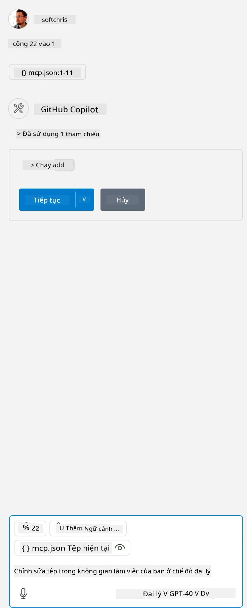

Điều này tương ứng với việc chạy một lệnh như sau: `node build/index.js`.

- Thay đổi mục server này cho phù hợp với vị trí file server của bạn hoặc theo yêu cầu để khởi động server tùy thuộc vào runtime và vị trí server bạn chọn.

## Sử dụng các tính năng trong server

- Nhấn vào biểu tượng `play`, sau khi bạn đã thêm *mcp.json* vào thư mục *./vscode*,

    Quan sát biểu tượng công cụ thay đổi để tăng số lượng công cụ có sẵn. Biểu tượng công cụ nằm ngay phía trên ô chat trong GitHub Copilot.

## Chạy một công cụ

- Gõ một câu lệnh trong cửa sổ chat của bạn phù hợp với mô tả của công cụ. Ví dụ để kích hoạt công cụ `add` hãy gõ một câu như "add 3 to 20".

    Bạn sẽ thấy một công cụ được hiển thị phía trên ô nhập văn bản chat, yêu cầu bạn chọn để chạy công cụ như trong hình minh họa sau:

    

    Việc chọn công cụ sẽ cho ra kết quả số học là "23" nếu câu lệnh của bạn giống như ví dụ đã nêu.

**Tuyên bố từ chối trách nhiệm**:  
Tài liệu này đã được dịch bằng dịch vụ dịch thuật AI [Co-op Translator](https://github.com/Azure/co-op-translator). Mặc dù chúng tôi cố gắng đảm bảo độ chính xác, xin lưu ý rằng các bản dịch tự động có thể chứa lỗi hoặc không chính xác. Tài liệu gốc bằng ngôn ngữ gốc của nó nên được coi là nguồn chính xác và đáng tin cậy. Đối với các thông tin quan trọng, nên sử dụng dịch vụ dịch thuật chuyên nghiệp do con người thực hiện. Chúng tôi không chịu trách nhiệm về bất kỳ sự hiểu lầm hoặc giải thích sai nào phát sinh từ việc sử dụng bản dịch này.