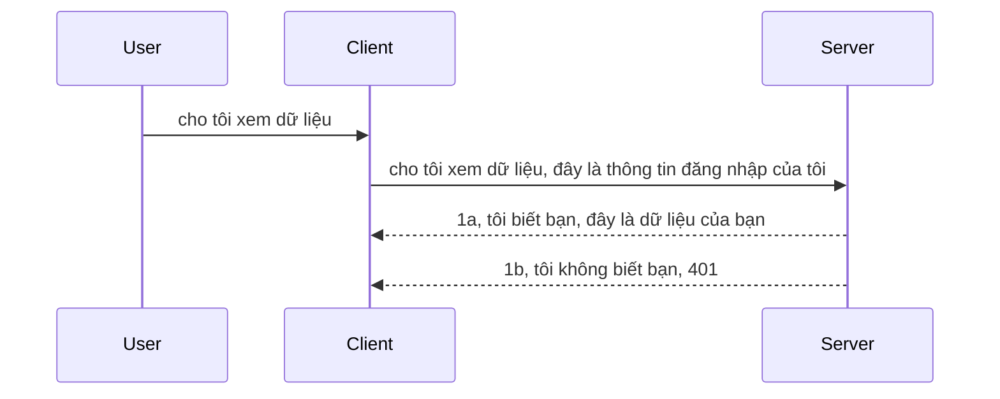

# Simple auth

MCP SDKs hỗ trợ việc sử dụng OAuth 2.1, mà thật ra là một quá trình khá phức tạp liên quan đến các khái niệm như máy chủ xác thực, máy chủ tài nguyên, gửi thông tin đăng nhập, lấy mã, đổi mã lấy token kiểu bearer cho đến khi cuối cùng bạn có thể lấy được dữ liệu tài nguyên của mình. Nếu bạn chưa quen với OAuth, đây là một thứ rất hay để triển khai, vì vậy tốt hơn bạn nên bắt đầu với một mức độ xác thực cơ bản và dần dần xây dựng lên các bảo mật ngày càng tốt hơn. Đó là lý do chương này tồn tại, để giúp bạn tiến tới xác thực nâng cao hơn.

## Xác thực, chúng ta đang nói về điều gì?

Xác thực là viết tắt của authentication và authorization. Ý tưởng là chúng ta cần làm hai việc:

- **Authentication**, đó là quá trình xác định liệu chúng ta có cho phép một người vào nhà mình hay không, rằng người đó có quyền “ở đây” tức là có quyền truy cập vào máy chủ tài nguyên nơi các tính năng MCP Server của chúng ta hoạt động.
- **Authorization**, là quá trình xác minh xem người dùng có nên được truy cập vào những tài nguyên cụ thể mà họ yêu cầu hay không, ví dụ như những đơn hàng này hoặc những sản phẩm này hoặc liệu họ chỉ được phép đọc nội dung nhưng không được phép xóa như một ví dụ khác.

## Thông tin đăng nhập: cách chúng ta nói với hệ thống rằng ta là ai

Chà, hầu hết các nhà phát triển web ngoài kia đều bắt đầu nghĩ theo hướng cung cấp một thông tin đăng nhập đến máy chủ, thường là một bí mật nói rằng họ có được phép ở đây hay không “Authentication”. Thông tin đăng nhập này thường là phiên bản mã hóa base64 của tên người dùng và mật khẩu hoặc một API key nhận dạng duy nhất một người dùng cụ thể.

Điều này bao gồm gửi nó qua header gọi là "Authorization" như sau:

```json
{ "Authorization": "secret123" }
```

Đây thường được gọi là xác thực cơ bản (basic authentication). Luồng tổng thể hoạt động như sau:


Bây giờ chúng ta đã hiểu cách nó hoạt động từ góc độ luồng, vậy làm thế nào ta triển khai? Chà, hầu hết các máy chủ web đều có khái niệm middleware, một đoạn mã chạy như một phần của yêu cầu có thể xác minh thông tin đăng nhập, và nếu thông tin đăng nhập hợp lệ thì cho phép yêu cầu đi tiếp. Nếu yêu cầu không có thông tin hợp lệ thì bạn sẽ nhận được lỗi xác thực. Hãy xem cách triển khai điều này:

**Python**

```python
class AuthMiddleware(BaseHTTPMiddleware):
    async def dispatch(self, request, call_next):

        has_header = request.headers.get("Authorization")
        if not has_header:
            print("-> Missing Authorization header!")
            return Response(status_code=401, content="Unauthorized")

        if not valid_token(has_header):
            print("-> Invalid token!")
            return Response(status_code=403, content="Forbidden")

        print("Valid token, proceeding...")
       
        response = await call_next(request)
        # thêm bất kỳ tiêu đề khách hàng nào hoặc thay đổi phản hồi theo một cách nào đó
        return response


starlette_app.add_middleware(CustomHeaderMiddleware)
```

Ở đây ta có:

- Tạo một middleware tên là `AuthMiddleware` nơi phương thức `dispatch` của nó được máy chủ web gọi.
- Thêm middleware vào máy chủ web:

    ```python
    starlette_app.add_middleware(AuthMiddleware)
    ```

- Viết logic xác thực kiểm tra xem header Authorization có tồn tại không và bí mật được gửi có hợp lệ không:

    ```python
    has_header = request.headers.get("Authorization")
    if not has_header:
        print("-> Missing Authorization header!")
        return Response(status_code=401, content="Unauthorized")

    if not valid_token(has_header):
        print("-> Invalid token!")
        return Response(status_code=403, content="Forbidden")
    ```

    nếu bí mật tồn tại và hợp lệ thì ta cho phép yêu cầu đi tiếp bằng cách gọi `call_next` và trả về phản hồi.

    ```python
    response = await call_next(request)
    # thêm bất kỳ tiêu đề khách hàng nào hoặc thay đổi phản hồi theo một cách nào đó
    return response
    ```

Cách hoạt động là nếu có một yêu cầu web gửi đến máy chủ thì middleware sẽ được gọi và với cách triển khai, nó sẽ cho phép yêu cầu đi tiếp hoặc cuối cùng trả về lỗi cho biết client không được phép tiếp tục.

**TypeScript**

Ở đây chúng ta tạo một middleware với framework phổ biến Express và chặn yêu cầu trước khi nó đến MCP Server. Đây là mã cho việc đó:

```typescript
function isValid(secret) {
    return secret === "secret123";
}

app.use((req, res, next) => {
    // 1. Có tiêu đề ủy quyền không?
    if(!req.headers["Authorization"]) {
        res.status(401).send('Unauthorized');
    }
    
    let token = req.headers["Authorization"];

    // 2. Kiểm tra tính hợp lệ.
    if(!isValid(token)) {
        res.status(403).send('Forbidden');
    }

   
    console.log('Middleware executed');
    // 3. Chuyển yêu cầu đến bước tiếp theo trong quy trình xử lý yêu cầu.
    next();
});
```

Trong đoạn mã này chúng ta:

1. Kiểm tra xem header Authorization có được gửi không, nếu không có thì gửi lỗi 401.
2. Đảm bảo thông tin đăng nhập/token hợp lệ, nếu không thì trả về lỗi 403.
3. Cuối cùng cho phép yêu cầu tiếp tục trong pipeline và trả về tài nguyên được yêu cầu.

## Bài tập: Triển khai xác thực

Hãy lấy kiến thức và thử triển khai. Kế hoạch như sau:

Server

- Tạo một máy chủ web và thể hiện MCP.
- Triển khai một middleware cho máy chủ.

Client

- Gửi yêu cầu web, kèm thông tin đăng nhập, qua header.

### -1- Tạo một máy chủ web và thể hiện MCP

Ở bước đầu tiên, chúng ta cần tạo thể hiện máy chủ web và MCP Server.

**Python**

Ở đây ta tạo một thể hiện MCP server, tạo một ứng dụng web starlette và chạy nó với uvicorn.

```python
# tạo máy chủ MCP

app = FastMCP(
    name="MCP Resource Server",
    instructions="Resource Server that validates tokens via Authorization Server introspection",
    host=settings["host"],
    port=settings["port"],
    debug=True
)

# tạo ứng dụng web starlette
starlette_app = app.streamable_http_app()

# phục vụ ứng dụng qua uvicorn
async def run(starlette_app):
    import uvicorn
    config = uvicorn.Config(
            starlette_app,
            host=app.settings.host,
            port=app.settings.port,
            log_level=app.settings.log_level.lower(),
        )
    server = uvicorn.Server(config)
    await server.serve()

run(starlette_app)
```

Trong đoạn mã này ta:

- Tạo MCP Server.
- Xây dựng ứng dụng web starlette từ MCP Server, `app.streamable_http_app()`.
- Chạy và phục vụ ứng dụng web bằng uvicorn `server.serve()`.

**TypeScript**

Ở đây ta tạo một thể hiện MCP Server.

```typescript
const server = new McpServer({
      name: "example-server",
      version: "1.0.0"
    });

    // ... thiết lập tài nguyên máy chủ, công cụ và lời nhắc ...
```

Việc tạo MCP Server này sẽ cần được thực hiện trong định nghĩa route POST /mcp của chúng ta, vậy hãy lấy đoạn mã trên và di chuyển nó như sau:

```typescript
import express from "express";
import { randomUUID } from "node:crypto";
import { McpServer } from "@modelcontextprotocol/sdk/server/mcp.js";
import { StreamableHTTPServerTransport } from "@modelcontextprotocol/sdk/server/streamableHttp.js";
import { isInitializeRequest } from "@modelcontextprotocol/sdk/types.js"

const app = express();
app.use(express.json());

// Bản đồ để lưu trữ các phương tiện truyền tải theo ID phiên
const transports: { [sessionId: string]: StreamableHTTPServerTransport } = {};

// Xử lý các yêu cầu POST cho giao tiếp từ client đến server
app.post('/mcp', async (req, res) => {
  // Kiểm tra ID phiên đã tồn tại
  const sessionId = req.headers['mcp-session-id'] as string | undefined;
  let transport: StreamableHTTPServerTransport;

  if (sessionId && transports[sessionId]) {
    // Tái sử dụng phương tiện truyền tải hiện có
    transport = transports[sessionId];
  } else if (!sessionId && isInitializeRequest(req.body)) {
    // Yêu cầu khởi tạo mới
    transport = new StreamableHTTPServerTransport({
      sessionIdGenerator: () => randomUUID(),
      onsessioninitialized: (sessionId) => {
        // Lưu trữ phương tiện truyền tải theo ID phiên
        transports[sessionId] = transport;
      },
      // Bảo vệ DNS rebinding mặc định bị vô hiệu hóa để tương thích với các phiên bản trước. Nếu bạn đang chạy máy chủ này
      // cục bộ, hãy chắc chắn thiết lập:
      // enableDnsRebindingProtection: true,
      // allowedHosts: ['127.0.0.1'],
    });

    // Dọn dẹp phương tiện truyền tải khi đóng
    transport.onclose = () => {
      if (transport.sessionId) {
        delete transports[transport.sessionId];
      }
    };
    const server = new McpServer({
      name: "example-server",
      version: "1.0.0"
    });

    // ... thiết lập tài nguyên máy chủ, công cụ và các lời nhắc ...

    // Kết nối tới máy chủ MCP
    await server.connect(transport);
  } else {
    // Yêu cầu không hợp lệ
    res.status(400).json({
      jsonrpc: '2.0',
      error: {
        code: -32000,
        message: 'Bad Request: No valid session ID provided',
      },
      id: null,
    });
    return;
  }

  // Xử lý yêu cầu
  await transport.handleRequest(req, res, req.body);
});

// Bộ xử lý có thể tái sử dụng cho các yêu cầu GET và DELETE
const handleSessionRequest = async (req: express.Request, res: express.Response) => {
  const sessionId = req.headers['mcp-session-id'] as string | undefined;
  if (!sessionId || !transports[sessionId]) {
    res.status(400).send('Invalid or missing session ID');
    return;
  }
  
  const transport = transports[sessionId];
  await transport.handleRequest(req, res);
};

// Xử lý các yêu cầu GET cho thông báo từ server đến client qua SSE
app.get('/mcp', handleSessionRequest);

// Xử lý các yêu cầu DELETE để kết thúc phiên làm việc
app.delete('/mcp', handleSessionRequest);

app.listen(3000);
```

Bây giờ bạn thấy việc tạo MCP Server đã được đưa vào trong `app.post("/mcp")`.

Hãy chuyển sang bước tiếp theo là tạo middleware để chúng ta có thể xác thực thông tin đăng nhập đến.

### -2- Triển khai middleware cho máy chủ

Hãy đến phần middleware tiếp theo. Ở đây ta sẽ tạo middleware tìm kiếm thông tin đăng nhập trong header `Authorization` và xác thực nó. Nếu hợp lệ thì yêu cầu sẽ được tiếp tục làm việc cần thiết (ví dụ liệt kê công cụ, đọc tài nguyên hoặc bất cứ chức năng MCP nào mà client yêu cầu).

**Python**

Để tạo middleware, chúng ta cần tạo một lớp kế thừa từ `BaseHTTPMiddleware`. Có hai phần quan trọng:

- Yêu cầu `request`, nơi ta đọc thông tin header.
- `call_next` là callback mà ta cần gọi nếu client đã gửi thông tin đăng nhập mà ta chấp nhận.

Đầu tiên, ta cần xử lý trường hợp header `Authorization` bị thiếu:

```python
has_header = request.headers.get("Authorization")

# không có tiêu đề, trả về lỗi 401, nếu không tiếp tục.
if not has_header:
    print("-> Missing Authorization header!")
    return Response(status_code=401, content="Unauthorized")
```

Ở đây ta gửi thông báo 401 unauthorized vì client không qua được xác thực.

Tiếp theo, nếu có gửi thông tin đăng nhập, ta cần kiểm tra tính hợp lệ như sau:

```python
 if not valid_token(has_header):
    print("-> Invalid token!")
    return Response(status_code=403, content="Forbidden")
```

Lưu ý cách ta gửi thông báo 403 forbidden phía trên. Hãy xem toàn bộ middleware dưới đây triển khai tất cả những gì ta vừa nói:

```python
class AuthMiddleware(BaseHTTPMiddleware):
    async def dispatch(self, request, call_next):

        has_header = request.headers.get("Authorization")
        if not has_header:
            print("-> Missing Authorization header!")
            return Response(status_code=401, content="Unauthorized")

        if not valid_token(has_header):
            print("-> Invalid token!")
            return Response(status_code=403, content="Forbidden")

        print("Valid token, proceeding...")
        print(f"-> Received {request.method} {request.url}")
        response = await call_next(request)
        response.headers['Custom'] = 'Example'
        return response

```

Tuyệt vời, còn hàm `valid_token` là gì? Đây là hàm đó:
:

```python
# KHÔNG sử dụng cho sản xuất - cải thiện nó !!
def valid_token(token: str) -> bool:
    # xóa bỏ tiền tố "Bearer "
    if token.startswith("Bearer "):
        token = token[7:]
        return token == "secret-token"
    return False
```

Điều này tất nhiên có thể cải thiện.

QUAN TRỌNG: Bạn KHÔNG BAO GIỜ nên để bí mật như thế này trong mã nguồn. Lý tưởng là bạn nên lấy giá trị so sánh từ nguồn dữ liệu hoặc từ một nhà cung cấp dịch vụ định danh (IDP) hoặc tốt hơn nữa, để IDP đảm nhận việc xác thực.

**TypeScript**

Để triển khai với Express, ta cần gọi phương thức `use` để thêm các hàm middleware.

Chúng ta cần:

- Tương tác với biến request để kiểm tra thông tin đăng nhập qua thuộc tính `Authorization`.
- Xác thực thông tin đăng nhập, nếu hợp lệ thì cho phép yêu cầu tiếp tục và MCP request của client được xử lý đúng chức năng (ví dụ liệt kê công cụ, đọc tài nguyên hoặc bất cứ điều gì có liên quan đến MCP).

Ở đây, chúng ta kiểm tra xem header `Authorization` có tồn tại không, nếu không thì dừng yêu cầu lại:

```typescript
if(!req.headers["authorization"]) {
    res.status(401).send('Unauthorized');
    return;
}
```

Nếu header không được gửi ngay từ đầu, bạn nhận lỗi 401.

Tiếp theo, ta kiểm tra nếu thông tin đăng nhập không hợp lệ, ta cũng dừng yêu cầu nhưng với thông điệp khác:

```typescript
if(!isValid(token)) {
    res.status(403).send('Forbidden');
    return;
} 
```

Bạn sẽ nhận được lỗi 403 lúc này.

Đây là toàn bộ mã:

```typescript
app.use((req, res, next) => {
    console.log('Request received:', req.method, req.url, req.headers);
    console.log('Headers:', req.headers["authorization"]);
    if(!req.headers["authorization"]) {
        res.status(401).send('Unauthorized');
        return;
    }
    
    let token = req.headers["authorization"];

    if(!isValid(token)) {
        res.status(403).send('Forbidden');
        return;
    }  

    console.log('Middleware executed');
    next();
});
```

Chúng ta đã cấu hình máy chủ web để chấp nhận middleware kiểm tra thông tin đăng nhập mà client gửi. Còn client thì sao?

### -3- Gửi yêu cầu web kèm thông tin đăng nhập qua header

Chúng ta cần đảm bảo client gửi thông tin đăng nhập qua header. Khi ta dùng MCP client để làm việc này, ta cần biết cách làm như thế nào.

**Python**

Đối với client, ta cần truyền header kèm thông tin đăng nhập như sau:

```python
# ĐỪNG mã hóa cứng giá trị, ít nhất hãy để nó trong biến môi trường hoặc bộ nhớ an toàn hơn
token = "secret-token"

async with streamablehttp_client(
        url = f"http://localhost:{port}/mcp",
        headers = {"Authorization": f"Bearer {token}"}
    ) as (
        read_stream,
        write_stream,
        session_callback,
    ):
        async with ClientSession(
            read_stream,
            write_stream
        ) as session:
            await session.initialize()
      
            # TODO, bạn muốn làm gì trên client, ví dụ liệt kê công cụ, gọi công cụ v.v.
```

Lưu ý cách ta điền thuộc tính `headers` như ` headers = {"Authorization": f"Bearer {token}"}`.

**TypeScript**

Ta có thể giải quyết việc này trong hai bước:

1. Tạo một đối tượng cấu hình kèm thông tin đăng nhập.
2. Truyền đối tượng cấu hình vào transport.

```typescript

// ĐỪNG mã hóa cứng giá trị như được hiển thị ở đây. Tối thiểu hãy để nó dưới dạng biến môi trường và sử dụng cái gì đó như dotenv (trong chế độ phát triển).
let token = "secret123"

// định nghĩa một đối tượng tùy chọn giao vận khách hàng
let options: StreamableHTTPClientTransportOptions = {
  sessionId: sessionId,
  requestInit: {
    headers: {
      "Authorization": "secret123"
    }
  }
};

// truyền đối tượng tùy chọn vào giao vận
async function main() {
   const transport = new StreamableHTTPClientTransport(
      new URL(serverUrl),
      options
   );
```

Ở đây bạn thấy cách chúng ta tạo đối tượng `options` và đặt headers vào thuộc tính `requestInit`.

QUAN TRỌNG: Vậy làm thế nào để cải thiện từ đây? Phiên bản hiện tại còn một số vấn đề. Trước hết, truyền thông tin đăng nhập kiểu này khá rủi ro trừ khi ít nhất bạn có HTTPS. Thậm chí vậy, thông tin đăng nhập vẫn có thể bị đánh cắp nên bạn cần một hệ thống có thể thu hồi token dễ dàng và bổ sung các kiểm tra như token đến từ đâu trên thế giới, yêu cầu có quá thường xuyên không (hành vi dạng bot), nói tóm lại có rất nhiều mối quan tâm khác nhau.

Tuy nhiên, nên nói rằng với các API rất đơn giản mà bạn không muốn ai cũng gọi API mà không xác thực, thì những gì ta có ở đây là một khởi đầu tốt.

Với điều đó đã nói, hãy thử nâng cao bảo mật một chút bằng cách sử dụng một định dạng chuẩn hóa như JSON Web Token, còn gọi là JWT hoặc token "JOT".

## JSON Web Tokens, JWT

Vậy, chúng ta cố gắng cải thiện việc gửi thông tin đăng nhập rất đơn giản. Những cải tiến ngay lập tức mà ta có được khi dùng JWT là gì?

- **Cải tiến bảo mật**. Trong basic auth, bạn gửi tên người dùng và mật khẩu đã mã hóa base64 (hoặc API key) đi đi lại lại, điều này làm tăng rủi ro. Với JWT, bạn gửi tên người dùng và mật khẩu một lần để lấy token và token này còn có thời hạn, nghĩa là sẽ hết hạn. JWT cho phép bạn sử dụng kiểm soát truy cập chi tiết với vai trò, phạm vi và quyền hạn.
- **Không trạng thái và khả năng mở rộng**. JWT tự chứa dữ liệu người dùng và loại bỏ nhu cầu lưu trữ phiên phía server. Token cũng có thể xác thực cục bộ.
- **Khả năng tương tác và liên kết**. JWT là trung tâm của Open ID Connect và được dùng với các nhà cung cấp định danh như Entra ID, Google Identity và Auth0. Chúng cũng làm cho việc đăng nhập một lần (SSO) và nhiều thứ khác trở nên khả thi, đem lại chuẩn doanh nghiệp.
- **Tính mô đun và linh hoạt**. JWT có thể dùng với API Gateway như Azure API Management, NGINX và hơn thế nữa. Nó hỗ trợ kịch bản xác thực người dùng và giao tiếp server-đến-service, bao gồm giả danh và ủy quyền.
- **Hiệu năng và lưu cache**. JWT có thể cache sau khi giải mã làm giảm nhu cầu phân tích lại. Điều này đặc biệt hỗ trợ các ứng dụng có lưu lượng cao vì cải thiện hiệu suất và giảm tải hạ tầng.
- **Tính năng nâng cao**. Nó cũng hỗ trợ introspection (kiểm tra tính hợp lệ tại server) và revocation (thu hồi token).

Với tất cả các lợi ích này, hãy xem cách ta có thể nâng cấp triển khai hiện tại lên mức tiếp theo.

## Biến basic auth thành JWT

Vậy, những thay đổi ở mức cao ta cần làm là:

- **Học cách tạo token JWT** và chuẩn bị nó để gửi từ client lên server.
- **Xác thực token JWT**, nếu hợp lệ thì cho client truy cập tài nguyên của ta.
- **Lưu trữ token an toàn**. Cách ta lưu token này.
- **Bảo vệ các route**. Ta cần bảo vệ các route, ở trường hợp này bảo vệ các route và những tính năng MCP cụ thể.
- **Thêm refresh tokens**. Đảm bảo tạo token ngắn hạn nhưng có refresh token dài hạn để lấy token mới khi token hết hạn. Đồng thời có endpoint làm mới token và chiến lược xoay vòng.

### -1- Tạo token JWT

Đầu tiên, token JWT gồm các phần:

- **header**, thuật toán sử dụng và loại token.
- **payload**, các claims, như sub (người dùng hoặc thực thể token đại diện. Trong scenario xác thực thường là user id), exp (khi token hết hạn), role (vai trò)
- **signature**, ký với bí mật hoặc khóa riêng tư.

Cho việc này ta cần tạo header, payload và token đã mã hóa.

**Python**

```python

import jwt
import jwt
from jwt.exceptions import ExpiredSignatureError, InvalidTokenError
import datetime

# Khóa bí mật dùng để ký JWT
secret_key = 'your-secret-key'

header = {
    "alg": "HS256",
    "typ": "JWT"
}

# thông tin người dùng cùng các quyền và thời gian hết hạn
payload = {
    "sub": "1234567890",               # Chủ đề (ID người dùng)
    "name": "User Userson",                # Quyền tùy chỉnh
    "admin": True,                     # Quyền tùy chỉnh
    "iat": datetime.datetime.utcnow(),# Thời gian phát hành
    "exp": datetime.datetime.utcnow() + datetime.timedelta(hours=1)  # Thời gian hết hạn
}

# mã hóa nó
encoded_jwt = jwt.encode(payload, secret_key, algorithm="HS256", headers=header)
```

Trong đoạn mã trên ta đã:

- Định nghĩa header dùng thuật toán HS256 và kiểu là JWT.
- Tạo payload chứa subject hoặc user id, tên người dùng, vai trò, thời điểm phát hành và thời điểm hết hạn, thể hiện tính chất có thời hạn như đã đề cập.

**TypeScript**

Ở đây ta sẽ cần một số dependencies giúp tạo token JWT.

Dependencies

```sh

npm install jsonwebtoken
npm install --save-dev @types/jsonwebtoken
```

Giờ có sẵn thì ta tạo header, payload và qua đó tạo token đã mã hóa.

```typescript
import jwt from 'jsonwebtoken';

const secretKey = 'your-secret-key'; // Sử dụng biến môi trường trong môi trường sản xuất

// Định nghĩa payload
const payload = {
  sub: '1234567890',
  name: 'User usersson',
  admin: true,
  iat: Math.floor(Date.now() / 1000), // Được phát hành lúc
  exp: Math.floor(Date.now() / 1000) + 60 * 60 // Hết hạn trong 1 giờ
};

// Định nghĩa header (tùy chọn, jsonwebtoken đặt mặc định)
const header = {
  alg: 'HS256',
  typ: 'JWT'
};

// Tạo token
const token = jwt.sign(payload, secretKey, {
  algorithm: 'HS256',
  header: header
});

console.log('JWT:', token);
```

Token này:

Ký bằng HS256  
Hợp lệ trong 1 giờ  
Bao gồm claims như sub, name, admin, iat, exp.

### -2- Xác thực token

Ta cũng cần xác thực token, điều này nên làm trên server để chắc chắn token client gửi là hợp lệ. Có nhiều kiểm tra cần làm, từ xác thực cấu trúc tới tính hợp lệ. Bạn cũng nên thêm các kiểm tra khác như xem user có tồn tại trong hệ thống và có quyền token khẳng định không.

Để xác thực token, ta cần decode để đọc và bắt đầu kiểm tra tính hợp lệ:

**Python**

```python

# Giải mã và xác minh JWT
try:
    decoded = jwt.decode(token, secret_key, algorithms=["HS256"])
    print("✅ Token is valid.")
    print("Decoded claims:")
    for key, value in decoded.items():
        print(f"  {key}: {value}")
except ExpiredSignatureError:
    print("❌ Token has expired.")
except InvalidTokenError as e:
    print(f"❌ Invalid token: {e}")

```

Trong đoạn mã này, ta gọi `jwt.decode` với token, khóa bí mật và thuật toán đã chọn. Lưu ý ta dùng try-catch vì xác thực thất bại sẽ gây lỗi.

**TypeScript**

Ở đây ta gọi `jwt.verify` để nhận phiên bản token đã giải mã để phân tích thêm. Nếu gọi không thành công, nghĩa là cấu trúc token sai hoặc token hết hiệu lực.

```typescript

try {
  const decoded = jwt.verify(token, secretKey);
  console.log('Decoded Payload:', decoded);
} catch (err) {
  console.error('Token verification failed:', err);
}
```

LƯU Ý: như đã nói ở trên, bạn nên thực hiện thêm các kiểm tra để đảm bảo token trỏ tới user trong hệ thống và người dùng có quyền phù hợp.
Tiếp theo, hãy cùng tìm hiểu về kiểm soát truy cập dựa trên vai trò, còn được gọi là RBAC.

## Thêm kiểm soát truy cập dựa trên vai trò

Ý tưởng là chúng ta muốn biểu đạt rằng các vai trò khác nhau có các quyền khác nhau. Ví dụ, chúng ta giả sử một admin có thể làm mọi thứ và một người dùng bình thường có thể đọc/ghi và một khách chỉ có thể đọc. Do đó, đây là một số mức quyền khả thi:

- Admin.Write  
- User.Read  
- Guest.Read  

Hãy xem cách chúng ta có thể triển khai kiểm soát như vậy với middleware. Middleware có thể được thêm vào từng route cũng như cho tất cả các route.

**Python**

```python
from starlette.middleware.base import BaseHTTPMiddleware
from starlette.responses import JSONResponse
import jwt

# KHÔNG được để bí mật trong mã như thế này, đây chỉ là để minh họa. Hãy đọc nó từ một nơi an toàn.
SECRET_KEY = "your-secret-key" # đặt điều này vào biến môi trường
REQUIRED_PERMISSION = "User.Read"

class JWTPermissionMiddleware(BaseHTTPMiddleware):
    async def dispatch(self, request, call_next):
        auth_header = request.headers.get("Authorization")
        if not auth_header or not auth_header.startswith("Bearer "):
            return JSONResponse({"error": "Missing or invalid Authorization header"}, status_code=401)

        token = auth_header.split(" ")[1]
        try:
            decoded = jwt.decode(token, SECRET_KEY, algorithms=["HS256"])
        except jwt.ExpiredSignatureError:
            return JSONResponse({"error": "Token expired"}, status_code=401)
        except jwt.InvalidTokenError:
            return JSONResponse({"error": "Invalid token"}, status_code=401)

        permissions = decoded.get("permissions", [])
        if REQUIRED_PERMISSION not in permissions:
            return JSONResponse({"error": "Permission denied"}, status_code=403)

        request.state.user = decoded
        return await call_next(request)


```
  
Có một vài cách khác nhau để thêm middleware như dưới đây:

```python

# Cách 1: thêm middleware trong khi xây dựng ứng dụng starlette
middleware = [
    Middleware(JWTPermissionMiddleware)
]

app = Starlette(routes=routes, middleware=middleware)

# Cách 2: thêm middleware sau khi ứng dụng starlette đã được xây dựng
starlette_app.add_middleware(JWTPermissionMiddleware)

# Cách 3: thêm middleware cho mỗi tuyến đường
routes = [
    Route(
        "/mcp",
        endpoint=..., # trình xử lý
        middleware=[Middleware(JWTPermissionMiddleware)]
    )
]
```
  
**TypeScript**

Chúng ta có thể dùng `app.use` và một middleware sẽ chạy cho tất cả các yêu cầu.

```typescript
app.use((req, res, next) => {
    console.log('Request received:', req.method, req.url, req.headers);
    console.log('Headers:', req.headers["authorization"]);

    // 1. Kiểm tra xem tiêu đề ủy quyền đã được gửi chưa

    if(!req.headers["authorization"]) {
        res.status(401).send('Unauthorized');
        return;
    }
    
    let token = req.headers["authorization"];

    // 2. Kiểm tra xem token có hợp lệ không
    if(!isValid(token)) {
        res.status(403).send('Forbidden');
        return;
    }  

    // 3. Kiểm tra xem người dùng token có tồn tại trong hệ thống của chúng tôi không
    if(!isExistingUser(token)) {
        res.status(403).send('Forbidden');
        console.log("User does not exist");
        return;
    }
    console.log("User exists");

    // 4. Xác minh token có quyền thích hợp không
    if(!hasScopes(token, ["User.Read"])){
        res.status(403).send('Forbidden - insufficient scopes');
    }

    console.log("User has required scopes");

    console.log('Middleware executed');
    next();
});

```
  
Có khá nhiều việc chúng ta có thể và middleware của chúng ta NÊN làm, cụ thể:

1. Kiểm tra xem header ủy quyền có tồn tại hay không  
2. Kiểm tra xem token có hợp lệ không, chúng ta gọi `isValid` là một phương thức chúng ta viết để kiểm tra tính toàn vẹn và hợp lệ của token JWT.  
3. Xác minh người dùng có tồn tại trong hệ thống của chúng ta không, chúng ta nên kiểm tra điều này.

   ```typescript
    // người dùng trong cơ sở dữ liệu
   const users = [
     "user1",
     "User usersson",
   ]

   function isExistingUser(token) {
     let decodedToken = verifyToken(token);

     // TODO, kiểm tra xem người dùng có tồn tại trong cơ sở dữ liệu không
     return users.includes(decodedToken?.name || "");
   }
   ```
  
   Ở trên, chúng ta đã tạo một danh sách `users` rất đơn giản, thực ra nên nằm trong cơ sở dữ liệu.

4. Ngoài ra, chúng ta cũng nên kiểm tra token có quyền phù hợp hay không.

   ```typescript
   if(!hasScopes(token, ["User.Read"])){
        res.status(403).send('Forbidden - insufficient scopes');
   }
   ```
  
   Trong đoạn mã phía trên từ middleware, chúng ta kiểm tra token có quyền User.Read, nếu không sẽ gửi lỗi 403. Dưới đây là phương thức trợ giúp `hasScopes`.

   ```typescript
   function hasScopes(scope: string, requiredScopes: string[]) {
     let decodedToken = verifyToken(scope);
    return requiredScopes.every(scope => decodedToken?.scopes.includes(scope));
  }  
   ```

Have a think which additional checks you should be doing, but these are the absolute minimum of checks you should be doing.

Using Express as a web framework is a common choice. There are helpers library when you use JWT so you can write less code.

- `express-jwt`, helper library that provides a middleware that helps decode your token.
- `express-jwt-permissions`, this provides a middleware `guard` that helps check if a certain permission is on the token.

Here's what these libraries can look like when used:

```typescript
const express = require('express');
const jwt = require('express-jwt');
const guard = require('express-jwt-permissions')();

const app = express();
const secretKey = 'your-secret-key'; // put this in env variable

// Decode JWT and attach to req.user
app.use(jwt({ secret: secretKey, algorithms: ['HS256'] }));

// Check for User.Read permission
app.use(guard.check('User.Read'));

// multiple permissions
// app.use(guard.check(['User.Read', 'Admin.Access']));

app.get('/protected', (req, res) => {
  res.json({ message: `Welcome ${req.user.name}` });
});

// Error handler
app.use((err, req, res, next) => {
  if (err.code === 'permission_denied') {
    return res.status(403).send('Forbidden');
  }
  next(err);
});

```
  
Bây giờ bạn đã thấy cách middleware có thể dùng cho cả xác thực và ủy quyền, còn MCP thì sao, nó có làm thay đổi cách chúng ta thực hiện xác thực không? Hãy cùng tìm hiểu phần tiếp theo.

### -3- Thêm RBAC cho MCP

Bạn đã thấy cách thêm RBAC qua middleware, tuy nhiên, đối với MCP không có cách đơn giản để thêm RBAC cho từng tính năng MCP, vậy chúng ta làm gì? Chúng ta chỉ cần thêm đoạn mã như thế này để kiểm tra trong trường hợp này liệu client có quyền gọi một công cụ cụ thể hay không:

Bạn có một số lựa chọn khác nhau để thực hiện RBAC theo từng tính năng, ví dụ như:

- Thêm kiểm tra cho từng công cụ, tài nguyên, prompt nơi bạn cần kiểm tra cấp độ quyền.

   **python**

   ```python
   @tool()
   def delete_product(id: int):
      try:
          check_permissions(role="Admin.Write", request)
      catch:
        pass # khách hàng xác thực không thành công, phát sinh lỗi xác thực
   ```
  
   **typescript**

   ```typescript
   server.registerTool(
    "delete-product",
    {
      title: Delete a product",
      description: "Deletes a product",
      inputSchema: { id: z.number() }
    },
    async ({ id }) => {
      
      try {
        checkPermissions("Admin.Write", request);
        // làm, gửi id đến productService và đầu vào từ xa
      } catch(Exception e) {
        console.log("Authorization error, you're not allowed");  
      }

      return {
        content: [{ type: "text", text: `Deletected product with id ${id}` }]
      };
    }
   );
   ```


- Sử dụng phương pháp server nâng cao và các bộ xử lý yêu cầu để giảm thiểu số nơi bạn cần thực hiện kiểm tra.

   **Python**

   ```python
   
   tool_permission = {
      "create_product": ["User.Write", "Admin.Write"],
      "delete_product": ["Admin.Write"]
   }

   def has_permission(user_permissions, required_permissions) -> bool:
      # user_permissions: danh sách các quyền mà người dùng có
      # required_permissions: danh sách các quyền cần thiết cho công cụ
      return any(perm in user_permissions for perm in required_permissions)

   @server.call_tool()
   async def handle_call_tool(
     name: str, arguments: dict[str, str] | None
   ) -> list[types.TextContent]:
    # Giả sử request.user.permissions là danh sách các quyền của người dùng
     user_permissions = request.user.permissions
     required_permissions = tool_permission.get(name, [])
     if not has_permission(user_permissions, required_permissions):
        # Ném lỗi "Bạn không có quyền gọi công cụ {name}"
        raise Exception(f"You don't have permission to call tool {name}")
     # tiếp tục và gọi công cụ
     # ...
   ```   
   

   **TypeScript**

   ```typescript
   function hasPermission(userPermissions: string[], requiredPermissions: string[]): boolean {
       if (!Array.isArray(userPermissions) || !Array.isArray(requiredPermissions)) return false;
       // Trả về true nếu người dùng có ít nhất một quyền cần thiết
       
       return requiredPermissions.some(perm => userPermissions.includes(perm));
   }
  
   server.setRequestHandler(CallToolRequestSchema, async (request) => {
      const { params: { name } } = request;
  
      let permissions = request.user.permissions;
  
      if (!hasPermission(permissions, toolPermissions[name])) {
         return new Error(`You don't have permission to call ${name}`);
      }
  
      // tiếp tục..
   });
   ```
  
   Lưu ý, bạn cần đảm bảo middleware gán token đã giải mã cho thuộc tính user của request để đoạn mã trên được đơn giản.

### Tổng kết

Bây giờ chúng ta đã thảo luận cách thêm hỗ trợ RBAC nói chung và cho MCP nói riêng, đã đến lúc bạn thử tự thực hiện bảo mật để đảm bảo bạn hiểu các khái niệm đã trình bày.

## Bài tập 1: Xây dựng server mcp và client mcp sử dụng xác thực cơ bản

Ở đây bạn sẽ áp dụng những gì đã học về việc gửi thông tin đăng nhập qua headers.

## Giải pháp 1

[Solution 1](./code/basic/README.md)

## Bài tập 2: Nâng cấp giải pháp từ Bài tập 1 để sử dụng JWT

Lấy giải pháp đầu tiên nhưng lần này, chúng ta sẽ cải tiến nó.

Thay vì sử dụng Basic Auth, hãy dùng JWT.

## Giải pháp 2

[Solution 2](./solution/jwt-solution/README.md)

## Thử thách

Thêm RBAC cho từng công cụ như mô tả trong phần "Thêm RBAC cho MCP".

## Tóm tắt

Hy vọng bạn đã học được nhiều điều trong chương này, từ không có bảo mật, đến bảo mật cơ bản, đến JWT và cách thêm nó vào MCP.

Chúng ta đã xây dựng một nền tảng vững chắc với JWT tùy chỉnh, nhưng khi mở rộng quy mô, ta hướng tới mô hình định danh dựa trên chuẩn. Áp dụng IdP như Entra hoặc Keycloak cho phép chúng ta chuyển giao việc phát hành token, xác thực và quản lý vòng đời cho một nền tảng đáng tin cậy — từ đó tập trung vào logic ứng dụng và trải nghiệm người dùng.

Cho việc đó, chúng ta có một [chương nâng cao về Entra](../../05-AdvancedTopics/mcp-security-entra/README.md)

## Tiếp theo là gì

- Tiếp theo: [Cài đặt MCP Hosts](../12-mcp-hosts/README.md)

---

<!-- CO-OP TRANSLATOR DISCLAIMER START -->
**Tuyên bố từ chối trách nhiệm**:
Tài liệu này đã được dịch bằng dịch vụ dịch thuật AI [Co-op Translator](https://github.com/Azure/co-op-translator). Mặc dù chúng tôi cố gắng đảm bảo độ chính xác, xin lưu ý rằng bản dịch tự động có thể chứa lỗi hoặc sai sót. Tài liệu gốc bằng ngôn ngữ gốc của nó nên được xem là nguồn chính xác và đáng tin cậy. Đối với thông tin quan trọng, khuyến nghị sử dụng dịch vụ dịch thuật chuyên nghiệp do con người thực hiện. Chúng tôi không chịu trách nhiệm về bất kỳ sự hiểu nhầm hay diễn giải sai nào phát sinh từ việc sử dụng bản dịch này.
<!-- CO-OP TRANSLATOR DISCLAIMER END -->