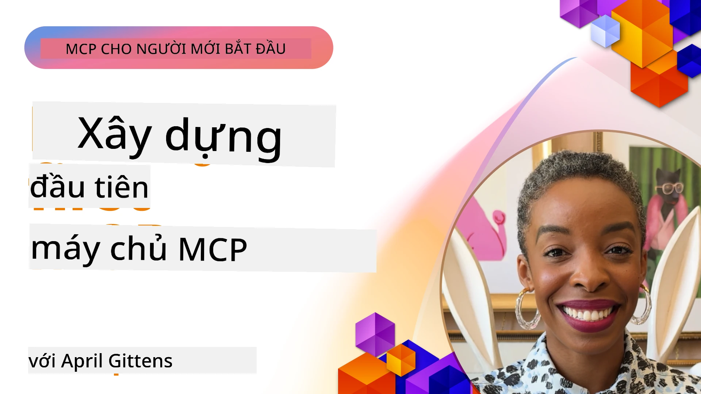

## Bắt đầu  

_(Nhấp vào hình ảnh bên trên để xem video bài học này)_

Phần này bao gồm nhiều bài học:

- **1 Máy chủ đầu tiên của bạn**, trong bài học đầu tiên này, bạn sẽ học cách tạo máy chủ đầu tiên của mình và kiểm tra nó với công cụ kiểm tra, một cách hữu ích để thử nghiệm và gỡ lỗi máy chủ của bạn, [tới bài học](01-first-server/README.md)

- **2 Khách hàng**, trong bài học này, bạn sẽ học cách viết một khách hàng có thể kết nối với máy chủ của bạn, [tới bài học](02-client/README.md)

- **3 Khách hàng với LLM**, một cách viết khách hàng tốt hơn nữa là thêm một LLM vào đó để nó có thể "đàm phán" với máy chủ của bạn về việc cần làm gì, [tới bài học](03-llm-client/README.md)

- **4 Sử dụng chế độ GitHub Copilot Agent trên Visual Studio Code cho máy chủ**. Ở đây, chúng ta sẽ xem xét cách chạy Máy chủ MCP từ bên trong Visual Studio Code, [tới bài học](04-vscode/README.md)

- **5 Máy chủ Giao tiếp stdio** stdio là tiêu chuẩn được khuyến nghị cho giao tiếp máy chủ-client MCP cục bộ, cung cấp giao tiếp dựa trên tiến trình con an toàn với cách biệt tiến trình tích hợp sẵn [tới bài học](05-stdio-server/README.md)

- **6 Phát trực tiếp HTTP với MCP (HTTP có thể phát trực tiếp)**. Tìm hiểu về giao thức phát trực tiếp HTTP hiện đại (phương pháp được khuyến nghị cho các máy chủ MCP từ xa theo [Đặc tả MCP 2025-11-25](https://spec.modelcontextprotocol.io/specification/2025-11-25/basic/transports/#streamable-http)), thông báo tiến trình, và cách triển khai các máy chủ cũng như khách hàng MCP có thể mở rộng và theo thời gian thực sử dụng HTTP có thể phát trực tiếp. [tới bài học](06-http-streaming/README.md)

- **7 Sử dụng Bộ công cụ AI cho VSCode** để tiêu thụ và thử nghiệm các khách và máy chủ MCP của bạn [tới bài học](07-aitk/README.md)

- **8 Kiểm thử**. Ở đây chúng ta sẽ tập trung đặc biệt cách kiểm thử máy chủ và khách hàng ở nhiều cách, [tới bài học](08-testing/README.md)

- **9 Triển khai**. Chương này sẽ xem xét các cách khác nhau để triển khai giải pháp MCP của bạn, [tới bài học](09-deployment/README.md)

- **10 Sử dụng máy chủ nâng cao**. Chương này bao gồm cách sử dụng máy chủ nâng cao, [tới bài học](./10-advanced/README.md)

- **11 Xác thực**. Chương này bao gồm cách thêm xác thực đơn giản, từ Xác thực Cơ bản đến sử dụng JWT và RBAC. Bạn được khuyên nên bắt đầu từ đây rồi tiếp tục xem Chủ đề Nâng cao trong Chương 5 và thực hiện tăng cường bảo mật thêm theo các khuyến nghị trong Chương 2, [tới bài học](./11-simple-auth/README.md)

- **12 MCP Hosts**. Cấu hình và sử dụng các khách MCP phổ biến bao gồm Claude Desktop, Cursor, Cline, và Windsurf. Tìm hiểu các loại giao thức giao tiếp và cách khắc phục sự cố, [tới bài học](./12-mcp-hosts/README.md)

- **13 MCP Inspector**. Gỡ lỗi và kiểm thử các máy chủ MCP tương tác sử dụng công cụ MCP Inspector. Học cách khắc phục công cụ, tài nguyên, và các thông điệp giao thức, [tới bài học](./13-mcp-inspector/README.md)

Model Context Protocol (MCP) là một giao thức mở chuẩn hóa cách ứng dụng cung cấp ngữ cảnh cho LLM. Hãy nghĩ MCP như một cổng USB-C cho các ứng dụng AI - nó cung cấp cách tiêu chuẩn để kết nối mô hình AI với các nguồn dữ liệu và công cụ khác nhau.

## Mục tiêu học tập

Sau khi hoàn thành bài học này, bạn sẽ có khả năng:

- Thiết lập môi trường phát triển cho MCP bằng C#, Java, Python, TypeScript, và JavaScript
- Xây dựng và triển khai máy chủ MCP cơ bản với các tính năng tùy chỉnh (tài nguyên, lời nhắc, và công cụ)
- Tạo ứng dụng chủ kết nối với máy chủ MCP
- Kiểm thử và gỡ lỗi các triển khai MCP
- Hiểu các thách thức thiết lập phổ biến và giải pháp của chúng
- Kết nối các triển khai MCP của bạn với các dịch vụ LLM phổ biến

## Thiết lập môi trường MCP của bạn

Trước khi bắt đầu làm việc với MCP, điều quan trọng là chuẩn bị môi trường phát triển và hiểu quy trình làm việc cơ bản. Phần này sẽ hướng dẫn bạn qua các bước thiết lập ban đầu để đảm bảo khởi đầu suôn sẻ với MCP.

### Yêu cầu trước

Trước khi bắt đầu phát triển MCP, hãy đảm bảo bạn đã có:

- **Môi trường phát triển**: Cho ngôn ngữ bạn chọn (C#, Java, Python, TypeScript hoặc JavaScript)
- **IDE/Biên tập**: Visual Studio, Visual Studio Code, IntelliJ, Eclipse, PyCharm hoặc bất kỳ trình soạn thảo mã nguồn hiện đại nào
- **Trình quản lý gói**: NuGet, Maven/Gradle, pip, hoặc npm/yarn
- **Khóa API**: Cho bất kỳ dịch vụ AI nào bạn định sử dụng trong ứng dụng chủ của mình

### SDK chính thức

Trong các chương tới bạn sẽ thấy các giải pháp xây dựng bằng Python, TypeScript, Java và .NET. Dưới đây là tất cả các SDK được hỗ trợ chính thức.

MCP cung cấp SDK chính thức cho nhiều ngôn ngữ (phù hợp với [Đặc tả MCP 2025-11-25](https://spec.modelcontextprotocol.io/specification/2025-11-25/)):
- [C# SDK](https://github.com/modelcontextprotocol/csharp-sdk) - Bảo trì cùng Microsoft
- [Java SDK](https://github.com/modelcontextprotocol/java-sdk) - Bảo trì cùng Spring AI
- [TypeScript SDK](https://github.com/modelcontextprotocol/typescript-sdk) - Triển khai TypeScript chính thức
- [Python SDK](https://github.com/modelcontextprotocol/python-sdk) - Triển khai Python chính thức (FastMCP)
- [Kotlin SDK](https://github.com/modelcontextprotocol/kotlin-sdk) - Triển khai Kotlin chính thức
- [Swift SDK](https://github.com/modelcontextprotocol/swift-sdk) - Bảo trì cùng Loopwork AI
- [Rust SDK](https://github.com/modelcontextprotocol/rust-sdk) - Triển khai Rust chính thức
- [Go SDK](https://github.com/modelcontextprotocol/go-sdk) - Triển khai Go chính thức

## Những điểm chính cần nhớ

- Thiết lập môi trường phát triển MCP rất đơn giản với các SDK riêng cho từng ngôn ngữ
- Xây dựng máy chủ MCP gồm việc tạo và đăng ký các công cụ với các schema rõ ràng
- Khách MCP kết nối với máy chủ và mô hình để tận dụng các khả năng mở rộng
- Kiểm thử và gỡ lỗi là cần thiết để có các triển khai MCP đáng tin cậy
- Các lựa chọn triển khai trải dài từ phát triển cục bộ đến giải pháp dựa trên đám mây

## Luyện tập

Chúng tôi có bộ mẫu bổ trợ cho các bài tập bạn sẽ thấy trong tất cả các chương trong phần này. Ngoài ra mỗi chương cũng có các bài tập và nhiệm vụ riêng

- [Máy tính Java](./samples/java/calculator/README.md)
- [Máy tính .Net](../../../03-GettingStarted/samples/csharp)
- [Máy tính JavaScript](./samples/javascript/README.md)
- [Máy tính TypeScript](./samples/typescript/README.md)
- [Máy tính Python](../../../03-GettingStarted/samples/python)

## Tài nguyên bổ sung

- [Xây dựng Agents sử dụng Model Context Protocol trên Azure](https://learn.microsoft.com/azure/developer/ai/intro-agents-mcp)
- [MCP từ xa với Azure Container Apps (Node.js/TypeScript/JavaScript)](https://learn.microsoft.com/samples/azure-samples/mcp-container-ts/mcp-container-ts/)
- [Agent MCP OpenAI cho .NET](https://learn.microsoft.com/samples/azure-samples/openai-mcp-agent-dotnet/openai-mcp-agent-dotnet/)

## Tiếp theo

Bắt đầu với bài học đầu tiên: [Tạo Máy chủ MCP đầu tiên của bạn](01-first-server/README.md)

Khi bạn hoàn thành module này, tiếp tục đến: [Module 4: Triển khai Thực tế](../04-PracticalImplementation/README.md)

---

<!-- CO-OP TRANSLATOR DISCLAIMER START -->
**Tuyên bố từ chối trách nhiệm**:  
Tài liệu này đã được dịch bằng dịch vụ dịch thuật AI [Co-op Translator](https://github.com/Azure/co-op-translator). Mặc dù chúng tôi nỗ lực để đảm bảo độ chính xác, xin lưu ý rằng bản dịch tự động có thể chứa lỗi hoặc sự không chính xác. Tài liệu gốc bằng ngôn ngữ bản địa của nó nên được coi là nguồn tin chính xác và có thẩm quyền. Đối với những thông tin quan trọng, nên sử dụng dịch vụ dịch thuật chuyên nghiệp do con người thực hiện. Chúng tôi không chịu trách nhiệm về bất kỳ sự hiểu lầm hoặc sai lệch nào phát sinh từ việc sử dụng bản dịch này.
<!-- CO-OP TRANSLATOR DISCLAIMER END -->