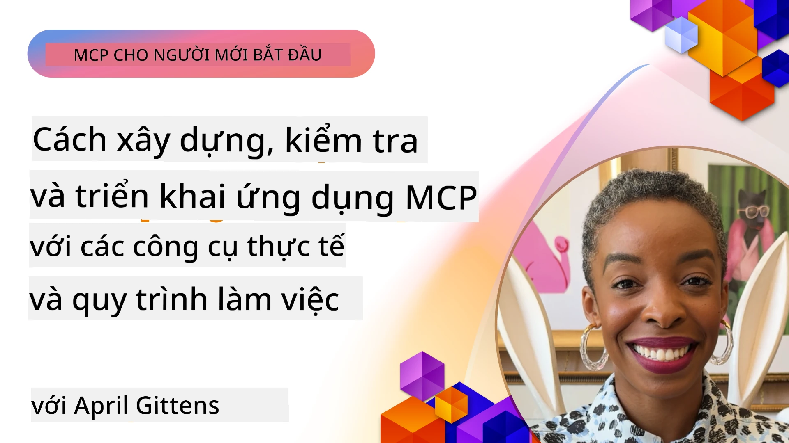
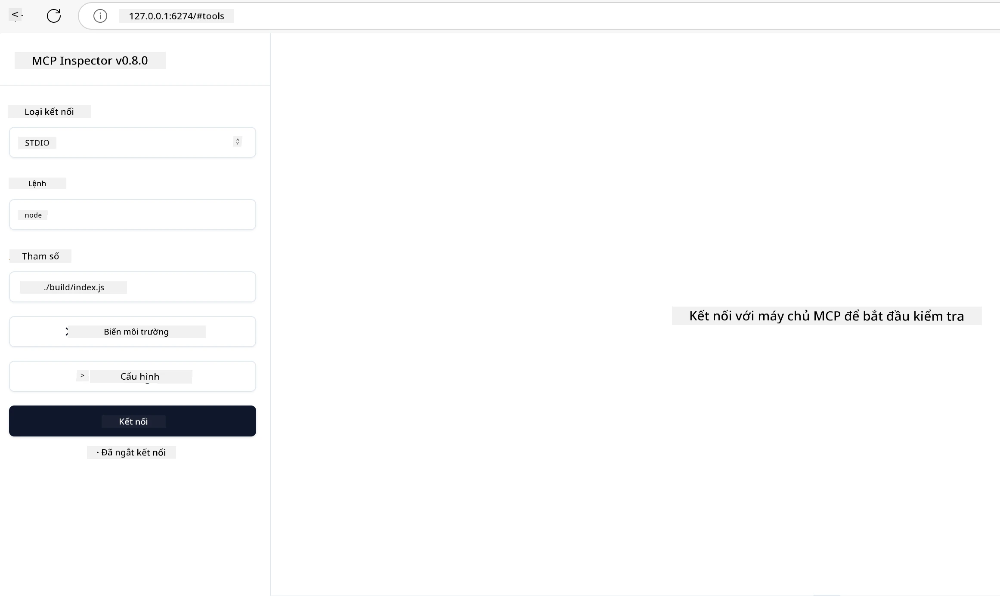

# Triển Khai Thực Tiễn

[](https://youtu.be/vCN9-mKBDfQ)

_(Nhấp vào hình ảnh ở trên để xem video bài học này)_

Triển khai thực tiễn là nơi sức mạnh của Model Context Protocol (MCP) trở nên hữu hình. Trong khi hiểu lý thuyết và kiến trúc phía sau MCP rất quan trọng, giá trị thực sự xuất hiện khi bạn áp dụng những khái niệm này để xây dựng, kiểm tra và triển khai các giải pháp giải quyết các vấn đề trong thế giới thực. Chương này nối kết khoảng cách giữa kiến thức khái niệm và phát triển thực hành, hướng dẫn bạn qua quá trình đưa các ứng dụng dựa trên MCP vào cuộc sống.

Dù bạn đang phát triển trợ lý thông minh, tích hợp AI vào quy trình công việc doanh nghiệp, hay xây dựng các công cụ tùy chỉnh cho xử lý dữ liệu, MCP cung cấp một nền tảng linh hoạt. Thiết kế không phụ thuộc ngôn ngữ và các SDK chính thức cho các ngôn ngữ lập trình phổ biến giúp nó tiếp cận được với nhiều nhà phát triển. Bằng cách tận dụng các SDK này, bạn có thể nhanh chóng tạo mẫu, lặp lại và mở rộng giải pháp của mình trên các nền tảng và môi trường khác nhau.

Trong các phần tiếp theo, bạn sẽ tìm thấy các ví dụ thực tiễn, mẫu mã, và chiến lược triển khai minh họa cách thực hiện MCP trong C#, Java với Spring, TypeScript, JavaScript, và Python. Bạn cũng sẽ học cách gỡ lỗi và kiểm tra các máy chủ MCP, quản lý API, và triển khai giải pháp lên đám mây bằng Azure. Những tài nguyên thực hành này được thiết kế để tăng tốc việc học của bạn và giúp bạn tự tin xây dựng các ứng dụng MCP mạnh mẽ và sẵn sàng cho môi trường sản xuất.

## Tổng Quan

Bài học này tập trung vào các khía cạnh thực tiễn của việc triển khai MCP trên nhiều ngôn ngữ lập trình. Chúng ta sẽ khám phá cách sử dụng các SDK MCP trong C#, Java với Spring, TypeScript, JavaScript và Python để xây dựng các ứng dụng chắc chắn, gỡ lỗi và kiểm tra máy chủ MCP, cũng như tạo các tài nguyên, lời nhắc, và công cụ có thể tái sử dụng.

## Mục Tiêu Học Tập

Kết thúc bài học này, bạn sẽ có khả năng:

- Triển khai các giải pháp MCP sử dụng các SDK chính thức trên nhiều ngôn ngữ lập trình
- Gỡ lỗi và kiểm tra máy chủ MCP một cách có hệ thống
- Tạo và sử dụng các tính năng máy chủ (Tài nguyên, Lời nhắc, và Công cụ)
- Thiết kế quy trình MCP hiệu quả cho các tác vụ phức tạp
- Tối ưu hóa triển khai MCP về hiệu suất và độ tin cậy

## Tài Nguyên SDK Chính Thức

Model Context Protocol cung cấp SDK chính thức cho nhiều ngôn ngữ (đồng bộ với [Đặc tả MCP 2025-11-25](https://spec.modelcontextprotocol.io/specification/2025-11-25/)):

- [C# SDK](https://github.com/modelcontextprotocol/csharp-sdk)
- [Java với Spring SDK](https://github.com/modelcontextprotocol/java-sdk) **Lưu ý:** yêu cầu phụ thuộc vào [Project Reactor](https://projectreactor.io). (Xem [vấn đề thảo luận 246](https://github.com/orgs/modelcontextprotocol/discussions/246).)
- [TypeScript SDK](https://github.com/modelcontextprotocol/typescript-sdk)
- [Python SDK](https://github.com/modelcontextprotocol/python-sdk)
- [Kotlin SDK](https://github.com/modelcontextprotocol/kotlin-sdk)
- [Go SDK](https://github.com/modelcontextprotocol/go-sdk)

## Làm Việc với SDK MCP

Phần này cung cấp các ví dụ thực tiễn về triển khai MCP trên nhiều ngôn ngữ lập trình. Bạn có thể tìm mã mẫu trong thư mục `samples` được tổ chức theo ngôn ngữ.

### Mẫu Có Sẵn

Kho lưu trữ bao gồm [các ví dụ mẫu](../../../04-PracticalImplementation/samples) trong các ngôn ngữ sau:

- [C#](./samples/csharp/README.md)
- [Java với Spring](./samples/java/containerapp/README.md)
- [TypeScript](./samples/typescript/README.md)
- [JavaScript](./samples/javascript/README.md)
- [Python](./samples/python/README.md)

Mỗi mẫu minh họa các khái niệm và mô hình triển khai MCP chính cho ngôn ngữ và hệ sinh thái tương ứng.

### Hướng Dẫn Thực Tiễn

Các hướng dẫn bổ sung cho triển khai MCP thực tiễn:

- [Phân Trang và Bộ Kết Quả Lớn](./pagination/README.md) - Xử lý phân trang dựa trên con trỏ cho công cụ, tài nguyên và bộ dữ liệu lớn

## Các Tính Năng Cốt Lõi Của Máy Chủ

Các máy chủ MCP có thể triển khai bất kỳ kết hợp nào của các tính năng sau:

### Tài Nguyên

Tài nguyên cung cấp ngữ cảnh và dữ liệu cho người dùng hoặc mô hình AI sử dụng:

- Kho lưu trữ tài liệu
- Cơ sở tri thức
- Nguồn dữ liệu cấu trúc
- Hệ thống tập tin

### Lời Nhắc

Lời nhắc là các mẫu tin nhắn và quy trình xử lý cho người dùng:

- Mẫu hội thoại định sẵn
- Mẫu tương tác hướng dẫn
- Cấu trúc đối thoại chuyên biệt

### Công Cụ

Công cụ là các hàm để mô hình AI thực thi:

- Tiện ích xử lý dữ liệu
- Tích hợp API bên ngoài
- Khả năng tính toán
- Chức năng tìm kiếm

## Ví Dụ Triển Khai: Triển Khai C# 

Kho lưu trữ SDK C# chính thức chứa một số ví dụ triển khai minh họa các khía cạnh khác nhau của MCP:

- **Client MCP Cơ bản**: Ví dụ đơn giản cho thấy cách tạo client MCP và gọi các công cụ
- **Server MCP Cơ bản**: Triển khai máy chủ tối giản với đăng ký công cụ cơ bản
- **Server MCP Nâng cao**: Máy chủ đầy đủ tính năng với đăng ký công cụ, xác thực, và xử lý lỗi
- **Tích hợp ASP.NET**: Ví dụ minh họa tích hợp với ASP.NET Core
- **Mô hình Triển khai Công Cụ**: Các mẫu khác nhau để triển khai công cụ với các mức độ phức tạp khác nhau

SDK MCP C# đang trong giai đoạn xem trước và các API có thể thay đổi. Chúng tôi sẽ liên tục cập nhật blog này khi SDK phát triển.

### Các Tính Năng Chính

- [C# MCP Nuget ModelContextProtocol](https://www.nuget.org/packages/ModelContextProtocol)
- Xây dựng [máy chủ MCP đầu tiên của bạn](https://devblogs.microsoft.com/dotnet/build-a-model-context-protocol-mcp-server-in-csharp/).

Để xem các mẫu triển khai C# đầy đủ, hãy truy cập [kho lưu trữ mẫu SDK C# chính thức](https://github.com/modelcontextprotocol/csharp-sdk)

## Ví dụ triển khai: Triển khai Java với Spring

SDK Java với Spring cung cấp các tùy chọn triển khai MCP mạnh mẽ với các tính năng cấp doanh nghiệp.

### Các Tính Năng Chính

- Tích hợp Spring Framework
- An toàn kiểu mạnh mẽ
- Hỗ trợ lập trình phản ứng
- Xử lý lỗi toàn diện

Để xem ví dụ triển khai Java với Spring đầy đủ, hãy xem [ví dụ Java với Spring](samples/java/containerapp/README.md) trong thư mục mẫu.

## Ví dụ triển khai: Triển khai JavaScript

SDK JavaScript mang đến cách tiếp cận nhẹ nhàng và linh hoạt cho triển khai MCP.

### Các Tính Năng Chính

- Hỗ trợ Node.js và trình duyệt
- API dựa trên Promise
- Dễ dàng tích hợp với Express và các framework khác
- Hỗ trợ WebSocket cho streaming

Để xem ví dụ triển khai JavaScript đầy đủ, hãy xem [ví dụ JavaScript](samples/javascript/README.md) trong thư mục mẫu.

## Ví dụ triển khai: Triển khai Python

SDK Python cung cấp cách tiếp cận phong cách Python cho triển khai MCP với khả năng tích hợp tuyệt vời cho các framework ML.

### Các Tính Năng Chính

- Hỗ trợ async/await với asyncio
- Tích hợp FastAPI
- Đăng ký công cụ đơn giản
- Tích hợp gốc với các thư viện ML phổ biến

Để xem ví dụ triển khai Python đầy đủ, hãy xem [ví dụ Python](samples/python/README.md) trong thư mục mẫu.

## Quản Lý API

Azure API Management là câu trả lời tuyệt vời cho cách chúng ta có thể bảo mật Máy chủ MCP. Ý tưởng là đặt một phiên bản Azure API Management trước máy chủ MCP của bạn và để nó xử lý các tính năng mà bạn có thể muốn như:

- giới hạn tốc độ
- quản lý token
- giám sát
- cân bằng tải
- bảo mật

### Ví dụ Azure

Dưới đây là một ví dụ Azure làm đúng điều đó, tức là [tạo một máy chủ MCP và bảo mật nó bằng Azure API Management](https://github.com/Azure-Samples/remote-mcp-apim-functions-python).

Xem cách quy trình ủy quyền diễn ra trong hình ảnh dưới đây:


Trong hình trên, các bước sau diễn ra:

- Xác thực/Ủy quyền diễn ra bằng Microsoft Entra.
- Azure API Management hoạt động như một cổng và sử dụng các chính sách để hướng và quản lý lưu lượng.
- Azure Monitor ghi lại tất cả các yêu cầu để phân tích thêm.

#### Quy trình ủy quyền

Hãy xem xét kỹ hơn về quy trình ủy quyền:


#### Đặc tả ủy quyền MCP

Tìm hiểu thêm về [Đặc tả ủy quyền MCP](https://spec.modelcontextprotocol.io/specification/2025-11-25/basic/authorization/)

## Triển Khai Máy Chủ MCP Từ Xa lên Azure

Hãy xem liệu chúng ta có thể triển khai ví dụ đã đề cập trước đó:

1. Clone kho chứa

    ```bash
    git clone https://github.com/Azure-Samples/remote-mcp-apim-functions-python.git
    cd remote-mcp-apim-functions-python
    ```

1. Đăng ký nhà cung cấp tài nguyên `Microsoft.App`.

   - Nếu bạn dùng Azure CLI, chạy `az provider register --namespace Microsoft.App --wait`.
   - Nếu bạn dùng Azure PowerShell, chạy `Register-AzResourceProvider -ProviderNamespace Microsoft.App`. Sau đó chạy `(Get-AzResourceProvider -ProviderNamespace Microsoft.App).RegistrationState` sau một thời gian để kiểm tra xem đăng ký đã hoàn tất chưa.

1. Chạy lệnh [azd](https://aka.ms/azd) này để cung cấp dịch vụ quản lý API, function app (có mã) và tất cả các tài nguyên Azure cần thiết khác

    ```shell
    azd up
    ```

    Lệnh này sẽ triển khai tất cả tài nguyên đám mây trên Azure

### Kiểm tra máy chủ với MCP Inspector

1. Trong **cửa sổ terminal mới**, cài đặt và chạy MCP Inspector

    ```shell
    npx @modelcontextprotocol/inspector
    ```

    Bạn sẽ thấy giao diện tương tự:

    

1. CTRL click để tải ứng dụng web MCP Inspector từ URL hiển thị bởi ứng dụng (ví dụ [http://127.0.0.1:6274/#resources](http://127.0.0.1:6274/#resources))
1. Chọn kiểu truyền tải là `SSE`
1. Đặt URL đến điểm cuối SSE của API Management đang chạy hiển thị sau khi chạy `azd up` và **Kết nối**:

    ```shell
    https://<apim-servicename-from-azd-output>.azure-api.net/mcp/sse
    ```

1. **Liệt kê Công Cụ**. Nhấn vào một công cụ và **Chạy Công Cụ**.

Nếu tất cả các bước hoạt động, bạn sẽ được kết nối với máy chủ MCP và có thể gọi một công cụ.

## Máy Chủ MCP cho Azure

[Remote-mcp-functions](https://github.com/Azure-Samples/remote-mcp-functions-dotnet): Bộ kho lưu trữ này là mẫu nhanh dành cho xây dựng và triển khai các máy chủ MCP từ xa tùy chỉnh sử dụng Azure Functions với Python, C# .NET hoặc Node/TypeScript.

Các ví dụ cung cấp giải pháp hoàn chỉnh cho phép các nhà phát triển:

- Xây dựng và chạy cục bộ: Phát triển và gỡ lỗi máy chủ MCP trên máy tính cá nhân
- Triển khai lên Azure: Dễ dàng triển khai lên đám mây với lệnh azd up đơn giản
- Kết nối từ client: Kết nối đến máy chủ MCP từ nhiều client khác nhau bao gồm chế độ đại lý Copilot trong VS Code và công cụ MCP Inspector

### Các Tính Năng Chính

- Bảo mật theo thiết kế: Máy chủ MCP được bảo mật bằng khóa và HTTPS
- Các tùy chọn xác thực: Hỗ trợ OAuth sử dụng xác thực tích hợp và/hoặc API Management
- Cô lập mạng: Cho phép cô lập mạng bằng Virtual Networks (VNET) của Azure
- Kiến trúc serverless: Tận dụng Azure Functions cho thực thi có thể mở rộng, phản ứng sự kiện
- Phát triển cục bộ: Hỗ trợ phát triển và gỡ lỗi toàn diện trên máy cục bộ
- Triển khai đơn giản: Quy trình triển khai tinh gọn lên Azure

Kho lưu trữ bao gồm tất cả các tập tin cấu hình cần thiết, mã nguồn và định nghĩa hạ tầng để nhanh chóng bắt đầu với triển khai máy chủ MCP sẵn sàng sản xuất.

- [Azure Remote MCP Functions Python](https://github.com/Azure-Samples/remote-mcp-functions-python) - Ví dụ triển khai MCP dùng Azure Functions với Python

- [Azure Remote MCP Functions .NET](https://github.com/Azure-Samples/remote-mcp-functions-dotnet) - Ví dụ triển khai MCP dùng Azure Functions với C# .NET

- [Azure Remote MCP Functions Node/Typescript](https://github.com/Azure-Samples/remote-mcp-functions-typescript) - Ví dụ triển khai MCP dùng Azure Functions với Node/TypeScript.

## Những Điểm Trọng Tâm

- Các SDK MCP cung cấp công cụ cụ thể theo ngôn ngữ để triển khai các giải pháp MCP chắc chắn
- Quá trình gỡ lỗi và kiểm tra rất quan trọng cho các ứng dụng MCP tin cậy
- Mẫu lời nhắc có thể tái sử dụng giúp tương tác AI nhất quán
- Quy trình làm việc được thiết kế tốt có thể điều phối các tác vụ phức tạp sử dụng nhiều công cụ
- Triển khai giải pháp MCP yêu cầu cân nhắc về bảo mật, hiệu năng và xử lý lỗi

## Bài Tập

Thiết kế một quy trình MCP thực tế giải quyết một vấn đề trong lĩnh vực của bạn:

1. Xác định 3-4 công cụ sẽ hữu ích cho việc giải quyết vấn đề này
2. Tạo sơ đồ quy trình cho thấy cách các công cụ này tương tác với nhau
3. Triển khai phiên bản cơ bản của một trong các công cụ bằng ngôn ngữ bạn ưa thích
4. Tạo mẫu lời nhắc giúp mô hình sử dụng công cụ hiệu quả

## Tài Nguyên Bổ Sung

---

## Bước Tiếp Theo

Tiếp theo: [Chủ Đề Nâng Cao](../05-AdvancedTopics/README.md)

---

<!-- CO-OP TRANSLATOR DISCLAIMER START -->
**Tuyên bố miễn trách**:
Tài liệu này được dịch bằng dịch vụ dịch thuật AI [Co-op Translator](https://github.com/Azure/co-op-translator). Mặc dù chúng tôi cố gắng đảm bảo độ chính xác, xin lưu ý rằng bản dịch tự động có thể chứa lỗi hoặc không chính xác. Tài liệu gốc bằng ngôn ngữ gốc của nó nên được xem là nguồn tham khảo chính thức. Đối với thông tin quan trọng, nên sử dụng dịch vụ dịch thuật chuyên nghiệp do con người thực hiện. Chúng tôi không chịu trách nhiệm đối với bất kỳ sự hiểu lầm hoặc giải thích sai nào phát sinh từ việc sử dụng bản dịch này.
<!-- CO-OP TRANSLATOR DISCLAIMER END -->