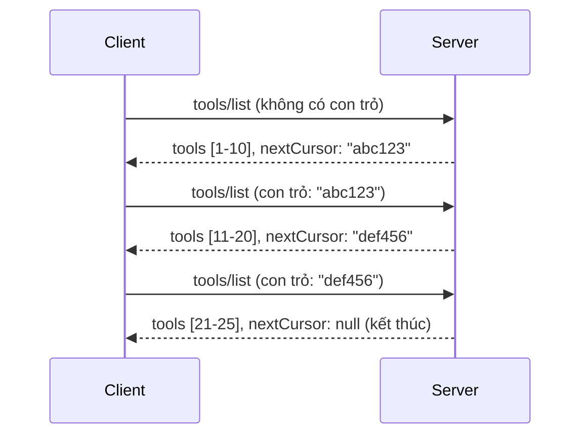

# Phân trang và Bộ Kết Quả Lớn trong MCP

Khi máy chủ MCP của bạn xử lý các bộ dữ liệu lớn - dù là liệt kê hàng nghìn tệp, bản ghi cơ sở dữ liệu, hay kết quả tìm kiếm - bạn cần phân trang để quản lý bộ nhớ hiệu quả và cung cấp trải nghiệm người dùng phản hồi nhanh. Hướng dẫn này bao gồm cách triển khai và sử dụng phân trang trong MCP.

## Tại sao Phân trang Quan trọng

Nếu không có phân trang, các phản hồi lớn có thể gây ra:

- **Hết bộ nhớ** - Tải hàng triệu bản ghi cùng lúc
- **Thời gian phản hồi chậm** - Người dùng phải chờ trong khi toàn bộ dữ liệu được tải
- **Lỗi hết thời gian chờ** - Yêu cầu vượt quá giới hạn thời gian chờ
- **Hiệu suất AI kém** - LLM gặp khó khăn với bối cảnh quá lớn

MCP sử dụng **phân trang dựa trên con trỏ** để phân trang qua các bộ kết quả một cách đáng tin cậy và nhất quán.

---

## Cách MCP Phân Trang Hoạt Động

### Khái niệm Con trỏ

Một **con trỏ** là một chuỗi mờ (opaque) đánh dấu vị trí của bạn trong một bộ kết quả. Hãy tưởng tượng nó như một dấu trang trong một cuốn sách dài.


### Phân trang trong Các Phương thức MCP

Các phương thức MCP sau hỗ trợ phân trang:

| Phương thức | Trả về | Hỗ trợ Con trỏ |
|-------------|---------|----------------|
| `tools/list` | Định nghĩa công cụ | ✅ |
| `resources/list` | Định nghĩa tài nguyên | ✅ |
| `prompts/list` | Định nghĩa lời nhắc | ✅ |
| `resources/templates/list` | Mẫu tài nguyên | ✅ |

---

## Triển khai Máy chủ

### Python (FastMCP)

```python
from mcp.server import Server
from mcp.types import Tool, ListToolsResult
import math

app = Server("paginated-server")

# Bộ dữ liệu lớn được mô phỏng
ALL_TOOLS = [
    Tool(name=f"tool_{i}", description=f"Tool number {i}", inputSchema={})
    for i in range(100)
]

PAGE_SIZE = 10

@app.list_tools()
async def list_tools(cursor: str | None = None) -> ListToolsResult:
    """List tools with pagination support."""
    
    # Giải mã con trỏ để lấy chỉ số bắt đầu
    start_index = 0
    if cursor:
        try:
            start_index = int(cursor)
        except ValueError:
            start_index = 0
    
    # Lấy trang kết quả
    end_index = min(start_index + PAGE_SIZE, len(ALL_TOOLS))
    page_tools = ALL_TOOLS[start_index:end_index]
    
    # Tính toán con trỏ tiếp theo
    next_cursor = None
    if end_index < len(ALL_TOOLS):
        next_cursor = str(end_index)
    
    return ListToolsResult(
        tools=page_tools,
        nextCursor=next_cursor
    )
```

### TypeScript

```typescript
import { Server } from "@modelcontextprotocol/sdk/server/index.js";
import { ListToolsResultSchema } from "@modelcontextprotocol/sdk/types.js";

const server = new Server({
  name: "paginated-server",
  version: "1.0.0"
});

// Bộ dữ liệu lớn mô phỏng
const ALL_TOOLS = Array.from({ length: 100 }, (_, i) => ({
  name: `tool_${i}`,
  description: `Tool number ${i}`,
  inputSchema: { type: "object", properties: {} }
}));

const PAGE_SIZE = 10;

server.setRequestHandler(ListToolsResultSchema, async (request) => {
  // Giải mã con trỏ
  let startIndex = 0;
  if (request.params?.cursor) {
    startIndex = parseInt(request.params.cursor, 10) || 0;
  }
  
  // Lấy trang kết quả
  const endIndex = Math.min(startIndex + PAGE_SIZE, ALL_TOOLS.length);
  const pageTools = ALL_TOOLS.slice(startIndex, endIndex);
  
  // Tính con trỏ tiếp theo
  const nextCursor = endIndex < ALL_TOOLS.length ? String(endIndex) : undefined;
  
  return {
    tools: pageTools,
    nextCursor
  };
});
```

### Java (Spring MCP)

```java
@Service
public class PaginatedToolService {
    
    private static final int PAGE_SIZE = 10;
    private final List<Tool> allTools;
    
    public PaginatedToolService() {
        // Khởi tạo bộ dữ liệu lớn
        this.allTools = IntStream.range(0, 100)
            .mapToObj(i -> new Tool("tool_" + i, "Tool number " + i, Map.of()))
            .collect(Collectors.toList());
    }
    
    @McpMethod("tools/list")
    public ListToolsResult listTools(@Param("cursor") String cursor) {
        // Giải mã con trỏ
        int startIndex = 0;
        if (cursor != null && !cursor.isEmpty()) {
            try {
                startIndex = Integer.parseInt(cursor);
            } catch (NumberFormatException e) {
                startIndex = 0;
            }
        }
        
        // Lấy trang kết quả
        int endIndex = Math.min(startIndex + PAGE_SIZE, allTools.size());
        List<Tool> pageTools = allTools.subList(startIndex, endIndex);
        
        // Tính toán con trỏ tiếp theo
        String nextCursor = endIndex < allTools.size() ? String.valueOf(endIndex) : null;
        
        return new ListToolsResult(pageTools, nextCursor);
    }
}
```

---

## Triển khai Máy khách

### Máy khách Python

```python
from mcp import ClientSession

async def get_all_tools(session: ClientSession) -> list:
    """Fetch all tools using pagination."""
    all_tools = []
    cursor = None
    
    while True:
        result = await session.list_tools(cursor=cursor)
        all_tools.extend(result.tools)
        
        if result.nextCursor is None:
            break
        cursor = result.nextCursor
    
    return all_tools

# Cách sử dụng
async with client_session as session:
    tools = await get_all_tools(session)
    print(f"Found {len(tools)} tools")
```

### Máy khách TypeScript

```typescript
import { Client } from "@modelcontextprotocol/sdk/client/index.js";

async function getAllTools(client: Client): Promise<Tool[]> {
  const allTools: Tool[] = [];
  let cursor: string | undefined = undefined;
  
  do {
    const result = await client.listTools({ cursor });
    allTools.push(...result.tools);
    cursor = result.nextCursor;
  } while (cursor);
  
  return allTools;
}

// Cách sử dụng
const tools = await getAllTools(client);
console.log(`Found ${tools.length} tools`);
```

### Mô hình Tải lười

Đối với các bộ dữ liệu rất lớn, tải các trang theo yêu cầu:

```python
class PaginatedToolIterator:
    """Lazily iterate through paginated tools."""
    
    def __init__(self, session: ClientSession):
        self.session = session
        self.cursor = None
        self.buffer = []
        self.exhausted = False
    
    async def __anext__(self):
        # Trả về từ bộ đệm nếu có sẵn
        if self.buffer:
            return self.buffer.pop(0)
        
        # Kiểm tra xem chúng ta đã quét hết tất cả các trang chưa
        if self.exhausted:
            raise StopAsyncIteration
        
        # Lấy trang tiếp theo
        result = await self.session.list_tools(cursor=self.cursor)
        self.buffer = list(result.tools)
        self.cursor = result.nextCursor
        
        if self.cursor is None:
            self.exhausted = True
        
        if not self.buffer:
            raise StopAsyncIteration
        
        return self.buffer.pop(0)
    
    def __aiter__(self):
        return self

# Cách sử dụng - tiết kiệm bộ nhớ cho bộ dữ liệu lớn
async for tool in PaginatedToolIterator(session):
    process_tool(tool)
```

---

## Phân trang cho Tài nguyên

Tài nguyên thường cần phân trang cho thư mục hoặc bộ dữ liệu lớn:

```python
from mcp.server import Server
from mcp.types import Resource, ListResourcesResult
import os

app = Server("file-server")

@app.list_resources()
async def list_resources(cursor: str | None = None) -> ListResourcesResult:
    """List files in directory with pagination."""
    
    directory = "/data/files"
    all_files = sorted(os.listdir(directory))
    
    # Giải mã con trỏ (chỉ số tệp)
    start_index = int(cursor) if cursor else 0
    page_size = 20
    end_index = min(start_index + page_size, len(all_files))
    
    # Tạo danh sách tài nguyên cho trang này
    resources = []
    for filename in all_files[start_index:end_index]:
        filepath = os.path.join(directory, filename)
        resources.append(Resource(
            uri=f"file://{filepath}",
            name=filename,
            mimeType="application/octet-stream"
        ))
    
    # Tính toán con trỏ tiếp theo
    next_cursor = str(end_index) if end_index < len(all_files) else None
    
    return ListResourcesResult(
        resources=resources,
        nextCursor=next_cursor
    )
```

---

## Chiến lược Thiết kế Con trỏ

### Chiến lược 1: Dựa trên Chỉ số (Đơn giản)

```python
# Con trỏ chỉ là chỉ số
cursor = "50"  # Bắt đầu từ mục 50
```

**Ưu điểm:** Đơn giản, không trạng thái  
**Nhược điểm:** Kết quả có thể thay đổi nếu có mục được thêm/bỏ

### Chiến lược 2: Dựa trên ID (Ổn định)

```python
# Con trỏ là ID được thấy lần cuối
cursor = "item_abc123"  # Bắt đầu sau mục này
```

**Ưu điểm:** Ổn định ngay cả khi mục thay đổi  
**Nhược điểm:** Yêu cầu ID có thứ tự

### Chiến lược 3: Mã hóa Trạng thái (Phức tạp)

```python
import base64
import json

def encode_cursor(state: dict) -> str:
    return base64.b64encode(json.dumps(state).encode()).decode()

def decode_cursor(cursor: str) -> dict:
    return json.loads(base64.b64decode(cursor).decode())

# Con trỏ chứa nhiều trường trạng thái
cursor = encode_cursor({
    "offset": 50,
    "filter": "active",
    "sort": "name"
})
```

**Ưu điểm:** Có thể mã hóa trạng thái phức tạp  
**Nhược điểm:** Phức tạp hơn, chuỗi con trỏ lớn hơn

---

## Thực hành Tốt nhất

### 1. Chọn Kích thước Trang Phù hợp

```python
# Xem xét kích thước dữ liệu
PAGE_SIZE_SMALL_ITEMS = 100   # Siêu dữ liệu đơn giản
PAGE_SIZE_MEDIUM_ITEMS = 20   # Đối tượng phong phú hơn
PAGE_SIZE_LARGE_ITEMS = 5     # Nội dung phức tạp
```

### 2. Xử lý Con trỏ Không hợp lệ một cách Nhẹ nhàng

```python
@app.list_tools()
async def list_tools(cursor: str | None = None) -> ListToolsResult:
    try:
        start_index = int(cursor) if cursor else 0
        if start_index < 0 or start_index >= len(ALL_TOOLS):
            start_index = 0  # Đặt lại về đầu
    except (ValueError, TypeError):
        start_index = 0  # Con trỏ không hợp lệ, bắt đầu lại từ đầu
    # ...
```

### 3. Bao gồm Tổng số lượng (Tùy chọn)

```python
return ListToolsResult(
    tools=page_tools,
    nextCursor=next_cursor,
    # Một số triển khai bao gồm tổng cho tiến trình giao diện người dùng
    _meta={"total": len(ALL_TOOLS)}
)
```

### 4. Kiểm thử Các trường hợp Biên

```python
async def test_pagination():
    # Bộ kết quả rỗng
    result = await session.list_tools()
    assert result.tools == []
    assert result.nextCursor is None
    
    # Một trang duy nhất
    result = await session.list_tools()
    assert len(result.tools) <= PAGE_SIZE
    
    # Con trỏ không hợp lệ
    result = await session.list_tools(cursor="invalid")
    assert result.tools  # Nên trả về trang đầu tiên
```

---

## Những Sai lầm Thường gặp

### ❌ Trả về Tất cả Kết quả rồi Phân trang phía Máy khách

```python
# XẤU: Tải mọi thứ vào bộ nhớ
@app.list_tools()
async def list_tools() -> ListToolsResult:
    all_tools = load_all_tools()  # 1 triệu công cụ!
    return ListToolsResult(tools=all_tools)
```

### ✅ Phân trang tại Nguồn Dữ liệu

```python
# TỐT: Chỉ tải những gì cần thiết
@app.list_tools()
async def list_tools(cursor: str | None = None) -> ListToolsResult:
    offset = int(cursor) if cursor else 0
    tools = await db.query_tools(offset=offset, limit=PAGE_SIZE)
    return ListToolsResult(tools=tools, nextCursor=...)
```

---

## Tiếp theo Là Gì

- [Module 5.14 - Kỹ thuật Bối cảnh](../../05-AdvancedTopics/mcp-contextengineering/README.md)
- [Module 8 - Thực hành Tốt nhất](../../08-BestPractices/README.md)
- [3.8 - Kiểm thử Máy chủ MCP của bạn](../../03-GettingStarted/08-testing/README.md)

---

## Tài nguyên Bổ Sung

- [Đặc tả MCP - Phân trang](https://spec.modelcontextprotocol.io/specification/2025-11-25/)
- [Giải thích Phân trang Dựa trên Con trỏ](https://slack.engineering/evolving-api-pagination-at-slack/)
- [Kiểm thử phân trang Python SDK](https://github.com/modelcontextprotocol/python-sdk/blob/main/tests/client/test_list_methods_cursor.py)

---

<!-- CO-OP TRANSLATOR DISCLAIMER START -->
**Tuyên bố miễn trừ trách nhiệm**:  
Tài liệu này đã được dịch bằng dịch vụ dịch thuật AI [Co-op Translator](https://github.com/Azure/co-op-translator). Mặc dù chúng tôi nỗ lực đảm bảo độ chính xác, xin lưu ý rằng các bản dịch tự động có thể chứa lỗi hoặc không chính xác. Tài liệu gốc bằng ngôn ngữ gốc của nó nên được xem là nguồn tham khảo chính thức. Đối với thông tin quan trọng, khuyến nghị sử dụng dịch vụ dịch thuật chuyên nghiệp do con người thực hiện. Chúng tôi không chịu trách nhiệm về bất kỳ sự hiểu nhầm hay giải thích sai nào phát sinh từ việc sử dụng bản dịch này.
<!-- CO-OP TRANSLATOR DISCLAIMER END -->