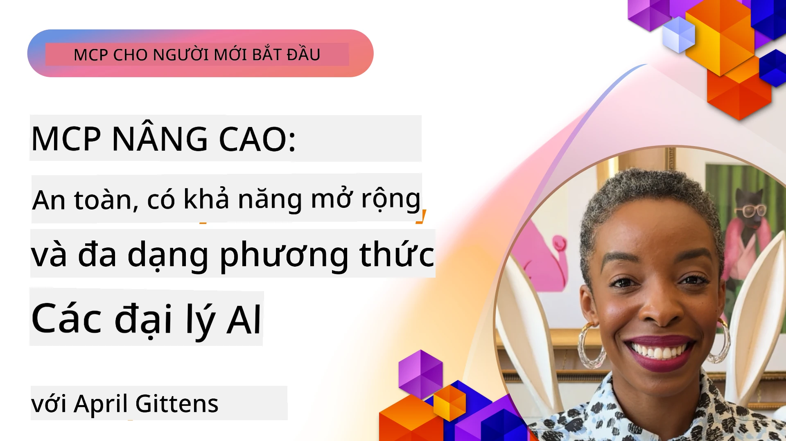

# Các Chủ Đề Nâng Cao trong MCP

_(Nhấn vào hình ảnh ở trên để xem video của bài học này)_

Chương này bao gồm một loạt các chủ đề nâng cao trong việc triển khai Giao thức Ngữ cảnh Mô hình (MCP), bao gồm tích hợp đa phương thức, khả năng mở rộng, thực hành bảo mật tốt nhất và tích hợp doanh nghiệp. Những chủ đề này rất quan trọng để xây dựng các ứng dụng MCP chắc chắn và sẵn sàng cho sản xuất, đáp ứng được các yêu cầu của hệ thống AI hiện đại.

## Tổng quan

Bài học này khám phá các khái niệm nâng cao trong triển khai Giao thức Ngữ cảnh Mô hình, tập trung vào tích hợp đa phương thức, khả năng mở rộng, thực hành bảo mật tốt nhất và tích hợp doanh nghiệp. Những chủ đề này cần thiết để xây dựng các ứng dụng MCP đạt chuẩn sản xuất, có thể xử lý các yêu cầu phức tạp trong môi trường doanh nghiệp.

## Mục tiêu học tập

Kết thúc bài học này, bạn sẽ có khả năng:

- Triển khai khả năng đa phương thức trong các khung MCP
- Thiết kế kiến trúc MCP có khả năng mở rộng cho các kịch bản yêu cầu cao
- Áp dụng các thực hành bảo mật tốt nhất phù hợp với các nguyên tắc bảo mật của MCP
- Tích hợp MCP với hệ thống và khung AI doanh nghiệp
- Tối ưu hóa hiệu suất và độ tin cậy trong môi trường sản xuất

## Bài học và dự án mẫu

| Link | Tiêu đề | Mô tả |
|------|-------|-------------|
| [5.1 Integration with Azure](./mcp-integration/README.md) | Tích hợp với Azure | Học cách tích hợp MCP Server của bạn trên Azure |
| [5.2 Multi modal sample](./mcp-multi-modality/README.md) | Mẫu đa phương thức MCP | Mẫu đáp ứng cho âm thanh, hình ảnh và đa phương thức |
| [5.3 MCP OAuth2 sample](../../../05-AdvancedTopics/mcp-oauth2-demo) | Demo OAuth2 MCP | Ứng dụng Spring Boot tối giản trình bày OAuth2 với MCP, vừa là Authorization Server vừa là Resource Server. Minh họa phát hành token an toàn, các điểm cuối được bảo vệ, triển khai Azure Container Apps và tích hợp quản lý API. |
| [5.4 Root Contexts](./mcp-root-contexts/README.md) | Ngữ cảnh gốc | Tìm hiểu thêm về ngữ cảnh gốc và cách triển khai chúng |
| [5.5 Routing](./mcp-routing/README.md) | Định tuyến | Tìm hiểu các loại định tuyến khác nhau |
| [5.6 Sampling](./mcp-sampling/README.md) | Lấy mẫu | Học cách làm việc với lấy mẫu |
| [5.7 Scaling](./mcp-scaling/README.md) | Mở rộng | Tìm hiểu về mở rộng |
| [5.8 Security](./mcp-security/README.md) | Bảo mật | Bảo mật MCP Server của bạn |
| [5.9 Web Search sample](./web-search-mcp/README.md) | Tìm kiếm web MCP | Server và client MCP Python tích hợp với SerpAPI cho tìm kiếm web, tin tức, sản phẩm và Q&A theo thời gian thực. Minh họa điều phối đa công cụ, tích hợp API bên ngoài và xử lý lỗi mạnh mẽ. |
| [5.10 Realtime Streaming](./mcp-realtimestreaming/README.md) | Truyền phát trực tiếp | Truyền dữ liệu thời gian thực đã trở nên thiết yếu trong thế giới hiện nay, nơi doanh nghiệp và ứng dụng yêu cầu truy cập thông tin ngay lập tức để ra quyết định kịp thời.|
| [5.11 Realtime Web Search](./mcp-realtimesearch/README.md) | Tìm kiếm web | Tìm kiếm web thời gian thực và cách MCP chuyển đổi tìm kiếm web thời gian thực bằng cách cung cấp phương pháp tiêu chuẩn để quản lý ngữ cảnh trên các mô hình AI, công cụ tìm kiếm và ứng dụng.| 
| [5.12  Entra ID Authentication for Model Context Protocol Servers](./mcp-security-entra/README.md) | Xác thực Entra ID | Microsoft Entra ID cung cấp giải pháp quản lý danh tính và truy cập dựa trên đám mây mạnh mẽ, giúp đảm bảo chỉ người dùng và ứng dụng được ủy quyền mới tương tác với server MCP của bạn.|
| [5.13 Azure AI Foundry Agent Integration](./mcp-foundry-agent-integration/README.md) | Tích hợp Azure AI Foundry | Học cách tích hợp server Giao thức Ngữ cảnh Mô hình với các agent Azure AI Foundry, cho phép điều phối công cụ mạnh mẽ và khả năng AI doanh nghiệp với các kết nối nguồn dữ liệu ngoài tiêu chuẩn.|
| [5.14 Context Engineering](./mcp-contextengineering/README.md) | Kỹ thuật Ngữ cảnh | Cơ hội tương lai của kỹ thuật ngữ cảnh cho server MCP, bao gồm tối ưu hóa ngữ cảnh, quản lý ngữ cảnh động, và chiến lược kỹ thuật prompt hiệu quả trong khung MCP.|
| [5.15 MCP Custom Transport](./mcp-transport/README.md) | Giao vận tùy chỉnh | Học cách triển khai cơ chế giao vận tùy chỉnh cho các tình huống giao tiếp MCP chuyên biệt.|
| [5.16 Protocol Features Deep Dive](./mcp-protocol-features/README.md) | Tính năng giao thức | Nắm vững tính năng nâng cao của giao thức bao gồm thông báo tiến trình, hủy yêu cầu, mẫu tài nguyên và mẫu xử lý lỗi.|

> **Mới trong đặc tả MCP 2025-11-25**: Đặc tả nay bao gồm hỗ trợ thử nghiệm cho **Tasks** (các thao tác chạy dài kèm theo theo dõi tiến trình), **Tool Annotations** (siêu dữ liệu về hành vi công cụ để đảm bảo an toàn), **URL Mode Elicitation** (yêu cầu nội dung URL cụ thể từ client), và cải tiến **Roots** (cho quản lý ngữ cảnh không gian làm việc). Xem [nhật ký thay đổi đặc tả MCP](https://spec.modelcontextprotocol.io/) để biết chi tiết đầy đủ.

## Tham khảo bổ sung

Để có thông tin cập nhật nhất về các chủ đề MCP nâng cao, tham khảo:
- [Tài liệu MCP](https://modelcontextprotocol.io/)
- [Đặc tả MCP (2025-11-25)](https://spec.modelcontextprotocol.io/specification/2025-11-25/)
- [Kho GitHub](https://github.com/modelcontextprotocol)
- [OWASP MCP Top 10](https://microsoft.github.io/mcp-azure-security-guide/mcp/) - Rủi ro bảo mật và cách giảm thiểu
- [Hội thảo MCP Security Summit (Sherpa)](https://azure-samples.github.io/sherpa/) - Đào tạo bảo mật thực hành

## Những điểm chính cần nhớ

- Triển khai MCP đa phương thức mở rộng khả năng AI vượt ra ngoài xử lý văn bản
- Khả năng mở rộng rất cần thiết cho triển khai doanh nghiệp và có thể được giải quyết qua mở rộng ngang và dọc
- Các biện pháp bảo mật toàn diện bảo vệ dữ liệu và đảm bảo kiểm soát truy cập phù hợp
- Tích hợp doanh nghiệp với các nền tảng như Azure OpenAI và Microsoft AI Foundry tăng cường khả năng MCP
- Các triển khai MCP nâng cao hưởng lợi từ kiến trúc tối ưu và quản lý tài nguyên cẩn thận

## Bài tập

Thiết kế một triển khai MCP đạt chuẩn doanh nghiệp cho một trường hợp sử dụng cụ thể:

1. Xác định yêu cầu đa phương thức cho trường hợp sử dụng của bạn
2. Phác thảo các kiểm soát bảo mật cần thiết để bảo vệ dữ liệu nhạy cảm
3. Thiết kế kiến trúc có khả năng mở rộng để xử lý tải biến đổi
4. Lập kế hoạch các điểm tích hợp với hệ thống AI doanh nghiệp
5. Ghi lại các điểm nghẽn hiệu suất tiềm năng và chiến lược giảm thiểu

## Tài nguyên bổ sung

- [Tài liệu Azure OpenAI](https://learn.microsoft.com/en-us/azure/ai-services/openai/)
- [Tài liệu Microsoft AI Foundry](https://learn.microsoft.com/en-us/ai-services/)

---

## Tiếp theo

Khám phá các bài học trong module này bắt đầu với: [5.1 MCP Integration](./mcp-integration/README.md)

Sau khi hoàn thành module này, tiếp tục với: [Module 6: Community Contributions](../06-CommunityContributions/README.md)

---

<!-- CO-OP TRANSLATOR DISCLAIMER START -->
**Tuyên bố từ chối trách nhiệm**:
Tài liệu này đã được dịch bằng dịch vụ dịch thuật AI [Co-op Translator](https://github.com/Azure/co-op-translator). Mặc dù chúng tôi cố gắng đảm bảo độ chính xác, xin lưu ý rằng bản dịch tự động có thể chứa các lỗi hoặc sự không chính xác. Tài liệu gốc bằng ngôn ngữ gốc của nó nên được coi là nguồn chính xác và đáng tin cậy. Đối với các thông tin quan trọng, nên sử dụng dịch vụ dịch thuật chuyên nghiệp của con người. Chúng tôi không chịu trách nhiệm về bất kỳ sự hiểu lầm hoặc giải thích sai nào phát sinh từ việc sử dụng bản dịch này.
<!-- CO-OP TRANSLATOR DISCLAIMER END -->