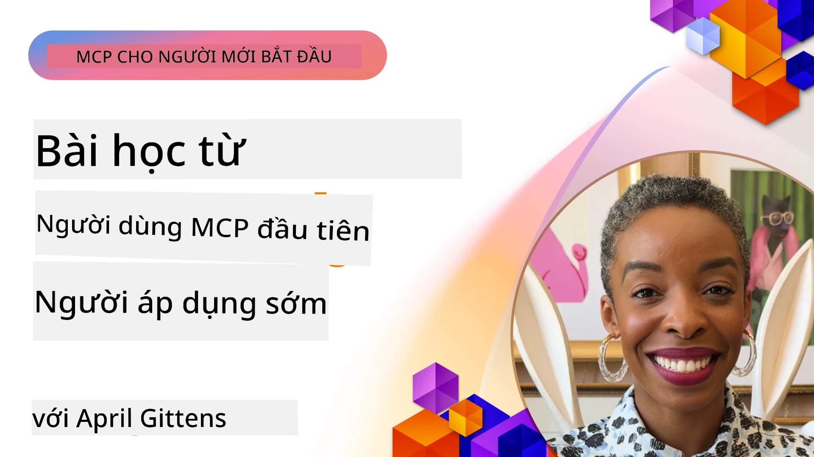

# 🌟 Bài học từ những người dùng đầu tiên

[](https://youtu.be/jds7dSmNptE)

_(Nhấp vào hình ảnh trên để xem video bài học này)_

## 🎯 Nội dung của Module này

Module này khám phá cách các tổ chức và nhà phát triển thực tế đang tận dụng Giao thức Ngữ cảnh Mô hình (Model Context Protocol - MCP) để giải quyết những thách thức thực tế và thúc đẩy đổi mới sáng tạo. Qua các nghiên cứu điển hình chi tiết, dự án thực hành và các ví dụ thiết thực, bạn sẽ khám phá cách MCP cho phép tích hợp AI bảo mật, mở rộng quy mô, kết nối các mô hình ngôn ngữ, công cụ và dữ liệu doanh nghiệp.

### 📚 Xem MCP trong thực tế

Muốn thấy các nguyên tắc này được áp dụng vào các công cụ sẵn dùng trong sản xuất? Hãy xem [**10 Máy chủ MCP của Microsoft đang biến đổi năng suất lập trình viên**](microsoft-mcp-servers.md), trình bày các máy chủ MCP thật sự của Microsoft mà bạn có thể sử dụng ngay hôm nay.

## Tổng quan

Bài học này khám phá cách những người dùng đầu tiên đã tận dụng Giao thức Ngữ cảnh Mô hình (MCP) để giải quyết các thách thức thực tế và thúc đẩy đổi mới sáng tạo trong nhiều ngành công nghiệp. Qua các nghiên cứu điển hình chi tiết và dự án thực hành, bạn sẽ thấy MCP cho phép tích hợp AI tiêu chuẩn, bảo mật và có khả năng mở rộng—kết nối các mô hình ngôn ngữ lớn, công cụ và dữ liệu doanh nghiệp trong một khung thống nhất. Bạn sẽ có trải nghiệm thực tế trong việc thiết kế và xây dựng các giải pháp dựa trên MCP, học hỏi từ các mẫu triển khai đã được chứng minh, và khám phá các thực hành tốt nhất để triển khai MCP trong môi trường sản xuất. Bài học cũng nhấn mạnh các xu hướng mới nổi, hướng phát triển trong tương lai, và tài nguyên mã nguồn mở để giúp bạn luôn dẫn đầu trong công nghệ MCP và hệ sinh thái đang phát triển của nó.

## Mục tiêu học tập

- Phân tích các triển khai MCP thực tế trong các ngành công nghiệp khác nhau
- Thiết kế và xây dựng các ứng dụng hoàn chỉnh dựa trên MCP
- Khám phá các xu hướng mới nổi và hướng phát triển trong công nghệ MCP
- Áp dụng các thực hành tốt nhất trong các kịch bản phát triển thực tế

## Các triển khai MCP trong thực tế

### Nghiên cứu trường hợp 1: Tự động hóa hỗ trợ khách hàng doanh nghiệp

Một tập đoàn đa quốc gia đã triển khai giải pháp dựa trên MCP để tiêu chuẩn hóa các tương tác AI trên các hệ thống hỗ trợ khách hàng của họ. Điều này cho phép họ:

- Tạo giao diện thống nhất cho nhiều nhà cung cấp LLM
- Duy trì quản lý prompt nhất quán giữa các phòng ban
- Triển khai các kiểm soát bảo mật và tuân thủ chặt chẽ
- Chuyển đổi dễ dàng giữa các mô hình AI khác nhau dựa trên nhu cầu cụ thể

**Triển khai kỹ thuật:**

```python
# Triển khai máy chủ MCP Python cho hỗ trợ khách hàng
import logging
import asyncio
from modelcontextprotocol import create_server, ServerConfig
from modelcontextprotocol.server import MCPServer
from modelcontextprotocol.transports import create_http_transport
from modelcontextprotocol.resources import ResourceDefinition
from modelcontextprotocol.prompts import PromptDefinition
from modelcontextprotocol.tool import ToolDefinition

# Cấu hình ghi nhật ký
logging.basicConfig(level=logging.INFO)

async def main():
    # Tạo cấu hình máy chủ
    config = ServerConfig(
        name="Enterprise Customer Support Server",
        version="1.0.0",
        description="MCP server for handling customer support inquiries"
    )
    
    # Khởi tạo máy chủ MCP
    server = create_server(config)
    
    # Đăng ký tài nguyên cơ sở tri thức
    server.resources.register(
        ResourceDefinition(
            name="customer_kb",
            description="Customer knowledge base documentation"
        ),
        lambda params: get_customer_documentation(params)
    )
    
    # Đăng ký mẫu lời nhắc
    server.prompts.register(
        PromptDefinition(
            name="support_template",
            description="Templates for customer support responses"
        ),
        lambda params: get_support_templates(params)
    )
    
    # Đăng ký công cụ hỗ trợ
    server.tools.register(
        ToolDefinition(
            name="ticketing",
            description="Create and update support tickets"
        ),
        handle_ticketing_operations
    )
    
    # Khởi động máy chủ với giao thức HTTP
    transport = create_http_transport(port=8080)
    await server.run(transport)

if __name__ == "__main__":
    asyncio.run(main())
```

**Kết quả:** Giảm 30% chi phí mô hình, cải thiện 45% sự nhất quán phản hồi, và tăng cường tuân thủ trên toàn cầu.

### Nghiên cứu trường hợp 2: Trợ lý chẩn đoán y tế

Một nhà cung cấp dịch vụ y tế đã phát triển hạ tầng MCP để tích hợp nhiều mô hình AI y tế chuyên biệt đồng thời đảm bảo dữ liệu bệnh nhân nhạy cảm được bảo vệ:

- Chuyển đổi liền mạch giữa các mô hình y tế tổng quát và chuyên sâu
- Kiểm soát riêng tư nghiêm ngặt và lưu vết kiểm toán
- Tích hợp với các hệ thống Hồ sơ Y tế Điện tử (EHR) hiện có
- Quản lý prompt nhất quán cho thuật ngữ y tế

**Triển khai kỹ thuật:**

```csharp
// C# MCP host application implementation in healthcare application
using Microsoft.Extensions.DependencyInjection;
using ModelContextProtocol.SDK.Client;
using ModelContextProtocol.SDK.Security;
using ModelContextProtocol.SDK.Resources;

public class DiagnosticAssistant
{
    private readonly MCPHostClient _mcpClient;
    private readonly PatientContext _patientContext;
    
    public DiagnosticAssistant(PatientContext patientContext)
    {
        _patientContext = patientContext;
        
        // Configure MCP client with healthcare-specific settings
        var clientOptions = new ClientOptions
        {
            Name = "Healthcare Diagnostic Assistant",
            Version = "1.0.0",
            Security = new SecurityOptions
            {
                Encryption = EncryptionLevel.Medical,
                AuditEnabled = true
            }
        };
        
        _mcpClient = new MCPHostClientBuilder()
            .WithOptions(clientOptions)
            .WithTransport(new HttpTransport("https://healthcare-mcp.example.org"))
            .WithAuthentication(new HIPAACompliantAuthProvider())
            .Build();
    }
    
    public async Task<DiagnosticSuggestion> GetDiagnosticAssistance(
        string symptoms, string patientHistory)
    {
        // Create request with appropriate resources and tool access
        var resourceRequest = new ResourceRequest
        {
            Name = "patient_records",
            Parameters = new Dictionary<string, object>
            {
                ["patientId"] = _patientContext.PatientId,
                ["requestingProvider"] = _patientContext.ProviderId
            }
        };
        
        // Request diagnostic assistance using appropriate prompt
        var response = await _mcpClient.SendPromptRequestAsync(
            promptName: "diagnostic_assistance",
            parameters: new Dictionary<string, object>
            {
                ["symptoms"] = symptoms,
                patientHistory = patientHistory,
                relevantGuidelines = _patientContext.GetRelevantGuidelines()
            });
            
        return DiagnosticSuggestion.FromMCPResponse(response);
    }
}
```

**Kết quả:** Cải thiện đề xuất chẩn đoán cho bác sĩ trong khi duy trì tuân thủ đầy đủ HIPAA và giảm đáng kể việc chuyển đổi ngữ cảnh giữa các hệ thống.

### Nghiên cứu trường hợp 3: Phân tích rủi ro dịch vụ tài chính

Một tổ chức tài chính đã triển khai MCP để tiêu chuẩn hóa quy trình phân tích rủi ro giữa các phòng ban khác nhau:

- Tạo giao diện thống nhất cho các mô hình rủi ro tín dụng, phát hiện gian lận, và rủi ro đầu tư
- Triển khai kiểm soát truy cập nghiêm ngặt và quản lý phiên bản mô hình
- Đảm bảo khả năng kiểm toán mọi khuyến nghị AI
- Duy trì định dạng dữ liệu nhất quán giữa các hệ thống đa dạng

**Triển khai kỹ thuật:**

```java
// Máy chủ MCP Java cho đánh giá rủi ro tài chính
import org.mcp.server.*;
import org.mcp.security.*;

public class FinancialRiskMCPServer {
    public static void main(String[] args) {
        // Tạo máy chủ MCP với các tính năng tuân thủ tài chính
        MCPServer server = new MCPServerBuilder()
            .withModelProviders(
                new ModelProvider("risk-assessment-primary", new AzureOpenAIProvider()),
                new ModelProvider("risk-assessment-audit", new LocalLlamaProvider())
            )
            .withPromptTemplateDirectory("./compliance/templates")
            .withAccessControls(new SOCCompliantAccessControl())
            .withDataEncryption(EncryptionStandard.FINANCIAL_GRADE)
            .withVersionControl(true)
            .withAuditLogging(new DatabaseAuditLogger())
            .build();
            
        server.addRequestValidator(new FinancialDataValidator());
        server.addResponseFilter(new PII_RedactionFilter());
        
        server.start(9000);
        
        System.out.println("Financial Risk MCP Server running on port 9000");
    }
}
```

**Kết quả:** Cải thiện tuân thủ quy định, rút ngắn 40% chu kỳ triển khai mô hình, và nâng cao tính nhất quán trong đánh giá rủi ro giữa các phòng ban.

### Nghiên cứu trường hợp 4: Máy chủ Microsoft Playwright MCP cho tự động hóa trình duyệt

Microsoft phát triển [máy chủ Playwright MCP](https://github.com/microsoft/playwright-mcp) để cho phép tự động hóa trình duyệt bảo mật, tiêu chuẩn hóa qua Giao thức Ngữ cảnh Mô hình. Máy chủ sẵn sàng sử dụng này cho phép tác nhân AI và LLM tương tác với trình duyệt web theo cách có kiểm soát, có thể kiểm toán và mở rộng—hỗ trợ các trường hợp như kiểm thử web tự động, trích xuất dữ liệu, và quy trình công việc end-to-end.

> **🎯 Công cụ Sẵn sàng Sản xuất**
> 
> Nghiên cứu trường hợp này trình bày một máy chủ MCP thực sự bạn có thể sử dụng ngay hôm nay! Tìm hiểu thêm về Máy chủ Playwright MCP và 9 máy chủ Microsoft MCP khác trong [**Hướng dẫn Máy chủ MCP của Microsoft**](microsoft-mcp-servers.md#8--playwright-mcp-server).

**Tính năng chính:**
- Cung cấp khả năng tự động hóa trình duyệt (điều hướng, điền biểu mẫu, chụp ảnh màn hình, v.v.) như các công cụ MCP
- Triển khai kiểm soát truy cập nghiêm ngặt và sandboxing để ngăn các hành động không được phép
- Cung cấp nhật ký kiểm toán chi tiết cho mọi tương tác trình duyệt
- Hỗ trợ tích hợp với Azure OpenAI và các nhà cung cấp LLM khác cho tự động hóa do tác nhân điều khiển
- Cung cấp năng lượng cho GitHub Copilot's Coding Agent với khả năng duyệt web

**Triển khai kỹ thuật:**

```typescript
// TypeScript: Đăng ký công cụ tự động hóa trình duyệt Playwright trong máy chủ MCP
import { createServer, ToolDefinition } from 'modelcontextprotocol';
import { launch } from 'playwright';

const server = createServer({
  name: 'Playwright MCP Server',
  version: '1.0.0',
  description: 'MCP server for browser automation using Playwright'
});

// Đăng ký một công cụ để điều hướng đến URL và chụp ảnh màn hình
server.tools.register(
  new ToolDefinition({
    name: 'navigate_and_screenshot',
    description: 'Navigate to a URL and capture a screenshot',
    parameters: {
      url: { type: 'string', description: 'The URL to visit' }
    }
  }),
  async ({ url }) => {
    const browser = await launch();
    const page = await browser.newPage();
    await page.goto(url);
    const screenshot = await page.screenshot();
    await browser.close();
    return { screenshot };
  }
);

// Khởi động máy chủ MCP
server.listen(8080);
```

**Kết quả:**

- Cho phép tự động hóa trình duyệt an toàn, có lập trình cho tác nhân AI và LLM
- Giảm nỗ lực kiểm thử thủ công và cải thiện phạm vi kiểm thử cho ứng dụng web
- Cung cấp khung làm việc có thể tái sử dụng, mở rộng cho tích hợp công cụ dựa trên trình duyệt trong môi trường doanh nghiệp
- Cung cấp năng lượng cho khả năng duyệt web của GitHub Copilot

**Tài liệu tham khảo:**

- [Kho Máy chủ Playwright MCP trên GitHub](https://github.com/microsoft/playwright-mcp)
- [Giải pháp AI và Tự động hóa của Microsoft](https://azure.microsoft.com/en-us/products/ai-services/)

### Nghiên cứu trường hợp 5: Azure MCP – Giao thức Ngữ cảnh Mô hình Cấp Doanh nghiệp như một Dịch vụ

Máy chủ Azure MCP ([https://aka.ms/azmcp](https://aka.ms/azmcp)) là triển khai MCP cấp doanh nghiệp do Microsoft quản lý, thiết kế để cung cấp các khả năng máy chủ MCP mở rộng, bảo mật và tuân thủ như một dịch vụ đám mây. Azure MCP cho phép các tổ chức triển khai nhanh, quản lý và tích hợp các máy chủ MCP với AI Azure, dữ liệu và dịch vụ bảo mật Azure, giảm tải vận hành và thúc đẩy áp dụng AI.

> **🎯 Công cụ Sẵn sàng Sản xuất**
> 
> Đây là một máy chủ MCP thực sự bạn có thể sử dụng hôm nay! Tìm hiểu thêm về Máy chủ Azure AI Foundry MCP trong [**Hướng dẫn Máy chủ MCP của Microsoft**](microsoft-mcp-servers.md).

- Máy chủ MCP được quản lý đầy đủ với khả năng mở rộng, giám sát và bảo mật tích hợp sẵn
- Tích hợp bản địa với Azure OpenAI, Azure AI Search, và các dịch vụ Azure khác
- Xác thực và ủy quyền doanh nghiệp qua Microsoft Entra ID
- Hỗ trợ công cụ tùy chỉnh, mẫu prompt và trình kết nối tài nguyên
- Tuân thủ các yêu cầu bảo mật và quy định doanh nghiệp

**Triển khai kỹ thuật:**

```yaml
# Example: Azure MCP server deployment configuration (YAML)
apiVersion: mcp.microsoft.com/v1
kind: McpServer
metadata:
  name: enterprise-mcp-server
spec:
  modelProviders:
    - name: azure-openai
      type: AzureOpenAI
      endpoint: https://<your-openai-resource>.openai.azure.com/
      apiKeySecret: <your-azure-keyvault-secret>
  tools:
    - name: document_search
      type: AzureAISearch
      endpoint: https://<your-search-resource>.search.windows.net/
      apiKeySecret: <your-azure-keyvault-secret>
  authentication:
    type: EntraID
    tenantId: <your-tenant-id>
  monitoring:
    enabled: true
    logAnalyticsWorkspace: <your-log-analytics-id>
```

**Kết quả:**  
- Rút ngắn thời gian giá trị cho các dự án AI doanh nghiệp bằng việc cung cấp nền tảng máy chủ MCP tuân thủ và sẵn sàng sử dụng
- Đơn giản hóa tích hợp các LLM, công cụ và nguồn dữ liệu doanh nghiệp
- Tăng cường bảo mật, khả năng quan sát và hiệu quả vận hành cho khối lượng công việc MCP
- Cải thiện chất lượng mã với các thực hành tốt nhất của Azure SDK và các mẫu xác thực hiện hành

**Tài liệu tham khảo:**  
- [Tài liệu Azure MCP](https://aka.ms/azmcp)
- [Kho Máy chủ Azure MCP trên GitHub](https://github.com/Azure/azure-mcp)
- [Dịch vụ AI Azure](https://azure.microsoft.com/en-us/products/ai-services/)
- [Trung tâm MCP Microsoft](https://mcp.azure.com)

## Nghiên cứu trường hợp 6: NLWeb  
MCP (Giao thức Ngữ cảnh Mô hình) là một giao thức mới nổi cho Chatbots và trợ lý AI tương tác với các công cụ. Mỗi phiên bản NLWeb cũng là một máy chủ MCP, hỗ trợ một phương thức cốt lõi, ask, dùng để hỏi một trang web câu hỏi bằng ngôn ngữ tự nhiên. Phản hồi trả về sử dụng schema.org, một từ vựng được sử dụng rộng rãi để mô tả dữ liệu web. Nói một cách đơn giản, MCP là NLWeb giống như Http đối với HTML. NLWeb kết hợp các giao thức, định dạng Schema.org, và mã mẫu giúp các trang web nhanh chóng tạo các điểm cuối này, mang lại lợi ích cho cả người dùng qua giao diện hội thoại và máy móc qua tương tác tác nhân-tác nhân tự nhiên.

Có hai thành phần riêng biệt trong NLWeb.
- Một giao thức, rất đơn giản để bắt đầu, để tương tác với một trang web bằng ngôn ngữ tự nhiên và định dạng, sử dụng json và schema.org cho câu trả lời trả về. Xem tài liệu về REST API để biết thêm chi tiết.
- Một triển khai đơn giản của (1) tận dụng đánh dấu hiện có, dành cho các trang web có thể trừu tượng hóa thành danh sách các mục (sản phẩm, công thức, điểm tham quan, đánh giá, v.v.). Cùng với một bộ các widget giao diện người dùng, các trang web có thể dễ dàng cung cấp giao diện hội thoại cho nội dung của họ. Xem tài liệu về Life of a chat query để biết thêm chi tiết về cách hoạt động này.

**Tài liệu tham khảo:**  
- [Tài liệu Azure MCP](https://aka.ms/azmcp)
- [NLWeb](https://github.com/microsoft/NlWeb)

### Nghiên cứu trường hợp 7: Máy chủ Azure AI Foundry MCP – Tích hợp tác nhân AI cấp doanh nghiệp

Máy chủ Azure AI Foundry MCP minh họa cách MCP có thể được sử dụng để điều phối và quản lý các tác nhân AI và quy trình làm việc trong môi trường doanh nghiệp. Qua việc tích hợp MCP với Azure AI Foundry, các tổ chức có thể tiêu chuẩn hóa các tương tác tác nhân, tận dụng quản lý quy trình làm việc của Foundry và đảm bảo triển khai an toàn, có thể mở rộng.

> **🎯 Công cụ Sẵn sàng Sản xuất**
> 
> Đây là một máy chủ MCP thực sự bạn có thể sử dụng hôm nay! Tìm hiểu thêm về Máy chủ Azure AI Foundry MCP trong [**Hướng dẫn Máy chủ MCP của Microsoft**](microsoft-mcp-servers.md#9--azure-ai-foundry-mcp-server).

**Tính năng chính:**
- Truy cập toàn diện vào hệ sinh thái AI của Azure, bao gồm danh mục mô hình và quản lý triển khai
- Lập chỉ mục tri thức với Azure AI Search cho các ứng dụng RAG
- Công cụ đánh giá hiệu suất mô hình AI và đảm bảo chất lượng
- Tích hợp với Azure AI Foundry Catalog và Labs cho các mô hình nghiên cứu tiên tiến
- Quản lý và đánh giá tác nhân cho các kịch bản sản xuất

**Kết quả:**
- Tạo nguyên mẫu nhanh và giám sát chặt chẽ các quy trình làm việc của tác nhân AI
- Tích hợp liền mạch với các dịch vụ AI Azure cho các kịch bản nâng cao
- Giao diện thống nhất để xây dựng, triển khai và giám sát các chuỗi tác nhân
- Cải thiện bảo mật, tuân thủ và hiệu quả vận hành cho các doanh nghiệp
- Thúc đẩy áp dụng AI nhanh chóng trong khi vẫn kiểm soát các quy trình phức tạp do tác nhân điều khiển

**Tài liệu tham khảo:**
- [Kho Máy chủ Azure AI Foundry MCP trên GitHub](https://github.com/azure-ai-foundry/mcp-foundry)
- [Tích hợp tác nhân AI Azure với MCP (Blog Microsoft Foundry)](https://devblogs.microsoft.com/foundry/integrating-azure-ai-agents-mcp/)

### Nghiên cứu trường hợp 8: Sân chơi Foundry MCP – Thử nghiệm và tạo nguyên mẫu

Sân chơi Foundry MCP cung cấp môi trường sẵn sàng dùng để thử nghiệm các máy chủ MCP và tích hợp Azure AI Foundry. Các nhà phát triển có thể nhanh chóng tạo nguyên mẫu, kiểm tra và đánh giá mô hình AI và quy trình làm việc của tác nhân bằng các tài nguyên từ Azure AI Foundry Catalog và Labs. Sân chơi đơn giản hóa việc thiết lập, cung cấp các dự án mẫu, và hỗ trợ phát triển cộng tác, giúp dễ dàng khám phá các thực hành tốt nhất và kịch bản mới với chi phí tối thiểu. Nó đặc biệt hữu ích cho các nhóm muốn xác thực ý tưởng, chia sẻ thí nghiệm và tăng tốc học tập mà không cần cơ sở hạ tầng phức tạp. Bằng cách hạ thấp rào cản gia nhập, sân chơi giúp thúc đẩy đổi mới sáng tạo và đóng góp cộng đồng trong hệ sinh thái MCP và Azure AI Foundry.

**Tài liệu tham khảo:**

- [Kho Sân chơi Foundry MCP trên GitHub](https://github.com/azure-ai-foundry/foundry-mcp-playground)

### Nghiên cứu trường hợp 9: Máy chủ Microsoft Learn Docs MCP – Truy cập tài liệu hỗ trợ AI

Máy chủ Microsoft Learn Docs MCP là dịch vụ lưu trữ đám mây cung cấp trợ lý AI truy cập tài liệu chính thức Microsoft theo thời gian thực qua Giao thức Ngữ cảnh Mô hình. Máy chủ sẵn sàng sản xuất này kết nối với hệ sinh thái phong phú Microsoft Learn và cho phép tìm kiếm ngữ nghĩa trên tất cả nguồn chính thức của Microsoft.

> **🎯 Công cụ Sẵn sàng Sản xuất**
> 
> Đây là một máy chủ MCP thực sự bạn có thể sử dụng hôm nay! Tìm hiểu thêm về Máy chủ Microsoft Learn Docs MCP trong [**Hướng dẫn Máy chủ MCP của Microsoft**](microsoft-mcp-servers.md#1--microsoft-learn-docs-mcp-server).

**Tính năng chính:**
- Truy cập tài liệu chính thức Microsoft, tài liệu Azure, và Microsoft 365 theo thời gian thực
- Nâng cao khả năng tìm kiếm ngữ cảnh và ý định
- Luôn cập nhật thông tin khi nội dung Microsoft Learn được phát hành
- Bao phủ toàn diện trên Microsoft Learn, tài liệu Azure, và nguồn Microsoft 365
- Trả về tới 10 phần nội dung chất lượng cao kèm tiêu đề bài viết và URL

**Tại sao nó quan trọng:**
- Giải quyết vấn đề "kiến thức AI lỗi thời" cho công nghệ Microsoft
- Đảm bảo trợ lý AI có quyền truy cập vào các tính năng mới nhất của .NET, C#, Azure và Microsoft 365
- Cung cấp thông tin chính thống, nguồn đầu tiên cho tạo mã chính xác
- Thiết yếu cho các nhà phát triển làm việc với các công nghệ Microsoft phát triển nhanh

**Kết quả:**
- Cải thiện đáng kể độ chính xác mã do AI tạo ra cho các công nghệ Microsoft
- Giảm thời gian tìm kiếm tài liệu và thực hành tốt nhất hiện hành
- Nâng cao năng suất phát triển với tìm kiếm tài liệu theo ngữ cảnh
- Tích hợp mượt mà với quy trình phát triển mà không cần rời IDE

**Tài liệu tham khảo:**
- [Kho Máy chủ Microsoft Learn Docs MCP trên GitHub](https://github.com/MicrosoftDocs/mcp)
- [Tài liệu Microsoft Learn](https://learn.microsoft.com/)

## Dự án thực hành

### Dự án 1: Xây dựng máy chủ MCP đa nhà cung cấp

**Mục tiêu:** Tạo một máy chủ MCP có thể định tuyến các yêu cầu tới nhiều nhà cung cấp mô hình AI dựa trên tiêu chí nhất định.

**Yêu cầu:**

- Hỗ trợ ít nhất ba nhà cung cấp mô hình khác nhau (ví dụ, OpenAI, Anthropic, mô hình cục bộ)
- Triển khai cơ chế định tuyến dựa trên siêu dữ liệu yêu cầu
- Tạo hệ thống cấu hình quản lý thông tin xác thực nhà cung cấp
- Thêm bộ nhớ đệm để tối ưu hiệu năng và chi phí
- Xây dựng bảng điều khiển đơn giản để giám sát sử dụng

**Các bước triển khai:**

1. Thiết lập cơ sở hạ tầng máy chủ MCP cơ bản
2. Triển khai adapter nhà cung cấp cho từng dịch vụ mô hình AI
3. Tạo logic định tuyến dựa trên thuộc tính yêu cầu
4. Thêm cơ chế bộ nhớ đệm cho các yêu cầu thường xuyên
5. Phát triển bảng điều khiển giám sát
6. Kiểm thử với nhiều mẫu yêu cầu khác nhau

**Công nghệ:** Lựa chọn Python (.NET/Java/Python tùy sở thích), Redis cho bộ nhớ đệm, và một framework web đơn giản cho bảng điều khiển.

### Dự án 2: Hệ thống quản lý prompt doanh nghiệp
**Mục tiêu:** Phát triển một hệ thống dựa trên MCP để quản lý, phiên bản hóa và triển khai các mẫu prompt trên toàn tổ chức.

**Yêu cầu:**

- Tạo một kho lưu trữ tập trung cho các mẫu prompt
- Triển khai hệ thống phiên bản và quy trình phê duyệt
- Xây dựng tính năng kiểm thử mẫu với các đầu vào mẫu
- Phát triển kiểm soát truy cập dựa trên vai trò
- Tạo API để truy xuất và triển khai mẫu

**Các bước triển khai:**

1. Thiết kế sơ đồ cơ sở dữ liệu cho việc lưu trữ mẫu
2. Tạo API lõi cho các thao tác CRUD mẫu
3. Triển khai hệ thống phiên bản
4. Xây dựng quy trình phê duyệt
5. Phát triển khung kiểm thử
6. Tạo giao diện web đơn giản để quản lý
7. Tích hợp với máy chủ MCP

**Công nghệ:** Lựa chọn khung backend của bạn, cơ sở dữ liệu SQL hoặc NoSQL, và một khung frontend cho giao diện quản lý.

### Dự án 3: Nền tảng Tạo Nội dung Dựa trên MCP

**Mục tiêu:** Xây dựng một nền tảng tạo nội dung sử dụng MCP để cung cấp kết quả nhất quán cho các loại nội dung khác nhau.

**Yêu cầu:**

- Hỗ trợ nhiều định dạng nội dung (bài blog, mạng xã hội, nội dung tiếp thị)
- Triển khai tạo nội dung dựa trên mẫu với các tùy chọn tùy chỉnh
- Tạo hệ thống đánh giá và phản hồi nội dung
- Theo dõi các chỉ số hiệu suất nội dung
- Hỗ trợ phiên bản hóa và lặp lại nội dung

**Các bước triển khai:**

1. Thiết lập hạ tầng client MCP
2. Tạo các mẫu cho các loại nội dung khác nhau
3. Xây dựng quy trình tạo nội dung
4. Triển khai hệ thống đánh giá
5. Phát triển hệ thống theo dõi chỉ số
6. Tạo giao diện người dùng để quản lý mẫu và tạo nội dung

**Công nghệ:** Ngôn ngữ lập trình, framework web và hệ quản trị cơ sở dữ liệu mà bạn ưu thích.

## Hướng Phát Triển Tương Lai cho Công Nghệ MCP

### Xu hướng Mới Nổi

1. **MCP Đa phương thức**
   - Mở rộng MCP để chuẩn hóa tương tác với các mô hình hình ảnh, âm thanh và video
   - Phát triển năng lực suy luận đa phương thức
   - Định dạng prompt chuẩn hóa cho các phương thức khác nhau

2. **Hạ tầng MCP Liên kết**
   - Mạng MCP phân tán có thể chia sẻ tài nguyên giữa các tổ chức
   - Giao thức chuẩn hóa cho việc chia sẻ mô hình an toàn
   - Kỹ thuật tính toán bảo vệ quyền riêng tư

3. **Chợ MCP**
   - Hệ sinh thái chia sẻ và kiếm tiền từ các mẫu MCP và plugin
   - Quy trình đảm bảo chất lượng và chứng nhận
   - Tích hợp với các chợ mô hình

4. **MCP cho Điện toán Biên**
   - Điều chỉnh tiêu chuẩn MCP cho các thiết bị biên hạn chế tài nguyên
   - Giao thức tối ưu cho môi trường băng thông thấp
   - Triển khai MCP chuyên biệt cho hệ sinh thái IoT

5. **Khung pháp lý**
   - Phát triển các mở rộng MCP cho việc tuân thủ quy định
   - Chuẩn hóa dấu vết kiểm toán và giao diện giải thích
   - Tích hợp với các khung quản trị AI mới nổi

### Các Giải pháp MCP từ Microsoft

Microsoft và Azure đã phát triển nhiều kho mã nguồn mở để giúp nhà phát triển triển khai MCP trong các kịch bản khác nhau:

#### Tổ chức Microsoft

1. [playwright-mcp](https://github.com/microsoft/playwright-mcp) - Máy chủ MCP Playwright cho tự động hóa và kiểm thử trình duyệt
2. [files-mcp-server](https://github.com/microsoft/files-mcp-server) - Triển khai máy chủ MCP OneDrive để kiểm thử cục bộ và đóng góp cộng đồng
3. [NLWeb](https://github.com/microsoft/NlWeb) - NLWeb là tập hợp các giao thức mở và công cụ mã nguồn mở liên quan. Tập trung chính là xây dựng tầng nền tảng cho AI Web

#### Tổ chức Azure-Samples

1. [mcp](https://github.com/Azure-Samples/mcp) - Liên kết các mẫu, công cụ và tài nguyên để xây dựng và tích hợp máy chủ MCP trên Azure với nhiều ngôn ngữ
2. [mcp-auth-servers](https://github.com/Azure-Samples/mcp-auth-servers) - Máy chủ MCP mẫu minh họa xác thực với đặc tả Model Context Protocol hiện tại
3. [remote-mcp-functions](https://github.com/Azure-Samples/remote-mcp-functions) - Trang đích cho các triển khai Máy chủ MCP từ xa trên Azure Functions với các liên kết đến kho mã theo ngôn ngữ
4. [remote-mcp-functions-python](https://github.com/Azure-Samples/remote-mcp-functions-python) - Mẫu khởi động nhanh xây dựng và triển khai máy chủ MCP từ xa tùy chỉnh sử dụng Azure Functions với Python
5. [remote-mcp-functions-dotnet](https://github.com/Azure-Samples/remote-mcp-functions-dotnet) - Mẫu khởi động nhanh xây dựng và triển khai máy chủ MCP từ xa tùy chỉnh sử dụng Azure Functions với .NET/C#
6. [remote-mcp-functions-typescript](https://github.com/Azure-Samples/remote-mcp-functions-typescript) - Mẫu khởi động nhanh xây dựng và triển khai máy chủ MCP từ xa tùy chỉnh sử dụng Azure Functions với TypeScript
7. [remote-mcp-apim-functions-python](https://github.com/Azure-Samples/remote-mcp-apim-functions-python) - Azure API Management như Cổng AI cho các máy chủ MCP từ xa sử dụng Python
8. [AI-Gateway](https://github.com/Azure-Samples/AI-Gateway) - Các thử nghiệm APIM ❤️ AI bao gồm khả năng MCP, tích hợp với Azure OpenAI và AI Foundry

Những kho này cung cấp các triển khai, mẫu và tài nguyên đa dạng để làm việc với Model Context Protocol trên nhiều ngôn ngữ lập trình và dịch vụ Azure. Chúng bao gồm nhiều trường hợp sử dụng từ triển khai máy chủ cơ bản đến xác thực, triển khai trên đám mây và tích hợp doanh nghiệp.

#### Thư mục tài nguyên MCP

Thư mục [MCP Resources](https://github.com/microsoft/mcp/tree/main/Resources) trong kho chính thức của Microsoft MCP cung cấp một bộ sưu tập có chọn lọc các mẫu tài nguyên, mẫu prompt và định nghĩa công cụ để sử dụng với các máy chủ Model Context Protocol. Thư mục này giúp nhà phát triển nhanh chóng bắt đầu với MCP bằng cách cung cấp các khối xây dựng có thể tái sử dụng và các ví dụ theo thực tiễn tốt nhất cho:

- **Mẫu Prompt:** Các mẫu prompt sẵn dùng cho các tác vụ và kịch bản AI phổ biến, có thể tùy chỉnh cho các triển khai máy chủ MCP của bạn.
- **Định nghĩa Công Cụ:** Các sơ đồ công cụ ví dụ và metadata để chuẩn hóa tích hợp và gọi công cụ giữa các máy chủ MCP khác nhau.
- **Mẫu Tài nguyên:** Định nghĩa tài nguyên ví dụ để kết nối với nguồn dữ liệu, API và dịch vụ bên ngoài trong khung MCP.
- **Triển khai Tham khảo:** Các mẫu thực tiễn minh họa cách cấu trúc và tổ chức tài nguyên, prompt và công cụ trong các dự án MCP thực tế.

Những tài nguyên này tăng tốc phát triển, thúc đẩy chuẩn hóa và giúp đảm bảo thực tiễn tốt nhất khi xây dựng và triển khai các giải pháp dựa trên MCP.

#### Thư mục tài nguyên MCP

- [MCP Resources (Sample Prompts, Tools, and Resource Definitions)](https://github.com/microsoft/mcp/tree/main/Resources)

### Cơ hội Nghiên cứu

- Kỹ thuật tối ưu prompt hiệu quả trong các khung MCP
- Mô hình bảo mật cho triển khai MCP đa khách hàng
- Đo điểm hiệu suất giữa các triển khai MCP khác nhau
- Phương pháp xác minh chính thức cho máy chủ MCP

## Kết luận

Model Context Protocol (MCP) đang nhanh chóng định hình tương lai của việc tích hợp AI chuẩn hóa, an toàn và có khả năng tương tác trên nhiều ngành công nghiệp. Qua các nghiên cứu tình huống và dự án thực hành trong bài học này, bạn đã thấy cách các nhà tiên phong—bao gồm Microsoft và Azure—đang tận dụng MCP để giải quyết thách thức thực tế, thúc đẩy sự chấp nhận AI và đảm bảo tuân thủ, bảo mật và khả năng mở rộng. Phương pháp mô-đun của MCP cho phép các tổ chức kết nối các mô hình ngôn ngữ lớn, công cụ và dữ liệu doanh nghiệp trong một framework thống nhất và có thể kiểm toán. Khi MCP tiếp tục phát triển, việc duy trì tương tác cộng đồng, khám phá tài nguyên mã nguồn mở và áp dụng thực tiễn tốt nhất sẽ là chìa khóa để xây dựng các giải pháp AI bền vững, sẵn sàng cho tương lai.

## Tài nguyên Bổ sung

- [MCP Foundry GitHub Repository](https://github.com/azure-ai-foundry/mcp-foundry)
- [Foundry MCP Playground](https://github.com/azure-ai-foundry/foundry-mcp-playground)
- [Tích hợp Azure AI Agents với MCP (Blog Microsoft Foundry)](https://devblogs.microsoft.com/foundry/integrating-azure-ai-agents-mcp/)
- [MCP GitHub Repository (Microsoft)](https://github.com/microsoft/mcp)
- [MCP Resources Directory (Sample Prompts, Tools, and Resource Definitions)](https://github.com/microsoft/mcp/tree/main/Resources)
- [Cộng đồng MCP & Tài liệu](https://modelcontextprotocol.io/introduction)
- [Đặc tả MCP (2025-11-25)](https://spec.modelcontextprotocol.io/specification/2025-11-25/)
- [Tài liệu Azure MCP](https://aka.ms/azmcp)
- [OWASP MCP Top 10](https://microsoft.github.io/mcp-azure-security-guide/mcp/) - Thực tiễn bảo mật tốt nhất
- [Playwright MCP Server GitHub Repository](https://github.com/microsoft/playwright-mcp)
- [Files MCP Server (OneDrive)](https://github.com/microsoft/files-mcp-server)
- [Azure-Samples MCP](https://github.com/Azure-Samples/mcp)
- [MCP Auth Servers (Azure-Samples)](https://github.com/Azure-Samples/mcp-auth-servers)
- [Remote MCP Functions (Azure-Samples)](https://github.com/Azure-Samples/remote-mcp-functions)
- [Remote MCP Functions Python (Azure-Samples)](https://github.com/Azure-Samples/remote-mcp-functions-python)
- [Remote MCP Functions .NET (Azure-Samples)](https://github.com/Azure-Samples/remote-mcp-functions-dotnet)
- [Remote MCP Functions TypeScript (Azure-Samples)](https://github.com/Azure-Samples/remote-mcp-functions-typescript)
- [Remote MCP APIM Functions Python (Azure-Samples)](https://github.com/Azure-Samples/remote-mcp-apim-functions-python)
- [AI-Gateway (Azure-Samples)](https://github.com/Azure-Samples/AI-Gateway)
- [Giải pháp AI và Tự động hóa Microsoft](https://azure.microsoft.com/en-us/products/ai-services/)

## Bài tập

1. Phân tích một trong các nghiên cứu tình huống và đề xuất một phương án triển khai thay thế.
2. Chọn một ý tưởng dự án và tạo một đặc tả kỹ thuật chi tiết.
3. Nghiên cứu một ngành chưa được đề cập trong các nghiên cứu tình huống và phác thảo cách MCP có thể giải quyết các thách thức cụ thể của ngành đó.
4. Khám phá một trong các hướng phát triển tương lai và tạo một khái niệm cho một mở rộng MCP mới để hỗ trợ hướng đó.

## Tiếp theo

Khám phá thêm: [Microsoft MCP Servers](./microsoft-mcp-servers.md)

Tiếp tục đến: [Module 8: Best Practices](../08-BestPractices/README.md)

---

<!-- CO-OP TRANSLATOR DISCLAIMER START -->
**Tuyên bố miễn trừ trách nhiệm**:
Tài liệu này đã được dịch bằng dịch vụ dịch thuật AI [Co-op Translator](https://github.com/Azure/co-op-translator). Mặc dù chúng tôi cố gắng đảm bảo độ chính xác, xin lưu ý rằng các bản dịch tự động có thể chứa lỗi hoặc không chính xác. Tài liệu gốc bằng ngôn ngữ bản địa của nó nên được coi là nguồn đáng tin cậy. Đối với thông tin quan trọng, nên sử dụng dịch vụ dịch thuật chuyên nghiệp của con người. Chúng tôi không chịu trách nhiệm cho bất kỳ hiểu lầm hoặc giải thích sai nào phát sinh từ việc sử dụng bản dịch này.
<!-- CO-OP TRANSLATOR DISCLAIMER END -->