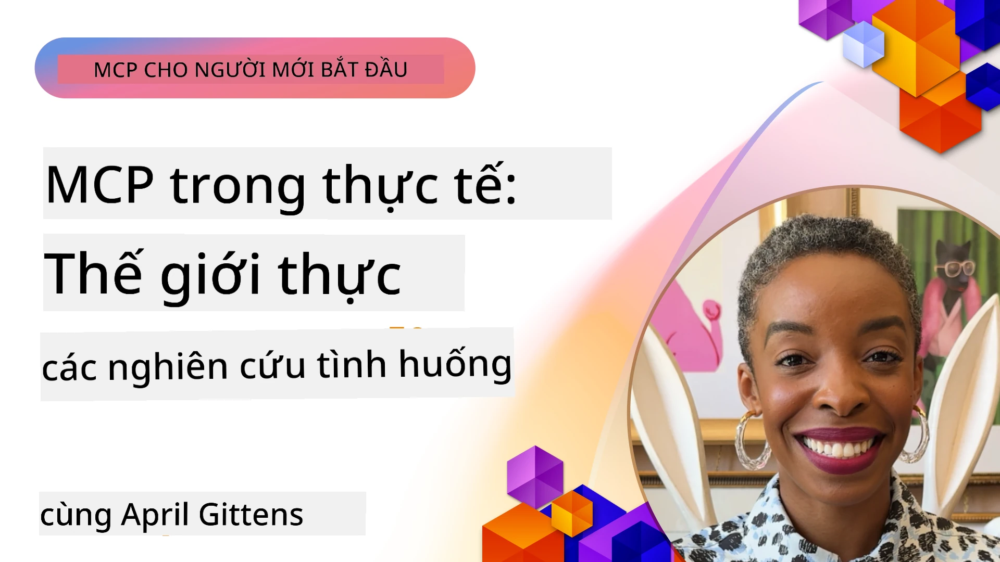

# MCP trong Thực Tiễn: Các Nghiên Cứu Trường Hợp Thực Tế

_(Nhấp vào hình ảnh trên để xem video bài học này)_

Model Context Protocol (MCP) đang thay đổi cách các ứng dụng AI tương tác với dữ liệu, công cụ và dịch vụ. Phần này trình bày các nghiên cứu trường hợp thực tế minh họa các ứng dụng thực tiễn của MCP trong các tình huống doanh nghiệp khác nhau.

## Tổng Quan

Phần này giới thiệu các ví dụ cụ thể về triển khai MCP, làm nổi bật cách các tổ chức đang tận dụng giao thức này để giải quyết các thách thức kinh doanh phức tạp. Qua việc xem xét các nghiên cứu trường hợp này, bạn sẽ hiểu thêm về tính đa dạng, khả năng mở rộng, và lợi ích thực tế của MCP trong các tình huống thế giới thực.

## Mục Tiêu Học Tập Chính

Qua các nghiên cứu trường hợp, bạn sẽ:

- Hiểu cách MCP có thể được áp dụng để giải quyết các vấn đề kinh doanh cụ thể
- Tìm hiểu các mẫu tích hợp khác nhau và các phương pháp kiến trúc
- Nhận diện các thực hành tốt nhất khi triển khai MCP trong môi trường doanh nghiệp
- Nắm được các thách thức và giải pháp gặp phải trong các triển khai thực tế
- Xác định cơ hội áp dụng các mẫu tương tự trong các dự án của riêng bạn

## Các Nghiên Cứu Trường Hợp Nổi Bật

### 1. [Đại Lý Du Lịch AI Azure – Triển Khai Tham Chiếu](./travelagentsample.md)

Nghiên cứu trường hợp này phân tích giải pháp tham chiếu toàn diện của Microsoft, minh họa cách xây dựng ứng dụng lập kế hoạch du lịch đa đại lý, sử dụng trí tuệ nhân tạo với MCP, Azure OpenAI, và Azure AI Search. Dự án này trình bày:

- Điều phối đa đại lý qua MCP
- Tích hợp dữ liệu doanh nghiệp với Azure AI Search
- Kiến trúc bảo mật, có thể mở rộng sử dụng dịch vụ Azure
- Công cụ mở rộng với các thành phần MCP có thể tái sử dụng
- Trải nghiệm người dùng hội thoại do Azure OpenAI hỗ trợ

Kiến trúc và chi tiết triển khai cung cấp những hiểu biết giá trị về xây dựng các hệ thống đa đại lý phức tạp với MCP đóng vai trò lớp điều phối.

### 2. [Cập Nhật Mục Azure DevOps Từ Dữ Liệu YouTube](./UpdateADOItemsFromYT.md)

Nghiên cứu này trình bày ứng dụng thực tế của MCP trong tự động hóa quy trình làm việc. Nó cho thấy cách các công cụ MCP có thể dùng để:

- Trích xuất dữ liệu từ các nền tảng trực tuyến (YouTube)
- Cập nhật các mục công việc trong hệ thống Azure DevOps
- Tạo các quy trình tự động lặp lại
- Tích hợp dữ liệu giữa các hệ thống phân tán

Ví dụ này minh họa cách triển khai MCP tương đối đơn giản nhưng có thể mang lại hiệu quả đáng kể bằng cách tự động hóa các tác vụ thường xuyên và cải thiện sự nhất quán dữ liệu qua các hệ thống.

### 3. [Truy Xuất Tài Liệu Thời Gian Thực với MCP](./docs-mcp/README.md)

Nghiên cứu này hướng dẫn bạn kết nối khách hàng Python console với máy chủ Model Context Protocol (MCP) để truy xuất và ghi lại tài liệu Microsoft có ngữ cảnh thời gian thực. Bạn sẽ học cách:

- Kết nối đến máy chủ MCP sử dụng khách Python và SDK MCP chính thức
- Dùng các khách HTTP streaming để truy xuất dữ liệu thời gian thực hiệu quả
- Gọi các công cụ tài liệu trên máy chủ và ghi nhận phản hồi trực tiếp trên console
- Tích hợp tài liệu Microsoft cập nhật vào quy trình làm việc mà không phải rời khỏi terminal

Chương bao gồm bài tập thực hành, mẫu mã nguồn tối thiểu, và liên kết tới tài nguyên thêm để học sâu hơn. Xem hướng dẫn đầy đủ và mã nguồn trong chương được liên kết để hiểu cách MCP có thể chuyển đổi việc truy cập tài liệu và tăng năng suất cho nhà phát triển trong môi trường console.

### 4. [Ứng Dụng Web Tạo Kế Hoạch Học Tập Tương Tác với MCP](./docs-mcp/README.md)

Nghiên cứu này minh họa cách xây dựng ứng dụng web tương tác sử dụng Chainlit và Model Context Protocol (MCP) để tạo kế hoạch học tập cá nhân hóa cho bất kỳ chủ đề nào. Người dùng có thể chỉ định một môn học (ví dụ "chứng chỉ AI-900") và thời gian học (ví dụ 8 tuần), ứng dụng sẽ cung cấp phân bổ nội dung theo tuần. Chainlit tạo trải nghiệm trò chuyện hội thoại, làm cho trải nghiệm trở nên hấp dẫn và thích ứng.

- Ứng dụng web hội thoại powered by Chainlit
- Lời nhắc do người dùng điều khiển cho chủ đề và thời lượng
- Khuyến nghị nội dung theo tuần sử dụng MCP
- Phản hồi thích nghi, thời gian thực trong giao diện chat

Dự án minh họa cách kết hợp AI hội thoại và MCP để tạo ra công cụ giáo dục động, do người dùng điều khiển trong môi trường web hiện đại.

### 5. [Tài Liệu Tích Hợp Trong Trình Soạn Thảo với MCP Server trong VS Code](./docs-mcp/README.md)

Nghiên cứu này trình bày cách bạn có thể đưa Microsoft Learn Docs trực tiếp vào môi trường VS Code sử dụng MCP server—không còn cần chuyển đổi tab trình duyệt! Bạn sẽ thấy cách:

- Tìm kiếm và đọc tài liệu ngay trong VS Code qua bảng điều khiển MCP hoặc thanh lệnh
- Tham chiếu tài liệu và chèn liên kết trực tiếp vào README hoặc file markdown khóa học
- Sử dụng GitHub Copilot và MCP cùng nhau cho quy trình làm việc tài liệu và mã nguồn AI liền mạch
- Xác thực và nâng cao tài liệu với phản hồi thời gian thực và độ chính xác do Microsoft cung cấp
- Tích hợp MCP với các quy trình GitHub để xác thực tài liệu liên tục

Triển khai bao gồm:

- Cấu hình `.vscode/mcp.json` ví dụ cho cài đặt dễ dàng
- Hướng dẫn qua ảnh chụp màn hình trải nghiệm trong trình soạn thảo
- Mẹo kết hợp Copilot và MCP để tối đa hóa năng suất

Tình huống này phù hợp cho các tác giả khóa học, người viết tài liệu và nhà phát triển muốn tập trung trong trình soạn thảo khi làm việc với tài liệu, Copilot và công cụ xác thực—tất cả đều được MCP hỗ trợ.

### 6. [Tạo MCP Server với APIM](./apimsample.md)

Nghiên cứu này cung cấp hướng dẫn từng bước cách tạo máy chủ MCP sử dụng Azure API Management (APIM). Nội dung bao gồm:

- Thiết lập MCP server trong Azure API Management
- Công khai các thao tác API như công cụ MCP
- Cấu hình chính sách để giới hạn tốc độ và bảo mật
- Kiểm thử MCP server bằng Visual Studio Code và GitHub Copilot

Ví dụ này minh họa cách tận dụng khả năng của Azure để tạo một MCP server vững chắc có thể sử dụng trong nhiều ứng dụng, nâng cao tích hợp hệ thống AI với API doanh nghiệp.

### 7. [GitHub MCP Registry — Thúc Đẩy Tích Hợp Đa Đại Lý](https://github.com/mcp)

Nghiên cứu này xem xét cách GitHub MCP Registry, ra mắt tháng 9 năm 2025, giải quyết thách thức quan trọng trong hệ sinh thái AI: sự phân mảnh trong việc phát hiện và triển khai các máy chủ Model Context Protocol (MCP).

#### Tổng Quan
**MCP Registry** giải quyết khó khăn ngày càng tăng do các MCP server rải rác trên các kho lưu trữ và registry, trước đây khiến việc tích hợp chậm và lỗi dễ xảy ra. Các server này cho phép các đại lý AI tương tác với hệ thống ngoài như API, cơ sở dữ liệu và nguồn tài liệu.

#### Vấn Đề
Các nhà phát triển xây dựng workflow đa đại lý gặp nhiều thách thức:
- **Khó tìm kiếm** các máy chủ MCP trên nhiều nền tảng khác nhau
- **Câu hỏi lặp lại** và rải rác trên diễn đàn và tài liệu
- **Rủi ro bảo mật** từ các nguồn chưa xác minh và không đáng tin cậy
- **Thiếu tiêu chuẩn hóa** về chất lượng và khả năng tương thích của máy chủ

#### Kiến Trúc Giải Pháp
GitHub MCP Registry tập trung các máy chủ MCP được tin cậy với các tính năng chính:
- **Cài đặt một lần nhấp** tích hợp qua VS Code để thiết lập nhanh
- **Sàng lọc tín hiệu trên nhiễu** dựa trên số sao, hoạt động, và xác nhận cộng đồng
- **Tích hợp trực tiếp** với GitHub Copilot và các công cụ MCP tương thích khác
- **Mô hình đóng góp mở** cho phép cộng đồng và đối tác doanh nghiệp cùng tham gia

#### Tác Động Kinh Doanh
Registry mang lại cải thiện đo lường được:
- **Khởi động nhanh hơn** cho nhà phát triển dùng các công cụ như Microsoft Learn MCP Server, phát trực tiếp tài liệu chính thức vào đại lý
- **Nâng cao năng suất** qua các server chuyên biệt như `github-mcp-server`, cung cấp tự động hóa GitHub ngôn ngữ tự nhiên (tạo PR, chạy lại CI, quét mã)
- **Tăng cường lòng tin hệ sinh thái** nhờ danh sách chọn lọc và tiêu chuẩn cấu hình minh bạch

#### Giá Trị Chiến Lược
Đối với những người chuyên về quản lý vòng đời đại lý và workflow có thể tái tạo, MCP Registry cung cấp:
- **Triển khai đại lý mô-đun** với các thành phần tiêu chuẩn hóa
- **Đánh giá qua registry** để kiểm thử và xác thực nhất quán
- **Tương tác công cụ chéo** cho tích hợp liền mạch giữa các nền tảng AI khác nhau

Nghiên cứu này chứng minh MCP Registry không chỉ là một thư mục—mà là nền tảng căn bản cho tích hợp mô hình mở rộng và triển khai hệ thống đại lý thực tế.

## Kết Luận

Bảy nghiên cứu trường hợp toàn diện này cho thấy tính đa dụng và ứng dụng thực tế đáng chú ý của Model Context Protocol trong các kịch bản thực tế đa dạng. Từ hệ thống lập kế hoạch du lịch đa đại lý phức tạp và quản lý API doanh nghiệp đến quy trình tài liệu được hợp lý hóa và MCP Registry cách mạng của GitHub, các ví dụ này trình bày cách MCP cung cấp phương pháp tiêu chuẩn, có thể mở rộng để kết nối hệ thống AI với công cụ, dữ liệu, và dịch vụ họ cần để cung cấp giá trị xuất sắc.

Các nghiên cứu trường hợp bao gồm nhiều khía cạnh triển khai MCP:
- **Tích hợp Doanh nghiệp**: Azure API Management và tự động hóa Azure DevOps
- **Điều phối Đa Đại lý**: Lập kế hoạch du lịch với các đại lý AI phối hợp
- **Năng suất Nhà Phát Triển**: Tích hợp VS Code và truy cập tài liệu thời gian thực
- **Phát Triển Hệ Sinh Thái**: GitHub MCP Registry nền tảng căn bản
- **Ứng Dụng Giáo Dục**: Tạo kế hoạch học tập tương tác và giao diện hội thoại

Qua nghiên cứu các triển khai này, bạn thu được các hiểu biết quan trọng về:
- **Mẫu kiến trúc** cho các quy mô và trường hợp sử dụng khác nhau
- **Chiến lược triển khai** cân bằng giữa chức năng và khả năng duy trì
- **Xem xét bảo mật và khả năng mở rộng** cho triển khai sản xuất
- **Thực hành tốt nhất** cho phát triển máy chủ MCP và tích hợp khách hàng
- **Tư duy hệ sinh thái** xây dựng giải pháp AI kết nối đa chiều

Những ví dụ này tổng hợp minh chứng MCP không chỉ là khung lý thuyết mà là giao thức trưởng thành, sẵn sàng sản xuất, giúp giải quyết thực tế các thách thức kinh doanh phức tạp. Dù bạn đang tạo công cụ tự động đơn giản hay hệ thống đa đại lý tinh vi, các mẫu và phương pháp được trình bày ở đây cung cấp nền tảng vững chắc cho các dự án MCP của riêng bạn.

## Tài Nguyên Bổ Sung

- [Azure AI Travel Agents GitHub Repository](https://github.com/Azure-Samples/azure-ai-travel-agents)
- [Azure DevOps MCP Tool](https://github.com/microsoft/azure-devops-mcp)
- [Playwright MCP Tool](https://github.com/microsoft/playwright-mcp)
- [Microsoft Docs MCP Server](https://github.com/MicrosoftDocs/mcp)
- [GitHub MCP Registry — Thúc Đẩy Tích Hợp Đa Đại Lý](https://github.com/mcp)
- [MCP Community Examples](https://github.com/microsoft/mcp)

## Tiếp Theo

- Trước: [Module 8: Thực Hành Tốt Nhất](../08-BestPractices/README.md)
- Tiếp: [Module 10: Tinh Giản Quy Trình AI: Xây Dựng MCP Server với Bộ Công Cụ AI](../10-StreamliningAIWorkflowsBuildingAnMCPServerWithAIToolkit/README.md)

---

<!-- CO-OP TRANSLATOR DISCLAIMER START -->
**Tuyên bố từ chối trách nhiệm**:  
Tài liệu này đã được dịch bằng dịch vụ dịch thuật AI [Co-op Translator](https://github.com/Azure/co-op-translator). Mặc dù chúng tôi cố gắng đảm bảo độ chính xác, xin lưu ý rằng các bản dịch tự động có thể chứa lỗi hoặc không chính xác. Tài liệu gốc bằng ngôn ngữ gốc nên được coi là nguồn chính thống. Đối với các thông tin quan trọng, khuyến nghị sử dụng dịch thuật chuyên nghiệp do con người thực hiện. Chúng tôi không chịu trách nhiệm đối với bất kỳ sự hiểu lầm hoặc hiểu sai nào phát sinh từ việc sử dụng bản dịch này.
<!-- CO-OP TRANSLATOR DISCLAIMER END -->