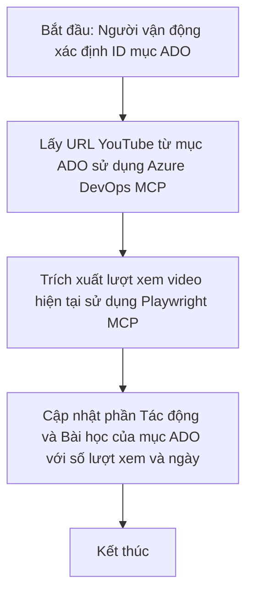

# Case Study: Cập nhật mục Azure DevOps từ dữ liệu YouTube với MCP

> **Tuyên bố miễn trừ:** Đã có các công cụ và báo cáo trực tuyến hiện có có thể tự động hóa quy trình cập nhật các mục Azure DevOps với dữ liệu từ các nền tảng như YouTube. Kịch bản dưới đây được cung cấp chỉ như một ví dụ để minh họa cách các công cụ MCP có thể được áp dụng cho các nhiệm vụ tự động hóa và tích hợp.

## Tổng quan

Nghiên cứu trường hợp này trình bày một ví dụ về cách Model Context Protocol (MCP) và các công cụ của nó có thể được sử dụng để tự động hóa quá trình cập nhật các mục công việc Azure DevOps (ADO) với thông tin lấy từ các nền tảng trực tuyến, chẳng hạn như YouTube. Kịch bản được mô tả chỉ là một minh họa cho các khả năng rộng lớn hơn của các công cụ này, có thể được điều chỉnh cho nhiều nhu cầu tự động hoá tương tự.

Trong ví dụ này, một Advocate theo dõi các phiên trực tuyến sử dụng các mục ADO, mỗi mục bao gồm URL video YouTube. Bằng cách tận dụng các công cụ MCP, Advocate có thể giữ cho các mục ADO được cập nhật với các số liệu video mới nhất, chẳng hạn như lượt xem, một cách lặp lại và tự động. Cách tiếp cận này có thể được tổng quát hóa cho các trường hợp sử dụng khác khi thông tin từ nguồn trực tuyến cần được tích hợp vào ADO hoặc các hệ thống khác.

## Kịch bản

Một Advocate chịu trách nhiệm theo dõi ảnh hưởng của các phiên trực tuyến và sự tương tác cộng đồng. Mỗi phiên được ghi lại dưới dạng một mục công việc ADO trong dự án 'DevRel', và mục công việc có một trường dành cho URL video YouTube. Để báo cáo chính xác phạm vi tiếp cận của phiên, Advocate cần cập nhật mục ADO bằng số lượt xem video hiện tại và ngày lấy thông tin này.

## Công cụ sử dụng

- [Azure DevOps MCP](https://github.com/microsoft/azure-devops-mcp): Cho phép truy cập và cập nhật chương trình các mục công việc ADO thông qua MCP.
- [Playwright MCP](https://github.com/microsoft/playwright-mcp): Tự động hóa các hành động trình duyệt để lấy dữ liệu trực tiếp từ các trang web, như thống kê video YouTube.

## Quy trình bước từng bước

1. **Xác định mục ADO**: Bắt đầu với ID mục công việc ADO (ví dụ, 1234) trong dự án 'DevRel'.
2. **Lấy URL YouTube**: Sử dụng công cụ Azure DevOps MCP để lấy URL YouTube từ mục công việc.
3. **Trích xuất lượt xem video**: Dùng công cụ Playwright MCP để truy cập URL YouTube và lấy số lượt xem hiện tại.
4. **Cập nhật mục ADO**: Ghi số lượt xem mới nhất và ngày lấy dữ liệu vào phần 'Impact and Learnings' của mục công việc ADO bằng công cụ Azure DevOps MCP.

## Ví dụ Prompt

```bash
- Work with the ADO Item ID: 1234
- The project is '2025-Awesome'
- Get the YouTube URL for the ADO item
- Use Playwright to get the current views from the YouTube video
- Update the ADO item with the current video views and the updated date of the information
```

## Mermaid Flowchart


## Triển khai kỹ thuật

- **Điều phối MCP**: Quy trình được điều phối bởi một máy chủ MCP, phối hợp việc sử dụng cả công cụ Azure DevOps MCP và Playwright MCP.
- **Tự động hóa**: Quá trình có thể được kích hoạt thủ công hoặc được lên lịch chạy định kỳ để giữ các mục ADO luôn cập nhật.
- **Khả năng mở rộng**: Mẫu thiết kế này có thể mở rộng để cập nhật các mục ADO với các số liệu trực tuyến khác (ví dụ, lượt thích, bình luận) hoặc từ các nền tảng khác.

## Kết quả và tác động

- **Hiệu quả**: Giảm công sức thủ công cho Advocates bằng cách tự động lấy và cập nhật số liệu video.
- **Độ chính xác**: Đảm bảo các mục ADO phản ánh dữ liệu mới nhất có sẵn từ các nguồn trực tuyến.
- **Tính lặp lại**: Cung cấp một quy trình có thể tái sử dụng cho các kịch bản tương tự liên quan đến các nguồn hoặc số liệu dữ liệu khác.

## Tài liệu tham khảo

- [Azure DevOps MCP](https://github.com/microsoft/azure-devops-mcp)
- [Playwright MCP](https://github.com/microsoft/playwright-mcp)
- [Model Context Protocol (MCP)](https://modelcontextprotocol.io/)

## Tiếp theo

- Quay lại: [Tổng quan các nghiên cứu trường hợp](./README.md)
- Tiếp: [Truy xuất tài liệu thời gian thực với MCP](./docs-mcp/README.md)

---

<!-- CO-OP TRANSLATOR DISCLAIMER START -->
**Tuyên bố từ chối trách nhiệm**:  
Tài liệu này đã được dịch bằng dịch vụ dịch thuật AI [Co-op Translator](https://github.com/Azure/co-op-translator). Mặc dù chúng tôi cố gắng đảm bảo độ chính xác, xin lưu ý rằng bản dịch tự động có thể chứa lỗi hoặc không chính xác. Tài liệu gốc bằng ngôn ngữ nguyên bản vẫn được xem là nguồn chính xác và đáng tin cậy nhất. Đối với các thông tin quan trọng, chúng tôi khuyến nghị sử dụng dịch vụ dịch thuật chuyên nghiệp do con người thực hiện. Chúng tôi không chịu trách nhiệm về bất kỳ sự hiểu lầm hoặc giải thích sai nào phát sinh từ việc sử dụng bản dịch này.
<!-- CO-OP TRANSLATOR DISCLAIMER END -->