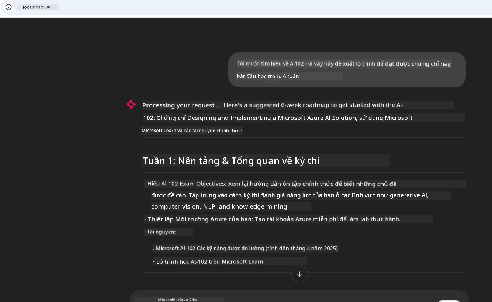

# Case Study: Kết nối với Máy chủ Microsoft Learn Docs MCP từ một Client

Bạn có bao giờ thấy mình đang phải liên tục chuyển đổi giữa các trang tài liệu, Stack Overflow và vô số tab công cụ tìm kiếm, trong khi cố gắng giải quyết một vấn đề trong mã của mình? Có thể bạn giữ một màn hình phụ chỉ dành cho tài liệu, hoặc thường xuyên alt-tab giữa IDE và trình duyệt. Không phải sẽ tuyệt hơn nếu bạn có thể đưa tài liệu trực tiếp vào quy trình làm việc của mình—tích hợp vào ứng dụng, IDE, hoặc thậm chí là các công cụ tùy chỉnh của chính bạn? Trong case study này, chúng ta sẽ khám phá cách thực hiện chính xác điều đó bằng cách kết nối trực tiếp với máy chủ Microsoft Learn Docs MCP từ ứng dụng client của bạn.

## Tổng Quan

Phát triển hiện đại không chỉ là viết mã—mà còn là tìm đúng thông tin đúng lúc. Tài liệu có ở khắp nơi, nhưng hiếm khi nằm ngay nơi bạn cần nhất: bên trong công cụ và quy trình làm việc của bạn. Bằng cách tích hợp việc truy xuất tài liệu trực tiếp vào ứng dụng, bạn có thể tiết kiệm thời gian, giảm thiểu chuyển đổi ngữ cảnh, và tăng năng suất. Trong phần này, chúng tôi sẽ hướng dẫn bạn cách kết nối một client với máy chủ Microsoft Learn Docs MCP, để bạn có thể truy cập tài liệu theo thời gian thực, có nhận thức ngữ cảnh mà không cần rời khỏi ứng dụng.

Chúng ta sẽ cùng đi qua quy trình thiết lập kết nối, gửi yêu cầu, và xử lý phản hồi theo luồng một cách hiệu quả. Cách tiếp cận này không chỉ làm gọn quy trình làm việc của bạn mà còn mở ra cơ hội xây dựng các công cụ phát triển thông minh hơn, hữu ích hơn.

## Mục Tiêu Học Tập

Tại sao chúng ta làm việc này? Bởi vì trải nghiệm phát triển tốt nhất là những trải nghiệm loại bỏ mọi trở ngại. Hãy tưởng tượng một thế giới nơi trình soạn thảo mã của bạn, chatbot, hoặc ứng dụng web có thể trả lời ngay lập tức các câu hỏi về tài liệu, sử dụng nội dung mới nhất từ Microsoft Learn. Sau chương này, bạn sẽ biết cách:

- Hiểu cơ bản về giao tiếp máy chủ-client MCP cho tài liệu
- Triển khai một ứng dụng console hoặc web để kết nối với máy chủ Microsoft Learn Docs MCP
- Sử dụng các client HTTP có khả năng streaming để truy xuất tài liệu theo thời gian thực
- Ghi lại và phân tích phản hồi tài liệu trong ứng dụng của bạn

Bạn sẽ thấy những kỹ năng này giúp bạn xây dựng công cụ không chỉ phản ứng mà thực sự tương tác và có nhận thức ngữ cảnh.

## Kịch Bản 1 - Truy xuất Tài liệu theo Thời gian Thực với MCP

Trong kịch bản này, chúng tôi sẽ hướng dẫn bạn cách kết nối một client với máy chủ Microsoft Learn Docs MCP, để bạn có thể truy cập tài liệu theo thời gian thực, có nhận thức ngữ cảnh mà không cần rời khỏi ứng dụng.

Hãy cùng thực hành. Nhiệm vụ của bạn là viết một ứng dụng kết nối tới máy chủ Microsoft Learn Docs MCP, gọi công cụ `microsoft_docs_search`, và ghi lại phản hồi theo luồng ra console.

### Tại sao chọn cách này?  
Bởi vì đây là nền tảng để xây dựng các tích hợp nâng cao hơn—dù bạn muốn cung cấp sức mạnh cho chatbot, mở rộng IDE, hay dashboard web.

Bạn sẽ tìm thấy mã nguồn và hướng dẫn cho kịch bản này trong thư mục [`solution`](./solution/README.md) trong case study này. Các bước sẽ hướng dẫn bạn thiết lập kết nối:
- Sử dụng SDK MCP chính thức và client HTTP hỗ trợ streaming để kết nối
- Gọi công cụ `microsoft_docs_search` với tham số truy vấn để lấy tài liệu
- Thực hiện ghi log và xử lý lỗi đúng cách
- Tạo giao diện console tương tác cho phép người dùng nhập nhiều truy vấn tìm kiếm

Kịch bản này minh họa cách:
- Kết nối với máy chủ Docs MCP
- Gửi truy vấn
- Phân tích và in kết quả

Dưới đây là ví dụ khi chạy giải pháp:

```
Prompt> What is Azure Key Vault?
Answer> Azure Key Vault is a cloud service for securely storing and accessing secrets. ...
```
  
Dưới đây là mẫu giải pháp tối giản. Mã nguồn đầy đủ và chi tiết có trong thư mục giải pháp.

<details>
<summary>Python</summary>

```python
import asyncio
from mcp.client.streamable_http import streamablehttp_client
from mcp import ClientSession

async def main():
    async with streamablehttp_client("https://learn.microsoft.com/api/mcp") as (read_stream, write_stream, _):
        async with ClientSession(read_stream, write_stream) as session:
            await session.initialize()
            result = await session.call_tool("microsoft_docs_search", {"query": "Azure Functions best practices"})
            print(result.content)

if __name__ == "__main__":
    asyncio.run(main())
```
  
- Để xem triển khai và ghi log hoàn chỉnh, xem file [`scenario1.py`](../../../../09-CaseStudy/docs-mcp/solution/python/scenario1.py).  
- Để biết hướng dẫn cài đặt và sử dụng, xem file [`README.md`](./solution/python/README.md) trong cùng thư mục.
</details>

## Kịch Bản 2 - Ứng dụng Web Tạo Kế hoạch Học Tương tác với MCP

Trong kịch bản này, bạn sẽ học cách tích hợp Docs MCP vào một dự án phát triển web. Mục tiêu là cho phép người dùng tìm kiếm tài liệu Microsoft Learn trực tiếp từ giao diện web, giúp truy cập tài liệu ngay lập tức trong ứng dụng hoặc trang của bạn.

Bạn sẽ thấy cách:
- Thiết lập ứng dụng web
- Kết nối với máy chủ Docs MCP
- Xử lý đầu vào người dùng và hiển thị kết quả

Dưới đây là ví dụ khi chạy giải pháp:

```
User> I want to learn about AI102 - so suggest the roadmap to get it started from learn for 6 weeks

Assistant> Here’s a detailed 6-week roadmap to start your preparation for the AI-102: Designing and Implementing a Microsoft Azure AI Solution certification, using official Microsoft resources and focusing on exam skills areas:

---
## Week 1: Introduction & Fundamentals
- **Understand the Exam**: Review the [AI-102 exam skills outline](https://learn.microsoft.com/en-us/credentials/certifications/exams/ai-102/).
- **Set up Azure**: Sign up for a free Azure account if you don't have one.
- **Learning Path**: [Introduction to Azure AI services](https://learn.microsoft.com/en-us/training/modules/intro-to-azure-ai/)
- **Focus**: Get familiar with Azure portal, AI capabilities, and necessary tools.

....more weeks of the roadmap...

Let me know if you want module-specific recommendations or need more customized weekly tasks!
```
  
Dưới đây là mẫu giải pháp tối giản. Mã nguồn đầy đủ và chi tiết có trong thư mục giải pháp.



<details>
<summary>Python (Chainlit)</summary>

Chainlit là một framework để xây dựng ứng dụng web AI hội thoại. Nó giúp tạo chatbot và trợ lý tương tác có thể gọi các công cụ MCP và hiển thị kết quả theo thời gian thực. Rất phù hợp cho việc tạo mẫu nhanh và giao diện thân thiện với người dùng.

```python
import chainlit as cl
import requests

MCP_URL = "https://learn.microsoft.com/api/mcp"

@cl.on_message
def handle_message(message):
    query = {"question": message}
    response = requests.post(MCP_URL, json=query)
    if response.ok:
        result = response.json()
        cl.Message(content=result.get("answer", "No answer found.")).send()
    else:
        cl.Message(content="Error: " + response.text).send()
```
  
- Để xem triển khai hoàn chỉnh, xem file [`scenario2.py`](../../../../09-CaseStudy/docs-mcp/solution/python/scenario2.py).  
- Để biết hướng dẫn cài đặt và chạy, xem file [`README.md`](./solution/python/README.md).
</details>

## Kịch Bản 3: Tài liệu Trong Trình Soạn Thảo với MCP Server trong VS Code

Nếu bạn muốn truy cập trực tiếp Microsoft Learn Docs ngay trong VS Code của mình (thay vì chuyển đổi giữa các tab trình duyệt), bạn có thể sử dụng MCP server trong trình soạn thảo. Việc này cho phép bạn:
- Tìm kiếm và đọc tài liệu trong VS Code mà không cần rời khỏi môi trường lập trình.
- Tham khảo tài liệu và chèn liên kết trực tiếp vào file README hoặc học liệu.
- Kết hợp GitHub Copilot và MCP để có quy trình làm việc tài liệu được hỗ trợ bởi AI liền mạch.

**Bạn sẽ thấy cách:**
- Thêm file `.vscode/mcp.json` hợp lệ ở thư mục gốc workspace (xem ví dụ dưới đây).
- Mở panel MCP hoặc sử dụng command palette trong VS Code để tìm kiếm và chèn tài liệu.
- Tham khảo tài liệu trực tiếp trong file markdown khi làm việc.
- Kết hợp quy trình này với GitHub Copilot để tăng năng suất hơn nữa.

Dưới đây là ví dụ về cách thiết lập MCP server trong VS Code:

```json
{
  "servers": {
    "LearnDocsMCP": {
      "url": "https://learn.microsoft.com/api/mcp"
    }
  }
}
```
  
</details>

> Để xem hướng dẫn chi tiết kèm ảnh chụp màn hình và các bước thực hiện, xem [`README.md`](./solution/scenario3/README.md).


Cách tiếp cận này rất phù hợp cho những ai xây dựng khóa học kỹ thuật, viết tài liệu, hoặc phát triển mã có nhu cầu tham khảo tài liệu thường xuyên.

## Những Điều Cần Nhớ

Tích hợp tài liệu trực tiếp vào công cụ không chỉ là tiện lợi—mà còn là bước ngoặt cho năng suất. Bằng cách kết nối với máy chủ Microsoft Learn Docs MCP từ client, bạn có thể:

- Loại bỏ việc chuyển đổi ngữ cảnh giữa mã và tài liệu
- Truy xuất tài liệu cập nhật và nhận thức ngữ cảnh theo thời gian thực
- Xây dựng công cụ phát triển thông minh hơn, tương tác hơn

Những kỹ năng này giúp bạn tạo ra các giải pháp không chỉ hiệu quả mà còn rất thú vị khi sử dụng.

## Tài Nguyên Bổ Sung

Để hiểu sâu hơn, hãy khám phá các tài nguyên chính thức sau:

- [Microsoft Learn Docs MCP Server (GitHub)](https://github.com/MicrosoftDocs/mcp)
- [Bắt đầu với Azure MCP Server (mcp-python)](https://learn.microsoft.com/en-us/azure/developer/azure-mcp-server/get-started#create-the-python-app)
- [Azure MCP Server là gì?](https://learn.microsoft.com/en-us/azure/developer/azure-mcp-server/)
- [Giới thiệu về Model Context Protocol (MCP)](https://modelcontextprotocol.io/introduction)
- [Thêm plugin từ MCP Server (Python)](https://learn.microsoft.com/en-us/semantic-kernel/concepts/plugins/adding-mcp-plugins)

## Tiếp Theo

- Quay lại: [Tổng quan Case Studies](../README.md)  
- Tiếp tục đến: [Module 10: Streamlining AI Workflows with AI Toolkit](../../10-StreamliningAIWorkflowsBuildingAnMCPServerWithAIToolkit/README.md)

---

<!-- CO-OP TRANSLATOR DISCLAIMER START -->
**Tuyên bố từ chối trách nhiệm**:  
Tài liệu này đã được dịch bằng dịch vụ dịch thuật AI [Co-op Translator](https://github.com/Azure/co-op-translator). Mặc dù chúng tôi cố gắng đảm bảo độ chính xác, xin lưu ý rằng bản dịch tự động có thể chứa lỗi hoặc sự không chính xác. Tài liệu gốc bằng ngôn ngữ gốc của nó nên được xem là nguồn tham khảo chính xác nhất. Đối với các thông tin quan trọng, nên dùng dịch vụ dịch thuật chuyên nghiệp bởi con người. Chúng tôi không chịu trách nhiệm đối với bất kỳ sự hiểu lầm hay giải thích sai nào phát sinh từ việc sử dụng bản dịch này.
<!-- CO-OP TRANSLATOR DISCLAIMER END -->