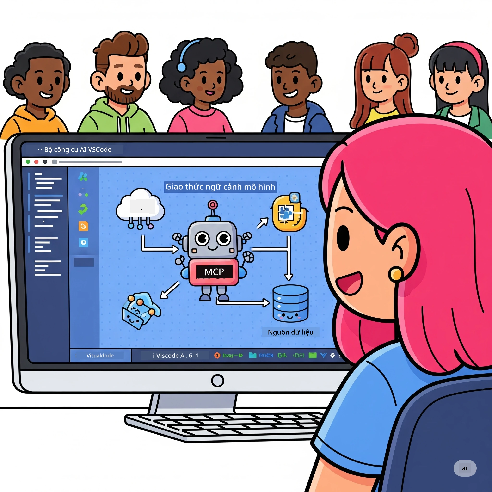
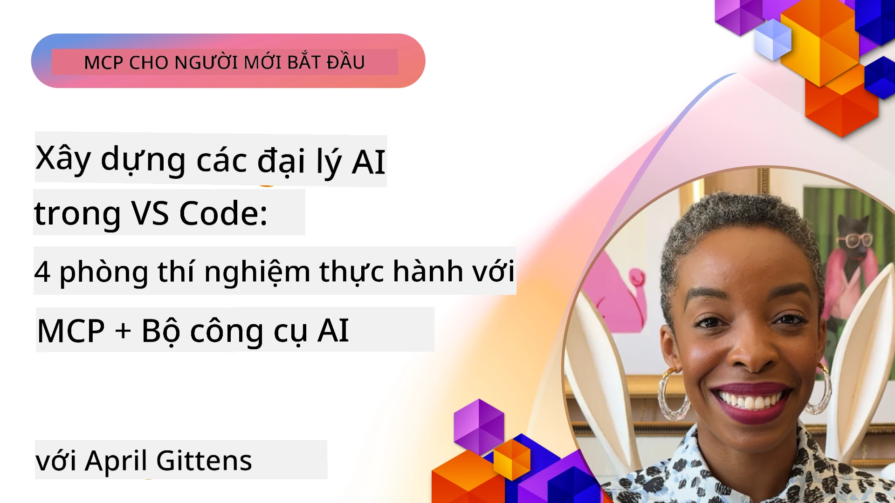

# Tinh giản Quy trình làm việc AI: Xây dựng Máy chủ MCP với AI Toolkit

## 🎯 Tổng quan

_(Nhấn vào hình trên để xem video bài học này)_

Chào mừng đến với **Hội thảo Model Context Protocol (MCP)**! Hội thảo thực hành toàn diện này kết hợp hai công nghệ tiên tiến để cách mạng hóa phát triển ứng dụng AI:

- **🔗 Model Context Protocol (MCP)**: Chuẩn mở cho tích hợp công cụ AI mượt mà
- **🛠️ AI Toolkit cho Visual Studio Code (AITK)**: Tiện ích phát triển AI mạnh mẽ của Microsoft

### 🎓 Bạn sẽ học được gì

Sau hội thảo này, bạn sẽ thành thạo kỹ năng xây dựng ứng dụng thông minh kết nối các mô hình AI với các công cụ và dịch vụ thực tế. Từ kiểm thử tự động đến tích hợp API tùy chỉnh, bạn sẽ có kỹ năng thực tế để giải quyết các thách thức kinh doanh phức tạp.

## 🏗️ Nhóm công nghệ

### 🔌 Model Context Protocol (MCP)

MCP là **"USB-C của AI"** - một chuẩn kết nối phổ quát giúp các mô hình AI liên kết với công cụ và nguồn dữ liệu bên ngoài.

**✨ Tính năng chính:**

- 🔄 **Tích hợp chuẩn hóa**: Giao diện chung cho kết nối công cụ AI
- 🏛️ **Kiến trúc linh hoạt**: Máy chủ cục bộ & từ xa qua giao thức stdio/SSE
- 🧰 **Hệ sinh thái đa dạng**: Công cụ, câu lệnh, và tài nguyên trong một giao thức
- 🔒 **Sẵn sàng cho doanh nghiệp**: Bảo mật và độ tin cậy tích hợp sẵn

**🎯 Tại sao MCP quan trọng:**
Giống như USB-C đã loại bỏ sự lộn xộn về cáp, MCP loại bỏ sự phức tạp trong tích hợp AI. Một giao thức, vô hạn khả năng.

### 🤖 AI Toolkit cho Visual Studio Code (AITK)

Tiện ích phát triển AI chủ lực của Microsoft biến VS Code thành trung tâm AI mạnh mẽ.

**🚀 Khả năng cốt lõi:**

- 📦 **Danh mục mô hình**: Truy cập các mô hình từ Azure AI, GitHub, Hugging Face, Ollama
- ⚡ **Suy luận cục bộ**: Thực thi tối ưu ONNX trên CPU/GPU/NPU
- 🏗️ **Trình xây dựng đại lý**: Phát triển đại lý AI trực quan với tích hợp MCP
- 🎭 **Đa phương thức**: Hỗ trợ văn bản, hình ảnh và đầu ra có cấu trúc

**💡 Lợi ích phát triển:**

- Triển khai mô hình không cần cấu hình
- Kỹ thuật tạo câu lệnh trực quan
- Sân chơi kiểm thử thời gian thực
- Tích hợp máy chủ MCP liền mạch

## 📚 Hành trình học tập

### [🚀 Module 1: Kiến thức cơ bản AI Toolkit](./lab1/README.md)

**Thời lượng**: 15 phút

- 🛠️ Cài đặt và cấu hình AI Toolkit cho VS Code
- 🗂️ Khám phá Danh mục Mô hình (hơn 100 mô hình từ GitHub, ONNX, OpenAI, Anthropic, Google)
- 🎮 Làm chủ Sân chơi Tương tác để kiểm thử mô hình thời gian thực
- 🤖 Xây dựng đại lý AI đầu tiên với Trình xây dựng đại lý
- 📊 Đánh giá hiệu suất mô hình với các chỉ số tích hợp (F1, mức liên quan, độ tương đồng, sự mạch lạc)
- ⚡ Học xử lý theo lô và khả năng đa phương thức

**🎯 Mục tiêu học tập**: Tạo đại lý AI thực thi được với hiểu biết toàn diện về năng lực của AITK

### [🌐 Module 2: MCP với kiến thức cơ bản AI Toolkit](./lab2/README.md)

**Thời lượng**: 20 phút

- 🧠 Hiểu sâu kiến trúc và khái niệm Model Context Protocol (MCP)
- 🌐 Khám phá hệ sinh thái máy chủ MCP của Microsoft
- 🤖 Xây dựng đại lý tự động trình duyệt sử dụng máy chủ Playwright MCP
- 🔧 Tích hợp máy chủ MCP với Trình xây dựng đại lý AI Toolkit
- 📊 Cấu hình và kiểm thử công cụ MCP trong đại lý của bạn
- 🚀 Xuất và triển khai đại lý dùng MCP cho môi trường sản xuất

**🎯 Mục tiêu học tập**: Triển khai đại lý AI được tăng cường bởi công cụ bên ngoài qua MCP

### [🔧 Module 3: Phát triển MCP nâng cao với AI Toolkit](./lab3/README.md)

**Thời lượng**: 20 phút

- 💻 Tạo máy chủ MCP tùy chỉnh bằng AI Toolkit
- 🐍 Cấu hình và sử dụng bộ SDK MCP Python mới nhất (v1.9.3)
- 🔍 Thiết lập và sử dụng MCP Inspector để gỡ lỗi
- 🛠️ Xây dựng Máy chủ thời tiết MCP với quy trình gỡ lỗi chuyên nghiệp
- 🧪 Gỡ lỗi máy chủ MCP trong cả môi trường Trình xây dựng đại lý và Inspector

**🎯 Mục tiêu học tập**: Phát triển và gỡ lỗi máy chủ MCP tùy chỉnh với công cụ hiện đại

### [🐙 Module 4: Phát triển MCP thực tiễn - Máy chủ GitHub Clone tùy chỉnh](./lab4/README.md)

**Thời lượng**: 30 phút

- 🏗️ Xây dựng máy chủ GitHub Clone MCP thực tế cho quy trình phát triển
- 🔄 Triển khai nhân bản kho thông minh với xác thực và xử lý lỗi
- 📁 Tạo quản lý thư mục thông minh và tích hợp VS Code
- 🤖 Sử dụng Chế độ Đại lý GitHub Copilot với công cụ MCP tùy chỉnh
- 🛡️ Áp dụng tính tin cậy sẵn sàng sản xuất và tương thích đa nền tảng

**🎯 Mục tiêu học tập**: Triển khai máy chủ MCP sẵn sàng sản xuất giúp tinh giản quy trình phát triển thực tế

## 💡 Ứng dụng thực tiễn & Tác động

### 🏢 Trường hợp sử dụng doanh nghiệp

#### 🔄 Tự động hóa DevOps

Biến đổi quy trình phát triển của bạn bằng tự động hóa thông minh:

- **Quản lý kho thông minh**: Đánh giá mã và quyết định hợp nhất dựa trên AI
- **CI/CD thông minh**: Tối ưu pipeline tự động dựa trên thay đổi mã
- **Phân loại sự cố**: Phân loại bug và giao nhiệm vụ tự động

#### 🧪 Cách mạng Đảm bảo chất lượng

Nâng cao kiểm thử với tự động hóa AI:

- **Tạo kiểm thử thông minh**: Tự động tạo bộ kiểm thử toàn diện
- **Kiểm thử hồi quy trực quan**: Phát hiện thay đổi giao diện bằng AI
- **Giám sát hiệu suất**: Nhận diện và giải quyết vấn đề chủ động

#### 📊 Trí tuệ quy trình dữ liệu

Xây dựng quy trình xử lý dữ liệu thông minh hơn:

- **Quy trình ETL thích ứng**: Tự tối ưu chuyển đổi dữ liệu
- **Phát hiện bất thường**: Giám sát chất lượng dữ liệu thời gian thực
- **Điều phối thông minh**: Quản lý luồng dữ liệu thông minh

#### 🎧 Nâng cao trải nghiệm khách hàng

Tạo tương tác khách hàng nổi bật:

- **Hỗ trợ nhận biết bối cảnh**: Đại lý AI truy cập lịch sử khách hàng
- **Giải quyết sự cố chủ động**: Dịch vụ khách hàng dự đoán
- **Tích hợp đa kênh**: Trải nghiệm AI thống nhất trên nhiều nền tảng

## 🛠️ Yêu cầu & Cài đặt

### 💻 Yêu cầu hệ thống

| Thành phần | Yêu cầu | Ghi chú |
|-----------|-------------|-------|
| **Hệ điều hành** | Windows 10+, macOS 10.15+, Linux | Bất kỳ hệ điều hành hiện đại nào |
| **Visual Studio Code** | Phiên bản ổn định mới nhất | Cần thiết cho AITK |
| **Node.js** | v18.0+ và npm | Cho phát triển máy chủ MCP |
| **Python** | 3.10+ | Tùy chọn cho máy chủ MCP Python |
| **Bộ nhớ** | Bộ nhớ RAM tối thiểu 8GB | Khuyến nghị 16GB cho mô hình cục bộ |

### 🔧 Môi trường phát triển

#### Các tiện ích VS Code được đề xuất

- **AI Toolkit** (ms-windows-ai-studio.windows-ai-studio)
- **Python** (ms-python.python)
- **Python Debugger** (ms-python.debugpy)
- **GitHub Copilot** (GitHub.copilot) - Tùy chọn nhưng hữu ích

#### Công cụ tùy chọn

- **uv**: Trình quản lý package Python hiện đại
- **MCP Inspector**: Công cụ gỡ lỗi trực quan cho máy chủ MCP
- **Playwright**: Cho các ví dụ tự động hóa web

## 🎖️ Kết quả học tập & Lộ trình chứng nhận

### 🏆 Danh mục kỹ năng thành thạo

Hoàn thành hội thảo này, bạn sẽ đạt được thành thạo trong:

#### 🎯 Năng lực cốt lõi

- [ ] **Thành thạo giao thức MCP**: Hiểu sâu kiến trúc và mẫu triển khai
- [ ] **Thành thạo AITK**: Sử dụng chuyên sâu AI Toolkit để phát triển nhanh
- [ ] **Phát triển máy chủ tùy chỉnh**: Xây dựng, triển khai và bảo trì máy chủ MCP sản xuất
- [ ] **Xuất sắc tích hợp công cụ**: Kết nối AI với quy trình phát triển hiện hữu trơn tru
- [ ] **Ứng dụng giải quyết vấn đề**: Áp dụng kỹ năng vào thử thách kinh doanh thực tế

#### 🔧 Kỹ năng kỹ thuật

- [ ] Thiết lập và cấu hình AI Toolkit trong VS Code
- [ ] Thiết kế và triển khai máy chủ MCP tùy chỉnh
- [ ] Tích hợp Mô hình GitHub với kiến trúc MCP
- [ ] Xây dựng quy trình kiểm thử tự động với Playwright
- [ ] Triển khai đại lý AI cho môi trường sản xuất
- [ ] Gỡ lỗi và tối ưu hiệu suất máy chủ MCP

#### 🚀 Khả năng nâng cao

- [ ] Kiến trúc tích hợp AI quy mô doanh nghiệp
- [ ] Triển khai các thực hành bảo mật tốt nhất cho ứng dụng AI
- [ ] Thiết kế kiến trúc máy chủ MCP có khả năng mở rộng
- [ ] Tạo chuỗi công cụ tùy chỉnh cho các lĩnh vực cụ thể
- [ ] Hướng dẫn người khác phát triển AI-native

## 📖 Tài nguyên bổ sung

- [Đặc tả MCP (2025-11-25)](https://spec.modelcontextprotocol.io/specification/2025-11-25/)
- [Kho GitHub AI Toolkit](https://github.com/microsoft/vscode-ai-toolkit)
- [Bộ sưu tập Máy chủ MCP Mẫu](https://github.com/modelcontextprotocol/servers)
- [Hướng dẫn Thực hành tốt nhất](https://modelcontextprotocol.io/docs/best-practices)
- [OWASP MCP Top 10](https://microsoft.github.io/mcp-azure-security-guide/mcp/) - Thực hành bảo mật tốt nhất

---

**🚀 Sẵn sàng cách mạng hóa quy trình phát triển AI của bạn?**

Hãy cùng xây dựng tương lai ứng dụng thông minh với MCP và AI Toolkit!

## Tiếp theo

Tiếp tục đến: [Module 11: MCP Server Hands-On Labs](../11-MCPServerHandsOnLabs/README.md)

---

<!-- CO-OP TRANSLATOR DISCLAIMER START -->
**Tuyên bố từ chối trách nhiệm**:  
Tài liệu này đã được dịch bằng dịch vụ dịch thuật AI [Co-op Translator](https://github.com/Azure/co-op-translator). Mặc dù chúng tôi cố gắng đảm bảo độ chính xác, xin lưu ý rằng các bản dịch tự động có thể chứa lỗi hoặc không hoàn toàn chính xác. Tài liệu gốc bằng ngôn ngữ nguyên bản nên được xem là nguồn thông tin chính thống. Đối với các thông tin quan trọng, khuyến nghị sử dụng dịch vụ dịch thuật chuyên nghiệp do con người thực hiện. Chúng tôi không chịu trách nhiệm về bất kỳ sự hiểu lầm hoặc giải thích sai nào phát sinh từ việc sử dụng bản dịch này.
<!-- CO-OP TRANSLATOR DISCLAIMER END -->