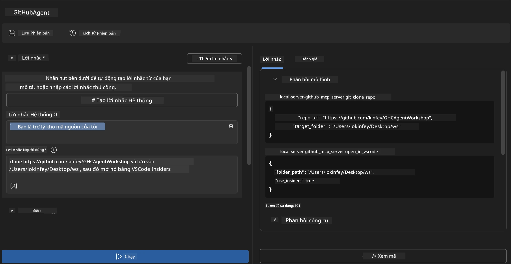
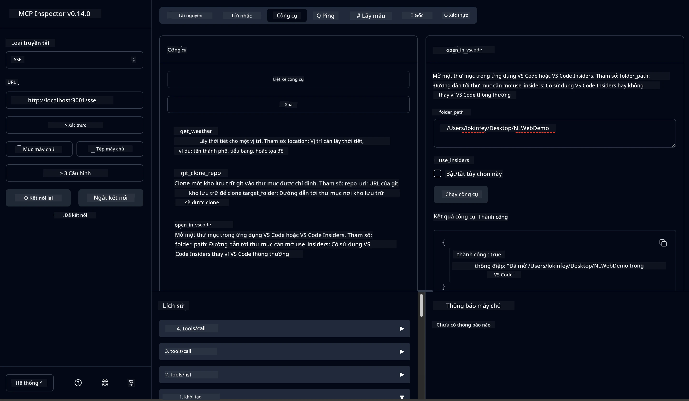

# 🐙 Mô-đun 4: Phát Triển MCP Thực Tiễn - Máy chủ Cloning GitHub Tùy Chỉnh


> **⚡ Khởi Động Nhanh:** Xây dựng máy chủ MCP sẵn sàng sản xuất tự động hóa việc cloning kho GitHub và tích hợp VS Code chỉ trong 30 phút!

## 🎯 Mục Tiêu Học Tập

Cuối bài lab này, bạn sẽ có thể:

- ✅ Tạo máy chủ MCP tùy chỉnh cho quy trình phát triển thực tế
- ✅ Triển khai chức năng cloning kho GitHub qua MCP
- ✅ Tích hợp máy chủ MCP tùy chỉnh với VS Code và Agent Builder
- ✅ Sử dụng Chế Độ Agent của GitHub Copilot với các công cụ MCP tùy chỉnh
- ✅ Kiểm tra và triển khai máy chủ MCP tùy chỉnh trong môi trường sản xuất

## 📋 Yêu Cầu Tiền Đề

- Hoàn thành các Lab 1-3 (cơ bản và nâng cao về MCP)
- Đăng ký GitHub Copilot ([có đăng ký miễn phí](https://github.com/github-copilot/signup))
- VS Code với tiện ích AI Toolkit và GitHub Copilot đã cài đặt
- Git CLI được cài đặt và cấu hình

## 🏗️ Tổng Quan Dự Án

### **Thách Thức Phát Triển Thực Tế**
Là nhà phát triển, chúng ta thường xuyên dùng GitHub để clone kho và mở trong VS Code hoặc VS Code Insiders. Quy trình thủ công này gồm:
1. Mở terminal/cmd
2. Điều hướng đến thư mục mong muốn
3. Chạy lệnh `git clone`
4. Mở VS Code trong thư mục mới clone

**Giải pháp MCP của chúng ta sẽ hợp nhất thành một lệnh thông minh duy nhất!**

### **Bạn Sẽ Xây Dựng**
Một **Máy Chủ GitHub Clone MCP** (`git_mcp_server`) với các tính năng:

| Tính Năng | Mô Tả | Lợi Ích |
|---------|-------------|---------|
| 🔄 **Cloning Kho Thông Minh** | Clone kho GitHub kèm xác thực | Tự động kiểm lỗi |
| 📁 **Quản Lý Thư Mục Thông Minh** | Kiểm tra và tạo thư mục an toàn | Ngăn chặn ghi đè |
| 🚀 **Tích Hợp VS Code Đa Nền Tảng** | Mở dự án trong VS Code/Insiders | Chuyển đổi quy trình liền mạch |
| 🛡️ **Xử Lý Lỗi Đường Thẳng** | Xử lý lỗi mạng, quyền, đường dẫn | Đảm bảo độ tin cậy trong sản xuất |

---

## 📖 Hướng Dẫn Thực Hiện Từng Bước

### Bước 1: Tạo Agent GitHub trong Agent Builder

1. **Khởi chạy Agent Builder** thông qua tiện ích AI Toolkit
2. **Tạo agent mới** với cấu hình sau:
   ```
   Agent Name: GitHubAgent
   ```

3. **Khởi tạo máy chủ MCP tùy chỉnh:**
   - Điều hướng **Tools** → **Add Tool** → **MCP Server**
   - Chọn **"Create A new MCP Server"**
   - Chọn **mẫu Python** để linh hoạt tối đa
   - **Tên máy chủ:** `git_mcp_server`

### Bước 2: Cấu Hình Chế Độ Agent GitHub Copilot

1. **Mở GitHub Copilot** trong VS Code (Ctrl/Cmd + Shift + P → "GitHub Copilot: Open")
2. **Chọn Model Agent** trong giao diện Copilot
3. **Chọn model Claude 3.7** để tăng cường khả năng suy luận
4. **Bật tích hợp MCP** để truy cập công cụ

> **💡 Mẹo Pro:** Claude 3.7 cung cấp hiểu biết vượt trội về quy trình phát triển và xử lý lỗi.

### Bước 3: Triển Khai Chức Năng Cốt Lõi của MCP Server

**Sử dụng prompt chi tiết sau với chế độ Agent của GitHub Copilot:**

```
Create two MCP tools with the following comprehensive requirements:

🔧 TOOL A: clone_repository
Requirements:
- Clone any GitHub repository to a specified local folder
- Return the absolute path of the successfully cloned project
- Implement comprehensive validation:
  ✓ Check if target directory already exists (return error if exists)
  ✓ Validate GitHub URL format (https://github.com/user/repo)
  ✓ Verify git command availability (prompt installation if missing)
  ✓ Handle network connectivity issues
  ✓ Provide clear error messages for all failure scenarios

🚀 TOOL B: open_in_vscode
Requirements:
- Open specified folder in VS Code or VS Code Insiders
- Cross-platform compatibility (Windows/Linux/macOS)
- Use direct application launch (not terminal commands)
- Auto-detect available VS Code installations
- Handle cases where VS Code is not installed
- Provide user-friendly error messages

Additional Requirements:
- Follow MCP 1.9.3 best practices
- Include proper type hints and documentation
- Implement logging for debugging purposes
- Add input validation for all parameters
- Include comprehensive error handling
```

### Bước 4: Kiểm Tra Máy Chủ MCP Của Bạn

#### 4a. Kiểm Tra Trong Agent Builder

1. **Khởi chạy cấu hình debug** cho Agent Builder
2. **Cấu hình agent với prompt hệ thống sau:**

```
SYSTEM_PROMPT:
You are my intelligent coding repository assistant. You help developers efficiently clone GitHub repositories and set up their development environment. Always provide clear feedback about operations and handle errors gracefully.
```

3. **Thử nghiệm với các kịch bản người dùng thực tế:**

```
USER_PROMPT EXAMPLES:

Scenario : Basic Clone and Open
"Clone {Your GitHub Repo link such as https://github.com/kinfey/GHCAgentWorkshop
 } and save to {The global path you specify}, then open it with VS Code Insiders"
```



**Kết Quả Mong Đợi:**
- ✅ Clone thành công với xác nhận đường dẫn
- ✅ Tự động mở VS Code
- ✅ Thông báo lỗi rõ ràng cho các tình huống không hợp lệ
- ✅ Xử lý đúng các trường hợp rìa

#### 4b. Kiểm Tra Trong MCP Inspector




---


**🎉 Chúc mừng!** Bạn đã thành công tạo ra một máy chủ MCP thực tiễn, sẵn sàng sản xuất giải quyết các thách thức trong quy trình phát triển thực tế. Máy chủ cloning GitHub tùy chỉnh của bạn chứng minh sức mạnh của MCP trong tự động hóa và nâng cao năng suất nhà phát triển.

### 🏆 Thành Tựu Đạt Được:
- ✅ **Nhà Phát Triển MCP** - Tạo máy chủ MCP tùy chỉnh
- ✅ **Chuyên Gia Tự Động Hóa Quy Trình** - Tinh gọn tiến trình phát triển  
- ✅ **Chuyên Gia Tích Hợp** - Kết nối nhiều công cụ phát triển
- ✅ **Sẵn Sàng Sản Xuất** - Xây dựng giải pháp có thể triển khai

---

## 🎓 Hoàn Thành Workshop: Hành Trình Với Model Context Protocol

**Tham Gia Viên Workshop thân mến,**

Chúc mừng bạn đã hoàn thành cả bốn mô-đun của workshop Model Context Protocol! Bạn đã đi được quãng đường dài từ khi hiểu các khái niệm cơ bản của AI Toolkit tới xây dựng các máy chủ MCP sẵn sàng sản xuất giải quyết các thách thức phát triển thực tế.

### 🚀 Tóm Tắt Lộ Trình Học Tập Của Bạn:

**[Mô-đun 1](../lab1/README.md)**: Bắt đầu khám phá các khái niệm cơ bản AI Toolkit, kiểm thử mô hình và tạo agent AI đầu tiên.

**[Mô-đun 2](../lab2/README.md)**: Tìm hiểu kiến trúc MCP, tích hợp Playwright MCP, và xây dựng agent tự động trình duyệt đầu tiên.

**[Mô-đun 3](../lab3/README.md)**: Nâng cao phát triển máy chủ MCP tùy chỉnh với máy chủ Weather MCP và thành thạo công cụ gỡ lỗi.

**[Mô-đun 4](../lab4/README.md)**: Áp dụng tất cả để tạo công cụ tự động hóa quy trình kho GitHub thực tế.

### 🌟 Những Gì Bạn Đã Thành Thạo:

- ✅ **Hệ Sinh Thái AI Toolkit**: Mô hình, agent, mẫu tích hợp
- ✅ **Kiến Trúc MCP**: Thiết kế client-server, giao thức truyền tải, bảo mật
- ✅ **Công Cụ Phát Triển**: Từ Playground đến Inspector tới triển khai sản xuất
- ✅ **Phát Triển Tùy Chỉnh**: Xây dựng, kiểm thử và triển khai máy chủ MCP của riêng bạn
- ✅ **Ứng Dụng Thực Tiễn**: Giải quyết thách thức quy trình thực tế với AI

### 🔮 Các Bước Tiếp Theo Của Bạn:

1. **Xây Dựng Máy Chủ MCP Riêng**: Áp dụng kỹ năng này để tự động hóa quy trình riêng của bạn
2. **Tham Gia Cộng Đồng MCP**: Chia sẻ sản phẩm và học hỏi từ người khác
3. **Khám Phá Tích Hợp Nâng Cao**: Kết nối máy chủ MCP với hệ thống doanh nghiệp
4. **Đóng Góp Mã Nguồn Mở**: Giúp cải thiện công cụ MCP và tài liệu

Hãy nhớ, workshop này chỉ mới là khởi đầu. Hệ sinh thái Model Context Protocol đang phát triển nhanh chóng, và bạn bây giờ được trang bị để dẫn đầu các công cụ phát triển dựa trên AI.

**Cảm ơn bạn đã tham gia và nỗ lực học tập!**

Chúng tôi hy vọng workshop này đã thổi bùng ý tưởng sẽ thay đổi cách bạn xây dựng và tương tác với công cụ AI trong hành trình phát triển.

**Chúc code vui vẻ!**

---

## Phần Tiếp Theo

Chúc mừng bạn đã hoàn thành tất cả các lab trong Mô-đun 10!

- Quay lại: [Tổng Quan Mô-đun 10](../README.md)
- Tiếp tục đến: [Mô-đun 11: Lab Thực Hành Máy Chủ MCP](../../11-MCPServerHandsOnLabs/README.md)

---

<!-- CO-OP TRANSLATOR DISCLAIMER START -->
**Tuyên bố từ chối trách nhiệm**:  
Tài liệu này đã được dịch bằng dịch vụ dịch thuật AI [Co-op Translator](https://github.com/Azure/co-op-translator). Mặc dù chúng tôi cố gắng đảm bảo độ chính xác, xin lưu ý rằng các bản dịch tự động có thể chứa lỗi hoặc không chính xác. Tài liệu gốc bằng ngôn ngữ bản địa nên được coi là nguồn tham khảo chính thức. Đối với những thông tin quan trọng, nên sử dụng dịch vụ dịch thuật chuyên nghiệp của con người. Chúng tôi không chịu trách nhiệm về bất kỳ sự hiểu nhầm hay diễn giải sai nào phát sinh từ việc sử dụng bản dịch này.
<!-- CO-OP TRANSLATOR DISCLAIMER END -->