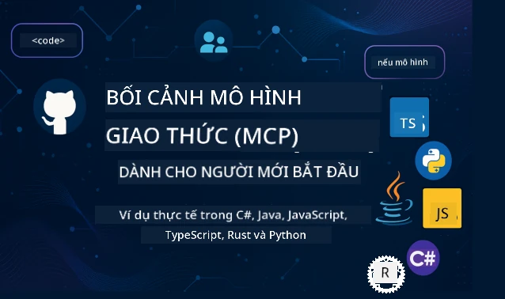

 

[](https://GitHub.com/microsoft/mcp-for-beginners/graphs/contributors)
[](https://GitHub.com/microsoft/mcp-for-beginners/issues)
[](https://GitHub.com/microsoft/mcp-for-beginners/pulls)
[](http://makeapullrequest.com)

[](https://GitHub.com/microsoft/mcp-for-beginners/watchers)
[](https://GitHub.com/microsoft/mcp-for-beginners/fork)
[](https://GitHub.com/microsoft/mcp-for-beginners/stargazers)


[](https://discord.gg/nTYy5BXMWG)

Làm theo các bước này để bắt đầu sử dụng các tài nguyên này:
1. **Fork Repository**: Nhấp vào [](https://GitHub.com/microsoft/mcp-for-beginners/fork)
2. **Clone Repository**:   `git clone https://github.com/microsoft/mcp-for-beginners.git`
3. **Tham gia** [](https://discord.gg/nTYy5BXMWG)


### 🌐 Hỗ Trợ Đa Ngôn Ngữ

#### Hỗ trợ qua GitHub Action (Tự động & Luôn Cập Nhật)

<!-- CO-OP TRANSLATOR LANGUAGES TABLE START -->
[Arabic](../ar/README.md) | [Bengali](../bn/README.md) | [Bulgarian](../bg/README.md) | [Burmese (Myanmar)](../my/README.md) | [Chinese (Simplified)](../zh-CN/README.md) | [Chinese (Traditional, Hong Kong)](../zh-HK/README.md) | [Chinese (Traditional, Macau)](../zh-MO/README.md) | [Chinese (Traditional, Taiwan)](../zh-TW/README.md) | [Croatian](../hr/README.md) | [Czech](../cs/README.md) | [Danish](../da/README.md) | [Dutch](../nl/README.md) | [Estonian](../et/README.md) | [Finnish](../fi/README.md) | [French](../fr/README.md) | [German](../de/README.md) | [Greek](../el/README.md) | [Hebrew](../he/README.md) | [Hindi](../hi/README.md) | [Hungarian](../hu/README.md) | [Indonesian](../id/README.md) | [Italian](../it/README.md) | [Japanese](../ja/README.md) | [Kannada](../kn/README.md) | [Korean](../ko/README.md) | [Lithuanian](../lt/README.md) | [Malay](../ms/README.md) | [Malayalam](../ml/README.md) | [Marathi](../mr/README.md) | [Nepali](../ne/README.md) | [Nigerian Pidgin](../pcm/README.md) | [Norwegian](../no/README.md) | [Persian (Farsi)](../fa/README.md) | [Polish](../pl/README.md) | [Portuguese (Brazil)](../pt-BR/README.md) | [Portuguese (Portugal)](../pt-PT/README.md) | [Punjabi (Gurmukhi)](../pa/README.md) | [Romanian](../ro/README.md) | [Russian](../ru/README.md) | [Serbian (Cyrillic)](../sr/README.md) | [Slovak](../sk/README.md) | [Slovenian](../sl/README.md) | [Spanish](../es/README.md) | [Swahili](../sw/README.md) | [Swedish](../sv/README.md) | [Tagalog (Filipino)](../tl/README.md) | [Tamil](../ta/README.md) | [Telugu](../te/README.md) | [Thai](../th/README.md) | [Turkish](../tr/README.md) | [Ukrainian](../uk/README.md) | [Urdu](../ur/README.md) | [Vietnamese](./README.md)

> **Thích Clone Tại Chỗ?**
>
> Repository này bao gồm hơn 50 bản dịch ngôn ngữ khiến kích thước tải về tăng đáng kể. Để clone không tải bản dịch, sử dụng sparse checkout:
>
> **Bash / macOS / Linux:**
> ```bash
> git clone --filter=blob:none --sparse https://github.com/microsoft/mcp-for-beginners.git
> cd mcp-for-beginners
> git sparse-checkout set --no-cone '/*' '!translations' '!translated_images'
> ```
>
> **CMD (Windows):**
> ```cmd
> git clone --filter=blob:none --sparse https://github.com/microsoft/mcp-for-beginners.git
> cd mcp-for-beginners
> git sparse-checkout set --no-cone "/*" "!translations" "!translated_images"
> ```
>
> Điều này cung cấp cho bạn mọi thứ cần thiết để hoàn thành khóa học với tốc độ tải về nhanh hơn nhiều.
<!-- CO-OP TRANSLATOR LANGUAGES TABLE END -->

# 🚀 Giáo Trình Model Context Protocol (MCP) Dành Cho Người Mới Bắt Đầu

## **Học MCP với Các Ví Dụ Mã Thực Hành bằng C#, Java, JavaScript, Rust, Python, và TypeScript**

## 🧠 Tổng Quan Giáo Trình Model Context Protocol
Chào mừng bạn đến với hành trình khám phá Model Context Protocol! Nếu bạn từng thắc mắc ứng dụng AI giao tiếp với các công cụ và dịch vụ khác nhau như thế nào, bạn sắp khám phá giải pháp tinh tế đang thay đổi cách các nhà phát triển xây dựng hệ thống thông minh.

Hãy coi MCP như một bộ dịch chung cho các ứng dụng AI - giống như cách các cổng USB cho phép bạn kết nối bất kỳ thiết bị nào với máy tính, MCP cho phép các mô hình AI kết nối với bất kỳ công cụ hay dịch vụ nào theo cách chuẩn hóa. Dù bạn đang xây dựng chatbot đầu tiên hay làm việc với các quy trình AI phức tạp, hiểu MCP sẽ giúp bạn tạo ra các ứng dụng linh hoạt và mạnh mẽ hơn.

Giáo trình này được thiết kế tỉ mỉ và kiên nhẫn dành cho hành trình học của bạn. Chúng ta sẽ bắt đầu với các khái niệm đơn giản, quen thuộc và dần dần xây dựng kỹ năng thông qua thực hành trực tiếp bằng ngôn ngữ lập trình ưa thích. Mỗi bước đều có giải thích rõ ràng, ví dụ thực tế và nhiều động viên trên đường đi.

Khi hoàn thành hành trình này, bạn sẽ tự tin xây dựng các server MCP của riêng mình, tích hợp chúng với các nền tảng AI phổ biến, và hiểu cách công nghệ này đang định hình tương lai phát triển AI. Hãy cùng bắt đầu cuộc phiêu lưu thú vị này!

### Tài Liệu và Đặc Tả Chính Thức

Giáo trình này phù hợp với **Đặc tả MCP 2025-11-25** (phiên bản ổn định mới nhất). Đặc tả MCP sử dụng cách đặt phiên bản theo ngày (định dạng YYYY-MM-DD) để đảm bảo theo dõi phiên bản giao thức rõ ràng.

Các tài nguyên này sẽ càng giá trị khi bạn hiểu sâu hơn, nhưng đừng áp lực phải đọc hết ngay lập tức. Hãy bắt đầu với những phần bạn quan tâm nhất!
- 📘 [Tài liệu MCP](https://modelcontextprotocol.io/) – Đây là nguồn tài nguyên hướng dẫn từng bước và hướng dẫn người dùng dành cho bạn. Tài liệu được viết dành cho người mới bắt đầu, cung cấp các ví dụ rõ ràng để bạn theo kịp với tốc độ của mình.
- 📜 [Đặc tả MCP](https://modelcontextprotocol.io/specification/2025-11-25) – Xem như đây là sổ tay tham khảo toàn diện dành cho bạn. Khi học giáo trình, bạn sẽ thường xuyên quay lại đây để tra cứu chi tiết và khám phá các tính năng nâng cao.
- 📜 [Phiên bản Đặc tả MCP](https://modelcontextprotocol.io/specification/versioning) – Bao gồm thông tin lịch sử phiên bản giao thức và cách MCP sử dụng phiên bản theo ngày (YYYY-MM-DD).
- 🧑‍💻 [Repository MCP trên GitHub](https://github.com/modelcontextprotocol) – Nơi bạn tìm thấy SDK, công cụ và mẫu mã trong nhiều ngôn ngữ lập trình. Đây như một kho tàng các ví dụ thực tiễn và thành phần sẵn sàng sử dụng.
- 🌐 [Cộng đồng MCP](https://github.com/orgs/modelcontextprotocol/discussions) – Tham gia cùng những học viên và nhà phát triển kỳ cựu thảo luận về MCP. Đây là cộng đồng hỗ trợ, nơi mọi câu hỏi đều được chào đón và kiến thức được chia sẻ rộng rãi.
  
## Mục Tiêu Học Tập

Khi kết thúc giáo trình này, bạn sẽ cảm thấy tự tin và hào hứng với các khả năng mới của mình. Dưới đây là những gì bạn sẽ đạt được:

• **Hiểu về các nguyên lý cơ bản của MCP**: Bạn sẽ nắm được Model Context Protocol là gì và vì sao nó đang cách mạng hóa cách các ứng dụng AI phối hợp, kèm theo các phép so sánh và ví dụ dễ hiểu.

• **Xây dựng server MCP đầu tiên**: Bạn sẽ tạo ra một server MCP hoạt động bằng ngôn ngữ lập trình yêu thích, bắt đầu với các ví dụ đơn giản và từng bước nâng cao kỹ năng.

• **Kết nối mô hình AI với các công cụ thật**: Bạn sẽ học cách nối cầu giữa mô hình AI và các dịch vụ thực tế, đem lại cho ứng dụng sức mạnh và khả năng mới.

• **Thực thi các thực hành tốt nhất về bảo mật**: Bạn sẽ hiểu cách bảo vệ triển khai MCP của mình an toàn, bảo vệ cả ứng dụng và người dùng.

• **Triển khai một cách tự tin**: Bạn sẽ biết cách đưa dự án MCP từ giai đoạn phát triển đến sản xuất, với các chiến lược triển khai thực tiễn trong thế giới thực.

• **Tham gia cộng đồng MCP**: Bạn sẽ trở thành một phần trong cộng đồng nhà phát triển đang hình thành tương lai phát triển ứng dụng AI. 

## Kiến Thức Nền Tảng Cần Thiết

Trước khi đi sâu vào chi tiết MCP, hãy chắc chắn bạn thoải mái với một số khái niệm nền tảng. Đừng lo nếu bạn chưa phải chuyên gia ở những lĩnh vực này — chúng tôi sẽ giải thích mọi thứ bạn cần biết trong quá trình học!

### Hiểu về Giao Thức (Nền Tảng)

Hãy tưởng tượng giao thức như các quy tắc cho một cuộc trò chuyện. Khi bạn gọi bạn bè, cả hai biết phải chào "xin chào" lúc bắt máy, lần lượt nói chuyện và chào "tạm biệt" khi kết thúc. Các chương trình máy tính cũng cần quy tắc tương tự để giao tiếp hiệu quả.

MCP là một giao thức - tập hợp các quy tắc đã được thống nhất giúp các mô hình và ứng dụng AI có "cuộc trò chuyện" hiệu quả với các công cụ và dịch vụ. Giống như cách có các quy tắc trò chuyện làm cho giao tiếp con người diễn ra trôi chảy, MCP làm cho giao tiếp ứng dụng AI trở nên tin cậy và mạnh mẽ hơn rất nhiều.

### Mối Quan Hệ Client-Server (Cách Các Chương Trình Hoạt Động Chung)

Bạn đã sử dụng các mối quan hệ client-server hàng ngày! Khi bạn dùng trình duyệt web (client) truy cập trang web, bạn kết nối với server web cung cấp nội dung trang. Trình duyệt biết cách yêu cầu thông tin, và server biết cách phản hồi.

Trong MCP, mối quan hệ tương tự: các mô hình AI làm client yêu cầu thông tin hoặc hành động, còn server MCP cung cấp các khả năng đó. Nó giống như có một trợ lý hữu ích (server) để AI hỏi thực hiện các tác vụ cụ thể.

### Tại Sao Chuẩn Hóa Quan Trọng (Làm Cho Các Thành Phần Hoạt Động Chung)

Hãy tưởng tượng nếu mỗi hãng xe dùng cổng xăng với hình dáng khác nhau - bạn sẽ cần một adapter riêng cho từng xe! Chuẩn hóa là cùng đồng thuận cách thức chung để mọi thứ hoạt động mượt mà với nhau.

MCP cung cấp sự chuẩn hóa này cho các ứng dụng AI. Thay vì mỗi mô hình AI phải lập trình riêng để làm việc với từng công cụ, MCP tạo ra một cách chung để chúng giao tiếp. Điều này cho phép nhà phát triển xây dựng công cụ một lần và sử dụng với nhiều hệ thống AI khác nhau.

## 🧭 Tổng Quan Lộ Trình Học Tập Của Bạn

Hành trình MCP của bạn được cấu trúc cẩn thận để xây dựng dần sự tự tin và kỹ năng. Mỗi giai đoạn giới thiệu các khái niệm mới đồng thời củng cố những gì bạn đã học.

### 🌱 Giai Đoạn Nền Tảng: Hiểu Các Khái Niệm Cơ Bản (Các Module 0-2)

Đây là nơi cuộc phiêu lưu của bạn bắt đầu! Chúng tôi sẽ giới thiệu các khái niệm MCP bằng cách sử dụng các phép so sánh quen thuộc và ví dụ đơn giản. Bạn sẽ hiểu MCP là gì, tại sao nó tồn tại, và vị trí của nó trong thế giới phát triển AI rộng lớn hơn.

• **Module 0 - Giới thiệu về MCP**: Bắt đầu bằng cách khám phá MCP là gì và tại sao nó quan trọng với các ứng dụng AI hiện đại. Bạn sẽ thấy các ví dụ thực tế về MCP và hiểu cách nó giải quyết các vấn đề phổ biến mà nhà phát triển gặp phải.

• **Module 1 - Giải thích Các Khái Niệm Cốt Lõi**: Bạn sẽ học những thành phần xây dựng thiết yếu của MCP. Chúng tôi sử dụng nhiều phép so sánh và ví dụ trực quan để giúp các khái niệm này trở nên tự nhiên và dễ hiểu.

• **Module 2 - Bảo Mật trong MCP**: Bảo mật có thể nghe đáng sợ, nhưng chúng tôi sẽ chỉ ra cách MCP có các tính năng bảo vệ tích hợp và hướng dẫn bạn các thực hành tốt nhất để bảo vệ ứng dụng ngay từ đầu.

### 🔨 Giai Đoạn Xây Dựng: Tạo Các Triển Khai Đầu Tiên (Module 3)

Bây giờ phần thú vị thật sự bắt đầu! Bạn sẽ có trải nghiệm thực hành xây dựng các server và client MCP thực tế. Đừng lo — chúng tôi sẽ bắt đầu đơn giản và hướng dẫn từng bước cho bạn.
Module này bao gồm nhiều hướng dẫn thực hành để bạn có thể luyện tập với ngôn ngữ lập trình yêu thích của mình. Bạn sẽ tạo máy chủ đầu tiên, xây dựng một client để kết nối với máy chủ đó, và thậm chí tích hợp với các công cụ phát triển phổ biến như VS Code.

Mỗi hướng dẫn bao gồm các ví dụ mã hoàn chỉnh, mẹo xử lý sự cố và giải thích lý do chúng ta chọn những thiết kế cụ thể. Đến cuối giai đoạn này, bạn sẽ có các triển khai MCP hoạt động mà bạn có thể tự hào!

### 🚀 Giai đoạn Phát triển: Khái niệm Nâng cao và Ứng dụng Thực tế (Modules 4-5)

Khi đã nắm vững các kiến thức cơ bản, bạn sẵn sàng khám phá các tính năng MCP phức tạp hơn. Chúng tôi sẽ trình bày các chiến lược triển khai thực tế, kỹ thuật gỡ lỗi và các chủ đề nâng cao như tích hợp AI đa mô thức.

Bạn cũng sẽ học cách mở rộng quy mô các triển khai MCP cho mục đích sản xuất và tích hợp với các nền tảng đám mây như Azure. Các module này chuẩn bị cho bạn xây dựng các giải pháp MCP có thể đáp ứng các yêu cầu của thế giới thực.

### 🌟 Giai đoạn Thành thạo: Cộng đồng và Chuyên môn (Modules 6-11)

Giai đoạn cuối tập trung vào việc tham gia cộng đồng MCP và chuyên môn hóa trong các lĩnh vực mà bạn quan tâm nhất. Bạn sẽ học cách đóng góp cho các dự án MCP mã nguồn mở, triển khai các mẫu xác thực nâng cao và xây dựng các giải pháp tích hợp cơ sở dữ liệu toàn diện.

Module 11 đặc biệt đáng chú ý – đó là một lộ trình học 13 phòng lab thực hành đầy đủ giúp bạn xây dựng các máy chủ MCP sẵn sàng cho sản xuất với tích hợp PostgreSQL. Nó giống như một dự án tổng kết kết hợp tất cả những gì bạn đã học!

### 📚 Cấu trúc Chương trình Học

| Module | Chủ đề | Mô tả | Liên kết |
|--------|-------|-------------|------|
| **Module 0-3: Cơ bản** | | | |
| 00 | Giới thiệu MCP | Tổng quan về Model Context Protocol và tầm quan trọng của nó trong các pipeline AI | [Đọc thêm](./00-Introduction/README.md) |
| 01 | Giải thích Các Khái niệm Cốt lõi | Khám phá sâu các khái niệm cốt lõi của MCP | [Đọc thêm](./01-CoreConcepts/README.md) |
| 02 | Bảo mật trong MCP | Các mối đe dọa bảo mật và các thực hành tốt nhất | [Đọc thêm](./02-Security/README.md) |
| 03 | Bắt đầu với MCP | Thiết lập môi trường, máy chủ/client cơ bản, tích hợp | [Đọc thêm](./03-GettingStarted/README.md) |
| **Module 3: Xây dựng Máy chủ & Client đầu tiên của bạn** | | | |
| 3.1 | Máy chủ Đầu tiên | Tạo máy chủ MCP đầu tiên của bạn | [Hướng dẫn](./03-GettingStarted/01-first-server/README.md) |
| 3.2 | Client Đầu tiên | Phát triển client MCP cơ bản | [Hướng dẫn](./03-GettingStarted/02-client/README.md) |
| 3.3 | Client với LLM | Tích hợp mô hình ngôn ngữ lớn | [Hướng dẫn](./03-GettingStarted/03-llm-client/README.md) |
| 3.4 | Tích hợp VS Code | Sử dụng máy chủ MCP trong VS Code | [Hướng dẫn](./03-GettingStarted/04-vscode/README.md) |
| 3.5 | Máy chủ stdio | Tạo máy chủ sử dụng giao thức stdio | [Hướng dẫn](./03-GettingStarted/05-stdio-server/README.md) |
| 3.6 | HTTP Streaming | Triển khai streaming HTTP trong MCP | [Hướng dẫn](./03-GettingStarted/06-http-streaming/README.md) |
| 3.7 | Bộ công cụ AI | Sử dụng Bộ công cụ AI với MCP | [Hướng dẫn](./03-GettingStarted/07-aitk/README.md) |
| 3.8 | Kiểm thử | Kiểm thử triển khai máy chủ MCP của bạn | [Hướng dẫn](./03-GettingStarted/08-testing/README.md) |
| 3.9 | Triển khai | Triển khai máy chủ MCP tới môi trường sản xuất | [Hướng dẫn](./03-GettingStarted/09-deployment/README.md) |
| 3.10 | Sử dụng máy chủ nâng cao | Sử dụng máy chủ nâng cao cho tính năng và kiến trúc cải tiến | [Hướng dẫn](./03-GettingStarted/10-advanced/README.md) |
| 3.11 | Xác thực đơn giản | Chương trình trình bày xác thực từ đầu và RBAC | [Hướng dẫn](./03-GettingStarted/11-simple-auth/README.md) |
| 3.12 | Máy chủ MCP | Cấu hình Claude Desktop, Cursor, Cline và các máy chủ MCP khác | [Hướng dẫn](./03-GettingStarted/12-mcp-hosts/README.md) |
| 3.13 | MCP Inspector | Gỡ lỗi và kiểm thử máy chủ MCP với công cụ Inspector | [Hướng dẫn](./03-GettingStarted/13-mcp-inspector/README.md) |
| **Module 4-5: Thực tiễn & Nâng cao** | | | |
| 04 | Triển khai Thực tế | SDK, gỡ lỗi, kiểm thử, mẫu prompt tái sử dụng | [Đọc thêm](./04-PracticalImplementation/README.md) |
| 4.1 | Phân trang | Xử lý các bộ kết quả lớn với phân trang dựa trên cursor | [Hướng dẫn](./04-PracticalImplementation/pagination/README.md) |
| 05 | Chủ đề Nâng cao trong MCP | AI đa mô thức, mở rộng quy mô, sử dụng doanh nghiệp | [Đọc thêm](./05-AdvancedTopics/README.md) |
| 5.1 | Tích hợp Azure | Tích hợp MCP với Azure | [Hướng dẫn](./05-AdvancedTopics/mcp-integration/README.md) |
| 5.2 | Đa mô thức | Làm việc với nhiều mô thức | [Hướng dẫn](./05-AdvancedTopics/mcp-multi-modality/README.md) |
| 5.3 | Demo OAuth2 | Triển khai xác thực OAuth2 | [Hướng dẫn](./05-AdvancedTopics/mcp-oauth2-demo/README.md) |
| 5.4 | Ngữ cảnh gốc | Hiểu và triển khai ngữ cảnh gốc | [Hướng dẫn](./05-AdvancedTopics/mcp-root-contexts/README.md) |
| 5.5 | Định tuyến | Chiến lược định tuyến MCP | [Hướng dẫn](./05-AdvancedTopics/mcp-routing/README.md) |
| 5.6 | Lấy mẫu | Kỹ thuật lấy mẫu trong MCP | [Hướng dẫn](./05-AdvancedTopics/mcp-sampling/README.md) |
| 5.7 | Mở rộng quy mô | Mở rộng quy mô các triển khai MCP | [Hướng dẫn](./05-AdvancedTopics/mcp-scaling/README.md) |
| 5.8 | Bảo mật | Các cân nhắc bảo mật nâng cao | [Hướng dẫn](./05-AdvancedTopics/mcp-security/README.md) |
| 5.9 | Tìm kiếm web | Triển khai khả năng tìm kiếm web | [Hướng dẫn](./05-AdvancedTopics/web-search-mcp/README.md) |
| 5.10 | Streaming thời gian thực | Xây dựng chức năng streaming thời gian thực | [Hướng dẫn](./05-AdvancedTopics/mcp-realtimestreaming/README.md) |
| 5.11 | Tìm kiếm thời gian thực | Triển khai tìm kiếm thời gian thực | [Hướng dẫn](./05-AdvancedTopics/mcp-realtimesearch/README.md) |
| 5.12 | Xác thực Entra ID | Xác thực với Microsoft Entra ID | [Hướng dẫn](./05-AdvancedTopics/mcp-security-entra/README.md) |
| 5.13 | Tích hợp Foundry | Tích hợp với Azure AI Foundry | [Hướng dẫn](./05-AdvancedTopics/mcp-foundry-agent-integration/README.md) |
| 5.14 | Kỹ thuật Ngữ cảnh | Kỹ thuật để kỹ thuật ngữ cảnh hiệu quả | [Hướng dẫn](./05-AdvancedTopics/mcp-contextengineering/README.md) |
| 5.15 | Giao thức Tổng hợp Tùy chỉnh MCP | Triển khai giao thức tùy chỉnh | [Hướng dẫn](./05-AdvancedTopics/mcp-transport/README.md) |
| 5.16 | Tính năng Giao thức | Thông báo tiến trình, hủy bỏ, mẫu tài nguyên | [Hướng dẫn](./05-AdvancedTopics/mcp-protocol-features/README.md) |
| **Module 6-10: Cộng đồng & Thực hành tốt nhất** | | | |
| 06 | Đóng góp cộng đồng | Cách đóng góp vào hệ sinh thái MCP | [Hướng dẫn](./06-CommunityContributions/README.md) |
| 07 | Bài học từ việc áp dụng sớm | Câu chuyện triển khai thực tế | [Hướng dẫn](./07-LessonsfromEarlyAdoption/README.md) |
| 08 | Thực hành tốt nhất cho MCP | Hiệu suất, chịu lỗi, độ bền | [Hướng dẫn](./08-BestPractices/README.md) |
| 09 | Nghiên cứu trường hợp MCP | Ví dụ triển khai thực tế | [Hướng dẫn](./09-CaseStudy/README.md) |
| 10 | Workshop Thực hành | Xây dựng Máy chủ MCP với Bộ công cụ AI | [Lab](./10-StreamliningAIWorkflowsBuildingAnMCPServerWithAIToolkit/README.md) |
| **Module 11: MCP Server Thực hành Lab** | | | |
| 11 | Tích hợp Cơ sở dữ liệu MCP Server | Lộ trình học thực hành 13 lab toàn diện cho tích hợp PostgreSQL | [Lab](./11-MCPServerHandsOnLabs/README.md) |
| 11.1 | Giới thiệu | Tổng quan về MCP với tích hợp cơ sở dữ liệu và trường hợp phân tích bán lẻ | [Lab 00](./11-MCPServerHandsOnLabs/00-Introduction/README.md) |
| 11.2 | Kiến trúc Cốt lõi | Hiểu kiến trúc máy chủ MCP, lớp cơ sở dữ liệu, mẫu bảo mật | [Lab 01](./11-MCPServerHandsOnLabs/01-Architecture/README.md) |
| 11.3 | Bảo mật & Đa người thuê | Bảo mật cấp hàng, xác thực và truy cập dữ liệu đa người thuê | [Lab 02](./11-MCPServerHandsOnLabs/02-Security/README.md) |
| 11.4 | Thiết lập Môi trường | Thiết lập môi trường phát triển, Docker, tài nguyên Azure | [Lab 03](./11-MCPServerHandsOnLabs/03-Setup/README.md) |
| 11.5 | Thiết kế Cơ sở dữ liệu | Thiết lập PostgreSQL, thiết kế schema bán lẻ và dữ liệu mẫu | [Lab 04](./11-MCPServerHandsOnLabs/04-Database/README.md) |
| 11.6 | Triển khai MCP Server | Xây dựng máy chủ FastMCP với tích hợp cơ sở dữ liệu | [Lab 05](./11-MCPServerHandsOnLabs/05-MCP-Server/README.md) |
| 11.7 | Phát triển Công cụ | Tạo công cụ truy vấn cơ sở dữ liệu và introspection schema | [Lab 06](./11-MCPServerHandsOnLabs/06-Tools/README.md) |
| 11.8 | Tìm kiếm ngữ nghĩa | Triển khai embeddings vectơ với Azure OpenAI và pgvector | [Lab 07](./11-MCPServerHandsOnLabs/07-Semantic-Search/README.md) |
| 11.9 | Kiểm thử & Gỡ lỗi | Chiến lược kiểm thử, công cụ gỡ lỗi và phương pháp xác thực | [Lab 08](./11-MCPServerHandsOnLabs/08-Testing/README.md) |
| 11.10 | Tích hợp VS Code | Cấu hình tích hợp MCP VS Code và sử dụng AI Chat | [Lab 09](./11-MCPServerHandsOnLabs/09-VS-Code/README.md) |
| 11.11 | Chiến lược Triển khai | Triển khai Docker, Azure Container Apps, và xem xét mở rộng | [Lab 10](./11-MCPServerHandsOnLabs/10-Deployment/README.md) |
| 11.12 | Giám sát | Application Insights, ghi nhật ký, giám sát hiệu suất | [Lab 11](./11-MCPServerHandsOnLabs/11-Monitoring/README.md) |
| 11.13 | Thực hành tốt nhất | Tối ưu hiệu suất, tăng cường bảo mật và mẹo sản xuất | [Lab 12](./11-MCPServerHandsOnLabs/12-Best-Practices/README.md) |

### 💻 Dự án Mã Mẫu

Một trong những phần thú vị nhất của việc học MCP là thấy kỹ năng mã của bạn phát triển dần dần. Chúng tôi thiết kế các ví dụ mã để bắt đầu đơn giản và trở nên phức tạp hơn khi bạn nâng cao hiểu biết. Đây là cách chúng tôi giới thiệu các khái niệm - với mã dễ hiểu nhưng thể hiện nguyên tắc thực sự của MCP, bạn sẽ hiểu không chỉ đoạn mã này làm gì mà còn tại sao nó được cấu trúc như vậy và nó phù hợp vào ứng dụng MCP lớn hơn thế nào.

#### Mẫu Máy tính MCP Cơ bản

| Ngôn ngữ | Mô tả | Liên kết |
|----------|-------------|------|
| C# | Ví dụ Máy chủ MCP | [Xem mã](./03-GettingStarted/samples/csharp/README.md) |
| Java | Máy tính MCP | [Xem mã](./03-GettingStarted/samples/java/calculator/README.md) |
| JavaScript | Demo MCP | [Xem mã](./03-GettingStarted/samples/javascript/README.md) |
| Python | Máy chủ MCP | [Xem mã](../../03-GettingStarted/samples/python/mcp_calculator_server.py) |
| TypeScript | Ví dụ MCP | [Xem mã](./03-GettingStarted/samples/typescript/README.md) |
| Rust | Ví dụ MCP | [Xem mã](./03-GettingStarted/samples/rust/README.md) |

#### Các Triển khai MCP Nâng cao

| Ngôn ngữ | Mô tả | Liên kết |
|----------|-------------|------|
| C# | Mẫu Nâng cao | [Xem mã](./04-PracticalImplementation/samples/csharp/README.md) |
| Java với Spring | Ví dụ Ứng dụng Container | [Xem mã](./04-PracticalImplementation/samples/java/containerapp/README.md) |
| JavaScript | Mẫu Nâng cao | [Xem mã](./04-PracticalImplementation/samples/javascript/README.md) |
| Python | Triển khai Phức tạp | [Xem mã](./04-PracticalImplementation/samples/python/README.md) |
| TypeScript | Mẫu Container | [Xem mã](./04-PracticalImplementation/samples/typescript/README.md) |


## 🎯 Yêu cầu tiền đề để học MCP

Để tận dụng tối đa chương trình này, bạn nên có:

- Kiến thức cơ bản về lập trình ít nhất một trong các ngôn ngữ: C#, Java, JavaScript, Python hoặc TypeScript
- Hiểu biết về mô hình client-server và API
- Quen thuộc với các khái niệm REST và HTTP
- (Tùy chọn) Kiến thức nền tảng về AI/ML

- Tham gia thảo luận cộng đồng để nhận hỗ trợ

## 📚 Hướng dẫn học & Tài nguyên

Kho lưu trữ này bao gồm nhiều tài nguyên giúp bạn điều hướng và học hiệu quả:

### Hướng dẫn học
Một [Hướng Dẫn Học Tập](./study_guide.md) toàn diện có sẵn để giúp bạn điều hướng kho lưu trữ này một cách hiệu quả. Bản đồ chương trình học trực quan này cho thấy cách tất cả các chủ đề kết nối với nhau và cung cấp hướng dẫn về cách sử dụng các dự án mẫu một cách hiệu quả. Nó đặc biệt hữu ích nếu bạn là người học thích nhìn thấy bức tranh toàn cảnh.

Hướng dẫn bao gồm:
- Bản đồ chương trình học trực quan hiển thị tất cả các chủ đề được đề cập
- Phân tích chi tiết từng phần của kho lưu trữ
- Hướng dẫn cách sử dụng các dự án mẫu
- Các lộ trình học đề xuất phù hợp với các trình độ kỹ năng khác nhau
- Các tài nguyên bổ sung để hỗ trợ hành trình học tập của bạn

### Nhật Ký Thay Đổi

Chúng tôi duy trì một [Nhật Ký Thay Đổi](./changelog.md) chi tiết ghi lại tất cả các cập nhật quan trọng cho tài liệu chương trình học, giúp bạn luôn cập nhật với những cải tiến và bổ sung mới nhất.
- Thêm nội dung mới
- Thay đổi cấu trúc
- Cải tiến tính năng
- Cập nhật tài liệu

## 🛠️ Cách Sử Dụng Chương Trình Học Này Hiệu Quả

Mỗi bài học trong hướng dẫn này bao gồm:

1. Giải thích rõ ràng về các khái niệm MCP  
2. Ví dụ mã trực tiếp bằng nhiều ngôn ngữ  
3. Bài tập xây dựng các ứng dụng MCP thực tế  
4. Tài nguyên bổ sung dành cho người học nâng cao

### Học MCP với C# - Chuỗi Hướng Dẫn
Hãy cùng học về Model Context Protocol (MCP), một khuôn khổ tiên tiến thiết kế để chuẩn hóa các tương tác giữa các mô hình AI và ứng dụng khách. Qua buổi học thân thiện với người mới bắt đầu này, chúng tôi sẽ giới thiệu về MCP và hướng dẫn bạn tạo máy chủ MCP đầu tiên của mình.
#### C#: [https://aka.ms/letslearnmcp-csharp](https://aka.ms/letslearnmcp-csharp)
#### Java: [https://aka.ms/letslearnmcp-java](https://aka.ms/letslearnmcp-java)
#### JavaScript: [https://aka.ms/letslearnmcp-javascript](https://aka.ms/letslearnmcp-javascript)
#### Python: [https://aka.ms/letslearnmcp-python](https://aka.ms/letslearnmcp-python)

## 🎓 Hành Trình MCP Của Bạn Bắt Đầu

Chúc mừng! Bạn vừa bước những bước đầu tiên trong một hành trình thú vị sẽ mở rộng khả năng lập trình của bạn và kết nối bạn với đỉnh cao phát triển AI.

### Những Gì Bạn Đã Đạt Được

Bằng cách đọc phần giới thiệu này, bạn đã bắt đầu xây dựng nền tảng kiến thức về MCP. Bạn hiểu MCP là gì, tại sao nó quan trọng và chương trình học này sẽ hỗ trợ hành trình học tập của bạn như thế nào. Đó là một thành tựu đáng kể và là khởi đầu cho chuyên môn của bạn trong công nghệ quan trọng này.

### Cuộc Phiêu Lưu Phía Trước

Khi bạn tiến bộ qua các module, hãy nhớ rằng mỗi chuyên gia đều từng là người mới bắt đầu. Những khái niệm có thể còn phức tạp bây giờ sẽ trở thành bản năng thứ hai khi bạn luyện tập và áp dụng chúng. Mỗi bước nhỏ đều xây dựng nên năng lực mạnh mẽ sẽ phục vụ bạn suốt sự nghiệp phát triển.

### Mạng Lưới Hỗ Trợ Của Bạn

Bạn đang gia nhập vào một cộng đồng người học và chuyên gia đam mê MCP và sẵn lòng giúp đỡ người khác thành công. Dù bạn gặp khó khăn với một thử thách lập trình hay háo hức chia sẻ một bước đột phá, cộng đồng luôn ở đây để hỗ trợ hành trình của bạn.

Nếu bạn gặp khó khăn hoặc có bất kỳ câu hỏi nào về xây dựng ứng dụng AI. Hãy tham gia cùng các học viên và các nhà phát triển giàu kinh nghiệm trong các cuộc thảo luận về MCP. Đây là một cộng đồng hỗ trợ, nơi các câu hỏi luôn được chào đón và kiến thức được chia sẻ tự do.

[](https://discord.gg/nTYy5BXMWG)

Nếu bạn có phản hồi sản phẩm hoặc lỗi trong quá trình xây dựng, hãy truy cập:

[](https://aka.ms/foundry/forum)

### Sẵn Sàng Bắt Đầu?

Hành trình MCP của bạn bắt đầu ngay bây giờ! Bắt đầu với Module 0 để trải nghiệm MCP thực hành đầu tiên, hoặc khám phá các dự án mẫu để xem những gì bạn sẽ xây dựng. Hãy nhớ - mỗi chuyên gia đều bắt đầu chính xác từ nơi bạn đang đứng bây giờ, và với sự kiên nhẫn cùng luyện tập, bạn sẽ ngạc nhiên với những gì mình có thể đạt được.

Chào mừng bạn đến với thế giới phát triển Model Context Protocol. Hãy cùng xây dựng điều tuyệt vời nào!

## 🤝 Đóng Góp Cho Cộng Đồng Học Tập

Chương trình học này trở nên mạnh mẽ hơn nhờ đóng góp từ những người học như bạn! Dù bạn sửa lỗi chính tả, đề xuất giải thích rõ ràng hơn, hay thêm ví dụ mới, đóng góp của bạn giúp các người mới khác thành công.

Cảm ơn Chuyên Gia Giá Trị Microsoft [Shivam Goyal](https://www.linkedin.com/in/shivam2003/) đã đóng góp các mẫu mã.

Quy trình đóng góp được thiết kế thân thiện và hỗ trợ. Hầu hết đóng góp yêu cầu Thỏa Thuận Giấy Phép Đóng Góp (CLA), nhưng các công cụ tự động sẽ hướng dẫn bạn làm việc này một cách suôn sẻ.

## 📜 Học Tập Mã Nguồn Mở

Toàn bộ chương trình học này được cung cấp theo giấy phép MIT [LICENSE](../../LICENSE), nghĩa là bạn có thể sử dụng, chỉnh sửa và chia sẻ tự do. Điều này hỗ trợ sứ mệnh của chúng tôi là làm cho kiến thức MCP có thể tiếp cận được với các nhà phát triển trên toàn thế giới.

## 🤝 Hướng Dẫn Đóng Góp

Dự án này hoan nghênh sự đóng góp và đề xuất. Hầu hết các đóng góp yêu cầu bạn đồng ý với một
Thỏa Thuận Giấy Phép Đóng Góp (CLA) tuyên bố rằng bạn có quyền và thực sự trao cho chúng tôi
quyền sử dụng đóng góp của bạn. Để biết chi tiết, hãy truy cập <https://cla.opensource.microsoft.com>.

Khi bạn gửi một pull request, một bot CLA sẽ tự động xác định liệu bạn có cần
cung cấp CLA không và đánh dấu PR phù hợp (ví dụ: kiểm tra trạng thái, bình luận). Chỉ cần làm theo hướng dẫn do bot cung cấp. Bạn chỉ cần thực hiện việc này một lần trên tất cả các repos sử dụng CLA của chúng tôi.

Dự án này đã áp dụng [Bộ Quy Tắc Ứng Xử Mã Nguồn Mở Microsoft](https://opensource.microsoft.com/codeofconduct/).
Để biết thêm chi tiết xem [Câu hỏi thường gặp về Quy tắc Ứng xử](https://opensource.microsoft.com/codeofconduct/faq/) hoặc
liên hệ [opencode@microsoft.com](mailto:opencode@microsoft.com) nếu có câu hỏi hoặc góp ý thêm.

---

*Sẵn sàng bắt đầu hành trình MCP? Bắt đầu với [Module 00 - Giới Thiệu Về MCP](./00-Introduction/README.md) và bước những bước đầu tiên vào thế giới phát triển Model Context Protocol!*

## 🎒 Các Khóa Học Khác
Đội ngũ của chúng tôi còn sản xuất các khóa học khác! Hãy xem:

<!-- CO-OP TRANSLATOR OTHER COURSES START -->
### LangChain
[](https://aka.ms/langchain4j-for-beginners)
[](https://aka.ms/langchainjs-for-beginners?WT.mc_id=m365-94501-dwahlin)
[](https://github.com/microsoft/langchain-for-beginners?WT.mc_id=m365-94501-dwahlin)
---

### Azure / Edge / MCP / Agents
[](https://github.com/microsoft/AZD-for-beginners?WT.mc_id=academic-105485-koreyst)
[](https://github.com/microsoft/edgeai-for-beginners?WT.mc_id=academic-105485-koreyst)
[](https://github.com/microsoft/mcp-for-beginners?WT.mc_id=academic-105485-koreyst)
[](https://github.com/microsoft/ai-agents-for-beginners?WT.mc_id=academic-105485-koreyst)

---
 
### Chuỗi AI Sinh Tạo
[](https://github.com/microsoft/generative-ai-for-beginners?WT.mc_id=academic-105485-koreyst)
[-9333EA?style=for-the-badge&labelColor=E5E7EB&color=9333EA)](https://github.com/microsoft/Generative-AI-for-beginners-dotnet?WT.mc_id=academic-105485-koreyst)
[-C084FC?style=for-the-badge&labelColor=E5E7EB&color=C084FC)](https://github.com/microsoft/generative-ai-for-beginners-java?WT.mc_id=academic-105485-koreyst)
[-E879F9?style=for-the-badge&labelColor=E5E7EB&color=E879F9)](https://github.com/microsoft/generative-ai-with-javascript?WT.mc_id=academic-105485-koreyst)

---
 
### Học Tập Cốt Lõi
[](https://aka.ms/ml-beginners?WT.mc_id=academic-105485-koreyst)
[](https://aka.ms/datascience-beginners?WT.mc_id=academic-105485-koreyst)
[](https://aka.ms/ai-beginners?WT.mc_id=academic-105485-koreyst)
[](https://github.com/microsoft/Security-101?WT.mc_id=academic-96948-sayoung)
[](https://aka.ms/webdev-beginners?WT.mc_id=academic-105485-koreyst)
[](https://aka.ms/iot-beginners?WT.mc_id=academic-105485-koreyst)
[](https://github.com/microsoft/xr-development-for-beginners?WT.mc_id=academic-105485-koreyst)

---
 
### Chuỗi Copilot
[](https://aka.ms/GitHubCopilotAI?WT.mc_id=academic-105485-koreyst)
[](https://github.com/microsoft/mastering-github-copilot-for-dotnet-csharp-developers?WT.mc_id=academic-105485-koreyst)
[](https://github.com/microsoft/CopilotAdventures?WT.mc_id=academic-105485-koreyst)
<!-- CO-OP TRANSLATOR OTHER COURSES END -->

---

<!-- CO-OP TRANSLATOR DISCLAIMER START -->
**Tuyên bố từ chối trách nhiệm**:  
Tài liệu này đã được dịch bằng dịch vụ dịch thuật AI [Co-op Translator](https://github.com/Azure/co-op-translator). Mặc dù chúng tôi nỗ lực đảm bảo độ chính xác, vui lòng lưu ý rằng bản dịch tự động có thể chứa lỗi hoặc sai sót. Tài liệu gốc bằng ngôn ngữ chính thức nên được xem là nguồn tin cậy nhất. Đối với các thông tin quan trọng, chúng tôi khuyến nghị sử dụng dịch thuật chuyên nghiệp do con người thực hiện. Chúng tôi không chịu trách nhiệm về bất kỳ sự hiểu lầm hoặc giải thích sai nào phát sinh từ việc sử dụng bản dịch này.
<!-- CO-OP TRANSLATOR DISCLAIMER END -->