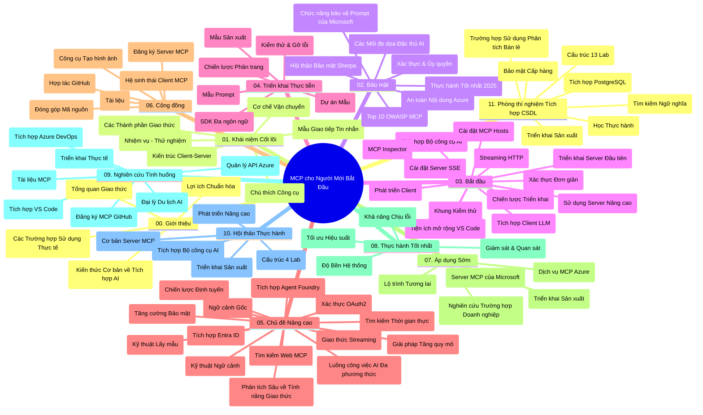

# Giao Thức Ngữ Cảnh Mô Hình (MCP) cho Người Mới Bắt Đầu - Hướng Dẫn Học Tập

Hướng dẫn học tập này cung cấp tổng quan về cấu trúc và nội dung kho lưu trữ cho chương trình "Giao Thức Ngữ Cảnh Mô Hình (MCP) cho Người Mới Bắt Đầu". Sử dụng hướng dẫn này để điều hướng kho lưu trữ một cách hiệu quả và tận dụng tối đa các tài nguyên sẵn có.

## Tổng Quan Kho Lưu Trữ

Giao Thức Ngữ Cảnh Mô Hình (MCP) là một khuôn khổ chuẩn hóa cho các tương tác giữa các mô hình AI và ứng dụng khách. Ban đầu được tạo ra bởi Anthropic, MCP hiện được duy trì bởi cộng đồng MCP rộng lớn hơn thông qua tổ chức chính thức trên GitHub. Kho lưu trữ này cung cấp một chương trình học toàn diện với các ví dụ mã thực hành trong C#, Java, JavaScript, Python, và TypeScript, được thiết kế cho các nhà phát triển AI, kiến trúc sư hệ thống, và kỹ sư phần mềm.

## Bản Đồ Chương Trình Học Trực Quan

## Cấu Trúc Kho Lưu Trữ

Kho lưu trữ được tổ chức thành mười một phần chính, mỗi phần tập trung vào các khía cạnh khác nhau của MCP:

1. **Giới Thiệu (00-Introduction/)**
   - Tổng quan về Giao Thức Ngữ Cảnh Mô Hình
   - Tại sao sự chuẩn hóa lại quan trọng trong hệ thống AI
   - Các trường hợp sử dụng thực tế và lợi ích

2. **Khái Niệm Cốt Lõi (01-CoreConcepts/)**
   - Kiến trúc client-server
   - Các thành phần chính của giao thức
   - Các mẫu tin nhắn trong MCP

3. **Bảo Mật (02-Security/)**
   - Các mối đe dọa bảo mật trong hệ thống dựa trên MCP
   - Các thực hành tốt nhất để bảo mật các triển khai
   - Chiến lược xác thực và phân quyền
   - **Tài liệu Bảo Mật Toàn Diện**:
     - Thực hành tốt nhất về Bảo mật MCP 2025
     - Hướng dẫn Triển khai Azure Content Safety
     - Kiểm soát và Kỹ thuật Bảo mật MCP
     - Tham khảo nhanh Thực hành Tốt nhất MCP
   - **Các chủ đề Bảo mật Chính**:
     - Tấn công chèn prompt và đầu độc công cụ
     - Chiếm đoạt phiên và vấn đề confused deputy
     - Lỗ hổng chuyển tiếp token
     - Quyền hạn vượt mức và kiểm soát truy cập
     - Bảo mật chuỗi cung ứng cho các thành phần AI
     - Tích hợp Microsoft Prompt Shields

4. **Bắt Đầu (03-GettingStarted/)**
   - Cài đặt và cấu hình môi trường
   - Tạo máy chủ và khách MCP cơ bản
   - Tích hợp với ứng dụng hiện có
   - Bao gồm các phần:
     - Triển khai máy chủ đầu tiên
     - Phát triển khách
     - Tích hợp khách LLM
     - Tích hợp VS Code
     - Máy chủ Server-Sent Events (SSE)
     - Sử dụng máy chủ nâng cao
     - Streaming HTTP
     - Tích hợp AI Toolkit
     - Chiến lược kiểm thử
     - Hướng dẫn triển khai

5. **Triển Khai Thực Tế (04-PracticalImplementation/)**
   - Sử dụng SDK trong các ngôn ngữ lập trình khác nhau
   - Kỹ thuật gỡ lỗi, kiểm thử và xác thực
   - Tạo mẫu prompt và workflow có thể tái sử dụng
   - Các dự án mẫu với ví dụ triển khai

6. **Chủ Đề Nâng Cao (05-AdvancedTopics/)**
   - Kỹ thuật kỹ thuật ngữ cảnh
   - Tích hợp đại lý Foundry
   - Quy trình làm việc AI đa phương thức 
   - Demo xác thực OAuth2
   - Khả năng tìm kiếm thời gian thực
   - Streaming thời gian thực
   - Triển khai các ngữ cảnh gốc
   - Chiến lược định tuyến
   - Kỹ thuật lấy mẫu
   - Phương pháp mở rộng
   - Cân nhắc bảo mật
   - Tích hợp bảo mật Entra ID
   - Tích hợp tìm kiếm web

7. **Đóng Góp Cộng Đồng (06-CommunityContributions/)**
   - Cách đóng góp mã và tài liệu
   - Hợp tác qua GitHub
   - Cải tiến và phản hồi do cộng đồng điều khiển
   - Sử dụng các khách MCP khác nhau (Claude Desktop, Cline, VSCode)
   - Làm việc với các máy chủ MCP phổ biến bao gồm tạo hình ảnh

8. **Bài Học từ Việc Áp Dụng Sớm (07-LessonsfromEarlyAdoption/)**
   - Các triển khai thực tế và câu chuyện thành công
   - Xây dựng và triển khai các giải pháp dựa trên MCP
   - Xu hướng và lộ trình tương lai
   - **Hướng dẫn Máy chủ MCP Microsoft**: Hướng dẫn toàn diện 10 máy chủ MCP Microsoft sẵn sàng cho sản xuất gồm:
     - Máy chủ MCP Microsoft Learn Docs
     - Máy chủ MCP Azure (hơn 15 kết nối chuyên biệt)
     - Máy chủ MCP GitHub
     - Máy chủ MCP Azure DevOps
     - Máy chủ MCP MarkItDown
     - Máy chủ MCP SQL Server
     - Máy chủ MCP Playwright
     - Máy chủ MCP Dev Box
     - Máy chủ MCP Azure AI Foundry
     - Máy chủ MCP Microsoft 365 Agents Toolkit

9. **Thực Hành Tốt Nhất (08-BestPractices/)**
   - Tinh chỉnh và tối ưu hiệu suất
   - Thiết kế hệ thống MCP chịu lỗi
   - Chiến lược kiểm thử và độ bền

10. **Nghiên Cứu Tình Huống (09-CaseStudy/)**
    - **Bảy nghiên cứu tình huống toàn diện** thể hiện tính linh hoạt của MCP qua các kịch bản đa dạng:
    - **Đại lý Du lịch AI Azure**: Điều phối đa đại lý với Azure OpenAI và AI Search
    - **Tích hợp Azure DevOps**: Tự động hóa quy trình với cập nhật dữ liệu YouTube
    - **Truy xuất Tài liệu Thời gian Thực**: Khách console Python với streaming HTTP
    - **Trình tạo Kế hoạch Học Tập Tương tác**: Ứng dụng web Chainlit với AI đàm thoại
    - **Tài liệu trong Trình soạn thảo**: Tích hợp VS Code với workflow GitHub Copilot
    - **Quản lý API Azure**: Tích hợp API doanh nghiệp với tạo máy chủ MCP
    - **Đăng ký MCP GitHub**: Phát triển hệ sinh thái và nền tảng tích hợp đại lý
    - Ví dụ triển khai trải rộng từ tích hợp doanh nghiệp, năng suất nhà phát triển đến phát triển hệ sinh thái

11. **Hội Thảo Thực Hành (10-StreamliningAIWorkflowsBuildingAnMCPServerWithAIToolkit/)**
    - Hội thảo thực hành toàn diện kết hợp MCP với AI Toolkit
    - Xây dựng ứng dụng thông minh kết nối mô hình AI với công cụ thực tế
    - Các mô-đun thực tế bao gồm nền tảng, phát triển máy chủ tùy chỉnh và chiến lược triển khai sản xuất
    - **Cấu trúc phòng lab**:
      - Phòng lab 1: Nền tảng Máy chủ MCP
      - Phòng lab 2: Phát triển Máy chủ MCP Nâng cao
      - Phòng lab 3: Tích hợp AI Toolkit
      - Phòng lab 4: Triển khai Sản xuất và Mở rộng
    - Phương pháp học tập dựa trên phòng lab với hướng dẫn từng bước

12. **Phòng Lab Tích Hợp Cơ Sở Dữ Liệu Máy chủ MCP (11-MCPServerHandsOnLabs/)**
    - **Lộ trình học 13 phòng lab toàn diện** xây dựng máy chủ MCP sẵn sàng sản xuất với tích hợp PostgreSQL
    - **Triển khai phân tích bán lẻ thực tế** sử dụng trường hợp sử dụng Zava Retail
    - **Mẫu mẫu cấp doanh nghiệp** gồm Bảo mật Cấp Dòng (RLS), tìm kiếm ngữ nghĩa, và truy cập dữ liệu đa khách thuê
    - **Cấu trúc Phòng lab Hoàn chỉnh**:
      - **Phòng lab 00-03: Nền tảng** - Giới thiệu, Kiến trúc, Bảo mật, Cài đặt Môi trường
      - **Phòng lab 04-06: Xây dựng Máy chủ MCP** - Thiết kế Cơ sở Dữ liệu, Triển khai Máy chủ MCP, Phát triển Công cụ
      - **Phòng lab 07-09: Tính năng Nâng cao** - Tìm kiếm Ngữ nghĩa, Kiểm thử & Gỡ lỗi, Tích hợp VS Code
      - **Phòng lab 10-12: Sản xuất & Thực hành Tốt nhất** - Triển khai, Giám sát, Tối ưu hóa
    - **Công nghệ Bao phủ**: Khung FastMCP, PostgreSQL, Azure OpenAI, Azure Container Apps, Application Insights
    - **Kết quả học tập**: Máy chủ MCP sẵn sàng sản xuất, mẫu tích hợp cơ sở dữ liệu, phân tích AI, bảo mật doanh nghiệp

## Tài Nguyên Bổ Sung

Kho lưu trữ bao gồm các tài nguyên hỗ trợ:

- **Thư mục Hình ảnh**: Chứa sơ đồ và minh họa sử dụng trong toàn bộ chương trình học
- **Bản dịch**: Hỗ trợ đa ngôn ngữ với bản dịch tự động tài liệu
- **Tài nguyên MCP Chính thức**:
  - [Tài liệu MCP](https://modelcontextprotocol.io/)
  - [Đặc tả MCP](https://spec.modelcontextprotocol.io/)
  - [Kho lưu trữ MCP trên GitHub](https://github.com/modelcontextprotocol)

## Cách Sử Dụng Kho Lưu Trữ Này

1. **Học theo thứ tự**: Theo các chương từ 00 đến 11 để có trải nghiệm học tập có cấu trúc.
2. **Tập trung theo ngôn ngữ**: Nếu bạn quan tâm đến một ngôn ngữ lập trình cụ thể, khám phá thư mục mẫu để tìm các triển khai theo ngôn ngữ bạn chọn.
3. **Triển khai Thực tế**: Bắt đầu với phần "Bắt Đầu" để thiết lập môi trường và tạo máy chủ và khách MCP đầu tiên.
4. **Khám phá Nâng cao**: Khi đã quen với cơ bản, khám phá các chủ đề nâng cao để mở rộng kiến thức.
5. **Tham gia Cộng đồng**: Tham gia cộng đồng MCP qua các diễn đàn GitHub và kênh Discord để kết nối với các chuyên gia và nhà phát triển khác.

## Khách MCP và Công Cụ

Chương trình học bao gồm nhiều khách MCP và công cụ khác nhau:

1. **Khách Chính Thức**:
   - Visual Studio Code 
   - MCP trong Visual Studio Code
   - Claude Desktop
   - Claude trong VSCode 
   - Claude API

2. **Khách Cộng Đồng**:
   - Cline (dựa trên terminal)
   - Cursor (trình soạn thảo mã)
   - ChatMCP
   - Windsurf

3. **Công Cụ Quản Lý MCP**:
   - MCP CLI
   - MCP Manager
   - MCP Linker
   - MCP Router

## Các Máy Chủ MCP Phổ Biến

Kho lưu trữ giới thiệu nhiều máy chủ MCP, bao gồm:

1. **Máy Chủ MCP Microsoft Chính Thức**:
   - Máy chủ MCP Microsoft Learn Docs
   - Máy chủ MCP Azure (hơn 15 kết nối chuyên biệt)
   - Máy chủ MCP GitHub
   - Máy chủ MCP Azure DevOps
   - Máy chủ MCP MarkItDown
   - Máy chủ MCP SQL Server
   - Máy chủ MCP Playwright
   - Máy chủ MCP Dev Box
   - Máy chủ MCP Azure AI Foundry
   - Máy chủ MCP Microsoft 365 Agents Toolkit

2. **Máy Chủ Tham Chiếu Chính Thức**:
   - Filesystem
   - Fetch
   - Memory
   - Sequential Thinking

3. **Tạo Hình Ảnh**:
   - Azure OpenAI DALL-E 3
   - Stable Diffusion WebUI
   - Replicate

4. **Công Cụ Phát Triển**:
   - Git MCP
   - Terminal Control
   - Code Assistant

5. **Máy Chủ Chuyên Biệt**:
   - Salesforce
   - Microsoft Teams
   - Jira & Confluence

## Đóng Góp

Kho lưu trữ này hoan nghênh sự đóng góp từ cộng đồng. Xem phần Đóng Góp Cộng Đồng để biết hướng dẫn cách đóng góp hiệu quả cho hệ sinh thái MCP.

----

*Hướng dẫn học tập này được cập nhật lần cuối vào ngày 5 tháng 2 năm 2026, phản ánh Đặc tả MCP mới nhất 2025-11-25 và cung cấp tổng quan kho lưu trữ tính đến ngày này. Nội dung kho lưu trữ có thể được cập nhật sau ngày này.*

---

<!-- CO-OP TRANSLATOR DISCLAIMER START -->
**Tuyên bố từ chối trách nhiệm**:
Tài liệu này đã được dịch bằng dịch vụ dịch thuật AI [Co-op Translator](https://github.com/Azure/co-op-translator). Mặc dù chúng tôi cố gắng đảm bảo độ chính xác, xin lưu ý rằng các bản dịch tự động có thể chứa lỗi hoặc sai sót. Tài liệu gốc bằng ngôn ngữ nguyên bản nên được coi là nguồn tài liệu chính thống. Đối với những thông tin quan trọng, chúng tôi khuyến nghị sử dụng dịch vụ dịch thuật chuyên nghiệp do con người thực hiện. Chúng tôi không chịu trách nhiệm về bất kỳ sự hiểu nhầm hoặc giải thích sai nào phát sinh từ việc sử dụng bản dịch này.
<!-- CO-OP TRANSLATOR DISCLAIMER END -->