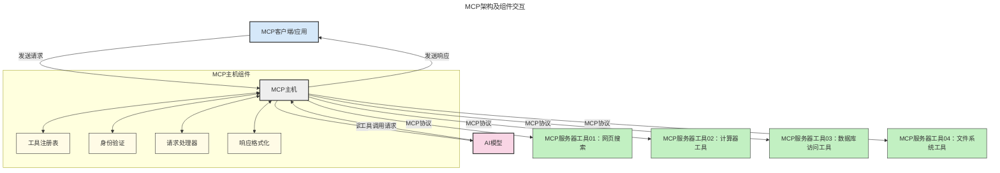

# 模型上下文协议（MCP）简介：为什么它对可扩展的 AI 应用至关重要

[](https://youtu.be/agBbdiOPLQA)

_(点击上方图片观看本课视频)_

生成式 AI 应用是一个重要的进步，因为它们通常允许用户使用自然语言提示与应用交互。然而，随着投入更多时间和资源，您需要确保可以轻松集成功能和资源，使其易于扩展，您的应用能够支持多个模型的使用，并处理各种模型的复杂性。简而言之，构建生成式 AI 应用初期很容易，但随着应用的增长和变得更复杂，您需要开始定义架构，并很可能需要依赖一个标准以确保应用以一致的方式构建。这就是 MCP 通过组织和提供标准发挥作用的地方。

---

## **🔍 什么是模型上下文协议（MCP）？**

**模型上下文协议（MCP）**是一种**开放的、标准化的接口**，允许大型语言模型（LLM）与外部工具、API 和数据源无缝交互。它提供了一个一致的架构，以增强 AI 模型超越其训练数据的功能，实现更智能、可扩展且响应更迅速的 AI 系统。

---

## **🎯 为什么 AI 需要标准化**

随着生成式 AI 应用变得更加复杂，采用标准以确保**可扩展性、可扩展性、可维护性**和**避免供应商锁定**变得至关重要。MCP 通过以下方式满足这些需求：

- 统一模型与工具的集成
- 减少脆弱且一次性的定制解决方案
- 允许来自不同供应商的多个模型共存于同一生态系统

**注意：** 虽然 MCP 自称为开放标准，但目前没有计划通过任何现有标准组织如 IEEE、IETF、W3C、ISO 或其他标准机构对 MCP 进行标准化。

---

## **📚 学习目标**

阅读完本文，您将能够：

- 定义**模型上下文协议（MCP）**及其应用场景
- 理解 MCP 如何实现模型与工具的标准化通信
- 识别 MCP 架构的核心组件
- 探索 MCP 在企业和开发环境中的实际应用

---

## **💡 为什么模型上下文协议（MCP）是一个变革者**

### **🔗 MCP 解决了 AI 交互的分散问题**

在 MCP 出现之前，模型与工具的集成需要：

- 针对每对工具-模型编写定制代码
- 各供应商使用非标准 API
- 频繁因更新而中断
- 难以应对工具数量增加导致的扩展问题

### **✅ MCP 标准化的优势**

| **优势**             | **描述**                                                    |
|----------------------|-------------------------------------------------------------|
| 互操作性             | LLM 能无缝地与不同供应商的工具协同工作                     |
| 一致性               | 平台和工具之间表现统一                                       |
| 可复用性             | 构建一次的工具可跨项目和系统使用                             |
| 加速开发             | 通过使用标准化的即插即用接口减少开发时间                     |

---

## **🧱 MCP 高级架构概览**

MCP 采用**客户端-服务器模型**，其中：

- **MCP Host** 负责运行 AI 模型
- **MCP Client** 发起请求
- **MCP Server** 提供上下文、工具和功能

### **关键组件：**

- **资源** – 模型使用的静态或动态数据  
- **提示** – 预定义的工作流程以指导生成  
- **工具** – 可执行功能，如搜索、计算  
- **采样** – 通过递归交互实现的代理行为  
- **引导** – 服务器主动发起的用户输入请求  
- **根目录** – 服务器访问控制的文件系统边界  

### **协议架构：**

MCP 使用两层架构：
- **数据层**：基于 JSON-RPC 2.0 的通信，包含生命周期管理和基本操作
- **传输层**：本地使用 STDIO，远程使用支持 SSE 的可流式 HTTP 通道

---

## MCP 服务器的工作方式

MCP 服务器按如下方式运作：

- **请求流程**：
    1. 由终端用户或代表他们操作的软件发起请求。
    2. **MCP 客户端** 将请求发送给管理 AI 模型运行时的 **MCP Host**。
    3. **AI 模型** 接收到用户提示，可能通过一个或多个工具调用请求访问外部工具或数据。
    4. 不是模型直接，而是 **MCP Host** 使用标准协议与相应的 **MCP 服务器** 通信。
- **MCP Host 功能**：
    - **工具注册表**：维护可用工具及其功能目录。
    - **身份认证**：验证工具访问权限。
    - **请求处理器**：处理模型发出的工具请求。
    - **响应格式化**：以模型能理解的格式构建工具输出。
- **MCP 服务器执行**：
    - **MCP Host** 将工具调用路由至一个或多个暴露特殊功能的 **MCP 服务器**（例如搜索、计算、数据库查询）。
    - **MCP 服务器** 执行各自操作并以一致格式返回结果给 **MCP Host**。
    - **MCP Host** 将结果格式化并转发给 **AI 模型**。
- **响应完成**：
    - **AI 模型** 将工具输出整合到最终响应中。
    - **MCP Host** 将响应发送回 **MCP 客户端**，由其交付给终端用户或调用软件。
    


## 👨‍💻 如何构建 MCP 服务器（含示例）

MCP 服务器允许您通过提供数据和功能来扩展 LLM 的能力。

准备好尝试了吗？以下是支持不同语言/技术栈的 SDK 及简单 MCP 服务器示例：

- **Python SDK**: https://github.com/modelcontextprotocol/python-sdk

- **TypeScript SDK**: https://github.com/modelcontextprotocol/typescript-sdk

- **Java SDK**: https://github.com/modelcontextprotocol/java-sdk

- **C#/.NET SDK**: https://github.com/modelcontextprotocol/csharp-sdk


## 🌍 MCP 在现实世界的应用案例

MCP 通过扩展 AI 能力，支持广泛的应用场景：

| **应用**                | **描述**                                                  |
|-------------------------|-----------------------------------------------------------|
| 企业数据集成            | 连接 LLM 到数据库、CRM 或内部工具                         |
| 代理式 AI 系统          | 支持带工具访问和决策流程的自主代理                       |
| 多模态应用              | 在单一统一的 AI 应用中结合文本、图像和音频工具           |
| 实时数据集成            | 将实时数据引入 AI 交互，实现更准确、最新的输出           |


### 🧠 MCP = AI 交互的通用标准

模型上下文协议（MCP）就像 USB-C 标准统一了设备物理接口一样，成为 AI 交互的通用标准。在 AI 领域，MCP 提供一致的接口，让模型（客户端）能无缝集成外部工具和数据提供者（服务器）。这避免了为每个 API 或数据源设计各种各样的定制协议。

依据 MCP，兼容的 MCP 工具（称为 MCP 服务器）遵循统一标准。这些服务器可以列出其提供的工具或操作，并在 AI 代理请求时执行这些操作。支持 MCP 的 AI 代理平台能够发现服务器上可用的工具，并通过此标准协议调用它们。

### 💡 促进知识访问

除了提供工具，MCP 还促进访问知识。它通过将应用连接到各种数据源，为大型语言模型（LLM）提供上下文。例如，MCP 服务器可能代表一家公司的文档库，允许代理按需检索相关信息。另一台服务器可能处理特定操作，如发送邮件或更新记录。对代理来说，这些都是它可以使用的工具——有些工具返回数据（知识上下文），有些执行操作。MCP 高效管理这两者。

代理连接到 MCP 服务器时，通过标准格式自动了解服务器的可用功能和访问数据。这种标准化支持动态工具的可用性。例如，向代理系统添加新的 MCP 服务器后，其功能即可立即使用，无需进一步定制代理指令。

这种流畅的集成符合下图所示的流程，服务器同时提供工具和知识，确保系统间无缝协作。

### 👉 示例：可扩展代理解决方案

```mermaid
---
title: 具有 MCP 的可扩展代理解决方案
description: 一个图示展示用户如何与连接多个 MCP 服务器的 LLM 交互，每个服务器都提供知识和工具，构建可扩展的 AI 系统架构
---
graph TD
    User -->|提示| LLM
    LLM -->|响应| User
    LLM -->|MCP| ServerA
    LLM -->|MCP| ServerB
    ServerA -->|通用连接器| ServerB
    ServerA --> KnowledgeA
    ServerA --> ToolsA
    ServerB --> KnowledgeB
    ServerB --> ToolsB

    subgraph Server A
        KnowledgeA[知识]
        ToolsA[工具]
    end

    subgraph Server B
        KnowledgeB[知识]
        ToolsB[工具]
    end
```通用连接器使 MCP 服务器之间能够通信并共享功能，允许 ServerA 将任务委派给 ServerB 或访问其工具和知识。这实现了服务器间工具和数据的联合，支持可扩展且模块化的代理架构。因为 MCP 标准化了工具的暴露，代理可以动态发现并在服务器间路由请求，无需硬编码集成。

工具与知识联合：跨服务器访问工具和数据，实现更可扩展和模块化的代理式架构。

### 🔄 具客户端 LLM 集成的高级 MCP 场景

除了基本的 MCP 架构外，还有高级场景，在这些场景中客户端和服务器都包含 LLM，从而实现更复杂的交互。下图中，**客户端应用** 可能是 IDE，拥有多种 MCP 工具供 LLM 用户使用：

```mermaid
---
title: 高级MCP场景与客户端-服务器LLM集成
description: 一个时序图，展示用户、客户端应用、客户端LLM、多台MCP服务器和服务器LLM之间的详细交互流程，说明工具发现、用户交互、直接调用工具和功能协商阶段
---
sequenceDiagram
    autonumber
    actor User as 👤 用户
    participant ClientApp as 🖥️ 客户端应用
    participant ClientLLM as 🧠 客户端LLM
    participant Server1 as 🔧 MCP服务器1
    participant Server2 as 📚 MCP服务器2
    participant ServerLLM as 🤖 服务器LLM
    
    %% 发现阶段
    rect rgb(220, 240, 255)
        Note over ClientApp, Server2: 工具发现阶段
        ClientApp->>+Server1: 请求可用工具/资源
        Server1-->>-ClientApp: 返回工具列表（JSON）
        ClientApp->>+Server2: 请求可用工具/资源
        Server2-->>-ClientApp: 返回工具列表（JSON）
        Note right of ClientApp: 本地存储合并<br/>工具目录
    end
    
    %% 用户交互
    rect rgb(255, 240, 220)
        Note over User, ClientLLM: 用户交互阶段
        User->>+ClientApp: 输入自然语言提示
        ClientApp->>+ClientLLM: 转发提示 + 工具目录
        ClientLLM->>-ClientLLM: 分析提示并选择工具
    end
    
    %% 场景A：直接调用工具
    alt 直接调用工具
        rect rgb(220, 255, 220)
            Note over ClientApp, Server1: 场景A：直接调用工具
            ClientLLM->>+ClientApp: 请求执行工具
            ClientApp->>+Server1: 执行指定工具
            Server1-->>-ClientApp: 返回结果
            ClientApp->>+ClientLLM: 处理结果
            ClientLLM-->>-ClientApp: 生成响应
            ClientApp-->>-User: 展示最终答案
        end
    
    %% 场景B：功能协商（VS Code风格）
    else 功能协商（VS Code风格）
        rect rgb(255, 220, 220)
            Note over ClientApp, ServerLLM: 场景B：功能协商
            ClientLLM->>+ClientApp: 确定所需功能
            ClientApp->>+Server2: 协商功能/能力
            Server2->>+ServerLLM: 请求额外上下文
            ServerLLM-->>-Server2: 提供上下文
            Server2-->>-ClientApp: 返回可用功能
            ClientApp->>+Server2: 调用协商工具
            Server2-->>-ClientApp: 返回结果
            ClientApp->>+ClientLLM: 处理结果
            ClientLLM-->>-ClientApp: 生成响应
            ClientApp-->>-User: 展示最终答案
        end
    end
```
## 🔐 MCP 的实际益处

使用 MCP 的实际好处包括：

- **时效性**：模型能访问其训练数据之外的最新信息
- **能力扩展**：模型可利用专用工具处理未训练的任务
- **减少幻觉**：外部数据源提供事实支撑
- **隐私保护**：敏感数据可留在安全环境中，无需嵌入提示内

## 📌 关键要点

使用 MCP 的关键要点：

- **MCP** 标准化了 AI 模型与工具和数据的互动方式
- 推动 **可扩展性、一致性和互操作性**
- MCP 有助于**减少开发时间、提高可靠性、扩展模型能力**
- 客户端-服务器架构**支持灵活、可扩展的 AI 应用**

## 🧠 练习

思考您感兴趣的 AI 应用：

- 哪些**外部工具或数据**可以增强其功能？
- MCP 如何使集成**更简单、更可靠**？

## 额外资源

- [MCP GitHub 仓库](https://github.com/modelcontextprotocol)


## 下一步

下一章: [第 1 章：核心概念](../01-CoreConcepts/README.md)

---

<!-- CO-OP TRANSLATOR DISCLAIMER START -->
**免责声明**：
本文件使用人工智能翻译服务 [Co-op Translator](https://github.com/Azure/co-op-translator) 进行翻译。虽然我们力求准确，但请注意，自动翻译可能存在错误或不准确之处。原始语言的文档应被视为权威来源。对于重要信息，建议使用专业人工翻译。我们不对因使用本翻译而产生的任何误解或误释承担责任。
<!-- CO-OP TRANSLATOR DISCLAIMER END -->