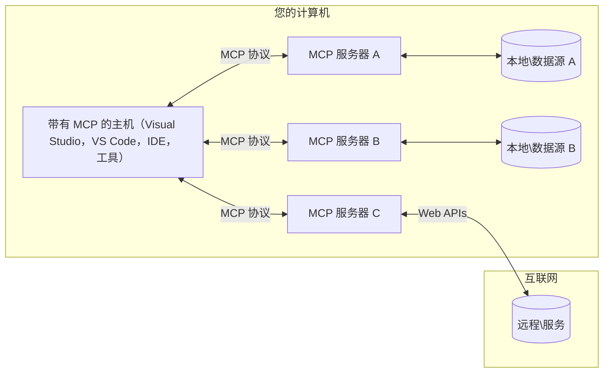

# MCP 核心概念：掌握 AI 集成的模型上下文协议

[](https://youtu.be/earDzWGtE84)

_(点击上方图片观看本课视频)_

[模型上下文协议（MCP）](https://github.com/modelcontextprotocol) 是一个强大且标准化的框架，优化了大型语言模型（LLM）与外部工具、应用程序和数据源之间的通信。
本指南将带您逐步了解 MCP 的核心概念。您将学习其客户端-服务器架构、关键组件、通信机制及实现最佳实践。

- **明确的用户同意**：所有数据访问和操作都需要在执行前获得用户明确批准。用户必须清楚了解将访问哪些数据和将执行哪些操作，且具备细粒度的权限和授权控制。

- **数据隐私保护**：用户数据仅在明确同意情况下暴露，且必须在整个交互生命周期内通过强健的访问控制予以保护。实现须防止未经授权的数据传输并保持严格的隐私边界。

- **工具执行安全**：每次工具调用都需要用户明确同意，且用户需清楚了解工具的功能、参数和潜在影响。坚固的安全边界必须防止意外、不安全或恶意的工具执行。

- **传输层安全**：所有通信通道应使用适当的加密和认证机制。远程连接应实施安全传输协议和合理的凭证管理。

#### 实现指南：

- **权限管理**：实现细粒度权限系统，允许用户控制可访问的服务器、工具和资源
- **身份验证与授权**：使用安全认证方式（OAuth、API 密钥）并进行合理的令牌管理和过期控制
- **输入验证**：根据定义的架构验证所有参数和数据输入，防止注入攻击
- **审计日志**：维护全面的操作日志以支持安全监控和合规

## 概览

本课探讨构成模型上下文协议（MCP）生态系统的基础架构和组件。您将了解客户端-服务器架构、关键组件及驱动 MCP 交互的通信机制。

## 主要学习目标

通过本课，您将能够：

- 理解 MCP 的客户端-服务器架构。
- 识别主机、客户端和服务器的角色与职责。
- 分析使 MCP 成为灵活集成层的核心特性。
- 学习信息如何在 MCP 生态系统中流动。
- 通过 .NET、Java、Python 和 JavaScript 的代码示例获得实际见解。

## MCP 架构：深入解析

MCP 生态系统基于客户端-服务器模型构建。此模块化结构使 AI 应用能够高效地与工具、数据库、API 及上下文资源交互。下面分解该架构的核心组件。

MCP 核心遵循一套客户端-服务器架构，主机应用可以连接多个服务器：


- **MCP 主机**：如 VSCode、Claude Desktop、IDE 或希望通过 MCP 访问数据的 AI 工具
- **MCP 客户端**：维护与服务器的一对一连接的协议客户端
- **MCP 服务器**：轻量级程序，通过标准化的模型上下文协议暴露特定能力
- **本地数据源**：计算机的文件、数据库和 MCP 服务器可安全访问的服务
- **远程服务**：可通过 API 连接的互联网外部系统

MCP 协议是一个持续演进的标准，采用基于日期的版本号（YYYY-MM-DD 格式）。当前协议版本为 **2025-11-25**。您可查看 [协议规范](https://modelcontextprotocol.io/specification/2025-11-25/) 的最新更新。

### 1. 主机

在模型上下文协议（MCP）中，**主机** 是作为用户与协议交互的主要接口的 AI 应用。主机协调并管理与多个 MCP 服务器的连接，为每个服务器连接创建专门的 MCP 客户端。主机示例包括：

- **AI 应用**：Claude Desktop、Visual Studio Code、Claude Code
- **开发环境**：集成 MCP 的 IDE 和代码编辑器
- **自定义应用**：专用构建的 AI 代理和工具

**主机** 是协调 AI 模型交互的应用。它们：

- **编排 AI 模型**：执行或交互大型语言模型以生成响应并协调 AI 工作流
- **管理客户端连接**：为每个 MCP 服务器连接创建并维护一个 MCP 客户端
- **控制用户界面**：处理对话流程、用户交互和响应呈现
- **执行安全策略**：控制权限、安全约束和身份认证
- **处理用户同意**：管理用户对数据共享和工具执行的批准

### 2. 客户端

**客户端** 是在主机与 MCP 服务器之间维护专用一对一连接的关键组件。每个 MCP 客户端由主机实例化以连接特定 MCP 服务器，确保通信通道有序且安全。多个客户端支持主机同时连接多个服务器。

**客户端** 是主机应用中的连接器组件。其职责：

- **协议通信**：以 JSON-RPC 2.0 格式向服务器发送提示和指令请求
- **能力协商**：在初始化时与服务器协商支持的功能和协议版本
- **工具执行管理**：管理模型发起的工具执行请求并处理响应
- **实时更新处理**：处理来自服务器的通知和实时更新
- **响应处理**：处理并格式化服务器响应，供用户展示

### 3. 服务器

**服务器** 是为 MCP 客户端提供上下文、工具和功能的程序。它们可在本地（与主机同一台机器）或远程（外部平台）运行，负责处理客户端请求并提供结构化响应。服务器通过标准化的模型上下文协议暴露具体功能。

**服务器** 是提供上下文和能力的服务。它们：

- **功能注册**：向客户端注册并暴露可用的原语（资源、提示、工具）
- **请求处理**：接收并执行客户端的工具调用、资源请求和提示请求
- **上下文提供**：提供上下文信息和数据以增强模型响应
- **状态管理**：维护会话状态并视需要处理有状态交互
- **实时通知**：向连接客户端发送能力变更和更新通知

任何人都可开发服务器以扩展模型能力，支持本地和远程部署场景。

### 4. 服务器原语

模型上下文协议（MCP）中的服务器提供三种核心**原语**，定义客户机、主机与语言模型之间丰富交互的基本构建块。这些原语指定协议可提供的上下文信息和操作类型。

MCP 服务器可暴露以下三种核心原语的任意组合：

#### 资源 

**资源** 是为 AI 应用提供上下文信息的数据源。它们代表静态或动态内容，可增强模型理解和决策能力：

- **上下文数据**：供 AI 模型使用的结构化信息和上下文
- **知识库**：文档仓库、文章、手册和研究论文
- **本地数据源**：文件、数据库和本地系统信息
- **外部数据**：API 响应、网页服务和远程系统数据
- **动态内容**：基于外部条件更新的实时数据

资源由 URI 标识，支持通过 `resources/list` 发现和通过 `resources/read` 获取：

```text
file://documents/project-spec.md
database://production/users/schema
api://weather/current
```

#### 提示

**提示** 是可复用的模板，帮助构建与语言模型的交互结构。它们提供标准化的交互模式和模板化工作流：

- **基于模板的交互**：预先结构化的消息和对话启动器
- **工作流模板**：通用任务和交互的标准化序列
- **少量示例**：用于模型指导的示例模板
- **系统提示**：定义模型行为和上下文的基础提示
- **动态模板**：可根据具体语境调整的参数化提示

提示支持变量替换，且可通过 `prompts/list` 发现，通过 `prompts/get` 获取：

```markdown
Generate a {{task_type}} for {{product}} targeting {{audience}} with the following requirements: {{requirements}}
```

#### 工具

**工具** 是 AI 模型可调用以执行特定操作的可执行函数。它们是 MCP 生态的“动词”，使模型能够与外部系统交互：

- **可执行函数**：模型可使用具体参数调用的独立操作
- **外部系统集成**：API 调用、数据库查询、文件操作、计算
- **唯一身份**：每个工具有唯一名称、描述和参数架构
- **结构化输入输出**：工具接受验证参数，返回结构化、类型化响应
- **行动能力**：使模型能够执行真实世界的操作并检索实时数据

工具通过 JSON Schema 定义参数验证，支持通过 `tools/list` 发现，使用 `tools/call` 执行。工具还可包含作为额外元数据的 **图标** 用于更佳的 UI 展示。

**工具注释**：工具支持行为注释（如 `readOnlyHint`、`destructiveHint`），描述工具是否只读或具破坏性，帮助客户端作出明智的工具执行决策。

工具定义示例：

```typescript
server.tool(
  "search_products", 
  {
    query: z.string().describe("Search query for products"),
    category: z.string().optional().describe("Product category filter"),
    max_results: z.number().default(10).describe("Maximum results to return")
  }, 
  async (params) => {
    // 执行搜索并返回结构化结果
    return await productService.search(params);
  }
);
```

## 客户端原语

在模型上下文协议（MCP）中，**客户端** 可暴露原语，使服务器能够从主机应用请求附加能力。这些客户端原语支持更丰富、更交互的服务器实现，可以访问 AI 模型功能和用户交互。

### 采样

**采样** 允许服务器从客户端的 AI 应用请求语言模型完成。这一原语使服务器无需嵌入自身模型依赖即可访问 LLM 能力：

- **模型独立访问**：服务器可请求完成，无需包含 LLM SDK 或管理模型访问
- **服务器发起 AI**：使服务器可自主利用客户端的 AI 模型生成内容
- **递归 LLM 交互**：支持服务器需要 AI 辅助的复杂场景
- **动态内容生成**：允许服务器使用主机模型创建上下文响应
- **支持工具调用**：服务器可包含 `tools` 与 `toolChoice` 参数，使客户端模型在采样期间调用工具

采样通过 `sampling/complete` 方法启动，服务器向客户端发送完成请求。

### 根目录

**根目录** 为客户端向服务器暴露文件系统边界提供标准化方式，帮助服务器了解其可访问的目录和文件：

- **文件系统边界**：定义服务器可操作的文件系统界限
- **访问控制**：帮助服务器了解可访问的目录和文件权限
- **动态更新**：客户端可通知服务器根目录列表的变更
- **基于 URI 的标识**：根目录使用 `file://` URI 标识可访问的目录和文件

根目录通过 `roots/list` 方法发现，客户端在根目录变更时发送 `notifications/roots/list_changed`。

### 询问

**询问** 使服务器能够通过客户端界面向用户请求附加信息或确认：

- **用户输入请求**：服务器在工具执行时需要额外信息时发出请求
- **确认对话框**：请求用户批准敏感或影响较大的操作
- **交互式工作流**：支持服务器创建分步骤用户交互
- **动态参数收集**：执行工具时收集缺失或可选参数

询问通过 `elicitation/request` 方法发起，以通过客户端界面收集用户输入。

**URL 模式询问**：服务器还可请求基于 URL 的用户交互，指引用户访问外部网页以进行身份验证、确认或数据输入。

### 日志记录

**日志记录** 允许服务器向客户端发送结构化日志消息，用于调试、监控和操作透明化：

- **调试支持**：使服务器提供详细执行日志以协助排障
- **操作监控**：向客户端发送状态更新与性能指标
- **错误报告**：提供详细错误上下文和诊断信息
- **审计轨迹**：创建服务器操作和决策的全面日志

日志消息发送给客户端，提供服务器操作透明度，方便调试。

## MCP 中的信息流

模型上下文协议（MCP）定义了主机、客户端、服务器和模型之间结构化的信息流。理解这一流动有助于理清用户请求如何处理及外部工具与数据如何整合进模型响应。

- **主机发起连接**  
  主机应用（如 IDE 或聊天界面）建立与 MCP 服务器的连接，通常通过 STDIO、WebSocket 或其他支持的传输方式。

- **能力协商**  
  嵌入主机的客户端与服务器交换彼此支持的功能、工具、资源及协议版本信息。确保双方了解本会话可用能力。

- **用户请求**  
  用户与主机交互（如输入提示或命令）。主机收集输入并传递给客户端处理。

- **资源或工具使用**  
  - 客户端可能向服务器请求额外上下文或资源（如文件、数据库条目或知识库文章），以丰富模型理解。  
  - 若模型确定需要工具（例如获取数据、执行计算或调用 API），客户端会向服务器发送工具调用请求，指定工具名称和参数。

- **服务器执行**  
服务器接收资源或工具请求，执行必要操作（例如运行函数、查询数据库或检索文件），并以结构化格式将结果返回给客户端。

- **响应生成**  
  客户端将服务器的响应（资源数据、工具输出等）集成到正在进行的模型交互中。模型利用这些信息生成全面且具有上下文相关性的回复。

- **结果呈现**  
  主机接收客户端的最终输出并呈现给用户，通常包括模型生成的文本和任何工具执行或资源查询的结果。

此流程使 MCP 能够通过无缝连接模型与外部工具和数据源，支持先进的、交互式的、具备上下文感知的 AI 应用。

## 协议架构与层次

MCP 由两个协同工作的独特架构层组成，为完整的通信框架提供支持：

### 数据层

**数据层** 使用 **JSON-RPC 2.0** 作为核心基础实现 MCP 协议。该层定义消息结构、语义和交互模式：

#### 核心组件：

- **JSON-RPC 2.0 协议**：所有通信采用标准的 JSON-RPC 2.0 消息格式进行方法调用、响应和通知
- **生命周期管理**：处理客户端与服务器之间的连接初始化、功能协商及会话终止
- **服务器原语**：使服务器通过工具、资源和提示提供核心功能
- **客户端原语**：使服务器请求 LLM 采样、引导用户输入以及发送日志消息
- **实时通知**：支持无需轮询的异步通知实现动态更新

#### 关键特性：

- **协议版本协商**：采用基于日期的版本号（YYYY-MM-DD）保证兼容性
- **功能发现**：客户端和服务器在初始化阶段交换支持的功能信息
- **有状态会话**：跨多次交互维护连接状态以保证上下文连续性

### 传输层

**传输层** 管理 MCP 参与者之间的通信通道、消息帧结构和身份认证：

#### 支持的传输机制：

1. **STDIO 传输**：
   - 使用标准输入/输出流实现直接进程通信
   - 适用于同一台机器上的本地进程，无网络开销
   - 常用于本地 MCP 服务器实现

2. **可流式 HTTP 传输**：
   - 客户端到服务器消息使用 HTTP POST  
   - 可选服务器发送事件（SSE）实现服务器到客户端流式传输
   - 支持跨网络远程服务器通信
   - 支持标准 HTTP 认证（Bearer 令牌、API 密钥、自定义头）
   - MCP 推荐使用 OAuth 实现基于令牌的安全认证

#### 传输抽象：

传输层将通信细节从数据层抽象出来，实现所有传输机制下统一的 JSON-RPC 2.0 消息格式。此抽象方便应用在本地与远程服务器间轻松切换。

### 安全考虑

MCP 实现须遵守若干关键安全原则，确保所有协议操作的交互安全、值得信赖：

- **用户同意与控制**：用户必须明确同意后才能访问任何数据或执行操作。用户应清楚控制共享的数据及授权的行为，界面应直观便捷支持审阅和批准活动。

- **数据隐私**：仅在用户明确同意情况下透露用户数据，且须通过适当访问控制保护数据。MCP 实现必须防止未授权数据传输，确保隐私在所有交互中得到保障。

- **工具安全**：调用任何工具前须获得显式用户同意。用户应充分理解工具功能，且必须实施严格安全边界以防止意外或不安全执行。

遵循这些安全原则，MCP 在实现强大 AI 集成的同时，保障用户信任、隐私和安全。

## 代码示例：关键组件

以下为几种流行编程语言的代码示例，展示如何实现 MCP 服务器关键组件及工具。

### .NET 示例：创建带工具的简单 MCP 服务器

以下是一个实际的 .NET 代码示例，演示如何实现带自定义工具的简单 MCP 服务器。示例展示工具定义与注册、请求处理以及如何使用模型上下文协议连接服务器。

```csharp
using System;
using System.Threading.Tasks;
using ModelContextProtocol.Server;
using ModelContextProtocol.Server.Transport;
using ModelContextProtocol.Server.Tools;

public class WeatherServer
{
    public static async Task Main(string[] args)
    {
        // Create an MCP server
        var server = new McpServer(
            name: "Weather MCP Server",
            version: "1.0.0"
        );
        
        // Register our custom weather tool
        server.AddTool<string, WeatherData>("weatherTool", 
            description: "Gets current weather for a location",
            execute: async (location) => {
                // Call weather API (simplified)
                var weatherData = await GetWeatherDataAsync(location);
                return weatherData;
            });
        
        // Connect the server using stdio transport
        var transport = new StdioServerTransport();
        await server.ConnectAsync(transport);
        
        Console.WriteLine("Weather MCP Server started");
        
        // Keep the server running until process is terminated
        await Task.Delay(-1);
    }
    
    private static async Task<WeatherData> GetWeatherDataAsync(string location)
    {
        // This would normally call a weather API
        // Simplified for demonstration
        await Task.Delay(100); // Simulate API call
        return new WeatherData { 
            Temperature = 72.5,
            Conditions = "Sunny",
            Location = location
        };
    }
}

public class WeatherData
{
    public double Temperature { get; set; }
    public string Conditions { get; set; }
    public string Location { get; set; }
}
```


### Java 示例：MCP 服务器组件

本示例演示与上述 .NET 示例中相同的 MCP 服务器和工具注册，但用 Java 实现。

```java
import io.modelcontextprotocol.server.McpServer;
import io.modelcontextprotocol.server.McpToolDefinition;
import io.modelcontextprotocol.server.transport.StdioServerTransport;
import io.modelcontextprotocol.server.tool.ToolExecutionContext;
import io.modelcontextprotocol.server.tool.ToolResponse;

public class WeatherMcpServer {
    public static void main(String[] args) throws Exception {
        // 创建一个MCP服务器
        McpServer server = McpServer.builder()
            .name("Weather MCP Server")
            .version("1.0.0")
            .build();
            
        // 注册一个天气工具
        server.registerTool(McpToolDefinition.builder("weatherTool")
            .description("Gets current weather for a location")
            .parameter("location", String.class)
            .execute((ToolExecutionContext ctx) -> {
                String location = ctx.getParameter("location", String.class);
                
                // 获取天气数据（简化版）
                WeatherData data = getWeatherData(location);
                
                // 返回格式化的响应
                return ToolResponse.content(
                    String.format("Temperature: %.1f°F, Conditions: %s, Location: %s", 
                    data.getTemperature(), 
                    data.getConditions(), 
                    data.getLocation())
                );
            })
            .build());
        
        // 使用stdio传输连接服务器
        try (StdioServerTransport transport = new StdioServerTransport()) {
            server.connect(transport);
            System.out.println("Weather MCP Server started");
            // 保持服务器运行直到进程终止
            Thread.currentThread().join();
        }
    }
    
    private static WeatherData getWeatherData(String location) {
        // 实现将调用天气API
        // 为示例目的简化
        return new WeatherData(72.5, "Sunny", location);
    }
}

class WeatherData {
    private double temperature;
    private String conditions;
    private String location;
    
    public WeatherData(double temperature, String conditions, String location) {
        this.temperature = temperature;
        this.conditions = conditions;
        this.location = location;
    }
    
    public double getTemperature() {
        return temperature;
    }
    
    public String getConditions() {
        return conditions;
    }
    
    public String getLocation() {
        return location;
    }
}
```


### Python 示例：构建 MCP 服务器

该示例使用 fastmcp，使用前请确保已安装：

```python
pip install fastmcp
```
 代码示例：

```python
#!/usr/bin/env python3
import asyncio
from fastmcp import FastMCP
from fastmcp.transports.stdio import serve_stdio

# 创建一个 FastMCP 服务器
mcp = FastMCP(
    name="Weather MCP Server",
    version="1.0.0"
)

@mcp.tool()
def get_weather(location: str) -> dict:
    """Gets current weather for a location."""
    return {
        "temperature": 72.5,
        "conditions": "Sunny",
        "location": location
    }

# 使用类的替代方法
class WeatherTools:
    @mcp.tool()
    def forecast(self, location: str, days: int = 1) -> dict:
        """Gets weather forecast for a location for the specified number of days."""
        return {
            "location": location,
            "forecast": [
                {"day": i+1, "temperature": 70 + i, "conditions": "Partly Cloudy"}
                for i in range(days)
            ]
        }

# 注册类工具
weather_tools = WeatherTools()

# 启动服务器
if __name__ == "__main__":
    asyncio.run(serve_stdio(mcp))
```


### JavaScript 示例：创建 MCP 服务器

示例展示如何用 JavaScript 创建 MCP 服务器，并注册两个天气相关工具。

```javascript
// 使用官方的模型上下文协议SDK
import { McpServer } from "@modelcontextprotocol/sdk/server/mcp.js";
import { StdioServerTransport } from "@modelcontextprotocol/sdk/server/stdio.js";
import { z } from "zod"; // 用于参数验证

// 创建一个MCP服务器
const server = new McpServer({
  name: "Weather MCP Server",
  version: "1.0.0"
});

// 定义一个天气工具
server.tool(
  "weatherTool",
  {
    location: z.string().describe("The location to get weather for")
  },
  async ({ location }) => {
    // 这通常会调用天气API
    // 简化演示用途
    const weatherData = await getWeatherData(location);
    
    return {
      content: [
        { 
          type: "text", 
          text: `Temperature: ${weatherData.temperature}°F, Conditions: ${weatherData.conditions}, Location: ${weatherData.location}` 
        }
      ]
    };
  }
);

// 定义一个预测工具
server.tool(
  "forecastTool",
  {
    location: z.string(),
    days: z.number().default(3).describe("Number of days for forecast")
  },
  async ({ location, days }) => {
    // 这通常会调用天气API
    // 简化演示用途
    const forecast = await getForecastData(location, days);
    
    return {
      content: [
        { 
          type: "text", 
          text: `${days}-day forecast for ${location}: ${JSON.stringify(forecast)}` 
        }
      ]
    };
  }
);

// 辅助函数
async function getWeatherData(location) {
  // 模拟API调用
  return {
    temperature: 72.5,
    conditions: "Sunny",
    location: location
  };
}

async function getForecastData(location, days) {
  // 模拟API调用
  return Array.from({ length: days }, (_, i) => ({
    day: i + 1,
    temperature: 70 + Math.floor(Math.random() * 10),
    conditions: i % 2 === 0 ? "Sunny" : "Partly Cloudy"
  }));
}

// 使用stdio传输连接服务器
const transport = new StdioServerTransport();
server.connect(transport).catch(console.error);

console.log("Weather MCP Server started");
```


该 JavaScript 示例还演示如何创建 MCP 客户端，连接服务器，发送提示，并处理包含的工具调用等响应。

## 安全与授权

MCP 包含多个内置概念和机制，用于全程管理协议的安全与授权：

1. **工具权限控制**：  
   客户端可指定会话期间模型允许使用的工具，确保仅访问明确授权的工具，降低意外或不安全操作风险。权限可根据用户偏好、组织策略或交互上下文动态配置。

2. **身份认证**：  
   服务器可要求身份认证后才能访问工具、资源或敏感操作，支持 API 密钥、OAuth 令牌等认证方案。正确认证确保只有可信客户端和用户能调用服务器功能。

3. **参数校验**：  
   对所有工具调用强制执行参数验证。每个工具定义输入参数类型、格式和约束，服务器据此验证请求，防止格式错误或恶意输入影响工具实现，保障操作完整性。

4. **限流**：  
   为防止滥用并保证资源公平使用，MCP 服务器可对工具调用和资源访问实施限流。限流可按用户、会话或全局应用，有助抵御拒绝服务攻击及过度资源消耗。

通过结合上述机制，MCP 为模型与外部工具和数据源集成提供安全基础，同时赋予用户和开发者细粒度访问与使用控制。

## 协议消息与通信流程

MCP 使用结构化的 **JSON-RPC 2.0** 消息，促进主机、客户端与服务器之间清晰可靠的交互。协议定义不同操作的具体消息模式：

### 核心消息类型：

#### **初始化消息**
- **`initialize` 请求**：建立连接并协商协议版本及功能
- **`initialize` 响应**：确认支持的功能和服务器信息  
- **`notifications/initialized`**：表示初始化完成，会话准备就绪

#### **发现消息**
- **`tools/list` 请求**：发现服务器可用工具
- **`resources/list` 请求**：列出可用资源（数据源）
- **`prompts/list` 请求**：检索可用提示模板

#### **执行消息**  
- **`tools/call` 请求**：执行指定工具及参数
- **`resources/read` 请求**：读取指定资源内容
- **`prompts/get` 请求**：获取带可选参数的提示模板

#### **客户端消息**
- **`sampling/complete` 请求**：服务器请求客户端完成 LLM 采样
- **`elicitation/request`**：服务器通过客户端请求用户输入
- **日志消息**：服务器发送结构化日志消息给客户端

#### **通知消息**
- **`notifications/tools/list_changed`**：服务器通知客户端工具列表变更
- **`notifications/resources/list_changed`**：服务器通知客户端资源列表变更  
- **`notifications/prompts/list_changed`**：服务器通知客户端提示列表变更

### 消息结构：

所有 MCP 消息均遵循 JSON-RPC 2.0 格式：
- **请求消息**：包含 `id`、`method` 和可选 `params`
- **响应消息**：包含 `id` 和 `result` 或 `error`  
- **通知消息**：包含 `method` 和可选 `params`（无 `id`，无需响应）

该结构化通信确保可靠、可追踪且可扩展的交互，支持实时更新、工具链调用及健壮错误处理等高级场景。

### 任务（实验性）

**任务** 是实验性特性，提供持久执行包装，支持 MCP 请求的延迟结果获取和状态跟踪：

- **长时运行操作**：追踪耗时计算、工作流自动化与批处理
- **延迟结果**：轮询任务状态，操作完成后获取结果
- **状态跟踪**：通过定义生命周期状态监控任务进度
- **多步骤操作**：支持跨多次交互的复杂工作流

任务包装标准 MCP 请求，实现对无法立即完成操作的异步执行模式支持。

## 主要总结

- **架构**：MCP 采用客户端-服务器架构，主机管理多个客户端连接至服务器
- **参与者**：生态包含主机（AI 应用）、客户端（协议连接器）和服务器（功能提供者）
- **传输机制**：支持 STDIO（本地）和可流式 HTTP，后者可选 SSE（远程）
- **核心原语**：服务器暴露工具（可执行函数）、资源（数据源）和提示（模板）
- **客户端原语**：服务器可请求采样（支持调用工具的 LLM 完成）、引导（包括 URL 模式的用户输入）、根（文件系统边界）及日志
- **实验性特性**：任务提供长时运行操作的持久执行包装
- **协议基础**：基于 JSON-RPC 2.0，采用基于日期的版本号（当前：2025-11-25）
- **实时能力**：支持动态更新和实时同步通知
- **安全优先**：显式用户同意、数据隐私保护及安全传输为核心要求

## 练习

设计一个对您领域有用的简单 MCP 工具。定义：
1. 该工具的名称
2. 接受的参数
3. 返回的输出
4. 模型可能如何使用该工具解决用户问题


---

## 接下来

接下来：[第2章：安全](../02-Security/README.md)

---

<!-- CO-OP TRANSLATOR DISCLAIMER START -->
**免责声明**：
本文件由人工智能翻译服务[Co-op Translator](https://github.com/Azure/co-op-translator)翻译完成。尽管我们力求准确，但请注意，自动翻译可能存在错误或不准确之处。原始文件的原文应被视为权威来源。对于重要信息，建议采用专业人工翻译。我们不对因使用本翻译而引起的任何误解或误译负责。
<!-- CO-OP TRANSLATOR DISCLAIMER END -->