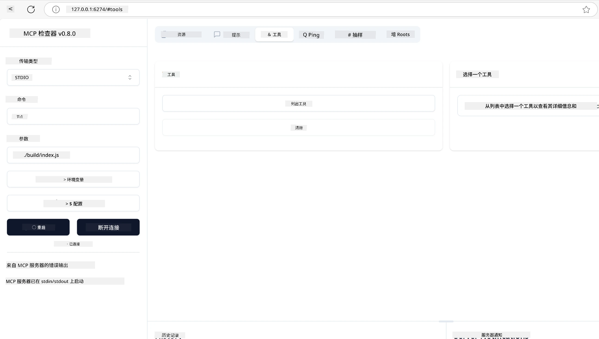
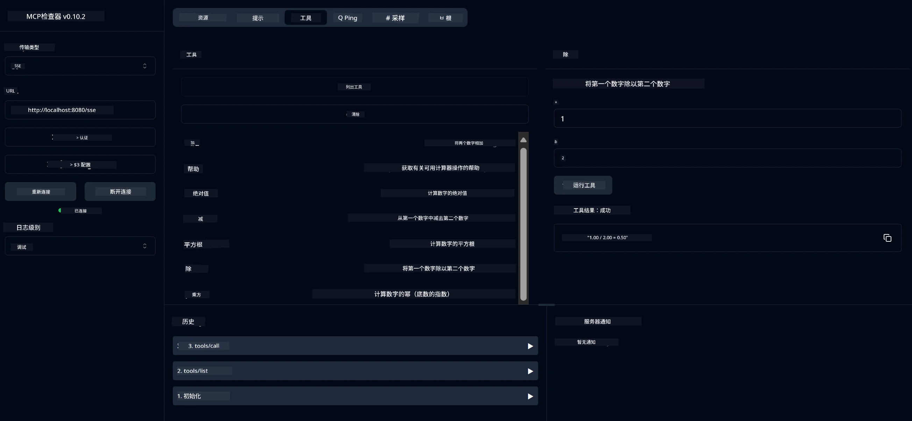
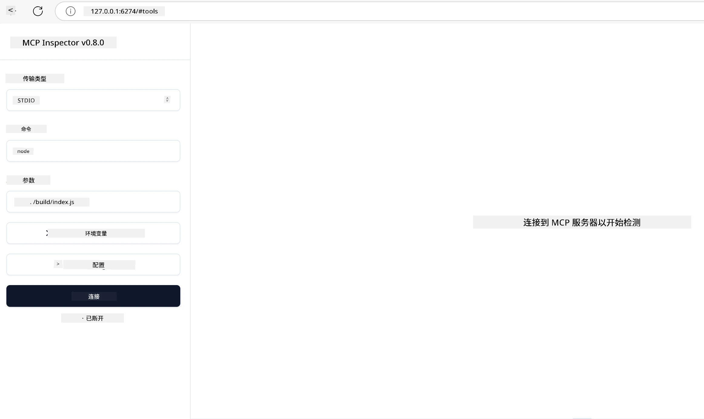
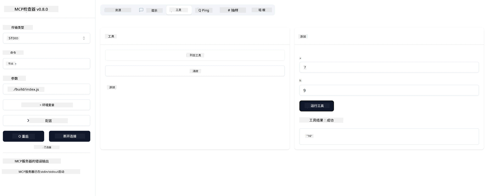

# MCP 入门指南

欢迎开始使用模型上下文协议（MCP）！无论你是 MCP 新手还是希望加深理解，本指南将引导你完成基本的设置和开发流程。你将了解 MCP 如何实现 AI 模型与应用之间的无缝集成，并学习如何快速准备环境以构建和测试基于 MCP 的解决方案。

> 简要说明；如果你构建 AI 应用，你知道可以为你的大型语言模型（LLM）添加工具和其他资源，使 LLM 更加智能。然而，如果你将这些工具和资源放在服务器上，任何带或不带 LLM 的客户端都可以使用该应用和服务器的功能。

## 概述

本课提供了设置 MCP 环境和构建第一个 MCP 应用的实用指导。你将学习如何设置必要的工具和框架，构建基础 MCP 服务器，创建主机应用，并测试你的实现。

模型上下文协议（MCP）是一种开放协议，标准化了应用向 LLM 提供上下文的方式。可以把 MCP 想象成 AI 应用的 USB-C 端口——它提供了一种标准化方式，将 AI 模型连接到不同的数据源和工具。

## 学习目标

完成本课后，你将能够：

- 在 C#、Java、Python、TypeScript 和 Rust 中设置 MCP 开发环境
- 构建并部署带有自定义功能（资源、提示和工具）的基础 MCP 服务器
- 创建连接到 MCP 服务器的主机应用
- 测试和调试 MCP 实现

## 设置你的 MCP 环境

在开始使用 MCP 之前，准备好开发环境并了解基本工作流程非常重要。本节将引导你完成初始设置步骤，确保顺利开始 MCP 之旅。

### 先决条件

在深入 MCP 开发之前，请确保你具备：

- **开发环境**：适用于你选择的语言（C#、Java、Python、TypeScript 或 Rust）
- **IDE/编辑器**：Visual Studio、Visual Studio Code、IntelliJ、Eclipse、PyCharm 或任何现代代码编辑器
- **包管理器**：NuGet、Maven/Gradle、pip、npm/yarn 或 Cargo
- **API 密钥**：用于你计划在主机应用中使用的任何 AI 服务

## 基础 MCP 服务器结构

一个 MCP 服务器通常包括：

- **服务器配置**：设置端口、认证及其他配置
- **资源**：提供给 LLM 的数据和上下文
- **工具**：模型可以调用的功能
- **提示**：用于生成或构造文本的模板

以下是一个简化的 TypeScript 示例：

```typescript
import { McpServer, ResourceTemplate } from "@modelcontextprotocol/sdk/server/mcp.js";
import { StdioServerTransport } from "@modelcontextprotocol/sdk/server/stdio.js";
import { z } from "zod";

// 创建一个MCP服务器
const server = new McpServer({
  name: "Demo",
  version: "1.0.0"
});

// 添加一个加法工具
server.tool("add",
  { a: z.number(), b: z.number() },
  async ({ a, b }) => ({
    content: [{ type: "text", text: String(a + b) }]
  })
);

// 添加一个动态问候资源
server.resource(
  "file",
  // 'list'参数控制资源如何列出可用文件。将其设置为未定义将禁用此资源的列表功能。
  new ResourceTemplate("file://{path}", { list: undefined }),
  async (uri, { path }) => ({
    contents: [{
      uri: uri.href,
      text: `File, ${path}!`
    }]
  })
);

// 添加一个读取文件内容的文件资源
server.resource(
  "file",
  new ResourceTemplate("file://{path}", { list: undefined }),
  async (uri, { path }) => {
    let text;
    try {
      text = await fs.readFile(path, "utf8");
    } catch (err) {
      text = `Error reading file: ${err.message}`;
    }
    return {
      contents: [{
        uri: uri.href,
        text
      }]
    };
  }
);

server.prompt(
  "review-code",
  { code: z.string() },
  ({ code }) => ({
    messages: [{
      role: "user",
      content: {
        type: "text",
        text: `Please review this code:\n\n${code}`
      }
    }]
  })
);

// 开始在标准输入接收消息并在标准输出发送消息
const transport = new StdioServerTransport();
await server.connect(transport);
```

在上述代码中，我们：

- 从 MCP TypeScript SDK 导入必要的类。
- 创建并配置一个新的 MCP 服务器实例。
- 注册一个自定义工具（`calculator`）及其处理函数。
- 启动服务器，监听传入的 MCP 请求。

## 测试与调试

在开始测试 MCP 服务器之前，了解可用工具和调试最佳实践非常重要。有效的测试确保服务器按预期运行，并帮助你快速定位和解决问题。以下部分概述了验证 MCP 实现的推荐方法。

MCP 提供了帮助你测试和调试服务器的工具：

- **Inspector 工具**，该图形界面允许你连接服务器，测试工具、提示和资源。
- **curl**，你也可以使用命令行工具如 curl 或其他能够创建和运行 HTTP 命令的客户端连接服务器。

### 使用 MCP Inspector

[MCP Inspector](https://github.com/modelcontextprotocol/inspector) 是一个可视化测试工具，帮助你：

1. **发现服务器功能**：自动检测可用的资源、工具和提示
2. **测试工具执行**：尝试不同参数并实时查看响应
3. **查看服务器元数据**：检查服务器信息、模式和配置

```bash
# 例如 TypeScript，安装和运行 MCP Inspector
npx @modelcontextprotocol/inspector node build/index.js
```

运行上述命令后，MCP Inspector 会在浏览器中启动本地网页界面。你将看到一个仪表盘，显示已注册的 MCP 服务器及其可用的工具、资源和提示。该界面允许你交互式测试工具执行，检查服务器元数据，并查看实时响应，使验证和调试 MCP 服务器实现更加便捷。

以下是界面截图示例：



## 常见设置问题及解决方案

| 问题 | 可能的解决方案 |
|-------|-------------------|
| 连接被拒绝 | 检查服务器是否运行，端口是否正确 |
| 工具执行错误 | 检查参数验证和错误处理 |
| 认证失败 | 验证 API 密钥和权限 |
| 模式验证错误 | 确保参数符合定义的模式 |
| 服务器无法启动 | 检查端口冲突或缺少依赖 |
| CORS 错误 | 配置正确的跨源资源共享（CORS）头 |
| 认证问题 | 验证令牌有效性和权限 |

## 本地开发

对于本地开发和测试，你可以直接在本机运行 MCP 服务器：

1. **启动服务器进程**：运行你的 MCP 服务器应用
2. **配置网络**：确保服务器在预期端口可访问
3. **连接客户端**：使用本地连接 URL，如 `http://localhost:3000`

```bash
# 示例：在本地运行 TypeScript MCP 服务器
npm run start
# 服务器运行在 http://localhost:3000
```

## 构建你的第一个 MCP 服务器

我们在之前的课程中已经介绍了[核心概念](/01-CoreConcepts/README.md)，现在是时候将这些知识付诸实践了。

### 服务器能做什么

在开始编写代码之前，先回顾一下服务器能做什么：

MCP 服务器可以：

- 访问本地文件和数据库
- 连接远程 API
- 执行计算
- 集成其他工具和服务
- 提供用户交互界面

很好，既然知道了服务器的功能，我们开始编码吧。

## 练习：创建服务器

创建服务器需要遵循以下步骤：

- 安装 MCP SDK。
- 创建项目并设置项目结构。
- 编写服务器代码。
- 测试服务器。

### -1- 创建项目

#### TypeScript

```sh
# 创建项目目录并初始化 npm 项目
mkdir calculator-server
cd calculator-server
npm init -y
```

#### Python

```sh
# 创建项目目录
mkdir calculator-server
cd calculator-server
# 在 Visual Studio Code 中打开文件夹 - 如果您使用的是其他 IDE，请跳过此步骤
code .
```

#### .NET

```sh
dotnet new console -n McpCalculatorServer
cd McpCalculatorServer
```

#### Java

对于 Java，创建一个 Spring Boot 项目：

```bash
curl https://start.spring.io/starter.zip \
  -d dependencies=web \
  -d javaVersion=21 \
  -d type=maven-project \
  -d groupId=com.example \
  -d artifactId=calculator-server \
  -d name=McpServer \
  -d packageName=com.microsoft.mcp.sample.server \
  -o calculator-server.zip
```

解压 zip 文件：

```bash
unzip calculator-server.zip -d calculator-server
cd calculator-server
# 可选地删除未使用的测试
rm -rf src/test/java
```

将以下完整配置添加到你的 *pom.xml* 文件中：

```xml
<?xml version="1.0" encoding="UTF-8"?>
<project xmlns="http://maven.apache.org/POM/4.0.0"
    xmlns:xsi="http://www.w3.org/2001/XMLSchema-instance"
    xsi:schemaLocation="http://maven.apache.org/POM/4.0.0 http://maven.apache.org/xsd/maven-4.0.0.xsd">
    <modelVersion>4.0.0</modelVersion>
    
    <!-- Spring Boot parent for dependency management -->
    <parent>
        <groupId>org.springframework.boot</groupId>
        <artifactId>spring-boot-starter-parent</artifactId>
        <version>3.5.0</version>
        <relativePath />
    </parent>

    <!-- Project coordinates -->
    <groupId>com.example</groupId>
    <artifactId>calculator-server</artifactId>
    <version>0.0.1-SNAPSHOT</version>
    <name>Calculator Server</name>
    <description>Basic calculator MCP service for beginners</description>

    <!-- Properties -->
    <properties>
        <java.version>21</java.version>
        <maven.compiler.source>21</maven.compiler.source>
        <maven.compiler.target>21</maven.compiler.target>
    </properties>

    <!-- Spring AI BOM for version management -->
    <dependencyManagement>
        <dependencies>
            <dependency>
                <groupId>org.springframework.ai</groupId>
                <artifactId>spring-ai-bom</artifactId>
                <version>1.0.0-SNAPSHOT</version>
                <type>pom</type>
                <scope>import</scope>
            </dependency>
        </dependencies>
    </dependencyManagement>

    <!-- Dependencies -->
    <dependencies>
        <dependency>
            <groupId>org.springframework.ai</groupId>
            <artifactId>spring-ai-starter-mcp-server-webflux</artifactId>
        </dependency>
        <dependency>
            <groupId>org.springframework.boot</groupId>
            <artifactId>spring-boot-starter-actuator</artifactId>
        </dependency>
        <dependency>
         <groupId>org.springframework.boot</groupId>
         <artifactId>spring-boot-starter-test</artifactId>
         <scope>test</scope>
      </dependency>
    </dependencies>

    <!-- Build configuration -->
    <build>
        <plugins>
            <plugin>
                <groupId>org.springframework.boot</groupId>
                <artifactId>spring-boot-maven-plugin</artifactId>
            </plugin>
            <plugin>
                <groupId>org.apache.maven.plugins</groupId>
                <artifactId>maven-compiler-plugin</artifactId>
                <configuration>
                    <release>21</release>
                </configuration>
            </plugin>
        </plugins>
    </build>

    <!-- Repositories for Spring AI snapshots -->
    <repositories>
        <repository>
            <id>spring-milestones</id>
            <name>Spring Milestones</name>
            <url>https://repo.spring.io/milestone</url>
            <snapshots>
                <enabled>false</enabled>
            </snapshots>
        </repository>
        <repository>
            <id>spring-snapshots</id>
            <name>Spring Snapshots</name>
            <url>https://repo.spring.io/snapshot</url>
            <releases>
                <enabled>false</enabled>
            </releases>
        </repository>
    </repositories>
</project>
```

#### Rust

```sh
mkdir calculator-server
cd calculator-server
cargo init
```

### -2- 添加依赖

项目创建完成后，接下来添加依赖：

#### TypeScript

```sh
# 如果尚未安装，全局安装 TypeScript
npm install typescript -g

# 安装 MCP SDK 和 Zod 用于模式验证
npm install @modelcontextprotocol/sdk zod
npm install -D @types/node typescript
```

#### Python

```sh
# 创建虚拟环境并安装依赖项
python -m venv venv
venv\Scripts\activate
pip install "mcp[cli]"
```

#### Java

```bash
cd calculator-server
./mvnw clean install -DskipTests
```

#### Rust

```sh
cargo add rmcp --features server,transport-io
cargo add serde
cargo add tokio --features rt-multi-thread
```

### -3- 创建项目文件

#### TypeScript

打开 *package.json* 文件，替换内容如下，确保你可以构建和运行服务器：

```json
{
  "name": "calculator-server",
  "version": "1.0.0",
  "main": "index.js",
  "type": "module",
  "scripts": {
    "build": "tsc",
    "start": "npm run build && node ./build/index.js",
  },
  "keywords": [],
  "author": "",
  "license": "ISC",
  "description": "A simple calculator server using Model Context Protocol",
  "dependencies": {
    "@modelcontextprotocol/sdk": "^1.16.0",
    "zod": "^3.25.76"
  },
  "devDependencies": {
    "@types/node": "^24.0.14",
    "typescript": "^5.8.3"
  }
}
```

创建 *tsconfig.json*，内容如下：

```json
{
  "compilerOptions": {
    "target": "ES2022",
    "module": "Node16",
    "moduleResolution": "Node16",
    "outDir": "./build",
    "rootDir": "./src",
    "strict": true,
    "esModuleInterop": true,
    "skipLibCheck": true,
    "forceConsistentCasingInFileNames": true
  },
  "include": ["src/**/*"],
  "exclude": ["node_modules"]
}
```

创建源代码目录：

```sh
mkdir src
touch src/index.ts
```

#### Python

创建文件 *server.py*

```sh
touch server.py
```

#### .NET

安装所需的 NuGet 包：

```sh
dotnet add package ModelContextProtocol --prerelease
dotnet add package Microsoft.Extensions.Hosting
```

#### Java

Java Spring Boot 项目结构会自动创建。

#### Rust

Rust 项目默认运行 `cargo init` 时会创建 *src/main.rs* 文件。打开该文件并删除默认代码。

### -4- 编写服务器代码

#### TypeScript

创建文件 *index.ts* 并添加以下代码：

```typescript
import { McpServer, ResourceTemplate } from "@modelcontextprotocol/sdk/server/mcp.js";
import { StdioServerTransport } from "@modelcontextprotocol/sdk/server/stdio.js";
import { z } from "zod";
 
// 创建一个MCP服务器
const server = new McpServer({
  name: "Calculator MCP Server",
  version: "1.0.0"
});
```

现在你有了服务器，但功能有限，我们来完善它。

#### Python

```python
# server.py
from mcp.server.fastmcp import FastMCP

# 创建一个MCP服务器
mcp = FastMCP("Demo")
```

#### .NET

```csharp
using Microsoft.Extensions.DependencyInjection;
using Microsoft.Extensions.Hosting;
using Microsoft.Extensions.Logging;
using ModelContextProtocol.Server;
using System.ComponentModel;

var builder = Host.CreateApplicationBuilder(args);
builder.Logging.AddConsole(consoleLogOptions =>
{
    // Configure all logs to go to stderr
    consoleLogOptions.LogToStandardErrorThreshold = LogLevel.Trace;
});

builder.Services
    .AddMcpServer()
    .WithStdioServerTransport()
    .WithToolsFromAssembly();
await builder.Build().RunAsync();

// add features
```

#### Java

对于 Java，创建核心服务器组件。首先，修改主应用类：

*src/main/java/com/microsoft/mcp/sample/server/McpServerApplication.java*：

```java
package com.microsoft.mcp.sample.server;

import org.springframework.ai.tool.ToolCallbackProvider;
import org.springframework.ai.tool.method.MethodToolCallbackProvider;
import org.springframework.boot.SpringApplication;
import org.springframework.boot.autoconfigure.SpringBootApplication;
import org.springframework.context.annotation.Bean;
import com.microsoft.mcp.sample.server.service.CalculatorService;

@SpringBootApplication
public class McpServerApplication {

    public static void main(String[] args) {
        SpringApplication.run(McpServerApplication.class, args);
    }
    
    @Bean
    public ToolCallbackProvider calculatorTools(CalculatorService calculator) {
        return MethodToolCallbackProvider.builder().toolObjects(calculator).build();
    }
}
```

创建计算器服务 *src/main/java/com/microsoft/mcp/sample/server/service/CalculatorService.java*：

```java
package com.microsoft.mcp.sample.server.service;

import org.springframework.ai.tool.annotation.Tool;
import org.springframework.stereotype.Service;

/**
 * Service for basic calculator operations.
 * This service provides simple calculator functionality through MCP.
 */
@Service
public class CalculatorService {

    /**
     * Add two numbers
     * @param a The first number
     * @param b The second number
     * @return The sum of the two numbers
     */
    @Tool(description = "Add two numbers together")
    public String add(double a, double b) {
        double result = a + b;
        return formatResult(a, "+", b, result);
    }

    /**
     * Subtract one number from another
     * @param a The number to subtract from
     * @param b The number to subtract
     * @return The result of the subtraction
     */
    @Tool(description = "Subtract the second number from the first number")
    public String subtract(double a, double b) {
        double result = a - b;
        return formatResult(a, "-", b, result);
    }

    /**
     * Multiply two numbers
     * @param a The first number
     * @param b The second number
     * @return The product of the two numbers
     */
    @Tool(description = "Multiply two numbers together")
    public String multiply(double a, double b) {
        double result = a * b;
        return formatResult(a, "*", b, result);
    }

    /**
     * Divide one number by another
     * @param a The numerator
     * @param b The denominator
     * @return The result of the division
     */
    @Tool(description = "Divide the first number by the second number")
    public String divide(double a, double b) {
        if (b == 0) {
            return "Error: Cannot divide by zero";
        }
        double result = a / b;
        return formatResult(a, "/", b, result);
    }

    /**
     * Calculate the power of a number
     * @param base The base number
     * @param exponent The exponent
     * @return The result of raising the base to the exponent
     */
    @Tool(description = "Calculate the power of a number (base raised to an exponent)")
    public String power(double base, double exponent) {
        double result = Math.pow(base, exponent);
        return formatResult(base, "^", exponent, result);
    }

    /**
     * Calculate the square root of a number
     * @param number The number to find the square root of
     * @return The square root of the number
     */
    @Tool(description = "Calculate the square root of a number")
    public String squareRoot(double number) {
        if (number < 0) {
            return "Error: Cannot calculate square root of a negative number";
        }
        double result = Math.sqrt(number);
        return String.format("√%.2f = %.2f", number, result);
    }

    /**
     * Calculate the modulus (remainder) of division
     * @param a The dividend
     * @param b The divisor
     * @return The remainder of the division
     */
    @Tool(description = "Calculate the remainder when one number is divided by another")
    public String modulus(double a, double b) {
        if (b == 0) {
            return "Error: Cannot divide by zero";
        }
        double result = a % b;
        return formatResult(a, "%", b, result);
    }

    /**
     * Calculate the absolute value of a number
     * @param number The number to find the absolute value of
     * @return The absolute value of the number
     */
    @Tool(description = "Calculate the absolute value of a number")
    public String absolute(double number) {
        double result = Math.abs(number);
        return String.format("|%.2f| = %.2f", number, result);
    }

    /**
     * Get help about available calculator operations
     * @return Information about available operations
     */
    @Tool(description = "Get help about available calculator operations")
    public String help() {
        return "Basic Calculator MCP Service\n\n" +
               "Available operations:\n" +
               "1. add(a, b) - Adds two numbers\n" +
               "2. subtract(a, b) - Subtracts the second number from the first\n" +
               "3. multiply(a, b) - Multiplies two numbers\n" +
               "4. divide(a, b) - Divides the first number by the second\n" +
               "5. power(base, exponent) - Raises a number to a power\n" +
               "6. squareRoot(number) - Calculates the square root\n" + 
               "7. modulus(a, b) - Calculates the remainder of division\n" +
               "8. absolute(number) - Calculates the absolute value\n\n" +
               "Example usage: add(5, 3) will return 5 + 3 = 8";
    }

    /**
     * Format the result of a calculation
     */
    private String formatResult(double a, String operator, double b, double result) {
        return String.format("%.2f %s %.2f = %.2f", a, operator, b, result);
    }
}
```

**生产环境可选组件：**

创建启动配置 *src/main/java/com/microsoft/mcp/sample/server/config/StartupConfig.java*：

```java
package com.microsoft.mcp.sample.server.config;

import org.springframework.boot.CommandLineRunner;
import org.springframework.context.annotation.Bean;
import org.springframework.context.annotation.Configuration;

@Configuration
public class StartupConfig {
    
    @Bean
    public CommandLineRunner startupInfo() {
        return args -> {
            System.out.println("\n" + "=".repeat(60));
            System.out.println("Calculator MCP Server is starting...");
            System.out.println("SSE endpoint: http://localhost:8080/sse");
            System.out.println("Health check: http://localhost:8080/actuator/health");
            System.out.println("=".repeat(60) + "\n");
        };
    }
}
```

创建健康检查控制器 *src/main/java/com/microsoft/mcp/sample/server/controller/HealthController.java*：

```java
package com.microsoft.mcp.sample.server.controller;

import org.springframework.http.ResponseEntity;
import org.springframework.web.bind.annotation.GetMapping;
import org.springframework.web.bind.annotation.RestController;
import java.time.LocalDateTime;
import java.util.HashMap;
import java.util.Map;

@RestController
public class HealthController {
    
    @GetMapping("/health")
    public ResponseEntity<Map<String, Object>> healthCheck() {
        Map<String, Object> response = new HashMap<>();
        response.put("status", "UP");
        response.put("timestamp", LocalDateTime.now().toString());
        response.put("service", "Calculator MCP Server");
        return ResponseEntity.ok(response);
    }
}
```

创建异常处理器 *src/main/java/com/microsoft/mcp/sample/server/exception/GlobalExceptionHandler.java*：

```java
package com.microsoft.mcp.sample.server.exception;

import org.springframework.http.HttpStatus;
import org.springframework.http.ResponseEntity;
import org.springframework.web.bind.annotation.ExceptionHandler;
import org.springframework.web.bind.annotation.RestControllerAdvice;

@RestControllerAdvice
public class GlobalExceptionHandler {

    @ExceptionHandler(IllegalArgumentException.class)
    public ResponseEntity<ErrorResponse> handleIllegalArgumentException(IllegalArgumentException ex) {
        ErrorResponse error = new ErrorResponse(
            "Invalid_Input", 
            "Invalid input parameter: " + ex.getMessage());
        return new ResponseEntity<>(error, HttpStatus.BAD_REQUEST);
    }

    public static class ErrorResponse {
        private String code;
        private String message;

        public ErrorResponse(String code, String message) {
            this.code = code;
            this.message = message;
        }

        // 取值器
        public String getCode() { return code; }
        public String getMessage() { return message; }
    }
}
```

创建自定义启动横幅 *src/main/resources/banner.txt*：

```text
_____      _            _       _             
 / ____|    | |          | |     | |            
| |     __ _| | ___ _   _| | __ _| |_ ___  _ __ 
| |    / _` | |/ __| | | | |/ _` | __/ _ \| '__|
| |___| (_| | | (__| |_| | | (_| | || (_) | |   
 \_____\__,_|_|\___|\__,_|_|\__,_|\__\___/|_|   
                                                
Calculator MCP Server v1.0
Spring Boot MCP Application
```

</details>

#### Rust

在 *src/main.rs* 文件顶部添加以下代码，导入 MCP 服务器所需的库和模块。

```rust
use rmcp::{
    handler::server::{router::tool::ToolRouter, tool::Parameters},
    model::{ServerCapabilities, ServerInfo},
    schemars, tool, tool_handler, tool_router,
    transport::stdio,
    ServerHandler, ServiceExt,
};
use std::error::Error;
```

计算器服务器将是一个简单的服务器，可以将两个数字相加。我们先创建一个结构体表示计算器请求。

```rust
#[derive(Debug, serde::Deserialize, schemars::JsonSchema)]
pub struct CalculatorRequest {
    pub a: f64,
    pub b: f64,
}
```

接下来，创建一个结构体表示计算器服务器。该结构体将持有工具路由器，用于注册工具。

```rust
#[derive(Debug, Clone)]
pub struct Calculator {
    tool_router: ToolRouter<Self>,
}
```

现在，我们实现 `Calculator` 结构体，创建服务器新实例并实现服务器处理程序以提供服务器信息。

```rust
#[tool_router]
impl Calculator {
    pub fn new() -> Self {
        Self {
            tool_router: Self::tool_router(),
        }
    }
}

#[tool_handler]
impl ServerHandler for Calculator {
    fn get_info(&self) -> ServerInfo {
        ServerInfo {
            instructions: Some("A simple calculator tool".into()),
            capabilities: ServerCapabilities::builder().enable_tools().build(),
            ..Default::default()
        }
    }
}
```

最后，实现主函数启动服务器。该函数将创建 `Calculator` 结构体实例，并通过标准输入/输出提供服务。

```rust
#[tokio::main]
async fn main() -> Result<(), Box<dyn Error>> {
    let service = Calculator::new().serve(stdio()).await?;
    service.waiting().await?;
    Ok(())
}
```

服务器现已设置为提供基本信息。接下来，我们将添加一个执行加法的工具。

### -5- 添加工具和资源

通过添加以下代码，添加一个工具和一个资源：

#### TypeScript

```typescript
server.tool(
  "add",
  { a: z.number(), b: z.number() },
  async ({ a, b }) => ({
    content: [{ type: "text", text: String(a + b) }]
  })
);

server.resource(
  "greeting",
  new ResourceTemplate("greeting://{name}", { list: undefined }),
  async (uri, { name }) => ({
    contents: [{
      uri: uri.href,
      text: `Hello, ${name}!`
    }]
  })
);
```

你的工具接收参数 `a` 和 `b`，运行一个函数，产生如下形式的响应：

```typescript
{
  contents: [{
    type: "text", content: "some content"
  }]
}
```

你的资源通过字符串 "greeting" 访问，接收参数 `name`，并产生类似工具的响应：

```typescript
{
  uri: "<href>",
  text: "a text"
}
```

#### Python

```python
# 添加一个加法工具
@mcp.tool()
def add(a: int, b: int) -> int:
    """Add two numbers"""
    return a + b


# 添加一个动态问候资源
@mcp.resource("greeting://{name}")
def get_greeting(name: str) -> str:
    """Get a personalized greeting"""
    return f"Hello, {name}!"
```

在上述代码中，我们：

- 定义了一个名为 `add` 的工具，接收整数参数 `a` 和 `b`。
- 创建了一个名为 `greeting` 的资源，接收参数 `name`。

#### .NET

将以下代码添加到你的 Program.cs 文件：

```csharp
[McpServerToolType]
public static class CalculatorTool
{
    [McpServerTool, Description("Adds two numbers")]
    public static string Add(int a, int b) => $"Sum {a + b}";
}
```

#### Java

工具已在前一步创建。

#### Rust

在 `impl Calculator` 块内添加新工具：

```rust
#[tool(description = "Adds a and b")]
async fn add(
    &self,
    Parameters(CalculatorRequest { a, b }): Parameters<CalculatorRequest>,
) -> String {
    (a + b).to_string()
}
```

### -6- 完整代码

添加最后的代码，使服务器可以启动：

#### TypeScript

```typescript
// 开始在标准输入上接收消息并在标准输出上发送消息
const transport = new StdioServerTransport();
await server.connect(transport);
```

完整代码如下：

```typescript
// index.ts
import { McpServer, ResourceTemplate } from "@modelcontextprotocol/sdk/server/mcp.js";
import { StdioServerTransport } from "@modelcontextprotocol/sdk/server/stdio.js";
import { z } from "zod";

// 创建一个MCP服务器
const server = new McpServer({
  name: "Calculator MCP Server",
  version: "1.0.0"
});

// 添加一个加法工具
server.tool(
  "add",
  { a: z.number(), b: z.number() },
  async ({ a, b }) => ({
    content: [{ type: "text", text: String(a + b) }]
  })
);

// 添加一个动态问候资源
server.resource(
  "greeting",
  new ResourceTemplate("greeting://{name}", { list: undefined }),
  async (uri, { name }) => ({
    contents: [{
      uri: uri.href,
      text: `Hello, ${name}!`
    }]
  })
);

// 开始在标准输入接收消息并在标准输出发送消息
const transport = new StdioServerTransport();
server.connect(transport);
```

#### Python

```python
# server.py
from mcp.server.fastmcp import FastMCP

# 创建一个MCP服务器
mcp = FastMCP("Demo")


# 添加一个加法工具
@mcp.tool()
def add(a: int, b: int) -> int:
    """Add two numbers"""
    return a + b


# 添加一个动态问候资源
@mcp.resource("greeting://{name}")
def get_greeting(name: str) -> str:
    """Get a personalized greeting"""
    return f"Hello, {name}!"

# 主执行块 - 运行服务器所必需的
if __name__ == "__main__":
    mcp.run()
```

#### .NET

创建 Program.cs 文件，内容如下：

```csharp
using Microsoft.Extensions.DependencyInjection;
using Microsoft.Extensions.Hosting;
using Microsoft.Extensions.Logging;
using ModelContextProtocol.Server;
using System.ComponentModel;

var builder = Host.CreateApplicationBuilder(args);
builder.Logging.AddConsole(consoleLogOptions =>
{
    // Configure all logs to go to stderr
    consoleLogOptions.LogToStandardErrorThreshold = LogLevel.Trace;
});

builder.Services
    .AddMcpServer()
    .WithStdioServerTransport()
    .WithToolsFromAssembly();
await builder.Build().RunAsync();

[McpServerToolType]
public static class CalculatorTool
{
    [McpServerTool, Description("Adds two numbers")]
    public static string Add(int a, int b) => $"Sum {a + b}";
}
```

#### Java

你的完整主应用类应如下所示：

```java
// McpServerApplication.java
package com.microsoft.mcp.sample.server;

import org.springframework.ai.tool.ToolCallbackProvider;
import org.springframework.ai.tool.method.MethodToolCallbackProvider;
import org.springframework.boot.SpringApplication;
import org.springframework.boot.autoconfigure.SpringBootApplication;
import org.springframework.context.annotation.Bean;
import com.microsoft.mcp.sample.server.service.CalculatorService;

@SpringBootApplication
public class McpServerApplication {

    public static void main(String[] args) {
        SpringApplication.run(McpServerApplication.class, args);
    }
    
    @Bean
    public ToolCallbackProvider calculatorTools(CalculatorService calculator) {
        return MethodToolCallbackProvider.builder().toolObjects(calculator).build();
    }
}
```

#### Rust

Rust 服务器的最终代码应如下：

```rust
use rmcp::{
    ServerHandler, ServiceExt,
    handler::server::{router::tool::ToolRouter, tool::Parameters},
    model::{ServerCapabilities, ServerInfo},
    schemars, tool, tool_handler, tool_router,
    transport::stdio,
};
use std::error::Error;

#[derive(Debug, serde::Deserialize, schemars::JsonSchema)]
pub struct CalculatorRequest {
    pub a: f64,
    pub b: f64,
}

#[derive(Debug, Clone)]
pub struct Calculator {
    tool_router: ToolRouter<Self>,
}

#[tool_router]
impl Calculator {
    pub fn new() -> Self {
        Self {
            tool_router: Self::tool_router(),
        }
    }
    
    #[tool(description = "Adds a and b")]
    async fn add(
        &self,
        Parameters(CalculatorRequest { a, b }): Parameters<CalculatorRequest>,
    ) -> String {
        (a + b).to_string()
    }
}

#[tool_handler]
impl ServerHandler for Calculator {
    fn get_info(&self) -> ServerInfo {
        ServerInfo {
            instructions: Some("A simple calculator tool".into()),
            capabilities: ServerCapabilities::builder().enable_tools().build(),
            ..Default::default()
        }
    }
}

#[tokio::main]
async fn main() -> Result<(), Box<dyn Error>> {
    let service = Calculator::new().serve(stdio()).await?;
    service.waiting().await?;
    Ok(())
}
```

### -7- 测试服务器

使用以下命令启动服务器：

#### TypeScript

```sh
npm run build
```

#### Python

```sh
mcp run server.py
```

> 使用 MCP Inspector，请使用 `mcp dev server.py`，该命令会自动启动 Inspector 并提供所需的代理会话令牌。如果使用 `mcp run server.py`，则需要手动启动 Inspector 并配置连接。

#### .NET

确保你在项目目录下：

```sh
cd McpCalculatorServer
dotnet run
```

#### Java

```bash
./mvnw clean install -DskipTests
java -jar target/calculator-server-0.0.1-SNAPSHOT.jar
```

#### Rust

运行以下命令格式化并运行服务器：

```sh
cargo fmt
cargo run
```

### -8- 使用 Inspector 运行

Inspector 是一个很棒的工具，可以启动你的服务器并让你与之交互，测试其功能。让我们启动它：

> [!NOTE]
> “命令”字段中的内容可能不同，因为它包含了使用你特定运行时运行服务器的命令。

#### TypeScript

```sh
npx @modelcontextprotocol/inspector node build/index.js
```

或者将其添加到你的 *package.json* 中，如 `"inspector": "npx @modelcontextprotocol/inspector node build/index.js"`，然后运行 `npm run inspector`

#### Python

Python 封装了一个名为 inspector 的 Node.js 工具。你可以这样调用该工具：

```sh
mcp dev server.py
```

不过，它并未实现该工具的所有方法，建议直接运行 Node.js 工具，如下所示：

```sh
npx @modelcontextprotocol/inspector mcp run server.py
```

如果你使用的工具或 IDE 允许配置运行脚本的命令和参数，
确保在“Command”字段中设置为 `python`，并将 `server.py` 设为“Arguments”。这确保脚本能够正确运行。

#### .NET

确保你在项目目录中：

```sh
cd McpCalculatorServer
npx @modelcontextprotocol/inspector dotnet run
```

#### Java

确保你的计算器服务器正在运行
然后运行检查器：

```cmd
npx @modelcontextprotocol/inspector
```

在检查器的网页界面中：

1. 选择“SSE”作为传输类型
2. 将URL设置为：`http://localhost:8080/sse`
3. 点击“Connect”



**你现在已连接到服务器**
**Java服务器测试部分现在完成**

下一部分是关于与服务器交互。

你应该看到以下用户界面：



1. 通过选择“Connect”按钮连接到服务器
  一旦连接到服务器，你应该看到以下内容：

  

1. 选择“Tools”和“listTools”，你应该看到“Add”出现，选择“Add”并填写参数值。

  你应该看到以下响应，即“add”工具的结果：

  

恭喜，你已经成功创建并运行了你的第一个服务器！

#### Rust

要使用MCP Inspector CLI运行Rust服务器，请使用以下命令：

```sh
npx @modelcontextprotocol/inspector cargo run --cli --method tools/call --tool-name add --tool-arg a=1 b=2
```

### 官方SDK

MCP提供多种语言的官方SDK：

- [C# SDK](https://github.com/modelcontextprotocol/csharp-sdk) - 与微软合作维护
- [Java SDK](https://github.com/modelcontextprotocol/java-sdk) - 与Spring AI合作维护
- [TypeScript SDK](https://github.com/modelcontextprotocol/typescript-sdk) - 官方TypeScript实现
- [Python SDK](https://github.com/modelcontextprotocol/python-sdk) - 官方Python实现
- [Kotlin SDK](https://github.com/modelcontextprotocol/kotlin-sdk) - 官方Kotlin实现
- [Swift SDK](https://github.com/modelcontextprotocol/swift-sdk) - 与Loopwork AI合作维护
- [Rust SDK](https://github.com/modelcontextprotocol/rust-sdk) - 官方Rust实现

## 关键要点

- 使用特定语言的SDK，设置MCP开发环境非常简单
- 构建MCP服务器涉及创建和注册具有清晰模式的工具
- 测试和调试对于可靠的MCP实现至关重要

## 示例

- [Java计算器](../samples/java/calculator/README.md)
- [.Net计算器](../../../../03-GettingStarted/samples/csharp)
- [JavaScript计算器](../samples/javascript/README.md)
- [TypeScript计算器](../samples/typescript/README.md)
- [Python计算器](../../../../03-GettingStarted/samples/python)
- [Rust计算器](../../../../03-GettingStarted/samples/rust)

## 任务

创建一个带有你选择工具的简单MCP服务器：

1. 使用你喜欢的语言实现该工具（.NET、Java、Python、TypeScript或Rust）。
2. 定义输入参数和返回值。
3. 运行检查器工具以确保服务器按预期工作。
4. 使用各种输入测试实现。

## 解决方案

[解决方案](./solution/README.md)

## 额外资源

- [使用Model Context Protocol在Azure上构建代理](https://learn.microsoft.com/azure/developer/ai/intro-agents-mcp)
- [使用Azure容器应用的远程MCP（Node.js/TypeScript/JavaScript）](https://learn.microsoft.com/samples/azure-samples/mcp-container-ts/mcp-container-ts/)
- [.NET OpenAI MCP代理](https://learn.microsoft.com/samples/azure-samples/openai-mcp-agent-dotnet/openai-mcp-agent-dotnet/)

## 接下来

下一步：[MCP客户端入门](../02-client/README.md)

---

<!-- CO-OP TRANSLATOR DISCLAIMER START -->
**免责声明**：  
本文件由人工智能翻译服务 [Co-op Translator](https://github.com/Azure/co-op-translator) 翻译。虽然我们力求准确，但请注意自动翻译可能存在错误或不准确之处。原始语言版本的文件应被视为权威来源。对于重要信息，建议使用专业人工翻译。因使用本翻译而产生的任何误解或误释，我们不承担任何责任。
<!-- CO-OP TRANSLATOR DISCLAIMER END -->