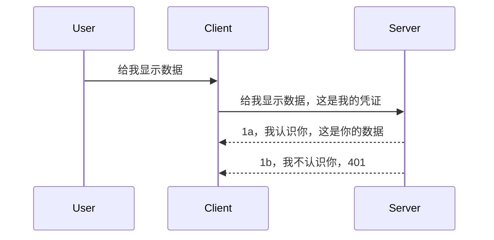

# 简单认证

MCP SDK 支持使用 OAuth 2.1，坦率地说，这个过程相当复杂，涉及认证服务器、资源服务器、提交凭证、获取代码、用代码交换承载令牌，直到最终获取资源数据。如果你不熟悉 OAuth（这是一个很好的实现方案），建议先从一些基本层次的认证开始，并逐步构建更好更安全的认证机制。这就是本章存在的原因，帮助你逐步迈向更高级的认证。

## 认证，指的是什么？

认证是身份验证和授权的简称。我们的目标是完成两件事：

- **身份验证**，即判断我们是否允许某个人进入我们的房子，也就是说他们是否有权“在这里”，即是否能访问我们的资源服务器，上面运行着我们的 MCP Server 功能。
- **授权**，即判断一个用户是否应该能访问他们请求的具体资源，比如这些订单或这些产品，或者是否允许他们读取内容但不允许删除，作为另一个例子。

## 凭证：如何告诉系统我们是谁

大多数 Web 开发人员会想到向服务器提供凭证，通常是一个秘密，用来说明他们是否被允许访问（身份验证）。这个凭证通常是用户名和密码的 base64 编码版本，或者唯一标识特定用户的 API 密钥。

这通常通过一个名为 “Authorization” 的请求头发送，如下所示：

```json
{ "Authorization": "secret123" }
```

这通常称为基本认证。整体流程大致如下：


现在我们从流程角度理解了它的工作方式，接下来如何实现呢？大多数 Web 服务器都有中间件（middleware）的概念，这是一段作为请求过程一部分运行的代码，可以验证凭证，如果凭证有效允许请求通过。如果请求中凭证无效，则返回认证错误。让我们看看如何实现它：

**Python**

```python
class AuthMiddleware(BaseHTTPMiddleware):
    async def dispatch(self, request, call_next):

        has_header = request.headers.get("Authorization")
        if not has_header:
            print("-> Missing Authorization header!")
            return Response(status_code=401, content="Unauthorized")

        if not valid_token(has_header):
            print("-> Invalid token!")
            return Response(status_code=403, content="Forbidden")

        print("Valid token, proceeding...")
       
        response = await call_next(request)
        # 添加任何客户头或以某种方式更改响应
        return response


starlette_app.add_middleware(CustomHeaderMiddleware)
```

这里我们做了：

- 创建了一个名为 `AuthMiddleware` 的中间件，其 `dispatch` 方法由 Web 服务器调用。
- 将中间件添加到 Web 服务器中：

    ```python
    starlette_app.add_middleware(AuthMiddleware)
    ```

- 编写了验证逻辑，检查 Authorization 请求头是否存在，以及发送的密钥是否合法：

    ```python
    has_header = request.headers.get("Authorization")
    if not has_header:
        print("-> Missing Authorization header!")
        return Response(status_code=401, content="Unauthorized")

    if not valid_token(has_header):
        print("-> Invalid token!")
        return Response(status_code=403, content="Forbidden")
    ```

    如果密钥存在且合法，则调用 `call_next` 允许请求通过并返回响应。

    ```python
    response = await call_next(request)
    # 添加任何客户头或以某种方式更改响应
    return response
    ```

运行机制是，当有 Web 请求到服务器时，中间件会被调用，根据其实现，它要么允许请求通过，要么返回一个错误，指示客户端无权继续。

**TypeScript**

这里我们用流行的 Express 框架创建中间件，拦截请求进入 MCP Server 之前。代码如下：

```typescript
function isValid(secret) {
    return secret === "secret123";
}

app.use((req, res, next) => {
    // 1. 授权头是否存在？
    if(!req.headers["Authorization"]) {
        res.status(401).send('Unauthorized');
    }
    
    let token = req.headers["Authorization"];

    // 2. 检查有效性。
    if(!isValid(token)) {
        res.status(403).send('Forbidden');
    }

   
    console.log('Middleware executed');
    // 3. 将请求传递到请求管道的下一步。
    next();
});
```

代码中我们：

1. 首先检查是否存在 Authorization 请求头，如果没有，返回 401 错误。
2. 确认凭证/令牌是否有效，如果无效，返回 403 错误。
3. 最后将请求传递到请求管道中并返回请求的资源。

## 练习：实现认证

让我们应用所学知识试着实现认证。计划如下：

服务器

- 创建一个 Web 服务器和 MCP 实例。
- 为服务器实现中间件。

客户端 

- 通过请求头发送带凭证的 Web 请求。

### -1- 创建 Web 服务器和 MCP 实例

第一步，我们需要创建 Web 服务器实例和 MCP Server。

**Python**

这里创建了 MCP 服务器实例，创建了 starlette web 应用并用 uvicorn 托管。

```python
# 创建 MCP 服务器

app = FastMCP(
    name="MCP Resource Server",
    instructions="Resource Server that validates tokens via Authorization Server introspection",
    host=settings["host"],
    port=settings["port"],
    debug=True
)

# 创建 starlette 网络应用
starlette_app = app.streamable_http_app()

# 通过 uvicorn 提供应用服务
async def run(starlette_app):
    import uvicorn
    config = uvicorn.Config(
            starlette_app,
            host=app.settings.host,
            port=app.settings.port,
            log_level=app.settings.log_level.lower(),
        )
    server = uvicorn.Server(config)
    await server.serve()

run(starlette_app)
```

代码中我们：

- 创建了 MCP Server。
- 通过 MCP Server 构造 starlette web 应用，调用 `app.streamable_http_app()`。
- 使用 uvicorn 来托管和服务该 web 应用，调用 `server.serve()`。

**TypeScript**

这里我们创建了 MCP Server 实例。

```typescript
const server = new McpServer({
      name: "example-server",
      version: "1.0.0"
    });

    // ... 设置服务器资源、工具和提示 ...
```

这个 MCP Server 创建需要放在我们的 POST /mcp 路由定义中，所以我们将上述代码移动如下：

```typescript
import express from "express";
import { randomUUID } from "node:crypto";
import { McpServer } from "@modelcontextprotocol/sdk/server/mcp.js";
import { StreamableHTTPServerTransport } from "@modelcontextprotocol/sdk/server/streamableHttp.js";
import { isInitializeRequest } from "@modelcontextprotocol/sdk/types.js"

const app = express();
app.use(express.json());

// 用于按会话ID存储传输的映射
const transports: { [sessionId: string]: StreamableHTTPServerTransport } = {};

// 处理客户端到服务器的POST请求
app.post('/mcp', async (req, res) => {
  // 检查是否存在会话ID
  const sessionId = req.headers['mcp-session-id'] as string | undefined;
  let transport: StreamableHTTPServerTransport;

  if (sessionId && transports[sessionId]) {
    // 重用现有的传输
    transport = transports[sessionId];
  } else if (!sessionId && isInitializeRequest(req.body)) {
    // 新的初始化请求
    transport = new StreamableHTTPServerTransport({
      sessionIdGenerator: () => randomUUID(),
      onsessioninitialized: (sessionId) => {
        // 按会话ID存储传输
        transports[sessionId] = transport;
      },
      // 出于向后兼容性考虑，默认禁用了DNS重绑定保护。如果您在本地运行此服务器
      // 请确保设置：
      // enableDnsRebindingProtection: true,
      // allowedHosts: ['127.0.0.1'],
    });

    // 关闭时清理传输
    transport.onclose = () => {
      if (transport.sessionId) {
        delete transports[transport.sessionId];
      }
    };
    const server = new McpServer({
      name: "example-server",
      version: "1.0.0"
    });

    // ... 设置服务器资源、工具和提示 ...

    // 连接到MCP服务器
    await server.connect(transport);
  } else {
    // 无效请求
    res.status(400).json({
      jsonrpc: '2.0',
      error: {
        code: -32000,
        message: 'Bad Request: No valid session ID provided',
      },
      id: null,
    });
    return;
  }

  // 处理请求
  await transport.handleRequest(req, res, req.body);
});

// GET和DELETE请求的可重用处理器
const handleSessionRequest = async (req: express.Request, res: express.Response) => {
  const sessionId = req.headers['mcp-session-id'] as string | undefined;
  if (!sessionId || !transports[sessionId]) {
    res.status(400).send('Invalid or missing session ID');
    return;
  }
  
  const transport = transports[sessionId];
  await transport.handleRequest(req, res);
};

// 处理通过SSE的服务器到客户端通知的GET请求
app.get('/mcp', handleSessionRequest);

// 处理会话终止的DELETE请求
app.delete('/mcp', handleSessionRequest);

app.listen(3000);
```

现在你看到 MCP Server 的创建被移动到了 `app.post("/mcp")` 内部。

接下来我们继续创建中间件以验证传入凭证。

### -2- 为服务器实现中间件

接下来是中间件部分。我们将创建一个中间件，检查 `Authorization` 请求头中的凭证并验证它。如果接受，则请求继续执行它需要的操作（比如列出工具、读取资源，或客户端请求的任何 MCP 功能）。

**Python**

创建中间件需要继承 `BaseHTTPMiddleware` 类。这里有两个关键点：

- 请求对象 `request` ，我们从头部读取信息。
- `call_next` 是一个回调，如果客户端带来的凭证被接受，需要调用它。

首先，处理缺少 `Authorization` 请求头的情况：

```python
has_header = request.headers.get("Authorization")

# 未检测到头信息，返回401错误，否则继续。
if not has_header:
    print("-> Missing Authorization header!")
    return Response(status_code=401, content="Unauthorized")
```

这里我们返回一个 401 未授权消息，因为客户端认证失败。

接下来，如果提交了凭证，需要验证其有效性：

```python
 if not valid_token(has_header):
    print("-> Invalid token!")
    return Response(status_code=403, content="Forbidden")
```

上面代码中我们返回 403 禁止访问消息。接下来看完整的中间件实现：

```python
class AuthMiddleware(BaseHTTPMiddleware):
    async def dispatch(self, request, call_next):

        has_header = request.headers.get("Authorization")
        if not has_header:
            print("-> Missing Authorization header!")
            return Response(status_code=401, content="Unauthorized")

        if not valid_token(has_header):
            print("-> Invalid token!")
            return Response(status_code=403, content="Forbidden")

        print("Valid token, proceeding...")
        print(f"-> Received {request.method} {request.url}")
        response = await call_next(request)
        response.headers['Custom'] = 'Example'
        return response

```

很好，那 `valid_token` 函数呢？如下所示：

```python
# 不要用于生产环境 - 请改进它！！
def valid_token(token: str) -> bool:
    # 移除 "Bearer " 前缀
    if token.startswith("Bearer "):
        token = token[7:]
        return token == "secret-token"
    return False
```

显然这需要改进。

重要提示：绝不应在代码中硬编码此类密钥。理想情况下，应从数据源或身份提供方（IDP）检索比较值，或者由 IDP 直接负责验证。

**TypeScript**

用 Express 实现时，我们调用 `use` 方法添加中间件函数。

我们需要：

- 获取请求对象，检查 `Authorization` 属性中的凭证。
- 验证凭证，如果有效，允许请求继续完成客户端 MCP 请求（如列出工具、读取资源等）。

这里，我们判断是否存在 `Authorization` 请求头，如果没有，阻止请求通过：

```typescript
if(!req.headers["authorization"]) {
    res.status(401).send('Unauthorized');
    return;
}
```

请求头缺失时返回 401。

接下来验证凭证是否有效，无效时返回不同消息：

```typescript
if(!isValid(token)) {
    res.status(403).send('Forbidden');
    return;
} 
```

这里返回 403 错误。

完整代码如下：

```typescript
app.use((req, res, next) => {
    console.log('Request received:', req.method, req.url, req.headers);
    console.log('Headers:', req.headers["authorization"]);
    if(!req.headers["authorization"]) {
        res.status(401).send('Unauthorized');
        return;
    }
    
    let token = req.headers["authorization"];

    if(!isValid(token)) {
        res.status(403).send('Forbidden');
        return;
    }  

    console.log('Middleware executed');
    next();
});
```

我们已经设置 Web 服务器接收中间件来检查客户端发送的凭证。那客户端该怎么做？

### -3- 通过头部发送带凭证的请求

客户端必须确保通过请求头传递凭证。由于使用 MCP 客户端，我们需要知道如何操作。

**Python**

客户端发送请求时，我们需要传递带凭证的请求头，如：

```python
# 不要硬编码数值，至少应将其保存在环境变量或更安全的存储中
token = "secret-token"

async with streamablehttp_client(
        url = f"http://localhost:{port}/mcp",
        headers = {"Authorization": f"Bearer {token}"}
    ) as (
        read_stream,
        write_stream,
        session_callback,
    ):
        async with ClientSession(
            read_stream,
            write_stream
        ) as session:
            await session.initialize()
      
            # 待办事项，你希望在客户端完成的操作，例如列出工具、调用工具等。
```

注意这里设置了 `headers` 属性，格式是 `headers = {"Authorization": f"Bearer {token}"}`。

**TypeScript**

这可以分两步完成：

1. 用凭证填充配置对象。
2. 将配置对象传给传输层。

```typescript

// 不要像这里显示的那样硬编码值。至少将其作为环境变量，并在开发模式中使用类似 dotenv 的工具。
let token = "secret123"

// 定义一个客户端传输选项对象
let options: StreamableHTTPClientTransportOptions = {
  sessionId: sessionId,
  requestInit: {
    headers: {
      "Authorization": "secret123"
    }
  }
};

// 将选项对象传递给传输层
async function main() {
   const transport = new StreamableHTTPClientTransport(
      new URL(serverUrl),
      options
   );
```

上面代码显示我们创建了一个 `options` 对象，并将 headers 放在 `requestInit` 属性下。

重要提示：如何改进呢？当前实现存在一些问题。首先，这种传递凭证方式风险较大，至少应使用 HTTPS。即便如此，凭证仍可能被盗，因此需要一个可以轻松撤销令牌的系统，并且加上额外的检查，比如请求来源地、请求频率（防止机器人操作）等，考虑的因素非常多。

不过，针对仅需阻止未认证访问的非常简单 API，我们现在的做法是个良好的起点。

话虽如此，我们尝试通过使用标准格式 JSON Web Token（JWT，俗称 "JOT"）来增强安全性。

## JSON Web Token，JWT

我们尝试改进由发送非常简单凭证的方式。采用 JWT 立即带来的改进有哪些？

- **安全性提升**。基本认证中，用户名和密码反复以 base64 令牌形式发送（或者发送 API 密钥），风险较高。使用 JWT，你发送用户名和密码获取一个令牌返回，且令牌是有时效性的，会过期。JWT 支持使用角色、作用域和权限进行细粒度访问控制。
- **无状态和可扩展性**。JWT 是自包含的，携带所有用户信息，无需服务器端会话存储。令牌可以本地验证。
- **互操作性和联合认证**。JWT 是 OpenID Connect 的核心，被 Entra ID、Google Identity 和 Auth0 等知名身份提供商使用。它们还支持单点登录等企业级功能。
- **模块化和灵活性**。JWT 可以与 Azure API 管理、NGINX 等 API 网关协同使用。也支持用户认证场景及服务间通信，包括模拟和委托场景。
- **性能和缓存**。解码后可以缓存 JWT，减少解析需求，尤其有助于高流量应用提升吞吐量并降低基础设施负载。
- **高级功能**。支持令牌内省（服务器端检查有效性）和撤销（使令牌失效）。

基于这些优势，我们来看看如何进一步提升实现。

## 从基本认证转向 JWT

高层次来看，我们需要做的改动是：

- **学会构造 JWT 令牌**，让它准备好由客户端发送到服务器。
- **验证 JWT 令牌**，如果有效，允许客户端获得资源。
- **安全存储令牌**，如何存储这个令牌。
- **保护路由**，需要保护路由以及具体的 MCP 功能。
- **添加刷新令牌**，确保生成短期有效令牌，同时有长期有效的刷新令牌可用来获取新的令牌，并且设有刷新端点和轮换策略。

### -1- 构造 JWT 令牌

JWT 令牌包括以下部分：

- **头部**，包含使用的算法和令牌类型。
- **载荷**，声明信息，比如 sub（代表用户或实体，通常是用户 ID）、exp（过期时间）、角色等。
- **签名**，用秘钥或私钥签名。

我们需要构造头部、载荷，并生成编码后的令牌。

**Python**

```python

import jwt
import jwt
from jwt.exceptions import ExpiredSignatureError, InvalidTokenError
import datetime

# 用于签署JWT的秘密密钥
secret_key = 'your-secret-key'

header = {
    "alg": "HS256",
    "typ": "JWT"
}

# 用户信息及其声明和过期时间
payload = {
    "sub": "1234567890",               # 主题（用户ID）
    "name": "User Userson",                # 自定义声明
    "admin": True,                     # 自定义声明
    "iat": datetime.datetime.utcnow(),# 签发时间
    "exp": datetime.datetime.utcnow() + datetime.timedelta(hours=1)  # 过期时间
}

# 编码它
encoded_jwt = jwt.encode(payload, secret_key, algorithm="HS256", headers=header)
```

代码中我们：

- 用 HS256 算法构造头部，类型设置为 JWT。
- 构造载荷，包括主体或用户 ID，用户名，角色，发行时间和过期时间，实现了前文提到的时效控制。

**TypeScript**

这里我们引入一些依赖库，帮助构造 JWT。

依赖项

```sh

npm install jsonwebtoken
npm install --save-dev @types/jsonwebtoken
```

有了这些，我们开始创建头部、载荷，以及编码后的令牌。

```typescript
import jwt from 'jsonwebtoken';

const secretKey = 'your-secret-key'; // 在生产环境中使用环境变量

// 定义载荷
const payload = {
  sub: '1234567890',
  name: 'User usersson',
  admin: true,
  iat: Math.floor(Date.now() / 1000), // 签发时间
  exp: Math.floor(Date.now() / 1000) + 60 * 60 // 1小时后过期
};

// 定义头部（可选，jsonwebtoken会设置默认值）
const header = {
  alg: 'HS256',
  typ: 'JWT'
};

// 创建令牌
const token = jwt.sign(payload, secretKey, {
  algorithm: 'HS256',
  header: header
});

console.log('JWT:', token);
```

此令牌：

使用 HS256 签名
有效期 1 小时
载荷中包含 sub、name、admin、iat 和 exp 等声明。

### -2- 验证令牌

我们还需要在服务器端验证令牌，确保客户端发来的数据有效。这涉及多重检查，从结构有效性到令牌有效期。还建议增加其他检查，比如确保令牌对应的用户存在且拥有相应权限。

验证令牌需要先解码读取，然后开始验证：

**Python**

```python

# 解码并验证JWT
try:
    decoded = jwt.decode(token, secret_key, algorithms=["HS256"])
    print("✅ Token is valid.")
    print("Decoded claims:")
    for key, value in decoded.items():
        print(f"  {key}: {value}")
except ExpiredSignatureError:
    print("❌ Token has expired.")
except InvalidTokenError as e:
    print(f"❌ Invalid token: {e}")

```

代码中，我们用 `jwt.decode` 方法，传入令牌、秘钥和算法。注意使用了 try-catch 结构，因为验证失败会抛出异常。

**TypeScript**

这里调用 `jwt.verify`，获取解码后的令牌供进一步分析。如果调用失败，说明令牌结构错误或已失效。

```typescript

try {
  const decoded = jwt.verify(token, secretKey);
  console.log('Decoded Payload:', decoded);
} catch (err) {
  console.error('Token verification failed:', err);
}
```

注意：如前所述，建议进行更多检查，确保令牌对应系统中的用户，并确认该用户拥有声明的权限。
接下来，让我们来看基于角色的访问控制，也称为 RBAC。

## 添加基于角色的访问控制

我们的想法是表达不同角色拥有不同的权限。例如，我们假设管理员可以做所有事情，普通用户可以读写，访客只能读取。因此，这里有一些可能的权限级别：

- Admin.Write  
- User.Read  
- Guest.Read  

让我们看一下如何使用中间件实现这样的控制。中间件可以针对每个路由添加，也可以针对所有路由添加。

**Python**

```python
from starlette.middleware.base import BaseHTTPMiddleware
from starlette.responses import JSONResponse
import jwt

# 不要像这样在代码中写入密钥，这只是为了演示目的。请从安全的地方读取它。
SECRET_KEY = "your-secret-key" # 把它放在环境变量中
REQUIRED_PERMISSION = "User.Read"

class JWTPermissionMiddleware(BaseHTTPMiddleware):
    async def dispatch(self, request, call_next):
        auth_header = request.headers.get("Authorization")
        if not auth_header or not auth_header.startswith("Bearer "):
            return JSONResponse({"error": "Missing or invalid Authorization header"}, status_code=401)

        token = auth_header.split(" ")[1]
        try:
            decoded = jwt.decode(token, SECRET_KEY, algorithms=["HS256"])
        except jwt.ExpiredSignatureError:
            return JSONResponse({"error": "Token expired"}, status_code=401)
        except jwt.InvalidTokenError:
            return JSONResponse({"error": "Invalid token"}, status_code=401)

        permissions = decoded.get("permissions", [])
        if REQUIRED_PERMISSION not in permissions:
            return JSONResponse({"error": "Permission denied"}, status_code=403)

        request.state.user = decoded
        return await call_next(request)


```
  
有几种不同的方法添加如下中间件：

```python

# 方案1：在构造starlette应用时添加中间件
middleware = [
    Middleware(JWTPermissionMiddleware)
]

app = Starlette(routes=routes, middleware=middleware)

# 方案2：在starlette应用已经构造后添加中间件
starlette_app.add_middleware(JWTPermissionMiddleware)

# 方案3：按路由添加中间件
routes = [
    Route(
        "/mcp",
        endpoint=..., # 处理器
        middleware=[Middleware(JWTPermissionMiddleware)]
    )
]
```
  
**TypeScript**

我们可以使用 `app.use` 以及一个对所有请求都运行的中间件。

```typescript
app.use((req, res, next) => {
    console.log('Request received:', req.method, req.url, req.headers);
    console.log('Headers:', req.headers["authorization"]);

    // 1. 检查是否已发送授权头

    if(!req.headers["authorization"]) {
        res.status(401).send('Unauthorized');
        return;
    }
    
    let token = req.headers["authorization"];

    // 2. 检查令牌是否有效
    if(!isValid(token)) {
        res.status(403).send('Forbidden');
        return;
    }  

    // 3. 检查令牌用户是否存在于我们的系统中
    if(!isExistingUser(token)) {
        res.status(403).send('Forbidden');
        console.log("User does not exist");
        return;
    }
    console.log("User exists");

    // 4. 验证令牌是否具有正确的权限
    if(!hasScopes(token, ["User.Read"])){
        res.status(403).send('Forbidden - insufficient scopes');
    }

    console.log("User has required scopes");

    console.log('Middleware executed');
    next();
});

```
  
我们可以让中间件完成很多事情，而且中间件应该做的有：

1. 检查是否存在授权头  
2. 检查令牌是否有效，我们调用 `isValid`，这是我们写的方法，用于检查 JWT 令牌的完整性和有效性。  
3. 验证用户是否存在于我们的系统中，我们应该检查这一点。

   ```typescript
    // 数据库中的用户
   const users = [
     "user1",
     "User usersson",
   ]

   function isExistingUser(token) {
     let decodedToken = verifyToken(token);

     // 待办，检查用户是否存在于数据库中
     return users.includes(decodedToken?.name || "");
   }
   ```
  
上面，我们创建了一个非常简单的 `users` 列表，显然它应该放在数据库中。

4. 另外，我们还应该检查令牌是否具有正确的权限。

   ```typescript
   if(!hasScopes(token, ["User.Read"])){
        res.status(403).send('Forbidden - insufficient scopes');
   }
   ```
  
在上述中间件代码中，我们检查令牌是否包含 User.Read 权限，如果没有，我们就发送 403 错误。下面是 `hasScopes` 辅助方法。

   ```typescript
   function hasScopes(scope: string, requiredScopes: string[]) {
     let decodedToken = verifyToken(scope);
    return requiredScopes.every(scope => decodedToken?.scopes.includes(scope));
  }  
   ```

Have a think which additional checks you should be doing, but these are the absolute minimum of checks you should be doing.

Using Express as a web framework is a common choice. There are helpers library when you use JWT so you can write less code.

- `express-jwt`, helper library that provides a middleware that helps decode your token.
- `express-jwt-permissions`, this provides a middleware `guard` that helps check if a certain permission is on the token.

Here's what these libraries can look like when used:

```typescript
const express = require('express');
const jwt = require('express-jwt');
const guard = require('express-jwt-permissions')();

const app = express();
const secretKey = 'your-secret-key'; // put this in env variable

// Decode JWT and attach to req.user
app.use(jwt({ secret: secretKey, algorithms: ['HS256'] }));

// Check for User.Read permission
app.use(guard.check('User.Read'));

// multiple permissions
// app.use(guard.check(['User.Read', 'Admin.Access']));

app.get('/protected', (req, res) => {
  res.json({ message: `Welcome ${req.user.name}` });
});

// Error handler
app.use((err, req, res, next) => {
  if (err.code === 'permission_denied') {
    return res.status(403).send('Forbidden');
  }
  next(err);
});

```
  
现在你已经看到中间件如何用于认证和授权，那么 MCP 呢？它会改变我们的认证方式吗？让我们在下一节中了解。

### -3- 为 MCP 添加 RBAC

到目前为止你已经看到如何通过中间件添加 RBAC，然而，对于 MCP 并没有简单的方式来为每个 MCP 功能添加 RBAC，那么我们该怎么办？我们只能添加这样的代码，检查客户端是否有权调用特定的工具：

你有几种不同的选择来实现按功能的 RBAC，这里列出一些：

- 为每个工具、资源、提示添加权限级别检查。

   **python**

   ```python
   @tool()
   def delete_product(id: int):
      try:
          check_permissions(role="Admin.Write", request)
      catch:
        pass # 客户端授权失败，抛出授权错误
   ```
  
   **typescript**

   ```typescript
   server.registerTool(
    "delete-product",
    {
      title: Delete a product",
      description: "Deletes a product",
      inputSchema: { id: z.number() }
    },
    async ({ id }) => {
      
      try {
        checkPermissions("Admin.Write", request);
        // 待办，发送ID到productService和远程入口
      } catch(Exception e) {
        console.log("Authorization error, you're not allowed");  
      }

      return {
        content: [{ type: "text", text: `Deletected product with id ${id}` }]
      };
    }
   );
   ```


- 使用高级服务器方法和请求处理程序，这样可以最大限度地减少需要检查权限的地方。

   **Python**

   ```python
   
   tool_permission = {
      "create_product": ["User.Write", "Admin.Write"],
      "delete_product": ["Admin.Write"]
   }

   def has_permission(user_permissions, required_permissions) -> bool:
      # user_permissions: 用户拥有的权限列表
      # required_permissions: 工具所需的权限列表
      return any(perm in user_permissions for perm in required_permissions)

   @server.call_tool()
   async def handle_call_tool(
     name: str, arguments: dict[str, str] | None
   ) -> list[types.TextContent]:
    # 假设 request.user.permissions 是用户的权限列表
     user_permissions = request.user.permissions
     required_permissions = tool_permission.get(name, [])
     if not has_permission(user_permissions, required_permissions):
        # 抛出错误 "您没有权限调用工具 {name}"
        raise Exception(f"You don't have permission to call tool {name}")
     # 继续并调用工具
     # ...
   ```   
    

   **TypeScript**

   ```typescript
   function hasPermission(userPermissions: string[], requiredPermissions: string[]): boolean {
       if (!Array.isArray(userPermissions) || !Array.isArray(requiredPermissions)) return false;
       // 如果用户至少拥有一个所需权限，则返回真
       
       return requiredPermissions.some(perm => userPermissions.includes(perm));
   }
  
   server.setRequestHandler(CallToolRequestSchema, async (request) => {
      const { params: { name } } = request;
  
      let permissions = request.user.permissions;
  
      if (!hasPermission(permissions, toolPermissions[name])) {
         return new Error(`You don't have permission to call ${name}`);
      }
  
      // 继续..
   });
   ```
  
   注意，你需要确保你的中间件为请求的 user 属性分配了解码后的令牌，以简化以上代码。

### 总结

现在我们讨论了如何为 RBAC（一般而言以及针对 MCP）添加支持，是时候自己尝试实现安全功能，以确保你理解了本章呈现的概念。

## 任务 1：使用基本认证构建 mcp 服务器和 mcp 客户端

这里你将应用你在通过头部发送凭据方面学到的知识。

## 解决方案 1

[解决方案 1](./code/basic/README.md)

## 任务 2：将任务 1 的解决方案升级为使用 JWT

采用第一个解决方案，但这一次，我们改进它。

不要再使用基本认证了，改用 JWT。

## 解决方案 2

[解决方案 2](./solution/jwt-solution/README.md)

## 挑战

添加我们在“为 MCP 添加 RBAC”章节中描述的按工具 RBAC。

## 总结

你应该已经在本章学到了很多内容，从完全没有安全，到基本安全，到 JWT 以及它如何添加到 MCP。

我们已经用自定义 JWT 构建了坚实的基础，但随着规模扩大，我们正在向基于标准的身份模型过渡。采用类似 Entra 或 Keycloak 的身份提供者（IdP）让我们可以将令牌颁发、验证和生命周期管理转移到可信平台——从而让我们专注于应用逻辑和用户体验。

为此，我们有一个更[高级章节关于 Entra](../../05-AdvancedTopics/mcp-security-entra/README.md)

## 接下来是什么

- 下一步：[设置 MCP 主机](../12-mcp-hosts/README.md)

---

<!-- CO-OP TRANSLATOR DISCLAIMER START -->
**免责声明**：
本文档由 AI 翻译服务 [Co-op Translator](https://github.com/Azure/co-op-translator) 翻译。虽然我们力求准确，但请注意，自动翻译可能存在错误或不准确之处。原始文档的原语言版本应被视为权威来源。对于重要信息，建议采用专业人工翻译。因使用此翻译而产生的任何误解或误释，我们概不负责。
<!-- CO-OP TRANSLATOR DISCLAIMER END -->