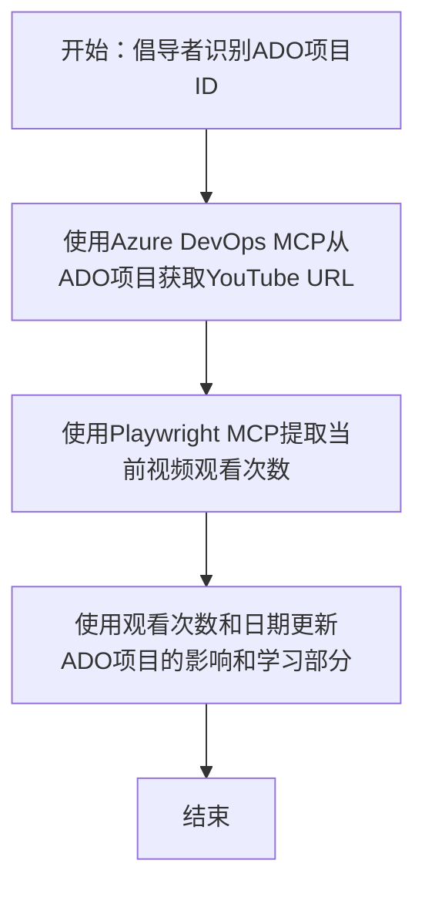

# 案例研究：使用 MCP 从 YouTube 数据更新 Azure DevOps 项目

> **免责声明：** 目前已有在线工具和报告可以自动化地将来自 YouTube 等平台的数据更新到 Azure DevOps 项目中。以下场景仅作为一个示例，用于说明如何应用 MCP 工具进行自动化和集成任务。

## 概述

本案例展示了模型上下文协议（MCP）及其工具如何自动化地将来自在线视频平台（如 YouTube）的信息更新到 Azure DevOps (ADO) 工作项的过程。所描述的场景仅是这些工具广泛能力的一个示例，可以适应许多类似的自动化需求。

在此示例中，一名倡导者使用 ADO 项目跟踪在线会话，每个工作项包含一个 YouTube 视频 URL。通过利用 MCP 工具，倡导者可以以可重复且自动化的方式保持 ADO 项目与最新的视频指标（例如观看次数）同步。此方法可以推广到需要将在线信息集成到 ADO 或其他系统的其他用例。

## 场景

一名倡导者负责跟踪在线会话和社区互动的影响力。每场会话都以 ADO 工作项的形式记录在名为“DevRel”的项目中，工作项中包含 YouTube 视频 URL 字段。为了准确报告会话的影响力，倡导者需要更新 ADO 项目，记录视频的当前观看次数及信息获取日期。

## 使用的工具

- [Azure DevOps MCP](https://github.com/microsoft/azure-devops-mcp)：通过 MCP 实现对 ADO 工作项的程序访问和更新。
- [Playwright MCP](https://github.com/microsoft/playwright-mcp)：自动化浏览器操作，从网页（如 YouTube）提取实时数据，如视频统计信息。

## 逐步工作流程

1. **确定 ADO 项目**：从“DevRel”项目中的 ADO 工作项 ID（例如 1234）开始。
2. **获取 YouTube URL**：使用 Azure DevOps MCP 工具从工作项中获取 YouTube URL。
3. **提取视频观看次数**：使用 Playwright MCP 工具导航至 YouTube URL，提取当前观看次数。
4. **更新 ADO 项目**：使用 Azure DevOps MCP 工具，将最新观看次数及获取日期写入 ADO 工作项的“Impact and Learnings”部分。

## 示例提示

```bash
- Work with the ADO Item ID: 1234
- The project is '2025-Awesome'
- Get the YouTube URL for the ADO item
- Use Playwright to get the current views from the YouTube video
- Update the ADO item with the current video views and the updated date of the information
```

## Mermaid 流程图


## 技术实现

- **MCP 编排**：工作流程由 MCP 服务器编排，协调使用 Azure DevOps MCP 和 Playwright MCP 两个工具。
- **自动化**：此过程可手动触发，也可定期调度运行，以保持 ADO 项目数据更新。
- **可扩展性**：同样的模式可扩展，用于更新 ADO 项目的其他在线指标（如点赞、评论）或来自其他平台的数据。

## 结果与影响

- **效率提升**：通过自动获取和更新视频指标，减少倡导者的手工工作量。
- **准确性**：确保 ADO 项目反映来自在线来源的最新数据。
- **可重复性**：为类似涉及其他数据源或指标的场景提供了可复用的工作流程。

## 参考资料

- [Azure DevOps MCP](https://github.com/microsoft/azure-devops-mcp)
- [Playwright MCP](https://github.com/microsoft/playwright-mcp)
- [模型上下文协议 (MCP)](https://modelcontextprotocol.io/)

## 后续内容

- 返回至：[案例研究概览](./README.md)
- 下一步：[使用 MCP 进行实时文档检索](./docs-mcp/README.md)

---

<!-- CO-OP TRANSLATOR DISCLAIMER START -->
**免责声明**：  
本文档由人工智能翻译服务 [Co-op Translator](https://github.com/Azure/co-op-translator) 翻译而成。虽然我们力求准确，但请注意，自动翻译可能包含错误或不准确之处。原文档的原始语言版本应视为权威来源。对于关键信息，建议聘请专业人工翻译。本公司不对因使用本翻译而产生的任何误解或误释承担责任。
<!-- CO-OP TRANSLATOR DISCLAIMER END -->