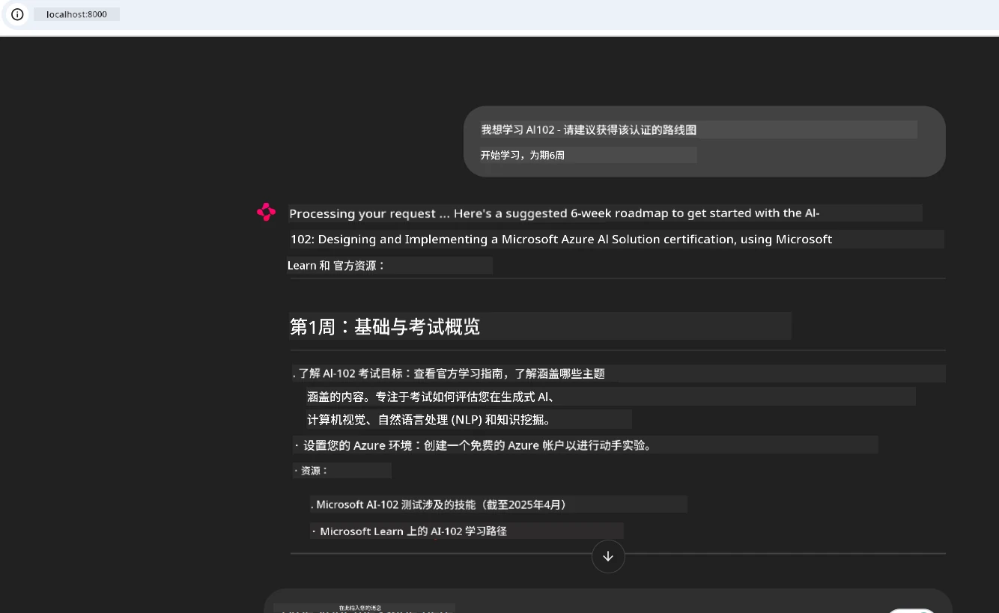
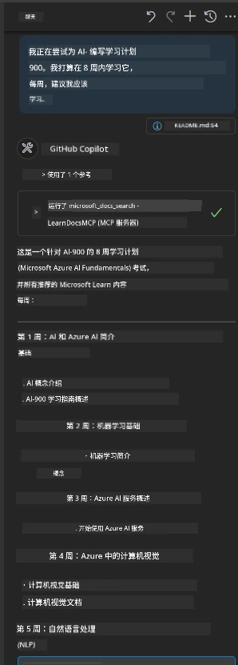

# 案例研究：从客户端连接到 Microsoft Learn Docs MCP 服务器

你是否曾经在文档网站、Stack Overflow 和无数搜索引擎标签页之间切换，试图解决代码中的一个问题？也许你专门为文档准备了第二块显示屏，或者你不断在 IDE 和浏览器之间切换。是否会更好，如果你能将文档直接集成到你的工作流程中——集成到你的应用、IDE 甚至你自己的自定义工具中？在本案例研究中，我们将探讨如何通过你的客户端应用程序直接连接到 Microsoft Learn Docs MCP 服务器来实现这一目标。

## 概述

现代开发不仅仅是编写代码——更重要的是在正确的时间找到正确的信息。文档无处不在，但它们很少在你最需要的地方：你的工具和工作流程中。通过将文档检索直接集成到你的应用程序中，你可以节省时间，减少上下文切换，提高工作效率。本节将向你展示如何连接客户端到 Microsoft Learn Docs MCP 服务器，让你在应用内实时访问上下文感知的文档。

我们将演示建立连接、发送请求以及高效处理流响应的过程。这种方法不仅简化了你的工作流程，还为构建更智能、更有帮助的开发工具打开了大门。

## 学习目标

为什么要这样做？因为最好的开发者体验是消除摩擦。想象一下，一个世界，在那里你的代码编辑器、聊天机器人或网页应用可以即时回答你的文档问题，使用来自 Microsoft Learn 的最新内容。在本章结束时，你将掌握：

- 了解 MCP 服务器与客户端之间文档通信的基础知识
- 实现一个控制台或 Web 应用连接到 Microsoft Learn Docs MCP 服务器
- 使用流式 HTTP 客户端实现实时文档检索
- 在应用中记录并解释文档响应

你将看到这些技能如何帮助你构建不仅反应灵敏，而且真正互动且具上下文感知的工具。

## 场景 1 - 使用 MCP 实时文档检索

在此场景中，我们将展示如何连接客户端到 Microsoft Learn Docs MCP 服务器，以便你在应用内实时访问上下文感知的文档。

让我们动手实践。你的任务是编写一个应用程序，连接到 Microsoft Learn Docs MCP 服务器，调用 `microsoft_docs_search` 工具，并将流式响应记录到控制台。

### 为什么选择这种方法？
因为这是构建更高级集成的基础——无论你是想驱动聊天机器人、IDE 扩展还是 Web 仪表板。

你将在本案例研究的 [`solution`](./solution/README.md) 文件夹中找到此场景的代码和说明。步骤将引导你完成连接设置：
- 使用官方 MCP SDK 和支持流的 HTTP 客户端进行连接
- 通过查询参数调用 `microsoft_docs_search` 工具来检索文档
- 实现适当的日志记录和错误处理
- 创建交互式控制台界面，允许用户输入多个搜索查询

此场景演示如何：
- 连接到 Docs MCP 服务器
- 发送查询请求
- 解析并打印结果

以下是运行解决方案的示例：

```
Prompt> What is Azure Key Vault?
Answer> Azure Key Vault is a cloud service for securely storing and accessing secrets. ...
```

下面是一个最小的示例解决方案。完整代码和细节请参见解决方案文件夹。

<details>
<summary>Python</summary>

```python
import asyncio
from mcp.client.streamable_http import streamablehttp_client
from mcp import ClientSession

async def main():
    async with streamablehttp_client("https://learn.microsoft.com/api/mcp") as (read_stream, write_stream, _):
        async with ClientSession(read_stream, write_stream) as session:
            await session.initialize()
            result = await session.call_tool("microsoft_docs_search", {"query": "Azure Functions best practices"})
            print(result.content)

if __name__ == "__main__":
    asyncio.run(main())
```

- 完整实现和日志记录，请参见 [`scenario1.py`](../../../../09-CaseStudy/docs-mcp/solution/python/scenario1.py)。
- 安装和使用说明，请参见同一文件夹中的 [`README.md`](./solution/python/README.md) 文件。
</details>


## 场景 2 - 使用 MCP 的交互式学习计划生成器 Web 应用

在此场景中，你将学习如何将 Docs MCP 集成到 Web 开发项目中。目标是使用户能够直接从 Web 界面搜索 Microsoft Learn 文档，使文档在你的应用或网站中即时可访问。

你将了解如何：
- 搭建一个 Web 应用
- 连接到 Docs MCP 服务器
- 处理用户输入并显示结果

以下是运行解决方案的示例：

```
User> I want to learn about AI102 - so suggest the roadmap to get it started from learn for 6 weeks

Assistant> Here’s a detailed 6-week roadmap to start your preparation for the AI-102: Designing and Implementing a Microsoft Azure AI Solution certification, using official Microsoft resources and focusing on exam skills areas:

---
## Week 1: Introduction & Fundamentals
- **Understand the Exam**: Review the [AI-102 exam skills outline](https://learn.microsoft.com/en-us/credentials/certifications/exams/ai-102/).
- **Set up Azure**: Sign up for a free Azure account if you don't have one.
- **Learning Path**: [Introduction to Azure AI services](https://learn.microsoft.com/en-us/training/modules/intro-to-azure-ai/)
- **Focus**: Get familiar with Azure portal, AI capabilities, and necessary tools.

....more weeks of the roadmap...

Let me know if you want module-specific recommendations or need more customized weekly tasks!
```

下面是一个最小的示例解决方案。完整代码和细节请参见解决方案文件夹。



<details>
<summary>Python (Chainlit)</summary>

Chainlit 是一个用于构建会话式 AI Web 应用的框架。它使创建能够调用 MCP 工具并实时显示结果的交互式聊天机器人和助理变得容易。非常适合快速原型设计和用户友好界面。

```python
import chainlit as cl
import requests

MCP_URL = "https://learn.microsoft.com/api/mcp"

@cl.on_message
def handle_message(message):
    query = {"question": message}
    response = requests.post(MCP_URL, json=query)
    if response.ok:
        result = response.json()
        cl.Message(content=result.get("answer", "No answer found.")).send()
    else:
        cl.Message(content="Error: " + response.text).send()
```

- 完整实现请参见 [`scenario2.py`](../../../../09-CaseStudy/docs-mcp/solution/python/scenario2.py)。
- 安装和运行说明请参见 [`README.md`](./solution/python/README.md)。
</details>


## 场景 3：在 VS Code 中使用 MCP 服务器集成编辑器内文档

如果你想直接在 VS Code 中获取 Microsoft Learn Docs（而不是切换浏览器标签页），可以在编辑器中使用 MCP 服务器。这允许你：
- 在 VS Code 中搜索和阅读文档，无需离开编码环境。
- 参考文档并直接插入链接到 README 或课程文件。
- 将 GitHub Copilot 和 MCP 结合使用，实现无缝的 AI 驱动文档工作流程。

**你将学习如何：**
- 在工作区根目录添加有效的 `.vscode/mcp.json` 文件（见下面示例）。
- 在 VS Code 中打开 MCP 面板或使用命令面板搜索并插入文档。
- 在编辑 Markdown 文件时直接引用文档。
- 将此工作流程与 GitHub Copilot 结合，提升效率。

以下是如何在 VS Code 中设置 MCP 服务器的示例：

```json
{
  "servers": {
    "LearnDocsMCP": {
      "url": "https://learn.microsoft.com/api/mcp"
    }
  }
}
```

</details>

> 有关带有截图和分步指南的详细讲解，请参阅 [`README.md`](./solution/scenario3/README.md)。



此方法非常适合构建技术课程、编写文档或在频繁需要参考的代码开发工作中使用。

## 关键要点

将文档直接集成到你的工具中不仅是一种便利——它是提升生产力的游戏规则改变者。通过从客户端连接到 Microsoft Learn Docs MCP 服务器，你可以：

- 消除代码与文档之间的上下文切换
- 实时检索最新且上下文感知的文档
- 构建更智能、更具交互性的开发工具

这些技能将帮助你创建不仅高效且令人愉悦使用的解决方案。

## 额外资源

为加深理解，请探索以下官方资源：

- [Microsoft Learn Docs MCP Server (GitHub)](https://github.com/MicrosoftDocs/mcp)
- [从零开始 Azure MCP Server (mcp-python)](https://learn.microsoft.com/en-us/azure/developer/azure-mcp-server/get-started#create-the-python-app)
- [什么是 Azure MCP Server？](https://learn.microsoft.com/en-us/azure/developer/azure-mcp-server/)
- [模型上下文协议（MCP）简介](https://modelcontextprotocol.io/introduction)
- [从 MCP 服务器添加插件（Python）](https://learn.microsoft.com/en-us/semantic-kernel/concepts/plugins/adding-mcp-plugins)

## 接下来做什么

- 返回：[案例研究总览](../README.md)
- 继续阅读：[第 10 章：使用 AI 工具包简化 AI 工作流程](../../10-StreamliningAIWorkflowsBuildingAnMCPServerWithAIToolkit/README.md)

---

<!-- CO-OP TRANSLATOR DISCLAIMER START -->
**免责声明**：  
本文件由人工智能翻译服务 [Co-op Translator](https://github.com/Azure/co-op-translator) 翻译而成。虽然我们力求准确，但请注意自动翻译可能存在错误或不准确之处。原始文件的原生语言版本应被视为权威来源。对于重要信息，建议使用专业人工翻译。我们不对因使用本翻译内容而产生的任何误解或误读承担责任。
<!-- CO-OP TRANSLATOR DISCLAIMER END -->