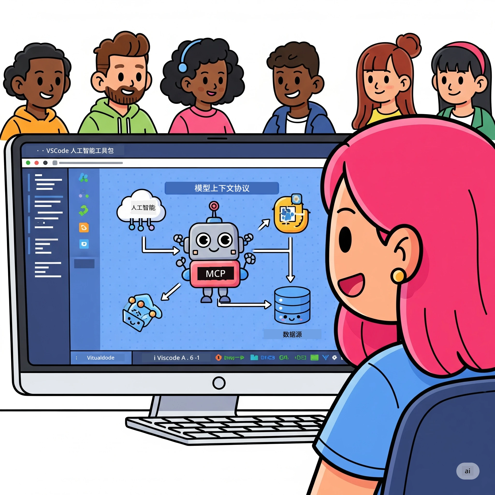
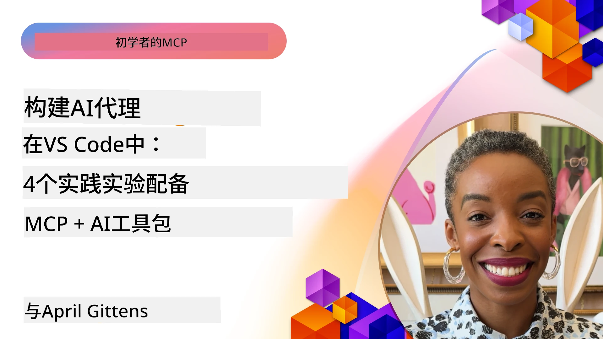

# 简化 AI 工作流程：使用 AI 工具包构建 MCP 服务器

## 🎯 概述

_(点击上方图片观看本课视频)_

欢迎参加**模型上下文协议（MCP）研讨会**！这是一场结合两项前沿技术，彻底改变 AI 应用开发的全面动手实践课程：

- **🔗 模型上下文协议（MCP）**：无缝 AI 工具集成的开放标准
- **🛠️ Visual Studio Code AI 工具包（AITK）**：微软强大的 AI 开发扩展

### 🎓 你将学到什么

完成本次研讨会后，你将掌握构建智能应用的技能，能够将 AI 模型与现实世界的工具和服务连接起来。从自动化测试到自定义 API 集成，你将获得解决复杂业务挑战的实用技能。

## 🏗️ 技术栈

### 🔌 模型上下文协议（MCP）

MCP 是 AI 领域的 **“USB-C”** — 一个连接 AI 模型与外部工具及数据源的通用标准。

**✨ 主要特点：**

- 🔄 **标准化集成**：AI 与工具连接的通用接口
- 🏛️ **灵活架构**：支持本地和远程服务器，采用 stdio/SSE 传输
- 🧰 **丰富生态**：协议中集成工具、提示和资源
- 🔒 **企业级保障**：内置安全和可靠性机制

**🎯 MCP 的重要性：**  
正如 USB-C 规范解决了线缆混乱问题，MCP 简化了 AI 集成的复杂性。一个协议，无限可能。

### 🤖 Visual Studio Code AI 工具包（AITK）

微软旗舰 AI 开发扩展，把 VS Code 变成 AI 权力中心。

**🚀 核心能力：**

- 📦 **模型目录**：访问 Azure AI、GitHub、Hugging Face、Ollama 的模型
- ⚡ **本地推理**：ONNX 优化的 CPU/GPU/NPU 执行
- 🏗️ **Agent Builder**：可视化 AI 代理开发，集成 MCP
- 🎭 **多模态支持**：文本、视觉及结构化输出支持

**💡 开发优势：**

- 零配置模型部署
- 可视化提示工程
- 实时测试场景
- 无缝 MCP 服务器集成

## 📚 学习路径

### [🚀 模块 1：AI 工具包基础](./lab1/README.md)

**时长**：15 分钟

- 🛠️ 安装并配置 VS Code 的 AI 工具包
- 🗂️ 探索模型目录（GitHub、ONNX、OpenAI、Anthropic、Google 100+ 模型）
- 🎮 掌握交互式操场，实时测试模型
- 🤖 使用 Agent Builder 构建第一个 AI 代理
- 📊 利用内置指标评估模型性能（F1、相关性、相似度、一致性）
- ⚡ 学习批量处理和多模态支持功能

**🎯 学习成果**：创建功能完整的 AI 代理，全面掌握 AITK 能力

### [🌐 模块 2：MCP 与 AI 工具包基础](./lab2/README.md)

**时长**：20 分钟

- 🧠 精通模型上下文协议（MCP）架构和概念
- 🌐 探索微软的 MCP 服务器生态系统
- 🤖 使用 Playwright MCP 服务器构建浏览器自动化代理
- 🔧 将 MCP 服务器集成至 AI 工具包 Agent Builder
- 📊 配置并测试代理中的 MCP 工具
- 🚀 导出并部署 MCP 驱动的代理以供生产使用

**🎯 学习成果**：部署结合外部工具的 MCP 超级强化 AI 代理

### [🔧 模块 3：AI 工具包高级 MCP 开发](./lab3/README.md)

**时长**：20 分钟

- 💻 使用 AI 工具包创建自定义 MCP 服务器
- 🐍 配置并使用最新 MCP Python SDK（v1.9.3）
- 🔍 设置及利用 MCP Inspector 调试工具
- 🛠️ 构建具备专业调试流程的天气 MCP 服务器
- 🧪 在 Agent Builder 和 Inspector 环境中调试 MCP 服务器

**🎯 学习成果**：使用现代工具开发调试自定义 MCP 服务器

### [🐙 模块 4：实战 MCP 开发 - 自定义 GitHub 克隆服务器](./lab4/README.md)

**时长**：30 分钟

- 🏗️ 构建真实世界的 GitHub 克隆 MCP 服务器以支持开发流程
- 🔄 实现智能仓库克隆，包括验证和错误处理
- 📁 创建智能目录管理并集成 VS Code
- 🤖 使用带有自定义 MCP 工具的 GitHub Copilot 代理模式
- 🛡️ 应用生产就绪的可靠性和跨平台兼容性

**🎯 学习成果**：部署生产级 MCP 服务器，优化实际开发流程

## 💡 现实应用与影响

### 🏢 企业用例

#### 🔄 DevOps 自动化

让你的开发流程智能化：

- **智能仓库管理**：AI 驱动的代码审查和合并决策
- **智能 CI/CD**：根据代码变更自动优化流水线
- **问题分流**：自动分类和指派缺陷

#### 🧪 质量保证革新

提升测试自动化水平：

- **智能测试生成**：自动创建全面的测试套件
- **视觉回归测试**：AI 驱动的 UI 变更检测
- **性能监测**：主动识别和解决问题

#### 📊 数据流水线智能化

构建更智能的数据处理流程：

- **自适应 ETL 流程**：自动优化数据转换
- **异常检测**：实时数据质量监控
- **智能路由**：智能管理数据流

#### 🎧 客户体验提升

打造卓越客户交互体验：

- **上下文感知支持**：AI 代理访问客户历史
- **主动问题解决**：预测式客户服务
- **多渠道集成**：跨平台统一 AI 体验

## 🛠️ 先决条件及环境搭建

### 💻 系统需求

| 组件 | 要求 | 备注 |
|-----------|-------------|-------|
| **操作系统** | Windows 10+，macOS 10.15+，Linux | 任意现代操作系统 |
| **Visual Studio Code** | 最新稳定版 | 需安装用于 AITK |
| **Node.js** | v18.0+ 及 npm | MCP 服务器开发需要 |
| **Python** | 3.10+ | Python MCP 服务器可选 |
| **内存** | 最少 8GB RAM | 本地模型建议 16GB |

### 🔧 开发环境

#### 推荐 VS Code 扩展

- **AI Toolkit** (ms-windows-ai-studio.windows-ai-studio)
- **Python** (ms-python.python)
- **Python 调试器** (ms-python.debugpy)
- **GitHub Copilot** (GitHub.copilot) - 可选但推荐

#### 可选工具

- **uv**：现代 Python 包管理器
- **MCP Inspector**：MCP 服务器可视化调试工具
- **Playwright**：网页自动化示例使用

## 🎖️ 学习成果与认证路径

### 🏆 技能掌握清单

完成本次研讨会后，你将掌握：

#### 🎯 核心能力

- [ ] **MCP 协议精通**：深刻理解架构和实现模式
- [ ] **AITK 熟练**：专家级 AI 工具包快速开发
- [ ] **自定义服务器开发**：构建、部署及维护生产 MCP 服务器
- [ ] **工具集成精通**：无缝连接 AI 与现有开发流程
- [ ] **问题解决应用**：将所学应用于实际业务挑战

#### 🔧 技术技能

- [ ] 在 VS Code 中搭建并配置 AI 工具包
- [ ] 设计并实现自定义 MCP 服务器
- [ ] 将 GitHub 模型集成到 MCP 架构中
- [ ] 使用 Playwright 构建自动化测试流程
- [ ] 部署生产环境的 AI 代理
- [ ] 调试并优化 MCP 服务器性能

#### 🚀 高级能力

- [ ] 架构企业级 AI 集成方案
- [ ] 实施 AI 应用安全最佳实践
- [ ] 设计可扩展的 MCP 服务器架构
- [ ] 创建特定领域的定制工具链
- [ ] 指导他人进行 AI 原生开发

## 📖 其他资源

- [MCP 规范 (2025-11-25)](https://spec.modelcontextprotocol.io/specification/2025-11-25/)
- [AI 工具包 GitHub 仓库](https://github.com/microsoft/vscode-ai-toolkit)
- [示例 MCP 服务器合集](https://github.com/modelcontextprotocol/servers)
- [最佳实践指南](https://modelcontextprotocol.io/docs/best-practices)
- [OWASP MCP 十大安全风险](https://microsoft.github.io/mcp-azure-security-guide/mcp/) - 安全最佳实践

---

**🚀 准备好革新你的 AI 开发流程了吗？**

让我们携手 MCP 和 AI 工具包共创智能应用的未来！

## 接下来

继续学习：[模块 11：MCP 服务器动手实验](../11-MCPServerHandsOnLabs/README.md)

---

<!-- CO-OP TRANSLATOR DISCLAIMER START -->
**免责声明**：  
本文件使用 AI 翻译服务 [Co-op Translator](https://github.com/Azure/co-op-translator) 进行翻译。尽管我们力求准确，但请注意，自动翻译可能包含错误或不准确之处。原始文档的原文应被视为权威来源。对于重要信息，建议采用专业人工翻译。因使用本翻译而产生的任何误解或误释，我们概不负责。
<!-- CO-OP TRANSLATOR DISCLAIMER END -->