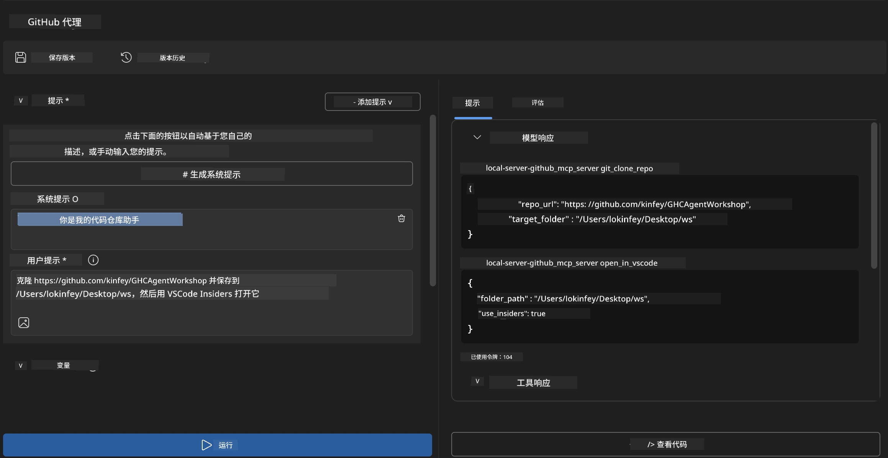
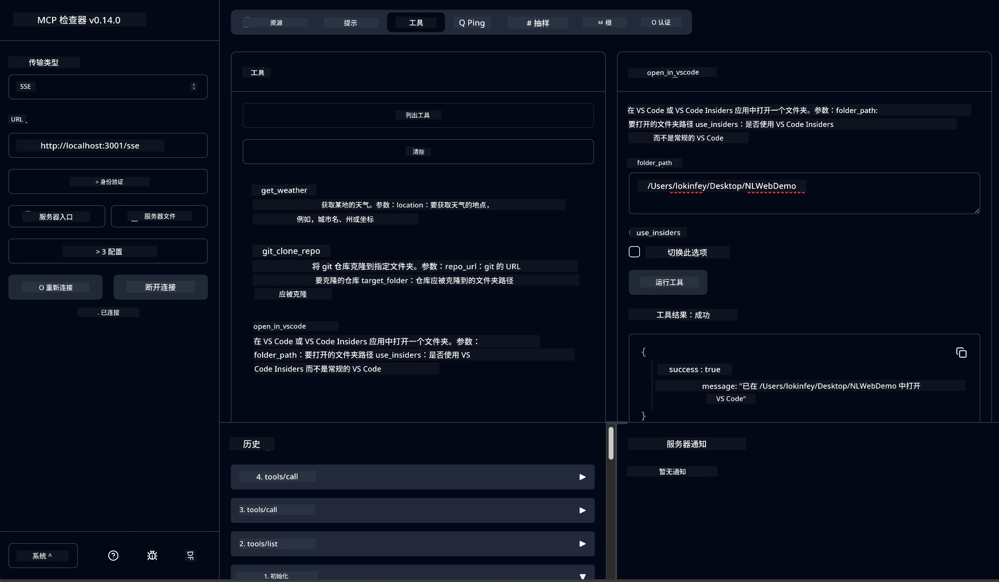

# 🐙 模块 4：实用 MCP 开发 - 自定义 GitHub 克隆服务器


> **⚡ 快速开始：** 仅需 30 分钟，构建一个面向生产的 MCP 服务器，实现自动 GitHub 仓库克隆和 VS Code 集成！

## 🎯 学习目标

完成本实验后，您将能够：

- ✅ 创建适用于现实开发流程的自定义 MCP 服务器
- ✅ 通过 MCP 实现 GitHub 仓库克隆功能
- ✅ 将自定义 MCP 服务器与 VS Code 和 Agent Builder 集成
- ✅ 使用 GitHub Copilot 代理模式配合自定义 MCP 工具
- ✅ 在生产环境中测试和部署自定义 MCP 服务器

## 📋 先决条件

- 完成实验 1-3（MCP 基础及高级开发）
- 订阅 GitHub Copilot（[可免费注册](https://github.com/github-copilot/signup)）
- 安装带 AI Toolkit 和 GitHub Copilot 扩展的 VS Code
- 安装并配置 Git CLI

## 🏗️ 项目概述

### **现实开发挑战**
作为开发者，我们经常使用 GitHub 克隆仓库，并在 VS Code 或 VS Code Insiders 中打开。这一手动流程包括：
1. 打开终端/命令提示符
2. 进入目标目录
3. 运行 `git clone` 命令
4. 在克隆目录打开 VS Code

**我们的 MCP 解决方案将这一步骤整合为一个智能命令！**

### **你将构建的内容**
一个 **GitHub 克隆 MCP 服务器**（`git_mcp_server`），提供：

| 功能 | 描述 | 优势 |
|---------|-------------|---------|
| 🔄 **智能仓库克隆** | 具备验证功能的 GitHub 仓库克隆 | 自动错误检查 |
| 📁 **智能目录管理** | 安全检测并创建目录 | 防止覆盖 |
| 🚀 **跨平台 VS Code 集成** | 在 VS Code/Insiders 中打开项目 | 流程无缝衔接 |
| 🛡️ **稳健错误处理** | 网络、权限和路径问题处理 | 生产级可靠性 |

---

## 📖 逐步实现

### 第一步：在 Agent Builder 中创建 GitHub Agent

1. 通过 AI Toolkit 扩展 **启动 Agent Builder**
2. **创建新代理**，配置如下：
   ```
   Agent Name: GitHubAgent
   ```

3. **初始化自定义 MCP 服务器：**
   - 进入 **工具（Tools）** → **添加工具（Add Tool）** → **MCP 服务器（MCP Server）**
   - 选择 **“创建新的 MCP 服务器”**
   - 选择 **Python 模板** 以获得最大灵活性
   - **服务器名称：** `git_mcp_server`

### 第二步：配置 GitHub Copilot 代理模式

1. 在 VS Code 中打开 GitHub Copilot（Ctrl/Cmd + Shift + P → “GitHub Copilot: Open”）
2. 在 Copilot 界面选择代理模型
3. 选择强化推理能力的 Claude 3.7 模型
4. 启用 MCP 集成以访问工具

> **💡 专家提示：** Claude 3.7 对开发流程和错误处理模式拥有更优理解能力。

### 第三步：实现核心 MCP 服务器功能

**请使用以下详细提示结合 GitHub Copilot 代理模式：**

```
Create two MCP tools with the following comprehensive requirements:

🔧 TOOL A: clone_repository
Requirements:
- Clone any GitHub repository to a specified local folder
- Return the absolute path of the successfully cloned project
- Implement comprehensive validation:
  ✓ Check if target directory already exists (return error if exists)
  ✓ Validate GitHub URL format (https://github.com/user/repo)
  ✓ Verify git command availability (prompt installation if missing)
  ✓ Handle network connectivity issues
  ✓ Provide clear error messages for all failure scenarios

🚀 TOOL B: open_in_vscode
Requirements:
- Open specified folder in VS Code or VS Code Insiders
- Cross-platform compatibility (Windows/Linux/macOS)
- Use direct application launch (not terminal commands)
- Auto-detect available VS Code installations
- Handle cases where VS Code is not installed
- Provide user-friendly error messages

Additional Requirements:
- Follow MCP 1.9.3 best practices
- Include proper type hints and documentation
- Implement logging for debugging purposes
- Add input validation for all parameters
- Include comprehensive error handling
```

### 第四步：测试您的 MCP 服务器

#### 4a. 在 Agent Builder 中测试

1. 启动 Agent Builder 的调试配置
2. 使用以下系统提示配置您的代理：

```
SYSTEM_PROMPT:
You are my intelligent coding repository assistant. You help developers efficiently clone GitHub repositories and set up their development environment. Always provide clear feedback about operations and handle errors gracefully.
```

3. 使用真实用户场景进行测试：

```
USER_PROMPT EXAMPLES:

Scenario : Basic Clone and Open
"Clone {Your GitHub Repo link such as https://github.com/kinfey/GHCAgentWorkshop
 } and save to {The global path you specify}, then open it with VS Code Insiders"
```



**预期结果：**
- ✅ 成功克隆并确认路径
- ✅ 自动启动 VS Code
- ✅ 对无效场景显示清晰错误信息
- ✅ 适当处理边缘情况

#### 4b. 在 MCP Inspector 中测试




---


**🎉 恭喜！** 您已成功创建一个实用的生产级 MCP 服务器，解决了真实的开发流程难题。您自定义的 GitHub 克隆服务器展示了 MCP 在自动化和提升开发者生产力方面的强大能力。

### 🏆 成就解锁：
- ✅ **MCP 开发者** - 创建了自定义 MCP 服务器
- ✅ **流程自动化专家** - 优化了开发流程  
- ✅ **集成高手** - 连接多个开发工具
- ✅ **生产准备** - 构建了可部署解决方案

---

## 🎓 研讨会总结：您的 Model Context Protocol 之旅

**亲爱的研讨会参与者，**

恭喜您完成 Model Context Protocol 研讨会的四个模块！您已经从掌握基础 AI Toolkit 概念发展到构建生产级 MCP 服务器，解决现实开发挑战。

### 🚀 您的学习路径回顾：

**[模块 1](../lab1/README.md)**：您开始探索 AI Toolkit 基础，模型测试，并创建了第一个 AI 代理。

**[模块 2](../lab2/README.md)**：您学习了 MCP 架构，集成了 Playwright MCP，并构建了首个浏览器自动化代理。

**[模块 3](../lab3/README.md)**：您进阶到自定义 MCP 服务器开发，完成天气 MCP 服务器并掌握调试工具。

**[模块 4](../lab4/README.md)**：您将所有知识应用于构建实用的 GitHub 仓库工作流自动化工具。

### 🌟 您的掌握能力：

- ✅ **AI Toolkit 生态系统**：模型、代理及集成模式
- ✅ **MCP 架构**：客户端-服务器设计、传输协议及安全性
- ✅ **开发工具**：从 Playground 到 Inspector 及生产部署
- ✅ **自定义开发**：构建、测试和部署自有 MCP 服务器
- ✅ **实用应用**：用 AI 解决实际工作流难题

### 🔮 您的下一步：

1. **构建您自己的 MCP 服务器**：运用技能自动化独特流程
2. **加入 MCP 社区**：分享您的作品，向他人学习
3. **探究高级集成**：将 MCP 服务器连接企业系统
4. **参与开源贡献**：助力改进 MCP 工具和文档

请记住，本次研讨会仅是开始。Model Context Protocol 生态系统正在快速发展，您已经准备好引领 AI 驱动的开发工具新时代。

**感谢您的参与和学习热情！**

希望本研讨会激发了您的灵感，助您在开发旅程中更好地构建和使用 AI 工具。

**祝编码愉快！**

---

## 下一步

恭喜您完成模块 10 的所有实验！

- 返回至：[模块 10 概览](../README.md)
- 继续至：[模块 11：MCP 服务器实操实验](../../11-MCPServerHandsOnLabs/README.md)

---

<!-- CO-OP TRANSLATOR DISCLAIMER START -->
**免责声明**：  
本文件已使用 AI 翻译服务 [Co-op Translator](https://github.com/Azure/co-op-translator) 进行翻译。尽管我们力求准确，但请注意自动翻译可能包含错误或不准确之处。原始文件的母语版本应被视为权威来源。对于重要信息，建议使用专业人工翻译。因使用本翻译所产生的任何误解或误释，我们概不负责。
<!-- CO-OP TRANSLATOR DISCLAIMER END -->