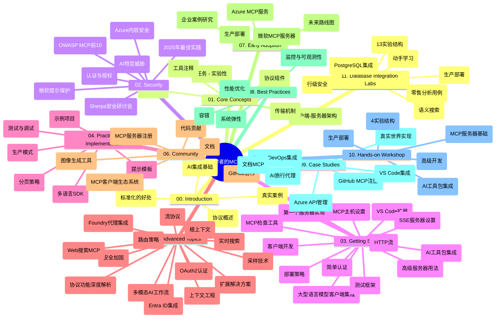

# 新手模型上下文协议（MCP）学习指南

本学习指南提供了“新手模型上下文协议（MCP）”课程的仓库结构与内容概览。请使用本指南高效浏览仓库，充分利用可用资源。

## 仓库概览

模型上下文协议（MCP）是AI模型与客户端应用之间交互的标准化框架。最初由Anthropic创建，现由更广泛的MCP社区通过官方GitHub组织维护。本仓库提供全面课程，附带C#、Java、JavaScript、Python和TypeScript的实战代码示例，面向AI开发者、系统架构师和软件工程师。

## 可视化课程地图

## 仓库结构

仓库分为十一大部分，每部分聚焦MCP的不同方面：

1. **简介 (00-Introduction/)**
   - 模型上下文协议概述
   - AI流水线中标准化的重要性
   - 实际用例与优势

2. **核心概念 (01-CoreConcepts/)**
   - 客户端-服务器架构
   - 关键协议组件
   - MCP中的消息传递模式

3. **安全 (02-Security/)**
   - MCP系统中的安全威胁
   - 安全实现最佳实践
   - 认证和授权策略
   - **全面安全文档**：
     - MCP安全最佳实践 2025
     - Azure内容安全实施指南
     - MCP安全控制与技术
     - MCP最佳实践速查
   - **关键安全议题**：
     - 提示注入和工具中毒攻击
     - 会话劫持与混淆代理问题
     - 令牌透传漏洞
     - 过度权限与访问控制
     - AI组件供应链安全
     - 微软提示防护整合

4. **入门 (03-GettingStarted/)**
   - 环境搭建与配置
   - 创建基础MCP服务器和客户端
   - 集成现有应用
   - 包含章节：
     - 第一个服务器实现
     - 客户端开发
     - 大型语言模型（LLM）客户端集成
     - VS Code集成
     - 服务器推送事件（SSE）服务器
     - 高级服务器用法
     - HTTP流式传输
     - AI工具包集成
     - 测试策略
     - 部署指南

5. **实战实现 (04-PracticalImplementation/)**
   - 不同编程语言SDK使用
   - 调试、测试与验证技巧
   - 设计可复用提示模板及工作流
   - 项目示例与实现案例

6. **高级话题 (05-AdvancedTopics/)**
   - 上下文工程技术
   - Foundry代理集成
   - 多模态AI工作流
   - OAuth2认证演示
   - 实时搜索功能
   - 实时流式传输
   - 根上下文实现
   - 路由策略
   - 采样技术
   - 扩展方案
   - 安全考虑
   - Entra ID安全集成
   - 网络搜索整合

7. **社区贡献 (06-CommunityContributions/)**
   - 代码和文档贡献方式
   - GitHub协作
   - 社区驱动的改进与反馈
   - 使用各类MCP客户端（Claude Desktop, Cline, VSCode）
   - 与流行MCP服务器（包含图像生成）合作

8. **早期采用经验 (07-LessonsfromEarlyAdoption/)**
   - 真实案例与成功故事
   - 构建与部署基于MCP的解决方案
   - 趋势与未来路线图
   - **微软MCP服务器指南**：详解10个生产就绪微软MCP服务器，包括：
     - Microsoft Learn Docs MCP服务器
     - Azure MCP服务器（15+专业连接器）
     - GitHub MCP服务器
     - Azure DevOps MCP服务器
     - MarkItDown MCP服务器
     - SQL Server MCP服务器
     - Playwright MCP服务器
     - Dev Box MCP服务器
     - Azure AI Foundry MCP服务器
     - Microsoft 365 Agents Toolkit MCP服务器

9. **最佳实践 (08-BestPractices/)**
   - 性能调优与优化
   - 设计容错MCP系统
   - 测试与弹性策略

10. **案例研究 (09-CaseStudy/)**
    - **七个全面案例研究**，展示MCP在多样场景的适用性：
    - **Azure AI旅行代理**：Azure OpenAI与AI搜索的多代理编排
    - **Azure DevOps 集成**：使用YouTube数据更新自动化工作流
    - **实时文档检索**：Python控制台客户端结合流式HTTP
    - **交互式学习计划生成器**：Chainlit网页应用与对话式AI
    - **编辑器内文档**：VS Code与GitHub Copilot工作流集成
    - **Azure API管理**：企业API集成及MCP服务器创建
    - **GitHub MCP注册表**：生态系统开发及代理集成平台
    - 实现涵盖企业集成、开发者生产力与生态系统建设

11. **动手工作坊 (10-StreamliningAIWorkflowsBuildingAnMCPServerWithAIToolkit/)**
    - 综合动手工作坊，结合MCP与AI工具包
    - 打造连接AI模型与现实工具的智能应用
    - 实用模块涵盖基础知识、自定义服务器开发与生产部署策略
    - **实验结构**：
      - 实验1：MCP服务器基础
      - 实验2：高级MCP服务器开发
      - 实验3：AI工具包集成
      - 实验4：生产部署与扩展
    - 按步骤教学的实验式学习方法

12. **MCP服务器数据库集成实验 (11-MCPServerHandsOnLabs/)**
    - **全面13个实验的学习路径**，构建生产级MCP服务器与PostgreSQL集成
    - **真实零售分析实现**，采用Zava Retail用例
    - **企业级模式**，含行级安全（RLS）、语义搜索及多租户数据访问
    - **完整实验结构**：
      - **实验00-03：基础** - 介绍、架构、安全、环境配置
      - **实验04-06：构建MCP服务器** - 数据库设计、服务器实现、工具开发
      - **实验07-09：高级功能** - 语义搜索、测试与调试、VS Code集成
      - **实验10-12：生产与最佳实践** - 部署、监控、优化
    - **涵盖技术**：FastMCP框架、PostgreSQL、Azure OpenAI、Azure容器应用、Application Insights
    - **学习成果**：生产就绪MCP服务器、数据库集成模式、AI驱动分析、企业安全

## 附加资源

仓库包含辅助资源：

- **Images文件夹**：课程中使用的图表与插图
- **翻译**：多语言支持，文档自动翻译
- **官方MCP资源**：
  - [MCP文档](https://modelcontextprotocol.io/)
  - [MCP规范](https://spec.modelcontextprotocol.io/)
  - [MCP GitHub仓库](https://github.com/modelcontextprotocol)

## 如何使用本仓库

1. **顺序学习**：依次阅读章节（00至11）以获得结构化学习体验。
2. **针对语言重点**：若感兴趣特定编程语言，可浏览相应语言的示例目录。
3. **实践实现**：从“入门”章节开始，配置环境并创建首个MCP服务器和客户端。
4. **高级拓展**：掌握基础后，深入高级话题扩展知识。
5. **社区参与**：通过GitHub讨论及Discord频道加入MCP社区，与专家及开发者交流。

## MCP客户端与工具

课程涵盖多款MCP客户端及工具：

1. **官方客户端**：
   - Visual Studio Code
   - Visual Studio Code 内的MCP
   - Claude Desktop
   - VSCode内的Claude
   - Claude API

2. **社区客户端**：
   - Cline（终端式）
   - Cursor（代码编辑器）
   - ChatMCP
   - Windsurf

3. **MCP管理工具**：
   - MCP CLI
   - MCP Manager
   - MCP Linker
   - MCP Router

## 流行MCP服务器

仓库介绍多种MCP服务器，包括：

1. **微软官方MCP服务器**：
   - Microsoft Learn Docs MCP服务器
   - Azure MCP服务器（15+专业连接器）
   - GitHub MCP服务器
   - Azure DevOps MCP服务器
   - MarkItDown MCP服务器
   - SQL Server MCP服务器
   - Playwright MCP服务器
   - Dev Box MCP服务器
   - Azure AI Foundry MCP服务器
   - Microsoft 365 Agents Toolkit MCP服务器

2. **官方参考服务器**：
   - 文件系统
   - 获取
   - 内存
   - 顺序思考

3. **图像生成**：
   - Azure OpenAI DALL-E 3
   - Stable Diffusion WebUI
   - Replicate

4. **开发工具**：
   - Git MCP
   - 终端控制
   - 代码助手

5. **专业服务器**：
   - Salesforce
   - Microsoft Teams
   - Jira与Confluence

## 贡献

欢迎社区贡献本仓库。请参阅社区贡献章节，了解如何有效参与MCP生态系统建设。

----

*本学习指南最后更新于2026年2月5日，反映了最新的MCP规范2025-11-25版本，并概述了该日期的仓库内容。此后仓库内容可能会更新。*

---

<!-- CO-OP TRANSLATOR DISCLAIMER START -->
**免责声明**：  
本文件由 AI 翻译服务 [Co-op Translator](https://github.com/Azure/co-op-translator) 翻译。虽然我们努力确保翻译的准确性，但请注意自动翻译可能存在错误或不准确之处。原始文件的母语版本应被视为权威来源。对于关键信息，建议使用专业人工翻译。因使用本翻译而导致的任何误解或曲解，我们不承担任何责任。
<!-- CO-OP TRANSLATOR DISCLAIMER END -->