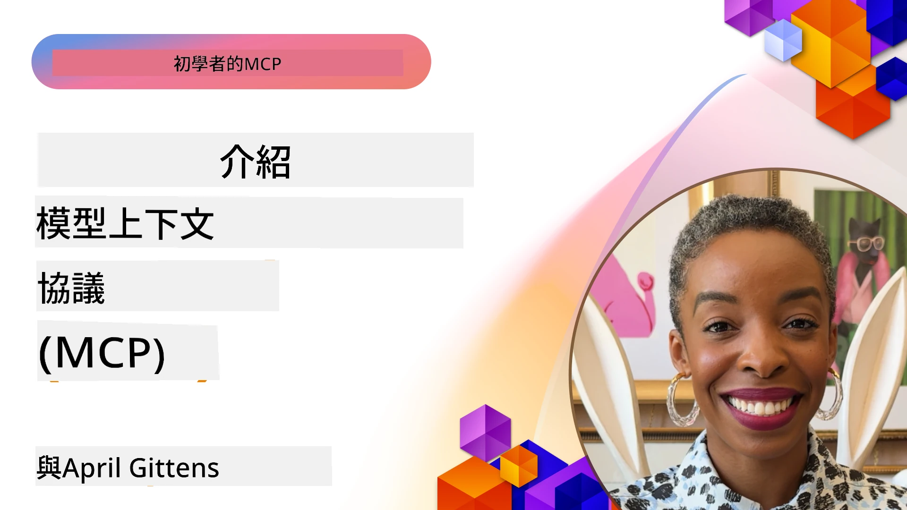
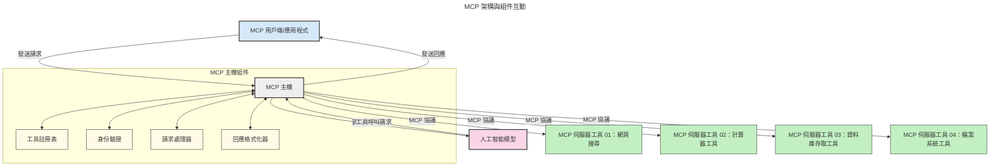

# Model Context Protocol (MCP) 簡介：為何它對可擴展的 AI 應用至關重要

[](https://youtu.be/agBbdiOPLQA)

_(點擊上圖觀看此課程影片)_

生成式 AI 應用是一大進步，因為它們常讓使用者用自然語言提示與應用互動。然而，隨著投入的時間和資源增加，你會希望能輕鬆整合功能與資源，使其易於擴展，應用能同時支援多個模型並處理各種模型細節。簡言之，建立生成式 AI 應用起步簡單，但隨著其成長變得更複雜，你需要開始定義架構，並可能需要依賴標準，確保應用以一致方式構建。這正是 MCP 的用武之地，它組織事務並提供標準。

---

## **🔍 什麼是 Model Context Protocol (MCP)?**

**Model Context Protocol (MCP)** 是一個**開放且標準化的介面**，允許大型語言模型 (LLM) 與外部工具、API 和資料來源無縫互動。它提供一致的架構，使 AI 模型功能超越訓練資料，打造更智慧、可擴展且更具回應性的 AI 系統。

---

## **🎯 為何 AI 需要標準化**

隨著生成式 AI 應用日益複雜，採用確保**可擴展性、可擴充性、可維護性**及**避免供應商綁定**的標準變得至關重要。MCP 致力解決這些需求：

- 統一模型與工具整合
- 減少脆弱且零散的客製化解決方案
- 支援多個來自不同供應商的模型共存於同一生態系統

**注意：** 雖然 MCP 自稱為開放標準，但並無計劃透過 IEEE、IETF、W3C、ISO 或其他標準組織正式標準化 MCP。

---

## **📚 學習目標**

本文結束後，你將能：

- 定義 **Model Context Protocol (MCP)** 及其用例
- 了解 MCP 如何標準化模型到工具的通訊
- 識別 MCP 架構的核心元件
- 探索 MCP 在企業和開發情境中的實際應用

---

## **💡 為何 Model Context Protocol (MCP) 是顛覆者**

### **🔗 MCP 解決 AI 互動碎片化問題**

MCP 出現之前，模型和工具整合需要：

- 每個工具與模型組合自訂程式碼
- 每個供應商 API 非標準化
- 更新頻繁導致整合破裂
- 工具數量增加後可擴展性差

### **✅ MCP 標準化的優勢**

| **優勢**                 | **說明**                                                                     |
|--------------------------|------------------------------------------------------------------------------|
| 互通性                   | LLM 可與不同供應商的工具無縫協作                                            |
| 一致性                   | 跨平台與工具保持統一行為                                                      |
| 可重用性                 | 工具只需建置一次即可跨專案和系統重複使用                                    |
| 加速開發                 | 利用標準化即插即用介面減少開發時間                                          |

---

## **🧱 MCP 高階架構概覽**

MCP 採用**客戶端-伺服器模型**，其中：

- **MCP 主機**運行 AI 模型
- **MCP 客戶端**發起請求
- **MCP 伺服器**提供上下文、工具與能力

### **關鍵元件：**

- **資源** – 靜態或動態的模型資料
- **提示** – 預定義流程以引導生成
- **工具** – 可執行功能，如搜尋、計算
- **抽樣** – 透過遞迴互動實現代理行為
- **引導** – 伺服器發起向使用者的請求
- **根目錄** – 檔案系統邊界控制伺服器存取權限

### **協議架構：**

MCP 使用兩層架構：
- **資料層**：基於 JSON-RPC 2.0，支援生命週期管理與基本功能
- **傳輸層**：本地 STDIO 與遠端可串流 HTTP（含 SSE）通訊管道

---

## MCP 伺服器如何運作

MCP 伺服器的工作流程：

- **請求流程**：
    1. 由終端使用者或代表其操作的軟體發起請求。
    2. **MCP 客戶端** 將請求送至管理 AI 模型執行時環境的 **MCP 主機**。
    3. **AI 模型** 收到使用者提示後，可能會透過一個或多個工具呼叫請求外部工具或資料存取。
    4. **MCP 主機**（非模型本身）使用標準化協議與相應的 **MCP 伺服器** 溝通。
- **MCP 主機功能**：
    - **工具登錄**：維護可用工具與其功能目錄。
    - **認證**：驗證工具存取權限。
    - **請求處理器**：處理模型的工具請求。
    - **回應格式化**：將工具輸出結構化為模型可理解的格式。
- **MCP 伺服器執行**：
    - **MCP 主機** 將工具呼叫路由至一或多個具專門功能（例如搜尋、計算、資料庫查詢）的 **MCP 伺服器**。
    - **MCP 伺服器** 執行對應操作並回傳結果給 **MCP 主機**，格式一致。
    - **MCP 主機** 格式化並轉送結果給 **AI 模型**。
- **回應完成**：
    - **AI 模型** 將工具輸出納入最終回應。
    - **MCP 主機** 將此回應送回 **MCP 客戶端**，由其傳遞給終端使用者或呼叫軟體。
    


## 👨‍💻 如何建立 MCP 伺服器（含範例）

MCP 伺服器使你能透過提供資料和功能來擴展 LLM 能力。

準備試試看嗎？以下是語言和/或技術棧專用 SDK，包含創建簡單 MCP 伺服器的範例：

- **Python SDK**：https://github.com/modelcontextprotocol/python-sdk

- **TypeScript SDK**：https://github.com/modelcontextprotocol/typescript-sdk

- **Java SDK**：https://github.com/modelcontextprotocol/java-sdk

- **C#/.NET SDK**：https://github.com/modelcontextprotocol/csharp-sdk


## 🌍 MCP 的實際應用範例

MCP 通過擴展 AI 能力啟動多種應用：

| **應用**                    | **說明**                                                                  |
|------------------------------|--------------------------------------------------------------------------|
| 企業資料整合                | 連結 LLM 與資料庫、CRM 或內部工具                                        |
| 代理 AI 系統                | 使代理可存取工具並進行決策流程                                          |
| 多模態應用                  | 結合文字、影像、音訊工具於單一統一 AI 應用                              |
| 即時資料整合                | 將即時資料引入 AI 互動，提供更準確、最新結果                            |


### 🧠 MCP = AI 互動的通用標準

Model Context Protocol (MCP) 如同 USB-C 統一了裝置的物理連接。AI 領域中，MCP 提供一致介面，使模型（客戶端）能與外部工具和資料提供者（伺服器）無縫整合。這消除了每個 API 或資料來源需不同客製協議的問題。

依 MCP 標準，MCP 兼容工具（即 MCP 伺服器）遵循統一標準，列出所提供的工具或操作，並在 AI 代理請求時執行這些操作。支持 MCP 的 AI 代理平台可發現伺服器提供的工具，並透過標準協議調用它們。

### 💡 促進知識存取

除提供工具外，MCP 還促進知識存取。它使應用能透過連接多個資料來源，為大型語言模型 (LLM) 提供上下文。例如，某 MCP 伺服器可能代表公司文件庫，使代理能隨需取回相關資訊。另一伺服器可處理特定行動如發送郵件或更新紀錄。從代理角度看，這些只是可用工具，有些回傳資料（知識上下文），另一些執行操作。MCP 有效管理兩者。

代理與 MCP 伺服器連接後，會透過標準格式自動學習伺服器的可用功能和資料。此標準化支持動態工具可用性。舉例來說，向代理系統加入新 MCP 伺服器，即可立刻使用其功能，無需對代理指令進行額外定制。

這種簡化整合符合以下示意圖所示流程，伺服器同時提供工具與知識，確保系統間流暢協作。

### 👉 範例：可擴展的代理解決方案

```mermaid
---
title: 可擴展代理方案與MCP
description: 一個圖示說明使用者如何與連接多個MCP伺服器的LLM互動，每個伺服器都提供知識和工具，創建可擴展的人工智能系統架構
---
graph TD
    User -->|提示| LLM
    LLM -->|回應| User
    LLM -->|MCP| ServerA
    LLM -->|MCP| ServerB
    ServerA -->|通用連接器| ServerB
    ServerA --> KnowledgeA
    ServerA --> ToolsA
    ServerB --> KnowledgeB
    ServerB --> ToolsB

    subgraph Server A
        KnowledgeA[知識]
        ToolsA[工具]
    end

    subgraph Server B
        KnowledgeB[知識]
        ToolsB[工具]
    end
```通用連接器允許 MCP 伺服器間彼此通訊並共享能力，使得伺服器A 能將任務委派給伺服器B 或存取其工具與知識。此工具和資料跨伺服器聯合，支援可擴展及模組化代理架構。由於 MCP 標準化工具展現，代理可動態發現並路由伺服器間請求，無須硬編碼整合。

工具和知識聯合：工具和資料能跨伺服器存取，使代理架構更具規模性和模組化。

### 🔄 進階 MCP 情境：客戶端 LLM 整合

除了基礎 MCP 架構外，還有進階情境，雙方（客戶端和伺服器）皆包含 LLM，實現更複雜互動。以下示意圖中，**客戶端應用程式**可能是 IDE，提供多個 MCP 工具供 LLM 使用：

```mermaid
---
title: 客戶端-伺服器LLM整合的進階MCP場景
description: 一個描述用戶、客戶端應用程式、客戶端LLM、多個MCP伺服器及伺服器LLM之間詳細互動流程的序列圖，展示工具發現、用戶互動、直接工具調用及功能協商階段
---
sequenceDiagram
    autonumber
    actor User as 👤 用戶
    participant ClientApp as 🖥️ 客戶端應用程式
    participant ClientLLM as 🧠 客戶端LLM
    participant Server1 as 🔧 MCP伺服器1
    participant Server2 as 📚 MCP伺服器2
    participant ServerLLM as 🤖 伺服器LLM
    
    %% Discovery Phase
    rect rgb(220, 240, 255)
        Note over ClientApp, Server2: 工具發現階段
        ClientApp->>+Server1: 請求可用工具/資源
        Server1-->>-ClientApp: 返回工具清單（JSON）
        ClientApp->>+Server2: 請求可用工具/資源
        Server2-->>-ClientApp: 返回工具清單（JSON）
        Note right of ClientApp: 本地儲存合併後的<br/>工具目錄
    end
    
    %% User Interaction
    rect rgb(255, 240, 220)
        Note over User, ClientLLM: 用戶互動階段
        User->>+ClientApp: 輸入自然語言提示
        ClientApp->>+ClientLLM: 轉發提示 + 工具目錄
        ClientLLM->>-ClientLLM: 分析提示並選擇工具
    end
    
    %% Scenario A: Direct Tool Calling
    alt Direct Tool Calling
        rect rgb(220, 255, 220)
            Note over ClientApp, Server1: 場景A：直接工具調用
            ClientLLM->>+ClientApp: 請求執行工具
            ClientApp->>+Server1: 執行指定工具
            Server1-->>-ClientApp: 返回結果
            ClientApp->>+ClientLLM: 處理結果
            ClientLLM-->>-ClientApp: 生成回應
            ClientApp-->>-User: 顯示最終答案
        end
    
    %% Scenario B: Feature Negotiation (VS Code style)
    else Feature Negotiation (VS Code style)
        rect rgb(255, 220, 220)
            Note over ClientApp, ServerLLM: 場景B：功能協商
            ClientLLM->>+ClientApp: 確認所需功能
            ClientApp->>+Server2: 協商功能/能力
            Server2->>+ServerLLM: 請求額外上下文
            ServerLLM-->>-Server2: 提供上下文
            Server2-->>-ClientApp: 返回可用功能
            ClientApp->>+Server2: 調用協商後工具
            Server2-->>-ClientApp: 返回結果
            ClientApp->>+ClientLLM: 處理結果
            ClientLLM-->>-ClientApp: 生成回應
            ClientApp-->>-User: 顯示最終答案
        end
    end
```
## 🔐 MCP 的實際效益

使用 MCP 的實際效益包括：

- **資訊新鮮度**：模型可存取其訓練資料之外的最新資訊
- **能力延展**：模型可利用未受訓練任務的專門工具
- **幻覺減少**：外部資料來源提供事實依據
- **隱私保護**：敏感資料保留於安全環境，非直接內嵌於提示中

## 📌 主要結論

關於 MCP 的主要結論：

- **MCP** 標準化 AI 模型與工具及資料之間的互動方式
- 促進**可擴展性、一致性與互通性**
- MCP 有助於**減少開發時間、提高可靠度及擴展模型功能**
- 客戶端-伺服器架構**支持彈性且可擴充的 AI 應用**

## 🧠 練習

想想你有興趣開發的 AI 應用。

- 哪些**外部工具或資料**能增強其功能？
- MCP 如何讓整合變得**更簡單且更可靠**？

## 其他資源

- [MCP GitHub 倉庫](https://github.com/modelcontextprotocol)


## 接下來

下一章：[Chapter 1: Core Concepts](../01-CoreConcepts/README.md)

---

<!-- CO-OP TRANSLATOR DISCLAIMER START -->
**免責聲明**：  
本文件由 AI 翻譯服務 [Co-op Translator](https://github.com/Azure/co-op-translator) 進行翻譯。雖然我們致力於提供準確的翻譯，但請注意自動翻譯可能包含錯誤或不準確之處。原始文件之原文版本應視為權威來源。對於關鍵資訊，建議採用專業人工翻譯。因使用本翻譯而引起的任何誤解或誤譯，我們概不負責。
<!-- CO-OP TRANSLATOR DISCLAIMER END -->