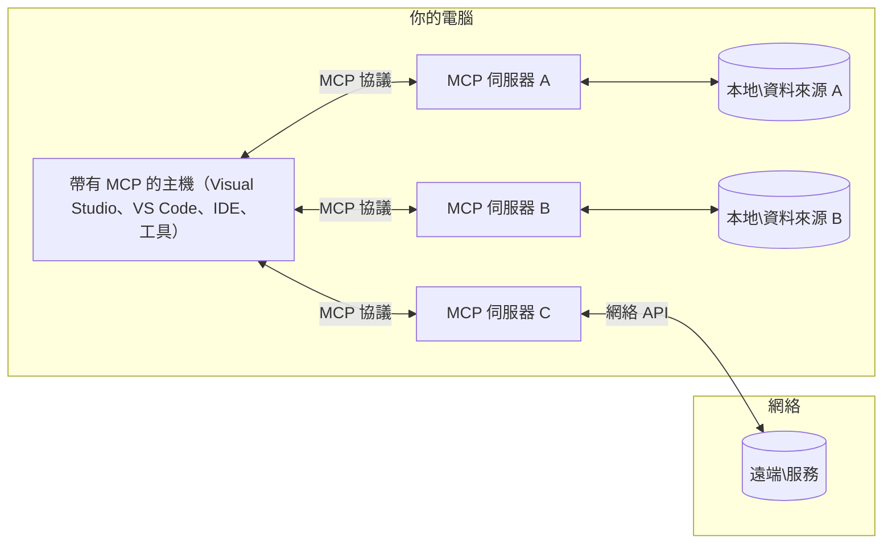

# MCP 核心概念：掌握模型上下文協議以實現 AI 整合

[](https://youtu.be/earDzWGtE84)

_(點擊上方圖片觀看本課程影片)_

[模型上下文協議（Model Context Protocol, MCP）](https://github.com/modelcontextprotocol) 是一個強大且標準化的框架，優化大型語言模型（LLM）與外部工具、應用程式以及資料來源之間的溝通。本指南將引導您了解 MCP 的核心概念。您將學習其客戶端-伺服器架構、重要組件、通信機制以及實作最佳實踐。

- **明確用戶同意**：所有資料存取與操作皆需在執行前取得用戶明確同意。用戶必須清楚了解將存取哪些資料以及會執行哪些行動，並且可對權限與授權進行細緻控制。

- **資料隱私保護**：用戶資料僅在明確同意下揭露，且必須透過強固的存取控制，在整個互動生命週期中維護資料安全。實作必須防止未授權資料傳輸並維護嚴格隱私界線。

- **工具執行安全**：每次工具調用皆需用戶明確同意，且必須讓用戶清楚理解工具功能、參數及潛在影響。堅固的安全界線必須避免非預期、不安全或惡意的工具執行。

- **傳輸層安全性**：所有通訊管道應使用適當的加密與驗證機制。遠端連線需實作安全傳輸協議與妥善的憑證管理。

#### 實作指南：

- **權限管理**：實作細緻的權限系統，允許用戶控制可存取的伺服器、工具和資源
- **身份驗證與授權**：使用安全的身份驗證方式（OAuth、API 金鑰），並進行適當的憑證管理與過期控制
- **輸入驗證**：根據定義的結構化規範驗證所有參數與資料輸入，防止注入攻擊
- **稽核日誌**：維護全面的操作紀錄，以利安全監控與符合規範要求

## 概覽

本課程探討構成模型上下文協議（MCP）體系的基本架構與組件。您將學習 MCP 互動所依賴的客戶端-伺服器架構、關鍵組件與通訊機制。

## 主要學習目標

本課結束後，您將能：

- 理解 MCP 的客戶端-伺服器架構。
- 辨識 Hosts、Clients 與 Servers 的角色與責任。
- 分析使 MCP 成為彈性整合層的核心特徵。
- 瞭解 MCP 生態系中資訊流動方式。
- 透過 .NET、Java、Python 與 JavaScript 範例獲得實務見解。

## MCP 架構：深入解析

MCP 生態系基於客戶端-伺服器模型構建。此模組化結構允許 AI 應用程式與工具、資料庫、API 以及上下文資源有效互動。讓我們將此架構拆解為核心組成部分。

MCP 核心採用客戶端-伺服器架構，其中主機應用程式可連接多個伺服器：


- **MCP 主機（Hosts）**：如 VSCode、Claude Desktop、IDE 或欲透過 MCP 存取資料的 AI 工具
- **MCP 客戶端（Clients）**：維護與伺服器一對一連線的協議客戶端
- **MCP 伺服器（Servers）**：輕量程式，各自透過標準化的模型上下文協議公開特定能力
- **本地資料來源**：使用者電腦的檔案、資料庫及 MCP 伺服器可安全存取的服務
- **遠端服務**：可透過 API 連接的互聯網外部系統

MCP 協議是一項持續演進的標準，採用日期形式版本（YYYY-MM-DD）。目前協議版本為 **2025-11-25**。您可查看最新的[協議規範](https://modelcontextprotocol.io/specification/2025-11-25/)

### 1. 主機（Hosts）

在模型上下文協議（MCP）中，**主機**是作為用戶與協議互動的主要介面的 AI 應用程式。主機會協調和管理與多個 MCP 伺服器的連線，為每個伺服器連線建立專用的 MCP 客戶端。主機例子包括：

- **AI 應用程式**：Claude Desktop、Visual Studio Code、Claude Code
- **開發環境**：整合 MCP 的 IDE 與程式碼編輯器
- **自訂應用程式**：專門建置的 AI 代理與工具

**主機**負責協調 AI 模型互動。它們：

- **協調 AI 模型**：執行或互動大型語言模型以產生回應並協調 AI 工作流程
- **管理客戶端連線**：為每個 MCP 伺服器連線建立並維護一個 MCP 客戶端
- **控制使用者介面**：處理對話流程、使用者互動及回應呈現
- **執行安全控管**：控制權限、安全限制與身份驗證
- **處理用戶同意**：管理用戶對資料分享與工具執行的批准

### 2. 客戶端（Clients）

**客戶端**是負責維持主機與 MCP 伺服器間一對一專用連線的重要組件。主機會針對每個 MCP 伺服器實例化 MCP 客戶端，確保通訊路徑有條理且安全。多個客戶端允許主機同時連接多個伺服器。

**客戶端**是主機應用內的連接器。它們：

- **協議通訊**：使用 JSON-RPC 2.0 向伺服器發送提示與指令
- **能力協商**：在初始化時與伺服器協商支援的功能與協議版本
- **工具執行管理**：處理模型的工具執行請求並回應結果
- **即時更新**：處理來自伺服器的通知與即時更新
- **回應處理**：處理並格式化伺服器回應以展示給用戶

### 3. 伺服器（Servers）

**伺服器**是提供上下文、工具與能力給 MCP 客戶端的程式。它們可以在本機（與主機相同機器）或遠端（外部平台）執行，負責處理客戶端請求並提供結構化回應。伺服器透過標準化的模型上下文協議公開特定功能。

**伺服器**是提供上下文和能力的服務。它們：

- **功能註冊**：註冊並向客戶端公開可用原語（資源、提示、工具）
- **請求處理**：接收並執行來自客戶端的工具調用、資源請求與提示請求
- **上下文提供**：提供上下文資訊與資料以增強模型回應
- **狀態管理**：維護會話狀態並處理有狀態交互
- **即時通知**：向連線客戶端發送能力變更與更新通知

任何人皆可開發伺服器以擴展模型能力，提供專門功能，且支援本地與遠端部署場景。

### 4. 伺服器原語（Server Primitives）

模型上下文協議中的伺服器提供三種核心**原語**，定義客戶端、主機與語言模型間豐富交互的基本元素。這些原語指定協議中可用的上下文資訊與動作類型。

MCP 伺服器可公開以下三種核心原語的任意組合：

#### 資源（Resources）

**資源**是為 AI 應用提供上下文資訊的資料來源。它們代表靜態或動態內容，可增進模型理解與決策：

- **上下文資料**：結構化資訊與上下文供 AI 模型使用
- **知識庫**：文件庫、文章、手冊與研究論文
- **本地資料來源**：檔案、資料庫和本地系統資訊
- **外部資料**：API 回應、網路服務與遠端系統資料
- **動態內容**：根據外部條件即時更新的資料

資源由 URI 識別，支援透過 `resources/list` 發現及 `resources/read` 取用：

```text
file://documents/project-spec.md
database://production/users/schema
api://weather/current
```

#### 提示（Prompts）

**提示**是可重用的模板，幫助結構化與語言模型的互動。它們提供標準化的互動模式與模板化工作流程：

- **模板互動**：預結構化訊息與對話起始語句
- **工作流程模板**：常見任務與互動的標準化序列
- **少量範例**：基於範例的模型指導模板
- **系統提示**：定義模型行為與上下文的基礎提示
- **動態模板**：可參數化並適應特定上下文的提示

提示支援變數替換，可透過 `prompts/list` 發現，並用 `prompts/get` 取得：

```markdown
Generate a {{task_type}} for {{product}} targeting {{audience}} with the following requirements: {{requirements}}
```

#### 工具（Tools）

**工具**是可執行函數，讓 AI 模型得以呼叫以執行特定動作。它們是 MCP 生態系中的「動詞」，使模型能與外部系統互動：

- **可執行函數**：模型可使用特定參數調用的獨立操作
- **外部系統整合**：API 呼叫、資料庫查詢、檔案操作、計算
- **唯一身份**：每個工具有獨特名稱、描述與參數結構
- **結構化輸入輸出**：工具接受驗證後參數並回傳結構化類型回應
- **動作能力**：使模型能執行實際行動並檢索即時資料

工具以 JSON Schema 定義參數驗證，並透過 `tools/list` 發現，使用 `tools/call` 執行。工具亦可含有**圖示**作為額外的 UI 顯示資料。

**工具標註**：工具支持行為標註（如 `readOnlyHint`、`destructiveHint`），描述工具是否僅讀或具破壞性，協助客戶端對工具執行做出明智判斷。

工具定義範例：

```typescript
server.tool(
  "search_products", 
  {
    query: z.string().describe("Search query for products"),
    category: z.string().optional().describe("Product category filter"),
    max_results: z.number().default(10).describe("Maximum results to return")
  }, 
  async (params) => {
    // 執行搜尋並返回結構化結果
    return await productService.search(params);
  }
);
```

## 客戶端原語（Client Primitives）

在模型上下文協議（MCP）中，**客戶端**可公開原語，讓伺服器向主機應用請求額外能力。這些客戶端端原語支持更豐富、互動性更強的伺服器擴展，能存取 AI 模型能力和使用者互動。

### 取樣（Sampling）

**取樣**允許伺服器向客戶端的 AI 應用程式請求語言模型補全。此原語讓伺服器在不內嵌自身模型依賴的情況下，使用 LLM 能力：

- **獨立模型存取**：伺服器可請求補全而無需包含 LLM SDK 或自行管理模型存取
- **伺服器主導 AI**：允許伺服器自主使用客戶端模型生成內容
- **遞迴型 LLM 互動**：支持伺服器在複雜場景中尋求 AI 協助處理
- **動態內容生成**：允許伺服器利用主機模型製作上下文響應
- **工具呼叫支援**：伺服器可包含 `tools` 與 `toolChoice` 參數，使客戶端模型在取樣過程中呼叫工具

取樣透過 `sampling/complete` 方法啟動，伺服器向客戶端發送補全請求。

### 根目錄（Roots）

**根目錄**為客戶端向伺服器公開檔案系統邊界的標準方式，幫助伺服器理解可存取的目錄與檔案：

- **檔案系統邊界**：定義伺服器可在檔案系統中操作的範圍
- **存取控制**：幫助伺服器理解其可存取的目錄與檔案
- **動態更新**：當根目錄列表變更時，客戶端可通知伺服器
- **URI 識別**：根目錄使用 `file://` URI 表示可存取的目錄與檔案

根目錄透過 `roots/list` 進行發現，當根目錄變更由客戶端發送 `notifications/roots/list_changed` 通知。

### 資訊收集（Elicitation）

**資訊收集**允許伺服器透過客戶端介面請求用戶提供更多資訊或確認：

- **用戶輸入請求**：當工具執行需要額外資訊時，伺服器可進行請求
- **確認對話框**：對敏感或影響重大的操作請求用戶批准
- **互動工作流**：使伺服器能建立逐步用戶互動流程
- **動態參數收集**：在工具執行時收集缺失或選用參數

資訊收集請求透過 `elicitation/request` 方法發出，通過客戶端介面收集用戶輸入。

**URL 模式資訊收集**：伺服器亦可要求基於 URL 的用戶互動，指引用戶前往外部網頁進行驗證、確認或資料填寫。

### 日誌（Logging）

**日誌**允許伺服器向客戶端發送結構化日誌訊息，用於除錯、監控及運作透明：

- **除錯支援**：幫助伺服器提供詳細執行日誌以利故障排除
- **運作監控**：向客戶端發送狀態更新與效能指標
- **錯誤通報**：提供詳細錯誤上下文與診斷資訊
- **稽核軌跡**：建立伺服器操作與決策的完整記錄

日誌訊息傳遞給客戶端，增進伺服器操作透明度並便於除錯。

## MCP 中的資訊流

模型上下文協議（MCP）定義主機、客戶端、伺服器與模型之間的結構化資訊流。了解該流程有助於釐清用戶請求如何被處理，以及外部工具與資料如何整合入模型回應。

- **主機發起連線**  
  主機應用（例如 IDE 或聊天介面）與 MCP 伺服器建立連線，通常透過 STDIO、WebSocket 或其他支援的傳輸方式。

- **能力協商**  
  內嵌於主機的客戶端與伺服器交換其支援的功能、工具、資源及協議版本資訊。確保雙方明白本次會話可用能力。

- **用戶請求**  
  用戶透過主機互動（例如輸入提示或指令）。主機收集輸入並傳送至客戶端處理。

- **資源或工具使用**  
  - 客戶端可能向伺服器請求額外上下文或資源（如檔案、資料庫條目或知識庫文章），以豐富模型理解。
  - 若模型判斷需使用工具（如擷取資料、計算或呼叫 API），客戶端發出工具調用請求到伺服器，指定工具名稱與參數。

- **伺服器執行**  

伺服器接收資源或工具請求，執行必要的操作（例如執行函式、查詢資料庫或擷取檔案），並以結構化格式將結果回傳給客戶端。

- **回應產生**  
  客戶端將伺服器的回應（資源資料、工具輸出等）整合進持續的模型互動中。模型利用此資訊生成全面且具上下文關聯性的回應。

- **結果呈現**  
  主機接收來自客戶端的最終輸出並呈現給使用者，通常包含模型生成的文字以及任何工具執行或資源查詢的結果。

此流程使 MCP 能透過無縫連接模型與外部工具及資料來源，支援先進、互動及具上下文感知的 AI 應用。

## 協議架構與層級

MCP 由兩個不同的架構層級組成，協同工作以提供完整的通訊框架：

### 資料層

**資料層** 使用 **JSON-RPC 2.0** 作為基礎實作 MCP 協議核心。此層定義訊息結構、語意與互動模式：

#### 核心組件：

- **JSON-RPC 2.0 協議**：所有通訊皆採用標準化的 JSON-RPC 2.0 訊息格式，用於方法呼叫、回應及通知
- **生命週期管理**：處理客戶端與伺服器間的連線初始化、功能協商及會話終止
- **伺服器原語**：讓伺服器透過工具、資源與提示提供核心功能
- **客戶端原語**：讓伺服器要求從大型語言模型抽樣、引導使用者輸入及傳送日誌訊息
- **即時通知**：支援非同步通知以動態更新，無需輪詢

#### 主要特點：

- **協議版本協商**：以日期為基準的版本控制（YYYY-MM-DD）確保相容性
- **功能發現**：客戶端與伺服器在初始化階段交換支援功能資訊
- **有狀態會話**：跨多次互動維持連線狀態以保持上下文連續性

### 傳輸層

**傳輸層** 負責 MCP 參與者間的通訊通道、訊息封包與認證管理：

#### 支援的傳輸機制：

1. **STDIO 傳輸**：
   - 使用標準輸入／輸出串流直接進程通訊
   - 最適合於同一台機器上的本地進程，無網路開銷
   - 常用於本地 MCP 伺服器實作

2. **可串流 HTTP 傳輸**：
   - 使用 HTTP POST 傳送客戶端至伺服器訊息  
   - 選用 Server-Sent Events (SSE) 進行伺服器到客戶端串流
   - 支援跨網路遠端伺服器通訊
   - 支援標準 HTTP 認證（Bearer Token、API Key、自訂標頭）
   - MCP 建議使用 OAuth 進行安全的基於 Token 認證

#### 傳輸抽象：

傳輸層抽象通訊細節，讓資料層能使用相同的 JSON-RPC 2.0 訊息格式跨所有傳輸機制。此抽象允許應用在本地及遠端伺服器間無縫切換。

### 安全考量

MCP 實作必須遵守多項關鍵安全原則，以確保所有協議操作中的安全、可信賴及保護：

- **使用者同意與控制權**：使用者必須明確同意後，資料才能被存取或操作才可執行。使用者應有清楚控制權，可決定共享哪些資料及授權哪些行動，並透過直覺的使用者介面檢視與批准操作。
  
- **資料隱私**：使用者資料僅在明確同意下公開，需受到適當存取控制保護。MCP 實作必須防止未授權資料傳輸，確保所有互動皆維護隱私。

- **工具安全**：在調用任一工具前必須獲得使用者的明確同意。使用者應了解各工具的功能，並嚴格執行安全隔離，以防止非預期或不安全的工具執行。

遵循這些安全原則，MCP 確保使用者信任、隱私與安全在所有協議互動中被維護，同時支援強大的 AI 整合。

## 程式碼範例：關鍵組件

以下為多種流行程式語言的示範程式碼，展示如何實作 MCP 伺服器及工具的關鍵組件。

### .NET 範例：建立簡單的 MCP 伺服器與工具

這是一個實務 .NET 範例，示範如何實作一個簡單 MCP 伺服器搭配自訂工具。此範例展示如何定義及註冊工具、處理請求，並使用 Model Context Protocol 連接伺服器。

```csharp
using System;
using System.Threading.Tasks;
using ModelContextProtocol.Server;
using ModelContextProtocol.Server.Transport;
using ModelContextProtocol.Server.Tools;

public class WeatherServer
{
    public static async Task Main(string[] args)
    {
        // Create an MCP server
        var server = new McpServer(
            name: "Weather MCP Server",
            version: "1.0.0"
        );
        
        // Register our custom weather tool
        server.AddTool<string, WeatherData>("weatherTool", 
            description: "Gets current weather for a location",
            execute: async (location) => {
                // Call weather API (simplified)
                var weatherData = await GetWeatherDataAsync(location);
                return weatherData;
            });
        
        // Connect the server using stdio transport
        var transport = new StdioServerTransport();
        await server.ConnectAsync(transport);
        
        Console.WriteLine("Weather MCP Server started");
        
        // Keep the server running until process is terminated
        await Task.Delay(-1);
    }
    
    private static async Task<WeatherData> GetWeatherDataAsync(string location)
    {
        // This would normally call a weather API
        // Simplified for demonstration
        await Task.Delay(100); // Simulate API call
        return new WeatherData { 
            Temperature = 72.5,
            Conditions = "Sunny",
            Location = location
        };
    }
}

public class WeatherData
{
    public double Temperature { get; set; }
    public string Conditions { get; set; }
    public string Location { get; set; }
}
```


### Java 範例：MCP 伺服器組件

此範例示範與上述 .NET 範例相同的 MCP 伺服器與工具註冊，但以 Java 實作。

```java
import io.modelcontextprotocol.server.McpServer;
import io.modelcontextprotocol.server.McpToolDefinition;
import io.modelcontextprotocol.server.transport.StdioServerTransport;
import io.modelcontextprotocol.server.tool.ToolExecutionContext;
import io.modelcontextprotocol.server.tool.ToolResponse;

public class WeatherMcpServer {
    public static void main(String[] args) throws Exception {
        // 建立 MCP 伺服器
        McpServer server = McpServer.builder()
            .name("Weather MCP Server")
            .version("1.0.0")
            .build();
            
        // 註冊一個天氣工具
        server.registerTool(McpToolDefinition.builder("weatherTool")
            .description("Gets current weather for a location")
            .parameter("location", String.class)
            .execute((ToolExecutionContext ctx) -> {
                String location = ctx.getParameter("location", String.class);
                
                // 獲取天氣數據（簡化版）
                WeatherData data = getWeatherData(location);
                
                // 回傳格式化的回應
                return ToolResponse.content(
                    String.format("Temperature: %.1f°F, Conditions: %s, Location: %s", 
                    data.getTemperature(), 
                    data.getConditions(), 
                    data.getLocation())
                );
            })
            .build());
        
        // 使用 stdio 傳輸連接伺服器
        try (StdioServerTransport transport = new StdioServerTransport()) {
            server.connect(transport);
            System.out.println("Weather MCP Server started");
            // 伺服器維持運行直至程序終止
            Thread.currentThread().join();
        }
    }
    
    private static WeatherData getWeatherData(String location) {
        // 實作會調用天氣 API
        // 為示例目的而簡化
        return new WeatherData(72.5, "Sunny", location);
    }
}

class WeatherData {
    private double temperature;
    private String conditions;
    private String location;
    
    public WeatherData(double temperature, String conditions, String location) {
        this.temperature = temperature;
        this.conditions = conditions;
        this.location = location;
    }
    
    public double getTemperature() {
        return temperature;
    }
    
    public String getConditions() {
        return conditions;
    }
    
    public String getLocation() {
        return location;
    }
}
```


### Python 範例：建立 MCP 伺服器

此範例使用 fastmcp，請先確保已安裝：

```python
pip install fastmcp
```
Code Sample:

```python
#!/usr/bin/env python3
import asyncio
from fastmcp import FastMCP
from fastmcp.transports.stdio import serve_stdio

# 建立一個 FastMCP 伺服器
mcp = FastMCP(
    name="Weather MCP Server",
    version="1.0.0"
)

@mcp.tool()
def get_weather(location: str) -> dict:
    """Gets current weather for a location."""
    return {
        "temperature": 72.5,
        "conditions": "Sunny",
        "location": location
    }

# 使用類別的替代方法
class WeatherTools:
    @mcp.tool()
    def forecast(self, location: str, days: int = 1) -> dict:
        """Gets weather forecast for a location for the specified number of days."""
        return {
            "location": location,
            "forecast": [
                {"day": i+1, "temperature": 70 + i, "conditions": "Partly Cloudy"}
                for i in range(days)
            ]
        }

# 註冊類別工具
weather_tools = WeatherTools()

# 啟動伺服器
if __name__ == "__main__":
    asyncio.run(serve_stdio(mcp))
```


### JavaScript 範例：建立 MCP 伺服器

此範例展示如何於 JavaScript 中建立 MCP 伺服器，並註冊兩個與天氣相關的工具。

```javascript
// 使用官方的模型上下文協議 SDK
import { McpServer } from "@modelcontextprotocol/sdk/server/mcp.js";
import { StdioServerTransport } from "@modelcontextprotocol/sdk/server/stdio.js";
import { z } from "zod"; // 用於參數驗證

// 創建一個 MCP 伺服器
const server = new McpServer({
  name: "Weather MCP Server",
  version: "1.0.0"
});

// 定義一個天氣工具
server.tool(
  "weatherTool",
  {
    location: z.string().describe("The location to get weather for")
  },
  async ({ location }) => {
    // 這通常會調用天氣 API
    // 為示範而簡化
    const weatherData = await getWeatherData(location);
    
    return {
      content: [
        { 
          type: "text", 
          text: `Temperature: ${weatherData.temperature}°F, Conditions: ${weatherData.conditions}, Location: ${weatherData.location}` 
        }
      ]
    };
  }
);

// 定義一個預報工具
server.tool(
  "forecastTool",
  {
    location: z.string(),
    days: z.number().default(3).describe("Number of days for forecast")
  },
  async ({ location, days }) => {
    // 這通常會調用天氣 API
    // 為示範而簡化
    const forecast = await getForecastData(location, days);
    
    return {
      content: [
        { 
          type: "text", 
          text: `${days}-day forecast for ${location}: ${JSON.stringify(forecast)}` 
        }
      ]
    };
  }
);

// 輔助函數
async function getWeatherData(location) {
  // 模擬 API 調用
  return {
    temperature: 72.5,
    conditions: "Sunny",
    location: location
  };
}

async function getForecastData(location, days) {
  // 模擬 API 調用
  return Array.from({ length: days }, (_, i) => ({
    day: i + 1,
    temperature: 70 + Math.floor(Math.random() * 10),
    conditions: i % 2 === 0 ? "Sunny" : "Partly Cloudy"
  }));
}

// 使用 stdio 傳輸連接伺服器
const transport = new StdioServerTransport();
server.connect(transport).catch(console.error);

console.log("Weather MCP Server started");
```


此 JavaScript 範例展示如何建立 MCP 客戶端，連接伺服器、發送提示並處理回應，包括任何執行過的工具呼叫。

## 安全性與授權

MCP 內建多種安全與授權管理概念及機制，確保協議全程的安全性：

1. **工具權限控制**：  
  客戶端可指定模型在會話中允許使用的工具，確保僅可存取明確授權的工具，降低非預期或不安全操作風險。權限可根據使用者偏好、組織政策或互動上下文動態調整。

2. **身份驗證**：  
  伺服器可要求認證以提供工具、資源或敏感操作存取。可能使用 API 金鑰、OAuth Token 或其他驗證方案。適當的認證確保只有受信任的客戶端和使用者能調用伺服器端功能。

3. **驗證**：  
  對所有工具調用執行參數驗證。每個工具定義參數的預期類型、格式與限制，伺服器相應驗證輸入請求。避免惡意或格式錯誤的輸入觸達工具實作，維護操作完整性。

4. **速率限制**：  
  為防止濫用並確保伺服器資源公平使用，MCP 伺服器可對工具呼叫及資源存取實施速率限制。限制可依使用者、會話或全域設定，防範服務阻斷或過度消耗。

透過這些防護機制，MCP 提供安全的基礎，整合語言模型與外部工具及資料來源，並賦予使用者及開發者細緻的存取與使用控管。

## 協議訊息與通訊流程

MCP 通訊使用結構化 **JSON-RPC 2.0** 訊息，促成主機、客戶端與伺服器間清晰且可靠的互動。協議定義不同操作的特定訊息模式：

### 核心訊息類型：

#### **初始化訊息**
- **`initialize` 請求**：建立連線並協商協議版本與功能
- **`initialize` 回應**：確認支援功能及伺服器資訊  
- **`notifications/initialized`**：初始化完成，會話已準備好通知

#### **探索訊息**
- **`tools/list` 請求**：探索伺服器上的可用工具
- **`resources/list` 請求**：列出可用資源（資料來源）
- **`prompts/list` 請求**：取得可用提示範本

#### **執行訊息**  
- **`tools/call` 請求**：執行指定工具並提供參數
- **`resources/read` 請求**：擷取特定資源的內容
- **`prompts/get` 請求**：擷取提示範本及可選參數

#### **客戶端端訊息**
- **`sampling/complete` 請求**：伺服器請求客戶端完成 LLM 抽樣
- **`elicitation/request`**：伺服器透過客戶端介面請求使用者輸入
- **日誌訊息**：伺服器向客戶端發送結構化日誌

#### **通知訊息**
- **`notifications/tools/list_changed`**：伺服器通知客戶端工具清單變更
- **`notifications/resources/list_changed`**：伺服器通知客戶端資源清單變更  
- **`notifications/prompts/list_changed`**：伺服器通知客戶端提示清單變更

### 訊息結構：

所有 MCP 訊息遵循 JSON-RPC 2.0 格式：
- **請求訊息**：包含 `id`、`method` 及可選的 `params`
- **回應訊息**：包含 `id` 以及 `result` 或 `error`  
- **通知訊息**：包含 `method` 及可選的 `params`（無 `id` 且不期待回應）

此結構化通訊確保可靠、可追蹤且可擴展的互動，支援例如即時更新、工具串接和健全錯誤處理等進階場景。

### 工作任務（實驗性）

**工作任務** 是一項實驗功能，提供可持續執行包裹，允許 MCP 請求延遲取得結果與狀態追蹤：

- **長時間運算**：追蹤昂貴計算、工作流自動化及批次處理
- **延遲結果**：可輪詢任務狀態並在完成時取得結果
- **狀態追蹤**：透過定義的生命週期狀態監控工作進度
- **多階段操作**：支援跨多次互動的複雜工作流程

工作任務將標準 MCP 請求包裹起來，支援無法立即完成操作的非同步執行模式。

## 重要重點

- **架構**：MCP 採用主機-客戶端-伺服器架構，主機管理多個客戶端連線至伺服器
- **參與者**：生態系包含主機（AI 應用）、客戶端（協議連接器）及伺服器（功能提供者）
- **傳輸機制**：通訊支援 STDIO（本地）及可串流 HTTP 且附選 SSE（遠端）
- **核心原語**：伺服器暴露工具（可執行功能）、資源（資料來源）及提示（範本）
- **客戶端原語**：伺服器可向客戶端要求抽樣（包含工具呼叫支持的 LLM 完成）、引導（含 URL 模式的使用者輸入）、根目錄（檔案系統邊界）與日誌
- **實驗性功能**：工作任務為長時間運行操作提供可持續執行包裹
- **協議基礎**：建立於 JSON-RPC 2.0 且使用日期版本控制（目前：2025-11-25）
- **即時能力**：支援通知以動態更新及即時同步
- **安全優先**：明確使用者同意、資料隱私保護與安全傳輸為核心要求

## 練習

設計一個在您領域中有用的簡單 MCP 工具。定義：
1. 工具名稱
2. 接受的參數
3. 輸出結果
4. 模型如何使用此工具解決使用者問題


---

## 接下來

下一節：[第 2 章：安全性](../02-Security/README.md)

---

<!-- CO-OP TRANSLATOR DISCLAIMER START -->
**免責聲明**：
本文件經由 AI 翻譯服務 [Co-op Translator](https://github.com/Azure/co-op-translator) 翻譯所得。儘管我們致力於確保準確性，請注意自動翻譯結果可能包含錯誤或不準確之處。原文的母語版本應被視為權威來源。對於重要資訊，建議採用專業人工翻譯。本公司不對因使用本翻譯而引致的任何誤解或誤譯承擔責任。
<!-- CO-OP TRANSLATOR DISCLAIMER END -->