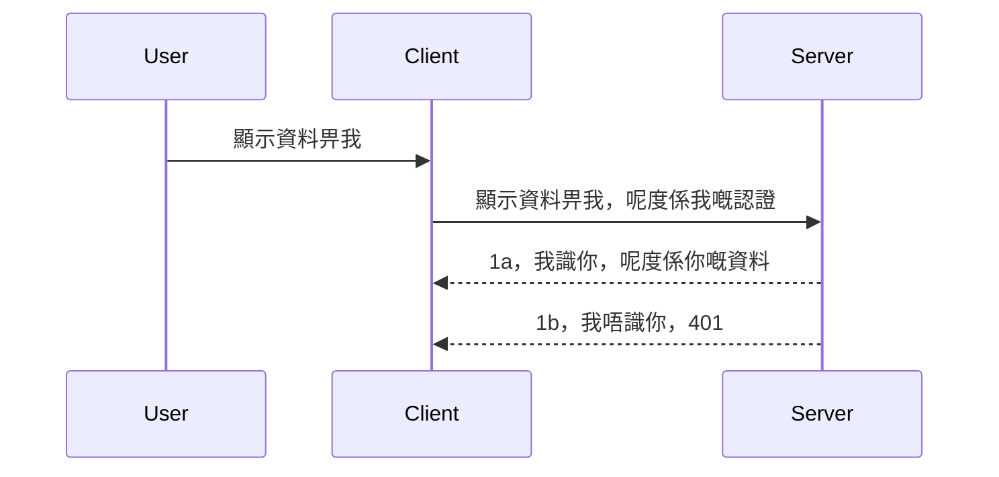

# Simple auth

MCP SDKs 支援使用 OAuth 2.1，坦白說這是一個相當複雜的流程，涉及授權伺服器、資源伺服器、提交憑證、取得授權碼，將授權碼兌換為存取權杖，直到最終取得資源資料。如果您不熟悉 OAuth，雖然它是一個很棒的實作方案，從基本認證開始並逐步建立更好的安全機制是一個好主意。這就是本章的目的，幫助您邁向更進階的認證。

## 認證，我們指的是什麼？

認證是 authentication 和 authorization 的縮寫。其概念是我們需要做兩件事：

- **Authentication（身份驗證）**，判斷一個人是否允許進入我們的「房子」，也就是他們是否有權「在這裡」，也就是對 MCP 伺服器上資源伺服器的存取權。
- **Authorization（授權）**，判斷使用者是否有權限存取他們所請求的特定資源，例如這些訂單或這些產品，或像是允許閱讀內容但不允許刪除等權限管理。

## 憑證：我們如何告訴系統我們是誰

大多數網頁開發者會考慮要提供一組憑證給伺服器，通常是一組機密，用以證明他們是否有權使用「認證」。這組憑證通常是使用 base64 編碼的使用者名稱及密碼，或是一組唯一標示特定使用者的 API 金鑰。

這需要透過名為「Authorization」的標頭傳送，格式如下：

```json
{ "Authorization": "secret123" }
```

這通常稱為基本認證。整體流程如下：


了解流程之後，我們該如何實作呢？大多數網頁伺服器有 middleware（中介軟體）的概念，一段會在請求過程中執行的程式碼，可以驗證憑證，若憑證有效則允許請求繼續，否則回傳認證錯誤。以下示範如何實現：

**Python**

```python
class AuthMiddleware(BaseHTTPMiddleware):
    async def dispatch(self, request, call_next):

        has_header = request.headers.get("Authorization")
        if not has_header:
            print("-> Missing Authorization header!")
            return Response(status_code=401, content="Unauthorized")

        if not valid_token(has_header):
            print("-> Invalid token!")
            return Response(status_code=403, content="Forbidden")

        print("Valid token, proceeding...")
       
        response = await call_next(request)
        # 新增任何用戶自訂標頭或以某種方式更改回應內容
        return response


starlette_app.add_middleware(CustomHeaderMiddleware)
```

這裡我們：

- 建立了一個名為 `AuthMiddleware` 的 middleware，其 `dispatch` 方法會被網頁伺服器呼叫。
- 將 middleware 新增到網頁伺服器裡：

    ```python
    starlette_app.add_middleware(AuthMiddleware)
    ```

- 撰寫驗證邏輯，檢查是否有 Authorization 標頭且傳來的密鑰是否有效：

    ```python
    has_header = request.headers.get("Authorization")
    if not has_header:
        print("-> Missing Authorization header!")
        return Response(status_code=401, content="Unauthorized")

    if not valid_token(has_header):
        print("-> Invalid token!")
        return Response(status_code=403, content="Forbidden")
    ```

如果密鑰存在且有效，我們會呼叫 `call_next` 讓請求繼續並回傳響應。

    ```python
    response = await call_next(request)
    # 在回應中添加任何客戶標頭或進行某種更改
    return response
    ```

原理是當有 Web 請求到達伺服器時，middleware 會被呼叫，依照實作決定請求是繼續通過，還是回傳表示客戶端無權進行的錯誤。

**TypeScript**

這裡我們使用受歡迎的 Express 框架建立 middleware，攔截請求直到到達 MCP 伺服器。程式碼如下：

```typescript
function isValid(secret) {
    return secret === "secret123";
}

app.use((req, res, next) => {
    // 1. 是否存在授權標頭？
    if(!req.headers["Authorization"]) {
        res.status(401).send('Unauthorized');
    }
    
    let token = req.headers["Authorization"];

    // 2. 檢查有效性。
    if(!isValid(token)) {
        res.status(403).send('Forbidden');
    }

   
    console.log('Middleware executed');
    // 3. 將請求傳遞到請求流程的下一個步驟。
    next();
});
```

這段程式做了以下步驟：

1. 檢查 Authorization 標頭是否存在，若不存在則回傳 401。
2. 驗證憑證／權杖是否有效，若無效返回 403。
3. 最後將請求傳遞到下個步驟並回傳所需資源。

## 練習：實作認證

讓我們將知識付諸實作，計畫如下：

伺服器端

- 建立一個網頁伺服器及 MCP 實例。
- 為伺服器實作 middleware。

用戶端

- 透過標頭，帶憑證發送 Web 請求。

### -1- 建立網頁伺服器與 MCP 實例

第一步我們需要建立網頁伺服器實例與 MCP 伺服器。

**Python**

這裡建立 MCP 伺服器實例，並建立 starlette Web App，使用 uvicorn 來啟動。

```python
# 建立 MCP 伺服器

app = FastMCP(
    name="MCP Resource Server",
    instructions="Resource Server that validates tokens via Authorization Server introspection",
    host=settings["host"],
    port=settings["port"],
    debug=True
)

# 建立 starlette 網頁應用程式
starlette_app = app.streamable_http_app()

# 通過 uvicorn 提供應用程式服務
async def run(starlette_app):
    import uvicorn
    config = uvicorn.Config(
            starlette_app,
            host=app.settings.host,
            port=app.settings.port,
            log_level=app.settings.log_level.lower(),
        )
    server = uvicorn.Server(config)
    await server.serve()

run(starlette_app)
```

程式碼說明：

- 建立 MCP 伺服器。
- 從 MCP 伺服器建立 starlette Web App，透過 `app.streamable_http_app()`。
- 使用 uvicorn 透過 `server.serve()` 啟動並提供 Web 服務。

**TypeScript**

這裡建立一個 MCP 伺服器實例。

```typescript
const server = new McpServer({
      name: "example-server",
      version: "1.0.0"
    });

    // ... 設置伺服器資源、工具及提示 ...
```

因為 MCP 伺服器的建立需要放在 POST /mcp 路由定義內，我們將上面程式碼改成：

```typescript
import express from "express";
import { randomUUID } from "node:crypto";
import { McpServer } from "@modelcontextprotocol/sdk/server/mcp.js";
import { StreamableHTTPServerTransport } from "@modelcontextprotocol/sdk/server/streamableHttp.js";
import { isInitializeRequest } from "@modelcontextprotocol/sdk/types.js"

const app = express();
app.use(express.json());

// 按會話 ID 儲存傳輸映射
const transports: { [sessionId: string]: StreamableHTTPServerTransport } = {};

// 處理用戶端至伺服器的 POST 請求
app.post('/mcp', async (req, res) => {
  // 檢查是否存在會話 ID
  const sessionId = req.headers['mcp-session-id'] as string | undefined;
  let transport: StreamableHTTPServerTransport;

  if (sessionId && transports[sessionId]) {
    // 重用現有的傳輸
    transport = transports[sessionId];
  } else if (!sessionId && isInitializeRequest(req.body)) {
    // 新初始化請求
    transport = new StreamableHTTPServerTransport({
      sessionIdGenerator: () => randomUUID(),
      onsessioninitialized: (sessionId) => {
        // 按會話 ID 儲存傳輸
        transports[sessionId] = transport;
      },
      // DNS 重綁定保護預設為關閉，以保持向後相容性。如果你正在本地運行此伺服器
      // 請確保設定：
      // enableDnsRebindingProtection: true,
      // allowedHosts: ['127.0.0.1'],
    });

    // 傳輸關閉時進行清理
    transport.onclose = () => {
      if (transport.sessionId) {
        delete transports[transport.sessionId];
      }
    };
    const server = new McpServer({
      name: "example-server",
      version: "1.0.0"
    });

    // ... 設置伺服器資源、工具和提示 ...

    // 連接至 MCP 伺服器
    await server.connect(transport);
  } else {
    // 請求無效
    res.status(400).json({
      jsonrpc: '2.0',
      error: {
        code: -32000,
        message: 'Bad Request: No valid session ID provided',
      },
      id: null,
    });
    return;
  }

  // 處理請求
  await transport.handleRequest(req, res, req.body);
});

// 可重用的 GET 和 DELETE 請求處理器
const handleSessionRequest = async (req: express.Request, res: express.Response) => {
  const sessionId = req.headers['mcp-session-id'] as string | undefined;
  if (!sessionId || !transports[sessionId]) {
    res.status(400).send('Invalid or missing session ID');
    return;
  }
  
  const transport = transports[sessionId];
  await transport.handleRequest(req, res);
};

// 處理用於伺服器至用戶端通知的 SSE GET 請求
app.get('/mcp', handleSessionRequest);

// 處理會話終止的 DELETE 請求
app.delete('/mcp', handleSessionRequest);

app.listen(3000);
```

您現在可以看到 `app.post("/mcp")` 裡面產生 MCP 伺服器實例。

接著來到第二步的 middleware 實作，驗證進來的憑證。

### -2- 為伺服器實作 middleware

現在我們來實作 middleware，會去查看 `Authorization` 標頭裡的憑證並驗證，若可接受就放行請求繼續進行（例如列出工具、讀取資源或用戶端請求的 MCP 功能）。

**Python**

實作 middleware 需建立繼承自 `BaseHTTPMiddleware` 的類別，有兩點重要：

- 請求物件 `request`，從中讀取標頭。
- `call_next` 回呼函式，在客戶端送出可接受的憑證時呼叫。

先處理缺少 `Authorization` 標頭的情況：

```python
has_header = request.headers.get("Authorization")

# 沒有標頭時，以401失敗，否則繼續。
if not has_header:
    print("-> Missing Authorization header!")
    return Response(status_code=401, content="Unauthorized")
```

這裡我們回傳 401 Unauthorized，代表客戶端未通過認證。

接著若有送出憑證，我們需檢查其有效性如下：

```python
 if not valid_token(has_header):
    print("-> Invalid token!")
    return Response(status_code=403, content="Forbidden")
```

注意這裡傳回 403 Forbidden。以下是完整 middleware 實作：

```python
class AuthMiddleware(BaseHTTPMiddleware):
    async def dispatch(self, request, call_next):

        has_header = request.headers.get("Authorization")
        if not has_header:
            print("-> Missing Authorization header!")
            return Response(status_code=401, content="Unauthorized")

        if not valid_token(has_header):
            print("-> Invalid token!")
            return Response(status_code=403, content="Forbidden")

        print("Valid token, proceeding...")
        print(f"-> Received {request.method} {request.url}")
        response = await call_next(request)
        response.headers['Custom'] = 'Example'
        return response

```

很好，但 `valid_token` 函式如何？如下：

```python
# 不要用於生產環境 - 請改進！！
def valid_token(token: str) -> bool:
    # 移除 "Bearer " 前綴
    if token.startswith("Bearer "):
        token = token[7:]
        return token == "secret-token"
    return False
```

此函式當然需要改進。

重要提醒：絕對不要在程式碼中明碼紀錄秘密。理想的作法是從資料來源或 IDP（身份識別服務提供者）取得憑證比對值，或者更好直接由 IDP 負責驗證。

**TypeScript**

在 Express 裡以 middleware 實作時，使用 `use` 方法註冊 middleware 函式。

步驟是：

- 操作 request 變數檢查 `Authorization` 屬性帶入的憑證。
- 檢查憑證有效性，若有效便讓請求繼續執行 MCP 請求行為（如列出工具、讀取資源或其他 MCP 功能）。

這裡先判斷有沒有帶 `Authorization` 標頭，沒帶就拒絕：

```typescript
if(!req.headers["authorization"]) {
    res.status(401).send('Unauthorized');
    return;
}
```

如果標頭不存在，會收到 401。

接著驗證憑證是否有效，失敗就拒絕且訊息不同：

```typescript
if(!isValid(token)) {
    res.status(403).send('Forbidden');
    return;
} 
```

你會收到 403 Forbidden。

完整程式碼如下：

```typescript
app.use((req, res, next) => {
    console.log('Request received:', req.method, req.url, req.headers);
    console.log('Headers:', req.headers["authorization"]);
    if(!req.headers["authorization"]) {
        res.status(401).send('Unauthorized');
        return;
    }
    
    let token = req.headers["authorization"];

    if(!isValid(token)) {
        res.status(403).send('Forbidden');
        return;
    }  

    console.log('Middleware executed');
    next();
});
```

伺服器已配置 middleware 以檢查客戶端憑證。那客戶端要如何呢？

### -3- 用標頭帶憑證發送 Web 請求

必須確保客戶端經由標頭帶入憑證。由於我們會用 MCP 用戶端執行，需知道如何設定。

**Python**

客戶端需要帶 header 包含憑證，如下：

```python
# 不要將值硬編碼，至少應該放在環境變量或更安全的存儲中
token = "secret-token"

async with streamablehttp_client(
        url = f"http://localhost:{port}/mcp",
        headers = {"Authorization": f"Bearer {token}"}
    ) as (
        read_stream,
        write_stream,
        session_callback,
    ):
        async with ClientSession(
            read_stream,
            write_stream
        ) as session:
            await session.initialize()
      
            # 待辦事項：你希望客戶端完成什麼，例如列出工具、呼叫工具等。
```

這裡將 `headers` 設為：`headers = {"Authorization": f"Bearer {token}"}`。

**TypeScript**

分兩步解決：

1. 建立含憑證的設定物件。
2. 把設定物件傳給傳輸層。

```typescript

// 唔好好似咁樣硬編碼個值。最少應該將佢放喺環境變數，並且喺開發模式用 dotenv 之類嘅工具。
let token = "secret123"

// 定義一個 client 傳輸選項嘅物件
let options: StreamableHTTPClientTransportOptions = {
  sessionId: sessionId,
  requestInit: {
    headers: {
      "Authorization": "secret123"
    }
  }
};

// 將選項物件傳遞畀傳輸層
async function main() {
   const transport = new StreamableHTTPClientTransport(
      new URL(serverUrl),
      options
   );
```

可以看到我們建立 `options` 物件，把 headers 放入 `requestInit` 屬性。

重要說明：怎麼改進呢？目前方案存在問題，憑證用這種方式傳遞相當冒險，至少得用 HTTPS 保護。而且憑證有被竊取風險，必須有能吊銷權杖的系統及防止異常請求的檢查機制，例如來源地點、請求頻率（機器人行為）等一系列安全考量。

話雖如此，對於極簡單的 API，讓未認證者無法呼叫，這種作法算是一個好開始。

接下來，我們將針對安全強化，使用標準格式 JSON Web Token，簡稱 JWT 或「JOT」權杖。

## JSON Web Tokens，JWT

我們想從傳送非常簡單的憑證升級。採用 JWT 有哪些立竿見影的提升？

- **安全性提升**。基本認證每次都送出 base64 編碼的使用者名稱及密碼，或 API 金鑰，風險較高。JWT 先送使用者名稱和密碼，取得一個權杖，且此權杖具有時間限制會過期。JWT 支援細緻的存取控制，基於角色、範圍和許可權。
- **無狀態和可擴充**。JWT 自包含，攜帶所有使用者資訊，無須在伺服器端儲存 session。權杖可在本地驗證。
- **互通性與身份聯合**。JWT 是 Open ID Connect 中樞，典型身份提供者像 Entra ID、Google Identity、Auth0 都支援。能用於單一登入等企業級功能。
- **模組化與彈性**。JWT 可搭配 Azure API 管理、NGINX 等 API Gateway 使用。支援用戶身份驗證及伺服器間通訊，包含冒充和委派場景。
- **效能與緩存**。JWT 解碼後可快取，減少重複解析負擔，特別對高流量應用提升吞吐與穩定度。
- **進階功能**。支援權杖檢視（introspection）與撤銷（revocation）。

有了這些優勢，我們看看如何把實作提升到下一層次。

## 將簡單認證改成 JWT

我們要做的大方向改變是：

- **學會構造 JWT 權杖**，讓客戶端可傳給伺服器。
- **驗證 JWT 權杖**，若通過，讓客戶端取得資源。
- **安全儲存權杖**。如何存放此權杖。
- **保護路由**。要保護路由，特別是 MCP 功能路由。
- **新增刷新權杖**。確保產生短期存活的權杖，以及長期可用來換新權杖的刷新權杖。同時建立刷新端點與輪換策略。

### -1- 建立 JWT 權杖

JWT 權杖包含以下部分：

- **header**，算法與權杖類型。
- **payload**，聲明（claims），如 sub（代表使用者或實體，通常是使用者 ID）、exp（過期時間）、role（角色）。
- **signature**，以密鑰或私鑰簽名。

我們需要構造 header、payload 並產生編碼的權杖。

**Python**

```python

import jwt
import jwt
from jwt.exceptions import ExpiredSignatureError, InvalidTokenError
import datetime

# 用於簽署 JWT 的秘密鑰匙
secret_key = 'your-secret-key'

header = {
    "alg": "HS256",
    "typ": "JWT"
}

# 用戶資訊及其聲明與過期時間
payload = {
    "sub": "1234567890",               # 主體（用戶 ID）
    "name": "User Userson",                # 自訂聲明
    "admin": True,                     # 自訂聲明
    "iat": datetime.datetime.utcnow(),# 發布時間
    "exp": datetime.datetime.utcnow() + datetime.timedelta(hours=1)  # 過期時間
}

# 編碼它
encoded_jwt = jwt.encode(payload, secret_key, algorithm="HS256", headers=header)
```

程式碼說明：

- 定義 header 使用 HS256 演算法，類型為 JWT。
- 建立 payload，包含 subject（使用者 ID）、使用者名稱、角色、發布時間與過期時間，實作先前提到的時間限制。

**TypeScript**

這裡需要一些函式庫協助建立 JWT 權杖。

依賴項目

```sh

npm install jsonwebtoken
npm install --save-dev @types/jsonwebtoken
```

依賴裝好後，我們來建立 header、payload，再產生編碼權杖。

```typescript
import jwt from 'jsonwebtoken';

const secretKey = 'your-secret-key'; // 在生產環境使用環境變數

// 定義有效載荷
const payload = {
  sub: '1234567890',
  name: 'User usersson',
  admin: true,
  iat: Math.floor(Date.now() / 1000), // 發行時間
  exp: Math.floor(Date.now() / 1000) + 60 * 60 // 1 小時後過期
};

// 定義標頭（可選，jsonwebtoken 設置預設值）
const header = {
  alg: 'HS256',
  typ: 'JWT'
};

// 創建令牌
const token = jwt.sign(payload, secretKey, {
  algorithm: 'HS256',
  header: header
});

console.log('JWT:', token);
```

此權杖：

使用 HS256 簽名
有效期限 1 小時
聲明包含 sub、name、admin、iat 和 exp。

### -2- 驗證權杖

我們還要驗證權杖，確保客戶端送出的權杖有效。此步驟需在伺服器執行，包含格式與有效性檢查。您也被鼓勵加入更多檢查，如確認使用者存在系統，擁有聲稱的權利等。

驗證權杖流程是解碼使其可讀，再開始檢查功效：

**Python**

```python

# 解碼並驗證 JWT
try:
    decoded = jwt.decode(token, secret_key, algorithms=["HS256"])
    print("✅ Token is valid.")
    print("Decoded claims:")
    for key, value in decoded.items():
        print(f"  {key}: {value}")
except ExpiredSignatureError:
    print("❌ Token has expired.")
except InvalidTokenError as e:
    print(f"❌ Invalid token: {e}")

```

程式碼中，我們呼叫 `jwt.decode` 指定權杖、秘密金鑰和算法。使用 try-catch 防止驗證失敗、引發錯誤。

**TypeScript**

這裡呼叫 `jwt.verify` 取得可解析的解碼權杖，以進一步分析。若呼叫失敗，代表權杖結構錯誤或無效。

```typescript

try {
  const decoded = jwt.verify(token, secretKey);
  console.log('Decoded Payload:', decoded);
} catch (err) {
  console.error('Token verification failed:', err);
}
```

注意如前所述，應再做額外檢查，包含確認該權杖對應系統中某使用者，且該使用者具備相應權限。
接下來，讓我們看看基於角色的存取控制，也稱為 RBAC。

## 新增基於角色的存取控制

這個概念是我們想表達不同角色有不同的權限。例如，我們假設管理員可以做所有事情，普通用戶可以讀寫，訪客只能讀取。因此，這裡有一些可能的權限等級：

- Admin.Write  
- User.Read  
- Guest.Read  

讓我們看看如何用中介軟體來實作這樣的控制。中介軟體可以針對每個路由新增，也可以針對所有路由新增。

**Python**

```python
from starlette.middleware.base import BaseHTTPMiddleware
from starlette.responses import JSONResponse
import jwt

# 不要像這樣把密碼寫在程式碼內，這只是示範用。請從安全的地方讀取。
SECRET_KEY = "your-secret-key" # 放入環境變數中
REQUIRED_PERMISSION = "User.Read"

class JWTPermissionMiddleware(BaseHTTPMiddleware):
    async def dispatch(self, request, call_next):
        auth_header = request.headers.get("Authorization")
        if not auth_header or not auth_header.startswith("Bearer "):
            return JSONResponse({"error": "Missing or invalid Authorization header"}, status_code=401)

        token = auth_header.split(" ")[1]
        try:
            decoded = jwt.decode(token, SECRET_KEY, algorithms=["HS256"])
        except jwt.ExpiredSignatureError:
            return JSONResponse({"error": "Token expired"}, status_code=401)
        except jwt.InvalidTokenError:
            return JSONResponse({"error": "Invalid token"}, status_code=401)

        permissions = decoded.get("permissions", [])
        if REQUIRED_PERMISSION not in permissions:
            return JSONResponse({"error": "Permission denied"}, status_code=403)

        request.state.user = decoded
        return await call_next(request)


```
  
有幾種不同的方式來新增如下的中介軟體：

```python

# 選項 1：在構建 starlette 應用時添加中介軟件
middleware = [
    Middleware(JWTPermissionMiddleware)
]

app = Starlette(routes=routes, middleware=middleware)

# 選項 2：在 starlette 應用已構建後添加中介軟件
starlette_app.add_middleware(JWTPermissionMiddleware)

# 選項 3：每條路由添加中介軟件
routes = [
    Route(
        "/mcp",
        endpoint=..., # 處理程序
        middleware=[Middleware(JWTPermissionMiddleware)]
    )
]
```
  
**TypeScript**

我們可以使用 `app.use` 以及一個會對所有請求執行的中介軟體。

```typescript
app.use((req, res, next) => {
    console.log('Request received:', req.method, req.url, req.headers);
    console.log('Headers:', req.headers["authorization"]);

    // 1. 檢查是否已發送授權標頭

    if(!req.headers["authorization"]) {
        res.status(401).send('Unauthorized');
        return;
    }
    
    let token = req.headers["authorization"];

    // 2. 檢查令牌是否有效
    if(!isValid(token)) {
        res.status(403).send('Forbidden');
        return;
    }  

    // 3. 檢查令牌用戶是否存在於我們的系統中
    if(!isExistingUser(token)) {
        res.status(403).send('Forbidden');
        console.log("User does not exist");
        return;
    }
    console.log("User exists");

    // 4. 驗證令牌是否具有正確的權限
    if(!hasScopes(token, ["User.Read"])){
        res.status(403).send('Forbidden - insufficient scopes');
    }

    console.log("User has required scopes");

    console.log('Middleware executed');
    next();
});

```
  
我們可以讓中介軟體做很多事情，而且我們的中介軟體應該做的有：

1. 檢查是否有授權標頭  
2. 檢查 token 是否有效，我們呼叫 `isValid`，這是我們撰寫的檢查 JWT token 完整性和有效性的方法。  
3. 驗證使用者是否存在於我們的系統中，我們應該要檢查這點。

   ```typescript
    // 資料庫中的用戶
   const users = [
     "user1",
     "User usersson",
   ]

   function isExistingUser(token) {
     let decodedToken = verifyToken(token);

     // 待辦事項，檢查用戶是否存在於資料庫中
     return users.includes(decodedToken?.name || "");
   }
   ```
  
   上面，我們建立了一個非常簡單的 `users` 名單，實際上應該存在資料庫中。

4. 此外，我們還應該檢查 token 是否具備適當的權限。

   ```typescript
   if(!hasScopes(token, ["User.Read"])){
        res.status(403).send('Forbidden - insufficient scopes');
   }
   ```
  
   在上述中介軟體的程式碼中，我們檢查 token 是否包含 User.Read 權限，若沒有則回傳 403 錯誤。下方是 `hasScopes` 的輔助方法。

   ```typescript
   function hasScopes(scope: string, requiredScopes: string[]) {
     let decodedToken = verifyToken(scope);
    return requiredScopes.every(scope => decodedToken?.scopes.includes(scope));
  }  
   ```

Have a think which additional checks you should be doing, but these are the absolute minimum of checks you should be doing.

Using Express as a web framework is a common choice. There are helpers library when you use JWT so you can write less code.

- `express-jwt`, helper library that provides a middleware that helps decode your token.
- `express-jwt-permissions`, this provides a middleware `guard` that helps check if a certain permission is on the token.

Here's what these libraries can look like when used:

```typescript
const express = require('express');
const jwt = require('express-jwt');
const guard = require('express-jwt-permissions')();

const app = express();
const secretKey = 'your-secret-key'; // put this in env variable

// Decode JWT and attach to req.user
app.use(jwt({ secret: secretKey, algorithms: ['HS256'] }));

// Check for User.Read permission
app.use(guard.check('User.Read'));

// multiple permissions
// app.use(guard.check(['User.Read', 'Admin.Access']));

app.get('/protected', (req, res) => {
  res.json({ message: `Welcome ${req.user.name}` });
});

// Error handler
app.use((err, req, res, next) => {
  if (err.code === 'permission_denied') {
    return res.status(403).send('Forbidden');
  }
  next(err);
});

```
  
現在你已經看到中介軟體如何用來做驗證與授權，那 MCP 呢？它會改變我們做驗證的方式嗎？讓我們在下一節來探討。

### -3- 為 MCP 新增 RBAC

到目前為止你已經看到如何通過中介軟體新增 RBAC，不過對 MCP 來說，要在每個 MCP 功能加上 RBAC 沒有簡易的方法，那我們該怎麼辦？我們必須加入像下面的程式碼來檢查，這裡是判斷用戶端是否有呼叫特定工具的權限：

你有幾種不同方式可以完成每個功能的 RBAC，以下是一些選擇：

- 在每個工具、資源、提示中加入檢查權限等級的程式碼。

   **python**

   ```python
   @tool()
   def delete_product(id: int):
      try:
          check_permissions(role="Admin.Write", request)
      catch:
        pass # 客戶端授權失敗，引發授權錯誤
   ```
  
   **typescript**

   ```typescript
   server.registerTool(
    "delete-product",
    {
      title: Delete a product",
      description: "Deletes a product",
      inputSchema: { id: z.number() }
    },
    async ({ id }) => {
      
      try {
        checkPermissions("Admin.Write", request);
        // 待辦，將id發送到productService和遠端入口
      } catch(Exception e) {
        console.log("Authorization error, you're not allowed");  
      }

      return {
        content: [{ type: "text", text: `Deletected product with id ${id}` }]
      };
    }
   );
   ```
  

- 採用進階伺服器架構與請求處理器 (request handlers)，減少需要做檢查的程式碼數量。

   **Python**

   ```python
   
   tool_permission = {
      "create_product": ["User.Write", "Admin.Write"],
      "delete_product": ["Admin.Write"]
   }

   def has_permission(user_permissions, required_permissions) -> bool:
      # user_permissions: 用戶擁有的權限列表
      # required_permissions: 工具所需的權限列表
      return any(perm in user_permissions for perm in required_permissions)

   @server.call_tool()
   async def handle_call_tool(
     name: str, arguments: dict[str, str] | None
   ) -> list[types.TextContent]:
    # 假設 request.user.permissions 是用戶的權限列表
     user_permissions = request.user.permissions
     required_permissions = tool_permission.get(name, [])
     if not has_permission(user_permissions, required_permissions):
        # 拋出錯誤「你沒有權限調用工具 {name}」
        raise Exception(f"You don't have permission to call tool {name}")
     # 繼續並調用工具
     # ...
   ```   
     

   **TypeScript**

   ```typescript
   function hasPermission(userPermissions: string[], requiredPermissions: string[]): boolean {
       if (!Array.isArray(userPermissions) || !Array.isArray(requiredPermissions)) return false;
       // 如果用戶擁有至少一個所需權限則返回真
       
       return requiredPermissions.some(perm => userPermissions.includes(perm));
   }
  
   server.setRequestHandler(CallToolRequestSchema, async (request) => {
      const { params: { name } } = request;
  
      let permissions = request.user.permissions;
  
      if (!hasPermission(permissions, toolPermissions[name])) {
         return new Error(`You don't have permission to call ${name}`);
      }
  
      // 繼續..
   });
   ```
  
   注意，你需要確保中介軟體會將解碼後的 token 指派給請求的 user 屬性，這樣上面程式碼才會簡潔。

### 總結

現在我們討論了如何在一般情況以及 MCP 中新增 RBAC 支援，是時候自己嘗試實作安全機制，確保你理解所介紹的概念。

## 作業 1：使用基本驗證建立 MCP 伺服器與 MCP 用戶端

這裡你會運用先前學到如何透過標頭傳送認證資訊。

## 解答 1

[Solution 1](./code/basic/README.md)

## 作業 2：將作業 1 的解決方案升級為使用 JWT

採用第一個方案，不過這次讓我們改進它。

不是用基本驗證，而是使用 JWT。

## 解答 2

[Solution 2](./solution/jwt-solution/README.md)

## 挑戰

為我們在「為 MCP 新增 RBAC」章節描述的每個工具，加入 RBAC。

## 摘要

希望你在本章學到許多，從完全沒有安全機制，到基本安全，再到 JWT 以及如何將它加入 MCP。

我們已經用自訂 JWT 建立了扎實基礎，但隨著規模擴大，我們將朝向標準化的身份模型邁進。採用像 Entra 或 Keycloak 這樣的身份提供者（IdP）能卸下發行、驗證與生命周期管理的工作，交給受信任的平台處理，讓我們專注於應用程式邏輯與用戶體驗。

為此，我們有一個更[進階的 Entra 章節](../../05-AdvancedTopics/mcp-security-entra/README.md)

## 下一步

- 下一步：[設定 MCP 主機](../12-mcp-hosts/README.md)

---

<!-- CO-OP TRANSLATOR DISCLAIMER START -->
**免責聲明**：  
本文件由 AI 翻譯服務 [Co-op Translator](https://github.com/Azure/co-op-translator) 所翻譯。雖然我們致力於準確性，但請注意自動翻譯可能包含錯誤或不準確之處。原始文件的母語版本應視為權威來源。對於重要資訊，建議採用專業人工翻譯。我們不對因使用本翻譯而產生的任何誤解或錯誤詮釋負責。
<!-- CO-OP TRANSLATOR DISCLAIMER END -->