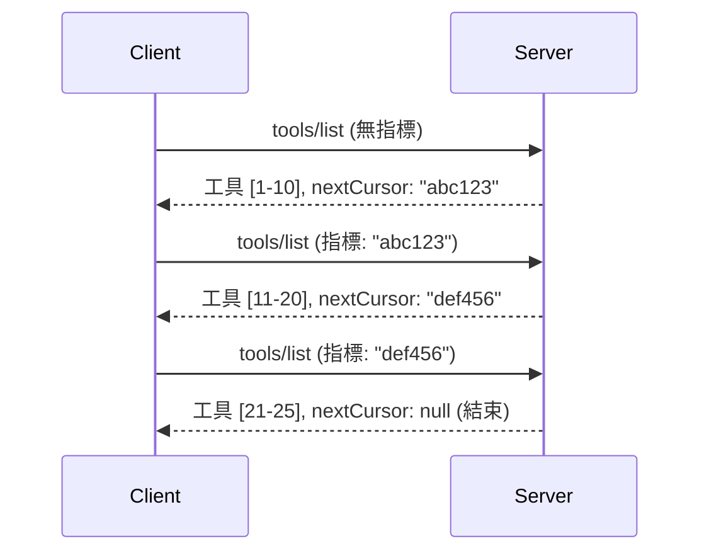

# MCP 中的分頁與大型結果集

當您的 MCP 伺服器處理大量資料集時—無論是列出數千個檔案、資料庫紀錄或搜尋結果—您需要分頁來有效管理記憶體並提供回應迅速的使用者體驗。本指南涵蓋如何在 MCP 中實作和使用分頁。

## 為什麼分頁很重要

沒有分頁，大量的回應可能導致：

- **記憶體耗盡** — 同時載入數百萬筆紀錄
- **回應時間變慢** — 使用者需等待全部資料載入完成
- **逾時錯誤** — 請求超出逾時限制
- **AI 性能下降** — LLM 在巨量上下文下運作困難

MCP 使用 **基於游標的分頁** 來可靠且一致地分頁瀏覽結果集。

---

## MCP 分頁運作方式

### 游標概念

**游標** 是一個不透明的字串，標示您在結果集中的位置。可以把它想像成一本長書中的書籤。


### MCP 方法中的分頁

這些 MCP 方法支援分頁：

| 方法 | 回傳 | 是否支援游標 |
|--------|---------|----------------|
| `tools/list` | 工具定義 | ✅ |
| `resources/list` | 資源定義 | ✅ |
| `prompts/list` | 提示定義 | ✅ |
| `resources/templates/list` | 資源範本 | ✅ |

---

## 伺服器端實作

### Python (FastMCP)

```python
from mcp.server import Server
from mcp.types import Tool, ListToolsResult
import math

app = Server("paginated-server")

# 模擬大型數據集
ALL_TOOLS = [
    Tool(name=f"tool_{i}", description=f"Tool number {i}", inputSchema={})
    for i in range(100)
]

PAGE_SIZE = 10

@app.list_tools()
async def list_tools(cursor: str | None = None) -> ListToolsResult:
    """List tools with pagination support."""
    
    # 解碼游標以獲取起始索引
    start_index = 0
    if cursor:
        try:
            start_index = int(cursor)
        except ValueError:
            start_index = 0
    
    # 獲取結果頁面
    end_index = min(start_index + PAGE_SIZE, len(ALL_TOOLS))
    page_tools = ALL_TOOLS[start_index:end_index]
    
    # 計算下一個游標
    next_cursor = None
    if end_index < len(ALL_TOOLS):
        next_cursor = str(end_index)
    
    return ListToolsResult(
        tools=page_tools,
        nextCursor=next_cursor
    )
```

### TypeScript

```typescript
import { Server } from "@modelcontextprotocol/sdk/server/index.js";
import { ListToolsResultSchema } from "@modelcontextprotocol/sdk/types.js";

const server = new Server({
  name: "paginated-server",
  version: "1.0.0"
});

// 模擬大型數據集
const ALL_TOOLS = Array.from({ length: 100 }, (_, i) => ({
  name: `tool_${i}`,
  description: `Tool number ${i}`,
  inputSchema: { type: "object", properties: {} }
}));

const PAGE_SIZE = 10;

server.setRequestHandler(ListToolsResultSchema, async (request) => {
  // 解碼游標
  let startIndex = 0;
  if (request.params?.cursor) {
    startIndex = parseInt(request.params.cursor, 10) || 0;
  }
  
  // 獲取結果頁面
  const endIndex = Math.min(startIndex + PAGE_SIZE, ALL_TOOLS.length);
  const pageTools = ALL_TOOLS.slice(startIndex, endIndex);
  
  // 計算下一個游標
  const nextCursor = endIndex < ALL_TOOLS.length ? String(endIndex) : undefined;
  
  return {
    tools: pageTools,
    nextCursor
  };
});
```

### Java (Spring MCP)

```java
@Service
public class PaginatedToolService {
    
    private static final int PAGE_SIZE = 10;
    private final List<Tool> allTools;
    
    public PaginatedToolService() {
        // 初始化大型數據集
        this.allTools = IntStream.range(0, 100)
            .mapToObj(i -> new Tool("tool_" + i, "Tool number " + i, Map.of()))
            .collect(Collectors.toList());
    }
    
    @McpMethod("tools/list")
    public ListToolsResult listTools(@Param("cursor") String cursor) {
        // 解碼游標
        int startIndex = 0;
        if (cursor != null && !cursor.isEmpty()) {
            try {
                startIndex = Integer.parseInt(cursor);
            } catch (NumberFormatException e) {
                startIndex = 0;
            }
        }
        
        // 獲取結果頁面
        int endIndex = Math.min(startIndex + PAGE_SIZE, allTools.size());
        List<Tool> pageTools = allTools.subList(startIndex, endIndex);
        
        // 計算下一個游標
        String nextCursor = endIndex < allTools.size() ? String.valueOf(endIndex) : null;
        
        return new ListToolsResult(pageTools, nextCursor);
    }
}
```

---

## 用戶端實作

### Python 用戶端

```python
from mcp import ClientSession

async def get_all_tools(session: ClientSession) -> list:
    """Fetch all tools using pagination."""
    all_tools = []
    cursor = None
    
    while True:
        result = await session.list_tools(cursor=cursor)
        all_tools.extend(result.tools)
        
        if result.nextCursor is None:
            break
        cursor = result.nextCursor
    
    return all_tools

# 用法
async with client_session as session:
    tools = await get_all_tools(session)
    print(f"Found {len(tools)} tools")
```

### TypeScript 用戶端

```typescript
import { Client } from "@modelcontextprotocol/sdk/client/index.js";

async function getAllTools(client: Client): Promise<Tool[]> {
  const allTools: Tool[] = [];
  let cursor: string | undefined = undefined;
  
  do {
    const result = await client.listTools({ cursor });
    allTools.push(...result.tools);
    cursor = result.nextCursor;
  } while (cursor);
  
  return allTools;
}

// 用法
const tools = await getAllTools(client);
console.log(`Found ${tools.length} tools`);
```

### 慢載入模式

針對非常大型的資料集，依需求載入頁面：

```python
class PaginatedToolIterator:
    """Lazily iterate through paginated tools."""
    
    def __init__(self, session: ClientSession):
        self.session = session
        self.cursor = None
        self.buffer = []
        self.exhausted = False
    
    async def __anext__(self):
        # 如果可用，從緩衝區返回
        if self.buffer:
            return self.buffer.pop(0)
        
        # 檢查是否已經讀完所有頁面
        if self.exhausted:
            raise StopAsyncIteration
        
        # 獲取下一頁
        result = await self.session.list_tools(cursor=self.cursor)
        self.buffer = list(result.tools)
        self.cursor = result.nextCursor
        
        if self.cursor is None:
            self.exhausted = True
        
        if not self.buffer:
            raise StopAsyncIteration
        
        return self.buffer.pop(0)
    
    def __aiter__(self):
        return self

# 用法 - 對於大型數據集的記憶體高效使用
async for tool in PaginatedToolIterator(session):
    process_tool(tool)
```

---

## 資源的分頁

資源通常需要對目錄或大型資料集進行分頁：

```python
from mcp.server import Server
from mcp.types import Resource, ListResourcesResult
import os

app = Server("file-server")

@app.list_resources()
async def list_resources(cursor: str | None = None) -> ListResourcesResult:
    """List files in directory with pagination."""
    
    directory = "/data/files"
    all_files = sorted(os.listdir(directory))
    
    # 解碼游標（檔案索引）
    start_index = int(cursor) if cursor else 0
    page_size = 20
    end_index = min(start_index + page_size, len(all_files))
    
    # 為此頁面建立資源列表
    resources = []
    for filename in all_files[start_index:end_index]:
        filepath = os.path.join(directory, filename)
        resources.append(Resource(
            uri=f"file://{filepath}",
            name=filename,
            mimeType="application/octet-stream"
        ))
    
    # 計算下一個游標
    next_cursor = str(end_index) if end_index < len(all_files) else None
    
    return ListResourcesResult(
        resources=resources,
        nextCursor=next_cursor
    )
```

---

## 游標設計策略

### 策略 1：基於索引（簡單）

```python
# 游標只是索引
cursor = "50"  # 從第50項開始
```

**優點：** 簡單、無狀態  
**缺點：** 若有項目新增或刪除，結果可能會移位

### 策略 2：基於 ID（穩定）

```python
# 游標是最後看到的 ID
cursor = "item_abc123"  # 從此項目之後開始
```

**優點：** 即使項目變動也穩定  
**缺點：** 需要有序的 ID

### 策略 3：編碼狀態（複雜）

```python
import base64
import json

def encode_cursor(state: dict) -> str:
    return base64.b64encode(json.dumps(state).encode()).decode()

def decode_cursor(cursor: str) -> dict:
    return json.loads(base64.b64decode(cursor).decode())

# 游標包含多個狀態欄位
cursor = encode_cursor({
    "offset": 50,
    "filter": "active",
    "sort": "name"
})
```

**優點：** 能編碼複雜狀態  
**缺點：** 較複雜、游標字串較長

---

## 最佳實踐

### 1. 選擇適當的頁面大小

```python
# 考慮數據大小
PAGE_SIZE_SMALL_ITEMS = 100   # 簡單元數據
PAGE_SIZE_MEDIUM_ITEMS = 20   # 更豐富的物件
PAGE_SIZE_LARGE_ITEMS = 5     # 複雜內容
```

### 2. 優雅處理無效游標

```python
@app.list_tools()
async def list_tools(cursor: str | None = None) -> ListToolsResult:
    try:
        start_index = int(cursor) if cursor else 0
        if start_index < 0 or start_index >= len(ALL_TOOLS):
            start_index = 0  # 重設到開始位置
    except (ValueError, TypeError):
        start_index = 0  # 游標無效，重新開始
    # ...
```

### 3. 包含總數（選用）

```python
return ListToolsResult(
    tools=page_tools,
    nextCursor=next_cursor,
    # 一些實現包括用於用戶界面進度的總數
    _meta={"total": len(ALL_TOOLS)}
)
```

### 4. 測試邊緣案例

```python
async def test_pagination():
    # 空結果集
    result = await session.list_tools()
    assert result.tools == []
    assert result.nextCursor is None
    
    # 單頁
    result = await session.list_tools()
    assert len(result.tools) <= PAGE_SIZE
    
    # 無效的游標
    result = await session.list_tools(cursor="invalid")
    assert result.tools  # 應該返回第一頁
```

---

## 常見陷阱

### ❌ 回傳所有結果再在用戶端分頁

```python
# 壞處：將所有東西載入記憶體
@app.list_tools()
async def list_tools() -> ListToolsResult:
    all_tools = load_all_tools()  # 一百萬個工具！
    return ListToolsResult(tools=all_tools)
```

### ✅ 在資料源端分頁

```python
# 好：只加載所需內容
@app.list_tools()
async def list_tools(cursor: str | None = None) -> ListToolsResult:
    offset = int(cursor) if cursor else 0
    tools = await db.query_tools(offset=offset, limit=PAGE_SIZE)
    return ListToolsResult(tools=tools, nextCursor=...)
```

---

## 往下學習

- [模組 5.14 - 上下文工程](../../05-AdvancedTopics/mcp-contextengineering/README.md)
- [模組 8 - 最佳實踐](../../08-BestPractices/README.md)
- [3.8 - 測試您的 MCP 伺服器](../../03-GettingStarted/08-testing/README.md)

---

## 附加資源

- [MCP 規範 - 分頁](https://spec.modelcontextprotocol.io/specification/2025-11-25/)
- [基於游標的分頁說明](https://slack.engineering/evolving-api-pagination-at-slack/)
- [Python SDK 分頁測試](https://github.com/modelcontextprotocol/python-sdk/blob/main/tests/client/test_list_methods_cursor.py)

---

<!-- CO-OP TRANSLATOR DISCLAIMER START -->
**免責聲明**：
本文件使用 AI 翻譯服務 [Co-op Translator](https://github.com/Azure/co-op-translator) 進行翻譯。雖然我們致力於準確性，請注意自動翻譯可能包含錯誤或不準確之處。原始文件的原文版本應視為權威來源。對於重要資訊，建議採用專業人工翻譯。因使用本翻譯而導致的任何誤解或錯譯，我們概不負責。
<!-- CO-OP TRANSLATOR DISCLAIMER END -->