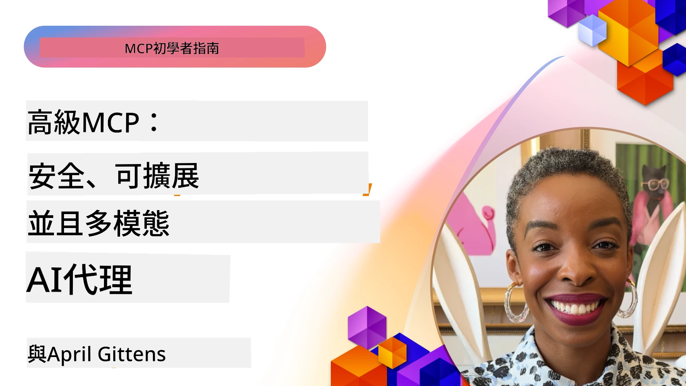

# MCP 進階主題

_(點擊上方圖片觀看本課程影片)_

本章涵蓋 Model Context Protocol (MCP) 實作中的一系列進階主題，包括多模態整合、可擴展性、安全性最佳實踐以及企業整合。這些主題對於構建健壯且適合生產環境的 MCP 應用程式至關重要，以滿足現代 AI 系統的需求。

## 概覽

本課程探討 Model Context Protocol 實作的進階概念，專注於多模態整合、可擴展性、安全性最佳實踐及企業整合。這些主題對於構建能應付企業環境中複雜需求的生產級 MCP 應用程式非常重要。

## 學習目標

完成本課程後，您將能夠：

- 在 MCP 框架中實作多模態功能
- 設計可擴展的 MCP 架構以應對高需求場景
- 應用符合同 MCP 安全原則的安全性最佳實踐
- 將 MCP 與企業 AI 系統及框架整合
- 優化生產環境中的效能與可靠性

## 課程與範例專案

| 連結 | 標題 | 說明 |
|------|-------|-------------|
| [5.1 Integration with Azure](./mcp-integration/README.md) | 整合 Azure | 學習如何在 Azure 上整合您的 MCP 伺服器 |
| [5.2 Multi modal sample](./mcp-multi-modality/README.md) | MCP 多模態範例 | 音頻、影像及多模態回應範例 |
| [5.3 MCP OAuth2 sample](../../../05-AdvancedTopics/mcp-oauth2-demo) | MCP OAuth2 示範 | 最簡 Spring Boot 應用示範 MCP OAuth2，作為授權伺服器與資源伺服器。展示安全的令牌發放、受保護端點、Azure Container Apps 部屬及 API 管理整合。 |
| [5.4 Root Contexts](./mcp-root-contexts/README.md) | 根上下文 | 深入了解根上下文及其實作方法 |
| [5.5 Routing](./mcp-routing/README.md) | 路由 | 學習不同類型的路由 |
| [5.6 Sampling](./mcp-sampling/README.md) | 取樣 | 學習如何使用取樣 |
| [5.7 Scaling](./mcp-scaling/README.md) | 可擴展性 | 認識可擴展性 |
| [5.8 Security](./mcp-security/README.md) | 安全性 | 保護您的 MCP 伺服器 |
| [5.9 Web Search sample](./web-search-mcp/README.md) | Web 搜尋 MCP | Python MCP 伺服器與客戶端結合 SerpAPI，支援即時網頁、新聞、產品搜尋及問答。展示多工具協調、外部 API 整合及強健的錯誤處理。 |
| [5.10 Realtime Streaming](./mcp-realtimestreaming/README.md) | 串流 | 即時數據串流已成為現今數據驅動世界的關鍵，企業和應用需即時存取資訊以做出及時決策。|
| [5.11 Realtime Web Search](./mcp-realtimesearch/README.md) | 即時網路搜尋 | MCP 如何透過標準化的上下文管理，轉變 AI 模型、搜尋引擎與應用間的即時網路搜尋體驗。| 
| [5.12  Entra ID Authentication for Model Context Protocol Servers](./mcp-security-entra/README.md) | Entra ID 認證 | Microsoft Entra ID 提供強大的雲端識別與存取管理解決方案，確保只有授權使用者與應用能與您的 MCP 伺服器互動。|
| [5.13 Azure AI Foundry Agent Integration](./mcp-foundry-agent-integration/README.md) | Azure AI Foundry 整合 | 學習如何將 MCP 伺服器與 Azure AI Foundry 代理整合，實現強大的工具協調與企業 AI 能力，並透過標準化外部資料來源連接。|
| [5.14 Context Engineering](./mcp-contextengineering/README.md) | 上下文工程 | MCP 伺服器上下文工程技術的未來機會，包括上下文優化、動態上下文管理及 MCP 框架內有效提示工程策略。|
| [5.15 MCP Custom Transport](./mcp-transport/README.md) | 自訂傳輸 | 學習如何為特殊 MCP 通訊場景實作自訂傳輸機制。|
| [5.16 Protocol Features Deep Dive](./mcp-protocol-features/README.md) | 協定功能 | 精通進階協定功能，包括進度通知、請求取消、資源範本及錯誤處理模式。|

> **MCP 規格 2025-11-25 新增**：規格新增實驗性支援 **任務**（帶進度追蹤的長時間運作）、**工具註解**（關於工具行為安全性的元數據）、**URL 模式誘導**（請求客戶端特定 URL 內容）及增強的 **根上下文**（工作區上下文管理）。詳情請參閱 [MCP 規格變更記錄](https://spec.modelcontextprotocol.io/)。

## 額外參考

欲知最新進階 MCP 主題資訊，請參考：
- [MCP 文件](https://modelcontextprotocol.io/)
- [MCP 規格 (2025-11-25)](https://spec.modelcontextprotocol.io/specification/2025-11-25/)
- [GitHub 倉庫](https://github.com/modelcontextprotocol)
- [OWASP MCP Top 10](https://microsoft.github.io/mcp-azure-security-guide/mcp/) - 安全風險與緩解措施
- [MCP 安全高峰研討會工作坊 (Sherpa)](https://azure-samples.github.io/sherpa/) - 實作安全訓練

## 主要重點

- 多模態 MCP 實作擴展 AI 功能超越文字處理
- 可擴展性是企業部署的關鍵，可透過水平與垂直擴展解決
- 全面安全措施保障資料與適當存取控制
- 與 Azure OpenAI 及 Microsoft AI Foundry 等平台的企業整合增強 MCP 功能
- 進階 MCP 實作受益於優化架構與謹慎資源管理

## 練習

為特定用例設計企業級 MCP 實作：

1. 確認用例所需的多模態需求
2. 列出保護敏感資料所需的安全控管
3. 設計可應付變動負載的可擴展架構
4. 規劃與企業 AI 系統的整合點
5. 文件化潛在效能瓶頸與緩解策略

## 其他資源

- [Azure OpenAI 文件](https://learn.microsoft.com/en-us/azure/ai-services/openai/)
- [Microsoft AI Foundry 文件](https://learn.microsoft.com/en-us/ai-services/)

---

## 下一步

從此模組的課程開始探索：[5.1 MCP Integration](./mcp-integration/README.md)

完成本模組後，繼續學習：[模組 6：社群貢獻](../06-CommunityContributions/README.md)

---

<!-- CO-OP TRANSLATOR DISCLAIMER START -->
**免責聲明**：  
本文件使用 AI 翻譯服務 [Co-op Translator](https://github.com/Azure/co-op-translator) 進行翻譯。雖然我們致力於翻譯的準確性，但請注意，自動翻譯可能包含錯誤或不準確之處。原始文件的母語版本應被視為權威來源。對於關鍵資訊，建議尋求專業人工翻譯。我們不對因使用本翻譯而引起的任何誤解或錯譯負責。
<!-- CO-OP TRANSLATOR DISCLAIMER END -->