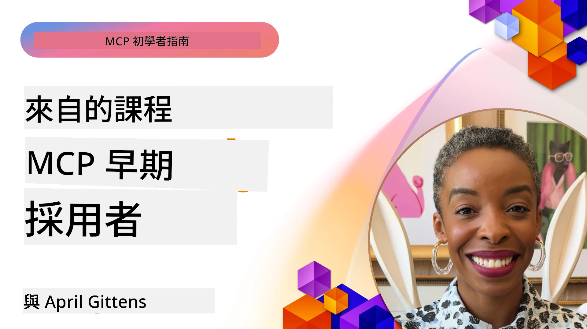

# 🌟 早期採用者的經驗教訓

[](https://youtu.be/jds7dSmNptE)

_(點擊上方圖片觀看此課程影片)_

## 🎯 本模組涵蓋內容

本模組探討真實組織和開發者如何運用模型上下文協議（MCP）解決實際挑戰並推動創新。透過詳細的案例研究、實作專案和實際範例，你將發現 MCP 如何實現安全、可擴展的 AI 整合，連接語言模型、工具及企業數據。

### 📚 觀看 MCP 實例

想親眼看這些原則如何應用於可投入生產的工具嗎？請參考我們的[**10 個正在改變開發者生產力的 Microsoft MCP 伺服器**](microsoft-mcp-servers.md)，展示你今天就能使用的真實 Microsoft MCP 伺服器。

## 概述

本課程探討早期採用者如何運用模型上下文協議（MCP）解決真實世界的挑戰、推動跨行業創新。透過詳細案例研究及實作專案，你將看到 MCP 如何實現標準化、安全且可擴展的 AI 整合——在統一架構下串接大型語言模型、工具與企業數據。你將實際體驗設計及打造基於 MCP 的解決方案，學習經過驗證的實作模式，以及掌握將 MCP 部署於生產環境的最佳做法。課程同時強調新興趨勢、未來方向與開源資源，幫助你站在 MCP 技術及其生態系的最前端。

## 學習目標

- 分析不同行業中真實的 MCP 實作案例  
- 設計與建構完整的基於 MCP 的應用  
- 探索 MCP 技術的新興趨勢與未來方向  
- 在真實開發場景中應用最佳實務  

## 真實世界 MCP 實作案例

### 案例研究 1：企業客戶支援自動化

某跨國企業實作基於 MCP 的解決方案，標準化其客戶支援系統中的 AI 互動。這讓他們能：

- 建立多個 LLM 供應商的統一介面  
- 維持部門間一致的提示管理  
- 實施強化的安全與合規控管  
- 根據需求輕鬆切換不同 AI 模型  

**技術實作：**

```python
# Python MCP 服務器實現，用於客戶支援
import logging
import asyncio
from modelcontextprotocol import create_server, ServerConfig
from modelcontextprotocol.server import MCPServer
from modelcontextprotocol.transports import create_http_transport
from modelcontextprotocol.resources import ResourceDefinition
from modelcontextprotocol.prompts import PromptDefinition
from modelcontextprotocol.tool import ToolDefinition

# 配置日誌記錄
logging.basicConfig(level=logging.INFO)

async def main():
    # 建立服務器配置
    config = ServerConfig(
        name="Enterprise Customer Support Server",
        version="1.0.0",
        description="MCP server for handling customer support inquiries"
    )
    
    # 初始化 MCP 服務器
    server = create_server(config)
    
    # 註冊知識庫資源
    server.resources.register(
        ResourceDefinition(
            name="customer_kb",
            description="Customer knowledge base documentation"
        ),
        lambda params: get_customer_documentation(params)
    )
    
    # 註冊提示模板
    server.prompts.register(
        PromptDefinition(
            name="support_template",
            description="Templates for customer support responses"
        ),
        lambda params: get_support_templates(params)
    )
    
    # 註冊支援工具
    server.tools.register(
        ToolDefinition(
            name="ticketing",
            description="Create and update support tickets"
        ),
        handle_ticketing_operations
    )
    
    # 使用 HTTP 傳輸啟動服務器
    transport = create_http_transport(port=8080)
    await server.run(transport)

if __name__ == "__main__":
    asyncio.run(main())
```
  
**成果：** 模型成本降低 30%，回應一致性提升 45%，並加強全球業務的合規性。

### 案例研究 2：醫療診斷助手

某醫療提供者構建 MCP 基礎架構，整合多個專業醫療 AI 模型，同時確保病患敏感資料受到保護：

- 平滑切換通用與專科醫療模型  
- 嚴格的隱私控管與審計追蹤  
- 與既有電子病歷（EHR）系統整合  
- 醫療術語的提示工程一致性  

**技術實作：**

```csharp
// C# MCP host application implementation in healthcare application
using Microsoft.Extensions.DependencyInjection;
using ModelContextProtocol.SDK.Client;
using ModelContextProtocol.SDK.Security;
using ModelContextProtocol.SDK.Resources;

public class DiagnosticAssistant
{
    private readonly MCPHostClient _mcpClient;
    private readonly PatientContext _patientContext;
    
    public DiagnosticAssistant(PatientContext patientContext)
    {
        _patientContext = patientContext;
        
        // Configure MCP client with healthcare-specific settings
        var clientOptions = new ClientOptions
        {
            Name = "Healthcare Diagnostic Assistant",
            Version = "1.0.0",
            Security = new SecurityOptions
            {
                Encryption = EncryptionLevel.Medical,
                AuditEnabled = true
            }
        };
        
        _mcpClient = new MCPHostClientBuilder()
            .WithOptions(clientOptions)
            .WithTransport(new HttpTransport("https://healthcare-mcp.example.org"))
            .WithAuthentication(new HIPAACompliantAuthProvider())
            .Build();
    }
    
    public async Task<DiagnosticSuggestion> GetDiagnosticAssistance(
        string symptoms, string patientHistory)
    {
        // Create request with appropriate resources and tool access
        var resourceRequest = new ResourceRequest
        {
            Name = "patient_records",
            Parameters = new Dictionary<string, object>
            {
                ["patientId"] = _patientContext.PatientId,
                ["requestingProvider"] = _patientContext.ProviderId
            }
        };
        
        // Request diagnostic assistance using appropriate prompt
        var response = await _mcpClient.SendPromptRequestAsync(
            promptName: "diagnostic_assistance",
            parameters: new Dictionary<string, object>
            {
                ["symptoms"] = symptoms,
                patientHistory = patientHistory,
                relevantGuidelines = _patientContext.GetRelevantGuidelines()
            });
            
        return DiagnosticSuggestion.FromMCPResponse(response);
    }
}
```
  
**成果：** 提升醫師診斷建議準確度，同時完全符合 HIPAA，並顯著減少系統間的上下文切換。

### 案例研究 3：金融服務風險分析

某金融機構運用 MCP 標準化風險分析流程，覆蓋不同部門：

- 建立信用風險、詐欺偵測與投資風險模型的統一介面  
- 執行嚴格存取控管與模型版本管控  
- 確保所有 AI 建議的可審計性  
- 維持跨系統一致的資料格式  

**技術實作：**

```java
// 用於金融風險評估的 Java MCP 服務器
import org.mcp.server.*;
import org.mcp.security.*;

public class FinancialRiskMCPServer {
    public static void main(String[] args) {
        // 建立具有金融合規功能的 MCP 服務器
        MCPServer server = new MCPServerBuilder()
            .withModelProviders(
                new ModelProvider("risk-assessment-primary", new AzureOpenAIProvider()),
                new ModelProvider("risk-assessment-audit", new LocalLlamaProvider())
            )
            .withPromptTemplateDirectory("./compliance/templates")
            .withAccessControls(new SOCCompliantAccessControl())
            .withDataEncryption(EncryptionStandard.FINANCIAL_GRADE)
            .withVersionControl(true)
            .withAuditLogging(new DatabaseAuditLogger())
            .build();
            
        server.addRequestValidator(new FinancialDataValidator());
        server.addResponseFilter(new PII_RedactionFilter());
        
        server.start(9000);
        
        System.out.println("Financial Risk MCP Server running on port 9000");
    }
}
```
  
**成果：** 強化法規遵循，模型部署週期加快 40%，部門間風險評估一致性提升。

### 案例研究 4：Microsoft Playwright MCP 伺服器用於瀏覽器自動化

微軟開發了 [Playwright MCP 伺服器](https://github.com/microsoft/playwright-mcp)，透過模型上下文協議實現安全、標準化的瀏覽器自動化。此量產等級伺服器允許 AI 代理和 LLM 以受控、可審計且可擴展的方式與網頁瀏覽器互動，支持自動化網頁測試、資料擷取與端對端工作流程等應用。

> **🎯 生產準備工具**  
> 此案例展示你今天就能使用的真實 MCP 伺服器！了解 Playwright MCP Server 及另外 9 個生產準備的 Microsoft MCP 伺服器，請參閱我們的[**Microsoft MCP 伺服器指南**](microsoft-mcp-servers.md#8--playwright-mcp-server)。

**主要功能：**  
- 將瀏覽器自動化功能（導航、表單填寫、截圖等）作為 MCP 工具暴露  
- 實作嚴格的存取控管與沙箱機制以防止未授權操作  
- 提供所有瀏覽器互動的詳細審計日誌  
- 支援與 Azure OpenAI 及其他 LLM 供應商整合，以實現代理驅動自動化  
- 為 GitHub Copilot 的程式碼代理賦能網頁瀏覽功能  

**技術實作：**

```typescript
// TypeScript：在 MCP 伺服器中註冊 Playwright 瀏覽器自動化工具
import { createServer, ToolDefinition } from 'modelcontextprotocol';
import { launch } from 'playwright';

const server = createServer({
  name: 'Playwright MCP Server',
  version: '1.0.0',
  description: 'MCP server for browser automation using Playwright'
});

// 註冊一個用於導航至 URL 並捕捉截圖的工具
server.tools.register(
  new ToolDefinition({
    name: 'navigate_and_screenshot',
    description: 'Navigate to a URL and capture a screenshot',
    parameters: {
      url: { type: 'string', description: 'The URL to visit' }
    }
  }),
  async ({ url }) => {
    const browser = await launch();
    const page = await browser.newPage();
    await page.goto(url);
    const screenshot = await page.screenshot();
    await browser.close();
    return { screenshot };
  }
);

// 啟動 MCP 伺服器
server.listen(8080);
```
  
**成果：**  

- 實現 AI 代理和 LLM 的安全程式化瀏覽器自動化  
- 降低手動測試工作量並提升網頁應用的測試覆蓋率  
- 提供可重用、可擴展的瀏覽器工具整合框架用於企業環境  
- 支援 GitHub Copilot 的網頁瀏覽功能  

**參考資料：**  

- [Playwright MCP Server GitHub 倉庫](https://github.com/microsoft/playwright-mcp)  
- [Microsoft AI 與自動化解決方案](https://azure.microsoft.com/en-us/products/ai-services/)

### 案例研究 5：Azure MCP – 企業級模型上下文協議即服務

Azure MCP 伺服器 ([https://aka.ms/azmcp](https://aka.ms/azmcp)) 是微軟管理的企業級模型上下文協議實作，設計為雲端服務，提供可擴展、安全並符合規範的 MCP 伺服器功能。Azure MCP 協助組織快速部署、管理並整合 MCP 伺服器與 Azure AI、資料及安全服務，減少營運負擔、加速 AI 採用。

> **🎯 生產準備工具**  
> 這是你今天就能使用的真實 MCP 伺服器！欲了解 Azure AI Foundry MCP Server，請參閱我們的[**Microsoft MCP 伺服器指南**](microsoft-mcp-servers.md)。

- 完整管理的 MCP 伺服器託管，含內建擴展、監控與安全功能  
- 原生整合 Azure OpenAI、Azure AI Search 與其他 Azure 服務  
- 透過 Microsoft Entra ID 提供企業級認證與授權  
- 支援自訂工具、提示範本及資源連接器  
- 符合企業安全及法規要求  

**技術實作：**

```yaml
# Example: Azure MCP server deployment configuration (YAML)
apiVersion: mcp.microsoft.com/v1
kind: McpServer
metadata:
  name: enterprise-mcp-server
spec:
  modelProviders:
    - name: azure-openai
      type: AzureOpenAI
      endpoint: https://<your-openai-resource>.openai.azure.com/
      apiKeySecret: <your-azure-keyvault-secret>
  tools:
    - name: document_search
      type: AzureAISearch
      endpoint: https://<your-search-resource>.search.windows.net/
      apiKeySecret: <your-azure-keyvault-secret>
  authentication:
    type: EntraID
    tenantId: <your-tenant-id>
  monitoring:
    enabled: true
    logAnalyticsWorkspace: <your-log-analytics-id>
```
  
**成果：**  
- 透過提供即用且合規的 MCP 伺服器平台，縮短企業 AI 項目價值落地時間  
- 簡化 LLM、工具與企業數據源整合  
- 強化 MCP 工作負載的安全性、可觀測性與營運效率  
- 依據 Azure SDK 最佳實務與最新認證模式提升代碼品質  

**參考資料：**  
- [Azure MCP 文件](https://aka.ms/azmcp)  
- [Azure MCP Server GitHub 倉庫](https://github.com/Azure/azure-mcp)  
- [Azure AI 服務](https://azure.microsoft.com/en-us/products/ai-services/)  
- [Microsoft MCP 中心](https://mcp.azure.com)

## 案例研究 6：NLWeb  
MCP（模型上下文協議）是一種新興協議，用於聊天機器人與 AI 助手與工具互動。每個 NLWeb 實例同時也是 MCP 伺服器，支援一個核心方法 ask，用於以自然語言向網站提問。返回的回覆利用 schema.org，一個廣泛使用的網頁資料描述詞彙。粗略來說，MCP 對 NLWeb 就如 HTTP 對 HTML。NLWeb 結合協議、Schema.org 格式及範例程式碼，幫助網站快速建立這類端點，讓人類藉由對話介面受益，並透過自然代理對代理互動帶給機器便利。

NLWeb 有兩個明顯組件。  
- 一個非常簡單的協議，開始即能以自然語言介面與網站互動，並利用 json 與 schema.org 格式回復答案。詳見 REST API 文件。  
- 一個簡易實現（1），利用現有標記，適用於可抽象為項目列表（產品、食譜、景點、評論等）的網站。配合一套使用者介面元件，網站能輕鬆為其內容提供對話式介面。詳見聊天查詢流程文件說明其運作方式。  

**參考資料：**  
- [Azure MCP 文件](https://aka.ms/azmcp)  
- [NLWeb](https://github.com/microsoft/NlWeb)

### 案例研究 7：Azure AI Foundry MCP 伺服器 – 企業 AI 代理整合

Azure AI Foundry MCP 伺服器示範 MCP 如何在企業環境中協調和管理 AI 代理及工作流程。透過整合 MCP 與 Azure AI Foundry，組織能標準化代理互動、利用 Foundry 工作流程管理，並確保安全且可擴展的部署。

> **🎯 生產準備工具**  
> 這是你今天就能使用的真實 MCP 伺服器！欲了解 Azure AI Foundry MCP Server，請參閱我們的[**Microsoft MCP 伺服器指南**](microsoft-mcp-servers.md#9--azure-ai-foundry-mcp-server)。

**主要功能：**  
- 全面存取 Azure AI 生態系統，包括模型目錄與部署管理  
- 利用 Azure AI Search 的知識索引以支援 RAG 應用  
- AI 模型性能評估與品質保證工具  
- 與 Azure AI Foundry 目錄與 Labs 整合，支援前沿研究模型  
- 生產場景的代理管理與評估能力  

**成果：**  
- 快速原型開發及強健的 AI 代理工作流程監控  
- 與 Azure AI 服務無縫整合以支援高階場景  
- 建置、部署與監控代理流程的統一介面  
- 改善企業安全性、合規性與營運效率  
- 加速 AI 採用，同時掌控複雜代理驅動流程  

**參考資料：**  
- [Azure AI Foundry MCP Server GitHub 倉庫](https://github.com/azure-ai-foundry/mcp-foundry)  
- [Azure AI 代理與 MCP 整合（Microsoft Foundry 部落格）](https://devblogs.microsoft.com/foundry/integrating-azure-ai-agents-mcp/)

### 案例研究 8：Foundry MCP Playground – 試驗與原型開發

Foundry MCP Playground 提供即用環境，方便試驗 MCP 伺服器及 Azure AI Foundry 整合。開發者能快速原型、測試與評估 AI 模型及代理工作流程，利用 Azure AI Foundry 目錄與 Labs 的資源。此遊樂場簡化設置，提供範例專案並支援協作開發，輕鬆探索最佳實務及新場景，減少基礎架構負擔。對於驗證構想、分享實驗與加速學習的團隊尤其有用。降低門檻，有助於推動 MCP 及 Azure AI Foundry 生態系的創新與社群貢獻。

**參考資料：**  

- [Foundry MCP Playground GitHub 倉庫](https://github.com/azure-ai-foundry/foundry-mcp-playground)

### 案例研究 9：Microsoft Learn Docs MCP Server – AI 驅動文件訪問

Microsoft Learn Docs MCP Server 是雲端服務，透過模型上下文協議，讓 AI 助手能即時存取官方 Microsoft 文件。此量產等級伺服器連結完整的 Microsoft Learn 生態系，支持跨所有官方 Microsoft 資源的語意搜尋。

> **🎯 生產準備工具**  
> 這是你今天就能使用的真實 MCP 伺服器！欲了解 Microsoft Learn Docs MCP Server，請參閱我們的[**Microsoft MCP 伺服器指南**](microsoft-mcp-servers.md#1--microsoft-learn-docs-mcp-server)。

**主要功能：**  
- 即時存取官方 Microsoft 文件、Azure 文件及 Microsoft 365 文件  
- 具上下文及意圖理解的進階語意搜尋能力  
- 隨 Microsoft Learn 內容發佈，資料永遠更新  
- 全面覆蓋 Microsoft Learn、Azure 文件與 Microsoft 365 資源  
- 返回最多 10 篇高質量內容片段，包括文章標題與 URL  

**為何關鍵：**  
- 解決 Microsoft 技術「過時 AI 知識」問題  
- 確保 AI 助手能存取最新 .NET、C#、Azure 與 Microsoft 365 功能  
- 提供權威一手資訊，確保程式碼產生準確  
- 對快速演進的 Microsoft 技術開發者至關重要  

**成果：**  
- 大幅提升 AI 產生 Microsoft 技術相關程式碼的準確度  
- 減少搜尋最新文件與最佳實踐的時間  
- 透過上下文感知的文件擷取提升開發者生產力  
- 與開發流程無縫整合，無需離開 IDE  

**參考資料：**  
- [Microsoft Learn Docs MCP Server GitHub 倉庫](https://github.com/MicrosoftDocs/mcp)  
- [Microsoft Learn 文件](https://learn.microsoft.com/)

## 實作專案

### 專案 1：建置多供應商 MCP 伺服器

**目標：** 建立一個 MCP 伺服器，依特定條件將請求路由至多個 AI 模型供應商。

**需求：**

- 支援至少三個不同模型供應商（例如 OpenAI、Anthropic、本地模型）  
- 根據請求元數據實作路由機制  
- 建立配置系統以管理供應商認證資訊  
- 新增快取以優化效能與成本  
- 建置簡單的監控儀表板  

**實作步驟：**

1. 建立基本 MCP 伺服器基礎架構  
2. 為每個 AI 模型服務實作供應商適配器  
3. 根據請求屬性建立路由邏輯  
4. 新增頻繁請求的快取機制  
5. 開發監控儀表板  
6. 以多種請求模式測試  

**技術選擇：** 擇用 Python（或 .NET/Java 根據偏好）、Redis 作為快取，以及簡易網頁框架打造儀表板。

### 專案 2：企業級提示管理系統
**目標：** 開發一個基於 MCP 的系統，用於管理、版本控制及跨組織部署提示模板。

**需求：**

- 建立一個提示模板的集中儲存庫
- 實作版本控制及審批工作流程
- 建立模板測試功能及範例輸入
- 發展基於角色的存取控制
- 建立一個用於模板檢索及部署的 API

**實作步驟：**

1. 設計模板儲存的資料庫架構
2. 建立模板 CRUD（建立、讀取、更新、刪除）操作的核心 API
3. 實作版本控制系統
4. 建立審批工作流程
5. 發展測試框架
6. 建立一個簡單的管理網頁介面
7. 與 MCP 伺服器整合

**技術：** 由您選擇適合的後端框架、SQL 或 NoSQL 資料庫，以及前端管理介面框架。

### 專案 3：基於 MCP 的內容生成平台

**目標：** 建立一個內容生成平台，利用 MCP 以在不同內容類型中提供一致結果。

**需求：**

- 支援多種內容格式（博客文章、社交媒體、行銷文案）
- 實作基於模板的生成並具有自訂選項
- 建立內容審核與反饋系統
- 追蹤內容績效指標
- 支援內容版本及迭代

**實作步驟：**

1. 設置 MCP 客戶端基礎設施
2. 為不同內容類型建立模板
3. 建構內容生成流程
4. 實作審核系統
5. 建立績效追蹤系統
6. 創建用於模板管理及內容生成的使用者介面

**技術：** 由您選擇喜好的程式語言、網頁框架及資料庫系統。

## MCP 技術的未來方向

### 新興趨勢

1. **多模態 MCP**
   - 擴展 MCP 以標準化與影像、音訊及視訊模型的互動
   - 發展跨模態推理能力
   - 為不同模態制訂標準化的提示格式

2. **聯邦 MCP 基礎設施**
   - 分散式 MCP 網路，可於組織間共享資源
   - 用於安全模型分享的標準化協議
   - 隱私保護計算技術

3. **MCP 市場平台**
   - 用於分享及變現 MCP 模板與外掛的生態系統
   - 品質保證及認證流程
   - 與模型市場整合

4. **用於邊緣運算的 MCP**
   - 適配 MCP 標準以支援資源受限的邊緣裝置
   - 為低頻寬環境優化的協議
   - 專為物聯網生態系統設計的 MCP 實作

5. **監管框架**
   - 為監管合規性開發的 MCP 擴展
   - 標準化的審計追蹤及解釋介面
   - 與新興 AI 治理框架整合

### 微軟的 MCP 解決方案

微軟和 Azure 開發了多個開源儲存庫，協助開發者在不同場景中實作 MCP：

#### Microsoft 組織

1. [playwright-mcp](https://github.com/microsoft/playwright-mcp) - 用於瀏覽器自動化及測試的 Playwright MCP 伺服器
2. [files-mcp-server](https://github.com/microsoft/files-mcp-server) - OneDrive MCP 伺服器實作，用於本地測試及社群貢獻
3. [NLWeb](https://github.com/microsoft/NlWeb) - NLWeb 是一套開放協議及相關開源工具，重點是建立 AI 網路的基礎層

#### Azure-Samples 組織

1. [mcp](https://github.com/Azure-Samples/mcp) - 連結多語言中建立及整合 Azure 上 MCP 伺服器的範例、工具及資源
2. [mcp-auth-servers](https://github.com/Azure-Samples/mcp-auth-servers) - 示範與目前模型上下文協議規範認證相關的 MCP 伺服器
3. [remote-mcp-functions](https://github.com/Azure-Samples/remote-mcp-functions) - Azure Functions 中遠端 MCP 伺服器實作的入口頁，含語言特定儲存庫連結
4. [remote-mcp-functions-python](https://github.com/Azure-Samples/remote-mcp-functions-python) - 使用 Python 在 Azure Functions 上構建及部署自訂遠端 MCP 伺服器的快速入門模板
5. [remote-mcp-functions-dotnet](https://github.com/Azure-Samples/remote-mcp-functions-dotnet) - 使用 .NET/C# 在 Azure Functions 上構建及部署自訂遠端 MCP 伺服器的快速入門模板
6. [remote-mcp-functions-typescript](https://github.com/Azure-Samples/remote-mcp-functions-typescript) - 使用 TypeScript 在 Azure Functions 上構建及部署自訂遠端 MCP 伺服器的快速入門模板
7. [remote-mcp-apim-functions-python](https://github.com/Azure-Samples/remote-mcp-apim-functions-python) - 將 Azure API 管理作為 AI 閘道對遠端 MCP 伺服器的整合（Python 版）
8. [AI-Gateway](https://github.com/Azure-Samples/AI-Gateway) - APIM ❤️ AI 實驗，包括 MCP 功能，整合 Azure OpenAI 及 AI Foundry

這些儲存庫提供多種 MCP 模型上下文協議的實作、模板及資源，涵蓋從基礎伺服器到認證、雲端部署及企業整合場景，適用多種程式語言及 Azure 服務。

#### MCP 資源目錄

官方 Microsoft MCP 儲存庫中的 [MCP Resources 目錄](https://github.com/microsoft/mcp/tree/main/Resources) 提供經策劃的範例資源、提示模板及工具定義，供 MCP 伺服器使用。此目錄旨在幫助開發者快速起步 MCP，提供可重用組件及最佳實踐範例，包括：

- **提示模板：** 針對常見 AI 任務與場景的即用型提示模板，可適用於您的 MCP 伺服器實作。
- **工具定義：** 標準化工具整合與調用所需的工具結構及元資料範例。
- **資源範例：** 連接數據源、API 及外部服務的資源定義範例，適用於 MCP 框架。
- **參考實作：** 實用範例展示如何在實際 MCP 專案中結構化及組織資源、提示及工具。

這些資源加速開發、促進標準化，並協助確保構建及部署基於 MCP 的解決方案時遵循最佳實踐。

#### MCP 資源目錄

- [MCP Resources（範例提示、工具及資源定義）](https://github.com/microsoft/mcp/tree/main/Resources)

### 研究機會

- MCP 框架中的高效率提示優化技術
- 多租戶 MCP 部署的安全模型
- 不同 MCP 實作的效能基準測試
- MCP 伺服器的形式化驗證方法

## 結論

模型上下文協議（MCP）正迅速塑造產業中標準化、安全及互操作的 AI 整合未來。透過本課程中的案例研究與實作專案，您已見證包括微軟及 Azure 在內的先行者，如何利用 MCP 解決真實世界挑戰、加速 AI 採用，並確保合規、安全及可擴展性。MCP 的模組化架構使組織可在統一且可審計的框架中連接大型語言模型、工具及企業數據。隨著 MCP 持續演進，積極參與社群、探索開源資源並應用最佳實踐，將是打造堅實且迎接未來的 AI 解決方案的關鍵。

## 額外資源

- [MCP Foundry GitHub 儲存庫](https://github.com/azure-ai-foundry/mcp-foundry)
- [Foundry MCP Playground](https://github.com/azure-ai-foundry/foundry-mcp-playground)
- [整合 Azure AI 代理與 MCP（Microsoft Foundry 部落格）](https://devblogs.microsoft.com/foundry/integrating-azure-ai-agents-mcp/)
- [MCP GitHub 儲存庫（微軟）](https://github.com/microsoft/mcp)
- [MCP 資源目錄（範例提示、工具及資源定義）](https://github.com/microsoft/mcp/tree/main/Resources)
- [MCP 社群與文件](https://modelcontextprotocol.io/introduction)
- [MCP 規範（2025-11-25）](https://spec.modelcontextprotocol.io/specification/2025-11-25/)
- [Azure MCP 文件](https://aka.ms/azmcp)
- [OWASP MCP 十大](https://microsoft.github.io/mcp-azure-security-guide/mcp/) - 安全最佳實踐
- [Playwright MCP 伺服器 GitHub 儲存庫](https://github.com/microsoft/playwright-mcp)
- [Files MCP 伺服器（OneDrive）](https://github.com/microsoft/files-mcp-server)
- [Azure-Samples MCP](https://github.com/Azure-Samples/mcp)
- [MCP 認證伺服器（Azure-Samples）](https://github.com/Azure-Samples/mcp-auth-servers)
- [Remote MCP Functions（Azure-Samples）](https://github.com/Azure-Samples/remote-mcp-functions)
- [Remote MCP Functions Python（Azure-Samples）](https://github.com/Azure-Samples/remote-mcp-functions-python)
- [Remote MCP Functions .NET（Azure-Samples）](https://github.com/Azure-Samples/remote-mcp-functions-dotnet)
- [Remote MCP Functions TypeScript（Azure-Samples）](https://github.com/Azure-Samples/remote-mcp-functions-typescript)
- [Remote MCP APIM Functions Python（Azure-Samples）](https://github.com/Azure-Samples/remote-mcp-apim-functions-python)
- [AI-Gateway（Azure-Samples）](https://github.com/Azure-Samples/AI-Gateway)
- [微軟 AI 及自動化解決方案](https://azure.microsoft.com/en-us/products/ai-services/)

## 練習題

1. 分析其中一個案例研究並提出另一種實作方案。
2. 選擇一個專案構想並撰寫詳細技術規格。
3. 研究案例研究未涵蓋的一個產業，概要說明 MCP 如何解決其特定挑戰。
4. 探索未來方向之一，創建一個支援該方向的新 MCP 擴展概念。

## 下一步

繼續探索：[Microsoft MCP 伺服器](./microsoft-mcp-servers.md)

前往：[第 8 單元：最佳實踐](../08-BestPractices/README.md)

---

<!-- CO-OP TRANSLATOR DISCLAIMER START -->
**免責聲明**：
本文件乃使用 AI 翻譯服務 [Co-op Translator](https://github.com/Azure/co-op-translator) 所翻譯。雖然我們致力於翻譯準確，但請注意自動翻譯可能包含錯誤或不準確之處。文件之原文版本應被視為權威來源。對於重要資訊，建議採用專業人工翻譯。本公司對因使用本翻譯而產生之任何誤解或誤釋概不負責。
<!-- CO-OP TRANSLATOR DISCLAIMER END -->