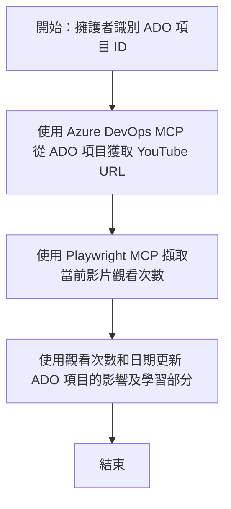

# Case Study: 使用 MCP 從 YouTube 數據更新 Azure DevOps 項目

> **免責聲明：** 已有現成的線上工具和報告可自動將來自 YouTube 等平台的數據更新至 Azure DevOps 項目。以下情境純粹作為示範用例，展示如何使用 MCP 工具進行自動化和整合任務。

## 概述

本案例展示了模型上下文協定（MCP）及其工具如何用以自動化從線上平台（如 YouTube）擷取資訊並更新 Azure DevOps（ADO）工作項目的流程。所描述的情境只是這些工具更廣泛功能的一個示範，可適用於許多相似的自動化需求。

在此範例中，一位倡導者使用 ADO 項目追蹤線上會議，每個項目包含一個 YouTube 影片網址。透過 MCP 工具，倡導者能以可重複、自動化的方式，將最新的影片觀看次數等數據同步更新至 ADO 項目。此方法亦可推廣至需要將線上來源資訊整合至 ADO 或其他系統的其他應用。

## 情境說明

一名倡導者負責追蹤線上會議和社群互動的影響力。每場會議會以 ADO 工作項目記錄，該項目位於「DevRel」專案中，且含有 YouTube 影片網址欄位。為準確報告會議觸及範圍，倡導者須更新 ADO 項目，紀錄最新的影片觀看次數及資訊擷取日期。

## 使用工具

- [Azure DevOps MCP](https://github.com/microsoft/azure-devops-mcp)：透過 MCP 程式化存取及更新 ADO 工作項目。
- [Playwright MCP](https://github.com/microsoft/playwright-mcp)：自動化瀏覽器動作，從 YouTube 網頁擷取即時影片統計數據。

## 逐步工作流程

1. **辨識 ADO 項目**：從「DevRel」專案取得 ADO 工作項目 ID（如 1234）。
2. **擷取 YouTube URL**：利用 Azure DevOps MCP 工具讀取該工作項目的 YouTube 影片網址。
3. **擷取觀看數**：使用 Playwright MCP 自動瀏覽該 YouTube 網址，擷取當前觀看次數。
4. **更新 ADO 項目**：透過 Azure DevOps MCP 工具，在 ADO 工作項目的「影響及學習」欄位寫入最新觀看數及擷取日期。

## 範例指令

```bash
- Work with the ADO Item ID: 1234
- The project is '2025-Awesome'
- Get the YouTube URL for the ADO item
- Use Playwright to get the current views from the YouTube video
- Update the ADO item with the current video views and the updated date of the information
```

## Mermaid 流程圖


## 技術實作

- **MCP 調度**：此流程由 MCP 伺服器協調，連動 Azure DevOps MCP 和 Playwright MCP 工具。
- **自動化**：流程可手動執行或設定定時自動觸發，以維持 ADO 項目資料更新。
- **擴充性**：此模式可延伸至更新 ADO 項目的其他線上度量數據（如按讚、留言），或自其他平台擷取。

## 結果與影響

- **效率提升**：減少倡導者手動擷取及更新影片指標的工時。
- **準確性**：確保 ADO 項目反映線上來源的最新數據。
- **重複利用**：提供可重用的工作流程，適用於其他數據來源或度量的相似情境。

## 參考資料

- [Azure DevOps MCP](https://github.com/microsoft/azure-devops-mcp)
- [Playwright MCP](https://github.com/microsoft/playwright-mcp)
- [模型上下文協定 (MCP)](https://modelcontextprotocol.io/)

## 接下來

- 返回: [案例研究總覽](./README.md)
- 下一步: [使用 MCP 即時文件擷取](./docs-mcp/README.md)

---

<!-- CO-OP TRANSLATOR DISCLAIMER START -->
**免責聲明**：  
本文件乃使用 AI 翻譯服務 [Co-op Translator](https://github.com/Azure/co-op-translator) 翻譯所得。雖然我們力求準確，但請留意自動翻譯可能包含錯誤或不準確之處。原始文件之母語版本應視為權威來源。對於重要資訊，建議採用專業人工翻譯。我們不對使用本翻譯所引致之任何誤解或誤釋承擔責任。
<!-- CO-OP TRANSLATOR DISCLAIMER END -->